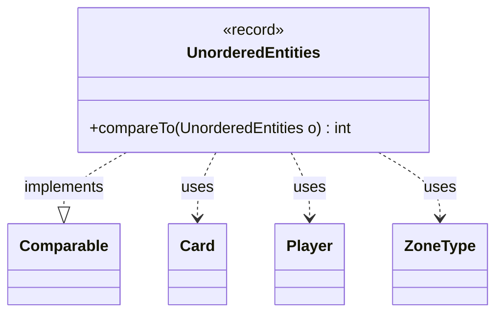

---
aliases:
  - UnorderedEntities
tags:
  - java/record
  - module/forge-game
  - pkg/forge/game
fqn: forge.game.GameSnapshot.UnorderedEntities
package: forge.game
module: forge-game
kind: Record
---

# UnorderedEntities

**Package:** `forge.game`   **Module:** `forge-game`   **Kind:** Record



## Relationships
**Uses:**
- [[forge.game.card.Card|Card]]
- [[forge.game.player.Player|Player]]
- [[forge.game.zone.ZoneType|ZoneType]]

## Design Description

UnorderedEntities is a private, immutable record nested within `GameSnapshot`, capturing the data needed to relocate a single game entity during snapshot restoration: the owning `Player`, the original and replacement `Card` instances, the source `ZoneType`, and an integer position within that zone. By implementing `Comparable<UnorderedEntities>`, it provides a natural ordering based solely on `zonePosition`, allowing collections of these entries to be sorted so cards are reinstated into their zones in the correct sequence.

As a record, it leans on compiler-generated accessors, equality, and construction, keeping the type a lightweight value carrier. Its restricted visibility signals it is an internal implementation detail of the snapshot mechanism, collaborating with the core `Card`, `Player`, and `ZoneType` domain types purely to stage entity placement rather than to expose any behavior of its own.

## Source
`forge-game/src/main/java/forge/game/GameSnapshot.java` — declaration excerpt

```java
    private record UnorderedEntities(
        Player toPlayer, Card fromCard, Card newCard, ZoneType fromType, int zonePosition
    ) implements Comparable<UnorderedEntities> {
        @Override
        public int compareTo(UnorderedEntities o) {
            return Integer.compare(this.zonePosition, o.zonePosition);
        }
    }
```

## Python
`forge/game/GameSnapshot/UnorderedEntities.py`

```python
from forge.game.card.Card import Card
from forge.game.player.Player import Player
from forge.game.zone.ZoneType import ZoneType


class UnorderedEntities:
    def __init__(self, toPlayer: Player, fromCard: Card, newCard: Card, fromType: ZoneType, zonePosition: int):
        self.toPlayer = toPlayer
        self.fromCard = fromCard
        self.newCard = newCard
        self.fromType = fromType
        self.zonePosition = zonePosition

    def compareTo(self, o: "UnorderedEntities") -> int:
        return (self.zonePosition > o.zonePosition) - (self.zonePosition < o.zonePosition)
```
