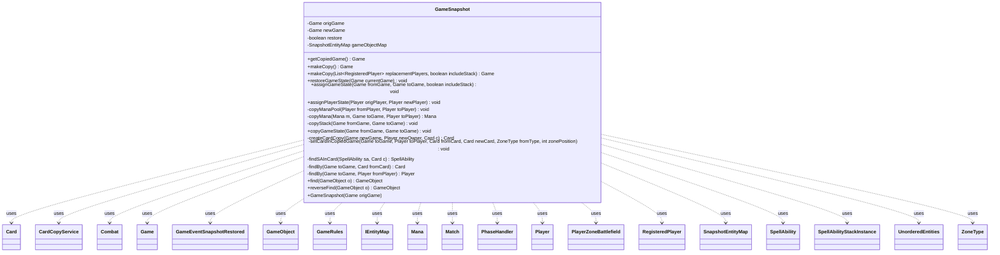

---
aliases:
  - GameSnapshot
tags:
  - java/class
  - module/forge-game
  - pkg/forge/game
fqn: forge.game.GameSnapshot
package: forge.game
module: forge-game
kind: Class
---

# GameSnapshot

**Package:** `forge.game`   **Module:** `forge-game`   **Kind:** Class



## Relationships
**Uses:**
- [[forge.game.Game|Game]]
- [[forge.game.GameObject|GameObject]]
- [[forge.game.GameRules|GameRules]]
- [[forge.game.GameSnapshot.SnapshotEntityMap|SnapshotEntityMap]]
- [[forge.game.GameSnapshot.UnorderedEntities|UnorderedEntities]]
- [[forge.game.IEntityMap|IEntityMap]]
- [[forge.game.Match|Match]]
- [[forge.game.card.Card|Card]]
- [[forge.game.card.CardCopyService|CardCopyService]]
- [[forge.game.combat.Combat|Combat]]
- [[forge.game.event.GameEventSnapshotRestored|GameEventSnapshotRestored]]
- [[forge.game.mana.Mana|Mana]]
- [[forge.game.phase.PhaseHandler|PhaseHandler]]
- [[forge.game.player.Player|Player]]
- [[forge.game.player.RegisteredPlayer|RegisteredPlayer]]
- [[forge.game.spellability.SpellAbility|SpellAbility]]
- [[forge.game.spellability.SpellAbilityStackInstance|SpellAbilityStackInstance]]
- [[forge.game.zone.PlayerZoneBattlefield|PlayerZoneBattlefield]]
- [[forge.game.zone.ZoneType|ZoneType]]

## Design Description

GameSnapshot captures and restores the complete state of a Forge `Game`, enabling features such as save/restore, AI lookahead, and rollback. Given an original game, `makeCopy` builds a parallel `Game` (with its own `Match`, `GameRules`, and `RegisteredPlayer`s) and deep-copies all state into it; `restoreGameState` runs the same transfer in reverse, firing `GameEventSnapshotRestored` events around the operation. The bulk of the work — players, life totals, counters, mana pools, card zones and positions, attachments, the stack, and combat — is performed by `assignGameState` and its helpers, delegating per-card duplication to `CardCopyService`.

Its central design concern is identity remapping: every `GameObject`, `Card`, and `Player` reference must be translated between the two game instances. This is handled by `findBy` ID-lookups and the inner `SnapshotEntityMap` (an `IEntityMap`), which direction-aware `find`/`reverseFind` and the `restore` flag drive. Triggers are suppressed during the bulk copy to prevent spurious zone-change effects, and ordered-zone cards are deferred via `UnorderedEntities` so positions are reconstructed faithfully.

## Source
`forge-game/src/main/java/forge/game/GameSnapshot.java`

```java
package forge.game;

import com.google.common.collect.Lists;
import com.google.common.collect.Maps;
import forge.game.card.Card;
import forge.game.card.CardCopyService;
import forge.game.combat.Combat;
import forge.game.event.GameEventSnapshotRestored;
import forge.game.mana.Mana;
import forge.game.phase.PhaseHandler;
import forge.game.player.Player;
import forge.game.player.RegisteredPlayer;
import forge.game.spellability.SpellAbility;
import forge.game.spellability.SpellAbilityStackInstance;
import forge.game.trigger.TriggerType;
import forge.game.zone.PlayerZoneBattlefield;
import forge.game.zone.ZoneType;

import java.util.Collections;
import java.util.HashMap;
import java.util.List;
import java.util.Map;

public class GameSnapshot {
    private final Game origGame;
    private Game newGame = null;
    private boolean restore = false;

    private final SnapshotEntityMap gameObjectMap = new SnapshotEntityMap();

    public GameSnapshot(Game origGame) {
        this.origGame = origGame;
    }

    public Game getCopiedGame() {
        return origGame;
    }

    public Game makeCopy() {
        return makeCopy(null, true);
    }
    public Game makeCopy(List<RegisteredPlayer> replacementPlayers, boolean includeStack) {
        List<RegisteredPlayer> newPlayers;
        if (replacementPlayers != null) {
            newPlayers = replacementPlayers;
        } else {
            // Create new RegisteredPlayers based off original Match RPs
            newPlayers = Lists.newArrayList(origGame.getMatch().getPlayers());
        }
        GameRules currentRules = origGame.getRules();
        Match newMatch = new Match(currentRules, newPlayers, origGame.getView().getTitle());
        newGame = new Game(newPlayers, currentRules, newMatch);
        restore = false;
        assignGameState(origGame, newGame, includeStack);
        //System.out.println("Storing game state with timestamp of :" + origGame.getTimestamp());

        return newGame;
    }

    public void restoreGameState(Game currentGame) {
        System.out.println("Restoring game state with timestamp of :" + newGame.getTimestamp());
        restore = true;

        currentGame.fireEvent(new GameEventSnapshotRestored(true));
        assignGameState(newGame, currentGame, true);
        currentGame.fireEvent(new GameEventSnapshotRestored(false));
    }

    public void assignGameState(Game fromGame, Game toGame, boolean includeStack) {
        for (int i = 0; i < fromGame.getPlayers().size(); i++) {
            Player origPlayer = fromGame.getPlayers().get(i);
            Player newPlayer = findBy(toGame, origPlayer);
            assignPlayerState(origPlayer, newPlayer);
        }

        PhaseHandler origPhaseHandler = fromGame.getPhaseHandler();
        Player newPlayerTurn = findBy(toGame, origPhaseHandler.getPlayerTurn());
        toGame.getPhaseHandler().devModeSet(origPhaseHandler.getPhase(), newPlayerTurn, origPhaseHandler.getTurn());
        toGame.getTriggerHandler().suppressMode(TriggerType.ChangesZone);
        for (Player p : toGame.getPlayers()) {
            ((PlayerZoneBattlefield) p.getZone(ZoneType.Battlefield)).setTriggers(false);
        }

        copyGameState(fromGame, toGame);

        for (Player p : fromGame.getPlayers()) {
            Player toPlayer = findBy(toGame, p);
            p.copyCommandersToSnapshot(toPlayer, c -> findBy(toGame, c));
            ((PlayerZoneBattlefield) toPlayer.getZone(ZoneType.Battlefield)).setTriggers(true);
        }
        toGame.getTriggerHandler().clearSuppression(TriggerType.ChangesZone);

        for (Card c : toGame.getCardsInGame()) {
            Card origCard = fromGame.findById(c.getId());

            if (origCard == null) {
                // This card doesn't exist in original state
                // What does that mean?
                System.out.println("Missing card " + c);
                continue;
            }

            // Why is this here? This whole area seems wrong
            if (origCard.hasRemembered()) {
                for (Object o : origCard.getRemembered()) {
                    if (o instanceof GameObject) {
                        // Sometimes, a spell can "remember" a token card that's not in any zone
                        // (and thus wouldn't have been copied) - for example Swords to Plowshares
                        // remembering its target for LKI. Skip these to not crash in find().
                        if (o instanceof Card && ((Card)o).getZone() == null) {
                            continue;
                        }
                        // Fix this with something else
                        c.addRemembered(find((GameObject) o));
                    } else {
                        System.err.println(c + " Remembered: " + o + "/" + o.getClass());
                        c.addRemembered(o);
                    }
                }
            }
            // I think this is still wrong, but might be needed for within cost payment?
            for (SpellAbility sa : c.getSpellAbilities()) {
                Player activatingPlayer = sa.getActivatingPlayer();
                if (activatingPlayer != null && activatingPlayer.getGame() != toGame) {
                    sa.setActivatingPlayer(findBy(toGame, activatingPlayer));
                }
            }
        }

        // Undo effects first before calculating them below, to avoid them applying twice.
//        for (StaticEffect effect : fromGame.getStaticEffects().getEffects()) {
//            effect.removeMapped(gameObjectMap);
//        }

        if (origPhaseHandler.getCombat() != null) {
            Combat combat = new Combat(origPhaseHandler.getCombat(), gameObjectMap);
            toGame.getPhaseHandler().setCombat(combat);
            //System.out.println(origPhaseHandler.getCombat().toString());
        }

        // I think re-assigning this is killing something?
        //toGame.getAction().checkStateEffects(true); //ensure state based effects and triggers are updated
//        toGame.getTriggerHandler().resetActiveTriggers();

        if (includeStack) {
            copyStack(fromGame, toGame);
        }

        if (restore) {
            for (Player p : toGame.getPlayers()) {
                p.updateAllZonesForView();
            }

            Combat combat = toGame.getPhaseHandler().getCombat();
            if (combat != null) {
                //System.out.println(combat.toString());
                toGame.updateCombatForView();
            }
            //System.out.println("RESTORED");
        }

        // TODO update thisTurnCast
    }

    public void assignPlayerState(Player origPlayer, Player newPlayer) {
        if (restore) {
            // Player controller of the original player isn't associated with the GUI at this point?
            origPlayer.dangerouslySetController(newPlayer.getController());
        }
        newPlayer.setLife(origPlayer.getLife(), null);
        newPlayer.setLifeLostLastTurn(origPlayer.getLifeLostLastTurn());
        newPlayer.setLifeLostThisTurn(origPlayer.getLifeLostThisTurn());
        newPlayer.setLifeGainedThisTurn(origPlayer.getLifeGainedThisTurn());
        newPlayer.setLifeStartedThisTurnWith(origPlayer.getLifeStartedThisTurnWith());
        newPlayer.setDamageReceivedThisTurn(origPlayer.getDamageReceivedThisTurn());
        newPlayer.setLandsPlayedThisTurn(origPlayer.getLandsPlayedThisTurn());
        newPlayer.setCounters(Maps.newHashMap(origPlayer.getCounters()));
        newPlayer.setBlessing(origPlayer.hasBlessing(), null);
        newPlayer.setLibrarySearched(origPlayer.getLibrarySearched());
        newPlayer.setSpellsCastLastTurn(origPlayer.getSpellsCastLastTurn());
        newPlayer.setCommitedCrimeThisTurn(origPlayer.getCommittedCrimeThisTurn());
        newPlayer.setExpentThisTurn(origPlayer.getExpentThisTurn());
        for (int j = 0; j < origPlayer.getSpellsCastThisTurn(); j++) {
            newPlayer.addSpellCastThisTurn();
        }
        newPlayer.setMaxHandSize(origPlayer.getMaxHandSize());
        newPlayer.setUnlimitedHandSize(origPlayer.isUnlimitedHandSize());
        newPlayer.setCrankCounter(origPlayer.getCrankCounter());
        // TODO creatureAttackedThisTurn

        // Copy mana pool
        copyManaPool(origPlayer, newPlayer);
    }

    private void copyManaPool(Player fromPlayer, Player toPlayer) {
        Game toGame = toPlayer.getGame();
        toPlayer.getManaPool().resetPool();
        for (Mana m : fromPlayer.getManaPool()) {
            toPlayer.getManaPool().addMana(copyMana(m, toGame, toPlayer), false);
        }
        toPlayer.updateManaForView();
    }

    private Mana copyMana(Mana m, Game toGame, Player toPlayer) {
        Card fromCard = m.getSourceCard();
        Card toCard = findBy(toGame, fromCard);
        // Are we copying over mana abilities properly?
        if (toCard == null) {
            return m;
        }
        Mana newMana = new Mana(m.getColor(), toCard, m.getManaAbility(), toPlayer);
        newMana.getManaAbility().setSourceCard(toCard);
        return newMana;
    }

    private void copyStack(Game fromGame, Game toGame) {
        // Try to match the StackInstance ID. If we don't find it, generate a new stack instance that matches
        // If we do find it, we may need to alter the existing stack instance
        // If we find it and we're restoring, we dont need to do anything

        Map<Integer, SpellAbilityStackInstance> stackIds = new HashMap<>();
        for (SpellAbilityStackInstance toEntry : toGame.getStack()) {
            stackIds.put(toEntry.getId(), toEntry);
        }

        for (SpellAbilityStackInstance origEntry : fromGame.getStack()) {
            int id = origEntry.getId();
            SpellAbilityStackInstance instance = stackIds.getOrDefault(id, null);

            if (instance != null) {
                if (!restore) {
                    System.out.println("Might need to alter " + origEntry.getSpellAbility() + " on stack");
                }

                continue;
            }

            System.out.println("Adding " + origEntry.getSpellAbility() + " to stack");

            SpellAbility origSa = origEntry.getSpellAbility();
            Card origHostCard = origSa.getHostCard();
            Card newCard = findBy(toGame, origHostCard);

            if (newCard == null) {
                // IF this card isn't in future world, it's likely a copy
                newCard = createCardCopy(toGame, findBy(toGame, origHostCard.getOwner()), origHostCard);
            }

            // FInd newEntry from origEntrys

            SpellAbility newSa = null;
            if (origSa.isSpell()) {
                newSa = findSAInCard(origSa, newCard);
            }

            // Is the SA on the stack?
            if (newSa != null) {
                newSa.setActivatingPlayer(findBy(toGame, origSa.getActivatingPlayer()));
                if (origSa.usesTargeting()) {
                    for (GameObject o : origSa.getTargets()) {
                        if (o instanceof Card) {
                            newSa.getTargets().add(findBy(toGame, (Card) o));
                        } else if (o instanceof Player) {
                            newSa.getTargets().add(findBy(toGame, (Player) o));
                        } else {
                            System.out.println("Failed to restore target " + o + " for " + origSa);
                        }
                    }
                }
                toGame.getStack().add(newSa, id);
            }
        }
    }

    public void copyGameState(Game fromGame, Game toGame) {
        toGame.setAge(fromGame.getAge());
        toGame.dangerouslySetTimestamp(fromGame.getTimestamp());

        // TODO countersAddedThisTurn

        if (fromGame.getStartingPlayer() != null) {
            toGame.setStartingPlayer(findBy(toGame, fromGame.getStartingPlayer()));
        }
        if (fromGame.getMonarch() != null) {
            toGame.setMonarch(findBy(toGame, fromGame.getMonarch()));
        }
        if (fromGame.getMonarchBeginTurn() != null) {
            toGame.setMonarchBeginTurn(findBy(toGame, fromGame.getMonarchBeginTurn()));
        }
        if (fromGame.getHasInitiative() != null) {
            toGame.setHasInitiative(findBy(toGame, fromGame.getHasInitiative()));
        }
        if (fromGame.getDayTime() != null) {
            toGame.setDayTime(fromGame.getDayTime());
        }

        List<UnorderedEntities> unorderedEntities = Lists.newArrayList();

        for(Card fromCard : fromGame.getCardsInGame()) {
            Card newCard = toGame.findById(fromCard.getId());
            Player toPlayer = findBy(toGame, fromCard.getController());
            ZoneType fromType = fromCard.getZone().getZoneType();
            int zonePosition = 0;
            if (ZoneType.ORDERED_ZONES.contains(fromType)) {
                // If the card is in an ordered zone, we need to find its position in the zone
                // and set it in the new game.
                zonePosition = fromCard.getZone().getCards().indexOf(fromCard);
            }

            if (newCard == null) {
                // Storing a game uses this path...
                newCard = createCardCopy(toGame, toPlayer, fromCard);
            } else {
                ZoneType type = newCard.getZone().getZoneType();
                if (type != fromType) {
                    if (type.equals(ZoneType.Stack)) {
                        toGame.getStackZone().remove(newCard);
                    } else {
                        toPlayer.getZone(type).remove(newCard);
                    }
                }
            }

            if (zonePosition == 0) {
                setCardInCopiedGame(toGame, toPlayer, fromCard, newCard, fromType, zonePosition);
            } else {
                // stash this info
                unorderedEntities.add(new UnorderedEntities(toPlayer, fromCard, newCard, fromType, zonePosition));
            }
        }

        Collections.sort(unorderedEntities);
        for(UnorderedEntities ue : unorderedEntities) {
            setCardInCopiedGame(toGame, ue.toPlayer, ue.fromCard, ue.newCard, ue.fromType, ue.zonePosition);
        }

        // This loop happens later to make sure all cards are in the correct zone first
        for (Card newCard : toGame.getCardsIn(ZoneType.Battlefield)) {
            Card fromCard = fromGame.findById(newCard.getId());

            if (fromCard.isAttachedToEntity()) {
                Card fromAttachedTo = fromCard.getAttachedTo();
                Card newAttachedTo = fromAttachedTo == null ? null : toGame.findById(fromAttachedTo.getId());
                if (newAttachedTo != null) {
                    newCard.setEntityAttachedTo(newAttachedTo);
                    newAttachedTo.addAttachedCard(newCard);
                }
            }
            if (fromCard.getCloneOrigin() != null) {
                newCard.setCloneOrigin(toGame.findById(fromCard.getCloneOrigin().getId()));
            }
            if (fromCard.getHaunting() != null) {
                newCard.setHaunting(toGame.findById(fromCard.getHaunting().getId()));
            }
            if (fromCard.getEffectSource() != null) {
                newCard.setEffectSource(toGame.findById(fromCard.getEffectSource().getId()));
            }
            if (fromCard.isPaired()) {
                newCard.setPairedWith(toGame.findById(fromCard.getPairedWith().getId()));
            }
            if (fromCard.getCopiedPermanent() != null) {
                newCard.setCopiedPermanent(toGame.findById(fromCard.getCopiedPermanent().getId()));
            }
            // TODO: Verify that the above relationships are preserved bi-directionally or not.
        }
    }

    private Card createCardCopy(Game newGame, Player newOwner, Card c) {
        Card newCard = new CardCopyService(c, newGame).copyCard(false, newOwner);
        newCard.dangerouslySetGame(newGame);
        return newCard;
    }

    private void setCardInCopiedGame(Game toGame, Player toPlayer, Card fromCard, Card newCard, ZoneType fromType, int zonePosition) {
        // Things should be sorted before getting here, so don't try to put it into its zone position
        //System.out.println("Setting card " + newCard + " at position " + zonePosition + " in " + toPlayer + "'s "+ fromType);
        if (fromType.equals(ZoneType.Stack)) {
            toGame.getStackZone().add(newCard);
            newCard.setZone(toGame.getStackZone());
        } else {
            toPlayer.getZone(fromType).add(newCard);
            newCard.setZone(toPlayer.getZone(fromType));
        }

        // TODO: This is a bit of a mess. We should probably have a method to copy a card's state.
        newCard.setGameTimestamp(fromCard.getGameTimestamp());
        newCard.setLayerTimestamp(fromCard.getLayerTimestamp());
        newCard.setTapped(fromCard.isTapped());
        newCard.setFaceDown(fromCard.isFaceDown());
        newCard.setManifested(fromCard.getManifestedSA());
        newCard.setSickness(fromCard.hasSickness());
        //newCard.setForetold(fromCard.isForetold());
        //newCard.setForetoldCostByEffect(fromCard.isForetoldCostByEffect());
        newCard.setState(fromCard.getCurrentStateName(), false);
    }

    private static SpellAbility findSAInCard(SpellAbility sa, Card c) {
        String saDesc = sa.getDescription();
        for (SpellAbility cardSa : c.getAllSpellAbilities()) {
            if (saDesc.equals(cardSa.getDescription())) {
                return cardSa;
            }
        }

        Map<String, String> origMap = sa.getOriginalMapParams();
        for (SpellAbility cardSa : c.getAllSpellAbilities()) {
            if (origMap.equals(cardSa.getOriginalMapParams())) {
                return cardSa;
            }
        }


        return null;
    }

    private record UnorderedEntities(
        Player toPlayer, Card fromCard, Card newCard, ZoneType fromType, int zonePosition
    ) implements Comparable<UnorderedEntities> {
        @Override
        public int compareTo(UnorderedEntities o) {
            return Integer.compare(this.zonePosition, o.zonePosition);
        }
    }

    public class SnapshotEntityMap implements IEntityMap {
        @Override
        public Game getGame() {
            if (restore) {
                return origGame;
            }
            return newGame;
        }

        @Override
        public GameObject map(GameObject o) {
            if (o instanceof Player) {
                return findBy(getGame(), (Player) o);
            } else if (o instanceof Card) {
                return findBy(getGame(), (Card) o);
            }
            return null;
        }

        @Override
        public Card map(final Card c) {
            return findBy(getGame(), c);
        }

        @Override
        public Player map(final Player p) {
            return findBy(getGame(), p);
        }
    }

    private Card findBy(Game toGame, Card fromCard) {
        return toGame.findById(fromCard.getId());
    }

    private Player findBy(Game toGame, Player fromPlayer) {
        return toGame.getPlayer(fromPlayer.getId());
    }

    public GameObject find(GameObject o) {
        // Is this finding the object in the new game?
        if (o instanceof Card) {
            return findBy(newGame, (Card) o);
        } else if (o instanceof Player) {
            return findBy(newGame, (Player) o);
        }

        return null;
    }
    public GameObject reverseFind(GameObject o) {
        // Is this finding the object in the orig game?
        if (o instanceof Card) {
            return findBy(origGame, (Card) o);
        } else if (o instanceof Player) {
            return findBy(origGame, (Player) o);
        }

        return null;
    }
}
```

## Python
`forge/game/GameSnapshot.py`

```python
from forge.game.Game import Game
from forge.game.GameObject import GameObject
from forge.game.GameRules import GameRules
from forge.game.IEntityMap import IEntityMap
from forge.game.Match import Match
from forge.game.card.Card import Card
from forge.game.card.CardCopyService import CardCopyService
from forge.game.combat.Combat import Combat
from forge.game.event.GameEventSnapshotRestored import GameEventSnapshotRestored
from forge.game.mana.Mana import Mana
from forge.game.phase.PhaseHandler import PhaseHandler
from forge.game.player.Player import Player
from forge.game.player.RegisteredPlayer import RegisteredPlayer
from forge.game.spellability.SpellAbility import SpellAbility
from forge.game.spellability.SpellAbilityStackInstance import SpellAbilityStackInstance
from forge.game.trigger.TriggerType import TriggerType
from forge.game.zone.PlayerZoneBattlefield import PlayerZoneBattlefield
from forge.game.zone.ZoneType import ZoneType


class GameSnapshot:
    def __init__(self, origGame):
        self.origGame = origGame
        self.newGame = None
        self.restore = False
        self.gameObjectMap = GameSnapshot.SnapshotEntityMap(self)

    def getCopiedGame(self):
        return self.origGame

    def makeCopy(self, replacementPlayers=None, includeStack=True):
        if replacementPlayers is not None:
            newPlayers = replacementPlayers
        else:
            # Create new RegisteredPlayers based off original Match RPs
            newPlayers = list(self.origGame.getMatch().getPlayers())
        currentRules = self.origGame.getRules()
        newMatch = Match(currentRules, newPlayers, self.origGame.getView().getTitle())
        self.newGame = Game(newPlayers, currentRules, newMatch)
        self.restore = False
        self.assignGameState(self.origGame, self.newGame, includeStack)
        # System.out.println("Storing game state with timestamp of :" + origGame.getTimestamp());

        return self.newGame

    def restoreGameState(self, currentGame):
        print("Restoring game state with timestamp of :" + str(self.newGame.getTimestamp()))
        self.restore = True

        currentGame.fireEvent(GameEventSnapshotRestored(True))
        self.assignGameState(self.newGame, currentGame, True)
        currentGame.fireEvent(GameEventSnapshotRestored(False))

    def assignGameState(self, fromGame, toGame, includeStack):
        for i in range(len(fromGame.getPlayers())):
            origPlayer = fromGame.getPlayers().get(i)
            newPlayer = self.findBy(toGame, origPlayer)
            self.assignPlayerState(origPlayer, newPlayer)

        origPhaseHandler = fromGame.getPhaseHandler()
        newPlayerTurn = self.findBy(toGame, origPhaseHandler.getPlayerTurn())
        toGame.getPhaseHandler().devModeSet(origPhaseHandler.getPhase(), newPlayerTurn, origPhaseHandler.getTurn())
        toGame.getTriggerHandler().suppressMode(TriggerType.ChangesZone)
        for p in toGame.getPlayers():
            p.getZone(ZoneType.Battlefield).setTriggers(False)

        self.copyGameState(fromGame, toGame)

        for p in fromGame.getPlayers():
            toPlayer = self.findBy(toGame, p)
            p.copyCommandersToSnapshot(toPlayer, lambda c: self.findBy(toGame, c))
            toPlayer.getZone(ZoneType.Battlefield).setTriggers(True)
        toGame.getTriggerHandler().clearSuppression(TriggerType.ChangesZone)

        for c in toGame.getCardsInGame():
            origCard = fromGame.findById(c.getId())

            if origCard is None:
                # This card doesn't exist in original state
                # What does that mean?
                print("Missing card " + str(c))
                continue

            # Why is this here? This whole area seems wrong
            if origCard.hasRemembered():
                for o in origCard.getRemembered():
                    if isinstance(o, GameObject):
                        # Sometimes, a spell can "remember" a token card that's not in any zone
                        # (and thus wouldn't have been copied) - for example Swords to Plowshares
                        # remembering its target for LKI. Skip these to not crash in find().
                        if isinstance(o, Card) and o.getZone() is None:
                            continue
                        # Fix this with something else
                        c.addRemembered(self.find(o))
                    else:
                        print(str(c) + " Remembered: " + str(o) + "/" + str(type(o)))
                        c.addRemembered(o)
            # I think this is still wrong, but might be needed for within cost payment?
            for sa in c.getSpellAbilities():
                activatingPlayer = sa.getActivatingPlayer()
                if activatingPlayer is not None and activatingPlayer.getGame() != toGame:
                    sa.setActivatingPlayer(self.findBy(toGame, activatingPlayer))

        # Undo effects first before calculating them below, to avoid them applying twice.
        #        for (StaticEffect effect : fromGame.getStaticEffects().getEffects()) {
        #            effect.removeMapped(gameObjectMap);
        #        }

        if origPhaseHandler.getCombat() is not None:
            combat = Combat(origPhaseHandler.getCombat(), self.gameObjectMap)
            toGame.getPhaseHandler().setCombat(combat)
            # System.out.println(origPhaseHandler.getCombat().toString());

        # I think re-assigning this is killing something?
        # toGame.getAction().checkStateEffects(true); //ensure state based effects and triggers are updated
        #        toGame.getTriggerHandler().resetActiveTriggers();

        if includeStack:
            self.copyStack(fromGame, toGame)

        if self.restore:
            for p in toGame.getPlayers():
                p.updateAllZonesForView()

            combat = toGame.getPhaseHandler().getCombat()
            if combat is not None:
                # System.out.println(combat.toString());
                toGame.updateCombatForView()
            # System.out.println("RESTORED");

        # TODO update thisTurnCast

    def assignPlayerState(self, origPlayer, newPlayer):
        if self.restore:
            # Player controller of the original player isn't associated with the GUI at this point?
            origPlayer.dangerouslySetController(newPlayer.getController())
        newPlayer.setLife(origPlayer.getLife(), None)
        newPlayer.setLifeLostLastTurn(origPlayer.getLifeLostLastTurn())
        newPlayer.setLifeLostThisTurn(origPlayer.getLifeLostThisTurn())
        newPlayer.setLifeGainedThisTurn(origPlayer.getLifeGainedThisTurn())
        newPlayer.setLifeStartedThisTurnWith(origPlayer.getLifeStartedThisTurnWith())
        newPlayer.setDamageReceivedThisTurn(origPlayer.getDamageReceivedThisTurn())
        newPlayer.setLandsPlayedThisTurn(origPlayer.getLandsPlayedThisTurn())
        newPlayer.setCounters(dict(origPlayer.getCounters()))
        newPlayer.setBlessing(origPlayer.hasBlessing(), None)
        newPlayer.setLibrarySearched(origPlayer.getLibrarySearched())
        newPlayer.setSpellsCastLastTurn(origPlayer.getSpellsCastLastTurn())
        newPlayer.setCommitedCrimeThisTurn(origPlayer.getCommittedCrimeThisTurn())
        newPlayer.setExpentThisTurn(origPlayer.getExpentThisTurn())
        for j in range(origPlayer.getSpellsCastThisTurn()):
            newPlayer.addSpellCastThisTurn()
        newPlayer.setMaxHandSize(origPlayer.getMaxHandSize())
        newPlayer.setUnlimitedHandSize(origPlayer.isUnlimitedHandSize())
        newPlayer.setCrankCounter(origPlayer.getCrankCounter())
        # TODO creatureAttackedThisTurn

        # Copy mana pool
        self.copyManaPool(origPlayer, newPlayer)

    def copyManaPool(self, fromPlayer, toPlayer):
        toGame = toPlayer.getGame()
        toPlayer.getManaPool().resetPool()
        for m in fromPlayer.getManaPool():
            toPlayer.getManaPool().addMana(self.copyMana(m, toGame, toPlayer), False)
        toPlayer.updateManaForView()

    def copyMana(self, m, toGame, toPlayer):
        fromCard = m.getSourceCard()
        toCard = self.findBy(toGame, fromCard)
        # Are we copying over mana abilities properly?
        if toCard is None:
            return m
        newMana = Mana(m.getColor(), toCard, m.getManaAbility(), toPlayer)
        newMana.getManaAbility().setSourceCard(toCard)
        return newMana

    def copyStack(self, fromGame, toGame):
        # Try to match the StackInstance ID. If we don't find it, generate a new stack instance that matches
        # If we do find it, we may need to alter the existing stack instance
        # If we find it and we're restoring, we dont need to do anything

        stackIds = {}
        for toEntry in toGame.getStack():
            stackIds[toEntry.getId()] = toEntry

        for origEntry in fromGame.getStack():
            id = origEntry.getId()
            instance = stackIds.get(id, None)

            if instance is not None:
                if not self.restore:
                    print("Might need to alter " + str(origEntry.getSpellAbility()) + " on stack")

                continue

            print("Adding " + str(origEntry.getSpellAbility()) + " to stack")

            origSa = origEntry.getSpellAbility()
            origHostCard = origSa.getHostCard()
            newCard = self.findBy(toGame, origHostCard)

            if newCard is None:
                # IF this card isn't in future world, it's likely a copy
                newCard = self.createCardCopy(toGame, self.findBy(toGame, origHostCard.getOwner()), origHostCard)

            # FInd newEntry from origEntrys

            newSa = None
            if origSa.isSpell():
                newSa = self.findSAInCard(origSa, newCard)

            # Is the SA on the stack?
            if newSa is not None:
                newSa.setActivatingPlayer(self.findBy(toGame, origSa.getActivatingPlayer()))
                if origSa.usesTargeting():
                    for o in origSa.getTargets():
                        if isinstance(o, Card):
                            newSa.getTargets().add(self.findBy(toGame, o))
                        elif isinstance(o, Player):
                            newSa.getTargets().add(self.findBy(toGame, o))
                        else:
                            print("Failed to restore target " + str(o) + " for " + str(origSa))
                toGame.getStack().add(newSa, id)

    def copyGameState(self, fromGame, toGame):
        toGame.setAge(fromGame.getAge())
        toGame.dangerouslySetTimestamp(fromGame.getTimestamp())

        # TODO countersAddedThisTurn

        if fromGame.getStartingPlayer() is not None:
            toGame.setStartingPlayer(self.findBy(toGame, fromGame.getStartingPlayer()))
        if fromGame.getMonarch() is not None:
            toGame.setMonarch(self.findBy(toGame, fromGame.getMonarch()))
        if fromGame.getMonarchBeginTurn() is not None:
            toGame.setMonarchBeginTurn(self.findBy(toGame, fromGame.getMonarchBeginTurn()))
        if fromGame.getHasInitiative() is not None:
            toGame.setHasInitiative(self.findBy(toGame, fromGame.getHasInitiative()))
        if fromGame.getDayTime() is not None:
            toGame.setDayTime(fromGame.getDayTime())

        unorderedEntities = []

        for fromCard in fromGame.getCardsInGame():
            newCard = toGame.findById(fromCard.getId())
            toPlayer = self.findBy(toGame, fromCard.getController())
            fromType = fromCard.getZone().getZoneType()
            zonePosition = 0
            if fromType in ZoneType.ORDERED_ZONES:
                # If the card is in an ordered zone, we need to find its position in the zone
                # and set it in the new game.
                zonePosition = fromCard.getZone().getCards().indexOf(fromCard)

            if newCard is None:
                # Storing a game uses this path...
                newCard = self.createCardCopy(toGame, toPlayer, fromCard)
            else:
                type = newCard.getZone().getZoneType()
                if type != fromType:
                    if type == ZoneType.Stack:
                        toGame.getStackZone().remove(newCard)
                    else:
                        toPlayer.getZone(type).remove(newCard)

            if zonePosition == 0:
                self.setCardInCopiedGame(toGame, toPlayer, fromCard, newCard, fromType, zonePosition)
            else:
                # stash this info
                unorderedEntities.append(
                    GameSnapshot.UnorderedEntities(toPlayer, fromCard, newCard, fromType, zonePosition))

        unorderedEntities.sort()
        for ue in unorderedEntities:
            self.setCardInCopiedGame(toGame, ue.toPlayer, ue.fromCard, ue.newCard, ue.fromType, ue.zonePosition)

        # This loop happens later to make sure all cards are in the correct zone first
        for newCard in toGame.getCardsIn(ZoneType.Battlefield):
            fromCard = fromGame.findById(newCard.getId())

            if fromCard.isAttachedToEntity():
                fromAttachedTo = fromCard.getAttachedTo()
                newAttachedTo = None if fromAttachedTo is None else toGame.findById(fromAttachedTo.getId())
                if newAttachedTo is not None:
                    newCard.setEntityAttachedTo(newAttachedTo)
                    newAttachedTo.addAttachedCard(newCard)
            if fromCard.getCloneOrigin() is not None:
                newCard.setCloneOrigin(toGame.findById(fromCard.getCloneOrigin().getId()))
            if fromCard.getHaunting() is not None:
                newCard.setHaunting(toGame.findById(fromCard.getHaunting().getId()))
            if fromCard.getEffectSource() is not None:
                newCard.setEffectSource(toGame.findById(fromCard.getEffectSource().getId()))
            if fromCard.isPaired():
                newCard.setPairedWith(toGame.findById(fromCard.getPairedWith().getId()))
            if fromCard.getCopiedPermanent() is not None:
                newCard.setCopiedPermanent(toGame.findById(fromCard.getCopiedPermanent().getId()))
            # TODO: Verify that the above relationships are preserved bi-directionally or not.

    def createCardCopy(self, newGame, newOwner, c):
        newCard = CardCopyService(c, newGame).copyCard(False, newOwner)
        newCard.dangerouslySetGame(newGame)
        return newCard

    def setCardInCopiedGame(self, toGame, toPlayer, fromCard, newCard, fromType, zonePosition):
        # Things should be sorted before getting here, so don't try to put it into its zone position
        # System.out.println("Setting card " + newCard + " at position " + zonePosition + " in " + toPlayer + "'s "+ fromType);
        if fromType == ZoneType.Stack:
            toGame.getStackZone().add(newCard)
            newCard.setZone(toGame.getStackZone())
        else:
            toPlayer.getZone(fromType).add(newCard)
            newCard.setZone(toPlayer.getZone(fromType))

        # TODO: This is a bit of a mess. We should probably have a method to copy a card's state.
        newCard.setGameTimestamp(fromCard.getGameTimestamp())
        newCard.setLayerTimestamp(fromCard.getLayerTimestamp())
        newCard.setTapped(fromCard.isTapped())
        newCard.setFaceDown(fromCard.isFaceDown())
        newCard.setManifested(fromCard.getManifestedSA())
        newCard.setSickness(fromCard.hasSickness())
        # newCard.setForetold(fromCard.isForetold());
        # newCard.setForetoldCostByEffect(fromCard.isForetoldCostByEffect());
        newCard.setState(fromCard.getCurrentStateName(), False)

    @staticmethod
    def findSAInCard(sa, c):
        saDesc = sa.getDescription()
        for cardSa in c.getAllSpellAbilities():
            if saDesc == cardSa.getDescription():
                return cardSa

        origMap = sa.getOriginalMapParams()
        for cardSa in c.getAllSpellAbilities():
            if origMap == cardSa.getOriginalMapParams():
                return cardSa

        return None

    class UnorderedEntities:
        def __init__(self, toPlayer, fromCard, newCard, fromType, zonePosition):
            self.toPlayer = toPlayer
            self.fromCard = fromCard
            self.newCard = newCard
            self.fromType = fromType
            self.zonePosition = zonePosition

        def compareTo(self, o):
            return (self.zonePosition > o.zonePosition) - (self.zonePosition < o.zonePosition)

        def __lt__(self, o):
            return self.zonePosition < o.zonePosition

    class SnapshotEntityMap(IEntityMap):
        def __init__(self, outer):
            self._outer = outer

        def getGame(self):
            if self._outer.restore:
                return self._outer.origGame
            return self._outer.newGame

        def map(self, o):
            if isinstance(o, Player):
                return self._outer.findBy(self.getGame(), o)
            elif isinstance(o, Card):
                return self._outer.findBy(self.getGame(), o)
            return None

    def findBy(self, toGame, fromObj):
        if isinstance(fromObj, Player):
            return toGame.getPlayer(fromObj.getId())
        return toGame.findById(fromObj.getId())

    def find(self, o):
        # Is this finding the object in the new game?
        if isinstance(o, Card):
            return self.findBy(self.newGame, o)
        elif isinstance(o, Player):
            return self.findBy(self.newGame, o)

        return None

    def reverseFind(self, o):
        # Is this finding the object in the orig game?
        if isinstance(o, Card):
            return self.findBy(self.origGame, o)
        elif isinstance(o, Player):
            return self.findBy(self.origGame, o)

        return None
```
