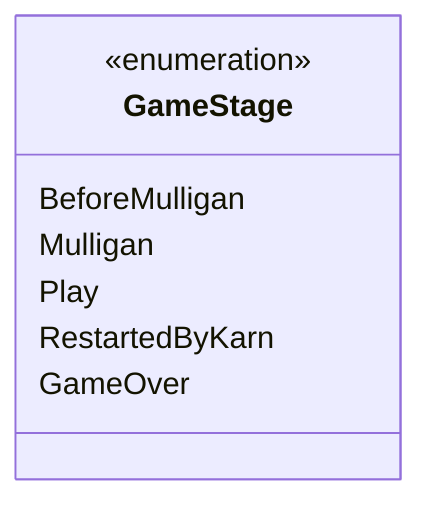

---
aliases:
  - GameStage
tags:
  - java/enum
  - module/forge-game
  - pkg/forge/game
fqn: forge.game.GameStage
package: forge.game
module: forge-game
kind: Enum
---

# GameStage

**Package:** `forge.game` &nbsp; **Module:** `forge-game` &nbsp; **Kind:** Enum



## Design Description

A finite state machine enumeration that models the lifecycle phases of a Forge game, from pre-game setup through active play to termination. As a simple Java enum in the `forge.game` package, `GameStage` provides a closed set of mutually exclusive states—`BeforeMulligan`, `Mulligan`, `Play`, `RestartedByKarn`, and `GameOver`—that collaborating game-management types reference to gate stage-appropriate behavior and drive transitions through the game flow. The inclusion of `RestartedByKarn` shows intent to model card-specific restart mechanics (the planeswalker Karn) as a distinct stage rather than folding it into normal play, keeping that special-case transition explicit and traceable in the state model.

## Source
`forge-game/src/main/java/forge/game/GameStage.java`

```java
package forge.game;

public enum GameStage {
    BeforeMulligan,
    Mulligan,
    Play,
    RestartedByKarn,
    GameOver
}
```
