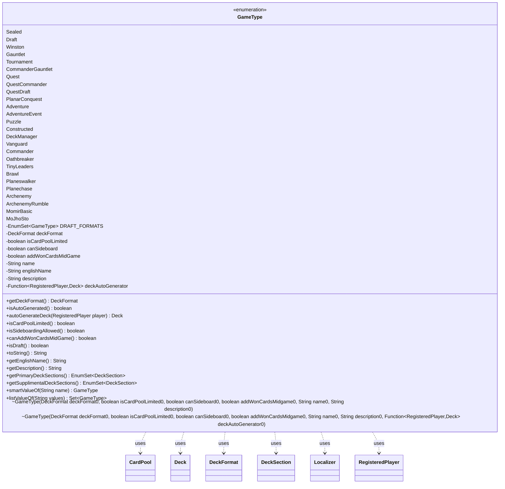

---
aliases:
  - GameType
tags:
  - java/enum
  - module/forge-game
  - pkg/forge/game
fqn: forge.game.GameType
package: forge.game
module: forge-game
kind: Enum
---

# GameType

**Package:** `forge.game`   **Module:** `forge-game`   **Kind:** Enum



## Relationships
**Uses:**
- [[forge.deck.CardPool|CardPool]]
- [[forge.deck.Deck|Deck]]
- [[forge.deck.DeckFormat|DeckFormat]]
- [[forge.deck.DeckSection|DeckSection]]
- [[forge.game.player.RegisteredPlayer|RegisteredPlayer]]
- [[forge.util.Localizer|Localizer]]

## Design Description

GameType is a parameterized enumeration that catalogs every play format the Forge engine supports—from Sealed and Draft through Commander, Brawl, and variant modes like MomirBasic and MoJhoSto—encoding each format's rules as immutable constructor fields: an associated DeckFormat, flags for whether the card pool is limited, sideboarding is permitted, and won cards may be added mid-game, plus localized display names and descriptions resolved through Localizer at construction. It serves as the central registry that other subsystems query to determine deck-building constraints.

Beyond classification, GameType encapsulates behavior: it delegates deck-section queries to its DeckFormat, optionally carries a Function<RegisteredPlayer, Deck> for formats that auto-generate decks (building CardPool contents from StaticData), and offers static smartValueOf/listValueOf parsing helpers for lenient deserialization. The design favors data-driven configuration over subclassing—each constant is a self-describing rule set—keeping format logic centralized and easily extensible.

## Source
`forge-game/src/main/java/forge/game/GameType.java`

```java
package forge.game;

import java.util.EnumSet;
import java.util.Set;
import java.util.function.Function;

import com.google.common.base.Enums;

import forge.StaticData;
import forge.deck.CardPool;
import forge.deck.Deck;
import forge.deck.DeckFormat;
import forge.deck.DeckSection;
import forge.game.player.RegisteredPlayer;
import forge.util.Aggregates;
import forge.util.Localizer;

public enum GameType {

    Sealed              (DeckFormat.Limited, true, true, true, "lblSealed", ""),
    Draft               (DeckFormat.Limited, true, true, true, "lblDraft", ""),
    Winston             (DeckFormat.Limited, true, true, true, "lblWinston", ""),
    Gauntlet            (DeckFormat.Constructed, false, true, true, "lblGauntlet", ""),
    Tournament          (DeckFormat.Constructed, false, true, true, "lblTournament", ""),
    CommanderGauntlet   (DeckFormat.Commander, false, false, false, "lblCommanderGauntlet", "lblCommanderDesc"),
    Quest               (DeckFormat.QuestDeck, true, true, false, "lblQuest", ""),
    QuestCommander      (DeckFormat.Commander, true, true, false, "lblQuestCommander", ""),
    QuestDraft          (DeckFormat.Limited, true, true, true, "lblQuestDraft", ""),
    PlanarConquest      (DeckFormat.PlanarConquest, true, false, false, "lblPlanarConquest", ""),
    Adventure           (DeckFormat.Adventure, true, false, false, "lblAdventure", ""),
    AdventureEvent      (DeckFormat.Limited, true, true, true, "lblAdventure", ""),
    Puzzle              (DeckFormat.Puzzle, false, false, false, "lblPuzzle", "lblPuzzleDesc"),
    Constructed         (DeckFormat.Constructed, false, true, true, "lblConstructed", ""),
    DeckManager         (DeckFormat.Constructed, false, true, true, "lblDeckManager", ""),
    Vanguard            (DeckFormat.Vanguard, true, true, true, "lblVanguard", "lblVanguardDesc"),
    Commander           (DeckFormat.Commander, false, false, false, "lblCommander", "lblCommanderDesc"),
    Oathbreaker         (DeckFormat.Oathbreaker, false, false, false, "lblOathbreaker", "lblOathbreakerDesc"),
    TinyLeaders         (DeckFormat.TinyLeaders, false, false, false, "lblTinyLeaders", "lblTinyLeadersDesc"),
    Brawl               (DeckFormat.Brawl, false, false, false, "lblBrawl", "lblBrawlDesc"),
    Planeswalker        (DeckFormat.PlanarConquest, false, false, true, "lblPlaneswalker", "lblPlaneswalkerDesc"),
    Planechase          (DeckFormat.Planechase, false, false, true, "lblPlanechase", "lblPlanechaseDesc"),
    Archenemy           (DeckFormat.Archenemy, false, false, true, "lblArchenemy", "lblArchenemyDesc"),
    ArchenemyRumble     (DeckFormat.Archenemy, false, false, true, "lblArchenemyRumble", "lblArchenemyRumbleDesc"),
    MomirBasic          (DeckFormat.Constructed, false, false, false, "lblMomirBasic", "lblMomirBasicDesc", player -> {
        Deck deck = new Deck();
        CardPool mainDeck = deck.getMain();
        mainDeck.add(Aggregates.random(StaticData.instance().getCommonCards().getAllCards("Plains"), 12));
        mainDeck.add(Aggregates.random(StaticData.instance().getCommonCards().getAllCards("Island"), 12));
        mainDeck.add(Aggregates.random(StaticData.instance().getCommonCards().getAllCards("Swamp"), 12));
        mainDeck.add(Aggregates.random(StaticData.instance().getCommonCards().getAllCards("Mountain"), 12));
        mainDeck.add(Aggregates.random(StaticData.instance().getCommonCards().getAllCards("Forest"), 12));
        deck.getOrCreate(DeckSection.Avatar).add(StaticData.instance().getVariantCards()
                .getCard("Momir Vig, Simic Visionary Avatar"), 1);
        return deck;
    }),
    MoJhoSto      (DeckFormat.Constructed, false, false, false, "lblMoJhoSto", "lblMoJhoStoDesc", player -> {
        Deck deck = new Deck();
        CardPool mainDeck = deck.getMain();
        mainDeck.add(Aggregates.random(StaticData.instance().getCommonCards().getAllCards("Plains"), 12));
        mainDeck.add(Aggregates.random(StaticData.instance().getCommonCards().getAllCards("Island"), 12));
        mainDeck.add(Aggregates.random(StaticData.instance().getCommonCards().getAllCards("Swamp"), 12));
        mainDeck.add(Aggregates.random(StaticData.instance().getCommonCards().getAllCards("Mountain"), 12));
        mainDeck.add(Aggregates.random(StaticData.instance().getCommonCards().getAllCards("Forest"), 12));
        deck.getOrCreate(DeckSection.Avatar).add(StaticData.instance().getVariantCards()
                .getCard("Momir Vig, Simic Visionary Avatar"), 1);
        deck.getOrCreate(DeckSection.Avatar).add(StaticData.instance().getVariantCards()
                .getCard("Jhoira of the Ghitu Avatar"), 1);
        deck.getOrCreate(DeckSection.Avatar).add(StaticData.instance().getVariantCards()
                .getCard("Stonehewer Giant Avatar"), 1);
        return deck;
    });

    private static final EnumSet<GameType> DRAFT_FORMATS = EnumSet.of(Draft, QuestDraft, AdventureEvent);

    private final DeckFormat deckFormat;
    private final boolean isCardPoolLimited, canSideboard, addWonCardsMidGame;
    private final String name, englishName, description;
    private final Function<RegisteredPlayer, Deck> deckAutoGenerator;

    GameType(DeckFormat deckFormat0, boolean isCardPoolLimited0, boolean canSideboard0, boolean addWonCardsMidgame0, String name0, String description0) {
        this(deckFormat0, isCardPoolLimited0, canSideboard0, addWonCardsMidgame0, name0, description0, null);
    }
    GameType(DeckFormat deckFormat0, boolean isCardPoolLimited0, boolean canSideboard0, boolean addWonCardsMidgame0, String name0, String description0, Function<RegisteredPlayer, Deck> deckAutoGenerator0) {
        final Localizer localizer = forge.util.Localizer.getInstance();
        deckFormat = deckFormat0;
        isCardPoolLimited = isCardPoolLimited0;
        canSideboard = canSideboard0;
        addWonCardsMidGame = addWonCardsMidgame0;
        name = localizer.getMessage(name0);
        englishName = localizer.getEnglishMessage(name0);
        if (!description0.isEmpty()) {
            description0 = localizer.getMessage(description0);
        }
        description = description0;
        deckAutoGenerator = deckAutoGenerator0;
    }

    /**
     * @return the decksFormat
     */
    public DeckFormat getDeckFormat() {
        return deckFormat;
    }

    public boolean isAutoGenerated() {
        return deckAutoGenerator != null;
    }

    public Deck autoGenerateDeck(RegisteredPlayer player) {
        return deckAutoGenerator.apply(player);
    }

    /**
     * @return the isCardpoolLimited
     */
    public boolean isCardPoolLimited() {
        return isCardPoolLimited;
    }

    /**
     * @return the canSideboard
     */
    public boolean isSideboardingAllowed() {
        return canSideboard;
    }

    public boolean canAddWonCardsMidGame() {
        return addWonCardsMidGame;
    }

    public boolean isDraft() {
        return DRAFT_FORMATS.contains(this);
    }

    public String toString() {
        return name;
    }
    public String getEnglishName() {
        return englishName;
    }

    public String getDescription() {
        return description;
    }

    /**
     * @return the deck sections used by most decks in this game type.
     */
    public EnumSet<DeckSection> getPrimaryDeckSections() {
        return deckFormat.getPrimaryDeckSections();
    }

    /**
     * @return the set of variant card sections that decks for this game type can include.
     */
    public EnumSet<DeckSection> getSupplimentalDeckSections() {
        if(!deckFormat.getPrimaryDeckSections().contains(DeckSection.Main))
            return EnumSet.noneOf(DeckSection.class); //Already an extra deck, like a dedicated Scheme or Planar deck.
        if(deckFormat == DeckFormat.Limited)
            return EnumSet.of(DeckSection.Conspiracy, DeckSection.Contraptions, DeckSection.Attractions);
        if(this == Constructed || this == Commander)
            return EnumSet.of(DeckSection.Avatar, DeckSection.Schemes, DeckSection.Planes, DeckSection.Conspiracy,
                    DeckSection.Attractions, DeckSection.Contraptions);
        return EnumSet.of(DeckSection.Attractions, DeckSection.Contraptions);
    }

    public static GameType smartValueOf(String name) {
        return Enums.getIfPresent(GameType.class, name).orNull();
    }

    public static Set<GameType> listValueOf(final String values) {
        final Set<GameType> result = EnumSet.noneOf(GameType.class);
        for (final String s : values.split(",")) {
            GameType g = GameType.smartValueOf(s);
            if (g != null) {
                result.add(g);
            }
        }
        return result;
    }
}
```

## Python
`forge/game/GameType.py`

````python
I'll output the Python port directly.

```python
from enum import Enum
from typing import Callable, Set

from forge.StaticData import StaticData
from forge.deck.CardPool import CardPool
from forge.deck.Deck import Deck
from forge.deck.DeckFormat import DeckFormat
from forge.deck.DeckSection import DeckSection
from forge.game.player.RegisteredPlayer import RegisteredPlayer
from forge.util.Aggregates import Aggregates
from forge.util.Localizer import Localizer


def _momirBasicGenerator(player):
    deck = Deck()
    mainDeck = deck.getMain()
    mainDeck.add(Aggregates.random(StaticData.instance().getCommonCards().getAllCards("Plains"), 12))
    mainDeck.add(Aggregates.random(StaticData.instance().getCommonCards().getAllCards("Island"), 12))
    mainDeck.add(Aggregates.random(StaticData.instance().getCommonCards().getAllCards("Swamp"), 12))
    mainDeck.add(Aggregates.random(StaticData.instance().getCommonCards().getAllCards("Mountain"), 12))
    mainDeck.add(Aggregates.random(StaticData.instance().getCommonCards().getAllCards("Forest"), 12))
    deck.getOrCreate(DeckSection.Avatar).add(StaticData.instance().getVariantCards()
            .getCard("Momir Vig, Simic Visionary Avatar"), 1)
    return deck


def _moJhoStoGenerator(player):
    deck = Deck()
    mainDeck = deck.getMain()
    mainDeck.add(Aggregates.random(StaticData.instance().getCommonCards().getAllCards("Plains"), 12))
    mainDeck.add(Aggregates.random(StaticData.instance().getCommonCards().getAllCards("Island"), 12))
    mainDeck.add(Aggregates.random(StaticData.instance().getCommonCards().getAllCards("Swamp"), 12))
    mainDeck.add(Aggregates.random(StaticData.instance().getCommonCards().getAllCards("Mountain"), 12))
    mainDeck.add(Aggregates.random(StaticData.instance().getCommonCards().getAllCards("Forest"), 12))
    deck.getOrCreate(DeckSection.Avatar).add(StaticData.instance().getVariantCards()
            .getCard("Momir Vig, Simic Visionary Avatar"), 1)
    deck.getOrCreate(DeckSection.Avatar).add(StaticData.instance().getVariantCards()
            .getCard("Jhoira of the Ghitu Avatar"), 1)
    deck.getOrCreate(DeckSection.Avatar).add(StaticData.instance().getVariantCards()
            .getCard("Stonehewer Giant Avatar"), 1)
    return deck


class GameType(Enum):

    Sealed              = (DeckFormat.Limited, True, True, True, "lblSealed", "")
    Draft               = (DeckFormat.Limited, True, True, True, "lblDraft", "")
    Winston             = (DeckFormat.Limited, True, True, True, "lblWinston", "")
    Gauntlet            = (DeckFormat.Constructed, False, True, True, "lblGauntlet", "")
    Tournament          = (DeckFormat.Constructed, False, True, True, "lblTournament", "")
    CommanderGauntlet   = (DeckFormat.Commander, False, False, False, "lblCommanderGauntlet", "lblCommanderDesc")
    Quest               = (DeckFormat.QuestDeck, True, True, False, "lblQuest", "")
    QuestCommander      = (DeckFormat.Commander, True, True, False, "lblQuestCommander", "")
    QuestDraft          = (DeckFormat.Limited, True, True, True, "lblQuestDraft", "")
    PlanarConquest      = (DeckFormat.PlanarConquest, True, False, False, "lblPlanarConquest", "")
    Adventure           = (DeckFormat.Adventure, True, False, False, "lblAdventure", "")
    AdventureEvent      = (DeckFormat.Limited, True, True, True, "lblAdventure", "")
    Puzzle              = (DeckFormat.Puzzle, False, False, False, "lblPuzzle", "lblPuzzleDesc")
    Constructed         = (DeckFormat.Constructed, False, True, True, "lblConstructed", "")
    DeckManager         = (DeckFormat.Constructed, False, True, True, "lblDeckManager", "")
    Vanguard            = (DeckFormat.Vanguard, True, True, True, "lblVanguard", "lblVanguardDesc")
    Commander           = (DeckFormat.Commander, False, False, False, "lblCommander", "lblCommanderDesc")
    Oathbreaker         = (DeckFormat.Oathbreaker, False, False, False, "lblOathbreaker", "lblOathbreakerDesc")
    TinyLeaders         = (DeckFormat.TinyLeaders, False, False, False, "lblTinyLeaders", "lblTinyLeadersDesc")
    Brawl               = (DeckFormat.Brawl, False, False, False, "lblBrawl", "lblBrawlDesc")
    Planeswalker        = (DeckFormat.PlanarConquest, False, False, True, "lblPlaneswalker", "lblPlaneswalkerDesc")
    Planechase          = (DeckFormat.Planechase, False, False, True, "lblPlanechase", "lblPlanechaseDesc")
    Archenemy           = (DeckFormat.Archenemy, False, False, True, "lblArchenemy", "lblArchenemyDesc")
    ArchenemyRumble     = (DeckFormat.Archenemy, False, False, True, "lblArchenemyRumble", "lblArchenemyRumbleDesc")
    MomirBasic          = (DeckFormat.Constructed, False, False, False, "lblMomirBasic", "lblMomirBasicDesc", _momirBasicGenerator)
    MoJhoSto            = (DeckFormat.Constructed, False, False, False, "lblMoJhoSto", "lblMoJhoStoDesc", _moJhoStoGenerator)

    def __init__(self, deckFormat0: DeckFormat, isCardPoolLimited0: bool, canSideboard0: bool, addWonCardsMidgame0: bool, name0: str, description0: str, deckAutoGenerator0: Callable[[RegisteredPlayer], Deck] = None):
        localizer = Localizer.getInstance()
        self.deckFormat = deckFormat0
        self.isCardPoolLimited = isCardPoolLimited0
        self.canSideboard = canSideboard0
        self.addWonCardsMidGame = addWonCardsMidgame0
        self.name = localizer.getMessage(name0)
        self.englishName = localizer.getEnglishMessage(name0)
        if description0:
            description0 = localizer.getMessage(description0)
        self.description = description0
        self.deckAutoGenerator = deckAutoGenerator0

    def getDeckFormat(self) -> DeckFormat:
        return self.deckFormat

    def isAutoGenerated(self) -> bool:
        return self.deckAutoGenerator is not None

    def autoGenerateDeck(self, player: RegisteredPlayer) -> Deck:
        return self.deckAutoGenerator(player)

    def isCardPoolLimited(self) -> bool:
        return self.isCardPoolLimited

    def isSideboardingAllowed(self) -> bool:
        return self.canSideboard

    def canAddWonCardsMidGame(self) -> bool:
        return self.addWonCardsMidGame

    def isDraft(self) -> bool:
        return self in DRAFT_FORMATS

    def __str__(self) -> str:
        return self.name

    def getEnglishName(self) -> str:
        return self.englishName

    def getDescription(self) -> str:
        return self.description

    def getPrimaryDeckSections(self) -> "EnumSet[DeckSection]":
        return self.deckFormat.getPrimaryDeckSections()

    def getSupplimentalDeckSections(self) -> "EnumSet[DeckSection]":
        if DeckSection.Main not in self.deckFormat.getPrimaryDeckSections():
            return set()  # Already an extra deck, like a dedicated Scheme or Planar deck.
        if self.deckFormat == DeckFormat.Limited:
            return {DeckSection.Conspiracy, DeckSection.Contraptions, DeckSection.Attractions}
        if self is GameType.Constructed or self is GameType.Commander:
            return {DeckSection.Avatar, DeckSection.Schemes, DeckSection.Planes, DeckSection.Conspiracy,
                    DeckSection.Attractions, DeckSection.Contraptions}
        return {DeckSection.Attractions, DeckSection.Contraptions}

    @staticmethod
    def smartValueOf(name: str) -> "GameType":
        try:
            return GameType[name]
        except KeyError:
            return None

    @staticmethod
    def listValueOf(values: str) -> Set["GameType"]:
        result = set()
        for s in values.split(","):
            g = GameType.smartValueOf(s)
            if g is not None:
                result.add(g)
        return result


DRAFT_FORMATS = {GameType.Draft, GameType.QuestDraft, GameType.AdventureEvent}
````
