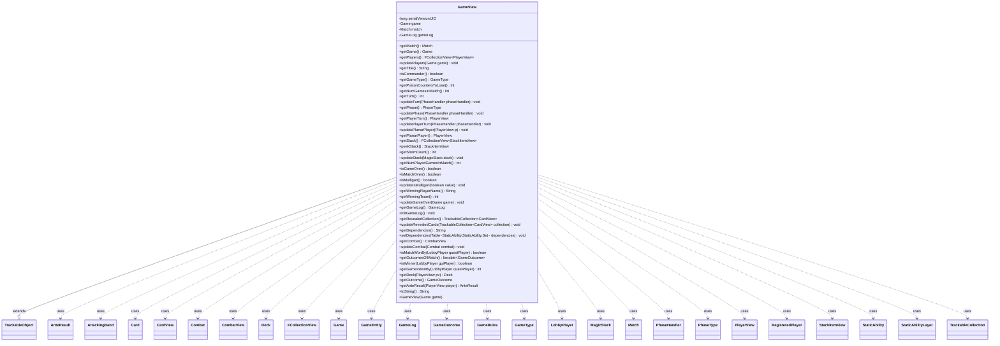

---
aliases:
  - GameView
tags:
  - java/class
  - module/forge-game
  - pkg/forge/game
fqn: forge.game.GameView
package: forge.game
module: forge-game
kind: Class
---

# GameView

**Package:** `forge.game`   **Module:** `forge-game`   **Kind:** Class



## Relationships
**Extends:**
- [[forge.trackable.TrackableObject|TrackableObject]]
**Uses:**
- [[forge.LobbyPlayer|LobbyPlayer]]
- [[forge.deck.Deck|Deck]]
- [[forge.game.Game|Game]]
- [[forge.game.GameEntity|GameEntity]]
- [[forge.game.GameLog|GameLog]]
- [[forge.game.GameOutcome|GameOutcome]]
- [[forge.game.GameOutcome.AnteResult|AnteResult]]
- [[forge.game.GameRules|GameRules]]
- [[forge.game.GameType|GameType]]
- [[forge.game.Match|Match]]
- [[forge.game.card.Card|Card]]
- [[forge.game.card.CardView|CardView]]
- [[forge.game.combat.AttackingBand|AttackingBand]]
- [[forge.game.combat.Combat|Combat]]
- [[forge.game.combat.CombatView|CombatView]]
- [[forge.game.phase.PhaseHandler|PhaseHandler]]
- [[forge.game.phase.PhaseType|PhaseType]]
- [[forge.game.player.PlayerView|PlayerView]]
- [[forge.game.player.RegisteredPlayer|RegisteredPlayer]]
- [[forge.game.spellability.StackItemView|StackItemView]]
- [[forge.game.staticability.StaticAbility|StaticAbility]]
- [[forge.game.staticability.StaticAbilityLayer|StaticAbilityLayer]]
- [[forge.game.zone.MagicStack|MagicStack]]
- [[forge.trackable.TrackableCollection|TrackableCollection]]
- [[forge.util.collect.FCollectionView|FCollectionView]]

## Design Description

GameView is a serializable, GUI-facing snapshot of an in-progress `Game`, extending `TrackableObject` so that its mutable state—turn, phase, active player, stack, combat, mulligan status, and game/match outcome—is stored as `TrackableProperty` values that can be observed and incrementally synchronized to all attached interfaces. It exists to decouple presentation code from the live `Game` engine, exposing read-only accessors over view types (`PlayerView`, `CardView`, `StackItemView`, `CombatView`) rather than core domain objects.

The package-private `update*` methods let the engine push fresh data from sources like `PhaseHandler`, `MagicStack`, and `Combat`, translating them into trackable views and derived figures such as storm count and dependency layers. Notably, the direct `game` and `match` references are `transient` and flagged for removal before network support, signalling an intended migration toward a fully self-contained, deserializable view—`initGameLog` already reconstructs transient state after deserialization—while convenience methods that still reach through `Match`/`Game` are marked as temporary GUI accommodations.

## Source
`forge-game/src/main/java/forge/game/GameView.java`

```java
package forge.game;

import java.util.List;
import java.util.Set;

import com.google.common.collect.Iterables;
import com.google.common.collect.Table;
import com.google.common.collect.Table.Cell;

import forge.LobbyPlayer;
import forge.deck.Deck;
import forge.game.GameOutcome.AnteResult;
import forge.game.card.Card;
import forge.game.card.CardView;
import forge.game.combat.AttackingBand;
import forge.game.combat.Combat;
import forge.game.combat.CombatView;
import forge.game.phase.PhaseHandler;
import forge.game.phase.PhaseType;
import forge.game.player.PlayerView;
import forge.game.player.RegisteredPlayer;
import forge.game.spellability.StackItemView;
import forge.game.staticability.StaticAbility;
import forge.game.staticability.StaticAbilityLayer;
import forge.game.zone.MagicStack;
import forge.trackable.TrackableCollection;
import forge.trackable.TrackableObject;
import forge.trackable.TrackableProperty;
import forge.util.collect.FCollectionView;

public class GameView extends TrackableObject {
    private static final long serialVersionUID = 8522884512960961528L;

    private final transient Game game; //TODO: Remove this when possible before network support added
    private final transient Match match; //TODO: Remove this when possible before network support added
    private transient GameLog gameLog;

    public GameView(final Game game) {
        super(game.getId(), game.getTracker());
        match = game.getMatch();
        this.game = game;
        this.gameLog = game.getGameLog();
        set(TrackableProperty.Title, game.getMatch().getTitle());
        set(TrackableProperty.WinningTeam, -1);

        GameRules rules = game.getRules();
        set(TrackableProperty.IsCommander, rules.hasCommander());
        set(TrackableProperty.GameType, rules.getGameType());
        set(TrackableProperty.PoisonCountersToLose, rules.getPoisonCountersToLose());
        set(TrackableProperty.NumGamesInMatch, rules.getGamesPerMatch());

        set(TrackableProperty.NumPlayedGamesInMatch, game.getMatch().getOutcomes().size());
    }

    public Match getMatch() {
        return match;
    }

    public Game getGame() {
        return game;
    }

    public FCollectionView<PlayerView> getPlayers() {
        return get(TrackableProperty.Players);
    }

    public void updatePlayers(final Game game) {
        set(TrackableProperty.Players, PlayerView.getCollection(game.getPlayers()));
    }

    public String getTitle() {
        return get(TrackableProperty.Title);
    }

    public boolean isCommander() {
        return get(TrackableProperty.IsCommander);
    }

    public GameType getGameType() {
        return get(TrackableProperty.GameType);
    }

    public int getPoisonCountersToLose() {
        return get(TrackableProperty.PoisonCountersToLose);
    }

    public int getNumGamesInMatch() {
        return get(TrackableProperty.NumGamesInMatch);
    }

    public int getTurn() {
        return get(TrackableProperty.Turn);
    }

    void updateTurn(PhaseHandler phaseHandler) {
        set(TrackableProperty.Turn, phaseHandler.getTurn());
    }

    public PhaseType getPhase() {
        return get(TrackableProperty.Phase);
    }

    void updatePhase(PhaseHandler phaseHandler) {
        set(TrackableProperty.Phase, phaseHandler.getPhase());
    }

    public PlayerView getPlayerTurn() {
        return get(TrackableProperty.PlayerTurn);
    }

    void updatePlayerTurn(PhaseHandler phaseHandler) {
        set(TrackableProperty.PlayerTurn, PlayerView.get(phaseHandler.getPlayerTurn()));
    }

    public void updatePlanarPlayer(PlayerView p) {
        set(TrackableProperty.PlanarPlayer, p);
    }

    public PlayerView getPlanarPlayer() {
        return get(TrackableProperty.PlanarPlayer);
    }

    public FCollectionView<StackItemView> getStack() {
        return get(TrackableProperty.Stack);
    }

    public StackItemView peekStack() {
        return Iterables.getFirst(getStack(), null);
    }

    public int getStormCount() {
        return get(TrackableProperty.StormCount);
    }

    void updateStack(final MagicStack stack) {
        set(TrackableProperty.Stack, StackItemView.getCollection(stack));
        set(TrackableProperty.StormCount, stack.getSpellsCastThisTurn().size());
    }

    public int getNumPlayedGamesInMatch() {
        return get(TrackableProperty.NumPlayedGamesInMatch);
    }

    public boolean isGameOver() {
        return get(TrackableProperty.GameOver);
    }

    public boolean isMatchOver() {
        return get(TrackableProperty.MatchOver);
    }

    public boolean isMulligan() {
        return get(TrackableProperty.Mulligan);
    }

    public void updateIsMulligan(boolean value) {
        set(TrackableProperty.Mulligan, value);
    }

    public String getWinningPlayerName() {
        return get(TrackableProperty.WinningPlayerName);
    }

    public int getWinningTeam() {
        return get(TrackableProperty.WinningTeam);
    }

    void updateGameOver(final Game game) {
        set(TrackableProperty.GameOver, game.isGameOver());
        set(TrackableProperty.MatchOver, game.getMatch().isMatchOver());
        if (game.getOutcome() != null && game.getOutcome().getWinningLobbyPlayer() != null) {
            set(TrackableProperty.WinningPlayerName, game.getOutcome().getWinningLobbyPlayer().getName());
        }
        set(TrackableProperty.WinningTeam, game.getOutcome() == null ? -1 : game.getOutcome().getWinningTeam());
    }

    public GameLog getGameLog() {
        return gameLog;
    }

    /** Initialize the game log for network-deserialized GameViews (transient field is null after deserialization). */
    public void initGameLog() {
        this.gameLog = new GameLog();
    }

    public TrackableCollection<CardView> getRevealedCollection() {
        return get(TrackableProperty.RevealedCardsCollection);
    }
    public void updateRevealedCards(TrackableCollection<CardView> collection) {
        set(TrackableProperty.RevealedCardsCollection, collection);
    }

    public String getDependencies() {
        return get(TrackableProperty.Dependencies);
    }
    public void setDependencies(Table<StaticAbility, StaticAbility, Set<StaticAbilityLayer>> dependencies) {
        if (dependencies.isEmpty()) {
            set(TrackableProperty.Dependencies, "");
            return;
        }
        StringBuilder sb = new StringBuilder();
        StaticAbilityLayer layer = null;
        for (StaticAbilityLayer sal : StaticAbilityLayer.CONTINUOUS_LAYERS_WITH_DEPENDENCY) {
            for (Cell<StaticAbility, StaticAbility, Set<StaticAbilityLayer>> dep : dependencies.cellSet()) {
                if (dep.getValue().contains(sal)) {
                    if (layer != sal) {
                        layer = sal;
                        sb.append("Layer " + layer.num).append(": ");
                    }
                    sb.append(dep.getColumnKey().getHostCard().toString()).append(" <- ").append(dep.getRowKey().getHostCard().toString()).append("\n");
                }
            }
        }
        set(TrackableProperty.Dependencies, sb.toString());
    }

    public CombatView getCombat() {
        return get(TrackableProperty.CombatView);
    }

    void updateCombat(Combat combat) {
        if (combat == null) {
            set(TrackableProperty.CombatView, null);
            return;
        }

        final CombatView combatView = new CombatView(combat.getAttackingPlayer().getGame().getTracker());
        for (final AttackingBand b : combat.getAttackingBands()) {
            if (b == null) continue;
            final GameEntity defender = combat.getDefenderByAttacker(b);
            final List<Card> blockers = combat.getBlockers(b);
            final boolean isBlocked = b.isBlocked() == Boolean.TRUE;
            combatView.addAttackingBand(
                    CardView.getCollection(b.getAttackers()),
                    GameEntityView.get(defender),
                    isBlocked ? CardView.getCollection(blockers) : null,
                    CardView.getCollection(blockers));
        }
        set(TrackableProperty.CombatView, combatView);
    }

    //TODO: Find better ways to make this information available to all GUIs without using the Game class

    public boolean isMatchWonBy(LobbyPlayer questPlayer) {
        return getMatch().isWonBy(questPlayer);
    }

    public Iterable<GameOutcome> getOutcomesOfMatch() {
        return getMatch().getOutcomes();
    }

    public boolean isWinner(LobbyPlayer guiPlayer) {
        return getOutcome().isWinner(guiPlayer);
    }

    public int getGamesWonBy(LobbyPlayer questPlayer) {
        return getMatch().getGamesWonBy(questPlayer);
    }

    public Deck getDeck(final PlayerView pv) {
        for (final RegisteredPlayer rp : getMatch().getPlayers()) {
            if (pv.isLobbyPlayer(rp.getPlayer())) {
                return rp.getDeck();
            }
        }
        return null;
    }

    public GameOutcome getOutcome() {
        return getMatch().getOutcomeById(getId());
    }

    public AnteResult getAnteResult(PlayerView player) {
        return getOutcome().getAnteResult(player);
    }

    @Override
    public String toString() {
        return String.format("GameView[id=%d, turn=%d, phase=%s, players=%d, gameOver=%b]",
                getId(), getTurn(), getPhase(),
                getPlayers() != null ? getPlayers().size() : 0,
                isGameOver());
    }
}
```

## Python
`forge/game/GameView.py`

```python
from typing import List, Set

from com.google.common.collect.Iterables import Iterables
from com.google.common.collect.Table import Table
from com.google.common.collect.Table import Cell

from forge.LobbyPlayer import LobbyPlayer
from forge.deck.Deck import Deck
from forge.game.Game import Game
from forge.game.GameEntity import GameEntity
from forge.game.GameEntityView import GameEntityView
from forge.game.GameLog import GameLog
from forge.game.GameOutcome import GameOutcome
from forge.game.GameOutcome.AnteResult import AnteResult
from forge.game.GameRules import GameRules
from forge.game.GameType import GameType
from forge.game.Match import Match
from forge.game.card.Card import Card
from forge.game.card.CardView import CardView
from forge.game.combat.AttackingBand import AttackingBand
from forge.game.combat.Combat import Combat
from forge.game.combat.CombatView import CombatView
from forge.game.phase.PhaseHandler import PhaseHandler
from forge.game.phase.PhaseType import PhaseType
from forge.game.player.PlayerView import PlayerView
from forge.game.player.RegisteredPlayer import RegisteredPlayer
from forge.game.spellability.StackItemView import StackItemView
from forge.game.staticability.StaticAbility import StaticAbility
from forge.game.staticability.StaticAbilityLayer import StaticAbilityLayer
from forge.game.zone.MagicStack import MagicStack
from forge.trackable.TrackableCollection import TrackableCollection
from forge.trackable.TrackableObject import TrackableObject
from forge.trackable.TrackableProperty import TrackableProperty
from forge.util.collect.FCollectionView import FCollectionView


class GameView(TrackableObject):
    serialVersionUID = 8522884512960961528

    def __init__(self, game: Game):
        super().__init__(game.getId(), game.getTracker())
        self.match = game.getMatch()  # TODO: Remove this when possible before network support added
        self.game = game  # TODO: Remove this when possible before network support added
        self.gameLog = game.getGameLog()
        self.set(TrackableProperty.Title, game.getMatch().getTitle())
        self.set(TrackableProperty.WinningTeam, -1)

        rules = game.getRules()
        self.set(TrackableProperty.IsCommander, rules.hasCommander())
        self.set(TrackableProperty.GameType, rules.getGameType())
        self.set(TrackableProperty.PoisonCountersToLose, rules.getPoisonCountersToLose())
        self.set(TrackableProperty.NumGamesInMatch, rules.getGamesPerMatch())

        self.set(TrackableProperty.NumPlayedGamesInMatch, game.getMatch().getOutcomes().size())

    def getMatch(self) -> Match:
        return self.match

    def getGame(self) -> Game:
        return self.game

    def getPlayers(self) -> FCollectionView[PlayerView]:
        return self.get(TrackableProperty.Players)

    def updatePlayers(self, game: Game) -> None:
        self.set(TrackableProperty.Players, PlayerView.getCollection(game.getPlayers()))

    def getTitle(self) -> str:
        return self.get(TrackableProperty.Title)

    def isCommander(self) -> bool:
        return self.get(TrackableProperty.IsCommander)

    def getGameType(self) -> GameType:
        return self.get(TrackableProperty.GameType)

    def getPoisonCountersToLose(self) -> int:
        return self.get(TrackableProperty.PoisonCountersToLose)

    def getNumGamesInMatch(self) -> int:
        return self.get(TrackableProperty.NumGamesInMatch)

    def getTurn(self) -> int:
        return self.get(TrackableProperty.Turn)

    def updateTurn(self, phaseHandler: PhaseHandler) -> None:
        self.set(TrackableProperty.Turn, phaseHandler.getTurn())

    def getPhase(self) -> PhaseType:
        return self.get(TrackableProperty.Phase)

    def updatePhase(self, phaseHandler: PhaseHandler) -> None:
        self.set(TrackableProperty.Phase, phaseHandler.getPhase())

    def getPlayerTurn(self) -> PlayerView:
        return self.get(TrackableProperty.PlayerTurn)

    def updatePlayerTurn(self, phaseHandler: PhaseHandler) -> None:
        self.set(TrackableProperty.PlayerTurn, PlayerView.get(phaseHandler.getPlayerTurn()))

    def updatePlanarPlayer(self, p: PlayerView) -> None:
        self.set(TrackableProperty.PlanarPlayer, p)

    def getPlanarPlayer(self) -> PlayerView:
        return self.get(TrackableProperty.PlanarPlayer)

    def getStack(self) -> FCollectionView[StackItemView]:
        return self.get(TrackableProperty.Stack)

    def peekStack(self) -> StackItemView:
        return Iterables.getFirst(self.getStack(), None)

    def getStormCount(self) -> int:
        return self.get(TrackableProperty.StormCount)

    def updateStack(self, stack: MagicStack) -> None:
        self.set(TrackableProperty.Stack, StackItemView.getCollection(stack))
        self.set(TrackableProperty.StormCount, stack.getSpellsCastThisTurn().size())

    def getNumPlayedGamesInMatch(self) -> int:
        return self.get(TrackableProperty.NumPlayedGamesInMatch)

    def isGameOver(self) -> bool:
        return self.get(TrackableProperty.GameOver)

    def isMatchOver(self) -> bool:
        return self.get(TrackableProperty.MatchOver)

    def isMulligan(self) -> bool:
        return self.get(TrackableProperty.Mulligan)

    def updateIsMulligan(self, value: bool) -> None:
        self.set(TrackableProperty.Mulligan, value)

    def getWinningPlayerName(self) -> str:
        return self.get(TrackableProperty.WinningPlayerName)

    def getWinningTeam(self) -> int:
        return self.get(TrackableProperty.WinningTeam)

    def updateGameOver(self, game: Game) -> None:
        self.set(TrackableProperty.GameOver, game.isGameOver())
        self.set(TrackableProperty.MatchOver, game.getMatch().isMatchOver())
        if game.getOutcome() is not None and game.getOutcome().getWinningLobbyPlayer() is not None:
            self.set(TrackableProperty.WinningPlayerName, game.getOutcome().getWinningLobbyPlayer().getName())
        self.set(TrackableProperty.WinningTeam, -1 if game.getOutcome() is None else game.getOutcome().getWinningTeam())

    def getGameLog(self) -> GameLog:
        return self.gameLog

    def initGameLog(self) -> None:
        """Initialize the game log for network-deserialized GameViews (transient field is null after deserialization)."""
        self.gameLog = GameLog()

    def getRevealedCollection(self) -> TrackableCollection[CardView]:
        return self.get(TrackableProperty.RevealedCardsCollection)

    def updateRevealedCards(self, collection: TrackableCollection[CardView]) -> None:
        self.set(TrackableProperty.RevealedCardsCollection, collection)

    def getDependencies(self) -> str:
        return self.get(TrackableProperty.Dependencies)

    def setDependencies(self, dependencies: Table[StaticAbility, StaticAbility, Set[StaticAbilityLayer]]) -> None:
        if dependencies.isEmpty():
            self.set(TrackableProperty.Dependencies, "")
            return
        sb = []
        layer = None
        for sal in StaticAbilityLayer.CONTINUOUS_LAYERS_WITH_DEPENDENCY:
            for dep in dependencies.cellSet():
                if sal in dep.getValue():
                    if layer != sal:
                        layer = sal
                        sb.append("Layer " + str(layer.num))
                        sb.append(": ")
                    sb.append(dep.getColumnKey().getHostCard().toString())
                    sb.append(" <- ")
                    sb.append(dep.getRowKey().getHostCard().toString())
                    sb.append("\n")
        self.set(TrackableProperty.Dependencies, "".join(sb))

    def getCombat(self) -> CombatView:
        return self.get(TrackableProperty.CombatView)

    def updateCombat(self, combat: Combat) -> None:
        if combat is None:
            self.set(TrackableProperty.CombatView, None)
            return

        combatView = CombatView(combat.getAttackingPlayer().getGame().getTracker())
        for b in combat.getAttackingBands():
            if b is None:
                continue
            defender = combat.getDefenderByAttacker(b)
            blockers = combat.getBlockers(b)
            isBlocked = b.isBlocked() == True
            combatView.addAttackingBand(
                CardView.getCollection(b.getAttackers()),
                GameEntityView.get(defender),
                CardView.getCollection(blockers) if isBlocked else None,
                CardView.getCollection(blockers))
        self.set(TrackableProperty.CombatView, combatView)

    # TODO: Find better ways to make this information available to all GUIs without using the Game class

    def isMatchWonBy(self, questPlayer: LobbyPlayer) -> bool:
        return self.getMatch().isWonBy(questPlayer)

    def getOutcomesOfMatch(self):
        return self.getMatch().getOutcomes()

    def isWinner(self, guiPlayer: LobbyPlayer) -> bool:
        return self.getOutcome().isWinner(guiPlayer)

    def getGamesWonBy(self, questPlayer: LobbyPlayer) -> int:
        return self.getMatch().getGamesWonBy(questPlayer)

    def getDeck(self, pv: PlayerView) -> Deck:
        for rp in self.getMatch().getPlayers():
            if pv.isLobbyPlayer(rp.getPlayer()):
                return rp.getDeck()
        return None

    def getOutcome(self) -> GameOutcome:
        return self.getMatch().getOutcomeById(self.getId())

    def getAnteResult(self, player: PlayerView) -> AnteResult:
        return self.getOutcome().getAnteResult(player)

    def toString(self) -> str:
        return "GameView[id=%d, turn=%d, phase=%s, players=%d, gameOver=%b]" % (
            self.getId(), self.getTurn(), self.getPhase(),
            self.getPlayers().size() if self.getPlayers() is not None else 0,
            self.isGameOver())

    def __str__(self) -> str:
        return self.toString()
```
