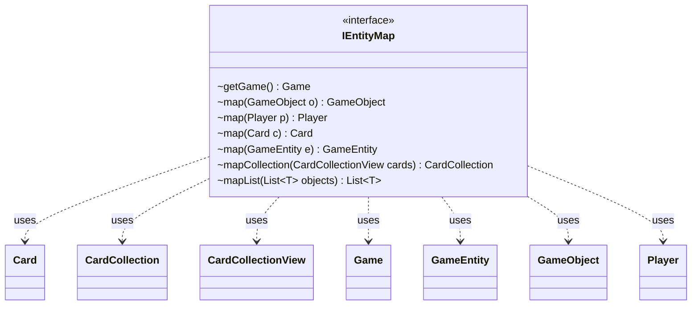

---
aliases:
  - IEntityMap
tags:
  - java/interface
  - module/forge-game
  - pkg/forge/game
fqn: forge.game.IEntityMap
package: forge.game
module: forge-game
kind: Interface
---

# IEntityMap

**Package:** `forge.game`   **Module:** `forge-game`   **Kind:** Interface



## Relationships
**Uses:**
- [[forge.game.Game|Game]]
- [[forge.game.GameEntity|GameEntity]]
- [[forge.game.GameObject|GameObject]]
- [[forge.game.card.Card|Card]]
- [[forge.game.card.CardCollection|CardCollection]]
- [[forge.game.card.CardCollectionView|CardCollectionView]]
- [[forge.game.player.Player|Player]]

## Design Description

The `IEntityMap` interface defines a mapping abstraction that translates game objects from one game state into their corresponding objects in another—primarily to support cloning or simulating a `Game`, where entities must be rebound to equivalents in a parallel state. It centers on two required operations, `getGame()` and the polymorphic `map(GameObject)`, from which all other behavior derives.

The interface leans heavily on default methods to minimize implementer burden: typed overloads for `Player`, `Card`, and `GameEntity` simply delegate to the core `map(GameObject)` via casts, while `mapCollection` and the generic `mapList` provide bulk translation by iterating and remapping each element into a fresh `CardCollection` or `List`. This design concentrates the real logic in a single implementer-supplied method and exposes convenience, type-safe entry points for the various collaborator types (`Player`, `Card`, `CardCollectionView`) it operates over.

## Source
`forge-game/src/main/java/forge/game/IEntityMap.java`

```java
package forge.game;

import forge.game.card.Card;
import forge.game.card.CardCollection;
import forge.game.card.CardCollectionView;
import forge.game.player.Player;

import java.util.ArrayList;
import java.util.List;

public interface IEntityMap {
    Game getGame();

    GameObject map(GameObject o);

    default Player map(final Player p) {
        return (Player) map((GameObject) p);
    }

    default Card map(final Card c) {
        return (Card) map((GameObject) c);
    }

    default GameEntity map(final GameEntity e) {
        return (GameEntity) map((GameObject) e);
    }

    default CardCollection mapCollection(final CardCollectionView cards) {
        final CardCollection collection = new CardCollection();
        for (final Card c : cards) {
            collection.add(map(c));
        }
        return collection;
    }

    @SuppressWarnings("unchecked")
    default <T extends GameObject> List<T> mapList(final List<T> objects) {
        final List<T> result = new ArrayList<>();
        for (final T o : objects) {
            result.add((T) map(o));
        }
        return result;
    }

}
```

## Python
`forge/game/IEntityMap.py`

```python
from forge.game.card.Card import Card
from forge.game.card.CardCollection import CardCollection
from forge.game.card.CardCollectionView import CardCollectionView
from forge.game.player.Player import Player
from forge.game.Game import Game
from forge.game.GameEntity import GameEntity
from forge.game.GameObject import GameObject

import typing


class IEntityMap:
    def getGame(self) -> Game:
        raise NotImplementedError

    def map(self, o: GameObject) -> GameObject:
        raise NotImplementedError

    def mapPlayer(self, p: Player) -> Player:
        return self.map(p)

    def mapCard(self, c: Card) -> Card:
        return self.map(c)

    def mapGameEntity(self, e: GameEntity) -> GameEntity:
        return self.map(e)

    def mapCollection(self, cards: CardCollectionView) -> CardCollection:
        collection = CardCollection()
        for c in cards:
            collection.add(self.mapCard(c))
        return collection

    def mapList(self, objects: typing.List[typing.Any]) -> typing.List[typing.Any]:
        result = []
        for o in objects:
            result.append(self.map(o))
        return result
```
