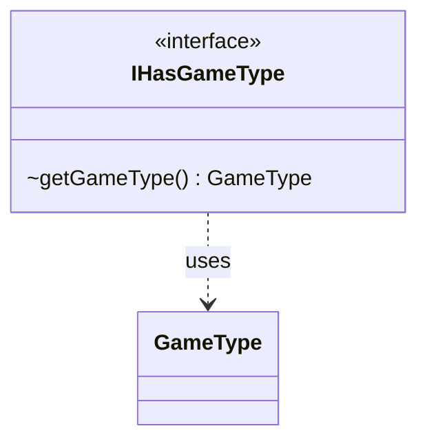

---
aliases:
  - IHasGameType
tags:
  - java/interface
  - module/forge-game
  - pkg/forge/game
fqn: forge.game.IHasGameType
package: forge.game
module: forge-game
kind: Interface
---

# IHasGameType

**Package:** `forge.game` &nbsp; **Module:** `forge-game` &nbsp; **Kind:** Interface



## Relationships
**Uses:**
- [[forge.game.GameType|GameType]]

## Source
`forge-game/src/main/java/forge/game/IHasGameType.java`

```java
package forge.game;

public interface IHasGameType {
    GameType getGameType();
}
```
