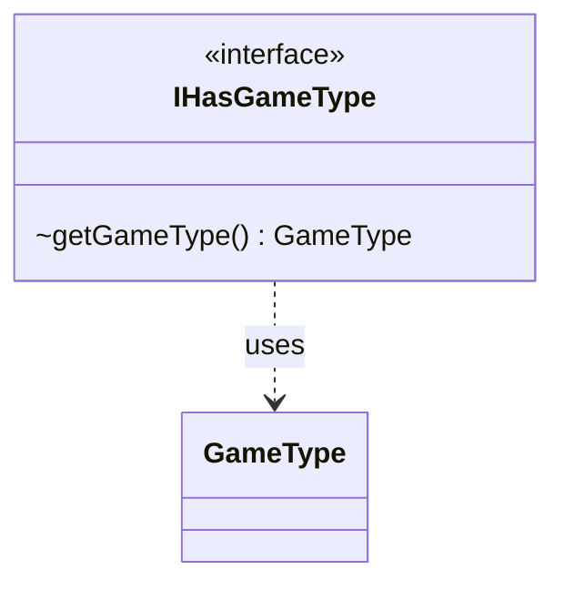

---
aliases:
  - IHasGameType
tags:
  - java/interface
  - module/forge-game
  - pkg/forge/game
fqn: forge.game.IHasGameType
package: forge.game
module: forge-game
kind: Interface
---

# IHasGameType

**Package:** `forge.game` &nbsp; **Module:** `forge-game` &nbsp; **Kind:** Interface



## Relationships
**Uses:**
- [[forge.game.GameType|GameType]]

## Design Description

The IHasGameType interface defines a minimal contract for any type that is associated with a Forge game variant, exposing a single accessor, getGameType(), that returns the GameType the implementer belongs to. As an interface in the forge.game package, it abstracts the notion of "knowing one's game type" away from concrete implementations, letting collaborators query a participant's variant uniformly without depending on a specific class. Its sole collaborator is the GameType enumeration, which it uses as the accessor's return value. The deliberately narrow, single-method design reflects a role-interface intent: classes mix in this capability to advertise their game type to systems that branch on game-mode behavior, keeping that coupling small and easily implemented across the engine.

## Source
`forge-game/src/main/java/forge/game/IHasGameType.java`

```java
package forge.game;

public interface IHasGameType {
    GameType getGameType();
}
```

## Python
`forge/game/IHasGameType.py`

````python
package = None


class IHasGameType:
    def getGameType(self) -> "GameType":
        ...
```

Wait, I need to output only Python source. Let me provide the correct translation.
````
