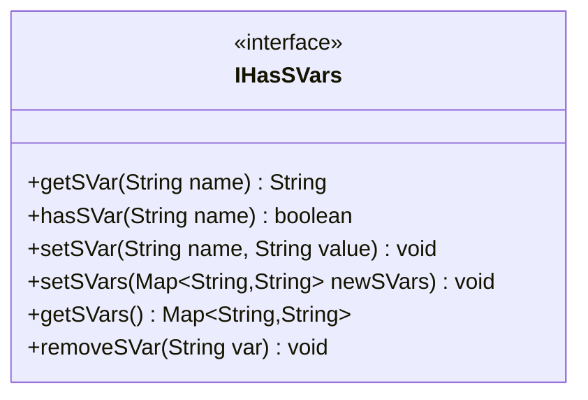

---
aliases:
  - IHasSVars
tags:
  - java/interface
  - module/forge-game
  - pkg/forge/game
fqn: forge.game.IHasSVars
package: forge.game
module: forge-game
kind: Interface
---

# IHasSVars

**Package:** `forge.game`   **Module:** `forge-game`   **Kind:** Interface



## Design Description

IHasSVars defines the contract for any game object that owns a mutable map of script variables ("SVars"), the string-keyed values Forge's card-scripting layer uses to parameterize abilities and effects. As an interface it specifies only the storage operations—retrieving a single value, testing for presence, setting one or many at once, exposing the whole map, and removing an entry—while leaving representation and persistence to implementors such as cards and players.

Its narrow, map-oriented surface lets unrelated types share a uniform SVar accessor so scripting and ability-resolution code can read variables without knowing the concrete holder. Collaborating chiefly with `java.util.Map` for bulk transfer via `setSVars`, it favors plain `String` values, deferring any numeric interpretation to callers—evident in the commented-out `getSVarInt` and `Set`-returning variants, which mark deliberately deferred conveniences.

## Source
`forge-game/src/main/java/forge/game/IHasSVars.java`

```java
package forge.game;

import java.util.Map;

public interface IHasSVars {

    public String getSVar(final String name);

    public boolean hasSVar(final String name);
    //public Integer getSVarInt(final String name);

    public void setSVar(final String name, final String value);
    public void setSVars(final Map<String, String> newSVars);

    //public Set<String> getSVars();

    public Map<String, String> getSVars();

    public void removeSVar(final String var);
}
```

## Python
`forge/game/IHasSVars.py`

```python
from abc import ABC, abstractmethod
from typing import Dict


class IHasSVars(ABC):

    @abstractmethod
    def getSVar(self, name: str) -> str:
        ...

    @abstractmethod
    def hasSVar(self, name: str) -> bool:
        ...

    # def getSVarInt(self, name: str) -> int: ...

    @abstractmethod
    def setSVar(self, name: str, value: str) -> None:
        ...

    @abstractmethod
    def setSVars(self, newSVars: Dict[str, str]) -> None:
        ...

    # def getSVars(self) -> Set[str]: ...

    @abstractmethod
    def getSVars(self) -> Dict[str, str]:
        ...

    @abstractmethod
    def removeSVar(self, var: str) -> None:
        ...
```
