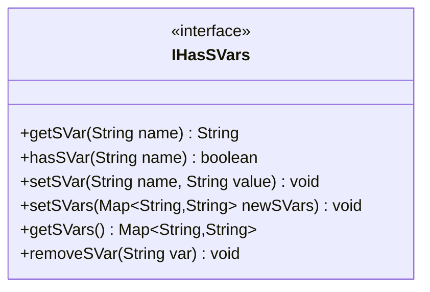

---
aliases:
  - IHasSVars
tags:
  - java/interface
  - module/forge-game
  - pkg/forge/game
fqn: forge.game.IHasSVars
package: forge.game
module: forge-game
kind: Interface
---

# IHasSVars

**Package:** `forge.game` &nbsp; **Module:** `forge-game` &nbsp; **Kind:** Interface



## Source
`forge-game/src/main/java/forge/game/IHasSVars.java`

```java
package forge.game;

import java.util.Map;

public interface IHasSVars {

    public String getSVar(final String name);

    public boolean hasSVar(final String name);
    //public Integer getSVarInt(final String name);

    public void setSVar(final String name, final String value);
    public void setSVars(final Map<String, String> newSVars);

    //public Set<String> getSVars();

    public Map<String, String> getSVars();

    public void removeSVar(final String var);
}
```
