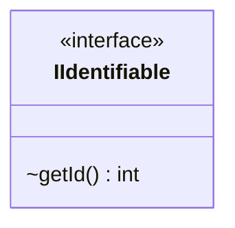

---
aliases:
  - IIdentifiable
tags:
  - java/interface
  - module/forge-game
  - pkg/forge/game
fqn: forge.game.IIdentifiable
package: forge.game
module: forge-game
kind: Interface
---

# IIdentifiable

**Package:** `forge.game` &nbsp; **Module:** `forge-game` &nbsp; **Kind:** Interface



## Source
`forge-game/src/main/java/forge/game/IIdentifiable.java`

```java
package forge.game;

public interface IIdentifiable {
    int getId();
}
```
