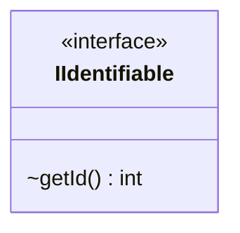

---
aliases:
  - IIdentifiable
tags:
  - java/interface
  - module/forge-game
  - pkg/forge/game
fqn: forge.game.IIdentifiable
package: forge.game
module: forge-game
kind: Interface
---

# IIdentifiable

**Package:** `forge.game`   **Module:** `forge-game`   **Kind:** Interface



## Design Description

IIdentifiable is a minimal contract that defines a single responsibility: exposing a stable integer identity through its `getId()` method. As a root-level interface in the `forge.game` package, it abstracts the notion of an identifiable game entity, allowing diverse domain types—cards, players, and other game objects—to be uniformly referenced, tracked, and compared by id without coupling callers to concrete implementations. Its deliberate narrowness reflects an interface-segregation design intent: by declaring only the identity accessor, it keeps the contract lightweight and broadly implementable, serving as a foundational supertype that collaborating systems rely on for entity lookup and registry operations.

## Source
`forge-game/src/main/java/forge/game/IIdentifiable.java`

```java
package forge.game;

public interface IIdentifiable {
    int getId();
}
```

## Python
`forge/game/IIdentifiable.py`

```python
package = None


class IIdentifiable:
    def getId(self) -> int:
        ...
```
