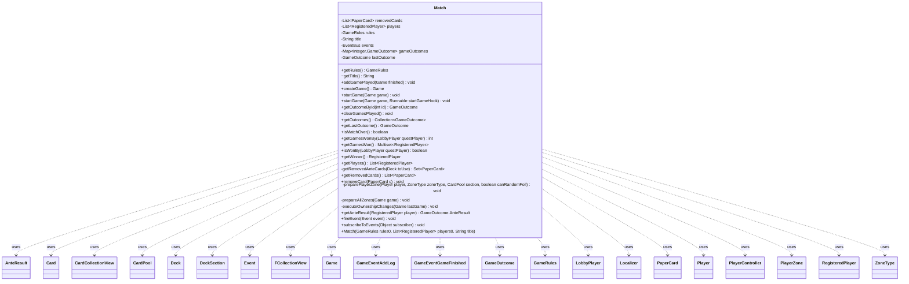

---
aliases:
  - Match
tags:
  - java/class
  - module/forge-game
  - pkg/forge/game
fqn: forge.game.Match
package: forge.game
module: forge-game
kind: Class
---

# Match

**Package:** `forge.game`   **Module:** `forge-game`   **Kind:** Class



## Relationships
**Uses:**
- [[forge.LobbyPlayer|LobbyPlayer]]
- [[forge.deck.CardPool|CardPool]]
- [[forge.deck.Deck|Deck]]
- [[forge.deck.DeckSection|DeckSection]]
- [[forge.game.Game|Game]]
- [[forge.game.GameOutcome|GameOutcome]]
- [[forge.game.GameOutcome.AnteResult|AnteResult]]
- [[forge.game.GameRules|GameRules]]
- [[forge.game.card.Card|Card]]
- [[forge.game.card.CardCollectionView|CardCollectionView]]
- [[forge.game.event.Event|Event]]
- [[forge.game.event.GameEventAddLog|GameEventAddLog]]
- [[forge.game.event.GameEventGameFinished|GameEventGameFinished]]
- [[forge.game.player.Player|Player]]
- [[forge.game.player.PlayerController|PlayerController]]
- [[forge.game.player.RegisteredPlayer|RegisteredPlayer]]
- [[forge.game.zone.PlayerZone|PlayerZone]]
- [[forge.game.zone.ZoneType|ZoneType]]
- [[forge.item.PaperCard|PaperCard]]
- [[forge.util.Localizer|Localizer]]
- [[forge.util.collect.FCollectionView|FCollectionView]]

## Design Description

Match is a non-card-game value object that orchestrates a best-of-N series of individual Games between a fixed roster of `RegisteredPlayer`s under a shared `GameRules` configuration. It owns the immutable player list, title, and accumulated `GameOutcome` history (keyed by game id), and exposes the series-level queries that depend on that history—win tallies via Guava `Multiset`, match-over and winner determination against `getGamesToWinMatch()`, and aggregated ante results. As a factory it constructs each `Game` and drives its lifecycle through `createGame`/`startGame`, where it prepares player zones (deck validation, sideboarding, foiling, ante-card removal) and applies post-game ownership changes for ante and effects like Darkpact.

Design intent is visible in the unmodifiable player list, the encapsulation of zone-preparation in private helpers, and the embedded Guava `EventBus` that lets the match relay UI/log/sound events while keeping subscribers decoupled. Static `removedCards` state and an explicit `System.gc()` reflect pragmatic, engine-specific concessions rather than clean design.

## Source
`forge-game/src/main/java/forge/game/Match.java`

```java
package forge.game;

import com.google.common.collect.*;
import com.google.common.eventbus.EventBus;
import forge.LobbyPlayer;
import forge.deck.CardPool;
import forge.deck.Deck;
import forge.deck.DeckFormat;
import forge.deck.DeckSection;
import forge.game.ability.AbilityKey;
import forge.game.card.Card;
import forge.game.card.CardCollectionView;
import forge.game.event.Event;
import forge.game.event.GameEventAddLog;
import forge.game.event.GameEventAnteCardsSelected;
import forge.game.event.GameEventGameFinished;
import forge.game.player.Player;
import forge.game.player.PlayerController;
import forge.game.player.RegisteredPlayer;
import forge.game.trigger.Trigger;
import forge.game.zone.PlayerZone;
import forge.game.zone.ZoneType;
import forge.item.PaperCard;
import forge.util.Localizer;
import forge.util.MyRandom;
import forge.util.collect.FCollectionView;
import org.apache.commons.lang3.tuple.Pair;

import java.util.*;
import java.util.Map.Entry;

public class Match {
    private static List<PaperCard> removedCards = Lists.newArrayList();
    private final List<RegisteredPlayer> players;
    private final GameRules rules;
    private final String title;

    private final EventBus events = new EventBus("match events");
    private final Map<Integer, GameOutcome> gameOutcomes = Maps.newHashMap();

    private GameOutcome lastOutcome = null;

    public Match(final GameRules rules0, final List<RegisteredPlayer> players0, final String title) {
        players = Collections.unmodifiableList(Lists.newArrayList(players0));
        rules = rules0;
        this.title = title;
    }

    public GameRules getRules() {
        return rules;
    }
    String getTitle() {
        final Multiset<RegisteredPlayer> wins = getGamesWon();
        final StringBuilder titleAppend = new StringBuilder(title);
        titleAppend.append(" (");
        for (final RegisteredPlayer rp : players) {
            titleAppend.append(wins.count(rp)).append('-');
        }
        titleAppend.deleteCharAt(titleAppend.length() - 1);
        titleAppend.append(')');
        return titleAppend.toString();
    }

    public void addGamePlayed(Game finished) {
        if (!finished.isGameOver()) {
            throw new IllegalStateException("Game is not over yet.");
        }
        lastOutcome = finished.getOutcome();
        gameOutcomes.put(finished.getId(), finished.getOutcome());
    }

    public Game createGame() {
        return new Game(players, rules, this);
    }

    public void startGame(final Game game) {
        startGame(game, null);
    }

    public void startGame(final Game game, Runnable startGameHook) {
        prepareAllZones(game);
        if (rules.useAnte()) {  // Deciding which cards go to ante
            Multimap<Player, Card> list = game.chooseCardsForAnte(rules.getMatchAnteRarity(), rules.getAnteIncludeBasicLands());
            for (Entry<Player, Card> kv : list.entries()) {
                Player p = kv.getKey();
                game.getAction().moveTo(ZoneType.Ante, kv.getValue(), null, AbilityKey.newMap());
                game.fireEvent(new GameEventAddLog(GameLogEntryType.ANTE, p + " anted " + kv.getValue()));
            }
            game.fireEvent(GameEventAnteCardsSelected.fromCards(list));
        }

        game.getAction().startGame(this.lastOutcome, startGameHook);

        // Typically ante, but also tearing up a blacker lotus
        executeOwnershipChanges(game);

        game.clearCaches();

        // will pull UI dialog, when the UI is listening
        game.fireEvent(new GameEventGameFinished());

        //run GC after game is finished
        System.gc();
    }

    public GameOutcome getOutcomeById(int id) {
        return gameOutcomes.get(id);
    }

    public void clearGamesPlayed() {
        gameOutcomes.clear();
        for (RegisteredPlayer p : players) {
            p.restoreDeck();
        }
    }

    public Collection<GameOutcome> getOutcomes() {
        return gameOutcomes.values();
    }

    public GameOutcome getLastOutcome() {
        return lastOutcome;
    }

    public boolean isMatchOver() {
        int[] victories = new int[players.size()];
        for (GameOutcome go : getOutcomes()) {
            LobbyPlayer winner = go.getWinningLobbyPlayer();
            int i = 0;
            for (RegisteredPlayer p : players) {
                if (p.getPlayer().equals(winner)) {
                    victories[i]++;
                    if (victories[i] >= rules.getGamesToWinMatch()) {
                        return true;
                    }
                }
                i++;
            }
        }

        // Games are first to X wins, not first to X wins or Y total games played
        return false;
    }

    public int getGamesWonBy(LobbyPlayer questPlayer) {
        int sum = 0;
        for (GameOutcome go : getOutcomes()) {
            if (questPlayer.equals(go.getWinningLobbyPlayer())) {
                sum++;
            }
        }
        return sum;
    }
    public Multiset<RegisteredPlayer> getGamesWon() {
        final Multiset<RegisteredPlayer> won = HashMultiset.create(players.size());
        for (final GameOutcome go : getOutcomes()) {
            if (go.getWinningPlayer() == null) {
                // Game hasn't finished yet. Exit early.
                return won;
            }
            won.add(go.getWinningPlayer());
        }
        return won;
    }

    public boolean isWonBy(LobbyPlayer questPlayer) {
        return getGamesWonBy(questPlayer) >= rules.getGamesToWinMatch();
    }

    public RegisteredPlayer getWinner() {
        if (this.isMatchOver()) {
            return lastOutcome.getWinningPlayer();
        }
        return null;
    }

    public List<RegisteredPlayer> getPlayers() {
        return players;
    }

    private static Set<PaperCard> getRemovedAnteCards(Deck toUse) {
        final String keywordToRemove = "Remove CARDNAME from your deck before playing if you're not playing for ante.";
        Set<PaperCard> myRemovedAnteCards = new HashSet<>();
        for (Entry<DeckSection, CardPool> ds : toUse) {
            for (Entry<PaperCard, Integer> cp : ds.getValue()) {
                if (Iterables.contains(cp.getKey().getRules().getMainPart().getKeywords(), keywordToRemove)) {
                    myRemovedAnteCards.add(cp.getKey());
                }
            }
        }
        return myRemovedAnteCards;
    }

    public static List<PaperCard> getRemovedCards() { return removedCards; }

    public void removeCard(PaperCard c) {
        removedCards.add(c);
    }

    private static void preparePlayerZone(Player player, final ZoneType zoneType, CardPool section, boolean canRandomFoil) {
        PlayerZone library = player.getZone(zoneType);
        List<Card> newLibrary = new ArrayList<>();
        for (final Entry<PaperCard, Integer> stackOfCards : section) {
            final PaperCard cp = stackOfCards.getKey();
            for (int i = 0; i < stackOfCards.getValue(); i++) {
                final Card card = Card.fromPaperCard(cp, player);

                // Assign card-specific foiling or random foiling on approximately 1:20 cards if enabled
                if (cp.isFoil() || (canRandomFoil && MyRandom.percentTrue(5))) {
                    card.setRandomFoil();
                }
                card.setCollectible(true);

                newLibrary.add(card);
            }
        }
        library.setCards(newLibrary);
    }

    private void prepareAllZones(final Game game) {
        // need this code here, otherwise observables fail
        Trigger.resetIDs();
        game.getTriggerHandler().clearDelayedTrigger();

        // friendliness
        Map<Player, Map<DeckSection, List<? extends PaperCard>>> rAICards = new HashMap<>();
        Multimap<Player, PaperCard> removedAnteCards = ArrayListMultimap.create();
        Map<Player, List<PaperCard>> unsupported = new HashMap<>();

        final FCollectionView<Player> players = game.getPlayers();
        final List<RegisteredPlayer> playersConditions = game.getMatch().getPlayers();

        boolean isFirstGame = gameOutcomes.isEmpty();
        boolean canSideBoard = !isFirstGame && rules.getGameType().isSideboardingAllowed();
        // Only allow this if feature flag is on AND for certain match types
        boolean sideboardForAIs = rules.getSideboardForAI() &&
            rules.getGameType().getDeckFormat().equals(DeckFormat.Constructed);
        PlayerController sideboardProxy = null;
        if (canSideBoard && sideboardForAIs) {
            for (int i = 0; i < players.size(); i++) {
                final Player player = players.get(i);
                //final RegisteredPlayer psc = playersConditions.get(i);
                if (!player.getController().isAI()) {
                    sideboardProxy = player.getController();
                    break;
                }
            }
        }

        for (int i = 0; i < playersConditions.size(); i++) {
            final Player player = players.get(i);
            final RegisteredPlayer psc = playersConditions.get(i);
            PlayerController person = player.getController();

            if (canSideBoard) {
                if (sideboardProxy != null && person.isAI()) {
                    person = sideboardProxy;
                }

                Deck toChange = psc.getDeck();
                if (!getRemovedCards().isEmpty()) {
                    CardPool main = new CardPool();
                    main.addAll(toChange.get(DeckSection.Main));
                    CardPool sideboard = new CardPool();
                    sideboard.addAll(toChange.getOrCreate(DeckSection.Sideboard));
                    for (PaperCard c : removedCards) {
                        if (main.contains(c)) {
                            main.remove(c, 1);
                        } else if (sideboard.contains(c)) {
                            sideboard.remove(c, 1);
                        }
                    }
                    toChange.getMain().clear();
                    toChange.getMain().addAll(main);
                    toChange.get(DeckSection.Sideboard).clear();
                    toChange.get(DeckSection.Sideboard).addAll(sideboard);
                }
                List<PaperCard> newMain = person.sideboard(toChange, rules.getGameType(), player.getName());
                if (null != newMain) {
                    CardPool allCards = new CardPool();
                    allCards.addAll(toChange.get(DeckSection.Main));
                    allCards.addAll(toChange.getOrCreate(DeckSection.Sideboard));
                    for (PaperCard c : newMain) {
                        allCards.remove(c);
                    }
                    toChange.getMain().clear();
                    toChange.getMain().add(newMain);
                    toChange.get(DeckSection.Sideboard).clear();
                    toChange.get(DeckSection.Sideboard).addAll(allCards);
                }
            }

            Deck toCheck = psc.getDeck();
            if (toCheck == null) {
                try {
                    System.err.println(psc.getPlayer().getName() + " Deck is NULL...");
                    int val = rules.getGameType().getDeckFormat().getMainRange().getMinimum();
                    toCheck = new Deck("NULL");
                    if (val > 0)
                        toCheck.getMain().add("Wastes", val);
                } catch (Exception ignored) {}
            }
            Pair<Deck, List<PaperCard>> myDeck = toCheck.getValid();
            player.setDraftNotes(myDeck.getLeft().getDraftNotes());

            Set<PaperCard> myRemovedAnteCards = null;
            if (!rules.useAnte()) {
                myRemovedAnteCards = getRemovedAnteCards(myDeck.getLeft());
                for (PaperCard cp: myRemovedAnteCards) {
                    for (Entry<DeckSection, CardPool> ds : myDeck.getLeft()) {
                        ds.getValue().removeAll(cp);
                    }
                }
            }

            preparePlayerZone(player, ZoneType.Library, myDeck.getLeft().getMain(), psc.useRandomFoil());
            if (myDeck.getLeft().has(DeckSection.Sideboard)) {
                preparePlayerZone(player, ZoneType.Sideboard, myDeck.getLeft().get(DeckSection.Sideboard), psc.useRandomFoil());

                player.assignCompanion(game, person);
            }

            player.initVariantsZones(psc);

            player.shuffle(null);

            if (isFirstGame) {
                Map<DeckSection, List<? extends PaperCard>> cardsComplained = player.getController().complainCardsCantPlayWell(myDeck.getLeft());
                if (cardsComplained != null && !cardsComplained.isEmpty()) {
                    rAICards.put(player, cardsComplained);
                }
            } else {
                //reset cards to fix weird issues on netplay nextgame client
                for (Card c : player.getCardsIn(ZoneType.Library)) {
                    c.setTapped(false);
                    c.resetActivationsPerTurn();
                }
            }

            if (myRemovedAnteCards != null && !myRemovedAnteCards.isEmpty()) {
                removedAnteCards.putAll(player, myRemovedAnteCards);
            }
            unsupported.put(player, myDeck.getRight());
        }

        final Localizer localizer = Localizer.getInstance();
        if (!rAICards.isEmpty() && !rules.getGameType().isCardPoolLimited() && rules.warnAboutAICards()) {
            game.getAction().revealUnplayableByAI(localizer.getMessage("lblAICantPlayCards"), rAICards);
        }

        if (!removedAnteCards.isEmpty()) {
            game.getAction().revealAnte(localizer.getMessage("lblAnteCardsRemoved"), removedAnteCards);
        }

        if (!unsupported.isEmpty()) {
            game.getAction().revealUnsupported(unsupported);
        }
    }

    private void executeOwnershipChanges(Game lastGame) {
        GameOutcome outcome = lastGame.getOutcome();

        // remove all the lost cards from owners' decks
        List<PaperCard> losses = new ArrayList<>();
        int cntPlayers = players.size();
        int iWinner = -1;
        for (int i = 0; i < cntPlayers; i++) {
            Player gamePlayer = lastGame.getRegisteredPlayers().get(i);
            RegisteredPlayer registered = gamePlayer.getRegisteredPlayer();

            // Add/Remove Cards lost via ChangeOwnership cards like Darkpact
            CardCollectionView lostOwnership = gamePlayer.getLostOwnership();
            CardCollectionView gainedOwnership = gamePlayer.getGainedOwnership();

            if (!lostOwnership.isEmpty()) {
                List<PaperCard> lostPaperOwnership = new ArrayList<>();
                for (Card c : lostOwnership) {
                    lostPaperOwnership.add((PaperCard)c.getPaperCard());
                }
                outcome.addAnteLost(registered, lostPaperOwnership);
            }

            if (!gainedOwnership.isEmpty()) {
                List<PaperCard> gainedPaperOwnership = new ArrayList<>();
                for (Card c : gainedOwnership) {
                    gainedPaperOwnership.add((PaperCard)c.getPaperCard());
                }
                outcome.addAnteWon(registered, gainedPaperOwnership);
            }

            if (!getRules().useAnte()) {
                continue;
            }

            if (outcome.isDraw()) {
                continue;
            }

            if (!gamePlayer.hasLost()) {
                iWinner = i;
                continue; // not a loser
            }

            Deck losersDeck = players.get(i).getDeck();
            List<PaperCard> personalLosses = new ArrayList<>();
            for (Card c : gamePlayer.getCardsIn(ZoneType.Ante)) {
                if(!c.isCollectible())
                    continue;
                PaperCard toRemove = (PaperCard) c.getPaperCard();
                // this could miss the cards by returning instances that are not equal to cards found in deck
                // (but only if the card has multiple prints in a set)
                losersDeck.getMain().remove(toRemove);
                personalLosses.add(toRemove);
                losses.add(toRemove);
            }

            outcome.addAnteLost(registered, personalLosses);
        }

        if (rules.useAnte() && iWinner >= 0) {
            // Winner gains these cards always
            Player fromGame = lastGame.getRegisteredPlayers().get(iWinner);
            RegisteredPlayer registered = fromGame.getRegisteredPlayer();
            outcome.addAnteWon(registered, losses);

            if (rules.getGameType().canAddWonCardsMidGame()) {
                // But only certain game types lets you swap midgame
                List<PaperCard> chosen = fromGame.getController().chooseCardsYouWonToAddToDeck(losses);
                if (null != chosen) {
                    Deck deck = players.get(iWinner).getDeck();
                    for (PaperCard c : chosen) {
                        deck.getMain().add(c);
                    }
                }
            }
            // Other game types (like Quest) need to do something in their own calls to actually update data
        }
    }

    public GameOutcome.AnteResult getAnteResult(RegisteredPlayer player) {
        GameOutcome.AnteResult out = new GameOutcome.AnteResult();
        for (GameOutcome outcome : gameOutcomes.values()) {
            GameOutcome.AnteResult gameAnte = outcome.getAnteResult(player);
            if (gameAnte == null) {
                continue;
            }
            out.addWon(gameAnte.wonCards);
            out.addLost(gameAnte.lostCards);
        }
        return out;
    }

    /**
     * Fire only the events after they became real for gamestate and won't get replaced.<br>
     * The events are sent to UI, log and sound system. Network listeners are under development.
     */
    public void fireEvent(final Event event) {
        events.post(event);
    }
    public void subscribeToEvents(final Object subscriber) {
        events.register(subscriber);
    }

}
```

## Python
`forge/game/Match.py`

```python
from forge.LobbyPlayer import LobbyPlayer
from forge.deck.CardPool import CardPool
from forge.deck.Deck import Deck
from forge.deck.DeckFormat import DeckFormat
from forge.deck.DeckSection import DeckSection
from forge.game.ability.AbilityKey import AbilityKey
from forge.game.card.Card import Card
from forge.game.card.CardCollectionView import CardCollectionView
from forge.game.event.Event import Event
from forge.game.event.GameEventAddLog import GameEventAddLog
from forge.game.event.GameEventAnteCardsSelected import GameEventAnteCardsSelected
from forge.game.event.GameEventGameFinished import GameEventGameFinished
from forge.game.player.Player import Player
from forge.game.player.PlayerController import PlayerController
from forge.game.player.RegisteredPlayer import RegisteredPlayer
from forge.game.trigger.Trigger import Trigger
from forge.game.zone.PlayerZone import PlayerZone
from forge.game.zone.ZoneType import ZoneType
from forge.item.PaperCard import PaperCard
from forge.util.Localizer import Localizer
from forge.util.MyRandom import MyRandom
from forge.util.collect.FCollectionView import FCollectionView
from forge.game.Game import Game
from forge.game.GameOutcome import GameOutcome
from forge.game.GameOutcome.AnteResult import AnteResult
from forge.game.GameRules import GameRules
from forge.game.GameLogEntryType import GameLogEntryType

from com.google.common.eventbus.EventBus import EventBus
from com.google.common.collect.ArrayListMultimap import ArrayListMultimap

import collections
import gc
import sys


class Match:
    removedCards = []

    def __init__(self, rules0, players0, title):
        self.players = list(players0)
        self.rules = rules0
        self.title = title

        self.events = EventBus("match events")
        self.gameOutcomes = {}

        self.lastOutcome = None

    def getRules(self):
        return self.rules

    def getTitle(self):
        wins = self.getGamesWon()
        titleAppend = self.title + " ("
        parts = []
        for rp in self.players:
            parts.append(str(wins[rp]))
        titleAppend += "-".join(parts)
        titleAppend += ")"
        return titleAppend

    def addGamePlayed(self, finished):
        if not finished.isGameOver():
            raise RuntimeError("Game is not over yet.")
        self.lastOutcome = finished.getOutcome()
        self.gameOutcomes[finished.getId()] = finished.getOutcome()

    def createGame(self):
        return Game(self.players, self.rules, self)

    def startGame(self, game, startGameHook=None):
        self.prepareAllZones(game)
        if self.rules.useAnte():  # Deciding which cards go to ante
            list = game.chooseCardsForAnte(self.rules.getMatchAnteRarity(), self.rules.getAnteIncludeBasicLands())
            for kv in list.entries():
                p = kv.getKey()
                game.getAction().moveTo(ZoneType.Ante, kv.getValue(), None, AbilityKey.newMap())
                game.fireEvent(GameEventAddLog(GameLogEntryType.ANTE, f"{p} anted {kv.getValue()}"))
            game.fireEvent(GameEventAnteCardsSelected.fromCards(list))

        game.getAction().startGame(self.lastOutcome, startGameHook)

        # Typically ante, but also tearing up a blacker lotus
        self.executeOwnershipChanges(game)

        game.clearCaches()

        # will pull UI dialog, when the UI is listening
        game.fireEvent(GameEventGameFinished())

        # run GC after game is finished
        gc.collect()

    def getOutcomeById(self, id):
        return self.gameOutcomes.get(id)

    def clearGamesPlayed(self):
        self.gameOutcomes.clear()
        for p in self.players:
            p.restoreDeck()

    def getOutcomes(self):
        return self.gameOutcomes.values()

    def getLastOutcome(self):
        return self.lastOutcome

    def isMatchOver(self):
        victories = [0] * len(self.players)
        for go in self.getOutcomes():
            winner = go.getWinningLobbyPlayer()
            i = 0
            for p in self.players:
                if p.getPlayer().equals(winner):
                    victories[i] += 1
                    if victories[i] >= self.rules.getGamesToWinMatch():
                        return True
                i += 1

        # Games are first to X wins, not first to X wins or Y total games played
        return False

    def getGamesWonBy(self, questPlayer):
        sum = 0
        for go in self.getOutcomes():
            if questPlayer.equals(go.getWinningLobbyPlayer()):
                sum += 1
        return sum

    def getGamesWon(self):
        won = collections.Counter()
        for go in self.getOutcomes():
            if go.getWinningPlayer() is None:
                # Game hasn't finished yet. Exit early.
                return won
            won[go.getWinningPlayer()] += 1
        return won

    def isWonBy(self, questPlayer):
        return self.getGamesWonBy(questPlayer) >= self.rules.getGamesToWinMatch()

    def getWinner(self):
        if self.isMatchOver():
            return self.lastOutcome.getWinningPlayer()
        return None

    def getPlayers(self):
        return self.players

    @staticmethod
    def getRemovedAnteCards(toUse):
        keywordToRemove = "Remove CARDNAME from your deck before playing if you're not playing for ante."
        myRemovedAnteCards = set()
        for ds in toUse:
            for cp in ds.getValue():
                if keywordToRemove in cp.getKey().getRules().getMainPart().getKeywords():
                    myRemovedAnteCards.add(cp.getKey())
        return myRemovedAnteCards

    @staticmethod
    def getRemovedCards():
        return Match.removedCards

    def removeCard(self, c):
        Match.removedCards.append(c)

    @staticmethod
    def preparePlayerZone(player, zoneType, section, canRandomFoil):
        library = player.getZone(zoneType)
        newLibrary = []
        for stackOfCards in section:
            cp = stackOfCards.getKey()
            for i in range(stackOfCards.getValue()):
                card = Card.fromPaperCard(cp, player)

                # Assign card-specific foiling or random foiling on approximately 1:20 cards if enabled
                if cp.isFoil() or (canRandomFoil and MyRandom.percentTrue(5)):
                    card.setRandomFoil()
                card.setCollectible(True)

                newLibrary.append(card)
        library.setCards(newLibrary)

    def prepareAllZones(self, game):
        # need this code here, otherwise observables fail
        Trigger.resetIDs()
        game.getTriggerHandler().clearDelayedTrigger()

        # friendliness
        rAICards = {}
        removedAnteCards = ArrayListMultimap.create()
        unsupported = {}

        players = game.getPlayers()
        playersConditions = game.getMatch().getPlayers()

        isFirstGame = len(self.gameOutcomes) == 0
        canSideBoard = not isFirstGame and self.rules.getGameType().isSideboardingAllowed()
        # Only allow this if feature flag is on AND for certain match types
        sideboardForAIs = self.rules.getSideboardForAI() and \
            self.rules.getGameType().getDeckFormat() == DeckFormat.Constructed
        sideboardProxy = None
        if canSideBoard and sideboardForAIs:
            for i in range(players.size()):
                player = players.get(i)
                # psc = playersConditions.get(i)
                if not player.getController().isAI():
                    sideboardProxy = player.getController()
                    break

        for i in range(len(playersConditions)):
            player = players.get(i)
            psc = playersConditions[i]
            person = player.getController()

            if canSideBoard:
                if sideboardProxy is not None and person.isAI():
                    person = sideboardProxy

                toChange = psc.getDeck()
                if len(Match.getRemovedCards()) > 0:
                    main = CardPool()
                    main.addAll(toChange.get(DeckSection.Main))
                    sideboard = CardPool()
                    sideboard.addAll(toChange.getOrCreate(DeckSection.Sideboard))
                    for c in Match.removedCards:
                        if main.contains(c):
                            main.remove(c, 1)
                        elif sideboard.contains(c):
                            sideboard.remove(c, 1)
                    toChange.getMain().clear()
                    toChange.getMain().addAll(main)
                    toChange.get(DeckSection.Sideboard).clear()
                    toChange.get(DeckSection.Sideboard).addAll(sideboard)
                newMain = person.sideboard(toChange, self.rules.getGameType(), player.getName())
                if newMain is not None:
                    allCards = CardPool()
                    allCards.addAll(toChange.get(DeckSection.Main))
                    allCards.addAll(toChange.getOrCreate(DeckSection.Sideboard))
                    for c in newMain:
                        allCards.remove(c)
                    toChange.getMain().clear()
                    toChange.getMain().add(newMain)
                    toChange.get(DeckSection.Sideboard).clear()
                    toChange.get(DeckSection.Sideboard).addAll(allCards)

            toCheck = psc.getDeck()
            if toCheck is None:
                try:
                    print(psc.getPlayer().getName() + " Deck is NULL...", file=sys.stderr)
                    val = self.rules.getGameType().getDeckFormat().getMainRange().getMinimum()
                    toCheck = Deck("NULL")
                    if val > 0:
                        toCheck.getMain().add("Wastes", val)
                except Exception:
                    pass
            myDeck = toCheck.getValid()
            player.setDraftNotes(myDeck.getLeft().getDraftNotes())

            myRemovedAnteCards = None
            if not self.rules.useAnte():
                myRemovedAnteCards = Match.getRemovedAnteCards(myDeck.getLeft())
                for cp in myRemovedAnteCards:
                    for ds in myDeck.getLeft():
                        ds.getValue().removeAll(cp)

            Match.preparePlayerZone(player, ZoneType.Library, myDeck.getLeft().getMain(), psc.useRandomFoil())
            if myDeck.getLeft().has(DeckSection.Sideboard):
                Match.preparePlayerZone(player, ZoneType.Sideboard, myDeck.getLeft().get(DeckSection.Sideboard), psc.useRandomFoil())

                player.assignCompanion(game, person)

            player.initVariantsZones(psc)

            player.shuffle(None)

            if isFirstGame:
                cardsComplained = player.getController().complainCardsCantPlayWell(myDeck.getLeft())
                if cardsComplained is not None and len(cardsComplained) != 0:
                    rAICards[player] = cardsComplained
            else:
                # reset cards to fix weird issues on netplay nextgame client
                for c in player.getCardsIn(ZoneType.Library):
                    c.setTapped(False)
                    c.resetActivationsPerTurn()

            if myRemovedAnteCards is not None and len(myRemovedAnteCards) != 0:
                removedAnteCards.putAll(player, myRemovedAnteCards)
            unsupported[player] = myDeck.getRight()

        localizer = Localizer.getInstance()
        if len(rAICards) != 0 and not self.rules.getGameType().isCardPoolLimited() and self.rules.warnAboutAICards():
            game.getAction().revealUnplayableByAI(localizer.getMessage("lblAICantPlayCards"), rAICards)

        if not removedAnteCards.isEmpty():
            game.getAction().revealAnte(localizer.getMessage("lblAnteCardsRemoved"), removedAnteCards)

        if len(unsupported) != 0:
            game.getAction().revealUnsupported(unsupported)

    def executeOwnershipChanges(self, lastGame):
        outcome = lastGame.getOutcome()

        # remove all the lost cards from owners' decks
        losses = []
        cntPlayers = len(self.players)
        iWinner = -1
        for i in range(cntPlayers):
            gamePlayer = lastGame.getRegisteredPlayers().get(i)
            registered = gamePlayer.getRegisteredPlayer()

            # Add/Remove Cards lost via ChangeOwnership cards like Darkpact
            lostOwnership = gamePlayer.getLostOwnership()
            gainedOwnership = gamePlayer.getGainedOwnership()

            if not lostOwnership.isEmpty():
                lostPaperOwnership = []
                for c in lostOwnership:
                    lostPaperOwnership.append(c.getPaperCard())
                outcome.addAnteLost(registered, lostPaperOwnership)

            if not gainedOwnership.isEmpty():
                gainedPaperOwnership = []
                for c in gainedOwnership:
                    gainedPaperOwnership.append(c.getPaperCard())
                outcome.addAnteWon(registered, gainedPaperOwnership)

            if not self.getRules().useAnte():
                continue

            if outcome.isDraw():
                continue

            if not gamePlayer.hasLost():
                iWinner = i
                continue  # not a loser

            losersDeck = self.players[i].getDeck()
            personalLosses = []
            for c in gamePlayer.getCardsIn(ZoneType.Ante):
                if not c.isCollectible():
                    continue
                toRemove = c.getPaperCard()
                # this could miss the cards by returning instances that are not equal to cards found in deck
                # (but only if the card has multiple prints in a set)
                losersDeck.getMain().remove(toRemove)
                personalLosses.append(toRemove)
                losses.append(toRemove)

            outcome.addAnteLost(registered, personalLosses)

        if self.rules.useAnte() and iWinner >= 0:
            # Winner gains these cards always
            fromGame = lastGame.getRegisteredPlayers().get(iWinner)
            registered = fromGame.getRegisteredPlayer()
            outcome.addAnteWon(registered, losses)

            if self.rules.getGameType().canAddWonCardsMidGame():
                # But only certain game types lets you swap midgame
                chosen = fromGame.getController().chooseCardsYouWonToAddToDeck(losses)
                if chosen is not None:
                    deck = self.players[iWinner].getDeck()
                    for c in chosen:
                        deck.getMain().add(c)
            # Other game types (like Quest) need to do something in their own calls to actually update data

    def getAnteResult(self, player):
        out = GameOutcome.AnteResult()
        for outcome in self.gameOutcomes.values():
            gameAnte = outcome.getAnteResult(player)
            if gameAnte is None:
                continue
            out.addWon(gameAnte.wonCards)
            out.addLost(gameAnte.lostCards)
        return out

    def fireEvent(self, event):
        self.events.post(event)

    def subscribeToEvents(self, subscriber):
        self.events.register(subscriber)
```
