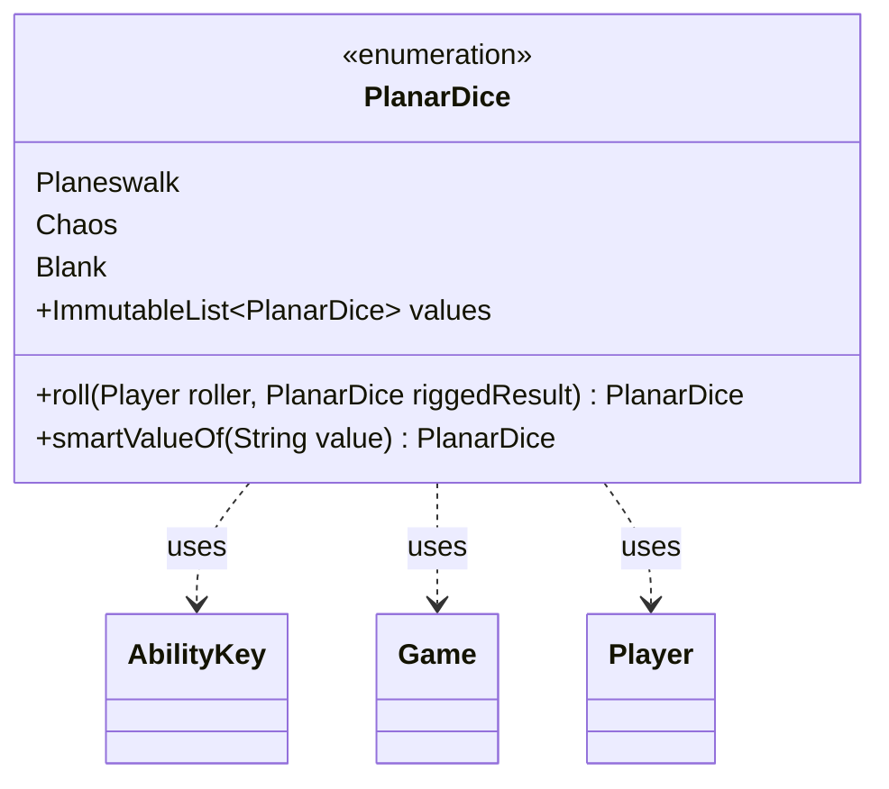

---
aliases:
  - PlanarDice
tags:
  - java/enum
  - module/forge-game
  - pkg/forge/game
fqn: forge.game.PlanarDice
package: forge.game
module: forge-game
kind: Enum
---

# PlanarDice

**Package:** `forge.game` &nbsp; **Module:** `forge-game` &nbsp; **Kind:** Enum



## Relationships
**Uses:**
- [[forge.game.Game|Game]]
- [[forge.game.ability.AbilityKey|AbilityKey]]
- [[forge.game.player.Player|Player]]

## Design Description

PlanarDice is an enumeration modeling the three faces of the planar die (Planeswalk, Chaos, Blank) used in Planechase-format games, residing in the core `forge.game` package. Beyond naming the die results, it centralizes the entire roll resolution as a static `roll` method: it randomizes a result, applies replacement effects, honors a rigged or ignored-roll outcome, and fires the appropriate triggers, collaborating with Player, Game, and the AbilityKey parameter map to drive the engine's replacement and trigger handlers. As an enum it serves as a lightweight, type-safe value shared across that machinery; `smartValueOf` provides case-insensitive parsing from card-script text, and a precomputed immutable `values` list avoids repeated array allocation. The design intentionally couples the data type with its game-logic resolution, keeping dice-rolling rules cohesive while delegating side effects to the surrounding handler infrastructure.

## Source
`forge-game/src/main/java/forge/game/PlanarDice.java`

```java
package forge.game;

import com.google.common.collect.ImmutableList;
import com.google.common.collect.Lists;
import forge.game.ability.AbilityKey;
import forge.game.player.Player;
import forge.game.replacement.ReplacementType;
import forge.game.trigger.TriggerType;

import java.util.Arrays;
import java.util.List;
import java.util.Map;

/**
 * Represents the planar dice for Planechase games.
 *
 */
public enum PlanarDice {
    Planeswalk,
    Chaos,
    Blank;

    public static PlanarDice roll(Player roller, PlanarDice riggedResult) {
        final Game game = roller.getGame();
        int rolls = 1;
        int ignore = 0;

        final Map<AbilityKey, Object> repParams = AbilityKey.mapFromAffected(roller);
        repParams.put(AbilityKey.Number, rolls);
        repParams.put(AbilityKey.Ignore, ignore);

        switch (game.getReplacementHandler().run(ReplacementType.RollPlanarDice, repParams)) {
            case NotReplaced:
                break;
            case Updated: {
                rolls = (int) repParams.get(AbilityKey.Number);
                ignore = (int) repParams.get(AbilityKey.Ignore);
                break;
            }
        }

        List<PlanarDice> results = Lists.newArrayList();
        for (int r = 0; r < rolls; r++) {
            PlanarDice thisRoll = Blank;
            int i = forge.util.MyRandom.getRandom().nextInt(6);
            roller.roll();
            if (riggedResult != null)
                thisRoll = riggedResult;
            else if (i == 0)
                thisRoll = Planeswalk;
            else if (i == 1)
                thisRoll = Chaos;
            results.add(thisRoll);
        }

        for (int ig = 0; ig < ignore; ig++) {
            results.remove(roller.getController().choosePDRollToIgnore(results));
        }
        PlanarDice res = results.get(0);

        final Map<AbilityKey, Object> resRepParams = AbilityKey.mapFromAffected(roller);
        resRepParams.put(AbilityKey.Result, res);

        switch (game.getReplacementHandler().run(ReplacementType.PlanarDiceResult, resRepParams)) {
            case NotReplaced:
                break;
            case Updated: {
                res = (PlanarDice) resRepParams.get(AbilityKey.Result);
                break;
            }
        }

        Map<AbilityKey, Object> runParams = AbilityKey.mapFromPlayer(roller);
        runParams.put(AbilityKey.Result, res);
        game.getTriggerHandler().runTrigger(TriggerType.PlanarDice, runParams, false);

        // Also run normal RolledDie and RolledDieOnce triggers
        for (int r = 0; r < rolls; r++) {
            runParams = AbilityKey.mapFromPlayer(roller);
            runParams.put(AbilityKey.Sides, 6);
            runParams.put(AbilityKey.Result, 0);
            roller.getGame().getTriggerHandler().runTrigger(TriggerType.RolledDie, runParams, false);
        }

        runParams = AbilityKey.mapFromPlayer(roller);
        runParams.put(AbilityKey.Sides, 6);
        runParams.put(AbilityKey.Result, Arrays.asList(0));
        roller.getGame().getTriggerHandler().runTrigger(TriggerType.RolledDieOnce, runParams, false);

        if (res == Chaos) {
            runParams = AbilityKey.mapFromPlayer(roller);
            roller.getGame().getTriggerHandler().runTrigger(TriggerType.ChaosEnsues, runParams, false);
        }

        return res;
    }

    /**
     * Parses a string into an enum member.
     * @param string to parse
     * @return enum equivalent
     */
    public static PlanarDice smartValueOf(String value) {
        final String valToCompate = value.trim();
        for (final PlanarDice v : PlanarDice.values()) {
            if (v.name().compareToIgnoreCase(valToCompate) == 0) {
                return v;
            }
        }

        throw new RuntimeException("Element " + value + " not found in PlanarDice enum");
    }

    public static final ImmutableList<PlanarDice> values = ImmutableList.copyOf(values());
}
```

## Python
`forge/game/PlanarDice.py`

```python
from enum import Enum

from forge.game.Game import Game
from forge.game.ability.AbilityKey import AbilityKey
from forge.game.player.Player import Player
from forge.game.replacement.ReplacementType import ReplacementType
from forge.game.replacement.ReplacementResult import ReplacementResult
from forge.game.trigger.TriggerType import TriggerType
from forge.util.MyRandom import MyRandom


class PlanarDice(Enum):
    """
    Represents the planar dice for Planechase games.
    """
    Planeswalk = 0
    Chaos = 1
    Blank = 2

    @staticmethod
    def roll(roller: Player, riggedResult: "PlanarDice") -> "PlanarDice":
        game = roller.getGame()
        rolls = 1
        ignore = 0

        repParams = AbilityKey.mapFromAffected(roller)
        repParams[AbilityKey.Number] = rolls
        repParams[AbilityKey.Ignore] = ignore

        result = game.getReplacementHandler().run(ReplacementType.RollPlanarDice, repParams)
        if result == ReplacementResult.NotReplaced:
            pass
        elif result == ReplacementResult.Updated:
            rolls = repParams.get(AbilityKey.Number)
            ignore = repParams.get(AbilityKey.Ignore)

        results: list["PlanarDice"] = []
        for r in range(rolls):
            thisRoll = PlanarDice.Blank
            i = MyRandom.getRandom().nextInt(6)
            roller.roll()
            if riggedResult is not None:
                thisRoll = riggedResult
            elif i == 0:
                thisRoll = PlanarDice.Planeswalk
            elif i == 1:
                thisRoll = PlanarDice.Chaos
            results.append(thisRoll)

        for ig in range(ignore):
            results.remove(roller.getController().choosePDRollToIgnore(results))
        res = results[0]

        resRepParams = AbilityKey.mapFromAffected(roller)
        resRepParams[AbilityKey.Result] = res

        result = game.getReplacementHandler().run(ReplacementType.PlanarDiceResult, resRepParams)
        if result == ReplacementResult.NotReplaced:
            pass
        elif result == ReplacementResult.Updated:
            res = resRepParams.get(AbilityKey.Result)

        runParams = AbilityKey.mapFromPlayer(roller)
        runParams[AbilityKey.Result] = res
        game.getTriggerHandler().runTrigger(TriggerType.PlanarDice, runParams, False)

        # Also run normal RolledDie and RolledDieOnce triggers
        for r in range(rolls):
            runParams = AbilityKey.mapFromPlayer(roller)
            runParams[AbilityKey.Sides] = 6
            runParams[AbilityKey.Result] = 0
            roller.getGame().getTriggerHandler().runTrigger(TriggerType.RolledDie, runParams, False)

        runParams = AbilityKey.mapFromPlayer(roller)
        runParams[AbilityKey.Sides] = 6
        runParams[AbilityKey.Result] = [0]
        roller.getGame().getTriggerHandler().runTrigger(TriggerType.RolledDieOnce, runParams, False)

        if res == PlanarDice.Chaos:
            runParams = AbilityKey.mapFromPlayer(roller)
            roller.getGame().getTriggerHandler().runTrigger(TriggerType.ChaosEnsues, runParams, False)

        return res

    @staticmethod
    def smartValueOf(value: str) -> "PlanarDice":
        """
        Parses a string into an enum member.
        @param string to parse
        @return enum equivalent
        """
        valToCompate = value.strip()
        for v in PlanarDice.values:
            if v.name.lower() == valToCompate.lower():
                return v

        raise RuntimeError("Element " + value + " not found in PlanarDice enum")


PlanarDice.values = list(PlanarDice)
```
