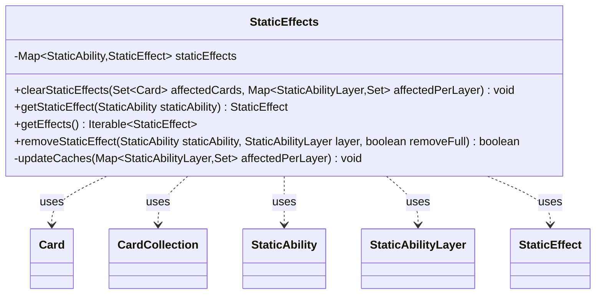

---
aliases:
  - StaticEffects
tags:
  - java/class
  - module/forge-game
  - pkg/forge/game
fqn: forge.game.StaticEffects
package: forge.game
module: forge-game
kind: Class
---

# StaticEffects

**Package:** `forge.game` &nbsp; **Module:** `forge-game` &nbsp; **Kind:** Class



## Relationships
**Uses:**
- [[forge.game.StaticEffect|StaticEffect]]
- [[forge.game.card.Card|Card]]
- [[forge.game.card.CardCollection|CardCollection]]
- [[forge.game.staticability.StaticAbility|StaticAbility]]
- [[forge.game.staticability.StaticAbilityLayer|StaticAbilityLayer]]

## Source
`forge-game/src/main/java/forge/game/StaticEffects.java`

```java
/*
 * Forge: Play Magic: the Gathering.
 * Copyright (C) 2011  Forge Team
 *
 * This program is free software: you can redistribute it and/or modify
 * it under the terms of the GNU General Public License as published by
 * the Free Software Foundation, either version 3 of the License, or
 * (at your option) any later version.
 * 
 * This program is distributed in the hope that it will be useful,
 * but WITHOUT ANY WARRANTY; without even the implied warranty of
 * MERCHANTABILITY or FITNESS FOR A PARTICULAR PURPOSE.  See the
 * GNU General Public License for more details.
 * 
 * You should have received a copy of the GNU General Public License
 * along with this program.  If not, see <http://www.gnu.org/licenses/>.
 */
package forge.game;

import java.util.Map;
import java.util.Set;

import com.google.common.collect.Lists;
import com.google.common.collect.Maps;

import forge.game.card.Card;
import forge.game.card.CardCollection;
import forge.game.staticability.StaticAbility;
import forge.game.staticability.StaticAbilityLayer;

/**
 * <p>
 * StaticEffects class.
 * </p>
 * 
 * @author Forge
 * @version $Id$
 */
public class StaticEffects {

    // **************** StaticAbility system **************************
    private final Map<StaticAbility, StaticEffect> staticEffects = Maps.newHashMap();

    public final void clearStaticEffects(final Set<Card> affectedCards, Map<StaticAbilityLayer, Set<Card>> affectedPerLayer) {
        // remove all static effects
        for (final StaticEffect se : staticEffects.values()) {
            se.remove(affectedPerLayer).forEach(affectedCards::add);
        }
        this.staticEffects.clear();
        updateCaches(affectedPerLayer);
    }

    /**
     * Add a static effect to the list of static effects.
     * 
     * @param staticAbility
     *            a {@link StaticAbility}.
     */
    public final StaticEffect getStaticEffect(final StaticAbility staticAbility) {
        final StaticEffect currentEffect = staticEffects.get(staticAbility);
        if (currentEffect != null) {
            return currentEffect;
        }

        final StaticEffect newEffect = new StaticEffect(staticAbility);
        this.staticEffects.put(staticAbility, newEffect);
        return newEffect;
    }

    public Iterable<StaticEffect> getEffects() {
        return staticEffects.values();
    }

    public boolean removeStaticEffect(final StaticAbility staticAbility, final StaticAbilityLayer layer, final boolean removeFull) {
        final StaticEffect currentEffect;
        if (removeFull) {
            currentEffect = staticEffects.remove(staticAbility);
        } else {
            currentEffect = staticEffects.get(staticAbility);
        }
        if (currentEffect == null) {
            return false;
        }
        Map<StaticAbilityLayer, Set<Card>> affectedPerLayer = Maps.newHashMap();
        currentEffect.remove(affectedPerLayer, Lists.newArrayList(layer));
        updateCaches(affectedPerLayer);
        return true;
    }

    private void updateCaches(Map<StaticAbilityLayer, Set<Card>> affectedPerLayer) {
        CardCollection affectedKeywordsBefore = new CardCollection();
        if (affectedPerLayer.containsKey(StaticAbilityLayer.TEXT)) {
            affectedKeywordsBefore.addAll(affectedPerLayer.get(StaticAbilityLayer.TEXT));
        }
        if (affectedPerLayer.containsKey(StaticAbilityLayer.TYPE)) {
            // setting Basic Land Type case
            affectedKeywordsBefore.addAll(affectedPerLayer.get(StaticAbilityLayer.TYPE));
        }
        if (affectedPerLayer.containsKey(StaticAbilityLayer.ABILITIES)) {
            affectedKeywordsBefore.addAll(affectedPerLayer.get(StaticAbilityLayer.ABILITIES));
        }
        affectedKeywordsBefore.forEach(Card::updateKeywordsCache);
    }
}
```
