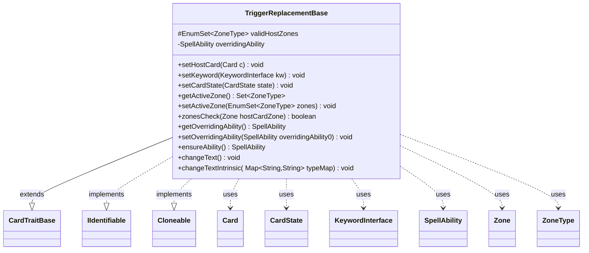

---
aliases:
  - TriggerReplacementBase
tags:
  - java/class
  - module/forge-game
  - pkg/forge/game
fqn: forge.game.TriggerReplacementBase
package: forge.game
module: forge-game
kind: Class
---

# TriggerReplacementBase

**Package:** `forge.game` &nbsp; **Module:** `forge-game` &nbsp; **Kind:** Class



## Relationships
**Extends:**
- [[forge.game.CardTraitBase|CardTraitBase]]
**Implements:**
- [[forge.game.IIdentifiable|IIdentifiable]]
**Uses:**
- [[forge.game.card.Card|Card]]
- [[forge.game.card.CardState|CardState]]
- [[forge.game.keyword.KeywordInterface|KeywordInterface]]
- [[forge.game.spellability.SpellAbility|SpellAbility]]
- [[forge.game.zone.Zone|Zone]]
- [[forge.game.zone.ZoneType|ZoneType]]

## Design Description

TriggerReplacementBase is an abstract base for card traits whose behavior is gated by zone and can be backed by an effect, sitting between `CardTraitBase` and concrete trigger and replacement-effect subclasses. Extending `CardTraitBase` and implementing `IIdentifiable` and `Cloneable`, it adds the shared machinery these traits need: a set of valid host zones, a `zonesCheck` that confirms the host card is in an active zone and not phased out, and an optional `overridingAbility` that supplies alternate effect behavior.

Its central design intent is to keep this overriding `SpellAbility` synchronized with its owner: `setHostCard`, `setKeyword`, and `setCardState` propagate to it, and `setOverridingAbility` inherits the trait's intrinsic flag. Text-changing operations (`changeText`, `changeTextIntrinsic`) delegate through the abstract `ensureAbility` hook, letting subclasses define how their effect ability is resolved while reusing common collaboration with `Card`, `CardState`, `KeywordInterface`, `Zone`, and `ZoneType`.

## Source
`forge-game/src/main/java/forge/game/TriggerReplacementBase.java`

```java
package forge.game;

import java.util.EnumSet;
import java.util.Map;
import java.util.Set;

import forge.game.card.Card;
import forge.game.card.CardState;
import forge.game.keyword.KeywordInterface;
import forge.game.spellability.SpellAbility;
import forge.game.zone.Zone;
import forge.game.zone.ZoneType;

/**
 * Created by Hellfish on 2014-02-09.
 */
public abstract class TriggerReplacementBase extends CardTraitBase implements IIdentifiable, Cloneable {
    protected EnumSet<ZoneType> validHostZones;

    /** The overriding ability. */
    private SpellAbility overridingAbility = null;

    @Override
    public void setHostCard(final Card c) {
        super.setHostCard(c);
        if (overridingAbility != null) {
            overridingAbility.setHostCard(c);
        }
    }

    @Override
    public void setKeyword(final KeywordInterface kw) {
        super.setKeyword(kw);
        if (overridingAbility != null) {
            overridingAbility.setKeyword(kw);
        }
    }

    @Override
    public void setCardState(CardState state) {
        super.setCardState(state);
        if (overridingAbility != null) {
            overridingAbility.setCardState(state);
        }
    }

    public Set<ZoneType> getActiveZone() {
        return validHostZones;
    }
    public void setActiveZone(EnumSet<ZoneType> zones) {
        validHostZones = zones;
    }

    /**
     * <p>
     * zonesCheck.
     * </p>
     *
     * @return a boolean.
     */
    public final boolean zonesCheck(Zone hostCardZone) {
        return !this.hostCard.isPhasedOut()
                && (validHostZones == null || validHostZones.isEmpty()
                || (hostCardZone != null && validHostZones.contains(hostCardZone.getZoneType()))
        );
    }

    /**
     * Gets the overriding ability.
     *
     * @return the overridingAbility
     */
    public SpellAbility getOverridingAbility() {
        return this.overridingAbility;
    }

    /**
     * Sets the overriding ability.
     *
     * @param overridingAbility0
     *            the overridingAbility to set
     */
    public void setOverridingAbility(final SpellAbility overridingAbility0) {
        this.overridingAbility = overridingAbility0;
        overridingAbility0.setIntrinsic(intrinsic);
    }

    abstract public SpellAbility ensureAbility();

    /* (non-Javadoc)
     * @see forge.game.CardTraitBase#changeText()
     */
    @Override
    public void changeText() {
        if (!isIntrinsic()) {
            return;
        }
        super.changeText();

        SpellAbility sa = ensureAbility();

        if (sa != null) {
            sa.changeText();
        }
    }

    /* (non-Javadoc)
     * @see forge.game.CardTraitBase#changeTextIntrinsic(java.util.Map, java.util.Map)
     */
    @Override
    public void changeTextIntrinsic(Map<String, String> colorMap, Map<String, String> typeMap) {
        super.changeTextIntrinsic(colorMap, typeMap);

        SpellAbility sa = ensureAbility();

        if (sa != null) {
            sa.changeTextIntrinsic(colorMap, typeMap);
        }
    }
}
```

## Python
`forge/game/TriggerReplacementBase.py`

```python
from typing import Map, Set
from forge.game.CardTraitBase import CardTraitBase
from forge.game.IIdentifiable import IIdentifiable
from forge.game.card.Card import Card
from forge.game.card.CardState import CardState
from forge.game.keyword.KeywordInterface import KeywordInterface
from forge.game.spellability.SpellAbility import SpellAbility
from forge.game.zone.Zone import Zone
from forge.game.zone.ZoneType import ZoneType


# Created by Hellfish on 2014-02-09.
class TriggerReplacementBase(CardTraitBase, IIdentifiable):
    def __init__(self):
        super().__init__()
        self.validHostZones: set[ZoneType] = None
        # The overriding ability.
        self.overridingAbility: SpellAbility = None

    def setHostCard(self, c: Card) -> None:
        super().setHostCard(c)
        if self.overridingAbility is not None:
            self.overridingAbility.setHostCard(c)

    def setKeyword(self, kw: KeywordInterface) -> None:
        super().setKeyword(kw)
        if self.overridingAbility is not None:
            self.overridingAbility.setKeyword(kw)

    def setCardState(self, state: CardState) -> None:
        super().setCardState(state)
        if self.overridingAbility is not None:
            self.overridingAbility.setCardState(state)

    def getActiveZone(self) -> Set[ZoneType]:
        return self.validHostZones

    def setActiveZone(self, zones: Set[ZoneType]) -> None:
        self.validHostZones = zones

    def zonesCheck(self, hostCardZone: Zone) -> bool:
        return (not self.hostCard.isPhasedOut()
                and (self.validHostZones is None or len(self.validHostZones) == 0
                     or (hostCardZone is not None
                         and hostCardZone.getZoneType() in self.validHostZones)))

    def getOverridingAbility(self) -> SpellAbility:
        return self.overridingAbility

    def setOverridingAbility(self, overridingAbility0: SpellAbility) -> None:
        self.overridingAbility = overridingAbility0
        overridingAbility0.setIntrinsic(self.intrinsic)

    def ensureAbility(self) -> SpellAbility:
        raise NotImplementedError

    def changeText(self) -> None:
        if not self.isIntrinsic():
            return
        super().changeText()

        sa = self.ensureAbility()

        if sa is not None:
            sa.changeText()

    def changeTextIntrinsic(self, colorMap: Map[str, str], typeMap: Map[str, str]) -> None:
        super().changeTextIntrinsic(colorMap, typeMap)

        sa = self.ensureAbility()

        if sa is not None:
            sa.changeTextIntrinsic(colorMap, typeMap)
```
