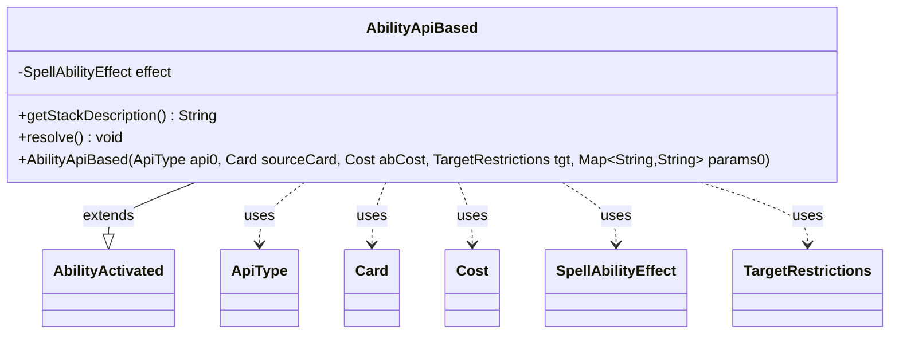

---
aliases:
  - AbilityApiBased
tags:
  - java/class
  - module/forge-game
  - pkg/forge/game/ability
fqn: forge.game.ability.AbilityApiBased
package: forge.game.ability
module: forge-game
kind: Class
---

# AbilityApiBased

**Package:** `forge.game.ability` &nbsp; **Module:** `forge-game` &nbsp; **Kind:** Class



## Relationships
**Extends:**
- [[forge.game.spellability.AbilityActivated|AbilityActivated]]
**Uses:**
- [[forge.game.ability.ApiType|ApiType]]
- [[forge.game.ability.SpellAbilityEffect|SpellAbilityEffect]]
- [[forge.game.card.Card|Card]]
- [[forge.game.cost.Cost|Cost]]
- [[forge.game.spellability.TargetRestrictions|TargetRestrictions]]


## Design Description

AbilityApiBased is a concrete activated ability that delegates its game-rules behavior to a pluggable effect implementation. As a subclass of `AbilityActivated`, it represents an ability whose semantics are determined at construction time by an `ApiType`: the constructor resolves the type's associated `SpellAbilityEffect`, stores it, and lets that effect build out the ability's structure from the supplied parameter map. The class collaborates with `Card`, `Cost`, and `TargetRestrictions` only to forward the standard activated-ability state to its superclass.

The design intent is thin delegation. Rather than encoding behavior per ability, the class overrides `getStackDescription()` and `resolve()` to forward both presentation and execution to the shared effect object, keying off the captured parameters. This lets a single class back the engine's many API-driven abilities, with the `ApiType`/`SpellAbilityEffect` pairing supplying the varying logic while preserving the original parameters for later reference.

## Source
`forge-game/src/main/java/forge/game/ability/AbilityApiBased.java`

```java
package forge.game.ability;

import forge.game.card.Card;
import forge.game.cost.Cost;
import forge.game.spellability.AbilityActivated;
import forge.game.spellability.TargetRestrictions;

import java.util.Map;

public class AbilityApiBased extends AbilityActivated {
    private final SpellAbilityEffect effect;

    public AbilityApiBased(ApiType api0, Card sourceCard, Cost abCost, TargetRestrictions tgt, Map<String, String> params0) {
        super(sourceCard, abCost, tgt);
        mapParams.putAll(params0);
        api = api0;
        effect = api.getSpellEffect();

        effect.buildSpellAbility(this);
        originalMapParams.putAll(mapParams);
    }

    @Override
    public String getStackDescription() {
        return effect.getStackDescriptionWithSubs(mapParams, this);
    }

    /* (non-Javadoc)
     * @see forge.card.spellability.SpellAbility#resolve()
     */
    @Override
    public void resolve() {
        effect.resolve(this);
    }
}
```

## Python
`forge/game/ability/AbilityApiBased.py`

```python
from forge.game.card.Card import Card
from forge.game.cost.Cost import Cost
from forge.game.spellability.AbilityActivated import AbilityActivated
from forge.game.spellability.TargetRestrictions import TargetRestrictions
from forge.game.ability.ApiType import ApiType
from forge.game.ability.SpellAbilityEffect import SpellAbilityEffect

import typing


class AbilityApiBased(AbilityActivated):
    def __init__(self, api0: ApiType, sourceCard: Card, abCost: Cost, tgt: TargetRestrictions, params0: typing.Dict[str, str]):
        super().__init__(sourceCard, abCost, tgt)
        self.mapParams.update(params0)
        self.api = api0
        self.effect = self.api.getSpellEffect()

        self.effect.buildSpellAbility(self)
        self.originalMapParams.update(self.mapParams)

    def getStackDescription(self) -> str:
        return self.effect.getStackDescriptionWithSubs(self.mapParams, self)

    #  (non-Javadoc)
    #  @see forge.card.spellability.SpellAbility#resolve()
    def resolve(self) -> None:
        self.effect.resolve(self)
```
