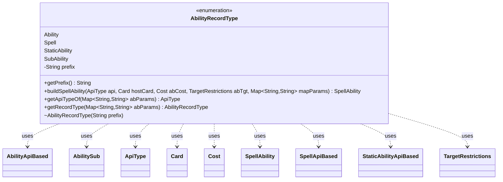

---
aliases:
  - AbilityRecordType
tags:
  - java/enum
  - module/forge-game
  - pkg/forge/game/ability
fqn: forge.game.ability.AbilityFactory.AbilityRecordType
package: forge.game.ability
module: forge-game
kind: Enum
---

# AbilityRecordType

**Package:** `forge.game.ability`   **Module:** `forge-game`   **Kind:** Enum



## Relationships
**Uses:**
- [[forge.game.ability.AbilityApiBased|AbilityApiBased]]
- [[forge.game.ability.ApiType|ApiType]]
- [[forge.game.ability.SpellApiBased|SpellApiBased]]
- [[forge.game.ability.StaticAbilityApiBased|StaticAbilityApiBased]]
- [[forge.game.card.Card|Card]]
- [[forge.game.cost.Cost|Cost]]
- [[forge.game.spellability.AbilitySub|AbilitySub]]
- [[forge.game.spellability.SpellAbility|SpellAbility]]
- [[forge.game.spellability.TargetRestrictions|TargetRestrictions]]

## Design Description

`AbilityRecordType` is a nested enum within `AbilityFactory` that classifies a card-script ability by one of four kinds—`Ability` ("AB"), `Spell` ("SP"), `StaticAbility` ("ST"), or `SubAbility` ("DB")—each tagged with the script prefix that identifies it inside a parsed parameter map. Its central responsibility is to act as a factory dispatcher: `buildSpellAbility` switches on the constant to instantiate the matching `SpellAbility` subtype (`AbilityApiBased`, `SpellApiBased`, `StaticAbilityApiBased`, or `AbilitySub`), wiring in the `ApiType`, host `Card`, `Cost`, and `TargetRestrictions`.

The static `getRecordType` and `getApiTypeOf` helpers recover the kind and its `ApiType` from a raw `Map<String,String>`, letting the enclosing factory drive ability construction directly from parsed script text. This design centralizes the prefix-to-type mapping in one place, replacing scattered conditionals with a self-describing enum that couples each record kind to both its textual marker and its concrete constructor.

## Source
`forge-game/src/main/java/forge/game/ability/AbilityFactory.java` — declaration excerpt

```java
    public enum AbilityRecordType {
        Ability("AB"),
        Spell("SP"),
        StaticAbility("ST"),
        SubAbility("DB");

        private final String prefix;
        AbilityRecordType(String prefix) {
            this.prefix = prefix;
        }
        public String getPrefix() {
            return prefix;
        }

        public SpellAbility buildSpellAbility(ApiType api, Card hostCard, Cost abCost, TargetRestrictions abTgt, Map<String, String> mapParams) {
            switch(this) {
                case Ability: return new AbilityApiBased(api, hostCard, abCost, abTgt, mapParams);
                case Spell: return new SpellApiBased(api, hostCard, abCost, abTgt, mapParams);
                case StaticAbility: return new StaticAbilityApiBased(api, hostCard, abCost, abTgt, mapParams);
                case SubAbility: return new AbilitySub(api, hostCard, abTgt, mapParams);
            }
            return null; // exception here would be fine!
        }

        public ApiType getApiTypeOf(Map<String, String> abParams) {
            return ApiType.smartValueOf(abParams.get(this.getPrefix()));
        }

        public static AbilityRecordType getRecordType(Map<String, String> abParams) {
            if (abParams.containsKey(AbilityRecordType.Ability.getPrefix())) {
                return AbilityRecordType.Ability;
            } else if (abParams.containsKey(AbilityRecordType.Spell.getPrefix())) {
                return AbilityRecordType.Spell;
            } else if (abParams.containsKey(AbilityRecordType.StaticAbility.getPrefix())) {
                return AbilityRecordType.StaticAbility;
            } else if (abParams.containsKey(AbilityRecordType.SubAbility.getPrefix())) {
                return AbilityRecordType.SubAbility;
            } else {
                return null;
            }
        }
    }
```
