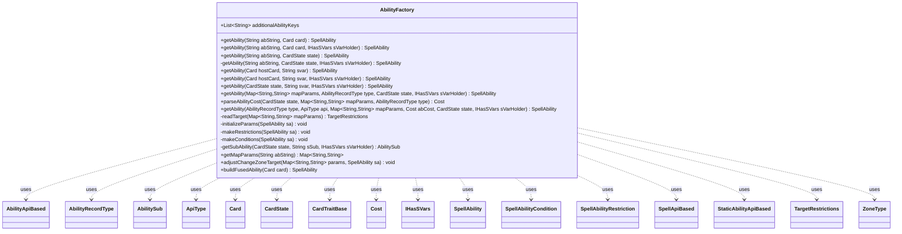

---
aliases:
  - AbilityFactory
tags:
  - java/class
  - module/forge-game
  - pkg/forge/game/ability
fqn: forge.game.ability.AbilityFactory
package: forge.game.ability
module: forge-game
kind: Class
---

# AbilityFactory

**Package:** `forge.game.ability`   **Module:** `forge-game`   **Kind:** Class



## Relationships
**Uses:**
- [[forge.game.CardTraitBase|CardTraitBase]]
- [[forge.game.IHasSVars|IHasSVars]]
- [[forge.game.ability.AbilityApiBased|AbilityApiBased]]
- [[forge.game.ability.AbilityFactory.AbilityRecordType|AbilityRecordType]]
- [[forge.game.ability.ApiType|ApiType]]
- [[forge.game.ability.SpellApiBased|SpellApiBased]]
- [[forge.game.ability.StaticAbilityApiBased|StaticAbilityApiBased]]
- [[forge.game.card.Card|Card]]
- [[forge.game.card.CardState|CardState]]
- [[forge.game.cost.Cost|Cost]]
- [[forge.game.spellability.AbilitySub|AbilitySub]]
- [[forge.game.spellability.SpellAbility|SpellAbility]]
- [[forge.game.spellability.SpellAbilityCondition|SpellAbilityCondition]]
- [[forge.game.spellability.SpellAbilityRestriction|SpellAbilityRestriction]]
- [[forge.game.spellability.TargetRestrictions|TargetRestrictions]]
- [[forge.game.zone.ZoneType|ZoneType]]


## Design Description

`AbilityFactory` is a `final`, stateless utility class that acts as the central parser and builder of the ability system, translating Forge's `$`-delimited card-script strings into runtime `SpellAbility` objects. Its overloaded static `getAbility` methods resolve an ability either from a raw script line or indirectly through an SVar on a `Card`/`CardState`; they map parameters via `getMapParams`, derive a `Cost` through `parseAbilityCost`, read optional `TargetRestrictions`, and delegate construction to the inner `AbilityRecordType` enum.

That enum classifies the four ability kinds (AB/SP/ST/DB) and selects the matching `AbilityApiBased`, `SpellApiBased`, `StaticAbilityApiBased`, or `AbilitySub` subtype keyed by `ApiType`. The factory then wires the assembled tree—recursively attaching sub-abilities, additional ability keys, choices, descriptions, restrictions, and conditions—and supplies specialized builders like `buildFusedAbility` for split cards. Sentry breadcrumbs around construction signal a deliberate focus on diagnosing data-driven scripting failures.

## Source
`forge-game/src/main/java/forge/game/ability/AbilityFactory.java`

```java
/*
 * Forge: Play Magic: the Gathering.
 * Copyright (C) 2011  Forge Team
 *
 * This program is free software: you can redistribute it and/or modify
 * it under the terms of the GNU General Public License as published by
 * the Free Software Foundation, either version 3 of the License, or
 * (at your option) any later version.
 *
 * This program is distributed in the hope that it will be useful,
 * but WITHOUT ANY WARRANTY; without even the implied warranty of
 * MERCHANTABILITY or FITNESS FOR A PARTICULAR PURPOSE.  See the
 * GNU General Public License for more details.
 *
 * You should have received a copy of the GNU General Public License
 * along with this program.  If not, see <http://www.gnu.org/licenses/>.
 */
package forge.game.ability;

import com.google.common.collect.Lists;
import com.google.common.collect.Maps;
import forge.card.CardStateName;
import forge.game.CardTraitBase;
import forge.game.IHasSVars;
import forge.game.ability.effects.CharmEffect;
import forge.game.ability.effects.RollDiceEffect;
import forge.game.card.Card;
import forge.game.card.CardState;
import forge.game.cost.Cost;
import forge.game.spellability.*;
import forge.game.zone.ZoneType;
import forge.util.FileSection;
import io.sentry.Breadcrumb;
import io.sentry.Sentry;

import java.util.List;
import java.util.Map;
import java.util.stream.Collectors;

/**
 * <p>
 * AbilityFactory class.
 * </p>
 *
 * @author Forge
 * @version $Id$
 */
public final class AbilityFactory {

    public static final List<String> additionalAbilityKeys = Lists.newArrayList(
            "WinSubAbility", "OtherwiseSubAbility", // Clash
            "BidSubAbility", // BidLifeEffect
            "ChooseNumberSubAbility", "Lowest", "Highest", "NotLowest", "GuessCorrect", "GuessWrong", "MatchedAbility", "UnmatchedAbility", // ChooseNumber
            "HeadsSubAbility", "TailsSubAbility", "LoseSubAbility", // FlipCoin
            "TrueSubAbility", "FalseSubAbility", // Branch
            "ChosenPile", "UnchosenPile", // MultiplePiles & TwoPiles
            "RepeatSubAbility", // Repeat & RepeatEach
            "Execute", // DelayedTrigger
            "FallbackAbility", // Complex Unless costs which can be unpayable
            "ChooseSubAbility", // Can choose a player via ChoosePlayer
            "CantChooseSubAbility", // Can't choose a player via ChoosePlayer
            "RegenerationAbility", // for Regeneration Effect
            "ReturnAbility", // for Delayed Trigger on Magpie
            "GiftAbility", // for Promise Gift
            "VoteSubAbility", // for Vote with VoteCard
            "VoteTiedAbility" // for fallback to Choices
        );

    public enum AbilityRecordType {
        Ability("AB"),
        Spell("SP"),
        StaticAbility("ST"),
        SubAbility("DB");

        private final String prefix;
        AbilityRecordType(String prefix) {
            this.prefix = prefix;
        }
        public String getPrefix() {
            return prefix;
        }

        public SpellAbility buildSpellAbility(ApiType api, Card hostCard, Cost abCost, TargetRestrictions abTgt, Map<String, String> mapParams) {
            switch(this) {
                case Ability: return new AbilityApiBased(api, hostCard, abCost, abTgt, mapParams);
                case Spell: return new SpellApiBased(api, hostCard, abCost, abTgt, mapParams);
                case StaticAbility: return new StaticAbilityApiBased(api, hostCard, abCost, abTgt, mapParams);
                case SubAbility: return new AbilitySub(api, hostCard, abTgt, mapParams);
            }
            return null; // exception here would be fine!
        }

        public ApiType getApiTypeOf(Map<String, String> abParams) {
            return ApiType.smartValueOf(abParams.get(this.getPrefix()));
        }

        public static AbilityRecordType getRecordType(Map<String, String> abParams) {
            if (abParams.containsKey(AbilityRecordType.Ability.getPrefix())) {
                return AbilityRecordType.Ability;
            } else if (abParams.containsKey(AbilityRecordType.Spell.getPrefix())) {
                return AbilityRecordType.Spell;
            } else if (abParams.containsKey(AbilityRecordType.StaticAbility.getPrefix())) {
                return AbilityRecordType.StaticAbility;
            } else if (abParams.containsKey(AbilityRecordType.SubAbility.getPrefix())) {
                return AbilityRecordType.SubAbility;
            } else {
                return null;
            }
        }
    }

    public static SpellAbility getAbility(final String abString, final Card card) {
        return getAbility(abString, card.getCurrentState());
    }
    public static SpellAbility getAbility(final String abString, final Card card, final IHasSVars sVarHolder) {
        return getAbility(abString, card.getCurrentState(), sVarHolder);
    }
    /**
     * <p>
     * getAbility.
     * </p>
     *
     * @param abString
     *            a {@link java.lang.String} object.
     * @param state
     *            a {@link forge.game.card.CardState} object.
     * @return a {@link forge.game.spellability.SpellAbility} object.
     */
    public static SpellAbility getAbility(final String abString, final CardState state) {
        return getAbility(abString, state, state);
    }

    private static SpellAbility getAbility(final String abString, final CardState state, final IHasSVars sVarHolder) {
        Map<String, String> mapParams;
        try {
            mapParams = AbilityFactory.getMapParams(abString);
        }
        catch (RuntimeException ex) {
            throw new RuntimeException(state.getName() + ": " + ex.getMessage());
        }
        // parse universal parameters
        AbilityRecordType type = AbilityRecordType.getRecordType(mapParams);
        if (null == type) {
            String source = state.getName().isEmpty() ? abString : state.getName();
            throw new RuntimeException("AbilityFactory : getAbility -- no API in " + source + ": " + abString);
        }
        try {
            return getAbility(mapParams, type, state, sVarHolder);
        } catch (Error | Exception ex) {
            String msg = "AbilityFactory:getAbility: crash when trying to create ability ";

            Breadcrumb bread = new Breadcrumb(msg);
            bread.setData("Card", state.getName());
            bread.setData("Ability", abString);

            Sentry.addBreadcrumb(bread);
            throw new RuntimeException(msg + " of card: " + state.getName(), ex);
        }
    }

    public static SpellAbility getAbility(final Card hostCard, final String svar) {
        return getAbility(hostCard, svar, hostCard.getCurrentState());
    }

    public static SpellAbility getAbility(final Card hostCard, final String svar, final IHasSVars sVarHolder) {
        return getAbility(hostCard.getCurrentState(), svar, sVarHolder);
    }

    public static SpellAbility getAbility(final CardState state, final String svar, final IHasSVars sVarHolder) {
        if (!sVarHolder.hasSVar(svar)) {
            String source = state.getCard().getName();
            throw new RuntimeException("AbilityFactory : getAbility -- " + source +  " has no SVar: " + svar);
        } else {
            return getAbility(sVarHolder.getSVar(svar), state, sVarHolder);
        }
    }

    public static SpellAbility getAbility(final Map<String, String> mapParams, AbilityRecordType type, final CardState state, final IHasSVars sVarHolder) {
        return getAbility(type, type.getApiTypeOf(mapParams), mapParams, null, state, sVarHolder);
    }

    public static Cost parseAbilityCost(final CardState state, Map<String, String> mapParams, AbilityRecordType type) {
        if (type == AbilityRecordType.SubAbility) {
            return null;
        }
        String cost = mapParams.get("Cost");
        if (cost != null) {
            return new Cost(cost, type == AbilityRecordType.Ability);
        }
        if (type == AbilityRecordType.Spell) {
            // for a Spell if no Cost is used, use the card states ManaCost
            return new Cost(state.getManaCost(), false);
        } else {
            throw new RuntimeException("AbilityFactory : getAbility -- no Cost in " + state.getName());
        }
    }

    public static SpellAbility getAbility(AbilityRecordType type, ApiType api, Map<String, String> mapParams,
            Cost abCost, final CardState state, final IHasSVars sVarHolder) {
        final Card hostCard = state.getCard();
        TargetRestrictions abTgt = mapParams.containsKey("ValidTgts") ? readTarget(mapParams) : null;

        if (abCost == null) {
            abCost = parseAbilityCost(state, mapParams, type);
        }
        SpellAbility spellAbility = type.buildSpellAbility(api, hostCard, abCost, abTgt, mapParams);

        if (spellAbility == null) {
            final StringBuilder msg = new StringBuilder();
            msg.append("AbilityFactory : SpellAbility was not created for ");
            msg.append(state.toString());
            msg.append(". Looking for API: ").append(api);
            throw new RuntimeException(msg.toString());
        }

        if (sVarHolder instanceof CardState) {
            spellAbility.setCardState((CardState)sVarHolder);
        } else if (sVarHolder instanceof CardTraitBase) {
            spellAbility.setCardState(((CardTraitBase)sVarHolder).getCardState());
        } else {
            spellAbility.setCardState(state);
        }

        // *********************************************
        // set universal properties of the SpellAbility

        if ((api == ApiType.DelayedTrigger || api == ApiType.ImmediateTrigger) && mapParams.containsKey("Execute")) {
            spellAbility.setSVar(mapParams.get("Execute"), sVarHolder.getSVar(mapParams.get("Execute")));
        }

        if (mapParams.containsKey("PreventionSubAbility")) {
            spellAbility.setSVar(mapParams.get("PreventionSubAbility"), sVarHolder.getSVar(mapParams.get("PreventionSubAbility")));
        }

        if (mapParams.containsKey("SubAbility")) {
            final String name = mapParams.get("SubAbility");
            spellAbility.setSubAbility(getSubAbility(state, name, sVarHolder));
        }

        for (final String key : additionalAbilityKeys) {
            if (mapParams.containsKey(key) && spellAbility.getAdditionalAbility(key) == null) {
                spellAbility.setAdditionalAbility(key, getAbility(state, mapParams.get(key), sVarHolder));
            }
        }

        if (api == ApiType.Charm || api == ApiType.GenericChoice || api == ApiType.AssignGroup || api == ApiType.VillainousChoice || api == ApiType.Vote) {
            final String key = "Choices";
            if (mapParams.containsKey(key)) {
                List<String> names = Lists.newArrayList(mapParams.get(key).split(","));
                spellAbility.setAdditionalAbilityList(key, names.stream().map(input -> {
                    AbilitySub sub = getSubAbility(state, input, sVarHolder);
                    if (api == ApiType.GenericChoice) {
                        // support scripters adding restrictions to filter illegal choices
                        sub.setRestrictions(new SpellAbilityRestriction());
                        makeRestrictions(sub);
                    }
                    return sub;
                }).collect(Collectors.toList()));
            }
        }

        if (api == ApiType.RollDice) {
            final String key = "ResultSubAbilities";
            if (mapParams.containsKey(key)) {
                String [] diceAbilities = mapParams.get(key).split(",");
                for (String ab : diceAbilities) {
                    String [] kv = ab.split(":");
                    spellAbility.setAdditionalAbility(kv[0], getSubAbility(state, kv[1], sVarHolder));
                }
            }
        }

        if (spellAbility instanceof SpellApiBased && hostCard.isPermanent()) {
            String desc = mapParams.getOrDefault("SpellDescription", spellAbility.getHostCard().getName());
            spellAbility.setDescription(desc);
        } else if (spellAbility.hasParam("SpellDescription")) {
            spellAbility.rebuiltDescription();
        } else if (api == ApiType.Charm) {
            spellAbility.setDescription(CharmEffect.makeFormatedDescription(spellAbility));
        } else {
            spellAbility.setDescription("");
        }

        if (api == ApiType.RollDice) {
            spellAbility.setDescription(spellAbility.getDescription() + RollDiceEffect.makeFormatedDescription(spellAbility));
        } else if (api == ApiType.Repeat) {
            spellAbility.setDescription(spellAbility.getDescription() + spellAbility.getAdditionalAbility("RepeatSubAbility").getDescription());
        }

        initializeParams(spellAbility);
        makeRestrictions(spellAbility);
        makeConditions(spellAbility);

        return spellAbility;
    }

    private static TargetRestrictions readTarget(Map<String, String> mapParams) {
        // TgtPrompt should only be needed for more complicated ValidTgts
        return new TargetRestrictions(mapParams);
    }

    /**
     * <p>
     * initializeParams.
     * </p>
     *
     * @param sa
     *            a {@link forge.game.spellability.SpellAbility} object.
     */
    private static void initializeParams(final SpellAbility sa) {
        if (sa.hasParam("NonBasicSpell")) {
            sa.setBasicSpell(false);
        }
    }

    /**
     * <p>
     * makeRestrictions.
     * </p>
     *
     * @param sa
     *            a {@link forge.game.spellability.SpellAbility} object.
     */
    private static void makeRestrictions(final SpellAbility sa) {
        // SpellAbilityRestrictions should be added in here
        final SpellAbilityRestriction restrict = sa.getRestrictions();
        if (restrict != null) {
            restrict.setRestrictions(sa.getMapParams());
        }
    }

    /**
     * <p>
     * makeConditions.
     * </p>
     *
     * @param sa
     *            a {@link forge.game.spellability.SpellAbility} object.
     */
    private static void makeConditions(final SpellAbility sa) {
        // SpellAbilityConditions should be added in here
        final SpellAbilityCondition condition = sa.getConditions();
        condition.setConditions(sa.getMapParams());
    }

    // Easy creation of SubAbilities
    /**
     * <p>
     * getSubAbility.
     * </p>
     * @param sSub
     *
     * @return a {@link forge.game.spellability.AbilitySub} object.
     */
    private static AbilitySub getSubAbility(CardState state, String sSub, final IHasSVars sVarHolder) {
        if (sVarHolder.hasSVar(sSub)) {
            return (AbilitySub) AbilityFactory.getAbility(state, sSub, sVarHolder);
        }
        System.out.println("SubAbility '"+ sSub +"' not found for: " + state.getName());

        return null;
    }

    public static Map<String, String> getMapParams(final String abString) {
        return FileSection.parseToMap(abString, FileSection.DOLLAR_SIGN_KV_SEPARATOR);
    }

    public static void adjustChangeZoneTarget(final Map<String, String> params, final SpellAbility sa) {
        if (params.containsKey("Origin")) {
            List<ZoneType> origin = ZoneType.listValueOf(params.get("Origin"));

            final TargetRestrictions tgt = sa.getTargetRestrictions();

            // Don't set the zone if it targets a player
            if (tgt != null && !tgt.canTgtPlayer()) {
                tgt.setZone(origin);
            }
        }
    }

    public static SpellAbility buildFusedAbility(final Card card) {
        if (!card.isSplitCard())
            throw new IllegalStateException("Fuse ability may be built only on split cards");

        CardState leftState = card.getState(CardStateName.LeftSplit);
        SpellAbility leftAbility = leftState.getFirstAbility();
        Map<String, String> leftMap = Maps.newHashMap(leftAbility.getMapParams());
        AbilityRecordType leftType = AbilityRecordType.getRecordType(leftMap);
        ApiType leftApi = leftType.getApiTypeOf(leftMap);
        leftMap.put("StackDescription", leftMap.get("SpellDescription"));
        leftMap.put("SpellDescription", "Fuse (You may cast one or both halves of this card from your hand.)");
        leftMap.put("ActivationZone", "Hand");
        leftMap.put("Secondary", "True");

        CardState rightState = card.getState(CardStateName.RightSplit);
        SpellAbility rightAbility = rightState.getFirstAbility();
        Map<String, String> rightMap = Maps.newHashMap(rightAbility.getMapParams());

        AbilityRecordType rightType = AbilityRecordType.getRecordType(rightMap);
        ApiType rightApi = leftType.getApiTypeOf(rightMap);
        rightMap.put("StackDescription", rightMap.get("SpellDescription"));
        rightMap.put("SpellDescription", "");

        Cost totalCost = parseAbilityCost(leftState, leftMap, leftType);
        totalCost.add(parseAbilityCost(rightState, rightMap, rightType));

        final SpellAbility left = getAbility(leftType, leftApi, leftMap, totalCost, leftState, leftState);
        left.setOriginalAbility(leftAbility);
        left.setCardState(card.getState(CardStateName.Original));
        final AbilitySub right = (AbilitySub) getAbility(AbilityRecordType.SubAbility, rightApi, rightMap, null, rightState, rightState);
        right.setOriginalAbility(rightAbility);
        left.appendSubAbility(right);
        return left;
    }
}
```

## Python
`forge/game/ability/AbilityFactory.py`

```python
from enum import Enum

from forge.card.CardStateName import CardStateName
from forge.game.CardTraitBase import CardTraitBase
from forge.game.IHasSVars import IHasSVars
from forge.game.ability.AbilityApiBased import AbilityApiBased
from forge.game.ability.ApiType import ApiType
from forge.game.ability.SpellApiBased import SpellApiBased
from forge.game.ability.StaticAbilityApiBased import StaticAbilityApiBased
from forge.game.ability.effects.CharmEffect import CharmEffect
from forge.game.ability.effects.RollDiceEffect import RollDiceEffect
from forge.game.card.Card import Card
from forge.game.card.CardState import CardState
from forge.game.cost.Cost import Cost
from forge.game.spellability.AbilitySub import AbilitySub
from forge.game.spellability.SpellAbility import SpellAbility
from forge.game.spellability.SpellAbilityCondition import SpellAbilityCondition
from forge.game.spellability.SpellAbilityRestriction import SpellAbilityRestriction
from forge.game.spellability.TargetRestrictions import TargetRestrictions
from forge.game.zone.ZoneType import ZoneType
from forge.util.FileSection import FileSection
from io.sentry.Breadcrumb import Breadcrumb
from io.sentry.Sentry import Sentry


class AbilityFactory:
    """
    AbilityFactory class.

    @author Forge
    @version $Id$
    """

    additionalAbilityKeys = [
        "WinSubAbility", "OtherwiseSubAbility",  # Clash
        "BidSubAbility",  # BidLifeEffect
        "ChooseNumberSubAbility", "Lowest", "Highest", "NotLowest", "GuessCorrect", "GuessWrong", "MatchedAbility", "UnmatchedAbility",  # ChooseNumber
        "HeadsSubAbility", "TailsSubAbility", "LoseSubAbility",  # FlipCoin
        "TrueSubAbility", "FalseSubAbility",  # Branch
        "ChosenPile", "UnchosenPile",  # MultiplePiles & TwoPiles
        "RepeatSubAbility",  # Repeat & RepeatEach
        "Execute",  # DelayedTrigger
        "FallbackAbility",  # Complex Unless costs which can be unpayable
        "ChooseSubAbility",  # Can choose a player via ChoosePlayer
        "CantChooseSubAbility",  # Can't choose a player via ChoosePlayer
        "RegenerationAbility",  # for Regeneration Effect
        "ReturnAbility",  # for Delayed Trigger on Magpie
        "GiftAbility",  # for Promise Gift
        "VoteSubAbility",  # for Vote with VoteCard
        "VoteTiedAbility"  # for fallback to Choices
    ]

    class AbilityRecordType(Enum):
        Ability = "AB"
        Spell = "SP"
        StaticAbility = "ST"
        SubAbility = "DB"

        def __init__(self, prefix):
            self.prefix = prefix

        def getPrefix(self):
            return self.prefix

        def buildSpellAbility(self, api, hostCard, abCost, abTgt, mapParams):
            if self is AbilityFactory.AbilityRecordType.Ability:
                return AbilityApiBased(api, hostCard, abCost, abTgt, mapParams)
            elif self is AbilityFactory.AbilityRecordType.Spell:
                return SpellApiBased(api, hostCard, abCost, abTgt, mapParams)
            elif self is AbilityFactory.AbilityRecordType.StaticAbility:
                return StaticAbilityApiBased(api, hostCard, abCost, abTgt, mapParams)
            elif self is AbilityFactory.AbilityRecordType.SubAbility:
                return AbilitySub(api, hostCard, abTgt, mapParams)
            return None  # exception here would be fine!

        def getApiTypeOf(self, abParams):
            return ApiType.smartValueOf(abParams.get(self.getPrefix()))

        @staticmethod
        def getRecordType(abParams):
            if AbilityFactory.AbilityRecordType.Ability.getPrefix() in abParams:
                return AbilityFactory.AbilityRecordType.Ability
            elif AbilityFactory.AbilityRecordType.Spell.getPrefix() in abParams:
                return AbilityFactory.AbilityRecordType.Spell
            elif AbilityFactory.AbilityRecordType.StaticAbility.getPrefix() in abParams:
                return AbilityFactory.AbilityRecordType.StaticAbility
            elif AbilityFactory.AbilityRecordType.SubAbility.getPrefix() in abParams:
                return AbilityFactory.AbilityRecordType.SubAbility
            else:
                return None

    @staticmethod
    def getAbility(*args):
        # Dispatch based on argument types to mirror Java's overloads.
        if len(args) == 2:
            first, second = args
            if isinstance(first, str) and isinstance(second, Card):
                return AbilityFactory._getAbility_string_card(first, second)
            elif isinstance(first, str) and isinstance(second, CardState):
                return AbilityFactory._getAbility_string_state(first, second)
            elif isinstance(first, Card) and isinstance(second, str):
                return AbilityFactory._getAbility_card_svar(first, second)
        elif len(args) == 3:
            first, second, third = args
            if isinstance(first, str) and isinstance(second, Card):
                return AbilityFactory._getAbility_string_card_holder(first, second, third)
            elif isinstance(first, str) and isinstance(second, CardState):
                return AbilityFactory._getAbility_string_state_holder(first, second, third)
            elif isinstance(first, Card) and isinstance(second, str):
                return AbilityFactory._getAbility_card_svar_holder(first, second, third)
            elif isinstance(first, CardState) and isinstance(second, str):
                return AbilityFactory._getAbility_state_svar_holder(first, second, third)
            elif isinstance(first, dict):
                return AbilityFactory._getAbility_map(first, second, third, None)
        elif len(args) == 4:
            return AbilityFactory._getAbility_map(args[0], args[1], args[2], args[3])
        elif len(args) == 6:
            return AbilityFactory._getAbility_full(args[0], args[1], args[2], args[3], args[4], args[5])
        raise RuntimeError("AbilityFactory : getAbility -- no matching overload")

    @staticmethod
    def _getAbility_string_card(abString, card):
        return AbilityFactory.getAbility(abString, card.getCurrentState())

    @staticmethod
    def _getAbility_string_card_holder(abString, card, sVarHolder):
        return AbilityFactory.getAbility(abString, card.getCurrentState(), sVarHolder)

    @staticmethod
    def _getAbility_string_state(abString, state):
        """
        getAbility.

        @param abString a str object.
        @param state a forge.game.card.CardState object.
        @return a forge.game.spellability.SpellAbility object.
        """
        return AbilityFactory.getAbility(abString, state, state)

    @staticmethod
    def _getAbility_string_state_holder(abString, state, sVarHolder):
        try:
            mapParams = AbilityFactory.getMapParams(abString)
        except RuntimeError as ex:
            raise RuntimeError(state.getName() + ": " + str(ex))
        # parse universal parameters
        type = AbilityFactory.AbilityRecordType.getRecordType(mapParams)
        if type is None:
            source = abString if state.getName() == "" else state.getName()
            raise RuntimeError("AbilityFactory : getAbility -- no API in " + source + ": " + abString)
        try:
            return AbilityFactory.getAbility(mapParams, type, state, sVarHolder)
        except Exception as ex:
            msg = "AbilityFactory:getAbility: crash when trying to create ability "

            bread = Breadcrumb(msg)
            bread.setData("Card", state.getName())
            bread.setData("Ability", abString)

            Sentry.addBreadcrumb(bread)
            raise RuntimeError(msg + " of card: " + state.getName(), ex)

    @staticmethod
    def _getAbility_card_svar(hostCard, svar):
        return AbilityFactory.getAbility(hostCard, svar, hostCard.getCurrentState())

    @staticmethod
    def _getAbility_card_svar_holder(hostCard, svar, sVarHolder):
        return AbilityFactory.getAbility(hostCard.getCurrentState(), svar, sVarHolder)

    @staticmethod
    def _getAbility_state_svar_holder(state, svar, sVarHolder):
        if not sVarHolder.hasSVar(svar):
            source = state.getCard().getName()
            raise RuntimeError("AbilityFactory : getAbility -- " + source + " has no SVar: " + svar)
        else:
            return AbilityFactory.getAbility(sVarHolder.getSVar(svar), state, sVarHolder)

    @staticmethod
    def _getAbility_map(mapParams, type, state, sVarHolder):
        return AbilityFactory.getAbility(type, type.getApiTypeOf(mapParams), mapParams, None, state, sVarHolder)

    @staticmethod
    def parseAbilityCost(state, mapParams, type):
        if type == AbilityFactory.AbilityRecordType.SubAbility:
            return None
        cost = mapParams.get("Cost")
        if cost is not None:
            return Cost(cost, type == AbilityFactory.AbilityRecordType.Ability)
        if type == AbilityFactory.AbilityRecordType.Spell:
            # for a Spell if no Cost is used, use the card states ManaCost
            return Cost(state.getManaCost(), False)
        else:
            raise RuntimeError("AbilityFactory : getAbility -- no Cost in " + state.getName())

    @staticmethod
    def _getAbility_full(type, api, mapParams, abCost, state, sVarHolder):
        hostCard = state.getCard()
        abTgt = AbilityFactory.readTarget(mapParams) if "ValidTgts" in mapParams else None

        if abCost is None:
            abCost = AbilityFactory.parseAbilityCost(state, mapParams, type)
        spellAbility = type.buildSpellAbility(api, hostCard, abCost, abTgt, mapParams)

        if spellAbility is None:
            msg = []
            msg.append("AbilityFactory : SpellAbility was not created for ")
            msg.append(str(state))
            msg.append(". Looking for API: ")
            msg.append(str(api))
            raise RuntimeError("".join(msg))

        if isinstance(sVarHolder, CardState):
            spellAbility.setCardState(sVarHolder)
        elif isinstance(sVarHolder, CardTraitBase):
            spellAbility.setCardState(sVarHolder.getCardState())
        else:
            spellAbility.setCardState(state)

        # *********************************************
        # set universal properties of the SpellAbility

        if (api == ApiType.DelayedTrigger or api == ApiType.ImmediateTrigger) and "Execute" in mapParams:
            spellAbility.setSVar(mapParams.get("Execute"), sVarHolder.getSVar(mapParams.get("Execute")))

        if "PreventionSubAbility" in mapParams:
            spellAbility.setSVar(mapParams.get("PreventionSubAbility"), sVarHolder.getSVar(mapParams.get("PreventionSubAbility")))

        if "SubAbility" in mapParams:
            name = mapParams.get("SubAbility")
            spellAbility.setSubAbility(AbilityFactory.getSubAbility(state, name, sVarHolder))

        for key in AbilityFactory.additionalAbilityKeys:
            if key in mapParams and spellAbility.getAdditionalAbility(key) is None:
                spellAbility.setAdditionalAbility(key, AbilityFactory.getAbility(state, mapParams.get(key), sVarHolder))

        if api == ApiType.Charm or api == ApiType.GenericChoice or api == ApiType.AssignGroup or api == ApiType.VillainousChoice or api == ApiType.Vote:
            key = "Choices"
            if key in mapParams:
                names = mapParams.get(key).split(",")

                def _makeChoice(input):
                    sub = AbilityFactory.getSubAbility(state, input, sVarHolder)
                    if api == ApiType.GenericChoice:
                        # support scripters adding restrictions to filter illegal choices
                        sub.setRestrictions(SpellAbilityRestriction())
                        AbilityFactory.makeRestrictions(sub)
                    return sub

                spellAbility.setAdditionalAbilityList(key, [_makeChoice(input) for input in names])

        if api == ApiType.RollDice:
            key = "ResultSubAbilities"
            if key in mapParams:
                diceAbilities = mapParams.get(key).split(",")
                for ab in diceAbilities:
                    kv = ab.split(":")
                    spellAbility.setAdditionalAbility(kv[0], AbilityFactory.getSubAbility(state, kv[1], sVarHolder))

        if isinstance(spellAbility, SpellApiBased) and hostCard.isPermanent():
            desc = mapParams.get("SpellDescription", spellAbility.getHostCard().getName())
            spellAbility.setDescription(desc)
        elif spellAbility.hasParam("SpellDescription"):
            spellAbility.rebuiltDescription()
        elif api == ApiType.Charm:
            spellAbility.setDescription(CharmEffect.makeFormatedDescription(spellAbility))
        else:
            spellAbility.setDescription("")

        if api == ApiType.RollDice:
            spellAbility.setDescription(spellAbility.getDescription() + RollDiceEffect.makeFormatedDescription(spellAbility))
        elif api == ApiType.Repeat:
            spellAbility.setDescription(spellAbility.getDescription() + spellAbility.getAdditionalAbility("RepeatSubAbility").getDescription())

        AbilityFactory.initializeParams(spellAbility)
        AbilityFactory.makeRestrictions(spellAbility)
        AbilityFactory.makeConditions(spellAbility)

        return spellAbility

    @staticmethod
    def readTarget(mapParams):
        # TgtPrompt should only be needed for more complicated ValidTgts
        return TargetRestrictions(mapParams)

    @staticmethod
    def initializeParams(sa):
        """
        initializeParams.

        @param sa a forge.game.spellability.SpellAbility object.
        """
        if sa.hasParam("NonBasicSpell"):
            sa.setBasicSpell(False)

    @staticmethod
    def makeRestrictions(sa):
        """
        makeRestrictions.

        @param sa a forge.game.spellability.SpellAbility object.
        """
        # SpellAbilityRestrictions should be added in here
        restrict = sa.getRestrictions()
        if restrict is not None:
            restrict.setRestrictions(sa.getMapParams())

    @staticmethod
    def makeConditions(sa):
        """
        makeConditions.

        @param sa a forge.game.spellability.SpellAbility object.
        """
        # SpellAbilityConditions should be added in here
        condition = sa.getConditions()
        condition.setConditions(sa.getMapParams())

    # Easy creation of SubAbilities
    @staticmethod
    def getSubAbility(state, sSub, sVarHolder):
        """
        getSubAbility.

        @param sSub
        @return a forge.game.spellability.AbilitySub object.
        """
        if sVarHolder.hasSVar(sSub):
            return AbilityFactory.getAbility(state, sSub, sVarHolder)
        print("SubAbility '" + sSub + "' not found for: " + state.getName())

        return None

    @staticmethod
    def getMapParams(abString):
        return FileSection.parseToMap(abString, FileSection.DOLLAR_SIGN_KV_SEPARATOR)

    @staticmethod
    def adjustChangeZoneTarget(params, sa):
        if "Origin" in params:
            origin = ZoneType.listValueOf(params.get("Origin"))

            tgt = sa.getTargetRestrictions()

            # Don't set the zone if it targets a player
            if tgt is not None and not tgt.canTgtPlayer():
                tgt.setZone(origin)

    @staticmethod
    def buildFusedAbility(card):
        if not card.isSplitCard():
            raise RuntimeError("Fuse ability may be built only on split cards")

        leftState = card.getState(CardStateName.LeftSplit)
        leftAbility = leftState.getFirstAbility()
        leftMap = dict(leftAbility.getMapParams())
        leftType = AbilityFactory.AbilityRecordType.getRecordType(leftMap)
        leftApi = leftType.getApiTypeOf(leftMap)
        leftMap["StackDescription"] = leftMap.get("SpellDescription")
        leftMap["SpellDescription"] = "Fuse (You may cast one or both halves of this card from your hand.)"
        leftMap["ActivationZone"] = "Hand"
        leftMap["Secondary"] = "True"

        rightState = card.getState(CardStateName.RightSplit)
        rightAbility = rightState.getFirstAbility()
        rightMap = dict(rightAbility.getMapParams())

        rightType = AbilityFactory.AbilityRecordType.getRecordType(rightMap)
        rightApi = leftType.getApiTypeOf(rightMap)
        rightMap["StackDescription"] = rightMap.get("SpellDescription")
        rightMap["SpellDescription"] = ""

        totalCost = AbilityFactory.parseAbilityCost(leftState, leftMap, leftType)
        totalCost.add(AbilityFactory.parseAbilityCost(rightState, rightMap, rightType))

        left = AbilityFactory.getAbility(leftType, leftApi, leftMap, totalCost, leftState, leftState)
        left.setOriginalAbility(leftAbility)
        left.setCardState(card.getState(CardStateName.Original))
        right = AbilityFactory.getAbility(AbilityFactory.AbilityRecordType.SubAbility, rightApi, rightMap, None, rightState, rightState)
        right.setOriginalAbility(rightAbility)
        left.appendSubAbility(right)
        return left
```
