---
aliases:
  - AbilityKey
tags:
  - java/enum
  - module/forge-game
  - pkg/forge/game/ability
fqn: forge.game.ability.AbilityKey
package: forge.game.ability
module: forge-game
kind: Enum
---

# AbilityKey

**Package:** `forge.game.ability` &nbsp; **Module:** `forge-game` &nbsp; **Kind:** Enum

```mermaid
classDiagram
    class AbilityKey {
        <<enumeration>>
        AbilityMana
        Activator
        Affected
        AllVotes
        Amount
        AttachSource
        AttachTarget
        Attacked
        Attacker
        Attackers
        AttackingPlayer
        AttackedTarget
        Blocker
        Blockers
        CanReveal
        Card
        CardState
        Cards
        CardsFiltered
        CardLKI
        Cause
        Causer
        Championed
        ClassLevel
        CostStack
        CounterAmount
        CounterNum
        CounterMap
        CounterTable
        CounterType
        Crew
        CumulativeUpkeepPaid
        CurrentCastSpells
        CurrentStormCount
        Cycling
        DamageAmount
        DamageMap
        DamageSource
        DamageSources
        DamageTarget
        DamageTargets
        Defender
        Defenders
        DefendingPlayer
        Destination
        Devoured
        DicePTExchanges
        Discard
        DiscardedBefore
        DividedShieldAmount
        EchoPaid
        EffectOnly
        Enlisted
        Exploited
        Explored
        Explorer
        ExtraTurn
        ETB
        Fighter
        Fighters
        FirstTime
        Fizzle
        FoundSearchingLibrary
        Ignore
        IgnoreChosen
        IsCombat
        IsCombatDamage
        IsDamage
        IndividualCostPaymentInstance
        LastStateBattlefield
        LastStateGraveyard
        LifeAmount
        LifeGained
        LoseReason
        Map
        Mana
        MergedCards
        Mode
        NaturalResult
        NewCard
        NewCounterAmount
        NoPreventDamage
        Num
        Number
        Object
        Objects
        OpponentVotedDiff
        OpponentVotedSame
        OtherAttackers
        Origin
        OriginalController
        OriginalDefender
        OriginalParams
        PayingMana
        Phase
        Player
        PreventedAmount
        Produced
        Regeneration
        ReplacementEffect
        ReplacementResult
        ReplacementResultMap
        Result
        RolledToVisitAttractions
        RoomName
        Scheme
        ScryBottom
        ScryNum
        Sides
        Source
        Sources
        SourceSA
        SpellAbility
        SpellAbilityTargets
        StackSa
        SurveilNum
        Target
        Targets
        Token
        TokenNum
        Valiant
        Won
        InternalTriggerTable
        SimultaneousETB
        -String key
        +toString() String
        +fromString(String s) AbilityKey
        +newMap() EnumMap~AbilityKey,V~
        +newMap(Map~AbilityKey,V~ map) EnumMap~AbilityKey,V~
        +mapFromCard(Card card) Map~AbilityKey,Object~
        +mapFromPlayer(Player player) Map~AbilityKey,Object~
        +mapFromAffected(GameEntity gameEntity) Map~AbilityKey,Object~
        +mapFromPIMap(Map~Player,Integer~ map) Map~AbilityKey,Object~
        +addCardZoneTableParams(Map~AbilityKey,Object~ params, SpellAbility sa) CardZoneTable
        +addCardZoneTableParams(Map~AbilityKey,Object~ params, CardZoneTable table) void
        ~AbilityKey(String key)
    }
    AbilityKey ..> Card : uses
    AbilityKey ..> CardZoneTable : uses
    AbilityKey ..> GameEntity : uses
    AbilityKey ..> Player : uses
    AbilityKey ..> SpellAbility : uses
```



## Relationships
**Uses:**
- [[forge.game.GameEntity|GameEntity]]
- [[forge.game.card.Card|Card]]
- [[forge.game.card.CardZoneTable|CardZoneTable]]
- [[forge.game.player.Player|Player]]
- [[forge.game.spellability.SpellAbility|SpellAbility]]


## Design Description

A keyed enum that defines the canonical parameter names exchanged throughout Forge's ability, trigger, and replacement-effect machinery, where game actions communicate via `Map<AbilityKey, Object>` parameter maps. Each constant wraps a textual key, and `toString`/`fromString` bridge the enum to its string form so that script-driven and serialized lookups resolve to a single, type-safe vocabulary rather than ad-hoc string literals.

Beyond naming, the enum owns the construction of these maps. `newMap` yields type-safe `EnumMap` instances, while factory helpers (`mapFromCard`, `mapFromPlayer`, `mapFromAffected`, `mapFromPIMap`) pre-seed a map from a common collaborator such as `Card`, `Player`, or `GameEntity`. The `addCardZoneTableParams` overloads cooperate with `CardZoneTable` and `SpellAbility` to populate zone-change tracking entries. By co-locating the key vocabulary with its map-building idioms, the class enforces consistent, compile-time-checked parameter passing across the game engine.

## Source
`forge-game/src/main/java/forge/game/ability/AbilityKey.java`

```java
package forge.game.ability;

import forge.game.GameEntity;
import forge.game.card.Card;
import forge.game.card.CardZoneTable;
import forge.game.player.Player;
import forge.game.spellability.SpellAbility;

import java.util.EnumMap;
import java.util.Map;

/**
 * Keys for Ability parameter maps.
 */
public enum AbilityKey {
    AbilityMana("AbilityMana"),
    Activator("Activator"),
    Affected("Affected"),
    AllVotes("AllVotes"),
    Amount("Amount"),
    AttachSource("AttachSource"),
    AttachTarget("AttachTarget"),
    Attacked("Attacked"),
    Attacker("Attacker"),
    Attackers("Attackers"),
    AttackingPlayer("AttackingPlayer"),
    AttackedTarget("AttackedTarget"),
    Blocker("Blocker"),
    Blockers("Blockers"),
    CanReveal("CanReveal"),
    Card("Card"),
    CardState("CardState"),
    Cards("Cards"),
    CardsFiltered("CardsFiltered"),
    CardLKI("CardLKI"),
    Cause("Cause"),
    Causer("Causer"),
    Championed("Championed"),
    ClassLevel("ClassLevel"),
    CostStack("CostStack"),
    CounterAmount("CounterAmount"),
    CounterNum("CounterNum"),
    CounterMap("CounterMap"),
    CounterTable("CounterTable"),
    CounterType("CounterType"),
    Crew("Crew"),
    CumulativeUpkeepPaid("CumulativeUpkeepPaid"),
    CurrentCastSpells("CurrentCastSpells"),
    CurrentStormCount("CurrentStormCount"),
    Cycling("Cycling"),
    DamageAmount("DamageAmount"),
    DamageMap("DamageMap"),
    DamageSource("DamageSource"),
    DamageSources("DamageSources"),
    DamageTarget("DamageTarget"),
    DamageTargets("DamageTargets"),
    Defender("Defender"),
    Defenders("Defenders"),
    DefendingPlayer("DefendingPlayer"),
    Destination("Destination"),
    Devoured("Devoured"),
    DicePTExchanges("DicePTExchanges"),
    Discard("Discard"),
    DiscardedBefore("DiscardedBefore"),
    DividedShieldAmount("DividedShieldAmount"),
    EchoPaid("EchoPaid"),
    EffectOnly("EffectOnly"),
    Enlisted("Enlisted"),
    Exploited("Exploited"),
    Explored("Explored"),
    Explorer("Explorer"),
    ExtraTurn("ExtraTurn"),
    ETB("ETB"),
    Fighter("Fighter"),
    Fighters("Fighters"),
    FirstTime("FirstTime"),
    Fizzle("Fizzle"),
    FoundSearchingLibrary("FoundSearchingLibrary"),
    Ignore("Ignore"),
    IgnoreChosen("IgnoreChosen"),
    IsCombat("IsCombat"), // TODO confirm that this and IsCombatDamage can be merged
    IsCombatDamage("IsCombatDamage"),
    IsDamage("IsDamage"),
    IndividualCostPaymentInstance("IndividualCostPaymentInstance"),
    LastStateBattlefield("LastStateBattlefield"),
    LastStateGraveyard("LastStateGraveyard"),
    LifeAmount("LifeAmount"), //TODO confirm that this and LifeGained can be merged
    LifeGained("LifeGained"),
    LoseReason("LoseReason"),
    Map("Map"),
    Mana("Mana"),
    MergedCards("MergedCards"),
    Mode("Mode"),
    NaturalResult("NaturalResult"),
    NewCard("NewCard"),
    NewCounterAmount("NewCounterAmount"),
    NoPreventDamage("NoPreventDamage"),
    Num("Num"),
    Number("Number"),
    Object("Object"),
    Objects("Objects"),
    OpponentVotedDiff("OpponentVotedDiff"),
    OpponentVotedSame("OpponentVotedSame"),
    OtherAttackers("OtherAttackers"),
    Origin("Origin"),
    OriginalController("OriginalController"),
    OriginalDefender("OriginalDefender"),
    OriginalParams("OriginalParams"),
    PayingMana("PayingMana"),
    Phase("Phase"),
    Player("Player"),
    PreventedAmount("PreventedAmount"),
    Produced("Produced"),
    Regeneration("Regeneration"),
    ReplacementEffect("ReplacementEffect"),
    ReplacementResult("ReplacementResult"),
    ReplacementResultMap("ReplacementResultMap"),
    Result("Result"),
    RolledToVisitAttractions("RolledToVisitAttractions"),
    RoomName("RoomName"),
    Scheme("Scheme"),
    ScryBottom("ScryBottom"),
    ScryNum("ScryNum"),
    Sides("Sides"),
    Source("Source"),
    Sources("Sources"),
    SourceSA("SourceSA"),
    SpellAbility("SpellAbility"),
    SpellAbilityTargets("SpellAbilityTargets"),
    StackSa("StackSa"),
    SurveilNum("SurveilNum"),
    Target("Target"),
    Targets("Targets"),
    Token("Token"),
    TokenNum("TokenNum"),
    Valiant("Valiant"),
    Won("Won"),

    // below shared across different Replacements, don't reuse
    InternalTriggerTable("InternalTriggerTable"),
    SimultaneousETB("SimultaneousETB"); // for CR 614.13c

    private String key;

    AbilityKey(String key) {
        this.key = key;
    }

    @Override
    public String toString() {
        return key;
    }

    /**
     * @param s A string that would be output from toString
     * @return the corresponding key if there is one or null otherwise
     */
    public static AbilityKey fromString(String s) {
        for (AbilityKey k : values()) {
            if (k.toString().equalsIgnoreCase(s)) {
                return k;
            }
        }
        return null;
    }

    public static <V> EnumMap<AbilityKey, V> newMap() {
        return new EnumMap<>(AbilityKey.class);
    }

    public static <V> EnumMap<AbilityKey, V> newMap(Map<AbilityKey, V> map) {
        // The EnumMap constructor throws IllegalArgumentException if the map is empty.
        if (map.isEmpty()) {
            return newMap();
        }
        return new EnumMap<>(map);
    }

    public static Map<AbilityKey, Object> mapFromCard(Card card) {
        final Map<AbilityKey, Object> runParams = newMap();

        runParams.put(Card, card);
        return runParams;
    }

    public static Map<AbilityKey, Object> mapFromPlayer(Player player) {
        final Map<AbilityKey, Object> runParams = newMap();

        runParams.put(Player, player);
        return runParams;
    }

    public static Map<AbilityKey, Object> mapFromAffected(GameEntity gameEntity) {
        final Map<AbilityKey, Object> runParams = newMap();

        runParams.put(Affected, gameEntity);
        return runParams;
    }

    public static Map<AbilityKey, Object> mapFromPIMap(Map<Player, Integer> map) {
        final Map<AbilityKey, Object> runParams = newMap();

        runParams.put(Map, map);
        return runParams;
    }

    public static CardZoneTable addCardZoneTableParams(Map<AbilityKey, Object> params, SpellAbility sa) {
        CardZoneTable table = CardZoneTable.getSimultaneousInstance(sa);
        addCardZoneTableParams(params, table);
        return table;
    }
    public static void addCardZoneTableParams(Map<AbilityKey, Object> params, CardZoneTable table) {
        params.put(AbilityKey.LastStateBattlefield, table.getLastStateBattlefield());
        params.put(AbilityKey.LastStateGraveyard, table.getLastStateGraveyard());
        params.put(AbilityKey.InternalTriggerTable, table);
    }
}
```

## Python
`forge/game/ability/AbilityKey.py`

```python
from enum import Enum

from forge.game.GameEntity import GameEntity
from forge.game.card.Card import Card
from forge.game.card.CardZoneTable import CardZoneTable
from forge.game.player.Player import Player
from forge.game.spellability.SpellAbility import SpellAbility


class AbilityKey(Enum):
    """Keys for Ability parameter maps."""

    AbilityMana = "AbilityMana"
    Activator = "Activator"
    Affected = "Affected"
    AllVotes = "AllVotes"
    Amount = "Amount"
    AttachSource = "AttachSource"
    AttachTarget = "AttachTarget"
    Attacked = "Attacked"
    Attacker = "Attacker"
    Attackers = "Attackers"
    AttackingPlayer = "AttackingPlayer"
    AttackedTarget = "AttackedTarget"
    Blocker = "Blocker"
    Blockers = "Blockers"
    CanReveal = "CanReveal"
    Card = "Card"
    CardState = "CardState"
    Cards = "Cards"
    CardsFiltered = "CardsFiltered"
    CardLKI = "CardLKI"
    Cause = "Cause"
    Causer = "Causer"
    Championed = "Championed"
    ClassLevel = "ClassLevel"
    CostStack = "CostStack"
    CounterAmount = "CounterAmount"
    CounterNum = "CounterNum"
    CounterMap = "CounterMap"
    CounterTable = "CounterTable"
    CounterType = "CounterType"
    Crew = "Crew"
    CumulativeUpkeepPaid = "CumulativeUpkeepPaid"
    CurrentCastSpells = "CurrentCastSpells"
    CurrentStormCount = "CurrentStormCount"
    Cycling = "Cycling"
    DamageAmount = "DamageAmount"
    DamageMap = "DamageMap"
    DamageSource = "DamageSource"
    DamageSources = "DamageSources"
    DamageTarget = "DamageTarget"
    DamageTargets = "DamageTargets"
    Defender = "Defender"
    Defenders = "Defenders"
    DefendingPlayer = "DefendingPlayer"
    Destination = "Destination"
    Devoured = "Devoured"
    DicePTExchanges = "DicePTExchanges"
    Discard = "Discard"
    DiscardedBefore = "DiscardedBefore"
    DividedShieldAmount = "DividedShieldAmount"
    EchoPaid = "EchoPaid"
    EffectOnly = "EffectOnly"
    Enlisted = "Enlisted"
    Exploited = "Exploited"
    Explored = "Explored"
    Explorer = "Explorer"
    ExtraTurn = "ExtraTurn"
    ETB = "ETB"
    Fighter = "Fighter"
    Fighters = "Fighters"
    FirstTime = "FirstTime"
    Fizzle = "Fizzle"
    FoundSearchingLibrary = "FoundSearchingLibrary"
    Ignore = "Ignore"
    IgnoreChosen = "IgnoreChosen"
    IsCombat = "IsCombat"  # TODO confirm that this and IsCombatDamage can be merged
    IsCombatDamage = "IsCombatDamage"
    IsDamage = "IsDamage"
    IndividualCostPaymentInstance = "IndividualCostPaymentInstance"
    LastStateBattlefield = "LastStateBattlefield"
    LastStateGraveyard = "LastStateGraveyard"
    LifeAmount = "LifeAmount"  # TODO confirm that this and LifeGained can be merged
    LifeGained = "LifeGained"
    LoseReason = "LoseReason"
    Map = "Map"
    Mana = "Mana"
    MergedCards = "MergedCards"
    Mode = "Mode"
    NaturalResult = "NaturalResult"
    NewCard = "NewCard"
    NewCounterAmount = "NewCounterAmount"
    NoPreventDamage = "NoPreventDamage"
    Num = "Num"
    Number = "Number"
    Object = "Object"
    Objects = "Objects"
    OpponentVotedDiff = "OpponentVotedDiff"
    OpponentVotedSame = "OpponentVotedSame"
    OtherAttackers = "OtherAttackers"
    Origin = "Origin"
    OriginalController = "OriginalController"
    OriginalDefender = "OriginalDefender"
    OriginalParams = "OriginalParams"
    PayingMana = "PayingMana"
    Phase = "Phase"
    Player = "Player"
    PreventedAmount = "PreventedAmount"
    Produced = "Produced"
    Regeneration = "Regeneration"
    ReplacementEffect = "ReplacementEffect"
    ReplacementResult = "ReplacementResult"
    ReplacementResultMap = "ReplacementResultMap"
    Result = "Result"
    RolledToVisitAttractions = "RolledToVisitAttractions"
    RoomName = "RoomName"
    Scheme = "Scheme"
    ScryBottom = "ScryBottom"
    ScryNum = "ScryNum"
    Sides = "Sides"
    Source = "Source"
    Sources = "Sources"
    SourceSA = "SourceSA"
    SpellAbility = "SpellAbility"
    SpellAbilityTargets = "SpellAbilityTargets"
    StackSa = "StackSa"
    SurveilNum = "SurveilNum"
    Target = "Target"
    Targets = "Targets"
    Token = "Token"
    TokenNum = "TokenNum"
    Valiant = "Valiant"
    Won = "Won"

    # below shared across different Replacements, don't reuse
    InternalTriggerTable = "InternalTriggerTable"
    SimultaneousETB = "SimultaneousETB"  # for CR 614.13c

    def __init__(self, key):
        self.key = key

    def __str__(self):
        return self.key

    @staticmethod
    def fromString(s):
        """
        :param s: A string that would be output from toString
        :return: the corresponding key if there is one or None otherwise
        """
        for k in AbilityKey:
            if str(k).lower() == s.lower():
                return k
        return None

    @staticmethod
    def newMap(map=None):
        if map is None:
            return {}
        # The EnumMap constructor throws IllegalArgumentException if the map is empty.
        if len(map) == 0:
            return AbilityKey.newMap()
        return dict(map)

    @staticmethod
    def mapFromCard(card):
        runParams = AbilityKey.newMap()

        runParams[AbilityKey.Card] = card
        return runParams

    @staticmethod
    def mapFromPlayer(player):
        runParams = AbilityKey.newMap()

        runParams[AbilityKey.Player] = player
        return runParams

    @staticmethod
    def mapFromAffected(gameEntity):
        runParams = AbilityKey.newMap()

        runParams[AbilityKey.Affected] = gameEntity
        return runParams

    @staticmethod
    def mapFromPIMap(map):
        runParams = AbilityKey.newMap()

        runParams[AbilityKey.Map] = map
        return runParams

    @staticmethod
    def addCardZoneTableParams(params, arg):
        if isinstance(arg, SpellAbility):
            sa = arg
            table = CardZoneTable.getSimultaneousInstance(sa)
            AbilityKey.addCardZoneTableParams(params, table)
            return table
        table = arg
        params[AbilityKey.LastStateBattlefield] = table.getLastStateBattlefield()
        params[AbilityKey.LastStateGraveyard] = table.getLastStateGraveyard()
        params[AbilityKey.InternalTriggerTable] = table
```
