---
aliases:
  - AbilityUtils
tags:
  - java/class
  - module/forge-game
  - pkg/forge/game/ability
fqn: forge.game.ability.AbilityUtils
package: forge.game.ability
module: forge-game
kind: Class
---

# AbilityUtils

**Package:** `forge.game.ability`   **Module:** `forge-game`   **Kind:** Class



```mermaid
classDiagram
    class AbilityUtils {
        -ImmutableList~String~ cmpList
        +getDefinedCards(Card hostCard, String def, CardTraitBase sa) CardCollection
        -addRememberedFromCardState(Game game, Card c) CardCollection
        -findEffectRoot(Card startCard) Card
        +calculateAmount(Card card, String amount, CardTraitBase ability) int
        +calculateAmount(Card card, String amount, CardTraitBase ability, boolean maxto) int
        +getDefinedObjects(Card card, String def, CardTraitBase sa) FCollection~GameObject~
        +getDefinedEntities(Card card, String def, CardTraitBase sa) FCollection~GameEntity~
        +getDefinedEntities(Card card, String[] def, CardTraitBase sa) List~GameEntity~
        +filterListByType(CardCollectionView list, String type, SpellAbility sa) CardCollectionView
        +getDefinedPlayers(Card card, String def, CardTraitBase sa) PlayerCollection
        +getDefinedSpellAbilities(Card card, String def, CardTraitBase sa) FCollection~SpellAbility~
        +resolve(SpellAbility sa) void
        -resolvePreAbilities(SpellAbility sa, Game game) void
        -resolveSubAbilities(SpellAbility sa, Game game) void
        -resolveApiAbility(SpellAbility sa, Game game) void
        -handleUnlessCost(SpellAbility sa, Game game) void
        +calculateUnlessCost(SpellAbility sa, String unlessCost, boolean beforePayment) Cost
        +handleRemembering(SpellAbility sa) void
        +xCount(Card c, String s, CardTraitBase ctb) int
        +applyManaColorConversion(ManaConversionMatrix matrix, String conversion) void
        +getBasicSpellsFromPlayEffect(Card tgtCard, Player controller) List~SpellAbility~
        +getSpellsFromPlayEffect(Card tgtCard, Player controller, CardStateName state, boolean withAltCost) List~SpellAbility~
        -collectSpellsForPlayEffect(List~SpellAbility~ result, CardState state, Player controller, boolean withAltCost) void
        +getAnnouncementBounds(SpellAbility ability, String announce) Range~Integer~
        +applyAbilityTextChangeEffects(String def, CardTraitBase ability) String
        +applyKeywordTextChangeEffects(String kw, Card card) String
        +applyDescriptionTextChangeEffects(String def, CardTraitBase ability) String
        +applyDescriptionTextChangeEffects(String def, Card card) String
        -applyTextChangeEffects(String def, Card card, boolean isDescriptive) String
        +applyTextChangeEffects(String def, boolean isDescriptive, Map~String,String~ colorMap, Map~String,String~ typeMap) String
        -getReplacedText(String text, String originalWord, String newWord, boolean isDescriptive) String
        +getSVar(CardTraitBase ability, String sVarName) String
        -addPlayer(Iterable~Object~ objects, String def, FCollection~Player~ players) void
        -addPlayer(Iterable~Object~ objects, String def, FCollection~Player~ players, boolean skipRemembered) void
        +addSpliceEffects(SpellAbility sa) SpellAbility
        +addSpliceEffect(SpellAbility sa, Card c) void
        +doXMath(int num, String operators, Card c, CardTraitBase ctb) int
        +playerXCount(List~Player~ players, String s, Card source, CardTraitBase ctb) int
        +playerXProperty(Player player, String s, Card source, CardTraitBase ctb) int
        +objectXCount(List~Object~ objects, String s, Card source, CardTraitBase ctb) int
        +handlePaid(Iterable~Card~ paidList, String def, Card source, CardTraitBase ctb) int
        -getCardListForXCount(Card c, Player cc, String[] sq, CardTraitBase ctb) CardCollectionView
        -getPaidCards(CardTraitBase sa, String defined) CardCollection
        +countCardTypesFromList(Iterable~Card~ list, boolean permanentTypes) int
        +countSuperTypesFromList(Iterable~Card~ list) int
        +countSubTypesFromList(Iterable~Card~ list) int
        +isUnlinkedFromCastSA(CardTraitBase ctb, Card card) boolean
        -adjustTriggerContext(String[] def, CardTraitBase ctb) CardTraitBase
    }
    AbilityUtils ..> AbilityKey : uses
    AbilityUtils ..> AbilityManaPart : uses
    AbilityUtils ..> AbilitySub : uses
    AbilityUtils ..> ApiType : uses
    AbilityUtils ..> Card : uses
    AbilityUtils ..> CardCollection : uses
    AbilityUtils ..> CardCollectionView : uses
    AbilityUtils ..> CardState : uses
    AbilityUtils ..> CardStateName : uses
    AbilityUtils ..> CardTraitBase : uses
    AbilityUtils ..> CardType : uses
    AbilityUtils ..> CardTypeView : uses
    AbilityUtils ..> ColorSet : uses
    AbilityUtils ..> CoreType : uses
    AbilityUtils ..> Cost : uses
    AbilityUtils ..> CounterType : uses
    AbilityUtils ..> Direction : uses
    AbilityUtils ..> FCollection : uses
    AbilityUtils ..> FCollectionView : uses
    AbilityUtils ..> Game : uses
    AbilityUtils ..> GameEntity : uses
    AbilityUtils ..> GameObject : uses
    AbilityUtils ..> IndividualCostPaymentInstance : uses
    AbilityUtils ..> KeywordInterface : uses
    AbilityUtils ..> KeywordWithCostAndType : uses
    AbilityUtils ..> Mana : uses
    AbilityUtils ..> ManaConversionMatrix : uses
    AbilityUtils ..> ManaCost : uses
    AbilityUtils ..> ManaCostBeingPaid : uses
    AbilityUtils ..> ManaCostShard : uses
    AbilityUtils ..> PhaseHandler : uses
    AbilityUtils ..> Player : uses
    AbilityUtils ..> PlayerCollection : uses
    AbilityUtils ..> Spell : uses
    AbilityUtils ..> SpellAbility : uses
    AbilityUtils ..> SpellAbilityStackInstance : uses
    AbilityUtils ..> SpellPermanent : uses
    AbilityUtils ..> Supertype : uses
    AbilityUtils ..> TargetChoices : uses
    AbilityUtils ..> Trigger : uses
    AbilityUtils ..> TriggerReplacementBase : uses
    AbilityUtils ..> ZoneType : uses
```

## Relationships
**Uses:**
- [[forge.card.CardStateName|CardStateName]]
- [[forge.card.CardType|CardType]]
- [[forge.card.CardType.CoreType|CoreType]]
- [[forge.card.CardType.Supertype|Supertype]]
- [[forge.card.CardTypeView|CardTypeView]]
- [[forge.card.ColorSet|ColorSet]]
- [[forge.card.mana.ManaCost|ManaCost]]
- [[forge.card.mana.ManaCostShard|ManaCostShard]]
- [[forge.game.CardTraitBase|CardTraitBase]]
- [[forge.game.Direction|Direction]]
- [[forge.game.Game|Game]]
- [[forge.game.GameEntity|GameEntity]]
- [[forge.game.GameObject|GameObject]]
- [[forge.game.TriggerReplacementBase|TriggerReplacementBase]]
- [[forge.game.ability.AbilityKey|AbilityKey]]
- [[forge.game.ability.ApiType|ApiType]]
- [[forge.game.card.Card|Card]]
- [[forge.game.card.CardCollection|CardCollection]]
- [[forge.game.card.CardCollectionView|CardCollectionView]]
- [[forge.game.card.CardState|CardState]]
- [[forge.game.card.CounterType|CounterType]]
- [[forge.game.cost.Cost|Cost]]
- [[forge.game.cost.IndividualCostPaymentInstance|IndividualCostPaymentInstance]]
- [[forge.game.keyword.KeywordInterface|KeywordInterface]]
- [[forge.game.keyword.KeywordWithCostAndType|KeywordWithCostAndType]]
- [[forge.game.mana.Mana|Mana]]
- [[forge.game.mana.ManaConversionMatrix|ManaConversionMatrix]]
- [[forge.game.mana.ManaCostBeingPaid|ManaCostBeingPaid]]
- [[forge.game.phase.PhaseHandler|PhaseHandler]]
- [[forge.game.player.Player|Player]]
- [[forge.game.player.PlayerCollection|PlayerCollection]]
- [[forge.game.spellability.AbilityManaPart|AbilityManaPart]]
- [[forge.game.spellability.AbilitySub|AbilitySub]]
- [[forge.game.spellability.Spell|Spell]]
- [[forge.game.spellability.SpellAbility|SpellAbility]]
- [[forge.game.spellability.SpellAbilityStackInstance|SpellAbilityStackInstance]]
- [[forge.game.spellability.SpellPermanent|SpellPermanent]]
- [[forge.game.spellability.TargetChoices|TargetChoices]]
- [[forge.game.trigger.Trigger|Trigger]]
- [[forge.game.zone.ZoneType|ZoneType]]
- [[forge.util.collect.FCollection|FCollection]]
- [[forge.util.collect.FCollectionView|FCollectionView]]


## Design Description

AbilityUtils is a stateless utility class in `forge.game.ability` that interprets Forge's card-scripting domain language at runtime. Its static methods convert textual "defined" selectors (Self, Targeted, Remembered, Triggered, Valid, etc.) into concrete game objects through `getDefinedCards`, `getDefinedPlayers`, and `getDefinedSpellAbilities`, unified by `getDefinedObjects`/`getDefinedEntities`; evaluate X and numeric expressions via `calculateAmount`, `xCount`, `doXMath`, and the player/object counters; and drive ability resolution through `resolve` and its private helpers, handling unless-costs and splice effects.

Rather than extending a supertype, it acts as a procedural bridge between parsed card traits (`CardTraitBase`) and live game state, collaborating broadly with Card, SpellAbility, Player, Game, Cost, and the FCollection containers. Its design intent is pure delegation: a large string-keyed dispatch surface that also applies text-change effects so renamed colors and types resolve correctly, with TODOs noting the resolution logic may warrant extraction into a dedicated class.

## Source
`forge-game/src/main/java/forge/game/ability/AbilityUtils.java`

```java
package forge.game.ability;

import com.google.common.base.Function;
import com.google.common.collect.*;
import com.google.common.math.IntMath;
import forge.card.CardStateName;
import forge.card.CardType;
import forge.card.CardTypeView;
import forge.card.ColorSet;
import forge.card.MagicColor;
import forge.card.mana.ManaAtom;
import forge.card.mana.ManaCost;
import forge.card.mana.ManaCostShard;
import forge.game.*;
import forge.game.ability.AbilityFactory.AbilityRecordType;
import forge.game.card.*;
import forge.game.cost.Cost;
import forge.game.cost.CostAdjustment;
import forge.game.cost.IndividualCostPaymentInstance;
import forge.game.keyword.Keyword;
import forge.game.keyword.KeywordInterface;
import forge.game.keyword.KeywordWithCostAndType;
import forge.game.mana.Mana;
import forge.game.mana.ManaConversionMatrix;
import forge.game.mana.ManaCostBeingPaid;
import forge.game.phase.PhaseHandler;
import forge.game.phase.PhaseType;
import forge.game.player.Player;
import forge.game.player.PlayerCollection;
import forge.game.player.PlayerPredicates;
import forge.game.spellability.*;
import forge.game.trigger.Trigger;
import forge.game.trigger.TriggerType;
import forge.game.zone.ZoneType;
import forge.util.*;
import forge.util.collect.FCollection;
import forge.util.collect.FCollectionView;
import io.sentry.Breadcrumb;
import io.sentry.Sentry;
import org.apache.commons.lang3.Range;
import org.apache.commons.lang3.StringUtils;
import org.apache.commons.lang3.tuple.Pair;

import java.util.*;
import java.util.Map.Entry;
import java.util.function.Predicate;
import java.util.regex.Matcher;
import java.util.regex.Pattern;
import java.util.stream.Collectors;
import java.util.stream.IntStream;

public class AbilityUtils {
    private final static ImmutableList<String> cmpList = ImmutableList.of("LT", "LE", "EQ", "GE", "GT", "NE");

    // should the three getDefined functions be merged into one? Or better to
    // have separate?
    // If we only have one, each function needs to Cast the Object to the
    // appropriate type when using
    // But then we only need update one function at a time once the casting is
    // everywhere.
    // Probably will move to One function solution sometime in the future
    public static CardCollection getDefinedCards(final Card hostCard, final String def, CardTraitBase sa) {
        CardCollection cards = new CardCollection();
        String changedDef = (def == null) ? "Self" : applyAbilityTextChangeEffects(def, sa); // default to Self
        final String[] incR = changedDef.split("\\.", 2);
        sa = adjustTriggerContext(incR, sa);
        String defined = incR[0];
        final Game game = hostCard.getGame();

        Card c = null;
        Player player = null;
        if (sa instanceof SpellAbility) {
            player = ((SpellAbility)sa).getActivatingPlayer();
        }
        if (player == null) {
            player = hostCard.getController();
        }

        if (defined.equals("Self")) {
            c = hostCard;
        } else if (defined.equals("CorrectedSelf")) {
            c = game.getCardState(hostCard);
        } else if (defined.equals("OriginalHost")) {
            if (sa instanceof SpellAbility) {
                c = ((SpellAbility)sa).getRootAbility().getOriginalHost();
            } else {
                c = sa.getOriginalHost();
            }
        } else if (defined.equals("EffectSource")) {
            if (hostCard.isImmutable()) {
                c = findEffectRoot(hostCard);
            }
        } else if (defined.equals("Equipped")) {
            c = hostCard.getEquipping();
        } else if (defined.startsWith("AttachedTo ")) {
            String v = defined.split(" ")[1];
            for (GameEntity ge : getDefinedEntities(hostCard, v, sa)) {
                for (Card att : ge.getAttachedCards()) {
                    // TODO handle phased out inside attachedCards
                    if (ge instanceof Card && ((Card) ge).isLKI()) {
                        att = game.getCardState(att);
                    }
                    cards.add(att);
                }
            }
        } else if (defined.startsWith("AttachedBy ")) {
            String v = defined.split(" ")[1];
            for (Card attachment : getDefinedCards(hostCard, v, sa)) {
                Card attached = attachment.getAttachedTo();
                if (attached != null) {
                    cards.add(attached);
                }
            }
        } else if (defined.equals("Enchanted")) {
            c = hostCard.getEnchantingCard();
        } else if (defined.equals("TopOfGraveyard")) {
            final CardCollectionView grave = player.getCardsIn(ZoneType.Graveyard);

            if (grave.size() > 0) {
                c = grave.getLast();
            } else {
                // we don't want this to fall through and return the "Self"
                return cards;
            }
        } else if (defined.endsWith("OfLibrary")) {
            final CardCollectionView lib = player.getCardsIn(ZoneType.Library);
            int libSize = lib.size();
            if (libSize > 0) { // TopOfLibrary or BottomOfLibrary
                if (defined.startsWith("TopThird")) {
                    int third = defined.contains("RoundedDown") ? (int) Math.floor(libSize / 3.0)
                            : (int) Math.ceil(libSize / 3.0);
                    cards = player.getTopXCardsFromLibrary(third);
                } else if (defined.startsWith("Top_")) {
                    String[] parts = defined.split("_");
                    cards = player.getTopXCardsFromLibrary(AbilityUtils.calculateAmount(hostCard, parts[1], sa));
                } else {
                    c = lib.get(defined.startsWith("Top") ? 0 : libSize - 1);
                }
            } else {
                // we don't want this to fall through and return the "Self"
                return cards;
            }
        } else if ((defined.equals("Targeted") || defined.equals("TargetedCard")) && sa instanceof SpellAbility) {
            for (TargetChoices tc : ((SpellAbility)sa).getAllTargetChoices()) {
                for (Card tgt : tc.getTargetCards()) {
                    cards.add(game.getChangeZoneLKIInfo(tgt));
                }
            }
        } else if (defined.equals("TargetedSource") && sa instanceof SpellAbility) {
            for (TargetChoices tc : ((SpellAbility)sa).getAllTargetChoices()) {
                for (SpellAbility s : tc.getTargetSpells()) {
                    cards.add(s.getHostCard());
                }
            }
        } else if (defined.equals("ThisTargetedCard") && sa instanceof SpellAbility) { // do not add parent targeted
            if (((SpellAbility)sa).getTargets() != null) {
                ((SpellAbility)sa).getTargets().getTargetCards().forEach(cards::add);
            }
        } else if (defined.equals("ParentTarget") && sa instanceof SpellAbility) {
            final SpellAbility parent = ((SpellAbility)sa).getParentTargetingCard();
            if (parent != null) {
                parent.getTargets().getTargetCards().forEach(cards::add);
            }
        }  else if (defined.startsWith("Triggered") && sa instanceof SpellAbility) {
            final SpellAbility root = ((SpellAbility)sa).getRootAbility();
            if (defined.contains("LKICopy")) { //Triggered*LKICopy
                int lkiPosition = defined.indexOf("LKICopy");
                AbilityKey type = AbilityKey.fromString(defined.substring(9, lkiPosition));
                final Object crd = root.getTriggeringObject(type);
                if (crd instanceof Card) {
                    c = (Card) crd;
                } else if (crd instanceof Iterable) {
                    cards.addAll(IterableUtil.filter((Iterable<?>) crd, Card.class));
                }
            }
            else if (defined.contains("HostCard")) { //Triggered*HostCard
                int hcPosition = defined.indexOf("HostCard");
                AbilityKey type = AbilityKey.fromString(defined.substring(9, hcPosition));
                final Object o = root.getTriggeringObject(type);
                if (o instanceof SpellAbility) {
                    c = ((SpellAbility) o).getHostCard();
                }
            } else {
                AbilityKey type = AbilityKey.fromString(defined.substring(9));
                final Object crd = root.getTriggeringObject(type);
                if (crd instanceof Card) {
                    c = game.getCardState((Card) crd);
                } else if (crd instanceof Iterable) {
                    for (Card gameCard : IterableUtil.filter((Iterable<?>) crd, Card.class)) {
                        if (gameCard.isLKI()) {
                            gameCard = game.getCardState(gameCard);
                        }
                        cards.add(gameCard);
                    }
                }
            }
        } else if (defined.startsWith("Replaced") && sa instanceof SpellAbility) {
            final SpellAbility root = ((SpellAbility)sa).getRootAbility();
            AbilityKey type = AbilityKey.fromString(defined.substring(8));
            final Object crd = root.getReplacingObject(type);

            if (crd instanceof Card) {
                c = (Card) crd;
            } else if (crd instanceof Iterable<?>) {
                cards.addAll(IterableUtil.filter((Iterable<?>) crd, Card.class));
            }
        } else if (defined.equals("Remembered") || defined.equals("RememberedCard")) {
            if (!hostCard.hasRemembered()) {
                final Card newCard = game.getCardState(hostCard);
                for (final Object o : newCard.getRemembered()) {
                    if (o instanceof Card) {
                        cards.add(game.getCardState((Card) o));
                    }
                }
            }
            // game.getCardState(Card c) is not working for LKI
            for (final Object o : hostCard.getRemembered()) {
                if (o instanceof Card) {
                    cards.addAll(addRememberedFromCardState(game, (Card)o));
                }
            }
        } else if (defined.equals("RememberedLKI")) {
            for (final Object o : hostCard.getRemembered()) {
                if (o instanceof Card) {
                    cards.add((Card) o);
                }
            }
        } else if (defined.equals("DirectRemembered")) {
            if (!hostCard.hasRemembered()) {
                final Card newCard = game.getCardState(hostCard);
                for (final Object o : newCard.getRemembered()) {
                    if (o instanceof Card) {
                        cards.add((Card) o);
                    }
                }
            }

            for (final Object o : hostCard.getRemembered()) {
                if (o instanceof Card) {
                    cards.add((Card) o);
                }
            }
        } else if (defined.equals("DelayTriggerRememberedLKI")) {
            for (Object o : sa.getTriggerRemembered()) {
                if (o instanceof Card) {
                    cards.add((Card)o);
                }
            }
        } else if (defined.equals("DelayTriggerRemembered")) {
            for (Object o : sa.getTriggerRemembered()) {
                if (o instanceof Card) {
                    cards.addAll(addRememberedFromCardState(game, (Card)o));
                }
            }
        } else if (defined.equals("RememberedFirst")) {
            Object o = hostCard.getFirstRemembered();
            if (o instanceof Card) {
                cards.add(game.getCardState((Card) o));
            }
        } else if (defined.equals("RememberedLast")) {
            Object o = Iterables.getLast(hostCard.getRemembered(), null);
            if (o instanceof Card) {
                cards.add(game.getCardState((Card) o));
            }
        } else if (defined.equals("ImprintedLKI")) {
            for (final Card imprint : hostCard.getImprintedCards()) {
                cards.add(imprint);
            }
        } else if (defined.equals("Imprinted")) {
            for (final Card imprint : hostCard.getImprintedCards()) {
                cards.add(game.getCardState(imprint));
            }
        } else if (defined.equals("ChosenCard")) {
            for (final Card chosen : hostCard.getChosenCards()) {
                cards.add(game.getCardState(chosen));
            }
        } else if (defined.startsWith("CardUID_")) {
            String idString = defined.substring(8);
            for (final Card cardByID : game.getCardsInGame()) {
                if (cardByID.getId() == Integer.parseInt(idString)) {
                    cards.add(game.getCardState(cardByID));
                }
            }
        } else if (defined.startsWith("Valid")) {
            Iterable<Card> candidates;
            String validDefined;
            if (defined.startsWith("Valid ")) {
                candidates = game.getCardsIn(ZoneType.Battlefield);
                validDefined = changedDef.substring("Valid ".length());
            } else if (defined.startsWith("ValidAll ")) {
                candidates = game.getCardsInGame();
                validDefined = changedDef.substring("ValidAll ".length());
            } else {
                String[] s = changedDef.split(" ", 2);
                String zone = s[0].substring("Valid".length());
                candidates = game.getCardsIn(ZoneType.smartValueOf(zone));
                validDefined = s[1];
            }
            cards.addAll(CardLists.getValidCards(candidates, validDefined, player, hostCard, sa));
            return cards;
        } else if (defined.startsWith("ExiledWith")) {
            cards.addAll(hostCard.getExiledCards());
        } else if (defined.equals("Convoked")) {
            cards.addAll(hostCard.getConvoked());
        } else {
            CardCollection list = getPaidCards(sa, incR[0]);
            if (list != null) {
                cards.addAll(list);
            }
        }

        if (c != null) {
            cards.add(c);
        }

        if (incR.length > 1 && !cards.isEmpty()) {
            String[] valids = incR[1].split(",");
            // need to add valids onto all of them
            for (int i = 0; i < valids.length; i++) {
                valids[i] = "Card." + valids[i];
            }
            cards = CardLists.getValidCards(cards, valids, player, hostCard, sa);
        }

        return cards;
    }

    private static CardCollection addRememberedFromCardState(Game game, Card c) {
        CardCollection coll = new CardCollection();
        Card newState = game.getCardState(c);
        if (c.getMeldedWith() != null) {
            // When remembering a card that flickers, also remember it's meld pair
            coll.add(game.getCardState(c.getMeldedWith()));
        }
        coll.add(newState);
        return coll;
    }

    private static Card findEffectRoot(Card startCard) {
        Card cc = startCard.getEffectSource();
        if (cc != null) {
            if (cc.isImmutable()) {
                return findEffectRoot(cc);
            }
            return cc;
        }
        return null; //If this happens there is a card in the game that is not in any zone
    }

    // Utility functions used by the AFs
    /**
     * <p>
     * calculateAmount.
     * </p>
     *
     * @param card
     *            a {@link forge.game.card.Card} object.
     * @param amount
     *            a {@link java.lang.String} object.
     * @param ability
     *            a {@link forge.game.CardTraitBase} object.
     * @return a int.
     */
    public static int calculateAmount(final Card card, String amount, final CardTraitBase ability) {
        return calculateAmount(card, amount, ability, false);
    }
    public static int calculateAmount(final Card card, String amount, CardTraitBase ability, boolean maxto) {
        // return empty strings and constants
        if (StringUtils.isBlank(amount)) { return 0; }
        if (card == null) { return 0; }

        Player player = null;
        if (ability instanceof SpellAbility) {
            player = ((SpellAbility)ability).getActivatingPlayer();
        }
        if (player == null) {
            player = card.getController();
        }

        final Game game = card.getGame();

        // Strip and save sign for calculations
        final boolean startsWithPlus = amount.charAt(0) == '+';
        final boolean startsWithMinus = amount.charAt(0) == '-';
        if (startsWithPlus || startsWithMinus) { amount = amount.substring(1); }
        int multiplier = startsWithMinus ? -1 : 1;

        // return result soon for plain numbers
        if (StringUtils.isNumeric(amount)) {
            int val = Integer.parseInt(amount);
            if (maxto) {
                val = Math.max(val, 0);
            }
            return val * multiplier;
        }

        // Try to fetch variable, try ability first, then card.
        String svarval = null;
        if (amount.indexOf('$') > 0) { // when there is a dollar sign, it's not a reference, it's a raw value!
            svarval = amount;
        }
        else if (ability != null) {
            svarval = ability.getSVar(amount);
        }
        if (StringUtils.isBlank(svarval)) {
            if ((ability != null) && (ability instanceof SpellAbility) && !(ability instanceof SpellPermanent)) {
                System.err.printf("SVar '%s' not found in ability, fallback to Card (%s). Ability is (%s)%n", amount, card.getName(), ability);
            }
            svarval = card.getSVar(amount);
        }

        if (StringUtils.isBlank(svarval)) {
            // cost hasn't been paid yet
            if (amount.startsWith("Cost")) {
                return 0;
            }
            // Nothing to do here if value is missing or blank
            System.err.printf("SVar '%s' not defined in Card (%s)%n", amount, card.getName());
            return 0;
        }

        // Handle numeric constant coming in svar value
        if (StringUtils.isNumeric(svarval)) {
            int val = Integer.parseInt(svarval);
            if (maxto) {
                val = Math.max(val, 0);
            }
            return val * multiplier;
        }

        // Parse Object$Property string
        final String[] calcX = svarval.split("\\$", 2);

        // Incorrect parses mean zero.
        if (calcX.length == 1 || calcX[1].equals("none")) {
            return 0;
        }

        // modify amount string for text changes
        calcX[1] = applyAbilityTextChangeEffects(calcX[1], ability);

        ability = adjustTriggerContext(calcX, ability);

        Integer val = null;
        if (calcX[0].startsWith("Count")) {
            val = xCount(card, calcX[1], ability);
        } else if (calcX[0].startsWith("Number")) {
            val = xCount(card, svarval, ability);
        } else if (calcX[0].startsWith("SVar")) {
            final String[] l = calcX[1].split("/");
            final String m = CardFactoryUtil.extractOperators(calcX[1]);
            val = doXMath(calculateAmount(card, l[0], ability), m, card, ability);
        } else if (calcX[0].startsWith("PlayerCount")) {
            final String hType = calcX[0].substring(11);
            final FCollection<Player> players = new FCollection<>();
            if (hType.equals("Players") || hType.isEmpty()) {
                players.addAll(game.getPlayers());
                val = playerXCount(players, calcX[1], card, ability);
            } else if (hType.equals("YourTeam")) {
                players.addAll(player.getYourTeam());
                val = playerXCount(players, calcX[1], card, ability);
            } else if (hType.equals("Opponents")) {
                players.addAll(player.getOpponents());
                val = playerXCount(players, calcX[1], card, ability);
            } else if (hType.equals("RegisteredOpponents")) {
                players.addAll(game.getRegisteredPlayers().filter(PlayerPredicates.isOpponentOf(player)));
                val = playerXCount(players, calcX[1], card, ability);
            } else if (hType.equals("Other")) {
                players.addAll(player.getAllOtherPlayers());
                val = playerXCount(players, calcX[1], card, ability);
            } else if (hType.startsWith("Remembered")) {
                addPlayer(card.getRemembered(), hType, players);
                val = playerXCount(players, calcX[1], card, ability);
            } else if (hType.equals("NonActive")) {
                players.addAll(game.getPlayers());
                players.remove(game.getPhaseHandler().getPlayerTurn());
                val = playerXCount(players, calcX[1], card, ability);
            } else if (hType.equals("HasLost")) {
                players.addAll(game.getLostPlayers());
                val = playerXCount(players, calcX[1], card, ability);
            } else if (hType.startsWith("PropertyYou")) {
                players.add(player);
                val = playerXCount(players, calcX[1], card, ability);
            } else if (hType.startsWith("Property")) {
                String defined = hType.split("Property")[1];
                for (Player p : game.getPlayersInTurnOrder()) {
                    if (p.hasProperty(defined, player, ability.getHostCard(), ability)) {
                        players.add(p);
                    }
                }
                val = playerXCount(players, calcX[1], card, ability);
            } else if (hType.startsWith("Defined")) {
                String defined = hType.split("Defined")[1];
                val = playerXCount(getDefinedPlayers(card, defined, ability), calcX[1], card, ability);
            } else {
                val = 0;
            }
        } else if (calcX[0].equals("OriginalHost")) {
            val = xCount(ability.getOriginalHost(), calcX[1], ability);
        } else if (calcX[0].equals("DungeonsCompleted")) {
            val = handlePaid(player.getCompletedDungeons(), calcX[1], card, ability);
        } else if (calcX[0].startsWith("ExiledWith")) {
            val = handlePaid(card.getExiledCards(), calcX[1], card, ability);
        } else if (calcX[0].startsWith("Convoked")) {
            val = handlePaid(card.getConvoked(), calcX[1], card, ability);
        } else if (calcX[0].startsWith("Emerged")) {
            val = handlePaid(card.getEmerged(), calcX[1], card, ability);
        } else if (calcX[0].startsWith("Crewed")) {
            val = handlePaid(card.getCrewedByThisTurn(), calcX[1], card, ability);
        } else if (calcX[0].startsWith("ChosenCard")) {
            val = handlePaid(card.getChosenCards(), calcX[1], card, ability);
        } else if (calcX[0].startsWith("Remembered")) {
            // Add whole Remembered list to handlePaid
            final CardCollection list = new CardCollection();
            Card newCard = card;
            if (!card.hasRemembered()) {
                newCard = game.getCardState(card);
            }

            if (calcX[0].endsWith("LKI")) { // last known information
                for (final Object o : newCard.getRemembered()) {
                    if (o instanceof Card) {
                        list.add((Card) o);
                    }
                }
            }
            else {
                for (final Object o : newCard.getRemembered()) {
                    if (o instanceof Card) {
                        list.add(game.getCardState((Card) o));
                    }
                }
            }

            val = handlePaid(list, calcX[1], card, ability);
        }
        else if (calcX[0].startsWith("Imprinted")) {
            // Add whole Imprinted list to handlePaid
            final CardCollection list = new CardCollection();
            Card newCard = card;
            if (card.getImprintedCards().isEmpty()) {
                newCard = game.getCardState(card);
            }

            if (calcX[0].endsWith("LKI")) { // last known information
                list.addAll(newCard.getImprintedCards());
            }
            else {
                for (final Card c : newCard.getImprintedCards()) {
                    list.add(game.getCardState(c));
                }
            }

            val = handlePaid(list, calcX[1], card, ability);
        }
        else if (calcX[0].matches("Enchanted") || calcX[0].matches("Equipped")) {
            // Add whole Enchanted list to handlePaid
            final CardCollection list = new CardCollection();
            if (card.isEnchanting()) {
                Object o = card.getEntityAttachedTo();
                if (o instanceof Card) {
                    list.add(game.getCardState((Card) o));
                }
            }
            val = handlePaid(list, calcX[1], card, ability);
        }

        // All the following only work for SpellAbilities
        else if (ability instanceof SpellAbility sa) {
            // Player attribute counting
            if (calcX[0].startsWith("TargetedPlayer")) {
                final List<Player> players = new ArrayList<>();
                final SpellAbility saTargeting = sa.getSATargetingPlayer();
                if (null != saTargeting) {
                    saTargeting.getTargets().getTargetPlayers().forEach(players::add);
                }
                val = playerXCount(players, calcX[1], card, ability);
            }
            else if (calcX[0].startsWith("ThisTargetedPlayer")) {
                final List<Player> players = new ArrayList<>();
                sa.getTargets().getTargetPlayers().forEach(players::add);
                val = playerXCount(players, calcX[1], card, ability);
            }
            else if (calcX[0].startsWith("TargetedObjects")) {
                List<GameObject> objects = new ArrayList<>();
                // Make list of all targeted objects starting with the root SpellAbility
                SpellAbility loopSA = sa.getRootAbility();
                while (loopSA != null) {
                    if (loopSA.usesTargeting()) {
                        objects.addAll(loopSA.getTargets());
                    }
                    loopSA = loopSA.getSubAbility();
                }
                if (calcX[0].endsWith("Distinct")) {
                    objects = new ArrayList<>(new HashSet<>(objects));
                }
                val = objectXCount(objects, calcX[1], card, ability);
            }
            else if (calcX[0].startsWith("TargetedController")) {
                final PlayerCollection players = new PlayerCollection();
                final CardCollection list = getDefinedCards(card, "Targeted", sa);
                final List<SpellAbility> sas = getDefinedSpellAbilities(card, "Targeted", sa);

                for (final Card c : list) {
                    players.add(c.getController());
                }
                for (final SpellAbility s : sas) {
                    players.add(s.getHostCard().getController());
                }
                val = playerXCount(players, calcX[1], card, ability);
            }
            else if (calcX[0].startsWith("TargetedByTarget")) {
                final CardCollection tgtList = new CardCollection();
                final List<SpellAbility> saList = getDefinedSpellAbilities(card, "Targeted", sa);

                for (final SpellAbility s : saList) {
                    tgtList.addAll(getDefinedCards(s.getHostCard(), "Targeted", s));
                }
                val = handlePaid(tgtList, calcX[1], card, ability);
            }
            else if (calcX[0].startsWith("TriggeredPlayers") || calcX[0].equals("TriggeredCardController")) {
                String key = calcX[0];
                if (calcX[0].startsWith("TriggeredPlayers")) {
                    key = "Triggered" + key.substring(16);
                }
                val = playerXCount(getDefinedPlayers(card, key, sa), calcX[1], card, ability);
            }
            else if (calcX[0].startsWith("TriggeredPlayer") || calcX[0].startsWith("TriggeredTarget")
                    || calcX[0].startsWith("TriggeredDefendingPlayer") || calcX[0].startsWith("TriggeredActivator")) {
                final SpellAbility root = sa.getRootAbility();
                Object o = root.getTriggeringObject(AbilityKey.fromString(calcX[0].substring(9)));
                val = o instanceof Player ? playerXProperty((Player) o, calcX[1], card, ability) : 0;
            }
            else if (calcX[0].equals("TriggeredSpellAbility") || calcX[0].equals("SpellTargeted")) {
                final SpellAbility sat = Iterables.getFirst(getDefinedSpellAbilities(card, calcX[0], sa), null);
                val = sat == null ? 0 : xCount(sat.getHostCard(), calcX[1], sat);
            }
            else if (calcX[0].startsWith("TriggerCount")) {
                // TriggerCount is similar to a regular Count, but just
                // pulls Integer Values from Trigger objects
                final SpellAbility root = sa.getRootAbility();
                final String[] l = calcX[1].split("/");
                final String m = CardFactoryUtil.extractOperators(calcX[1]);
                final Object to = root.getTriggeringObject(AbilityKey.fromString(l[0]));
                Integer count = null;
                if (to instanceof Iterable<?>) {
                    @SuppressWarnings("unchecked")
                    Iterable<Integer> numbers = (Iterable<Integer>) to;
                    if (calcX[0].endsWith("Max")) {
                        count = Aggregates.max(numbers);
                    } else {
                        count = Aggregates.sum(numbers);
                    }
                } else {
                    count = (Integer) to;
                }

                val = doXMath(Objects.requireNonNullElse(count, 0), m, card, ability);
            }
            else if (calcX[0].startsWith("ReplaceCount")) {
                // ReplaceCount is similar to a regular Count, but just
                // pulls Integer Values from Replacement objects
                final SpellAbility root = sa.getRootAbility();
                final String[] l = calcX[1].split("/");
                final String m = CardFactoryUtil.extractOperators(calcX[1]);
                final Integer count = (Integer) root.getReplacingObject(AbilityKey.fromString(l[0]));

                val = doXMath(Objects.requireNonNullElse(count, 0), m, card, ability);
            } else { // these ones only for handling lists
                Iterable<Card> list = null;
                if (calcX[0].startsWith("Targeted")) {
                    list = sa.findTargetedCards();
                }
                else if (calcX[0].startsWith("AllTargeted")) {
                    CardCollection all = new CardCollection();
                    SpellAbility loopSA = sa.getRootAbility();
                    while (loopSA != null) {
                        if (loopSA.usesTargeting()) {
                            all.addAll(loopSA.findTargetedCards());
                        }
                        loopSA = loopSA.getSubAbility();
                    }
                    list = all;
                }
                else if (calcX[0].startsWith("ParentTargeted")) {
                    SpellAbility parent = sa.getParentTargetingCard();
                    if (parent != null) {
                        list = parent.findTargetedCards();
                    }
                }
                else if (calcX[0].startsWith("TriggerRemembered")) {
                    list = IterableUtil.filter(sa.getTriggerRemembered(), Card.class);
                }
                else if (calcX[0].startsWith("TriggerObjects")) {
                    final SpellAbility root = sa.getRootAbility();
                    list = IterableUtil.filter((Iterable<?>) root.getTriggeringObjects().getOrDefault(
                            (AbilityKey.fromString(calcX[0].substring(14))), new CardCollection()), Card.class);
                }
                // CardTriggered<AbilityKey> used to bypass AbilityKeys that could also be Player above
                else if (calcX[0].startsWith("Triggered") || (calcX[0].startsWith("CardTriggered"))) {
                    final SpellAbility root = sa.getRootAbility();
                    final int s = calcX[0].startsWith("Triggered") ? 9 : 13;
                    list = new CardCollection((Card) root.getTriggeringObject(AbilityKey.fromString(calcX[0].substring(s))));
                }
                else if (calcX[0].startsWith("Replaced")) {
                    final SpellAbility root = sa.getRootAbility();
                    list = new CardCollection((Card) root.getReplacingObject(AbilityKey.fromString(calcX[0].substring(8))));
                }
                else {
                    list = getPaidCards(sa, calcX[0]);
                }
                if (list != null) {
                    // there could be null inside!
                    list = IterableUtil.filter(list, Card.class);
                    val = handlePaid(list, calcX[1], card, ability);
                }
            }
        }

        if (val != null) {
            if (maxto) {
                val = Math.max(val, 0);
            }
            return val * multiplier;
        }
        return 0;
    }

    /**
     * <p>
     * getDefinedObjects.
     * </p>
     *
     * @param card
     *            a {@link forge.game.card.Card} object.
     * @param def
     *            a {@link java.lang.String} object.
     * @param sa
     *            a {@link forge.game.spellability.SpellAbility} object.
     * @return a {@link java.util.ArrayList} object.
     */
    public static FCollection<GameObject> getDefinedObjects(final Card card, final String def, final CardTraitBase sa) {
        final FCollection<GameObject> objects = new FCollection<>();
        final String defined = (def == null) ? "Self" : def;

        objects.addAll(getDefinedPlayers(card, defined, sa));
        objects.addAll(getDefinedCards(card, defined, sa));
        objects.addAll(getDefinedSpellAbilities(card, defined, sa));
        return objects;
    }

    public static FCollection<GameEntity> getDefinedEntities(final Card card, final String def, final CardTraitBase sa) {
        final FCollection<GameEntity> objects = new FCollection<>();
        final String defined = (def == null) ? "Self" : def;

        objects.addAll(getDefinedPlayers(card, defined, sa));
        objects.addAll(getDefinedCards(card, defined, sa));
        return objects;
    }

    public static List<GameEntity> getDefinedEntities(final Card card, final String[] def, final CardTraitBase sa) {
        final List<GameEntity> objects = new ArrayList<>();
        for (String d : def) {
            objects.addAll(getDefinedEntities(card, d, sa));
        }
        return objects;
    }

    /**
     * Filter list by type.
     *
     * @param list
     *            a CardList
     * @param type
     *            a card type
     * @param sa
     *            a SpellAbility
     * @return a {@link forge.game.card.CardCollectionView} object.
     */
    public static CardCollectionView filterListByType(final CardCollectionView list, String type, final SpellAbility sa) {
        if (type == null) {
            return list;
        }

        // Filter List Can send a different Source card in for things like
        // Mishra and Lobotomy

        Card source = sa.getHostCard();
        final Object o;
        if (type.startsWith("Triggered")) {
            if (type.contains("Card")) {
                o = sa.getTriggeringObject(AbilityKey.Card);
            }
            else if (type.contains("Object")) {
                o = sa.getTriggeringObject(AbilityKey.Object);
            }
            else if (type.contains("Attacker")) {
                o = sa.getTriggeringObject(AbilityKey.Attacker);
            }
            else if (type.contains("Blocker")) {
                o = sa.getTriggeringObject(AbilityKey.Blocker);
            }
            else {
                o = sa.getTriggeringObject(AbilityKey.Card);
            }

            if (!(o instanceof Card)) {
                return new CardCollection();
            }

            if (type.equals("Triggered") || type.equals("TriggeredCard") || type.equals("TriggeredObject")
                || type.equals("TriggeredAttacker") || type.equals("TriggeredBlocker")) {
                type = "Card.Self";
            }

            source = (Card) (o);
            if (type.contains("TriggeredCard")) {
                type = TextUtil.fastReplace(type, "TriggeredCard", "Card");
            }
            else if (type.contains("TriggeredObject")) {
                type = TextUtil.fastReplace(type, "TriggeredObject", "Card");
            }
            else if (type.contains("TriggeredAttacker")) {
                type = TextUtil.fastReplace(type, "TriggeredAttacker", "Card");
            }
            else if (type.contains("TriggeredBlocker")) {
                type = TextUtil.fastReplace(type, "TriggeredBlocker", "Card");
            }
            else {
                type = TextUtil.fastReplace(type, "Triggered", "Card");
            }
        }
        else if (type.startsWith("Targeted")) {
            source = null;
            CardCollectionView tgts = sa.findTargetedCards();
            if (!tgts.isEmpty()) {
                source = tgts.get(0);
            }
            if (source == null) {
                return new CardCollection();
            }

            if (type.startsWith("TargetedCard")) {
                type = TextUtil.fastReplace(type, "TargetedCard", "Card");
            }
            else {
                type = TextUtil.fastReplace(type, "Targeted", "Card");
            }
        }
        else if (type.startsWith("Remembered")) {
            boolean hasRememberedCard = false;
            for (final Object object : source.getRemembered()) {
                if (object instanceof Card) {
                    hasRememberedCard = true;
                    source = (Card) object;
                    type = TextUtil.fastReplace(type, "Remembered", "Card");

                    break;
                }
            }

            if (!hasRememberedCard) {
                return new CardCollection();
            }
        }
        else if (type.startsWith("Imprinted")) {
            type = TextUtil.fastReplace(type, "Imprinted", "Card");
        }
        else if (type.equals("Card.AttachedBy")) {
            source = source.getEnchantingCard();
            type = TextUtil.fastReplace(type, "Card.AttachedBy", "Card.Self");
        }

        String valid = type;

        for (String t : cmpList) {
            int index = valid.indexOf(t);
            if (index >= 0) {
                char reference = valid.charAt(index + 2); // take whatever goes after EQ
                if (Character.isLetter(reference)) {
                    String varName = valid.substring(index).split(",")[0].split(t)[1].split("\\+")[0];
                    if (!sa.getSVar(varName).isEmpty() || source.hasSVar(varName)) {
                        valid = TextUtil.fastReplace(valid, TextUtil.concatNoSpace(t, varName),
                                TextUtil.concatNoSpace(t, Integer.toString(calculateAmount(source, varName, sa))));
                    }
                }
            }
        }
        if (sa.hasParam("AbilityCount")) { // replace specific string other than "EQ" cases
            String var = sa.getParam("AbilityCount");
            valid = TextUtil.fastReplace(valid, var, Integer.toString(calculateAmount(source, var, sa)));
        }
        return CardLists.getValidCards(list, valid, sa.getActivatingPlayer(), source, sa);
    }

    /**
     * <p>
     * getDefinedPlayers.
     * </p>
     *
     * @param card
     *            a {@link forge.game.card.Card} object.
     * @param def
     *            a {@link java.lang.String} object.
     * @param sa
     *            a {@link forge.game.spellability.SpellAbility} object.
     * @return a {@link java.util.ArrayList} object.
     */
    @SuppressWarnings("unchecked")
    public static PlayerCollection getDefinedPlayers(final Card card, final String def, CardTraitBase sa) {
        final PlayerCollection players = new PlayerCollection();
        final Player player = sa instanceof SpellAbility ? ((SpellAbility)sa).getActivatingPlayer() : card.getController();
        final Game game = card == null ? null : card.getGame();
        String changedDef = (def == null) ? "You" : applyAbilityTextChangeEffects(def, sa); // default to Self
        final String[] incR = changedDef.split("\\.", 2);
        sa = adjustTriggerContext(incR, sa);
        String defined = incR[0];

        if (defined.equals("Self") || defined.equals("TargetedCard") || defined.equals("ThisTargetedCard")
                || defined.equals("Convoked")
                || defined.startsWith("Valid") || getPaidCards(sa, incR[0]) != null || defined.equals("TargetedSource")
                || defined.startsWith("CardUID_")) {
            // defined syntax indicates cards only, so don't include any players
        } else if (defined.equals("TargetedOrController")) {
            players.addAll(getDefinedPlayers(card, "Targeted", sa));
            players.addAll(getDefinedPlayers(card, "TargetedController", sa));
        } else if ((defined.equals("Targeted") || defined.equals("TargetedPlayer")) && sa instanceof SpellAbility) {
            for (TargetChoices tc : ((SpellAbility)sa).getAllTargetChoices()) {
                players.addAll(tc.getTargetPlayers());
            }
        } else if (defined.startsWith("PlayerUID_")) {
            int id = Integer.parseInt(defined.split("PlayerUID_")[1]);
            for (Player p : game.getRegisteredPlayers()) {
                if (p.getId() == id) {
                    players.add(p);
                }
            }
        } else if (defined.equals("ParentTarget") && sa instanceof SpellAbility) {
            final SpellAbility parent = ((SpellAbility)sa).getParentTargetingPlayer();
            if (parent != null) {
                players.addAll(parent.getTargets().getTargetPlayers());
            }
        } else if (defined.equals("ThisTargetedPlayer") && sa instanceof SpellAbility) { // do not add parent targeted
            if (((SpellAbility)sa).getTargets() != null) {
                ((SpellAbility)sa).getTargets().getTargetPlayers().forEach(players::add);
            }
        } else if (defined.equals("TargetedController")) {
            for (final Card c : getDefinedCards(card, "Targeted", sa)) {
                players.add(c.getController());
            }
            for (final SpellAbility s : getDefinedSpellAbilities(card, "Targeted", sa)) {
                players.add(s.getActivatingPlayer());
            }
        } else if (defined.equals("TargetedOwner")) {
            for (final Card c : getDefinedCards(card, "Targeted", sa)) {
                players.add(c.getOwner());
            }
            for (final SpellAbility s : getDefinedSpellAbilities(card, "Targeted", sa)) {
                players.add(s.getHostCard().getOwner());
            }
        } else if (defined.equals("TargetedAndYou") && sa instanceof SpellAbility) {
            final SpellAbility saTargeting = ((SpellAbility)sa).getSATargetingPlayer();
            if (saTargeting != null) {
                players.addAll(saTargeting.getTargets().getTargetPlayers());
                players.add(((SpellAbility)sa).getActivatingPlayer());
            }
        } else if (defined.equals("ThisTargetedController")) {
            for (final Card c : getDefinedCards(card, "ThisTargetedCard", sa)) {
                players.add(c.getController());
            }
            for (final SpellAbility s : getDefinedSpellAbilities(card, "ThisTargeted", sa)) {
                players.add(s.getActivatingPlayer());
            }
        } else if (defined.equals("ThisTargetedOwner")) {
            for (final Card c : getDefinedCards(card, "ThisTargetedCard", sa)) {
                players.add(c.getOwner());
            }
        } else if (defined.equals("ParentTargetedController")) {
            for (final Card c : getDefinedCards(card, "ParentTarget", sa)) {
                players.add(c.getController());
            }
            for (final SpellAbility s : getDefinedSpellAbilities(card, "Targeted", sa)) {
                players.add(s.getActivatingPlayer());
            }
        } else if (defined.startsWith("Remembered")) {
            addPlayer(card.getRemembered(), defined, players);
        } else if (defined.startsWith("Imprinted")) {
            addPlayer(card.getImprintedCards(), defined, players);
        } else if (defined.startsWith("EffectSource")) {
            Card root = findEffectRoot(card);
            if (root == null) {
                root = findEffectRoot(sa.getHostCard());
            }
            if (root != null) {
                addPlayer(Lists.newArrayList(root), defined, players);
            }
        } else if (defined.startsWith("OriginalHost")) {
            Card originalHost = sa.getOriginalHost();
            if (originalHost != null) {
                addPlayer(Lists.newArrayList(originalHost), defined, players);
            }
        } else if (defined.startsWith("DelayTriggerRemembered") && sa instanceof SpellAbility) {
            addPlayer(sa.getTriggerRemembered(), defined, players);
        } else if (defined.startsWith("Triggered") && sa instanceof SpellAbility) {
            String defParsed = defined.endsWith("AndYou") ? defined.substring(0, defined.indexOf("AndYou")) : defined;
            if (defined.endsWith("AndYou")) {
                players.add(((SpellAbility)sa).getActivatingPlayer());
            }
            final SpellAbility root = ((SpellAbility)sa).getRootAbility();
            Object o = null;
            if (defParsed.endsWith("Controller")) {
                final boolean orCont = defParsed.endsWith("OrController") || defParsed.endsWith("OriginalController");
                String triggeringType = defParsed.substring(9);
                if (!triggeringType.equals("OriginalController")) { //certain triggering objects we don't want to trim
                    triggeringType = triggeringType.substring(0, triggeringType.length() - (orCont ? 12 : 10));
                }
                final Object c = root.getTriggeringObject(AbilityKey.fromString(triggeringType));
                if (orCont && c instanceof Player) {
                    o = c;
                } else if (c instanceof Card) {
                    o = ((Card) c).getController();
                } else if (c instanceof SpellAbility) {
                    o = ((SpellAbility) c).getActivatingPlayer();
                } else if (c instanceof Iterable<?>) { // For merged permanent
                    if (orCont) {
                        addPlayer(IterableUtil.filter((Iterable<Object>)c, Player.class), "", players);
                    }
                    addPlayer(IterableUtil.filter((Iterable<Object>)c, Card.class), "Controller", players);
                }
            } else if (defParsed.endsWith("Opponent")) {
                String triggeringType = defParsed.substring(9);
                triggeringType = triggeringType.substring(0, triggeringType.length() - 8);
                final Object c = root.getTriggeringObject(AbilityKey.fromString(triggeringType));
                if (c instanceof Card) {
                    o = ((Card) c).getController().getOpponents();
                }
                if (c instanceof SpellAbility) {
                    o = ((SpellAbility) c).getActivatingPlayer().getOpponents();
                }
                // For merged permanent
                if (c instanceof CardCollection) {
                    o = ((CardCollection) c).get(0).getController().getOpponents();
                }
            } else if (defParsed.endsWith("Owner")) {
                String triggeringType = defParsed.substring(9);
                triggeringType = triggeringType.substring(0, triggeringType.length() - 5);
                final Object c = root.getTriggeringObject(AbilityKey.fromString(triggeringType));
                if (c instanceof Card) {
                    o = ((Card) c).getOwner();
                }
                // For merged permanent
                if (c instanceof CardCollection) {
                    o = ((CardCollection) c).get(0).getOwner();
                }
            }
            else {
                String triggeringType = defParsed.substring(9);
                o = root.getTriggeringObject(AbilityKey.fromString(triggeringType));
            }
            if (o != null) {
                if (o instanceof Player) {
                    players.add((Player) o);
                }
                if (o instanceof Iterable) {
                    players.addAll(IterableUtil.filter((Iterable<?>)o, Player.class));
                }
            }
        } else if (defined.startsWith("OppNon")) {
            players.addAll(player.getOpponents());
            players.removeAll(getDefinedPlayers(card, defined.substring(6), sa));
        } else if (defined.startsWith("Replaced") && sa instanceof SpellAbility) {
            final SpellAbility root = ((SpellAbility)sa).getRootAbility();
            Object o = null;
            if (defined.endsWith("Controller")) {
                String replacingType = defined.substring(8);
                replacingType = replacingType.substring(0, replacingType.length() - 10);
                final Object c = root.getReplacingObject(AbilityKey.fromString(replacingType));
                if (c instanceof Card) {
                    o = ((Card) c).getController();
                }
                if (c instanceof SpellAbility) {
                    o = ((SpellAbility) c).getHostCard().getController();
                }
            } else if (defined.endsWith("Owner")) {
                String replacingType = defined.substring(8);
                replacingType = replacingType.substring(0, replacingType.length() - 5);
                final Object c = root.getReplacingObject(AbilityKey.fromString(replacingType));
                if (c instanceof Card) {
                    o = ((Card) c).getOwner();
                }
            } else {
                final String replacingType = defined.substring(8);
                o = root.getReplacingObject(AbilityKey.fromString(replacingType));
            }
            if (o instanceof Player) {
                players.add((Player) o);
            }
        } else if (defined.startsWith("Non")) {
            players.addAll(game.getPlayersInTurnOrder());
            players.removeAll(getDefinedPlayers(card, defined.substring(3), sa));
        } else if (defined.equals("Registered")) {
            players.addAll(game.getRegisteredPlayers());
        } else if (defined.equals("EnchantedPlayer")) {
            final Object o = sa.getHostCard().getEntityAttachedTo();
            if (o instanceof Player) {
                players.add((Player) o);
            }
        } else if (defined.startsWith("Enchanted")) {
            if (card.isAttachedToEntity()) {
                addPlayer(Lists.newArrayList(card.getEntityAttachedTo()), defined, players);
            }
        } else if (defined.startsWith("Equipped")) {
            if (card.isEquipping()) {
                addPlayer(Lists.newArrayList(card.getEquipping()), defined, players);
            }
        } else if (defined.equals("AttackingPlayer")) {
            if (game.getPhaseHandler().inCombat()) {
                players.add(game.getCombat().getAttackingPlayer());
            }
        } else if (defined.equals("DefendingPlayer")) {
            players.add(game.getCombat().getDefendingPlayerRelatedTo(card));
        } else if (defined.equals("ChoosingPlayer")) {
            players.add(((SpellAbility) sa).getRootAbility().getChoosingPlayer());
        } else if (defined.equals("ChosenPlayer")) {
            final Player p = card.getChosenPlayer();
            if (p != null) {
                players.add(p);
            }
        } else if (defined.equals("Promised")) {
            final Player p = card.getPromisedGift();
            if (p != null) {
                players.add(p);
            }
        } else if (defined.startsWith("ChosenCard")) {
            addPlayer(card.getChosenCards(), defined, players);
        } else if (defined.equals("SourceController")) {
            players.add(sa.getHostCard().getController());
        } else if (defined.equals("CardController")) {
            players.add(card.getController());
        } else if (defined.equals("CardOwner")) {
            players.add(card.getOwner());
        } else if (defined.startsWith("PlayerNamed_")) {
            for (Player p : game.getPlayersInTurnOrder()) {
                if (p.getName().equals(defined.substring(12))) {
                    players.add(p);
                }
            }
        } else if (defined.startsWith("Flipped")) {
            for (Player p : game.getPlayersInTurnOrder()) {
                if (null != sa.getHostCard().getFlipResult(p)) {
                    if (sa.getHostCard().getFlipResult(p).equals(defined.substring(7))) {
                        players.add(p);
                    }
                }
            }
        } else if (defined.equals("Caster")) {
            if (sa.getHostCard().wasCast()) {
                players.add((sa.getHostCard().getCastSA().getActivatingPlayer()));
            }
        } else if (defined.equals("Exiler")) {
            players.add(card.getExiledBy());
        } else if (defined.equals("ActivePlayer")) {
            players.add(game.getPhaseHandler().getPlayerTurn());
        } else if (defined.equals("You")) {
            players.add(player);
        } else if (defined.equals("Opponent")) {
            players.addAll(player.getOpponents());
        } else if (defined.startsWith("NextPlayerToYour")) {
            Direction dir = defined.substring(16).equals("Left") ? Direction.Left : Direction.Right;
            players.add(game.getNextPlayerAfter(player, dir));
        } else if (defined.startsWith("NextOpponentToYour")) {
            Direction dir = defined.substring(18).equals("Left") ? Direction.Left : Direction.Right;
            Player next = game.getNextPlayerAfter(player, dir);
            while (!next.isOpponentOf(player)) {
                next = game.getNextPlayerAfter(next, dir);
            }
            players.add(next);
        } else {
            // will be filtered below
            players.addAll(game.getPlayersInTurnOrder());
        }

        if (incR.length > 1 && !players.isEmpty()) {
            String[] valids = incR[1].split(",");
            // need to add valids onto all of them
            for (int i = 0; i < valids.length; i++) {
                valids[i] = "Player." + valids[i];
            }
            return players.filter(PlayerPredicates.restriction(valids, player, card, sa));
        }
        return players;
    }

    /**
     * <p>
     * getDefinedSpellAbilities.
     * </p>
     *
     * @param card
     *            a {@link forge.game.card.Card} object.
     * @param def
     *            a {@link java.lang.String} object.
     * @param sa
     *            a {@link forge.game.spellability.SpellAbility} object.
     * @return a {@link java.util.ArrayList} object.
     */
    public static FCollection<SpellAbility> getDefinedSpellAbilities(final Card card, final String def, CardTraitBase sa) {
        final FCollection<SpellAbility> sas = new FCollection<>();
        final String changedDef = (def == null) ? "Self" : applyAbilityTextChangeEffects(def, sa); // default to Self
        final Player player = sa instanceof SpellAbility ? ((SpellAbility)sa).getActivatingPlayer() : card.getController();
        final Game game = card.getGame();
        final String[] incR = changedDef.split("\\.", 2);
        sa = adjustTriggerContext(incR, sa);
        String defined = incR[0];

        SpellAbility s = null;

        // TODO - this probably needs to be fleshed out a bit, but the basics work
        if (defined.equals("Self") && sa instanceof SpellAbility) {
            s = (SpellAbility)sa;
        } else if (defined.equals("Parent") && sa instanceof SpellAbility) {
            s = ((SpellAbility)sa).getRootAbility();
        } else if (defined.equals("Remembered")) {
            for (final Object o : card.getRemembered()) {
                if (o instanceof Card) {
                    final Card rem = (Card) o;
                    sas.addAll(game.getCardState(rem).getSpellAbilities());
                } else if (o instanceof SpellAbility) {
                    sas.add((SpellAbility) o);
                }
            }
        } else if (defined.equals("Imprinted")) {
            for (final Card imp : card.getImprintedCards()) {
                sas.addAll(imp.getSpellAbilities());
            }
        } else if (defined.equals("EffectSource")) {
            if (card.getEffectSourceAbility() != null) {
                sas.add(card.getEffectSourceAbility().getRootAbility());
            }
        } else if (defined.equals("SourceFirstSpell")) {
            SpellAbility spell = game.getStack().getSpellMatchingHost(card);
            if (spell != null) {
                sas.add(spell);
            }
        } else if (defined.startsWith("Triggered") && sa instanceof SpellAbility) {
            final SpellAbility root = ((SpellAbility)sa).getRootAbility();

            final String triggeringType = defined.substring(9);
            final Object o = root.getTriggeringObject(AbilityKey.fromString(triggeringType));
            if (o instanceof SpellAbility) {
                s = (SpellAbility) o;
            }
        } else if (defined.endsWith("Targeted") && sa instanceof SpellAbility) {
            final List<TargetChoices> targets = defined.startsWith("This") ? Arrays.asList(((SpellAbility)sa).getTargets()) : ((SpellAbility)sa).getAllTargetChoices();
            for (TargetChoices tc : targets) {
                for (SpellAbility targetSpell : tc.getTargetSpells()) {
                    SpellAbilityStackInstance stackInstance = game.getStack().getInstanceMatchingSpellAbilityID(targetSpell);
                    if (stackInstance != null) {
                        SpellAbility instanceSA = stackInstance.getSpellAbility();
                        if (instanceSA != null) {
                            sas.add(instanceSA);
                        }
                    } else {
                        sas.add(targetSpell);
                    }
                }
            }
        } else if (defined.startsWith("ValidStack")) {
            String[] valid = changedDef.split(" ", 2)[1].split(",");
            for (SpellAbilityStackInstance stackInstance : game.getStack()) {
                SpellAbility instanceSA = stackInstance.getSpellAbility();
                if (instanceSA != null && instanceSA.isValid(valid, player, card, sa)) {
                    sas.add(instanceSA);
                }
            }
        }

        if (s != null) {
            sas.add(s);
        }

        return sas;
    }


    /////////////////////////////////////////////////////////////////////////////////////
    //
    // BELOW ARE resolve() METHOD AND ITS DEPENDANTS, CONSIDER MOVING TO DEDICATED CLASS
    //
    /////////////////////////////////////////////////////////////////////////////////////
    public static void resolve(final SpellAbility sa) {
        if (sa == null) {
            return;
        }

        Player pl = sa.getActivatingPlayer();
        final Game game = pl.getGame();

        if (sa.isTrigger() && !sa.getTrigger().isStatic() && sa.getParent() == null) {
            // when trigger cost are paid before the effect does resolve, need to clean the trigger
            game.getTriggerHandler().resetActiveTriggers();
        }

        resolvePreAbilities(sa, game);

        // count times ability resolves this turn
        if (!sa.isWrapper() && sa.isAbility()) {
            final Card host = sa.getHostCard();
            if (host != null) {
                host.addAbilityResolved(sa);
            }
        }

        final ApiType api = sa.getApi();
        if (api == null) {
            sa.resolve();
            if (sa.getSubAbility() != null) {
                resolve(sa.getSubAbility());
            }
            return;
        }
        resolveApiAbility(sa, game);
    }

    private static void resolvePreAbilities(final SpellAbility sa, final Game game) {
        Player controller = sa.getActivatingPlayer();
        Card source = sa.getHostCard();

        if (!sa.isSpell() || source.isPermanent()) {
            return;
        }

        // do blessing there before condition checks
        if (source.hasKeyword(Keyword.ASCEND) && controller.getZone(ZoneType.Battlefield).size() >= 10) {
            controller.setBlessing(true, source.getSetCode());
        }

        if (source.hasKeyword(Keyword.GIFT) && sa.isGiftPromised()) {
            game.getAction().checkStaticAbilities();
            // Is AdditionalAbility available from anything here?
            AbilitySub giftAbility = (AbilitySub) sa.getAdditionalAbility("GiftAbility");
            if (giftAbility != null) {
                giftAbility.setActivatingPlayer(controller);
                resolveApiAbility(giftAbility, game);
            }
        }
    }

    private static void resolveSubAbilities(final SpellAbility sa, final Game game) {
        final AbilitySub abSub = sa.getSubAbility();
        if (abSub == null || sa.isWrapper()) {
            return;
        }

        // Needed - Equip an untapped creature with Sword of the Paruns then cast Deadshot on it. Should deal 2 more damage.
        game.getAction().checkStaticAbilities(); // this will refresh continuous abilities for players and permanents.
        if (sa.isReplacementAbility()) {
            // register all LTB trigger from last state battlefield
            for (Card lki : sa.getRootAbility().getLastStateBattlefield()) {
                game.getTriggerHandler().registerActiveLTBTrigger(lki);
            }
            game.getTriggerHandler().collectTriggerForWaiting();
        } else {
            game.getTriggerHandler().resetActiveTriggers();
        }
        resolveApiAbility(abSub, game);
    }

    private static void resolveApiAbility(final SpellAbility sa, final Game game) {
        final Card card = sa.getHostCard();

        String msg = "AbilityUtils:resolveApiAbility: try to resolve API ability";
        Breadcrumb bread = new Breadcrumb(msg);
        bread.setData("Api", sa.getApi().toString());
        bread.setData("Card", card.getName());
        bread.setData("SA", sa.toString());
        Sentry.addBreadcrumb(bread);

        if (!sa.isWrapper() && sa.isKeyword(Keyword.GIFT)) {
            game.getTriggerHandler().runTrigger(TriggerType.GiveGift, AbilityKey.mapFromPlayer(sa.getActivatingPlayer()), false);
        }

        // check conditions
        if (sa.metConditions()) {
            if (sa.isWrapper() || StringUtils.isBlank(sa.getParam("UnlessCost"))) {
                sa.resolve();
            } else {
                handleUnlessCost(sa, game);
                return;
            }
        }
        resolveSubAbilities(sa, game);
    }

    private static void handleUnlessCost(final SpellAbility sa, final Game game) {
        final Card source = sa.getHostCard();

        // The player who has the chance to cancel the ability
        final String pays = sa.getParamOrDefault("UnlessPayer", "TargetedController");
        final FCollectionView<Player> allPayers = getDefinedPlayers(source, pays, sa);
        final String  resolveSubs = sa.getParam("UnlessResolveSubs"); // no value means 'Always'
        final boolean execSubsWhenPaid = "WhenPaid".equals(resolveSubs) || StringUtils.isBlank(resolveSubs);
        final boolean execSubsWhenNotPaid = "WhenNotPaid".equals(resolveSubs) || StringUtils.isBlank(resolveSubs);
        final boolean isSwitched = sa.hasParam("UnlessSwitched");

        String unlessCost = sa.getParam("UnlessCost").trim();
        Cost cost = calculateUnlessCost(sa, unlessCost, true);
        if (cost == null) {
            sa.resolve();
            resolveSubAbilities(sa, game);
            return;
        }

        boolean alreadyPaid = false;
        for (Player payer : allPayers) {
            if (!payer.isInGame()) {
                // CR 800.4f
                continue;
            }
            if (unlessCost.equals("LifeTotalHalfUp")) {
                String halfup = Integer.toString(Math.max(0,(int) Math.ceil(payer.getLife() / 2.0)));
                cost = new Cost("PayLife<" + halfup + ">", true);
            }
            alreadyPaid |= payer.getController().payCostToPreventEffect(cost, sa, alreadyPaid, allPayers);
        }

        if (alreadyPaid == isSwitched) {
            sa.resolve();
        }

        if (alreadyPaid && execSubsWhenPaid || !alreadyPaid && execSubsWhenNotPaid) { // switched refers only to main ability!
            resolveSubAbilities(sa, game);
        }
    }

    public static Cost calculateUnlessCost(SpellAbility sa, String unlessCost, boolean beforePayment) {
        final Card source = sa.getHostCard();
        Cost cost;
        if (unlessCost.equals("ChosenNumber")) {
            cost = new Cost(new ManaCost(String.valueOf(source.getChosenNumber())), true);
        }
        else if (unlessCost.startsWith("DefinedCost")) {
            CardCollection definedCards = getDefinedCards(source, unlessCost.split("_")[1], sa);
            if (definedCards.isEmpty()) {
                return null;
            }
            Card card = definedCards.getFirst();
            ManaCostBeingPaid newCost = new ManaCostBeingPaid(card.getManaCost());
            // Check if there's a third underscore for cost modifying
            if (unlessCost.split("_").length == 3) {
                String modifier = unlessCost.split("_")[2];
                if (modifier.startsWith("Minus")) {
                    int max = Integer.parseInt(modifier.substring(5));
                    if (sa.hasParam("UnlessUpTo") && beforePayment) { // Flash
                        max = sa.getActivatingPlayer().getController().chooseNumberForCostReduction(sa, 0, max);
                    }
                    newCost.decreaseGenericMana(max);
                } else {
                    newCost.increaseGenericMana(Integer.parseInt(modifier.substring(4)));
                }
            }
            cost = new Cost(newCost.toManaCost(), true);
        }
        else if (unlessCost.startsWith("DefinedSACost")) {
            FCollection<SpellAbility> definedSAs = getDefinedSpellAbilities(source, unlessCost.split("_")[1], sa);
            if (definedSAs.isEmpty()) {
                return null;
            }
            Card host = definedSAs.getFirst().getHostCard();
            if (host.getManaCost() == null) {
                cost = new Cost(ManaCost.ZERO, true);
            } else {
                int xCount = host.getManaCost().countX();
                int xPaid = host.getXManaCostPaid() * xCount;
                ManaCostBeingPaid toPay = new ManaCostBeingPaid(host.getManaCost());
                toPay.decreaseShard(ManaCostShard.X, xCount);
                toPay.increaseGenericMana(xPaid);
                cost = new Cost(toPay.toManaCost(), true);
            }
        }
        else if (!StringUtils.isBlank(sa.getSVar(unlessCost)) && !unlessCost.equals("X")) {
            // check for non-X costs (stored in SVars
            int xCost = calculateAmount(source, TextUtil.fastReplace(sa.getParam("UnlessCost"),
                    " ", ""), sa);
            //Check for XColor
            ManaCostBeingPaid toPay = new ManaCostBeingPaid(ManaCost.ZERO);
            byte xColor = ManaAtom.fromName(sa.getParamOrDefault("UnlessColor", "1"));
            toPay.increaseShard(ManaCostShard.valueOf(xColor), xCost);
            cost = new Cost(toPay.toManaCost(), true);
        }
        else {
            cost = new Cost(unlessCost, true);
        }
        cost = CostAdjustment.adjust(cost, sa, true);
        return cost;
    }

    /**
     * <p>
     * handleRemembering.
     * </p>
     *
     * @param sa
     *            a SpellAbility object.
     */
    public static void handleRemembering(final SpellAbility sa) {
        Card host = sa.getHostCard();

        if (sa.hasParam("RememberTargets") && sa.usesTargeting()) {
            if (sa.hasParam("ForgetOtherTargets")) {
                host.clearRemembered();
            }
            host.addRemembered(sa.getTargets());
            if (sa.hasParam("IncludeAllComponentCards")) {
                for (Card c : sa.getTargets().getTargetCards()) {
                    host.addRemembered(c.getAllComponentCards(false));
                }
            }
        }

        if (sa.hasParam("RememberCostMana")) {
            host.clearRemembered();
            ManaCostBeingPaid activationMana = new ManaCostBeingPaid(sa.getPayCosts().getTotalMana());
            if (sa.getXManaCostPaid() != null) {
                activationMana.setXManaCostPaid(sa.getXManaCostPaid(), null);
            }
            int activationShards = activationMana.getConvertedManaCost();
            List<Mana> payingMana = sa.getPayingMana();
            // even if the cost was raised, we only care about mana from activation part
            // let's just assume the first shards spent are that for easy handling
            List<Mana> activationPaid = payingMana.subList(0, activationShards);
            StringBuilder sb = new StringBuilder();
            int nMana = 0;
            for (Mana m : activationPaid) {
                if (nMana > 0) {
                    sb.append(" ");
                }
                sb.append(m.toString());
                nMana++;
            }
            host.addRemembered(sb.toString());
        }
    }

    /**
     * <p>
     * Parse non-mana X variables.
     * </p>
     *
     * @param c
     *            a {@link forge.game.card.Card} object.
     * @param s
     *            a {@link java.lang.String} object.
     * @param ctb
     *            a {@link forge.game.CardTraitBase} object.
     * @return a int.
     */
    public static int xCount(Card c, final String s, final CardTraitBase ctb) {
        final String s2 = applyAbilityTextChangeEffects(s, ctb);
        final String[] l = s2.split("/");
        final String expr = CardFactoryUtil.extractOperators(s2);

        Player player = null;
        if (ctb != null) {
            if (ctb instanceof SpellAbility) {
                player = ((SpellAbility)ctb).getActivatingPlayer();
            }
            if (player == null) {
                player = ctb.getHostCard().getController();
            }
        }

        // accept straight numbers
        if (l[0].startsWith("Number$")) {
            final String number = l[0].substring(7);
            return doXMath(Integer.parseInt(number), expr, c, ctb);
        }

        if (l[0].startsWith("Count$")) {
            l[0] = l[0].substring(6);
        }

        if (l[0].startsWith("SVar$")) {
            String n = l[0].substring(5);
            String v = ctb == null ? c.getSVar(n) : ctb.getSVar(n);
            return doXMath(xCount(c, v, ctb), expr, c, ctb);
        }

        final String[] sq;
        sq = l[0].split("\\.");
        String[] paidparts = l[0].split("\\$", 2);
        Iterable<Card> someCards = null;
        final Game game = c.getGame();

        if (ctb != null) {
            // Count$Compare <int comparator value>.<True>.<False>
            if (sq[0].startsWith("Compare")) {
                final String[] compString = sq[0].split(" ");
                final int lhs = calculateAmount(c, compString[1], ctb);
                final int rhs =  calculateAmount(c, compString[2].substring(2), ctb);
                boolean v = Expressions.compare(lhs, compString[2], rhs);
                return doXMath(calculateAmount(c, sq[v ? 1 : 2], ctb), expr, c, ctb);
            }

            // Count$IsPrime <SVar>.<True>.<False>
            if (sq[0].startsWith("IsPrime")) {
                final String[] compString = sq[0].split(" ");
                final int lhs = calculateAmount(c, compString[1], ctb);
                boolean v = IntMath.isPrime(lhs);
                return doXMath(calculateAmount(c, sq[v ? 1 : 2], ctb), expr, c, ctb);
            }

            SpellAbility sa = null;
            if (ctb instanceof SpellAbility) {
                sa = (SpellAbility) ctb;
            } else if (sq[0].contains("xPaid") && ctb instanceof TriggerReplacementBase) {
                // try avoid fallback
                sa = ((TriggerReplacementBase) ctb).getOverridingAbility();
            }

            if (sa != null) {
                // special logic for xPaid in SpellAbility
                if (sq[0].contains("xPaid")) {
                    SpellAbility root = sa.getRootAbility();

                    // 107.3i If an object gains an ability, the value of X within that ability is the value defined by that ability,
                    // or 0 if that ability doesn't define a value of X. This is an exception to rule 107.3h. This may occur with ability-adding effects, text-changing effects, or copy effects.
                    if (root.getXManaCostPaid() != null) {
                        return doXMath(root.getXManaCostPaid(), expr, c, ctb);
                    }

                    // If the chosen creature has X in its mana cost, that X is considered to be 0.
                    // The value of X in Altered Ego’s last ability will be whatever value was chosen for X while casting Altered Ego.
                    if (sa.isCopiedTrait() && !sa.getHostCard().equals(c)) {
                        return doXMath(0, expr, c, ctb);
                    }

                    if (root.isTrigger()) {
                        Trigger t = root.getTrigger();

                        // ImmediateTrigger should check for the Ability which created the trigger
                        if (t.getSpawningAbility() != null) {
                            root = t.getSpawningAbility().getRootAbility();
                            return doXMath(root.getXManaCostPaid() == null ? 0 : root.getXManaCostPaid(), expr, c, ctb);
                        }

                        // 107.3k If an object’s enters-the-battlefield triggered ability or replacement effect refers to X,
                        // and the spell that became that object as it resolved had a value of X chosen for any of its costs,
                        // the value of X for that ability is the same as the value of X for that spell, although the value of X for that permanent is 0.
                        if (TriggerType.ChangesZone.equals(t.getMode()) && ZoneType.Battlefield.name().equals(t.getParam("Destination"))) {
                           int x = isUnlinkedFromCastSA(ctb, c) ? 0 : c.getXManaCostPaid();
                           return doXMath(x, expr, c, ctb);
                        } else if (TriggerType.SpellCast.equals(t.getMode())) {
                            // Cast Trigger like Hydroid Krasis
                            SpellAbility castSA = (SpellAbility) root.getTriggeringObject(AbilityKey.SpellAbility);
                            if (castSA == null || castSA.getXManaCostPaid() == null) {
                                return doXMath(0, expr, c, ctb);
                            }
                            return doXMath(castSA.getXManaCostPaid(), expr, c, ctb);
                        } else if (TriggerType.Cycled.equals(t.getMode())) {
                            SpellAbility cycleSA = (SpellAbility) sa.getTriggeringObject(AbilityKey.Cause);
                            if (cycleSA == null || cycleSA.getXManaCostPaid() == null) {
                                return doXMath(0, expr, c, ctb);
                            }
                            return doXMath(cycleSA.getXManaCostPaid(), expr, c, ctb);
                        } else if (TriggerType.TurnFaceUp.equals(t.getMode())) {
                            SpellAbility turnupSA = (SpellAbility) sa.getTriggeringObject(AbilityKey.Cause);
                            if (turnupSA == null || turnupSA.getXManaCostPaid() == null) {
                                return doXMath(0, expr, c, ctb);
                            }
                            return doXMath(turnupSA.getXManaCostPaid(), expr, c, ctb);
                        }
                    }

                    if (root.isReplacementAbility() && sa.hasParam("ETB")) {
                        int x = isUnlinkedFromCastSA(ctb, c) ? 0 : c.getXManaCostPaid();
                        return doXMath(x, expr, c, ctb);
                    }

                    return doXMath(0, expr, c, ctb);
                }

                // Count$Kicked.<numHB>.<numNotHB>
                if (sq[0].startsWith("Kicked")) {
                    boolean kicked = sa.isKicked() || (!isUnlinkedFromCastSA(ctb, c) && c.getKickerMagnitude() > 0);
                    return doXMath(calculateAmount(c, sq[kicked ? 1 : 2], ctb), expr, c, ctb);
                }

                if (sq[0].startsWith("OptionalGenericCostPaid")) {
                    return doXMath(calculateAmount(c, sq[sa.isOptionalCostPaid(OptionalCost.Generic) ? 1 : 2], ctb), expr, c, ctb);
                }

                if (sq[0].startsWith("Bargain")) {
                    return doXMath(calculateAmount(c, sq[sa.isBargained() ? 1 : 2], ctb), expr, c, ctb);
                }

                if (sq[0].startsWith("Freerunning")) {
                    return doXMath(calculateAmount(c, sq[sa.isFreerunning() ? 1 : 2], ctb), expr, c, ctb);
                }

                // Count$Madness.<True>.<False>
                if (sq[0].startsWith("Madness")) {
                    return doXMath(calculateAmount(c, sq[sa.isMadness() ? 1 : 2], ctb), expr, c, ctb);
                }

                //Count$HasNumChosenColors.<DefinedCards related to spellability>
                if (sq[0].contains("HasNumChosenColors")) {
                    int sum = 0;
                    for (Card card : getDefinedCards(c, sq[1], sa)) {
                        sum += card.getColor().getSharedColors(ColorSet.fromNames(c.getChosenColors())).countColors();
                    }
                    return sum;
                }
                if (sq[0].startsWith("TriggerRememberAmount")) {
                    int count = 0;
                    for (final Object o : sa.getTriggerRemembered()) {
                        if (o instanceof Integer) {
                            count += (Integer) o;
                        }
                    }
                    return count;
                }
                // Count$TriggeredManaCostDevotion.<Color>
                if (sq[0].startsWith("TriggeredManaCostDevotion")) {
                    final SpellAbility root = sa.getRootAbility();
                    Card triggeringObject = (Card) root.getTriggeringObject(AbilityKey.Card);
                    int count = 0;
                    byte colorCode = ManaAtom.fromName(sq[1]);
                    for (ManaCostShard sh : triggeringObject.getManaCost()) {
                        if (sh.isColor(colorCode)) {
                            count++;
                        }
                    }
                    return count;
                }
                // Count$TriggeredPayingMana.<Color1>.<Color2>
                if (sq[0].startsWith("TriggeredPayingMana")) {
                    final SpellAbility root = sa.getRootAbility();
                    String mana = (String) root.getTriggeringObject(AbilityKey.PayingMana);
                    int count = 0;
                    Matcher mat = Pattern.compile(StringUtils.join(sq, "|", 1, sq.length)).matcher(mana);
                    while (mat.find()) {
                        count++;
                    }
                    return count;
                }
                // Count$ManaProduced
                if (sq[0].startsWith("AmountManaProduced")) {
                    final SpellAbility root = sa.getRootAbility();
                    int amount = 0;
                    if (root != null) {
                        for (AbilityManaPart amp : root.getAllManaParts()) {
                            amount = amount + amp.getLastManaProduced().size();
                        }
                    }
                    return doXMath(amount, expr, c, ctb);
                }
                // Count$NumTimesChoseMode
                if (sq[0].startsWith("NumTimesChoseMode")) {
                    int amount = 0;
                    SpellAbility tail = sa.getTailAbility();
                    if (tail.hasSVar("CharmOrder")) {
                        amount = tail.getSVarInt("CharmOrder");
                    }
                    return doXMath(amount, expr, c, ctb);
                }
                // Count$ManaColorsPaid
                if (sq[0].equals("ManaColorsPaid")) {
                    final SpellAbility root = sa.getRootAbility();
                    return doXMath(root == null ? 0 : root.getPayingColors().countColors(), expr, c, ctb);
                }

                // Count$Adamant.<Color>.<True>.<False>
                if (sq[0].startsWith("Adamant")) {
                    final String payingMana = StringUtils.join(sa.getRootAbility().getPayingMana());
                    final int num = sq[0].length() > 7 ? Integer.parseInt(sq[0].split("_")[1]) : 3;
                    final boolean adamant = StringUtils.countMatches(payingMana, MagicColor.toShortString(sq[1])) >= num;
                    return doXMath(calculateAmount(c,sq[adamant ? 2 : 3], ctb), expr, c, ctb);
                }

                if (sq[0].startsWith("LastStateBattlefield")) {
                    final String[] k = paidparts[0].split(" ");
                    // this is only for spells that were cast
                    if (sq[0].contains("WithFallback")) {
                        if (!sa.getHostCard().wasCast()) {
                            return doXMath(0, expr, c, ctb);
                        }
                        someCards = sa.getHostCard().getCastSA().getLastStateBattlefield();
                    } else {
                        someCards = sa.getLastStateBattlefield();
                    }
                    if (someCards == null || Iterables.isEmpty(someCards)) {
                        // LastState is Empty
                        if (sq[0].contains("WithFallback")) {
                            someCards = game.getCardsIn(ZoneType.Battlefield);
                        } else {
                            return doXMath(0, expr, c, ctb);
                        }
                    }
                    someCards = CardLists.getValidCards(someCards, k[1], player, c, sa);
                }

                if (sq[0].startsWith("LastStateGraveyard")) {
                    final String[] k = l[0].split(" ");
                    CardCollectionView list;
                    // this is only for spells that were cast
                    if (sq[0].contains("WithFallback")) {
                        if (!sa.getHostCard().wasCast()) {
                            return doXMath(0, expr, c, ctb);
                        }
                        list = sa.getHostCard().getCastSA().getLastStateGraveyard();
                    } else {
                        list = sa.getLastStateGraveyard();
                    }
                    if (sa.getLastStateGraveyard() == null || list.isEmpty()) {
                        // LastState is Empty
                        if (sq[0].contains("WithFallback")) {
                            list = game.getCardsIn(ZoneType.Graveyard);
                        } else {
                            return doXMath(0, expr, c, ctb);
                        }
                    }
                    list = CardLists.getValidCards(list, k[1], player, c, sa);
                    return doXMath(list.size(), expr, c, ctb);
                }

                if (sq[0].equals("ActivatedThisGame")) {
                    return doXMath(sa.getActivationsThisGame(), expr, c, ctb);
                }

                if (sq[0].equals("ResolvedThisTurn")) {
                    return doXMath(sa.getResolvedThisTurn(), expr, c, ctb);
                }

                if (sq[0].startsWith("TotalManaSpent ")) {
                    if (sa.getRootAbility().getPayingMana() == null) {
                        return doXMath(0, expr, c, ctb);
                    }
                    final String[] k = sq[0].split(" ");
                    int v = (int) sa.getRootAbility().getPayingMana().stream().map(Mana::getSourceCard)
                            .filter(Predicate.<Card>not(Objects::isNull).and(CardPredicates.restriction(k[1].split(","), player, c, ctb)))
                            .count();
                    return doXMath(v, expr, c, ctb);
                }

                // Count$FromNamedAbility[abilityName].<True>.<False>
                if (sq[0].startsWith("FromNamedAbility")) {
                    String abilityNamed = sq[0].substring(16);
                    SpellAbility trigSA = sa.getHostCard().getCastSA();
                    boolean fromNamedAbility = trigSA != null && trigSA.getName().equals(abilityNamed);
                    return doXMath(calculateAmount(c, sq[fromNamedAbility ? 1 : 2], ctb), expr, c, ctb);
                }
            } else {
                // fallback if ctb isn't a spellability
                if (sq[0].startsWith("LastStateBattlefield")) {
                    final String[] k = l[0].split(" ");
                    CardCollectionView list = game.getLastStateBattlefield();
                    list = CardLists.getValidCards(list, k[1], player, c, ctb);
                    return doXMath(list.size(), expr, c, ctb);
                }

                if (sq[0].startsWith("LastStateGraveyard")) {
                    final String[] k = l[0].split(" ");
                    CardCollectionView list = game.getLastStateGraveyard();
                    list = CardLists.getValidCards(list, k[1], player, c, ctb);
                    return doXMath(list.size(), expr, c, ctb);
                }

                if (sq[0].startsWith("xPaid")) {
                    return doXMath(c.getXManaCostPaid(), expr, c, ctb);
                }

            } // end SpellAbility

            if (sq[0].equals("CastTotalManaSpent")) {
                return doXMath(c.getCastSA() != null ? c.getCastSA().getTotalManaSpent() : 0, expr, c, ctb);
            }
            if (sq[0].startsWith("CastTotalManaSpent ")) {
                final String[] k = sq[0].split(" ");
                if (c.getCastSA() == null) {
                    return doXMath(0, expr, c, ctb);
                }
                int v = (int) c.getCastSA().getPayingMana().stream().map(Mana::getSourceCard)
                        .filter(Predicate.<Card>not(Objects::isNull).and(CardPredicates.restriction(k[1].split(","), player, c, ctb)))
                        .count();
                return doXMath(v, expr, c, ctb);
            }

            if (sq[0].equals("hasOptionalKeywordAmount")) {
                return doXMath(c.getCastSA() != null && c.getCastSA().hasOptionalKeywordAmount(ctb.getKeyword()) ? 1 : 0, expr, c, ctb);
            }
            if (sq[0].equals("OptionalKeywordAmount")) {
                return doXMath(c.getCastSA() != null ? c.getCastSA().getOptionalKeywordAmount(ctb.getKeyword()) : 0, expr, c, ctb);
            }

            // Count$DevotionDual.<color name>.<color name>
            // Count$Devotion.<color name>
            if (sq[0].contains("Devotion")) {
                int colorOccurrences = 0;
                String colorName = sq[1];
                if (colorName.contains("Chosen")) {
                    colorName = MagicColor.toShortString(c.getChosenColor());
                }
                byte colorCode = ManaAtom.fromName(colorName);
                if (sq[0].equals("DevotionDual")) {
                    colorCode |= ManaAtom.fromName(sq[2]);
                }
                for (Card c0 : player.getCardsIn(ZoneType.Battlefield)) {
                    for (ManaCostShard sh : c0.getManaCost()) {
                        if (sh.isColor(colorCode)) {
                            colorOccurrences++;
                        }
                    }
                }
                colorOccurrences += player.getDevotionMod();
                return doXMath(colorOccurrences, expr, c, ctb);
            }
        } // end ctb != null

        //Count$SearchedLibrary.<DefinedPlayer>
        if (sq[0].contains("SearchedLibrary")) {
            int sum = 0;
            for (Player p : getDefinedPlayers(c, sq[1], ctb)) {
                sum += p.getLibrarySearched();
            }
            return doXMath(sum, expr, c, ctb);
        }

        // count valid cards in any specified zone/s
        if (sq[0].startsWith("Valid")) {
            String[] lparts = paidparts[0].split(" ", 2);

            CardCollectionView cardsInZones = null;
            if (lparts[0].contains("All")) {
                cardsInZones = game.getCardsInGame();
            } else if (lparts[0].endsWith("Self")) {
                cardsInZones = new CardCollection(c);
            } else {
                final List<ZoneType> zones = ZoneType.listValueOf(lparts[0].length() > 5 ? lparts[0].substring(5) : "Battlefield");
                boolean usedLastState = false;
                if (ctb instanceof SpellAbility && zones.size() == 1) {
                    SpellAbility sa = (SpellAbility) ctb;
                    if (sa.isReplacementAbility()) {
                        if (zones.get(0).equals(ZoneType.Battlefield)) {
                            cardsInZones = sa.getRootAbility().getLastStateBattlefield();
                            usedLastState = true;
                        } else if (zones.get(0).equals(ZoneType.Graveyard)) {
                            cardsInZones = sa.getRootAbility().getLastStateGraveyard();
                            usedLastState = true;
                        }
                    }
                }
                if (!usedLastState) {
                    cardsInZones = game.getCardsIn(zones);
                }
            }

            someCards = CardLists.getValidCards(cardsInZones, lparts[1], player, c, ctb);
        }

        if (sq[0].startsWith("RememberedSize")) {
            return doXMath(c.getRememberedCount(), expr, c, ctb);
        }
        if (sq[0].startsWith("ChosenSize")) {
            return doXMath(c.getChosenCards().size(), expr, c, ctb);
        }
        if (sq[0].startsWith("ImprintedSize")) {
            return doXMath(c.getImprintedCards().size(), expr, c, ctb);
        }

        if (sq[0].startsWith("RememberedNumber")) {
            int num = 0;
            for (final Object o : c.getRemembered()) {
                if (o instanceof Integer) {
                    num += (Integer) o;
                }
            }
            return doXMath(num, expr, c, ctb);
        }

        if (sq[0].startsWith("RememberedWithSharedCardType")) {
            int maxNum = 1;
            for (final Object o : c.getRemembered()) {
                if (o instanceof Card) {
                    int num = 1;
                    Card firstCard = (Card) o;
                    for (final Object p : c.getRemembered()) {
                        if (p instanceof Card) {
                            Card secondCard = (Card) p;
                            if (!firstCard.equals(secondCard) && firstCard.sharesCardTypeWith(secondCard)) {
                                num++;
                            }
                        }
                    }
                    if (num > maxNum) {
                        maxNum = num;
                    }
                }
            }
            return doXMath(maxNum, expr, c, ctb);
        }

        // might get called from editor
        if (game != null) {
            // CR 608.2h
            // we'll want to avoid grabbing LKI for params that can handle internal information
            // e.g. the remembering on Xenagos, the Reveler
            c = game.getChangeZoneLKIInfo(c);
        }

        ////////////////////
        // card info

        // Count$CardMulticolor.<numMC>.<numNotMC>
        if (sq[0].contains("CardMulticolor")) {
            final boolean isMulti = c.getColor().isMulticolor();
            return doXMath(Integer.parseInt(sq[isMulti ? 1 : 2]), expr, c, ctb);
        }

        if (sq[0].equals("ColorsColorIdentity")) {
            return doXMath(c.getController().getCommanderColorID().countColors(), expr, c, ctb);
        }

        // Count$Foretold.<True>.<False>
        if (sq[0].startsWith("Foretold")) {
            return doXMath(calculateAmount(c, sq[c.isForetold() ? 1 : 2], ctb), expr, c, ctb);
        }

        if (sq[0].startsWith("Kicked")) { // fallback for not spellAbility
            return doXMath(calculateAmount(c, sq[!isUnlinkedFromCastSA(ctb, c) && c.getKickerMagnitude() > 0 ? 1 : 2], ctb), expr, c, ctb);
        }
        if (sq[0].startsWith("PromisedGift")) {
            return doXMath(calculateAmount(c, sq[c.getCastSA() != null && c.getCastSA().isGiftPromised() ? 1 : 2], ctb), expr, c, ctb);
        }
        if (sq[0].startsWith("Escaped")) {
            return doXMath(calculateAmount(c, sq[c.getCastSA() != null && c.getCastSA().isEscape() ? 1 : 2], ctb), expr, c, ctb);
        }
        if (sq[0].startsWith("Emerged")) {
            return doXMath(calculateAmount(c, sq[!isUnlinkedFromCastSA(ctb, c) && c.getCastSA() != null && c.getCastSA().isEmerge() ? 1 : 2], ctb), expr, c, ctb);
        }
        if (sq[0].startsWith("AltCost")) {
            return doXMath(calculateAmount(c, sq[c.isOptionalCostPaid(OptionalCost.AltCost) ? 1 : 2], ctb), expr, c, ctb);
        }

        if (sq[0].equals("CardPower")) {
            return doXMath(c.getNetPower(), expr, c, ctb);
        }
        if (sq[0].equals("CardBasePower")) {
            return doXMath(c.getCurrentPower(), expr, c, ctb);
        }
        if (sq[0].equals("CardToughness")) {
            return doXMath(c.getNetToughness(), expr, c, ctb);
        }
        if (sq[0].equals("CardSumPT")) {
            return doXMath(c.getNetPower() + c.getNetToughness(), expr, c, ctb);
        }

        if (sq[0].equals("CardNumNotedTypes")) {
            return doXMath(c.getNumNotedTypes(), expr, c, ctb);
        }

        if (sq[0].equals("CardNumColors")) {
            return doXMath(c.getColor().countColors(), expr, c, ctb);
        }

        if (sq[0].equals("CardNumAttacksThisTurn")) {
            return doXMath(c.getDamageHistory().getCreatureAttacksThisTurn(), expr, c, ctb);
        }
        if (sq[0].equals("CardNumAttacksThisGame")) {
            return doXMath(c.getDamageHistory().getAttacksThisGame(), expr, c, ctb);
        }

        if (sq[0].equals("CrewSize")) {
            return doXMath(c.getCrewedByThisTurn() == null ? 0 : c.getCrewedByThisTurn().size(), expr, c, ctb);
        }

        if (sq[0].equals("Intensity")) {
            return doXMath(c.getIntensity(true), expr, c, ctb);
        }

        if (sq[0].startsWith("CardCounters")) {
            // CardCounters.ALL to be used for Kinsbaile Borderguard and anything that cares about all counters
            int count = 0;
            if (sq[1].equals("ALL")) count = c.getNumAllCounters();
            else count = c.getCounters(CounterType.getType(sq[1]));
            return doXMath(count, expr, c, ctb);
        }

        if (sq[0].contains("TotalValue")) {
            return doXMath(c.getKeywordMagnitude(Keyword.smartValueOf(l[0].split(" ")[1])), expr, c, ctb);
        }
        if (sq[0].contains("TimesKicked")) {
            return doXMath(isUnlinkedFromCastSA(ctb, c) ? 0 : c.getKickerMagnitude(), expr, c, ctb);
        }
        if (sq[0].contains("TimesMutated")) {
            return doXMath(c.getTimesMutated(), expr, c, ctb);
        }

        if (sq[0].equals("RegeneratedThisTurn")) {
            return doXMath(c.getRegeneratedThisTurn(), expr, c, ctb);
        }

        if (sq[0].contains("Converge")) {
            SpellAbility castSA = c.getCastSA();
            return doXMath(castSA == null ? 0 : castSA.getPayingColors().countColors(), expr, c, ctb);
        }

        if (sq[0].startsWith("EachPhyrexianPaidWithLife")) {
            SpellAbility castSA = c.getCastSA();
            if (castSA == null) {
                return 0;
            }
            return doXMath(castSA.getSpendPhyrexianMana(), expr, c, ctb);
        }

        if (sq[0].startsWith("EachSpentToCast")) {
            SpellAbility castSA = c.getCastSA();
            if (castSA == null) {
                return 0;
            }
            final List<Mana> paidMana = castSA.getPayingMana();
            final String type = sq[1];
            int count = 0;
            for (Mana m : paidMana) {
                if (m.toString().equals(type)) {
                    count++;
                }
            }
            return doXMath(count, expr, c, ctb);
        }

        // Count$wasCastFrom<Zone>.<true>.<false>
        if (sq[0].startsWith("wasCastFrom")) {
            boolean your = sq[0].contains("Your");
            boolean byYou = sq[0].contains("ByYou");
            String strZone = sq[0].substring(11);
            if (your) {
                strZone = strZone.substring(4);
            }
            if (byYou) {
                strZone = strZone.substring(0, strZone.indexOf("ByYou", 0));
            }
            boolean zonesMatch = c.getCastFrom() != null && c.getCastFrom().getZoneType() == ZoneType.smartValueOf(strZone)
                    && (!byYou || player.equals(c.getCastSA().getActivatingPlayer()))
                    && (!your || c.getCastFrom().getPlayer().equals(player));
            return doXMath(calculateAmount(c, sq[zonesMatch ? 1 : 2], ctb), expr, c, ctb);
        }

        // Count$Presence_<Type>.<True>.<False>
        if (sq[0].startsWith("Presence")) {
            final String type = sq[0].split("_")[1];
            boolean found = false;
            if (c.getCastFrom() != null && c.getCastSA() != null) {
                int revealed = calculateAmount(c, "Revealed$Valid " + type, c.getCastSA());
                int ctrl = calculateAmount(c, "Count$LastStateBattlefield " + type + ".YouCtrl", c.getCastSA());
                if (revealed + ctrl >= 1) {
                    found = true;
                }
            }
            return doXMath(calculateAmount(c, sq[found ? 1 : 2], ctb), expr, c, ctb);
        }

        if (sq[0].startsWith("Devoured")) {
            final String validDevoured = sq[0].split(" ")[1];
            CardCollection cl = CardLists.getValidCards(c.getDevouredCards(), validDevoured, player, c, ctb);
            return doXMath(cl.size(), expr, c, ctb);
        }

        if (sq[0].contains("ChosenNumber")) {
            Integer i = c.getChosenNumber();
            return doXMath(i == null ? 0 : i, expr, c, ctb);
        }

        // Count$IfCastInOwnMainPhase.<numMain>.<numNotMain>
        if (sq[0].endsWith("InOwnMainPhase")) {
            final PhaseHandler cPhase = game.getPhaseHandler();
            final boolean isMyMain = cPhase.getPhase().isMain() && cPhase.isPlayerTurn(player) &&
                    (!sq[0].startsWith("IfCast") || c.wasCast());
            return doXMath(Integer.parseInt(sq[isMyMain ? 1 : 2]), expr, c, ctb);
        }

        // Count$FinishedUpkeepsThisTurn
        if (sq[0].startsWith("FinishedUpkeepsThisTurn")) {
            return doXMath(game.getPhaseHandler().getNumUpkeep() - (game.getPhaseHandler().is(PhaseType.UPKEEP) ? 1 : 0), expr, c, ctb);
        }

        // Count$FinishedEndOfTurnsThisTurn
        if (sq[0].startsWith("FinishedEndOfTurnsThisTurn")) {
            return doXMath(game.getPhaseHandler().getNumEndOfTurn() - (game.getPhaseHandler().is(PhaseType.END_OF_TURN) ? 1 : 0), expr, c, ctb);
        }

        // Count$AttachedTo <restriction>
        if (sq[0].startsWith("AttachedTo")) {
            final String[] k = l[0].split(" ");
            int sum = CardLists.getValidCardCount(c.getAttachedCards(), k[1], player, c, ctb);
            return doXMath(sum, expr, c, ctb);
        }

        // Count$CardManaCost
        if (sq[0].startsWith("CardManaCost")) {
            int cmc = c.getCMC();

            if (sq[0].contains("LKI") && !c.isInZone(ZoneType.Stack) && c.getManaCost() != null) {
                if (ctb instanceof SpellAbility sa && sa.getXManaCostPaid() != null) {
                    cmc += sa.getXManaCostPaid() * c.getManaCost().countX();
                } else {
                    cmc += c.getXManaCostPaid() * c.getManaCost().countX();
                }
            }

            return doXMath(cmc, expr, c, ctb);
        }

        // Count$EnchantedControllerCreatures
        if (sq[0].equals("EnchantedControllerCreatures")) { // maybe refactor into a Valid with ControlledBy
            int v = 0;
            if (c.getEnchantingCard() != null) {
                v = CardLists.count(c.getEnchantingCard().getController().getCardsIn(ZoneType.Battlefield), CardPredicates.CREATURES);
            }
            return doXMath(v, expr, c, ctb);
        }

        ////////////////////////
        // player info
        if (sq[0].equals("Hellbent")) {
            return doXMath(calculateAmount(c, sq[player.hasHellbent() ? 1 : 2], ctb), expr, c, ctb);
        }
        if (sq[0].equals("Metalcraft")) {
            return doXMath(calculateAmount(c, sq[player.hasMetalcraft() ? 1 : 2], ctb), expr, c, ctb);
        }
        if (sq[0].equals("Delirium")) {
            return doXMath(calculateAmount(c, sq[player.hasDelirium() ? 1 : 2], ctb), expr, c, ctb);
        }
        if (sq[0].equals("FatefulHour")) {
            return doXMath(calculateAmount(c, sq[player.getLife() <= 5 ? 1 : 2], ctb), expr, c, ctb);
        }
        if (sq[0].equals("Revolt")) {
            return doXMath(calculateAmount(c, sq[player.hasRevolt() ? 1 : 2], ctb), expr, c, ctb);
        }
        if (sq[0].equals("Landfall")) {
            return doXMath(calculateAmount(c, sq[player.hasLandfall() ? 1 : 2], ctb), expr, c, ctb);
        }
        if (sq[0].equals("Monarch")) {
            return doXMath(calculateAmount(c, sq[player.isMonarch() ? 1 : 2], ctb), expr, c, ctb);
        }
        if (sq[0].equals("Initiative")) {
            return doXMath(calculateAmount(c, sq[player.hasInitiative() ? 1 : 2], ctb), expr, c, ctb);
        }
        if (sq[0].equals("StartingPlayer")) {
            return doXMath(calculateAmount(c, sq[player.isStartingPlayer() ? 1 : 2], ctb), expr, c, ctb);
        }
        if (sq[0].equals("Blessing")) {
            return doXMath(calculateAmount(c, sq[player.hasBlessing() ? 1 : 2], ctb), expr, c, ctb);
        }
        if (sq[0].equals("Threshold")) {
            return doXMath(calculateAmount(c, sq[player.hasThreshold() ? 1 : 2], ctb), expr, c, ctb);
        }
        if (sq[0].equals("CommittedCrimeThisTurn")) {
            return doXMath(calculateAmount(c, sq[player.getCommittedCrimeThisTurn() > 0 ? 1 : 2], ctb), expr, c, ctb);
        }
        if (sq[0].equals("ExtraTurn")) {
            return doXMath(calculateAmount(c, sq[game.getPhaseHandler().getPlayerTurn().isExtraTurn() ? 1 : 2], ctb), expr, c, ctb);
        }
        if (sq[0].equals("YourStartingLife")) {
            return doXMath(player.getStartingLife(), expr, c, ctb);
        }

        if (sq[0].equals("YourLifeTotal")) {
            return doXMath(player.getLife(), expr, c, ctb);
        }
        if (sq[0].equals("OppGreatestLifeTotal")) {
            return doXMath(player.getOpponentsGreatestLifeTotal(), expr, c, ctb);
        }

        if (sq[0].equals("YouDrewThisTurn")) {
            return doXMath(player.getNumDrawnThisTurn(), expr, c, ctb);
        }
        if (sq[0].equals("YouDrewLastTurn")) {
            return doXMath(player.getNumDrawnLastTurn(), expr, c, ctb);
        }

        if (sq[0].equals("YouFlipThisTurn")) {
            return doXMath(player.getNumFlipsThisTurn(), expr, c, ctb);
        }

        if (sq[0].equals("YouRollThisTurn")) {
            return doXMath(player.getNumRollsThisTurn(), expr, c, ctb);
        }
        if (sq[0].startsWith("YouRolledThisTurn")) {
            int n = calculateAmount(c, sq[0].substring(17), ctb);
            return doXMath(Collections.frequency(player.getDiceRollsThisTurn(), n), expr, c, ctb);
        }

        if (sq[0].equals("YouSurveilThisTurn")) {
            return doXMath(player.getSurveilThisTurn(), expr, c, ctb);
        }

        if (sq[0].equals("YouDescendedThisTurn")) {
            return doXMath(player.getDescended(), expr, c, ctb);
        }

        if (sq[0].equals("YouCastThisGame")) {
            return doXMath(player.getSpellsCastThisGame(), expr, c, ctb);
        }

        if (sq[0].equals("YourSpeed")) {
            return doXMath(player.getSpeed(), expr, c, ctb);
        }
        if (sq[0].equals("MaxSpeed")) {
            return doXMath(calculateAmount(c, sq[player.maxSpeed() ? 1 : 2], ctb), expr, c, ctb);
        }

        if (sq[0].equals("AllFourBend")) {
            return doXMath(calculateAmount(c, sq[player.hasAllElementBend() ? 1 : 2], ctb), expr, c, ctb);
        }

        if (sq[0].equals("Night")) {
            return doXMath(calculateAmount(c, sq[game.isNight() ? 1 : 2], ctb), expr, c, ctb);
        }

        if (sq[0].equals("NumPiledGuessedSA")) {
            return doXMath(game.getNumPiledGuessedSA(), expr, c, ctb);
        }

        if (sq[0].startsWith("CommanderCastFromCommandZone")) {
            // only used by Opal Palace, and it does add the trigger to the card
            return doXMath(player.getCommanderCast(c), expr, c, ctb);
        }
        if (l[0].startsWith("TotalCommanderCastFromCommandZone")) {
            return doXMath(player.getTotalCommanderCast(), expr, c, ctb);
        }

        if (sq[0].contains("LifeYouLostThisTurn")) {
            return doXMath(player.getLifeLostThisTurn(), expr, c, ctb);
        }
        if (sq[0].contains("LifeYouGainedThisTurn")) {
            return doXMath(player.getLifeGainedThisTurn(), expr, c, ctb);
        }
        if (sq[0].contains("LifeYourTeamGainedThisTurn")) {
            return doXMath(player.getLifeGainedByTeamThisTurn(), expr, c, ctb);
        }
        if (sq[0].contains("LifeYouGainedTimesThisTurn")) {
            return doXMath(player.getLifeGainedTimesThisTurn(), expr, c, ctb);
        }
        if (sq[0].contains("LifeOppsLostThisTurn")) {
            return doXMath(player.getOpponentLostLifeThisTurn(), expr, c, ctb);
        }
        if (sq[0].equals("BloodthirstAmount")) {
            return doXMath(player.getBloodthirstAmount(), expr, c, ctb);
        }

        if (sq[0].startsWith("YourCounters")) {
            // "YourCountersExperience" or "YourCountersPoison"
            String counterType = sq[0].substring(12);
            return doXMath(player.getCounters(CounterType.getType(counterType)), expr, c, ctb);
        }

        if (sq[0].contains("TotalOppPoisonCounters")) {
            return doXMath(player.getOpponentsTotalPoisonCounters(), expr, c, ctb);
        }

        if (sq[0].equals("TotalDamageDoneByThisTurn")) {
            return doXMath(c.getTotalDamageDoneBy(), expr, c, ctb);
        }
        if (sq[0].equals("TotalDamageReceivedThisTurn")) {
            return doXMath(c.getAssignedDamage(), expr, c, ctb);
        }
        if (sq[0].equals("ExcessDamageReceivedThisTurn")) {
            return doXMath(c.getExcessDamageThisTurn(), expr, c, ctb);
        }

        if (sq[0].equals("MaxOppDamageThisTurn")) {
            return doXMath(player.getMaxOpponentAssignedDamage(), expr, c, ctb);
        }

        if (sq[0].equals("MaxCombatDamageThisTurn")) {
            return doXMath(player.getMaxAssignedCombatDamage(), expr, c, ctb);
        }

        if (sq[0].contains("TotalDamageThisTurn")) {
            String[] props = l[0].split(" ");
            int sum = 0;
            for (Pair<Integer, Boolean> p : c.getDamageReceivedThisTurn()) {
                if (game.getDamageLKI(p).getLeft().isValid(props[1], player, c, ctb)) {
                    sum += p.getLeft();
                }
            }
            return doXMath(sum, expr, c, ctb);
        }

        if (sq[0].equals("SingleMaxDamageThisTurn")) {
            int sum = game.getSingleMaxDamageDoneThisTurn();
            return doXMath(sum, expr, c, ctb);
        }

        if (sq[0].contains("DamageThisTurn")) {
            String[] props = l[0].split(" ");
            Boolean isCombat = null;
            if (sq[0].contains("CombatDamage")) {
                isCombat = !sq[0].contains("Non");
            }
            int num;
            List<Integer> dmgInstances = game.getDamageDoneThisTurn(isCombat, false, props[1], props[2], c, player, ctb);
            if (!dmgInstances.isEmpty() && sq[0].contains("Max")) {
                num = Collections.max(dmgInstances);
            } else if (sq[0].startsWith("Num")) {
                num = dmgInstances.size();
            } else {
                num = Aggregates.sum(dmgInstances);
            }
            return doXMath(num, expr, c, ctb);
        }

        if (sq[0].equals("YourTurns")) {
            return doXMath(player.getTurn(), expr, c, ctb);
        }

        if (sq[0].equals("NotedNumber")) {
            return doXMath(player.getNotedNumberForName(c.getName()), expr, c, ctb);
        }

        if (sq[0].equals("DraftNotesHighest")) {
            // Just in case you are playing this card in a deck without draft notes
            String note = player.getDraftNotes().getOrDefault(sq[1],  "0");
            int highest = 0;
            for (String n : note.split(",")) {
                int num = Integer.parseInt(n);
                if (num > highest) {
                    highest = num;
                }
            }

            return doXMath(highest, expr, c, ctb);
            // Other draft notes include: Names, Colors, Players, Creature Type.
            // But these aren't really things you count so they'll show up in properties most likely
        }

        if (sq[0].equals("DraftNotesCount")) {
            // Just in case you are playing this card in a deck without draft notes
            String note = player.getDraftNotes().getOrDefault(sq[1],  null);

            if (note == null) {
                return 0;
            }
            int highest = note.split(";").length;

            return doXMath(highest, expr, c, ctb);
            // Other draft notes include: Names, Colors, Players, Creature Type.
            // But these aren't really things you count so they'll show up in properties most likely
        }

        //Count$TypesSharedWith [defined]
        if (sq[0].startsWith("TypesSharedWith")) {
            Set<CardType.CoreType> thisTypes = Sets.newHashSet(c.getType().getCoreTypes());
            Set<CardType.CoreType> matches = new HashSet<>();
            for (Card c1 : getDefinedCards(ctb.getHostCard(), l[0].split(" ", 2)[1], ctb)) {
                for (CardType.CoreType type : Sets.newHashSet(c1.getType().getCoreTypes())) {
                    if (thisTypes.contains(type)) {
                        matches.add(type);
                    }
                }
            }
            return matches.size();
        }

        // Count$TopOfLibraryCMC
        if (sq[0].equals("TopOfLibraryCMC")) {
            int cmc = player.getCardsIn(ZoneType.Library).isEmpty() ? 0 :
                player.getCardsIn(ZoneType.Library).getFirst().getCMC();
            return doXMath(cmc, expr, c, ctb);
        }

        // Count$AttackersDeclared
        if (sq[0].startsWith("AttackersDeclared")) {
            List<Card> attackers = player.getCreaturesAttackedThisTurn();
            List<Card> differentAttackers = new ArrayList<>();
            for (Card attacker : attackers) {
                boolean add = true;
                for (Card different : differentAttackers) {
                    if (different.equalsWithGameTimestamp(attacker)) {
                        add = false;
                        break;
                    }
                }
                if (add) {
                    differentAttackers.add(attacker);
                }
            }
            return doXMath(differentAttackers.size(), expr, c, ctb);
        }

        // Count$CardAttackedThisTurn <Valid>
        if (sq[0].startsWith("CreaturesAttackedThisTurn")) {
            final String[] workingCopy = l[0].split(" ", 2);
            final String validFilter = workingCopy[1];
            return doXMath(CardLists.getValidCardCount(player.getCreaturesAttackedThisTurn(), validFilter, player, c, ctb), expr, c, ctb);
        }

        // Count$LeftBattlefieldThisTurn <Valid>
        if (sq[0].startsWith("LeftBattlefieldThisTurn")) {
            final String[] workingCopy = l[0].split(" ", 2);
            final String validFilter = workingCopy[1];
            return doXMath(CardLists.getValidCardCount(game.getLeftBattlefieldThisTurn(), validFilter, player, c, ctb), expr, c, ctb);
        }
        if (sq[0].startsWith("LeftGraveyardThisTurn")) {
            final String[] workingCopy = l[0].split(" ", 2);
            final String validFilter = workingCopy[1];
            return doXMath(CardLists.getValidCardCount(game.getLeftGraveyardThisTurn(), validFilter, player, c, ctb), expr, c, ctb);
        }

        if (sq[0].equals("UnlockedDoors")) {
            return doXMath(player.getUnlockedDoors().size(), expr, c, ctb);
        }
        // Counts the distinct names of unlocked doors. Used for the "Promising Stairs"
        if (sq[0].equals("DistinctUnlockedDoors")) {
            return doXMath(Sets.newHashSet(player.getUnlockedDoors()).size(), expr, c, ctb);
        }

        // Manapool
        if (sq[0].startsWith("ManaPool")) {
            final String color = l[0].split(":")[1];
            int v = 0;
            if (color.equals("All")) {
                v = player.getManaPool().totalMana();
            } else {
                v = player.getManaPool().getAmountOfColor(ManaAtom.fromName(color));
            }
            return doXMath(v, expr, c, ctb);
        }

        // Count$Domain
        if (sq[0].startsWith("Domain")) {
            int n = 0;
            Player neededPlayer = sq[0].equals("DomainActivePlayer") ? game.getPhaseHandler().getPlayerTurn() : player;
            CardCollection lands = neededPlayer.getLandsInPlay();
            for (String basic : MagicColor.Constant.BASIC_LANDS) {
                if (!CardLists.getType(lands, basic).isEmpty()) {
                    n++;
                }
            }
            return doXMath(n, expr, c, ctb);
        }

        if (sq[0].contains("AbilityYouCtrl")) {
            CardCollection all = CardLists.getValidCards(player.getCardsIn(ZoneType.Battlefield), "Creature", player, c, ctb);
            int count = 0;
            for (String ab : sq[0].substring(15).split(",")) {
                CardCollection found = CardLists.getValidCards(all, "Creature.with" + ab, player, c, ctb);
                if (!found.isEmpty()) {
                    count++;
                }
            }
            return doXMath(count, expr, c, ctb);
        }

        if (sq[0].contains("Party")) {
            Set<String> chosenParty = Sets.newHashSet();
            int wildcard = 0;
            ListMultimap<String, Card> multityped = MultimapBuilder.hashKeys().arrayListValues().build();
            List<Card> chosenMulti = Lists.newArrayList();

            // Figure out how to count each class separately.
            for (Card card : player.getCardsIn(ZoneType.Battlefield)) {
                if (!card.isCreature()) {
                    continue;
                }
                CardTypeView type = card.getType();
                Set<String> creatureTypes;

                // extra logic for "all creature types" cards
                if (type.hasAllCreatureTypes()) {
                    // one of the party types could be excluded, so check each of them separate
                    creatureTypes = CardType.Constant.PARTY_TYPES.stream().filter(p -> type.hasCreatureType(p)).collect(Collectors.toSet());
                } else { // shortcut for others 
                    creatureTypes = type.getCreatureTypes();
                    creatureTypes.retainAll(CardType.Constant.PARTY_TYPES);
                }

                switch (creatureTypes.size()) {
                case 0:
                    continue;
                case 4:
                    wildcard++;
                    break;
                case 1:
                    chosenParty.addAll(creatureTypes);
                    break;
                default:
                    for (String t : creatureTypes) {
                        multityped.put(t, card);
                    }
                }

                // found enough
                if (chosenParty.size() + wildcard >= 4) {
                    break;
                }
            }

            if (chosenParty.size() + wildcard < 4) {
                multityped.keySet().removeAll(chosenParty);

                // sort by amount of members
                Multimaps.asMap(multityped).entrySet().stream()
                    .sorted(Map.Entry.<String, List<Card>>comparingByValue(Comparator.<List<Card>>comparingInt(Collection::size)))
                    .forEach(e -> {
                        e.getValue().removeAll(chosenMulti);
                        if (e.getValue().size() > 0) {
                            chosenParty.add(e.getKey());
                            chosenMulti.add(e.getValue().get(0));
                        }
                    });
            }

            return doXMath(Math.min(chosenParty.size() + wildcard, 4), expr, c, ctb);
        }

        // TODO make AI part to understand Sunburst better so this isn't needed
        if (sq[0].startsWith("UniqueManaColorsProduced")) {
            boolean untappedOnly = sq[1].contains("ByUntappedSources");
            int uniqueColors = 0;
            CardCollectionView otb = player.getCardsIn(ZoneType.Battlefield);
            outer: for (byte color : MagicColor.WUBRG) {
                for (Card card : otb) {
                    if (!card.isTapped() || !untappedOnly) {
                        for (SpellAbility ma : card.getManaAbilities()) {
                            if (ma.canProduce(MagicColor.toShortString(color))) {
                                uniqueColors++;
                                continue outer;
                            }
                        }
                    }
                }
            }
            return doXMath(uniqueColors, expr, c, ctb);
        }

        // TODO change into checking SpellAbility
        if (sq[0].contains("xColorPaid")) {
            String[] attrs = sq[0].split(" ");
            StringBuilder colors = new StringBuilder();
            for (int i = 1; i < attrs.length; i++) {
                colors.append(attrs[i]);
            }
            return doXMath(c.getXManaCostPaidCount(colors.toString()), expr, c, ctb);
        }

        // Count$UrzaLands.<numHB>.<numNotHB>
        if (sq[0].startsWith("UrzaLands")) {
            return doXMath(calculateAmount(c, sq[player.hasUrzaLands() ? 1 : 2], ctb), expr, c, ctb);
        }

        /////////////////
        //game info
        // Count$Morbid.<True>.<False>
        if (sq[0].startsWith("Morbid")) {
            final List<Card> res = CardUtil.getThisTurnEntered(ZoneType.Graveyard, ZoneType.Battlefield, "Creature", c, ctb, player);
            return doXMath(calculateAmount(c, sq[res.size() > 0 ? 1 : 2], ctb), expr, c, ctb);
        }
        // Count$Void.<True>.<False>
        if (sq[0].startsWith("Void")) {
            return doXMath(calculateAmount(c, sq[game.isVoid() ? 1 : 2], ctb), expr, c, ctb);
        }

        // Count$Chroma.<color name>
        if (sq[0].startsWith("Chroma")) {
            final CardCollectionView cards;
            if (sq[0].contains("ChromaSource")) { // Runs Chroma for passed in Source card
                cards = new CardCollection(c);
            } else {
                ZoneType sourceZone = sq[0].contains("ChromaInGrave") ?  ZoneType.Graveyard : ZoneType.Battlefield;
                cards = player.getCardsIn(sourceZone);
            }

            byte colorCode;
            if (sq.length > 1) {
                colorCode = ManaAtom.fromName(sq[1]);
            } else {
                colorCode = ManaAtom.ALL_MANA_COLORS;
            }

            return doXMath(CardLists.getTotalChroma(cards, colorCode), expr, c, ctb);
        }

        if (l[0].contains("ExactManaCost")) {
            String[] sqparts = l[0].split(" ", 2);
            final String[] rest = sqparts[1].split(",");

            final CardCollectionView cardsInZones = sqparts[0].length() > 13
                ? game.getCardsIn(ZoneType.listValueOf(sqparts[0].substring(13)))
                : game.getCardsIn(ZoneType.Battlefield);

            CardCollection cards = CardLists.getValidCards(cardsInZones, rest, player, c, ctb);
            final Set<String> manaCost = Sets.newHashSet();

            for (Card card : cards) {
                manaCost.add(card.getManaCost().getShortString());
            }
            manaCost.remove(ManaCost.NO_COST.getShortString());

            return doXMath(manaCost.size(), expr, c, ctb);
        }

        if (sq[0].equals("StormCount")) {
            return doXMath(game.getStack().getSpellsCastThisTurn().size() - 1, expr, c, ctb);
        }

        if (sq[0].equals("FinalChapterNr")) {
            return doXMath(c.getFinalChapterNr(), expr, c, ctb);
        }

        if (sq[0].startsWith("PlanarDiceSpecialActionThisTurn")) {
            return game.getPhaseHandler().getPlanarDiceSpecialActionThisTurn();
        }

        if (sq[0].equals("TotalTurns")) {
            return doXMath(game.getPhaseHandler().getTurn(), expr, c, ctb);
        }

        if (sq[0].equals("MaxDistinctOnStack")) {
            return doXMath(game.getStack().getMaxDistinctSources(), expr, c, ctb);
        }

        if (sq[0].equals("MaxSameStoredRolls")) {
            int max = 0;
            List<Integer> rolls = c.getStoredRolls();
            if (rolls != null) {
                int lastNum = 0;
                for (Integer roll : rolls) {
                    if (roll.equals(lastNum)) {
                        continue; // no need to count instances of the same roll multiple times
                    }
                    int tally = Collections.frequency(rolls, roll);
                    if (tally > max) {
                        max = tally;
                    }
                    lastNum = roll;
                }
            }
            return doXMath(max, expr, c, ctb);
        }

        //Count$Random.<Min>.<Max>
        if (sq[0].equals("Random")) {
            int min = calculateAmount(c, sq[1], ctb);
            int max = calculateAmount(c, sq[2], ctb);

            return MyRandom.getRandom().nextInt(1+max-min) + min;
        }

        // Count$ThisTurnCast <Valid>
        // Count$LastTurnCast <Valid>
        // Count$CastSinceBeginningOfYourLastTurn_<Valid>
        if (sq[0].startsWith("ThisTurnCast") || sq[0].startsWith("LastTurnCast") 
            || sq[0].startsWith("CastSince")) {
            final String[] workingCopy = paidparts[0].split("_");
            final String validFilter = workingCopy[1];

            if (workingCopy[0].contains("This")) {
                someCards = CardUtil.getThisTurnCast(validFilter, c, ctb, player);
            } else if (workingCopy[0].contains("SinceBeginningOfYourLastTurn")) {
                someCards = CardUtil.getCastSinceBeginningOfYourLastTurn(validFilter, c, ctb, player);
            } else {
                someCards = CardUtil.getLastTurnCast(validFilter, c, ctb, player);
            }
        }
        if (sq[0].startsWith("ThisTurnActivated")) {
            final String[] workingCopy = paidparts[0].split("_");
            final String validFilter = workingCopy[1];
            // use objectXCount ?
            int activated = CardUtil.getThisTurnActivated(validFilter, c, ctb, player).size();
            for (IndividualCostPaymentInstance i : game.costPaymentStack) {
                if (i.getPayment().getAbility().isValid(validFilter, player, c, ctb)) {
                    activated++;
                }
            }
            return activated;
        }

        // Count$ThisTurnEntered <ZoneDestination> [from <ZoneOrigin>] <Valid>
        if (sq[0].startsWith("ThisTurnEntered") || sq[0].startsWith("LastTurnEntered")) {
            final String[] workingCopy = paidparts[0].split("_", 5);
            ZoneType destination = ZoneType.smartValueOf(workingCopy[1]);
            final boolean hasFrom = workingCopy[2].equals("from");
            ZoneType origin = hasFrom ? ZoneType.smartValueOf(workingCopy[3]) : null;
            String validFilter = workingCopy[hasFrom ? 4 : 2];

            if (sq[0].startsWith("This")) {
                someCards = CardUtil.getThisTurnEntered(destination, origin, validFilter, c, ctb, player);
            } else {
                someCards = CardUtil.getLastTurnEntered(destination, origin, validFilter, c, ctb, player);
            }
        }

        if (sq[0].startsWith("CountersAddedThisTurn")) {
            final String[] parts = l[0].split(" ");
            CounterType cType = CounterType.getType(parts[1]);

            return doXMath(game.getCounterAddedThisTurn(cType, parts[2], parts[3], c, player, ctb), expr, c, ctb);
        }
        if (sq[0].startsWith("CountersRemovedThisTurn")) {
            final String[] parts = l[0].split(" ");
            CounterType cType = CounterType.getType(parts[1]);

            return doXMath(game.getCounterRemovedThisTurn(cType, parts[2], c, player, ctb), expr, c, ctb);
        }

        if (sq[0].startsWith("MostCardName")) {
            String[] lparts = l[0].split(" ", 2);
            final String[] rest = lparts[1].split(",");

            final CardCollectionView cardsInZones = lparts[0].length() > 12
                ? game.getCardsIn(ZoneType.listValueOf(lparts[0].substring(12)))
                : game.getCardsIn(ZoneType.Battlefield);

            CardCollection cards = CardLists.getValidCards(cardsInZones, rest, player, c, ctb);

            return (int)cards.stream().collect(Collectors.groupingBy(Card::getName, Collectors.counting())).values().stream().mapToLong(v -> v).max().orElse(0);
        }

        if (sq[0].startsWith("MostProminentCreatureType")) {
            String restriction = l[0].split(" ")[1];
            CardCollection list = CardLists.getValidCards(game.getCardsIn(ZoneType.Battlefield), restriction, player, c, ctb);
            return doXMath(CardFactoryUtil.getMostProminentCreatureTypeSize(list), expr, c, ctb);
        }

        if (sq[0].startsWith("SecondMostProminentColor")) {
            String restriction = l[0].split(" ")[1];
            CardCollection list = CardLists.getValidCards(game.getCardsIn(ZoneType.Battlefield), restriction, player, c, ctb);
            int[] colorSize = CardFactoryUtil.SortColorsFromList(list);
            return doXMath(colorSize[colorSize.length - 2], expr, c, ctb);
        }

        // TODO move below to handlePaid
        if (sq[0].startsWith("DifferentCounterKinds_")) {
            final Set<CounterType> kinds = Sets.newHashSet();
            final String rest = l[0].substring(22);
            CardCollection list = CardLists.getValidCards(game.getCardsIn(ZoneType.Battlefield), rest, player, c, ctb);
            for (final Card card : list) {
                kinds.addAll(card.getCounters().keySet());
            }
            return doXMath(kinds.size(), expr, c, ctb);
        }

        // Complex counting methods
        Integer num = null;
        if (someCards == null) {
            someCards = getCardListForXCount(c, player, sq, ctb);
        } else if (paidparts.length > 1) {
            num = handlePaid(someCards, paidparts[1], c, ctb);
        }
        if (num == null) {
            num = Iterables.size(someCards);
        }

        return doXMath(num, expr, c, ctb);
    }

    public static final void applyManaColorConversion(ManaConversionMatrix matrix, String conversion) {
        for (String pair : conversion.split(" ")) {
            // Check if conversion is additive or restrictive and how to split
            boolean additive = pair.contains("->");
            String[] sides = pair.split(additive ? "->" : "<-");

            byte replacedColor = ManaAtom.fromConversion(sides[1]);
            if (sides[0].equals("AnyColor") || sides[0].equals("AnyType")) {
                for (byte c : (sides[0].equals("AnyColor") ? MagicColor.WUBRG : MagicColor.WUBRGC)) {
                    matrix.adjustColorReplacement(c, replacedColor, additive);
                }
            } else if (sides[0].startsWith("non")) {
                byte originalColor = ManaAtom.fromConversion(sides[0]);
                for (byte b : ManaAtom.MANATYPES) {
                    if ((originalColor & b) != 0) {
                        matrix.adjustColorReplacement(b, replacedColor, additive);
                    }
                }
            } else {
                matrix.adjustColorReplacement(ManaAtom.fromConversion(sides[0]), replacedColor, additive);
            }
        }
    }

    public static final List<SpellAbility> getBasicSpellsFromPlayEffect(final Card tgtCard, final Player controller) {
        return getSpellsFromPlayEffect(tgtCard, controller, CardStateName.Original, false);
    }
    public static final List<SpellAbility> getSpellsFromPlayEffect(final Card tgtCard, final Player controller, CardStateName state, boolean withAltCost) {
        List<SpellAbility> sas = new ArrayList<>();
        List<SpellAbility> list = new ArrayList<>();
        collectSpellsForPlayEffect(list, tgtCard.getState(tgtCard.getCurrentStateName()), controller, withAltCost);
        CardState original = tgtCard.getState(state);

        if (tgtCard.isFaceDown()) {
            collectSpellsForPlayEffect(list, original, controller, withAltCost);
        } else {
            if (state == CardStateName.Backside && !tgtCard.isModal() && tgtCard.isPermanent() && !tgtCard.isAura()) {
                // casting defeated battle
                Spell sp = new SpellPermanent(tgtCard, original);
                sp.setCardState(original);
                list.add(sp);
            }
            if (tgtCard.isModal() && tgtCard.hasState(CardStateName.Backside)) {
                collectSpellsForPlayEffect(list, tgtCard.getState(CardStateName.Backside), controller, withAltCost);
            }
        }

        for (SpellAbility s : list) {
            if (s.isLandAbility()) {
                s.setActivatingPlayer(controller);
                // CR 305.3
                if (controller.getGame().getPhaseHandler().isPlayerTurn(controller) && controller.canPlayLand(tgtCard, true, s)) {
                    sas.add(s);
                }
            } else {
                final Spell newSA = (Spell) s.copy(controller);
                newSA.getRestrictions().setZone(null);
                newSA.setCastFromPlayEffect(true);
                // extra timing restrictions still apply
                if (newSA.canPlay()) {
                    sas.add(newSA);
                }
            }
        }
        return sas;
    }

    private static void collectSpellsForPlayEffect(final List<SpellAbility> result, final CardState state, final Player controller, final boolean withAltCost) {
        if (state.getType().isLand()) {
            result.add(state.getFirstSpellAbility());
        }
        final Iterable<SpellAbility> spells = state.getSpellAbilities();
        for (SpellAbility sa : spells) {
            if (!sa.isSpell()) {
                continue;
            }
            if (!withAltCost && !sa.isBasicSpell()) {
                continue;
            }
            result.add(sa);
            if (withAltCost) {
                result.addAll(GameActionUtil.getAlternativeCosts(sa, controller, true));
            }
        }
    }

    public static Range<Integer> getAnnouncementBounds(SpellAbility ability, String announce) {
        final Card host = ability.getHostCard();
        int max = Integer.MAX_VALUE;
        int min = 0;
        Cost cost = ability.getPayCosts();

        if ("X".equals(announce)) {
            final boolean abXMin = ability.hasParam("XMin");
            if (abXMin) min = Integer.parseInt(ability.getParam("XMin"));
            if (ability.hasParam("XMax")) {
                max = Math.min(max, AbilityUtils.calculateAmount(host, ability.getParam("XMax"), ability));
            }
            if (cost != null && cost.hasManaCost() && !abXMin) {
                min = cost.getCostMana().getXMin();
            }
        }

        if (ability.hasParam("AnnounceMax")) {
            max = Math.min(max, AbilityUtils.calculateAmount(host, ability.getParam("AnnounceMax"), ability));
        }

        if (ability.usesTargeting()) {
            // if announce is used as min targets, check what the max possible number would be
            if (announce.equals(ability.getTargetRestrictions().getMinTargets())) {
                max = Math.min(max, CardUtil.getValidCardsToTarget(ability).size());
            }
        }

        return Range.of(min, max);
    }

    public static final String applyAbilityTextChangeEffects(final String def, final CardTraitBase ability) {
        if (ability == null || !ability.isIntrinsic() || ability.hasParam("LockInText")) {
            return def;
        }
        return applyTextChangeEffects(def, ability.getHostCard(), false);
    }

    public static final String applyKeywordTextChangeEffects(final String kw, final Card card) {
        if (!CardUtil.isKeywordModifiable(kw)) {
            return kw;
        }
        return applyTextChangeEffects(kw, card, false);
    }

    public static final String applyDescriptionTextChangeEffects(final String def, final CardTraitBase ability) {
        if (ability == null || !ability.isIntrinsic() || ability.hasParam("LockInText")) {
            return def;
        }
        return applyTextChangeEffects(def, ability.getHostCard(), true);
    }

    /**
     * Apply description-based text changes of a {@link Card} to a String. No
     * checks are made on traits being intrinsic.
     *
     * @param def a String.
     * @param card a {@link Card}.
     * @return a new String, taking text changes into account.
     */
    public static final String applyDescriptionTextChangeEffects(final String def, final Card card) {
        return applyTextChangeEffects(def, card, true);
    }
    private static String applyTextChangeEffects(final String def, final Card card, final boolean isDescriptive) {
        return applyTextChangeEffects(def, isDescriptive, card.getChangedTextColorWords(), card.getChangedTextTypeWords());
    }

    public static final String applyTextChangeEffects(final String def, final boolean isDescriptive,
            Map<String,String> colorMap, Map<String,String> typeMap) {
        if (StringUtils.isEmpty(def)) {
            return def;
        }

        String replaced = def;
        for (final Entry<String, String> e : colorMap.entrySet()) {
            final String key = e.getKey();
            if (key.equals("Any")) {
                for (final byte c : MagicColor.WUBRG) {
                    final String colorLowerCase = MagicColor.toLongString(c).toLowerCase(),
                            colorCaptCase = StringUtils.capitalize(MagicColor.toLongString(c));
                    // Color should not replace itself.
                    if (e.getValue().equalsIgnoreCase(colorLowerCase)) {
                        continue;
                    }
                    replaced = getReplacedText(replaced, colorLowerCase, e.getValue().toLowerCase(), isDescriptive);
                    replaced = getReplacedText(replaced, colorCaptCase, e.getValue(), isDescriptive);
                }
            } else {
                replaced = getReplacedText(replaced, key.toLowerCase(), e.getValue().toLowerCase(), isDescriptive);
                replaced = getReplacedText(replaced, key, e.getValue(), isDescriptive);
            }
        }
        for (final Entry<String, String> e : typeMap.entrySet()) {
            final String key = e.getKey();
            if (isDescriptive) {
                replaced = getReplacedText(replaced, CardType.getPluralType(key), CardType.getPluralType(e.getValue()), isDescriptive);
            }
            replaced = getReplacedText(replaced, key, e.getValue(), isDescriptive);
        }

        return replaced;
    }

    private static String getReplacedText(final String text, final String originalWord, String newWord, final boolean isDescriptive) {
        if (isDescriptive) {
            newWord = "<strike>" + originalWord + "</strike> " + newWord;
        }
        // use word boundaries and keep negations - java only supports bounded maximum length in negative lookbehind
        return text.replaceAll((isDescriptive ? "(?<!>)" : "") + "(?<!named.{0,100})\\b(non)?" + originalWord, "$1" + newWord);
    }

    public static final String getSVar(final CardTraitBase ability, final String sVarName) {
        String val = ability.getSVar(sVarName);
        if (!ability.isIntrinsic() || StringUtils.isEmpty(val)) {
            return val;
        }
        return applyAbilityTextChangeEffects(val, ability);
    }

    private static void addPlayer(Iterable<?> objects, final String def, FCollection<Player> players) {
        addPlayer(objects, def, players, false);
    }

    private static void addPlayer(Iterable<?> objects, final String def, FCollection<Player> players, boolean skipRemembered) {
        for (Object o : objects) {
            if (o instanceof Player) {
                final Player p = (Player) o;
                if (def.endsWith("Opponents")) {
                    players.addAll(p.getOpponents());
                } else {
                    players.add(p);
                }
            } else if (o instanceof Card) {
                final Card c = (Card) o;
                if (def.endsWith("Controller")) {
                    players.add(c.getController());
                } else if (def.endsWith("Owner")) {
                    players.add(c.getOwner());
                } else if (def.endsWith("Remembered") && !skipRemembered) {
                    //fixme recursive call to skip so it will not cause StackOverflow, ie Riveteers Overlook
                    addPlayer(c.getRemembered(), def, players, true);
                }
            } else if (o instanceof SpellAbility) {
                final SpellAbility c = (SpellAbility) o;
                if (def.endsWith("Controller")) {
                    players.add(c.getHostCard().getController());
                }
            }
        }
    }

    public static SpellAbility addSpliceEffects(final SpellAbility sa) {
        final Card source = sa.getHostCard();
        final Player player = sa.getActivatingPlayer();

        if (!sa.isSpell() || source.isCopiedSpell()) {
            return sa;
        }

        final CardCollectionView hand = player.getCardsIn(ZoneType.Hand);
        if (hand.isEmpty()) {
            return sa;
        }

        final CardCollection splices = CardLists.filter(hand, input -> {
            for (final KeywordInterface inst : input.getKeywords(Keyword.SPLICE)) {
                if (inst instanceof KeywordWithCostAndType splice) {
                    if (source.isValid(splice.getValidType().split(","), player, input, sa)) {
                        return true;
                    }
                }
            }
            return false;
        });

        splices.remove(source);

        if (splices.isEmpty()) {
            return sa;
        }

        final List<Card> choosen = player.getController().chooseCardsForSplice(sa, splices);
        if (choosen.isEmpty()) {
            return sa;
        }

        final SpellAbility newSA = sa.copy();
        for (final Card c : choosen) {
            addSpliceEffect(newSA, c);
        }
        return newSA;
    }

    public static void addSpliceEffect(final SpellAbility sa, final Card c) {
        Cost spliceCost = null;
        // This Function thinks that Splice exist only once on the card
        for (final KeywordInterface inst : c.getKeywords(Keyword.SPLICE)) {
            if (inst instanceof KeywordWithCostAndType splice) {
                spliceCost = splice.getCost();
                break;
            }
        }

        if (spliceCost == null)
            return;

        SpellAbility firstSpell = c.getFirstSpellAbility();
        Map<String, String> params = Maps.newHashMap(firstSpell.getMapParams());
        ApiType api = AbilityRecordType.getRecordType(params).getApiTypeOf(params);
        AbilitySub subAbility = (AbilitySub) AbilityFactory.getAbility(AbilityRecordType.SubAbility, api, params, null, c.getCurrentState(), c.getCurrentState());

        subAbility.setActivatingPlayer(sa.getActivatingPlayer());
        subAbility.setHostCard(sa.getHostCard());

        //add the spliced ability to the end of the chain
        sa.appendSubAbility(subAbility);

        // update master SpellAbility
        sa.setBasicSpell(false);
        sa.getPayCosts().add(spliceCost);
        sa.setDescription(sa.getDescription() + " (Splicing " + c + " onto it)");
        sa.addSplicedCards(c);
    }

    public static int doXMath(final int num, final String operators, final Card c, CardTraitBase ctb) {
        if (operators == null || operators.equals("none")) {
            return num;
        }

        final String[] s = operators.split("\\.");
        int secondaryNum = 0;

        try {
            if (s.length == 2) {
                secondaryNum = Integer.parseInt(s[1]);
            }
        } catch (final Exception e) {
            secondaryNum = calculateAmount(c, s[1], ctb);
        }

        if (s[0].contains("Plus")) {
            return num + secondaryNum;
        } else if (s[0].contains("NMinus")) {
            return secondaryNum - num;
        } else if (s[0].contains("Minus")) {
            return num - secondaryNum;
        } else if (s[0].contains("Twice")) {
            return num * 2;
        } else if (s[0].contains("Thrice")) {
            return num * 3;
        } else if (s[0].contains("HalfUp")) {
            return (int) Math.ceil(num / 2.0);
        } else if (s[0].contains("HalfDown")) {
            return (int) Math.floor(num / 2.0);
        } else if (s[0].contains("ThirdUp")) {
            return (int) Math.ceil(num / 3.0);
        } else if (s[0].contains("ThirdDown")) {
            return (int) Math.floor(num / 3.0);
        } else if (s[0].contains("Negative")) {
            return num * -1;
        } else if (s[0].contains("Times")) {
            return num * secondaryNum;
        } else if (s[0].contains("Pow")) {
            return (int) Math.pow(num, secondaryNum);
        } else if (s[0].contains("DivideEvenlyUp")) {
            if (secondaryNum == 0) {
                return 0;
            }
            return num / secondaryNum + (num % secondaryNum == 0 ? 0 : 1);
        } else if (s[0].contains("DivideEvenlyDown")) {
            if (secondaryNum == 0) {
                return 0;
            }
            return num / secondaryNum;
        } else if (s[0].contains("Mod")) {
            return num % secondaryNum;
        } else if (s[0].contains("Abs")) {
            return Math.abs(num);
        } else if (s[0].contains("LimitMax")) {
            if (num < secondaryNum) {
                return num;
            }
            return secondaryNum;
        } else if (s[0].contains("LimitMin")) {
            if (num > secondaryNum) {
                return num;
            }
            return secondaryNum;
        } else {
            return num;
        }
    }

    /**
     * <p>
     * Parse player targeted X variables.
     * </p>
     *
     * @param players
     *            a {@link java.util.ArrayList} object.
     * @param s
     *            a {@link java.lang.String} object.
     * @param source
     *            a {@link forge.game.card.Card} object.
     * @return a int.
     */
    public static int playerXCount(final List<Player> players, final String s, final Card source, CardTraitBase ctb) {
        if (players.isEmpty()) {
            return 0;
        }

        final String[] l = s.split("/");
        final String m = CardFactoryUtil.extractOperators(s);
        final Player controller = ctb instanceof SpellAbility ? ((SpellAbility)ctb).getActivatingPlayer() : source.getController();

        int n = 0;

        if (l[0].startsWith("TotalCommanderCastFromCommandZone")) {
            int totCast = 0;
            for (Player p : players) {
                totCast += p.getTotalCommanderCast();
            }
            return doXMath(totCast, m, source, ctb);
        }

        // methods for getting the highest/lowest playerXCount from a range of players
        if (l[0].startsWith("Highest")) {
            for (final Player player : players) {
                final int current = playerXProperty(player, TextUtil.fastReplace(s, "Highest", ""), source, ctb);
                if (current > n) {
                    n = current;
                }
            }

            return doXMath(n, m, source, ctb);
        }

        if (l[0].startsWith("Lowest")) {
            n = 99999; // if no players have fewer than 99999 valids, the game is frozen anyway
            for (final Player player : players) {
                final int current = playerXProperty(player, TextUtil.fastReplace(s, "Lowest", ""), source, ctb);
                if (current < n) {
                    n = current;
                }
            }
            return doXMath(n, m, source, ctb);
        }

        if (l[0].startsWith("TiedForHighestLife")) {
            int maxLife = Integer.MIN_VALUE;
            for (final Player player : players) {
                int highestTotal = playerXProperty(player, "LifeTotal", source, ctb);
                if (highestTotal > maxLife) {
                    maxLife = highestTotal;
                }
            }
            int numTied = 0;
            for (final Player player : players) {
                if (player.getLife() == maxLife) {
                    numTied++;
                }
            }
            return doXMath(numTied, m, source, ctb);
        }

        if (l[0].startsWith("TiedForLowestLife")) {
            int minLife = Integer.MAX_VALUE;
            for (final Player player : players) {
                int lowestTotal = playerXProperty(player, "LifeTotal", source, ctb);
                if (lowestTotal < minLife) {
                    minLife = lowestTotal;
                }
            }
            int numTied = 0;
            for (final Player player : players) {
                if (player.getLife() == minLife) {
                    numTied++;
                }
            }
            return doXMath(numTied, m, source, ctb);
        }

        // the number of players passed in
        if (l[0].equals("Amount")) {
            return doXMath(players.size(), m, source, ctb);
        }

        if (l[0].startsWith("HasProperty")) {
            int totPlayer = 0;
            String property = l[0].substring(11);
            for (Player p : players) {
                if (p.hasProperty(property, controller, source, ctb)) {
                    totPlayer++;
                }
            }
            return doXMath(totPlayer, m, source, ctb);
        }

        if (l[0].startsWith("Condition")) {
            int totPlayer = 0;
            String[] parts = l[0].split(" ", 2);
            boolean def = parts[0].equals("Condition");
            String comparator = def ? "GE" : parts[0].substring(9, 11);
            String calc = def ? "1" : parts[0].substring(11);
            Integer y = null;
            if (!ctb.getSVar(calc).contains("RelativePlayerUID")) {
                y = calculateAmount(source, calc, ctb);
            }
            for (Player p : players) {
                if (y == null) {
                    calc = ctb.getSVar(calc).replaceAll("RelativePlayerUID", String.valueOf(p.getId()));
                    y = calculateAmount(source, calc, ctb);
                }
                int x = playerXProperty(p, parts[1], source, ctb);
                if (Expressions.compare(x, comparator, y)) {
                    totPlayer++;
                }
            }
            return doXMath(totPlayer, m, source, ctb);
        }

        if (l[0].contains("DamageThisTurn")) {
            int totDmg = 0;
            for (Player p : players) {
                totDmg += p.getAssignedDamage();
            }
            return doXMath(totDmg, m, source, ctb);
        }

        if (players.size() > 0) {
            int totCount = 0;
            for (Player p : players) {
                totCount += playerXProperty(p, s, source, ctb);
            }
            return totCount;
        }

        return doXMath(n, m, source, ctb);
    }

    public static int playerXProperty(final Player player, final String s, final Card source, CardTraitBase ctb) {
        final String[] l = s.split("/");
        final String m = CardFactoryUtil.extractOperators(s);

        final Game game = player.getGame();

        // count valid cards on the battlefield
        if (l[0].startsWith("Valid ")) {
            final String restrictions = l[0].substring(6);
            int num = CardLists.getValidCardCount(game.getCardsIn(ZoneType.Battlefield), restrictions, player, source, ctb);
            return doXMath(num, m, source, ctb);
        }

        // count valid cards in any specified zone/s
        if (l[0].startsWith("Valid")) {
            String[] lparts = l[0].split(" ", 2);
            final List<ZoneType> vZone = ZoneType.listValueOf(lparts[0].split("Valid")[1]);
            String restrictions = TextUtil.fastReplace(l[0], TextUtil.addSuffix(lparts[0]," "), "");
            int num = CardLists.getValidCardCount(game.getCardsIn(vZone), restrictions, player, source, ctb);
            return doXMath(num, m, source, ctb);
        }

        if (l[0].startsWith("ThisTurnEntered")) {
            final String[] workingCopy = l[0].split("_");

            ZoneType destination = ZoneType.smartValueOf(workingCopy[1]);
            final boolean hasFrom = workingCopy[2].equals("from");
            ZoneType origin = hasFrom ? ZoneType.smartValueOf(workingCopy[3]) : null;
            String validFilter = workingCopy[hasFrom ? 4 : 2] ;

            final List<Card> res = CardUtil.getThisTurnEntered(destination, origin, validFilter, source, ctb, player);
            return doXMath(res.size(), m, source, ctb);
        }

        //SacrificedThisTurn <type>
        if (l[0].startsWith("SacrificedThisTurn")) {
            List<Card> list = player.getSacrificedThisTurn();
            if (l[0].contains(" ")) {
                String[] lparts = l[0].split(" ", 2);
                String restrictions = TextUtil.fastReplace(l[0], TextUtil.addSuffix(lparts[0]," "), "");
                list = CardLists.getValidCardsAsList(list, restrictions, player, source, ctb);
            }
            return doXMath(list.size(), m, source, ctb);
        }

        //SacrificedPermanentTypesThisTurn
        if (l[0].startsWith("SacrificedPermanentTypesThisTurn")) {
            return doXMath(countCardTypesFromList(player.getSacrificedThisTurn(), true), m, source, ctb);
        }

        final String[] sq = l[0].split("\\.");
        final String value = sq[0];

        if (value.contains("NumPowerSurgeLands")) {
            return doXMath(player.getNumPowerSurgeLands(), m, source, ctb);
        }

        if (value.contains("DomainPlayer")) {
            int n = 0;
            final CardCollectionView someCards = player.getLandsInPlay();
            final List<String> basic = MagicColor.Constant.BASIC_LANDS;

            for (String type : basic) {
                if (!CardLists.getType(someCards, type).isEmpty()) {
                    n++;
                }
            }
            return doXMath(n, m, source, ctb);
        }

        if (value.contains("CardsInHand")) {
            return doXMath(player.getCardsIn(ZoneType.Hand).size(), m, source, ctb);
        }

        if (value.contains("CardsInLibrary")) {
            return doXMath(player.getCardsIn(ZoneType.Library).size(), m, source, ctb);
        }

        if (value.contains("CardsInGraveyard")) {
            return doXMath(player.getCardsIn(ZoneType.Graveyard).size(), m, source, ctb);
        }
        if (value.contains("LandsInGraveyard")) {
            return doXMath(CardLists.getType(player.getCardsIn(ZoneType.Graveyard), "Land").size(), m, source, ctb);
        }

        if (value.contains("CardsInPlay")) {
            return doXMath(player.getCardsIn(ZoneType.Battlefield).size(), m, source, ctb);
        }
        if (value.contains("CreaturesInPlay")) {
            return doXMath(player.getCreaturesInPlay().size(), m, source, ctb);
        }

        if (value.contains("StartingLife")) {
            return doXMath(player.getStartingLife(), m, source, ctb);
        }

        if (value.contains("LifeTotal")) {
            return doXMath(player.getLife(), m, source, ctb);
        }

        if (value.contains("LifeLostThisTurn")) {
            return doXMath(player.getLifeLostThisTurn(), m, source, ctb);
        }
        if (value.contains("LifeLostLastTurn")) {
            return doXMath(player.getLifeLostLastTurn(), m, source, ctb);
        }

        if (value.contains("LifeGainedThisTurn")) {
            return doXMath(player.getLifeGainedThisTurn(), m, source, ctb);
        }

        if (value.contains("LifeGainedByTeamThisTurn")) {
            return doXMath(player.getLifeGainedByTeamThisTurn(), m, source, ctb);
        }

        if (value.contains("LifeStartedThisTurnWith")) {
            return doXMath(player.getLifeStartedThisTurnWith(), m, source, ctb);
        }

        if (value.contains("Speed")) {
            return doXMath(player.getSpeed(), m, source, ctb);
        }

        if (value.contains("SVarAmount")) {
            return doXMath(calculateAmount(source, ctb.getSVar(player.toString()), ctb), m, source, ctb);
        }

        if (value.contains("Counters")) {
            int count = 0;
            if (sq[1].equals("ALL")) {
                count = Aggregates.sum(player.getCounters().values());
            } else {
                count = player.getCounters(CounterType.getType(sq[1]));
            }
            return doXMath(count, m, source, ctb);
        }

        if (value.contains("TopOfLibraryCMC")) {
            return doXMath(Aggregates.sum(player.getCardsIn(ZoneType.Library, 1), Card::getCMC), m, source, ctb);
        }

        if (value.contains("LandsPlayed")) {
            return doXMath(player.getLandsPlayedThisTurn(), m, source, ctb);
        }

        if (value.contains("SpellsCastThisTurn")) {
            return doXMath(player.getSpellsCastThisTurn(), m, source, ctb);
        }

        if (value.contains("CardsDrawn")) {
            return doXMath(player.getNumDrawnThisTurn(), m, source, ctb);
        }

        if (value.contains("CardsDiscardedThisTurn")) {
            return doXMath(player.getDiscardedThisTurn().size(), m, source, ctb);
        }

        if (value.contains("ExploredThisTurn")) {
            return doXMath(player.getNumExploredThisTurn(), m, source, ctb);
        }

        if (value.contains("AttackersDeclared")) {
            return doXMath(player.getCreaturesAttackedThisTurn().size(), m, source, ctb);
        }

        if (value.contains("DamageToOppsThisTurn")) {
            return doXMath(player.getOpponentsAssignedDamage(), m, source, ctb);
        }

        if (value.contains("NonCombatDamageDealtThisTurn")) {
            return doXMath(player.getAssignedDamage() - player.getAssignedCombatDamage(), m, source, ctb);
        }

        if (value.equals("OpponentsAttackedThisTurn")) {
            final Iterable<Player> opps = player.getAttackedPlayersMyTurn();
            return doXMath(opps == null ? 0 : Iterables.size(opps), m, source, ctb);
        }

        if (value.equals("OpponentsAttackedThisCombat")) {
            int amount = game.getCombat() == null ? 0 : game.getCombat().getAttackedOpponents(player).size();
            return doXMath(amount, m, source, ctb);
        }

        if (value.equals("BeenDealtCombatDamageSinceLastTurn")) {
            return doXMath(player.hasBeenDealtCombatDamageSinceLastTurn() ? 1 : 0, m, source, ctb);
        }

        if (value.equals("RingTemptedYou")) {
            return doXMath(player.getNumRingTemptedYou(), m, source, ctb);
        }

        if (value.equals("AttractionsVisitedThisTurn")) {
            return doXMath(player.getAttractionsVisitedThisTurn(), m, source, ctb);
        }

        if (value.startsWith("PlaneswalkedToThisTurn")) {
            int found = 0;
            String name = value.split(" ")[1];
            List<Card> pwTo = player.getPlaneswalkedToThisTurn();
            for (Card c : pwTo) {
                if (c.getName().equals(name)) {
                    found++;
                    break;
                }
            }
            return doXMath(found, m, source, ctb);
        }

        return doXMath(0, m, source, ctb);
    }

    /**
     * <p>
     * Parse player targeted X variables.
     * </p>
     *
     * @param objects
     *            a {@link java.util.ArrayList} object.
     * @param s
     *            a {@link java.lang.String} object.
     * @param source
     *            a {@link forge.game.card.Card} object.
     * @return a int.
     */
    public static int objectXCount(final List<?> objects, final String s, final Card source, CardTraitBase ctb) {
        if (objects.isEmpty()) {
            return 0;
        }

        if (s.startsWith("Valid")) {
            return handlePaid(IterableUtil.filter(objects, Card.class), s, source, ctb);
        }

        int n = s.startsWith("Amount") ? objects.size() : 0;
        return doXMath(n, CardFactoryUtil.extractOperators(s), source, ctb);
    }

    /**
     * <p>
     * handlePaid.
     * </p>
     *
     * @param paidList
     *            a {@link forge.game.card.CardCollectionView} object.
     * @param def
     *            a {@link java.lang.String} object.
     * @param source
     *            a {@link forge.game.card.Card} object.
     * @return a int.
     */
    public static int handlePaid(final Iterable<Card> paidList, final String def, final Card source, final CardTraitBase ctb) {
        if (Iterables.isEmpty(paidList)) {
            return doXMath(0, CardFactoryUtil.extractOperators(def), source, ctb);
        }
        if (def.startsWith("Amount")) {
            return doXMath(Iterables.size(paidList), CardFactoryUtil.extractOperators(def), source, ctb);
        }

        if (def.startsWith("TapPowerValue")) {
            return CardLists.getTotalPower(paidList, ctb);
        }

        if (def.equals("Colors")) {
            return CardUtil.getColorsFromCards(paidList).countColors();
        }

        if (def.startsWith("DifferentCardNames")) {
            return doXMath(CardLists.getDifferentNamesCount(paidList), CardFactoryUtil.extractOperators(def), source, ctb);
        }

        if (def.equals("DifferentColorPair")) {
            final Set<ColorSet> diffPair = new HashSet<>();
            for (final Card card : paidList) {
                if (card.getColor().countColors() == 2) {
                    diffPair.add(card.getColor());
                }
            }
            return diffPair.size();
        }

        // shortcut to filter from Defined directly
        if (def.startsWith("Valid")) {
            final String[] splitString = def.split("/", 2);
            String valid = splitString[0].substring(6);
            final int num = CardLists.getValidCardCount(paidList, valid, source.getController(), source, ctb);
            return doXMath(num, splitString.length > 1 ? splitString[1] : null, source, ctb);
        }

        if (def.startsWith("AllTypes")) {
            return countCardTypesFromList(paidList, false) +
                    countSuperTypesFromList(paidList) +
                    countSubTypesFromList(paidList);
        }

        if (def.startsWith("CardTypes")) {
            return doXMath(countCardTypesFromList(paidList, def.startsWith("CardTypesPermanent")), CardFactoryUtil.extractOperators(def), source, ctb);
        }

        if (def.startsWith("CreatureType")) {
            final Set<String> creatTypes = Sets.newHashSet();
            for (Card card : paidList) {
                creatTypes.addAll(card.getType().getCreatureTypes());
            }
            // filter out fun types?
            return doXMath(creatTypes.size(), CardFactoryUtil.extractOperators(def), source, ctb);
        }

        //Per request for custom cards.
        if (def.startsWith("LandType")) {
            final Set<String> landTypes = Sets.newHashSet();
            for (Card card : paidList) {
                landTypes.addAll(card.getType().getLandTypes());
            }

            return doXMath(landTypes.size(), CardFactoryUtil.extractOperators(def), source, ctb);
        }

        Function<IntStream, Integer> func;
        String finalDef;
        if (def.startsWith("Least")) {
            func = s -> s.min().getAsInt();
            finalDef = def.substring(5);
        } else if (def.startsWith("Greatest")) {
            func = s -> s.max().getAsInt();
            finalDef = def.substring(8);
        } else if (def.startsWith("Different")) {
            func = s -> Math.toIntExact(s.distinct().count());
            finalDef = def.substring(9);
        } else {
            func = IntStream::sum;
            finalDef = def;
        }
        return func.apply(StreamUtil.stream(paidList).mapToInt(c -> xCount(c, finalDef, ctb)));
    }

    private static CardCollectionView getCardListForXCount(final Card c, final Player cc, final String[] sq, CardTraitBase ctb) {
        final List<Player> opps = cc.getOpponents();
        CardCollection someCards = new CardCollection();
        final Game game = c.getGame();

        // Generic Zone-based counting
        // Count$QualityAndZones.Subquality

        // build a list of cards in each possible specified zone

        if (sq[0].contains("YouCtrl")) {
            someCards.addAll(cc.getCardsIn(ZoneType.Battlefield));
        }

        if (sq[0].contains("InYourYard")) {
            someCards.addAll(cc.getCardsIn(ZoneType.Graveyard));
        }

        if (sq[0].contains("InYourLibrary")) {
            someCards.addAll(cc.getCardsIn(ZoneType.Library));
        }

        if (sq[0].contains("InYourHand")) {
            someCards.addAll(cc.getCardsIn(ZoneType.Hand));
        }

        if (sq[0].contains("InYourSideboard")) {
            someCards.addAll(cc.getCardsIn(ZoneType.Sideboard));
        }

        if (sq[0].contains("OppCtrl")) {
            for (final Player p : opps) {
                someCards.addAll(p.getZone(ZoneType.Battlefield).getCards());
            }
        }

        if (sq[0].contains("OnBattlefield")) {
            someCards.addAll(game.getCardsIn(ZoneType.Battlefield));
        }

        if (sq[0].contains("SpellsOnStack")) {
            someCards.addAll(game.getCardsIn(ZoneType.Stack));
        }

        if (sq[0].contains("InAllHands")) {
            someCards.addAll(game.getCardsIn(ZoneType.Hand));
        }

        // filter lists based on the specified quality

        // "Clerics you control" - Count$TypeYouCtrl.Cleric
        if (sq[0].contains("Type")) {
            someCards = CardLists.getType(someCards, sq[1]);
        }

        // "Named <CARDNAME> in all graveyards" - Count$NamedAllYards.<CARDNAME>

        if (sq[0].contains("Named")) {
            if (sq[1].equals("CARDNAME")) {
                sq[1] = c.getName();
            }
            someCards = CardLists.filter(someCards, CardPredicates.nameEquals(sq[1]));
        }

        // Refined qualities

        // "Untapped Lands" - Count$UntappedTypeYouCtrl.Land
        // if (sq[0].contains("Untapped")) { someCards = CardLists.filter(someCards, CardPredicates.UNTAPPED); }

        // if (sq[0].contains("Tapped")) { someCards = CardLists.filter(someCards, CardPredicates.TAPPED); }

//        String sq0 = sq[0].toLowerCase();
//        for (String color : MagicColor.Constant.ONLY_COLORS) {
//            if (sq0.contains(color))
//                someCards = someCards.filter(CardListFilter.WHITE);
//        }
        // "White Creatures" - Count$WhiteTypeYouCtrl.Creature
        // if (sq[0].contains("White")) someCards = CardLists.filter(someCards, CardPredicates.isColor(MagicColor.WHITE));
        // if (sq[0].contains("Blue"))  someCards = CardLists.filter(someCards, CardPredicates.isColor(MagicColor.BLUE));
        // if (sq[0].contains("Black")) someCards = CardLists.filter(someCards, CardPredicates.isColor(MagicColor.BLACK));
        // if (sq[0].contains("Red"))   someCards = CardLists.filter(someCards, CardPredicates.isColor(MagicColor.RED));
        // if (sq[0].contains("Green")) someCards = CardLists.filter(someCards, CardPredicates.isColor(MagicColor.GREEN));

        if (sq[0].contains("Multicolor")) {
            someCards = CardLists.filter(someCards, c1 -> c1.getColor().isMulticolor());
        }

        if (sq[0].contains("Monocolor")) {
            someCards = CardLists.filter(someCards, c12 -> c12.getColor().isMonoColor());
        }
        return someCards;
    }

    private static CardCollection getPaidCards(CardTraitBase sa, String defined) {
        CardCollection list = null;
        if (sa instanceof SpellAbility) {
            SpellAbility root = ((SpellAbility)sa).getRootAbility();
            list = root.getPaidList(defined, true);
        }
        return list;
    }

    public static int countCardTypesFromList(final Iterable<Card> list, boolean permanentTypes) {
        EnumSet<CardType.CoreType> types = EnumSet.noneOf(CardType.CoreType.class);
        for (Card c1 : list) {
            c1.getType().getCoreTypes().forEach(types::add);
        }
        if (permanentTypes)
            return (int) types.stream().filter(type -> type.isPermanent).count();
        return types.size();
    }

    public static int countSuperTypesFromList(final Iterable<Card> list) {
        EnumSet<CardType.Supertype> types = EnumSet.noneOf(CardType.Supertype.class);
        for (Card c1 : list) {
            c1.getType().getSupertypes().forEach(types::add);
        }

        return types.size();
    }

    public static int countSubTypesFromList(final Iterable<Card> list) {
        Set<String> types = new HashSet<>();
        for (Card c1 : list) {
            c1.getType().getSubtypes().forEach(types::add);
            c1.getType().getCreatureTypes().forEach(types::add);
        }

        return types.size();
    }

    /**
     * Checks if an ability source can be considered a "broken link" on a specific host
     * (which usually means it won't have its normal effect).
     * <br>
     * Because castSA gets used to compare it can only make a safe conclusion for
     * links that depend on stack decisions and can't be gained by other means
     * e.g. Kicker costs.
     *
     * @param ctb the source of the ability
     * @param card the host that it should be linked to
     * @return true if the ability can't be linked
     */
    public static boolean isUnlinkedFromCastSA(final CardTraitBase ctb, final Card card) {
        // check if it should come from same host
        if (ctb != null && ctb.isIntrinsic() && ctb.getHostCard().equals(card)) {
            Card host = ctb.getOriginalHost();
            SpellAbility castSA = card.getCastSA();
            if (host != null && castSA != null) {
                Card castHost = castSA.getOriginalHost();
                if (castHost == null) {
                    castHost = castSA.getHostCard();
                }
                // impossible to match with the other part when not even from same host
                if (!host.equals(castHost)) {
                    return true;
                }
            }
        }
        return false;
    }

    private static CardTraitBase adjustTriggerContext(String[] def, final CardTraitBase ctb) {
        if (def[0].startsWith("Spawner>") && ctb instanceof SpellAbility) {
            Trigger trig = ((SpellAbility) ctb).getTrigger();
            if (trig == null) {
                return ctb;
            }
            SpellAbility spawner = trig.getSpawningAbility();
            if (spawner == null) {
                return ctb;
            }
            def[0] = def[0].substring(8);
            return spawner;
        }
        if (def[0].startsWith("TriggeredSpellAbility>") && ctb instanceof SpellAbility) {
            SpellAbility trig = (SpellAbility) ((SpellAbility) ctb).getTriggeringObject(AbilityKey.SpellAbility);
            if (trig == null) {
                return ctb;
            }
            def[0] = def[0].substring(22);
            return trig;
        }
        if (def[0].startsWith("CastSA>")) {
            SpellAbility sa = ctb.getHostCard().getCastSA();
            if (sa == null) {
                return ctb;
            }
            def[0] = def[0].substring(7);
            return sa;
        }
        return ctb;
    }
}
```

## Python
`forge/game/ability/AbilityUtils.py`

```python
I'll output the Python source directly, as instructed.

from __future__ import annotations
import sys
import math
import re

from forge.card.CardStateName import CardStateName
from forge.card.CardType import CardType
from forge.card.CardType.CoreType import CoreType
from forge.card.CardType.Supertype import Supertype
from forge.card.CardTypeView import CardTypeView
from forge.card.ColorSet import ColorSet
from forge.card.MagicColor import MagicColor
from forge.card.mana.ManaAtom import ManaAtom
from forge.card.mana.ManaCost import ManaCost
from forge.card.mana.ManaCostShard import ManaCostShard
from forge.game.CardTraitBase import CardTraitBase
from forge.game.Direction import Direction
from forge.game.Game import Game
from forge.game.GameActionUtil import GameActionUtil
from forge.game.GameEntity import GameEntity
from forge.game.GameObject import GameObject
from forge.game.TriggerReplacementBase import TriggerReplacementBase
from forge.game.ability.AbilityFactory import AbilityFactory
from forge.game.ability.AbilityKey import AbilityKey
from forge.game.ability.ApiType import ApiType
from forge.game.card.Card import Card
from forge.game.card.CardCollection import CardCollection
from forge.game.card.CardCollectionView import CardCollectionView
from forge.game.card.CardFactoryUtil import CardFactoryUtil
from forge.game.card.CardLists import CardLists
from forge.game.card.CardPredicates import CardPredicates
from forge.game.card.CardState import CardState
from forge.game.card.CardUtil import CardUtil
from forge.game.card.CounterType import CounterType
from forge.game.cost.Cost import Cost
from forge.game.cost.CostAdjustment import CostAdjustment
from forge.game.cost.IndividualCostPaymentInstance import IndividualCostPaymentInstance
from forge.game.keyword.Keyword import Keyword
from forge.game.keyword.KeywordInterface import KeywordInterface
from forge.game.keyword.KeywordWithCostAndType import KeywordWithCostAndType
from forge.game.mana.Mana import Mana
from forge.game.mana.ManaConversionMatrix import ManaConversionMatrix
from forge.game.mana.ManaCostBeingPaid import ManaCostBeingPaid
from forge.game.phase.PhaseHandler import PhaseHandler
from forge.game.phase.PhaseType import PhaseType
from forge.game.player.Player import Player
from forge.game.player.PlayerCollection import PlayerCollection
from forge.game.player.PlayerPredicates import PlayerPredicates
from forge.game.spellability.AbilityManaPart import AbilityManaPart
from forge.game.spellability.AbilitySub import AbilitySub
from forge.game.spellability.OptionalCost import OptionalCost
from forge.game.spellability.Spell import Spell
from forge.game.spellability.SpellAbility import SpellAbility
from forge.game.spellability.SpellAbilityStackInstance import SpellAbilityStackInstance
from forge.game.spellability.SpellPermanent import SpellPermanent
from forge.game.spellability.TargetChoices import TargetChoices
from forge.game.trigger.Trigger import Trigger
from forge.game.trigger.TriggerType import TriggerType
from forge.game.zone.ZoneType import ZoneType
from forge.util.Aggregates import Aggregates
from forge.util.Expressions import Expressions
from forge.util.IterableUtil import IterableUtil
from forge.util.MyRandom import MyRandom
from forge.util.StreamUtil import StreamUtil
from forge.util.TextUtil import TextUtil
from forge.util.collect.FCollection import FCollection
from forge.util.collect.FCollectionView import FCollectionView


class AbilityUtils:
    cmpList = ["LT", "LE", "EQ", "GE", "GT", "NE"]

    @staticmethod
    def _isIterable(o):
        return o is not None and hasattr(o, "__iter__") and not isinstance(o, str)

    # should the three getDefined functions be merged into one? Or better to
    # have separate?
    # If we only have one, each function needs to Cast the Object to the
    # appropriate type when using
    # But then we only need update one function at a time once the casting is
    # everywhere.
    # Probably will move to One function solution sometime in the future
    @staticmethod
    def getDefinedCards(hostCard, def_, sa):
        cards = CardCollection()
        changedDef = "Self" if def_ is None else AbilityUtils.applyAbilityTextChangeEffects(def_, sa)  # default to Self
        incR = changedDef.split(".", 1)
        sa = AbilityUtils.adjustTriggerContext(incR, sa)
        defined = incR[0]
        game = hostCard.getGame()

        c = None
        player = None
        if isinstance(sa, SpellAbility):
            player = sa.getActivatingPlayer()
        if player is None:
            player = hostCard.getController()

        if defined == "Self":
            c = hostCard
        elif defined == "CorrectedSelf":
            c = game.getCardState(hostCard)
        elif defined == "OriginalHost":
            if isinstance(sa, SpellAbility):
                c = sa.getRootAbility().getOriginalHost()
            else:
                c = sa.getOriginalHost()
        elif defined == "EffectSource":
            if hostCard.isImmutable():
                c = AbilityUtils.findEffectRoot(hostCard)
        elif defined == "Equipped":
            c = hostCard.getEquipping()
        elif defined.startswith("AttachedTo "):
            v = defined.split(" ")[1]
            for ge in AbilityUtils.getDefinedEntities(hostCard, v, sa):
                for att in ge.getAttachedCards():
                    # TODO handle phased out inside attachedCards
                    if isinstance(ge, Card) and ge.isLKI():
                        att = game.getCardState(att)
                    cards.add(att)
        elif defined.startswith("AttachedBy "):
            v = defined.split(" ")[1]
            for attachment in AbilityUtils.getDefinedCards(hostCard, v, sa):
                attached = attachment.getAttachedTo()
                if attached is not None:
                    cards.add(attached)
        elif defined == "Enchanted":
            c = hostCard.getEnchantingCard()
        elif defined == "TopOfGraveyard":
            grave = player.getCardsIn(ZoneType.Graveyard)
            if grave.size() > 0:
                c = grave.getLast()
            else:
                # we don't want this to fall through and return the "Self"
                return cards
        elif defined.endswith("OfLibrary"):
            lib = player.getCardsIn(ZoneType.Library)
            libSize = lib.size()
            if libSize > 0:  # TopOfLibrary or BottomOfLibrary
                if defined.startswith("TopThird"):
                    third = int(math.floor(libSize / 3.0)) if "RoundedDown" in defined else int(math.ceil(libSize / 3.0))
                    cards = player.getTopXCardsFromLibrary(third)
                elif defined.startswith("Top_"):
                    parts = defined.split("_")
                    cards = player.getTopXCardsFromLibrary(AbilityUtils.calculateAmount(hostCard, parts[1], sa))
                else:
                    c = lib.get(0 if defined.startswith("Top") else libSize - 1)
            else:
                # we don't want this to fall through and return the "Self"
                return cards
        elif (defined == "Targeted" or defined == "TargetedCard") and isinstance(sa, SpellAbility):
            for tc in sa.getAllTargetChoices():
                for tgt in tc.getTargetCards():
                    cards.add(game.getChangeZoneLKIInfo(tgt))
        elif defined == "TargetedSource" and isinstance(sa, SpellAbility):
            for tc in sa.getAllTargetChoices():
                for s in tc.getTargetSpells():
                    cards.add(s.getHostCard())
        elif defined == "ThisTargetedCard" and isinstance(sa, SpellAbility):  # do not add parent targeted
            if sa.getTargets() is not None:
                for tgt in sa.getTargets().getTargetCards():
                    cards.add(tgt)
        elif defined == "ParentTarget" and isinstance(sa, SpellAbility):
            parent = sa.getParentTargetingCard()
            if parent is not None:
                for tgt in parent.getTargets().getTargetCards():
                    cards.add(tgt)
        elif defined.startswith("Triggered") and isinstance(sa, SpellAbility):
            root = sa.getRootAbility()
            if "LKICopy" in defined:  # Triggered*LKICopy
                lkiPosition = defined.index("LKICopy")
                type_ = AbilityKey.fromString(defined[9:lkiPosition])
                crd = root.getTriggeringObject(type_)
                if isinstance(crd, Card):
                    c = crd
                elif AbilityUtils._isIterable(crd):
                    cards.addAll(IterableUtil.filter(crd, Card))
            elif "HostCard" in defined:  # Triggered*HostCard
                hcPosition = defined.index("HostCard")
                type_ = AbilityKey.fromString(defined[9:hcPosition])
                o = root.getTriggeringObject(type_)
                if isinstance(o, SpellAbility):
                    c = o.getHostCard()
            else:
                type_ = AbilityKey.fromString(defined[9:])
                crd = root.getTriggeringObject(type_)
                if isinstance(crd, Card):
                    c = game.getCardState(crd)
                elif AbilityUtils._isIterable(crd):
                    for gameCard in IterableUtil.filter(crd, Card):
                        if gameCard.isLKI():
                            gameCard = game.getCardState(gameCard)
                        cards.add(gameCard)
        elif defined.startswith("Replaced") and isinstance(sa, SpellAbility):
            root = sa.getRootAbility()
            type_ = AbilityKey.fromString(defined[8:])
            crd = root.getReplacingObject(type_)
            if isinstance(crd, Card):
                c = crd
            elif AbilityUtils._isIterable(crd):
                cards.addAll(IterableUtil.filter(crd, Card))
        elif defined == "Remembered" or defined == "RememberedCard":
            if not hostCard.hasRemembered():
                newCard = game.getCardState(hostCard)
                for o in newCard.getRemembered():
                    if isinstance(o, Card):
                        cards.add(game.getCardState(o))
            # game.getCardState(Card c) is not working for LKI
            for o in hostCard.getRemembered():
                if isinstance(o, Card):
                    cards.addAll(AbilityUtils.addRememberedFromCardState(game, o))
        elif defined == "RememberedLKI":
            for o in hostCard.getRemembered():
                if isinstance(o, Card):
                    cards.add(o)
        elif defined == "DirectRemembered":
            if not hostCard.hasRemembered():
                newCard = game.getCardState(hostCard)
                for o in newCard.getRemembered():
                    if isinstance(o, Card):
                        cards.add(o)
            for o in hostCard.getRemembered():
                if isinstance(o, Card):
                    cards.add(o)
        elif defined == "DelayTriggerRememberedLKI":
            for o in sa.getTriggerRemembered():
                if isinstance(o, Card):
                    cards.add(o)
        elif defined == "DelayTriggerRemembered":
            for o in sa.getTriggerRemembered():
                if isinstance(o, Card):
                    cards.addAll(AbilityUtils.addRememberedFromCardState(game, o))
        elif defined == "RememberedFirst":
            o = hostCard.getFirstRemembered()
            if isinstance(o, Card):
                cards.add(game.getCardState(o))
        elif defined == "RememberedLast":
            remembered = list(hostCard.getRemembered())
            o = remembered[-1] if remembered else None
            if isinstance(o, Card):
                cards.add(game.getCardState(o))
        elif defined == "ImprintedLKI":
            for imprint in hostCard.getImprintedCards():
                cards.add(imprint)
        elif defined == "Imprinted":
            for imprint in hostCard.getImprintedCards():
                cards.add(game.getCardState(imprint))
        elif defined == "ChosenCard":
            for chosen in hostCard.getChosenCards():
                cards.add(game.getCardState(chosen))
        elif defined.startswith("CardUID_"):
            idString = defined[8:]
            for cardByID in game.getCardsInGame():
                if cardByID.getId() == int(idString):
                    cards.add(game.getCardState(cardByID))
        elif defined.startswith("Valid"):
            if defined.startswith("Valid "):
                candidates = game.getCardsIn(ZoneType.Battlefield)
                validDefined = changedDef[len("Valid "):]
            elif defined.startswith("ValidAll "):
                candidates = game.getCardsInGame()
                validDefined = changedDef[len("ValidAll "):]
            else:
                s = changedDef.split(" ", 1)
                zone = s[0][len("Valid"):]
                candidates = game.getCardsIn(ZoneType.smartValueOf(zone))
                validDefined = s[1]
            cards.addAll(CardLists.getValidCards(candidates, validDefined, player, hostCard, sa))
            return cards
        elif defined.startswith("ExiledWith"):
            cards.addAll(hostCard.getExiledCards())
        elif defined == "Convoked":
            cards.addAll(hostCard.getConvoked())
        else:
            lst = AbilityUtils.getPaidCards(sa, incR[0])
            if lst is not None:
                cards.addAll(lst)

        if c is not None:
            cards.add(c)

        if len(incR) > 1 and not cards.isEmpty():
            valids = incR[1].split(",")
            # need to add valids onto all of them
            for i in range(len(valids)):
                valids[i] = "Card." + valids[i]
            cards = CardLists.getValidCards(cards, valids, player, hostCard, sa)

        return cards

    @staticmethod
    def addRememberedFromCardState(game, c):
        coll = CardCollection()
        newState = game.getCardState(c)
        if c.getMeldedWith() is not None:
            # When remembering a card that flickers, also remember it's meld pair
            coll.add(game.getCardState(c.getMeldedWith()))
        coll.add(newState)
        return coll

    @staticmethod
    def findEffectRoot(startCard):
        cc = startCard.getEffectSource()
        if cc is not None:
            if cc.isImmutable():
                return AbilityUtils.findEffectRoot(cc)
            return cc
        return None  # If this happens there is a card in the game that is not in any zone

    # Utility functions used by the AFs
    @staticmethod
    def calculateAmount(card, amount, ability, maxto=False):
        # return empty strings and constants
        if amount is None or amount.strip() == "":
            return 0
        if card is None:
            return 0

        player = None
        if isinstance(ability, SpellAbility):
            player = ability.getActivatingPlayer()
        if player is None:
            player = card.getController()

        game = card.getGame()

        # Strip and save sign for calculations
        startsWithPlus = amount[0] == '+'
        startsWithMinus = amount[0] == '-'
        if startsWithPlus or startsWithMinus:
            amount = amount[1:]
        multiplier = -1 if startsWithMinus else 1

        # return result soon for plain numbers
        if amount.isdigit():
            val = int(amount)
            if maxto:
                val = max(val, 0)
            return val * multiplier

        # Try to fetch variable, try ability first, then card.
        svarval = None
        if amount.find('$') > 0:  # when there is a dollar sign, it's not a reference, it's a raw value!
            svarval = amount
        elif ability is not None:
            svarval = ability.getSVar(amount)
        if svarval is None or svarval.strip() == "":
            if (ability is not None) and isinstance(ability, SpellAbility) and not isinstance(ability, SpellPermanent):
                sys.stderr.write("SVar '%s' not found in ability, fallback to Card (%s). Ability is (%s)\n" % (amount, card.getName(), ability))
            svarval = card.getSVar(amount)

        if svarval is None or svarval.strip() == "":
            # cost hasn't been paid yet
            if amount.startswith("Cost"):
                return 0
            # Nothing to do here if value is missing or blank
            sys.stderr.write("SVar '%s' not defined in Card (%s)\n" % (amount, card.getName()))
            return 0

        # Handle numeric constant coming in svar value
        if svarval.isdigit():
            val = int(svarval)
            if maxto:
                val = max(val, 0)
            return val * multiplier

        # Parse Object$Property string
        calcX = svarval.split("$", 1)

        # Incorrect parses mean zero.
        if len(calcX) == 1 or calcX[1] == "none":
            return 0

        # modify amount string for text changes
        calcX[1] = AbilityUtils.applyAbilityTextChangeEffects(calcX[1], ability)

        ability = AbilityUtils.adjustTriggerContext(calcX, ability)

        val = None
        if calcX[0].startswith("Count"):
            val = AbilityUtils.xCount(card, calcX[1], ability)
        elif calcX[0].startswith("Number"):
            val = AbilityUtils.xCount(card, svarval, ability)
        elif calcX[0].startswith("SVar"):
            l = calcX[1].split("/")
            m = CardFactoryUtil.extractOperators(calcX[1])
            val = AbilityUtils.doXMath(AbilityUtils.calculateAmount(card, l[0], ability), m, card, ability)
        elif calcX[0].startswith("PlayerCount"):
            hType = calcX[0][11:]
            players = FCollection()
            if hType == "Players" or hType == "":
                players.addAll(game.getPlayers())
                val = AbilityUtils.playerXCount(players, calcX[1], card, ability)
            elif hType == "YourTeam":
                players.addAll(player.getYourTeam())
                val = AbilityUtils.playerXCount(players, calcX[1], card, ability)
            elif hType == "Opponents":
                players.addAll(player.getOpponents())
                val = AbilityUtils.playerXCount(players, calcX[1], card, ability)
            elif hType == "RegisteredOpponents":
                players.addAll(game.getRegisteredPlayers().filter(PlayerPredicates.isOpponentOf(player)))
                val = AbilityUtils.playerXCount(players, calcX[1], card, ability)
            elif hType == "Other":
                players.addAll(player.getAllOtherPlayers())
                val = AbilityUtils.playerXCount(players, calcX[1], card, ability)
            elif hType.startswith("Remembered"):
                AbilityUtils.addPlayer(card.getRemembered(), hType, players)
                val = AbilityUtils.playerXCount(players, calcX[1], card, ability)
            elif hType == "NonActive":
                players.addAll(game.getPlayers())
                players.remove(game.getPhaseHandler().getPlayerTurn())
                val = AbilityUtils.playerXCount(players, calcX[1], card, ability)
            elif hType == "HasLost":
                players.addAll(game.getLostPlayers())
                val = AbilityUtils.playerXCount(players, calcX[1], card, ability)
            elif hType.startswith("PropertyYou"):
                players.add(player)
                val = AbilityUtils.playerXCount(players, calcX[1], card, ability)
            elif hType.startswith("Property"):
                defined = hType.split("Property")[1]
                for p in game.getPlayersInTurnOrder():
                    if p.hasProperty(defined, player, ability.getHostCard(), ability):
                        players.add(p)
                val = AbilityUtils.playerXCount(players, calcX[1], card, ability)
            elif hType.startswith("Defined"):
                defined = hType.split("Defined")[1]
                val = AbilityUtils.playerXCount(AbilityUtils.getDefinedPlayers(card, defined, ability), calcX[1], card, ability)
            else:
                val = 0
        elif calcX[0] == "OriginalHost":
            val = AbilityUtils.xCount(ability.getOriginalHost(), calcX[1], ability)
        elif calcX[0] == "DungeonsCompleted":
            val = AbilityUtils.handlePaid(player.getCompletedDungeons(), calcX[1], card, ability)
        elif calcX[0].startswith("ExiledWith"):
            val = AbilityUtils.handlePaid(card.getExiledCards(), calcX[1], card, ability)
        elif calcX[0].startswith("Convoked"):
            val = AbilityUtils.handlePaid(card.getConvoked(), calcX[1], card, ability)
        elif calcX[0].startswith("Emerged"):
            val = AbilityUtils.handlePaid(card.getEmerged(), calcX[1], card, ability)
        elif calcX[0].startswith("Crewed"):
            val = AbilityUtils.handlePaid(card.getCrewedByThisTurn(), calcX[1], card, ability)
        elif calcX[0].startswith("ChosenCard"):
            val = AbilityUtils.handlePaid(card.getChosenCards(), calcX[1], card, ability)
        elif calcX[0].startswith("Remembered"):
            # Add whole Remembered list to handlePaid
            lst = CardCollection()
            newCard = card
            if not card.hasRemembered():
                newCard = game.getCardState(card)
            if calcX[0].endswith("LKI"):  # last known information
                for o in newCard.getRemembered():
                    if isinstance(o, Card):
                        lst.add(o)
            else:
                for o in newCard.getRemembered():
                    if isinstance(o, Card):
                        lst.add(game.getCardState(o))
            val = AbilityUtils.handlePaid(lst, calcX[1], card, ability)
        elif calcX[0].startswith("Imprinted"):
            # Add whole Imprinted list to handlePaid
            lst = CardCollection()
            newCard = card
            if card.getImprintedCards().isEmpty():
                newCard = game.getCardState(card)
            if calcX[0].endswith("LKI"):  # last known information
                lst.addAll(newCard.getImprintedCards())
            else:
                for c in newCard.getImprintedCards():
                    lst.add(game.getCardState(c))
            val = AbilityUtils.handlePaid(lst, calcX[1], card, ability)
        elif re.fullmatch("Enchanted", calcX[0]) or re.fullmatch("Equipped", calcX[0]):
            # Add whole Enchanted list to handlePaid
            lst = CardCollection()
            if card.isEnchanting():
                o = card.getEntityAttachedTo()
                if isinstance(o, Card):
                    lst.add(game.getCardState(o))
            val = AbilityUtils.handlePaid(lst, calcX[1], card, ability)

        # All the following only work for SpellAbilities
        elif isinstance(ability, SpellAbility):
            sa = ability
            # Player attribute counting
            if calcX[0].startswith("TargetedPlayer"):
                players = []
                saTargeting = sa.getSATargetingPlayer()
                if saTargeting is not None:
                    for p in saTargeting.getTargets().getTargetPlayers():
                        players.append(p)
                val = AbilityUtils.playerXCount(players, calcX[1], card, ability)
            elif calcX[0].startswith("ThisTargetedPlayer"):
                players = []
                for p in sa.getTargets().getTargetPlayers():
                    players.append(p)
                val = AbilityUtils.playerXCount(players, calcX[1], card, ability)
            elif calcX[0].startswith("TargetedObjects"):
                objects = []
                # Make list of all targeted objects starting with the root SpellAbility
                loopSA = sa.getRootAbility()
                while loopSA is not None:
                    if loopSA.usesTargeting():
                        objects.extend(list(loopSA.getTargets()))
                    loopSA = loopSA.getSubAbility()
                if calcX[0].endswith("Distinct"):
                    seen = []
                    for o in objects:
                        if o not in seen:
                            seen.append(o)
                    objects = seen
                val = AbilityUtils.objectXCount(objects, calcX[1], card, ability)
            elif calcX[0].startswith("TargetedController"):
                players = PlayerCollection()
                lst = AbilityUtils.getDefinedCards(card, "Targeted", sa)
                sas = AbilityUtils.getDefinedSpellAbilities(card, "Targeted", sa)
                for c in lst:
                    players.add(c.getController())
                for s in sas:
                    players.add(s.getHostCard().getController())
                val = AbilityUtils.playerXCount(players, calcX[1], card, ability)
            elif calcX[0].startswith("TargetedByTarget"):
                tgtList = CardCollection()
                saList = AbilityUtils.getDefinedSpellAbilities(card, "Targeted", sa)
                for s in saList:
                    tgtList.addAll(AbilityUtils.getDefinedCards(s.getHostCard(), "Targeted", s))
                val = AbilityUtils.handlePaid(tgtList, calcX[1], card, ability)
            elif calcX[0].startswith("TriggeredPlayers") or calcX[0] == "TriggeredCardController":
                key = calcX[0]
                if calcX[0].startswith("TriggeredPlayers"):
                    key = "Triggered" + key[16:]
                val = AbilityUtils.playerXCount(AbilityUtils.getDefinedPlayers(card, key, sa), calcX[1], card, ability)
            elif (calcX[0].startswith("TriggeredPlayer") or calcX[0].startswith("TriggeredTarget")
                  or calcX[0].startswith("TriggeredDefendingPlayer") or calcX[0].startswith("TriggeredActivator")):
                root = sa.getRootAbility()
                o = root.getTriggeringObject(AbilityKey.fromString(calcX[0][9:]))
                val = AbilityUtils.playerXProperty(o, calcX[1], card, ability) if isinstance(o, Player) else 0
            elif calcX[0] == "TriggeredSpellAbility" or calcX[0] == "SpellTargeted":
                defSAs = AbilityUtils.getDefinedSpellAbilities(card, calcX[0], sa)
                sat = next(iter(defSAs), None)
                val = 0 if sat is None else AbilityUtils.xCount(sat.getHostCard(), calcX[1], sat)
            elif calcX[0].startswith("TriggerCount"):
                # TriggerCount is similar to a regular Count, but just
                # pulls Integer Values from Trigger objects
                root = sa.getRootAbility()
                l = calcX[1].split("/")
                m = CardFactoryUtil.extractOperators(calcX[1])
                to = root.getTriggeringObject(AbilityKey.fromString(l[0]))
                count = None
                if AbilityUtils._isIterable(to):
                    numbers = to
                    if calcX[0].endswith("Max"):
                        count = Aggregates.max(numbers)
                    else:
                        count = Aggregates.sum(numbers)
                else:
                    count = to
                val = AbilityUtils.doXMath(count if count is not None else 0, m, card, ability)
            elif calcX[0].startswith("ReplaceCount"):
                # ReplaceCount is similar to a regular Count, but just
                # pulls Integer Values from Replacement objects
                root = sa.getRootAbility()
                l = calcX[1].split("/")
                m = CardFactoryUtil.extractOperators(calcX[1])
                count = root.getReplacingObject(AbilityKey.fromString(l[0]))
                val = AbilityUtils.doXMath(count if count is not None else 0, m, card, ability)
            else:  # these ones only for handling lists
                lst = None
                if calcX[0].startswith("Targeted"):
                    lst = sa.findTargetedCards()
                elif calcX[0].startswith("AllTargeted"):
                    all_ = CardCollection()
                    loopSA = sa.getRootAbility()
                    while loopSA is not None:
                        if loopSA.usesTargeting():
                            all_.addAll(loopSA.findTargetedCards())
                        loopSA = loopSA.getSubAbility()
                    lst = all_
                elif calcX[0].startswith("ParentTargeted"):
                    parent = sa.getParentTargetingCard()
                    if parent is not None:
                        lst = parent.findTargetedCards()
                elif calcX[0].startswith("TriggerRemembered"):
                    lst = IterableUtil.filter(sa.getTriggerRemembered(), Card)
                elif calcX[0].startswith("TriggerObjects"):
                    root = sa.getRootAbility()
                    lst = IterableUtil.filter(root.getTriggeringObjects().getOrDefault(
                        AbilityKey.fromString(calcX[0][14:]), CardCollection()), Card)
                # CardTriggered<AbilityKey> used to bypass AbilityKeys that could also be Player above
                elif calcX[0].startswith("Triggered") or calcX[0].startswith("CardTriggered"):
                    root = sa.getRootAbility()
                    s = 9 if calcX[0].startswith("Triggered") else 13
                    lst = CardCollection(root.getTriggeringObject(AbilityKey.fromString(calcX[0][s:])))
                elif calcX[0].startswith("Replaced"):
                    root = sa.getRootAbility()
                    lst = CardCollection(root.getReplacingObject(AbilityKey.fromString(calcX[0][8:])))
                else:
                    lst = AbilityUtils.getPaidCards(sa, calcX[0])
                if lst is not None:
                    # there could be null inside!
                    lst = IterableUtil.filter(lst, Card)
                    val = AbilityUtils.handlePaid(lst, calcX[1], card, ability)

        if val is not None:
            if maxto:
                val = max(val, 0)
            return val * multiplier
        return 0

    @staticmethod
    def getDefinedObjects(card, def_, sa):
        objects = FCollection()
        defined = "Self" if def_ is None else def_
        objects.addAll(AbilityUtils.getDefinedPlayers(card, defined, sa))
        objects.addAll(AbilityUtils.getDefinedCards(card, defined, sa))
        objects.addAll(AbilityUtils.getDefinedSpellAbilities(card, defined, sa))
        return objects

    @staticmethod
    def getDefinedEntities(card, def_, sa):
        # Java overloads getDefinedEntities(Card, String, ...) and (Card, String[], ...)
        if isinstance(def_, (list, tuple)):
            objects = []
            for d in def_:
                objects.extend(list(AbilityUtils.getDefinedEntities(card, d, sa)))
            return objects
        objects = FCollection()
        defined = "Self" if def_ is None else def_
        objects.addAll(AbilityUtils.getDefinedPlayers(card, defined, sa))
        objects.addAll(AbilityUtils.getDefinedCards(card, defined, sa))
        return objects

    @staticmethod
    def filterListByType(list_, type_, sa):
        if type_ is None:
            return list_

        # Filter List Can send a different Source card in for things like
        # Mishra and Lobotomy
        source = sa.getHostCard()
        if type_.startswith("Triggered"):
            if "Card" in type_:
                o = sa.getTriggeringObject(AbilityKey.Card)
            elif "Object" in type_:
                o = sa.getTriggeringObject(AbilityKey.Object)
            elif "Attacker" in type_:
                o = sa.getTriggeringObject(AbilityKey.Attacker)
            elif "Blocker" in type_:
                o = sa.getTriggeringObject(AbilityKey.Blocker)
            else:
                o = sa.getTriggeringObject(AbilityKey.Card)

            if not isinstance(o, Card):
                return CardCollection()

            if (type_ == "Triggered" or type_ == "TriggeredCard" or type_ == "TriggeredObject"
                    or type_ == "TriggeredAttacker" or type_ == "TriggeredBlocker"):
                type_ = "Card.Self"

            source = o
            if "TriggeredCard" in type_:
                type_ = TextUtil.fastReplace(type_, "TriggeredCard", "Card")
            elif "TriggeredObject" in type_:
                type_ = TextUtil.fastReplace(type_, "TriggeredObject", "Card")
            elif "TriggeredAttacker" in type_:
                type_ = TextUtil.fastReplace(type_, "TriggeredAttacker", "Card")
            elif "TriggeredBlocker" in type_:
                type_ = TextUtil.fastReplace(type_, "TriggeredBlocker", "Card")
            else:
                type_ = TextUtil.fastReplace(type_, "Triggered", "Card")
        elif type_.startswith("Targeted"):
            source = None
            tgts = sa.findTargetedCards()
            if not tgts.isEmpty():
                source = tgts.get(0)
            if source is None:
                return CardCollection()
            if type_.startswith("TargetedCard"):
                type_ = TextUtil.fastReplace(type_, "TargetedCard", "Card")
            else:
                type_ = TextUtil.fastReplace(type_, "Targeted", "Card")
        elif type_.startswith("Remembered"):
            hasRememberedCard = False
            for object_ in source.getRemembered():
                if isinstance(object_, Card):
                    hasRememberedCard = True
                    source = object_
                    type_ = TextUtil.fastReplace(type_, "Remembered", "Card")
                    break
            if not hasRememberedCard:
                return CardCollection()
        elif type_.startswith("Imprinted"):
            type_ = TextUtil.fastReplace(type_, "Imprinted", "Card")
        elif type_ == "Card.AttachedBy":
            source = source.getEnchantingCard()
            type_ = TextUtil.fastReplace(type_, "Card.AttachedBy", "Card.Self")

        valid = type_

        for t in AbilityUtils.cmpList:
            index = valid.find(t)
            if index >= 0:
                reference = valid[index + 2]  # take whatever goes after EQ
                if reference.isalpha():
                    varName = valid[index:].split(",")[0].split(t)[1].split("+")[0]
                    if sa.getSVar(varName) != "" or source.hasSVar(varName):
                        valid = TextUtil.fastReplace(valid, TextUtil.concatNoSpace(t, varName),
                                                     TextUtil.concatNoSpace(t, str(AbilityUtils.calculateAmount(source, varName, sa))))
        if sa.hasParam("AbilityCount"):  # replace specific string other than "EQ" cases
            var = sa.getParam("AbilityCount")
            valid = TextUtil.fastReplace(valid, var, str(AbilityUtils.calculateAmount(source, var, sa)))
        return CardLists.getValidCards(list_, valid, sa.getActivatingPlayer(), source, sa)

    @staticmethod
    def getDefinedPlayers(card, def_, sa):
        players = PlayerCollection()
        player = sa.getActivatingPlayer() if isinstance(sa, SpellAbility) else card.getController()
        game = None if card is None else card.getGame()
        changedDef = "You" if def_ is None else AbilityUtils.applyAbilityTextChangeEffects(def_, sa)  # default to Self
        incR = changedDef.split(".", 1)
        sa = AbilityUtils.adjustTriggerContext(incR, sa)
        defined = incR[0]

        if (defined == "Self" or defined == "TargetedCard" or defined == "ThisTargetedCard"
                or defined == "Convoked"
                or defined.startswith("Valid") or AbilityUtils.getPaidCards(sa, incR[0]) is not None or defined == "TargetedSource"
                or defined.startswith("CardUID_")):
            # defined syntax indicates cards only, so don't include any players
            pass
        elif defined == "TargetedOrController":
            players.addAll(AbilityUtils.getDefinedPlayers(card, "Targeted", sa))
            players.addAll(AbilityUtils.getDefinedPlayers(card, "TargetedController", sa))
        elif (defined == "Targeted" or defined == "TargetedPlayer") and isinstance(sa, SpellAbility):
            for tc in sa.getAllTargetChoices():
                players.addAll(tc.getTargetPlayers())
        elif defined.startswith("PlayerUID_"):
            id_ = int(defined.split("PlayerUID_")[1])
            for p in game.getRegisteredPlayers():
                if p.getId() == id_:
                    players.add(p)
        elif defined == "ParentTarget" and isinstance(sa, SpellAbility):
            parent = sa.getParentTargetingPlayer()
            if parent is not None:
                players.addAll(parent.getTargets().getTargetPlayers())
        elif defined == "ThisTargetedPlayer" and isinstance(sa, SpellAbility):  # do not add parent targeted
            if sa.getTargets() is not None:
                for p in sa.getTargets().getTargetPlayers():
                    players.add(p)
        elif defined == "TargetedController":
            for c in AbilityUtils.getDefinedCards(card, "Targeted", sa):
                players.add(c.getController())
            for s in AbilityUtils.getDefinedSpellAbilities(card, "Targeted", sa):
                players.add(s.getActivatingPlayer())
        elif defined == "TargetedOwner":
            for c in AbilityUtils.getDefinedCards(card, "Targeted", sa):
                players.add(c.getOwner())
            for s in AbilityUtils.getDefinedSpellAbilities(card, "Targeted", sa):
                players.add(s.getHostCard().getOwner())
        elif defined == "TargetedAndYou" and isinstance(sa, SpellAbility):
            saTargeting = sa.getSATargetingPlayer()
            if saTargeting is not None:
                players.addAll(saTargeting.getTargets().getTargetPlayers())
                players.add(sa.getActivatingPlayer())
        elif defined == "ThisTargetedController":
            for c in AbilityUtils.getDefinedCards(card, "ThisTargetedCard", sa):
                players.add(c.getController())
            for s in AbilityUtils.getDefinedSpellAbilities(card, "ThisTargeted", sa):
                players.add(s.getActivatingPlayer())
        elif defined == "ThisTargetedOwner":
            for c in AbilityUtils.getDefinedCards(card, "ThisTargetedCard", sa):
                players.add(c.getOwner())
        elif defined == "ParentTargetedController":
            for c in AbilityUtils.getDefinedCards(card, "ParentTarget", sa):
                players.add(c.getController())
            for s in AbilityUtils.getDefinedSpellAbilities(card, "Targeted", sa):
                players.add(s.getActivatingPlayer())
        elif defined.startswith("Remembered"):
            AbilityUtils.addPlayer(card.getRemembered(), defined, players)
        elif defined.startswith("Imprinted"):
            AbilityUtils.addPlayer(card.getImprintedCards(), defined, players)
        elif defined.startswith("EffectSource"):
            root = AbilityUtils.findEffectRoot(card)
            if root is None:
                root = AbilityUtils.findEffectRoot(sa.getHostCard())
            if root is not None:
                AbilityUtils.addPlayer([root], defined, players)
        elif defined.startswith("OriginalHost"):
            originalHost = sa.getOriginalHost()
            if originalHost is not None:
                AbilityUtils.addPlayer([originalHost], defined, players)
        elif defined.startswith("DelayTriggerRemembered") and isinstance(sa, SpellAbility):
            AbilityUtils.addPlayer(sa.getTriggerRemembered(), defined, players)
        elif defined.startswith("Triggered") and isinstance(sa, SpellAbility):
            defParsed = defined[0:defined.index("AndYou")] if defined.endswith("AndYou") else defined
            if defined.endswith("AndYou"):
                players.add(sa.getActivatingPlayer())
            root = sa.getRootAbility()
            o = None
            if defParsed.endswith("Controller"):
                orCont = defParsed.endswith("OrController") or defParsed.endswith("OriginalController")
                triggeringType = defParsed[9:]
                if triggeringType != "OriginalController":  # certain triggering objects we don't want to trim
                    triggeringType = triggeringType[0:len(triggeringType) - (12 if orCont else 10)]
                c = root.getTriggeringObject(AbilityKey.fromString(triggeringType))
                if orCont and isinstance(c, Player):
                    o = c
                elif isinstance(c, Card):
                    o = c.getController()
                elif isinstance(c, SpellAbility):
                    o = c.getActivatingPlayer()
                elif AbilityUtils._isIterable(c):  # For merged permanent
                    if orCont:
                        AbilityUtils.addPlayer(IterableUtil.filter(c, Player), "", players)
                    AbilityUtils.addPlayer(IterableUtil.filter(c, Card), "Controller", players)
            elif defParsed.endswith("Opponent"):
                triggeringType = defParsed[9:]
                triggeringType = triggeringType[0:len(triggeringType) - 8]
                c = root.getTriggeringObject(AbilityKey.fromString(triggeringType))
                if isinstance(c, Card):
                    o = c.getController().getOpponents()
                if isinstance(c, SpellAbility):
                    o = c.getActivatingPlayer().getOpponents()
                # For merged permanent
                if isinstance(c, CardCollection):
                    o = c.get(0).getController().getOpponents()
            elif defParsed.endswith("Owner"):
                triggeringType = defParsed[9:]
                triggeringType = triggeringType[0:len(triggeringType) - 5]
                c = root.getTriggeringObject(AbilityKey.fromString(triggeringType))
                if isinstance(c, Card):
                    o = c.getOwner()
                # For merged permanent
                if isinstance(c, CardCollection):
                    o = c.get(0).getOwner()
            else:
                triggeringType = defParsed[9:]
                o = root.getTriggeringObject(AbilityKey.fromString(triggeringType))
            if o is not None:
                if isinstance(o, Player):
                    players.add(o)
                if AbilityUtils._isIterable(o):
                    players.addAll(IterableUtil.filter(o, Player))
        elif defined.startswith("OppNon"):
            players.addAll(player.getOpponents())
            players.removeAll(AbilityUtils.getDefinedPlayers(card, defined[6:], sa))
        elif defined.startswith("Replaced") and isinstance(sa, SpellAbility):
            root = sa.getRootAbility()
            o = None
            if defined.endswith("Controller"):
                replacingType = defined[8:]
                replacingType = replacingType[0:len(replacingType) - 10]
                c = root.getReplacingObject(AbilityKey.fromString(replacingType))
                if isinstance(c, Card):
                    o = c.getController()
                if isinstance(c, SpellAbility):
                    o = c.getHostCard().getController()
            elif defined.endswith("Owner"):
                replacingType = defined[8:]
                replacingType = replacingType[0:len(replacingType) - 5]
                c = root.getReplacingObject(AbilityKey.fromString(replacingType))
                if isinstance(c, Card):
                    o = c.getOwner()
            else:
                replacingType = defined[8:]
                o = root.getReplacingObject(AbilityKey.fromString(replacingType))
            if isinstance(o, Player):
                players.add(o)
        elif defined.startswith("Non"):
            players.addAll(game.getPlayersInTurnOrder())
            players.removeAll(AbilityUtils.getDefinedPlayers(card, defined[3:], sa))
        elif defined == "Registered":
            players.addAll(game.getRegisteredPlayers())
        elif defined == "EnchantedPlayer":
            o = sa.getHostCard().getEntityAttachedTo()
            if isinstance(o, Player):
                players.add(o)
        elif defined.startswith("Enchanted"):
            if card.isAttachedToEntity():
                AbilityUtils.addPlayer([card.getEntityAttachedTo()], defined, players)
        elif defined.startswith("Equipped"):
            if card.isEquipping():
                AbilityUtils.addPlayer([card.getEquipping()], defined, players)
        elif defined == "AttackingPlayer":
            if game.getPhaseHandler().inCombat():
                players.add(game.getCombat().getAttackingPlayer())
        elif defined == "DefendingPlayer":
            players.add(game.getCombat().getDefendingPlayerRelatedTo(card))
        elif defined == "ChoosingPlayer":
            players.add(sa.getRootAbility().getChoosingPlayer())
        elif defined == "ChosenPlayer":
            p = card.getChosenPlayer()
            if p is not None:
                players.add(p)
        elif defined == "Promised":
            p = card.getPromisedGift()
            if p is not None:
                players.add(p)
        elif defined.startswith("ChosenCard"):
            AbilityUtils.addPlayer(card.getChosenCards(), defined, players)
        elif defined == "SourceController":
            players.add(sa.getHostCard().getController())
        elif defined == "CardController":
            players.add(card.getController())
        elif defined == "CardOwner":
            players.add(card.getOwner())
        elif defined.startswith("PlayerNamed_"):
            for p in game.getPlayersInTurnOrder():
                if p.getName() == defined[12:]:
                    players.add(p)
        elif defined.startswith("Flipped"):
            for p in game.getPlayersInTurnOrder():
                if sa.getHostCard().getFlipResult(p) is not None:
                    if sa.getHostCard().getFlipResult(p) == defined[7:]:
                        players.add(p)
        elif defined == "Caster":
            if sa.getHostCard().wasCast():
                players.add(sa.getHostCard().getCastSA().getActivatingPlayer())
        elif defined == "Exiler":
            players.add(card.getExiledBy())
        elif defined == "ActivePlayer":
            players.add(game.getPhaseHandler().getPlayerTurn())
        elif defined == "You":
            players.add(player)
        elif defined == "Opponent":
            players.addAll(player.getOpponents())
        elif defined.startswith("NextPlayerToYour"):
            dir_ = Direction.Left if defined[16:] == "Left" else Direction.Right
            players.add(game.getNextPlayerAfter(player, dir_))
        elif defined.startswith("NextOpponentToYour"):
            dir_ = Direction.Left if defined[18:] == "Left" else Direction.Right
            next_ = game.getNextPlayerAfter(player, dir_)
            while not next_.isOpponentOf(player):
                next_ = game.getNextPlayerAfter(next_, dir_)
            players.add(next_)
        else:
            # will be filtered below
            players.addAll(game.getPlayersInTurnOrder())

        if len(incR) > 1 and not players.isEmpty():
            valids = incR[1].split(",")
            # need to add valids onto all of them
            for i in range(len(valids)):
                valids[i] = "Player." + valids[i]
            return players.filter(PlayerPredicates.restriction(valids, player, card, sa))
        return players

    @staticmethod
    def getDefinedSpellAbilities(card, def_, sa):
        sas = FCollection()
        changedDef = "Self" if def_ is None else AbilityUtils.applyAbilityTextChangeEffects(def_, sa)  # default to Self
        player = sa.getActivatingPlayer() if isinstance(sa, SpellAbility) else card.getController()
        game = card.getGame()
        incR = changedDef.split(".", 1)
        sa = AbilityUtils.adjustTriggerContext(incR, sa)
        defined = incR[0]

        s = None

        # TODO - this probably needs to be fleshed out a bit, but the basics work
        if defined == "Self" and isinstance(sa, SpellAbility):
            s = sa
        elif defined == "Parent" and isinstance(sa, SpellAbility):
            s = sa.getRootAbility()
        elif defined == "Remembered":
            for o in card.getRemembered():
                if isinstance(o, Card):
                    rem = o
                    sas.addAll(game.getCardState(rem).getSpellAbilities())
                elif isinstance(o, SpellAbility):
                    sas.add(o)
        elif defined == "Imprinted":
            for imp in card.getImprintedCards():
                sas.addAll(imp.getSpellAbilities())
        elif defined == "EffectSource":
            if card.getEffectSourceAbility() is not None:
                sas.add(card.getEffectSourceAbility().getRootAbility())
        elif defined == "SourceFirstSpell":
            spell = game.getStack().getSpellMatchingHost(card)
            if spell is not None:
                sas.add(spell)
        elif defined.startswith("Triggered") and isinstance(sa, SpellAbility):
            root = sa.getRootAbility()
            triggeringType = defined[9:]
            o = root.getTriggeringObject(AbilityKey.fromString(triggeringType))
            if isinstance(o, SpellAbility):
                s = o
        elif defined.endswith("Targeted") and isinstance(sa, SpellAbility):
            targets = [sa.getTargets()] if defined.startswith("This") else sa.getAllTargetChoices()
            for tc in targets:
                for targetSpell in tc.getTargetSpells():
                    stackInstance = game.getStack().getInstanceMatchingSpellAbilityID(targetSpell)
                    if stackInstance is not None:
                        instanceSA = stackInstance.getSpellAbility()
                        if instanceSA is not None:
                            sas.add(instanceSA)
                    else:
                        sas.add(targetSpell)
        elif defined.startswith("ValidStack"):
            valid = changedDef.split(" ", 1)[1].split(",")
            for stackInstance in game.getStack():
                instanceSA = stackInstance.getSpellAbility()
                if instanceSA is not None and instanceSA.isValid(valid, player, card, sa):
                    sas.add(instanceSA)

        if s is not None:
            sas.add(s)

        return sas

    #####################################################################################
    #
    # BELOW ARE resolve() METHOD AND ITS DEPENDANTS, CONSIDER MOVING TO DEDICATED CLASS
    #
    #####################################################################################
    @staticmethod
    def resolve(sa):
        if sa is None:
            return

        pl = sa.getActivatingPlayer()
        game = pl.getGame()

        if sa.isTrigger() and not sa.getTrigger().isStatic() and sa.getParent() is None:
            # when trigger cost are paid before the effect does resolve, need to clean the trigger
            game.getTriggerHandler().resetActiveTriggers()

        AbilityUtils.resolvePreAbilities(sa, game)

        # count times ability resolves this turn
        if not sa.isWrapper() and sa.isAbility():
            host = sa.getHostCard()
            if host is not None:
                host.addAbilityResolved(sa)

        api = sa.getApi()
        if api is None:
            sa.resolve()
            if sa.getSubAbility() is not None:
                AbilityUtils.resolve(sa.getSubAbility())
            return
        AbilityUtils.resolveApiAbility(sa, game)

    @staticmethod
    def resolvePreAbilities(sa, game):
        controller = sa.getActivatingPlayer()
        source = sa.getHostCard()

        if not sa.isSpell() or source.isPermanent():
            return

        # do blessing there before condition checks
        if source.hasKeyword(Keyword.ASCEND) and controller.getZone(ZoneType.Battlefield).size() >= 10:
            controller.setBlessing(True, source.getSetCode())

        if source.hasKeyword(Keyword.GIFT) and sa.isGiftPromised():
            game.getAction().checkStaticAbilities()
            # Is AdditionalAbility available from anything here?
            giftAbility = sa.getAdditionalAbility("GiftAbility")
            if giftAbility is not None:
                giftAbility.setActivatingPlayer(controller)
                AbilityUtils.resolveApiAbility(giftAbility, game)

    @staticmethod
    def resolveSubAbilities(sa, game):
        abSub = sa.getSubAbility()
        if abSub is None or sa.isWrapper():
            return

        # Needed - Equip an untapped creature with Sword of the Paruns then cast Deadshot on it. Should deal 2 more damage.
        game.getAction().checkStaticAbilities()  # this will refresh continuous abilities for players and permanents.
        if sa.isReplacementAbility():
            # register all LTB trigger from last state battlefield
            for lki in sa.getRootAbility().getLastStateBattlefield():
                game.getTriggerHandler().registerActiveLTBTrigger(lki)
            game.getTriggerHandler().collectTriggerForWaiting()
        else:
            game.getTriggerHandler().resetActiveTriggers()
        AbilityUtils.resolveApiAbility(abSub, game)

    @staticmethod
    def resolveApiAbility(sa, game):
        card = sa.getHostCard()

        msg = "AbilityUtils:resolveApiAbility: try to resolve API ability"
        bread = Breadcrumb(msg)
        bread.setData("Api", sa.getApi().toString())
        bread.setData("Card", card.getName())
        bread.setData("SA", sa.toString())
        Sentry.addBreadcrumb(bread)

        if not sa.isWrapper() and sa.isKeyword(Keyword.GIFT):
            game.getTriggerHandler().runTrigger(TriggerType.GiveGift, AbilityKey.mapFromPlayer(sa.getActivatingPlayer()), False)

        # check conditions
        if sa.metConditions():
            unlessCost = sa.getParam("UnlessCost")
            if sa.isWrapper() or unlessCost is None or unlessCost.strip() == "":
                sa.resolve()
            else:
                AbilityUtils.handleUnlessCost(sa, game)
                return
        AbilityUtils.resolveSubAbilities(sa, game)

    @staticmethod
    def handleUnlessCost(sa, game):
        source = sa.getHostCard()

        # The player who has the chance to cancel the ability
        pays = sa.getParamOrDefault("UnlessPayer", "TargetedController")
        allPayers = AbilityUtils.getDefinedPlayers(source, pays, sa)
        resolveSubs = sa.getParam("UnlessResolveSubs")  # no value means 'Always'
        execSubsWhenPaid = "WhenPaid" == resolveSubs or resolveSubs is None or resolveSubs.strip() == ""
        execSubsWhenNotPaid = "WhenNotPaid" == resolveSubs or resolveSubs is None or resolveSubs.strip() == ""
        isSwitched = sa.hasParam("UnlessSwitched")

        unlessCost = sa.getParam("UnlessCost").strip()
        cost = AbilityUtils.calculateUnlessCost(sa, unlessCost, True)
        if cost is None:
            sa.resolve()
            AbilityUtils.resolveSubAbilities(sa, game)
            return

        alreadyPaid = False
        for payer in allPayers:
            if not payer.isInGame():
                # CR 800.4f
                continue
            if unlessCost == "LifeTotalHalfUp":
                halfup = str(max(0, int(math.ceil(payer.getLife() / 2.0))))
                cost = Cost("PayLife<" + halfup + ">", True)
            alreadyPaid = payer.getController().payCostToPreventEffect(cost, sa, alreadyPaid, allPayers) or alreadyPaid

        if alreadyPaid == isSwitched:
            sa.resolve()

        if (alreadyPaid and execSubsWhenPaid) or (not alreadyPaid and execSubsWhenNotPaid):  # switched refers only to main ability!
            AbilityUtils.resolveSubAbilities(sa, game)

    @staticmethod
    def calculateUnlessCost(sa, unlessCost, beforePayment):
        source = sa.getHostCard()
        if unlessCost == "ChosenNumber":
            cost = Cost(ManaCost(str(source.getChosenNumber())), True)
        elif unlessCost.startswith("DefinedCost"):
            definedCards = AbilityUtils.getDefinedCards(source, unlessCost.split("_")[1], sa)
            if definedCards.isEmpty():
                return None
            card = definedCards.getFirst()
            newCost = ManaCostBeingPaid(card.getManaCost())
            # Check if there's a third underscore for cost modifying
            if len(unlessCost.split("_")) == 3:
                modifier = unlessCost.split("_")[2]
                if modifier.startswith("Minus"):
                    max_ = int(modifier[5:])
                    if sa.hasParam("UnlessUpTo") and beforePayment:  # Flash
                        max_ = sa.getActivatingPlayer().getController().chooseNumberForCostReduction(sa, 0, max_)
                    newCost.decreaseGenericMana(max_)
                else:
                    newCost.increaseGenericMana(int(modifier[4:]))
            cost = Cost(newCost.toManaCost(), True)
        elif unlessCost.startswith("DefinedSACost"):
            definedSAs = AbilityUtils.getDefinedSpellAbilities(source, unlessCost.split("_")[1], sa)
            if definedSAs.isEmpty():
                return None
            host = definedSAs.getFirst().getHostCard()
            if host.getManaCost() is None:
                cost = Cost(ManaCost.ZERO, True)
            else:
                xCount = host.getManaCost().countX()
                xPaid = host.getXManaCostPaid() * xCount
                toPay = ManaCostBeingPaid(host.getManaCost())
                toPay.decreaseShard(ManaCostShard.X, xCount)
                toPay.increaseGenericMana(xPaid)
                cost = Cost(toPay.toManaCost(), True)
        elif (sa.getSVar(unlessCost) is not None and sa.getSVar(unlessCost).strip() != "") and unlessCost != "X":
            # check for non-X costs (stored in SVars
            xCost = AbilityUtils.calculateAmount(source, TextUtil.fastReplace(sa.getParam("UnlessCost"), " ", ""), sa)
            # Check for XColor
            toPay = ManaCostBeingPaid(ManaCost.ZERO)
            xColor = ManaAtom.fromName(sa.getParamOrDefault("UnlessColor", "1"))
            toPay.increaseShard(ManaCostShard.valueOf(xColor), xCost)
            cost = Cost(toPay.toManaCost(), True)
        else:
            cost = Cost(unlessCost, True)
        cost = CostAdjustment.adjust(cost, sa, True)
        return cost

    @staticmethod
    def handleRemembering(sa):
        host = sa.getHostCard()

        if sa.hasParam("RememberTargets") and sa.usesTargeting():
            if sa.hasParam("ForgetOtherTargets"):
                host.clearRemembered()
            host.addRemembered(sa.getTargets())
            if sa.hasParam("IncludeAllComponentCards"):
                for c in sa.getTargets().getTargetCards():
                    host.addRemembered(c.getAllComponentCards(False))

        if sa.hasParam("RememberCostMana"):
            host.clearRemembered()
            activationMana = ManaCostBeingPaid(sa.getPayCosts().getTotalMana())
            if sa.getXManaCostPaid() is not None:
                activationMana.setXManaCostPaid(sa.getXManaCostPaid(), None)
            activationShards = activationMana.getConvertedManaCost()
            payingMana = sa.getPayingMana()
            # even if the cost was raised, we only care about mana from activation part
            # let's just assume the first shards spent are that for easy handling
            activationPaid = payingMana[0:activationShards]
            sb = []
            nMana = 0
            for m in activationPaid:
                if nMana > 0:
                    sb.append(" ")
                sb.append(m.toString())
                nMana += 1
            host.addRemembered("".join(sb))

    # Parse non-mana X variables.
    @staticmethod
    def xCount(c, s, ctb):
        s2 = AbilityUtils.applyAbilityTextChangeEffects(s, ctb)
        l = s2.split("/")
        expr = CardFactoryUtil.extractOperators(s2)

        player = None
        if ctb is not None:
            if isinstance(ctb, SpellAbility):
                player = ctb.getActivatingPlayer()
            if player is None:
                player = ctb.getHostCard().getController()

        # accept straight numbers
        if l[0].startswith("Number$"):
            number = l[0][7:]
            return AbilityUtils.doXMath(int(number), expr, c, ctb)

        if l[0].startswith("Count$"):
            l[0] = l[0][6:]

        if l[0].startswith("SVar$"):
            n = l[0][5:]
            v = c.getSVar(n) if ctb is None else ctb.getSVar(n)
            return AbilityUtils.doXMath(AbilityUtils.xCount(c, v, ctb), expr, c, ctb)

        sq = l[0].split(".")
        paidparts = l[0].split("$", 1)
        someCards = None
        game = c.getGame()

        if ctb is not None:
            # Count$Compare <int comparator value>.<True>.<False>
            if sq[0].startswith("Compare"):
                compString = sq[0].split(" ")
                lhs = AbilityUtils.calculateAmount(c, compString[1], ctb)
                rhs = AbilityUtils.calculateAmount(c, compString[2][2:], ctb)
                v = Expressions.compare(lhs, compString[2], rhs)
                return AbilityUtils.doXMath(AbilityUtils.calculateAmount(c, sq[1 if v else 2], ctb), expr, c, ctb)

            # Count$IsPrime <SVar>.<True>.<False>
            if sq[0].startswith("IsPrime"):
                compString = sq[0].split(" ")
                lhs = AbilityUtils.calculateAmount(c, compString[1], ctb)
                v = AbilityUtils._isPrime(lhs)
                return AbilityUtils.doXMath(AbilityUtils.calculateAmount(c, sq[1 if v else 2], ctb), expr, c, ctb)

            sa = None
            if isinstance(ctb, SpellAbility):
                sa = ctb
            elif "xPaid" in sq[0] and isinstance(ctb, TriggerReplacementBase):
                # try avoid fallback
                sa = ctb.getOverridingAbility()

            if sa is not None:
                # special logic for xPaid in SpellAbility
                if "xPaid" in sq[0]:
                    root = sa.getRootAbility()

                    # 107.3i If an object gains an ability, the value of X within that ability is the value defined by that ability,
                    # or 0 if that ability doesn't define a value of X.
                    if root.getXManaCostPaid() is not None:
                        return AbilityUtils.doXMath(root.getXManaCostPaid(), expr, c, ctb)

                    # If the chosen creature has X in its mana cost, that X is considered to be 0.
                    if sa.isCopiedTrait() and not sa.getHostCard().equals(c):
                        return AbilityUtils.doXMath(0, expr, c, ctb)

                    if root.isTrigger():
                        t = root.getTrigger()

                        # ImmediateTrigger should check for the Ability which created the trigger
                        if t.getSpawningAbility() is not None:
                            root = t.getSpawningAbility().getRootAbility()
                            return AbilityUtils.doXMath(0 if root.getXManaCostPaid() is None else root.getXManaCostPaid(), expr, c, ctb)

                        # 107.3k enters-the-battlefield triggered ability referring to X
                        if TriggerType.ChangesZone.equals(t.getMode()) and ZoneType.Battlefield.name() == t.getParam("Destination"):
                            x = 0 if AbilityUtils.isUnlinkedFromCastSA(ctb, c) else c.getXManaCostPaid()
                            return AbilityUtils.doXMath(x, expr, c, ctb)
                        elif TriggerType.SpellCast.equals(t.getMode()):
                            # Cast Trigger like Hydroid Krasis
                            castSA = root.getTriggeringObject(AbilityKey.SpellAbility)
                            if castSA is None or castSA.getXManaCostPaid() is None:
                                return AbilityUtils.doXMath(0, expr, c, ctb)
                            return AbilityUtils.doXMath(castSA.getXManaCostPaid(), expr, c, ctb)
                        elif TriggerType.Cycled.equals(t.getMode()):
                            cycleSA = sa.getTriggeringObject(AbilityKey.Cause)
                            if cycleSA is None or cycleSA.getXManaCostPaid() is None:
                                return AbilityUtils.doXMath(0, expr, c, ctb)
                            return AbilityUtils.doXMath(cycleSA.getXManaCostPaid(), expr, c, ctb)
                        elif TriggerType.TurnFaceUp.equals(t.getMode()):
                            turnupSA = sa.getTriggeringObject(AbilityKey.Cause)
                            if turnupSA is None or turnupSA.getXManaCostPaid() is None:
                                return AbilityUtils.doXMath(0, expr, c, ctb)
                            return AbilityUtils.doXMath(turnupSA.getXManaCostPaid(), expr, c, ctb)

                    if root.isReplacementAbility() and sa.hasParam("ETB"):
                        x = 0 if AbilityUtils.isUnlinkedFromCastSA(ctb, c) else c.getXManaCostPaid()
                        return AbilityUtils.doXMath(x, expr, c, ctb)

                    return AbilityUtils.doXMath(0, expr, c, ctb)

                # Count$Kicked.<numHB>.<numNotHB>
                if sq[0].startswith("Kicked"):
                    kicked = sa.isKicked() or (not AbilityUtils.isUnlinkedFromCastSA(ctb, c) and c.getKickerMagnitude() > 0)
                    return AbilityUtils.doXMath(AbilityUtils.calculateAmount(c, sq[1 if kicked else 2], ctb), expr, c, ctb)

                if sq[0].startswith("OptionalGenericCostPaid"):
                    return AbilityUtils.doXMath(AbilityUtils.calculateAmount(c, sq[1 if sa.isOptionalCostPaid(OptionalCost.Generic) else 2], ctb), expr, c, ctb)

                if sq[0].startswith("Bargain"):
                    return AbilityUtils.doXMath(AbilityUtils.calculateAmount(c, sq[1 if sa.isBargained() else 2], ctb), expr, c, ctb)

                if sq[0].startswith("Freerunning"):
                    return AbilityUtils.doXMath(AbilityUtils.calculateAmount(c, sq[1 if sa.isFreerunning() else 2], ctb), expr, c, ctb)

                # Count$Madness.<True>.<False>
                if sq[0].startswith("Madness"):
                    return AbilityUtils.doXMath(AbilityUtils.calculateAmount(c, sq[1 if sa.isMadness() else 2], ctb), expr, c, ctb)

                # Count$HasNumChosenColors.<DefinedCards related to spellability>
                if "HasNumChosenColors" in sq[0]:
                    sum_ = 0
                    for card in AbilityUtils.getDefinedCards(c, sq[1], sa):
                        sum_ += card.getColor().getSharedColors(ColorSet.fromNames(c.getChosenColors())).countColors()
                    return sum_
                if sq[0].startswith("TriggerRememberAmount"):
                    count = 0
                    for o in sa.getTriggerRemembered():
                        if isinstance(o, int):
                            count += o
                    return count
                # Count$TriggeredManaCostDevotion.<Color>
                if sq[0].startswith("TriggeredManaCostDevotion"):
                    root = sa.getRootAbility()
                    triggeringObject = root.getTriggeringObject(AbilityKey.Card)
                    count = 0
                    colorCode = ManaAtom.fromName(sq[1])
                    for sh in triggeringObject.getManaCost():
                        if sh.isColor(colorCode):
                            count += 1
                    return count
                # Count$TriggeredPayingMana.<Color1>.<Color2>
                if sq[0].startswith("TriggeredPayingMana"):
                    root = sa.getRootAbility()
                    mana = root.getTriggeringObject(AbilityKey.PayingMana)
                    count = 0
                    mat = re.compile("|".join(sq[1:]))
                    count = len(mat.findall(mana))
                    return count
                # Count$ManaProduced
                if sq[0].startswith("AmountManaProduced"):
                    root = sa.getRootAbility()
                    amount = 0
                    if root is not None:
                        for amp in root.getAllManaParts():
                            amount = amount + amp.getLastManaProduced().size()
                    return AbilityUtils.doXMath(amount, expr, c, ctb)
                # Count$NumTimesChoseMode
                if sq[0].startswith("NumTimesChoseMode"):
                    amount = 0
                    tail = sa.getTailAbility()
                    if tail.hasSVar("CharmOrder"):
                        amount = tail.getSVarInt("CharmOrder")
                    return AbilityUtils.doXMath(amount, expr, c, ctb)
                # Count$ManaColorsPaid
                if sq[0] == "ManaColorsPaid":
                    root = sa.getRootAbility()
                    return AbilityUtils.doXMath(0 if root is None else root.getPayingColors().countColors(), expr, c, ctb)

                # Count$Adamant.<Color>.<True>.<False>
                if sq[0].startswith("Adamant"):
                    payingMana = "".join(str(x) for x in sa.getRootAbility().getPayingMana())
                    num = int(sq[0].split("_")[1]) if len(sq[0]) > 7 else 3
                    adamant = payingMana.count(MagicColor.toShortString(sq[1])) >= num
                    return AbilityUtils.doXMath(AbilityUtils.calculateAmount(c, sq[2 if adamant else 3], ctb), expr, c, ctb)

                if sq[0].startswith("LastStateBattlefield"):
                    k = paidparts[0].split(" ")
                    # this is only for spells that were cast
                    if "WithFallback" in sq[0]:
                        if not sa.getHostCard().wasCast():
                            return AbilityUtils.doXMath(0, expr, c, ctb)
                        someCards = sa.getHostCard().getCastSA().getLastStateBattlefield()
                    else:
                        someCards = sa.getLastStateBattlefield()
                    if someCards is None or len(list(someCards)) == 0:
                        # LastState is Empty
                        if "WithFallback" in sq[0]:
                            someCards = game.getCardsIn(ZoneType.Battlefield)
                        else:
                            return AbilityUtils.doXMath(0, expr, c, ctb)
                    someCards = CardLists.getValidCards(someCards, k[1], player, c, sa)

                if sq[0].startswith("LastStateGraveyard"):
                    k = l[0].split(" ")
                    # this is only for spells that were cast
                    if "WithFallback" in sq[0]:
                        if not sa.getHostCard().wasCast():
                            return AbilityUtils.doXMath(0, expr, c, ctb)
                        lst = sa.getHostCard().getCastSA().getLastStateGraveyard()
                    else:
                        lst = sa.getLastStateGraveyard()
                    if sa.getLastStateGraveyard() is None or lst.isEmpty():
                        # LastState is Empty
                        if "WithFallback" in sq[0]:
                            lst = game.getCardsIn(ZoneType.Graveyard)
                        else:
                            return AbilityUtils.doXMath(0, expr, c, ctb)
                    lst = CardLists.getValidCards(lst, k[1], player, c, sa)
                    return AbilityUtils.doXMath(lst.size(), expr, c, ctb)

                if sq[0] == "ActivatedThisGame":
                    return AbilityUtils.doXMath(sa.getActivationsThisGame(), expr, c, ctb)

                if sq[0] == "ResolvedThisTurn":
                    return AbilityUtils.doXMath(sa.getResolvedThisTurn(), expr, c, ctb)

                if sq[0].startswith("TotalManaSpent "):
                    if sa.getRootAbility().getPayingMana() is None:
                        return AbilityUtils.doXMath(0, expr, c, ctb)
                    k = sq[0].split(" ")
                    v = 0
                    for m in sa.getRootAbility().getPayingMana():
                        sc = m.getSourceCard()
                        if sc is not None and sc.isValid(k[1].split(","), player, c, ctb):
                            v += 1
                    return AbilityUtils.doXMath(v, expr, c, ctb)

                # Count$FromNamedAbility[abilityName].<True>.<False>
                if sq[0].startswith("FromNamedAbility"):
                    abilityNamed = sq[0][16:]
                    trigSA = sa.getHostCard().getCastSA()
                    fromNamedAbility = trigSA is not None and trigSA.getName() == abilityNamed
                    return AbilityUtils.doXMath(AbilityUtils.calculateAmount(c, sq[1 if fromNamedAbility else 2], ctb), expr, c, ctb)
            else:
                # fallback if ctb isn't a spellability
                if sq[0].startswith("LastStateBattlefield"):
                    k = l[0].split(" ")
                    lst = game.getLastStateBattlefield()
                    lst = CardLists.getValidCards(lst, k[1], player, c, ctb)
                    return AbilityUtils.doXMath(lst.size(), expr, c, ctb)

                if sq[0].startswith("LastStateGraveyard"):
                    k = l[0].split(" ")
                    lst = game.getLastStateGraveyard()
                    lst = CardLists.getValidCards(lst, k[1], player, c, ctb)
                    return AbilityUtils.doXMath(lst.size(), expr, c, ctb)

                if sq[0].startswith("xPaid"):
                    return AbilityUtils.doXMath(c.getXManaCostPaid(), expr, c, ctb)
            # end SpellAbility

            if sq[0] == "CastTotalManaSpent":
                return AbilityUtils.doXMath(c.getCastSA().getTotalManaSpent() if c.getCastSA() is not None else 0, expr, c, ctb)
            if sq[0].startswith("CastTotalManaSpent "):
                k = sq[0].split(" ")
                if c.getCastSA() is None:
                    return AbilityUtils.doXMath(0, expr, c, ctb)
                v = 0
                for m in c.getCastSA().getPayingMana():
                    sc = m.getSourceCard()
                    if sc is not None and sc.isValid(k[1].split(","), player, c, ctb):
                        v += 1
                return AbilityUtils.doXMath(v, expr, c, ctb)

            if sq[0] == "hasOptionalKeywordAmount":
                return AbilityUtils.doXMath(1 if (c.getCastSA() is not None and c.getCastSA().hasOptionalKeywordAmount(ctb.getKeyword())) else 0, expr, c, ctb)
            if sq[0] == "OptionalKeywordAmount":
                return AbilityUtils.doXMath(c.getCastSA().getOptionalKeywordAmount(ctb.getKeyword()) if c.getCastSA() is not None else 0, expr, c, ctb)

            # Count$DevotionDual.<color name>.<color name>
            # Count$Devotion.<color name>
            if "Devotion" in sq[0]:
                colorOccurrences = 0
                colorName = sq[1]
                if "Chosen" in colorName:
                    colorName = MagicColor.toShortString(c.getChosenColor())
                colorCode = ManaAtom.fromName(colorName)
                if sq[0] == "DevotionDual":
                    colorCode |= ManaAtom.fromName(sq[2])
                for c0 in player.getCardsIn(ZoneType.Battlefield):
                    for sh in c0.getManaCost():
                        if sh.isColor(colorCode):
                            colorOccurrences += 1
                colorOccurrences += player.getDevotionMod()
                return AbilityUtils.doXMath(colorOccurrences, expr, c, ctb)
        # end ctb != null

        # Count$SearchedLibrary.<DefinedPlayer>
        if "SearchedLibrary" in sq[0]:
            sum_ = 0
            for p in AbilityUtils.getDefinedPlayers(c, sq[1], ctb):
                sum_ += p.getLibrarySearched()
            return AbilityUtils.doXMath(sum_, expr, c, ctb)

        # count valid cards in any specified zone/s
        if sq[0].startswith("Valid"):
            lparts = paidparts[0].split(" ", 1)

            cardsInZones = None
            if "All" in lparts[0]:
                cardsInZones = game.getCardsInGame()
            elif lparts[0].endswith("Self"):
                cardsInZones = CardCollection(c)
            else:
                zones = ZoneType.listValueOf(lparts[0][5:] if len(lparts[0]) > 5 else "Battlefield")
                usedLastState = False
                if isinstance(ctb, SpellAbility) and len(zones) == 1:
                    sa = ctb
                    if sa.isReplacementAbility():
                        if zones[0].equals(ZoneType.Battlefield):
                            cardsInZones = sa.getRootAbility().getLastStateBattlefield()
                            usedLastState = True
                        elif zones[0].equals(ZoneType.Graveyard):
                            cardsInZones = sa.getRootAbility().getLastStateGraveyard()
                            usedLastState = True
                if not usedLastState:
                    cardsInZones = game.getCardsIn(zones)

            someCards = CardLists.getValidCards(cardsInZones, lparts[1], player, c, ctb)

        if sq[0].startswith("RememberedSize"):
            return AbilityUtils.doXMath(c.getRememberedCount(), expr, c, ctb)
        if sq[0].startswith("ChosenSize"):
            return AbilityUtils.doXMath(c.getChosenCards().size(), expr, c, ctb)
        if sq[0].startswith("ImprintedSize"):
            return AbilityUtils.doXMath(c.getImprintedCards().size(), expr, c, ctb)

        if sq[0].startswith("RememberedNumber"):
            num = 0
            for o in c.getRemembered():
                if isinstance(o, int):
                    num += o
            return AbilityUtils.doXMath(num, expr, c, ctb)

        if sq[0].startswith("RememberedWithSharedCardType"):
            maxNum = 1
            for o in c.getRemembered():
                if isinstance(o, Card):
                    num = 1
                    firstCard = o
                    for p in c.getRemembered():
                        if isinstance(p, Card):
                            secondCard = p
                            if not firstCard.equals(secondCard) and firstCard.sharesCardTypeWith(secondCard):
                                num += 1
                    if num > maxNum:
                        maxNum = num
            return AbilityUtils.doXMath(maxNum, expr, c, ctb)

        # might get called from editor
        if game is not None:
            # CR 608.2h
            # we'll want to avoid grabbing LKI for params that can handle internal information
            c = game.getChangeZoneLKIInfo(c)

        ####################
        # card info

        # Count$CardMulticolor.<numMC>.<numNotMC>
        if "CardMulticolor" in sq[0]:
            isMulti = c.getColor().isMulticolor()
            return AbilityUtils.doXMath(int(sq[1 if isMulti else 2]), expr, c, ctb)

        if sq[0] == "ColorsColorIdentity":
            return AbilityUtils.doXMath(c.getController().getCommanderColorID().countColors(), expr, c, ctb)

        # Count$Foretold.<True>.<False>
        if sq[0].startswith("Foretold"):
            return AbilityUtils.doXMath(AbilityUtils.calculateAmount(c, sq[1 if c.isForetold() else 2], ctb), expr, c, ctb)

        if sq[0].startswith("Kicked"):  # fallback for not spellAbility
            return AbilityUtils.doXMath(AbilityUtils.calculateAmount(c, sq[1 if (not AbilityUtils.isUnlinkedFromCastSA(ctb, c) and c.getKickerMagnitude() > 0) else 2], ctb), expr, c, ctb)
        if sq[0].startswith("PromisedGift"):
            return AbilityUtils.doXMath(AbilityUtils.calculateAmount(c, sq[1 if (c.getCastSA() is not None and c.getCastSA().isGiftPromised()) else 2], ctb), expr, c, ctb)
        if sq[0].startswith("Escaped"):
            return AbilityUtils.doXMath(AbilityUtils.calculateAmount(c, sq[1 if (c.getCastSA() is not None and c.getCastSA().isEscape()) else 2], ctb), expr, c, ctb)
        if sq[0].startswith("Emerged"):
            return AbilityUtils.doXMath(AbilityUtils.calculateAmount(c, sq[1 if (not AbilityUtils.isUnlinkedFromCastSA(ctb, c) and c.getCastSA() is not None and c.getCastSA().isEmerge()) else 2], ctb), expr, c, ctb)
        if sq[0].startswith("AltCost"):
            return AbilityUtils.doXMath(AbilityUtils.calculateAmount(c, sq[1 if c.isOptionalCostPaid(OptionalCost.AltCost) else 2], ctb), expr, c, ctb)

        if sq[0] == "CardPower":
            return AbilityUtils.doXMath(c.getNetPower(), expr, c, ctb)
        if sq[0] == "CardBasePower":
            return AbilityUtils.doXMath(c.getCurrentPower(), expr, c, ctb)
        if sq[0] == "CardToughness":
            return AbilityUtils.doXMath(c.getNetToughness(), expr, c, ctb)
        if sq[0] == "CardSumPT":
            return AbilityUtils.doXMath(c.getNetPower() + c.getNetToughness(), expr, c, ctb)

        if sq[0] == "CardNumNotedTypes":
            return AbilityUtils.doXMath(c.getNumNotedTypes(), expr, c, ctb)

        if sq[0] == "CardNumColors":
            return AbilityUtils.doXMath(c.getColor().countColors(), expr, c, ctb)

        if sq[0] == "CardNumAttacksThisTurn":
            return AbilityUtils.doXMath(c.getDamageHistory().getCreatureAttacksThisTurn(), expr, c, ctb)
        if sq[0] == "CardNumAttacksThisGame":
            return AbilityUtils.doXMath(c.getDamageHistory().getAttacksThisGame(), expr, c, ctb)

        if sq[0] == "CrewSize":
            return AbilityUtils.doXMath(0 if c.getCrewedByThisTurn() is None else c.getCrewedByThisTurn().size(), expr, c, ctb)

        if sq[0] == "Intensity":
            return AbilityUtils.doXMath(c.getIntensity(True), expr, c, ctb)

        if sq[0].startswith("CardCounters"):
            # CardCounters.ALL to be used for Kinsbaile Borderguard and anything that cares about all counters
            count = 0
            if sq[1] == "ALL":
                count = c.getNumAllCounters()
            else:
                count = c.getCounters(CounterType.getType(sq[1]))
            return AbilityUtils.doXMath(count, expr, c, ctb)

        if "TotalValue" in sq[0]:
            return AbilityUtils.doXMath(c.getKeywordMagnitude(Keyword.smartValueOf(l[0].split(" ")[1])), expr, c, ctb)
        if "TimesKicked" in sq[0]:
            return AbilityUtils.doXMath(0 if AbilityUtils.isUnlinkedFromCastSA(ctb, c) else c.getKickerMagnitude(), expr, c, ctb)
        if "TimesMutated" in sq[0]:
            return AbilityUtils.doXMath(c.getTimesMutated(), expr, c, ctb)

        if sq[0] == "RegeneratedThisTurn":
            return AbilityUtils.doXMath(c.getRegeneratedThisTurn(), expr, c, ctb)

        if "Converge" in sq[0]:
            castSA = c.getCastSA()
            return AbilityUtils.doXMath(0 if castSA is None else castSA.getPayingColors().countColors(), expr, c, ctb)

        if sq[0].startswith("EachPhyrexianPaidWithLife"):
            castSA = c.getCastSA()
            if castSA is None:
                return 0
            return AbilityUtils.doXMath(castSA.getSpendPhyrexianMana(), expr, c, ctb)

        if sq[0].startswith("EachSpentToCast"):
            castSA = c.getCastSA()
            if castSA is None:
                return 0
            paidMana = castSA.getPayingMana()
            type_ = sq[1]
            count = 0
            for m in paidMana:
                if m.toString() == type_:
                    count += 1
            return AbilityUtils.doXMath(count, expr, c, ctb)

        # Count$wasCastFrom<Zone>.<true>.<false>
        if sq[0].startswith("wasCastFrom"):
            your = "Your" in sq[0]
            byYou = "ByYou" in sq[0]
            strZone = sq[0][11:]
            if your:
                strZone = strZone[4:]
            if byYou:
                strZone = strZone[0:strZone.find("ByYou")]
            zonesMatch = (c.getCastFrom() is not None and c.getCastFrom().getZoneType() == ZoneType.smartValueOf(strZone)
                          and (not byYou or player.equals(c.getCastSA().getActivatingPlayer()))
                          and (not your or c.getCastFrom().getPlayer().equals(player)))
            return AbilityUtils.doXMath(AbilityUtils.calculateAmount(c, sq[1 if zonesMatch else 2], ctb), expr, c, ctb)

        # Count$Presence_<Type>.<True>.<False>
        if sq[0].startswith("Presence"):
            type_ = sq[0].split("_")[1]
            found = False
            if c.getCastFrom() is not None and c.getCastSA() is not None:
                revealed = AbilityUtils.calculateAmount(c, "Revealed$Valid " + type_, c.getCastSA())
                ctrl = AbilityUtils.calculateAmount(c, "Count$LastStateBattlefield " + type_ + ".YouCtrl", c.getCastSA())
                if revealed + ctrl >= 1:
                    found = True
            return AbilityUtils.doXMath(AbilityUtils.calculateAmount(c, sq[1 if found else 2], ctb), expr, c, ctb)

        if sq[0].startswith("Devoured"):
            validDevoured = sq[0].split(" ")[1]
            cl = CardLists.getValidCards(c.getDevouredCards(), validDevoured, player, c, ctb)
            return AbilityUtils.doXMath(cl.size(), expr, c, ctb)

        if "ChosenNumber" in sq[0]:
            i = c.getChosenNumber()
            return AbilityUtils.doXMath(0 if i is None else i, expr, c, ctb)

        # Count$IfCastInOwnMainPhase.<numMain>.<numNotMain>
        if sq[0].endswith("InOwnMainPhase"):
            cPhase = game.getPhaseHandler()
            isMyMain = (cPhase.getPhase().isMain() and cPhase.isPlayerTurn(player) and
                        (not sq[0].startswith("IfCast") or c.wasCast()))
            return AbilityUtils.doXMath(int(sq[1 if isMyMain else 2]), expr, c, ctb)

        # Count$FinishedUpkeepsThisTurn
        if sq[0].startswith("FinishedUpkeepsThisTurn"):
            return AbilityUtils.doXMath(game.getPhaseHandler().getNumUpkeep() - (1 if game.getPhaseHandler().is_(PhaseType.UPKEEP) else 0), expr, c, ctb)

        # Count$FinishedEndOfTurnsThisTurn
        if sq[0].startswith("FinishedEndOfTurnsThisTurn"):
            return AbilityUtils.doXMath(game.getPhaseHandler().getNumEndOfTurn() - (1 if game.getPhaseHandler().is_(PhaseType.END_OF_TURN) else 0), expr, c, ctb)

        # Count$AttachedTo <restriction>
        if sq[0].startswith("AttachedTo"):
            k = l[0].split(" ")
            sum_ = CardLists.getValidCardCount(c.getAttachedCards(), k[1], player, c, ctb)
            return AbilityUtils.doXMath(sum_, expr, c, ctb)

        # Count$CardManaCost
        if sq[0].startswith("CardManaCost"):
            cmc = c.getCMC()
            if "LKI" in sq[0] and not c.isInZone(ZoneType.Stack) and c.getManaCost() is not None:
                if isinstance(ctb, SpellAbility) and ctb.getXManaCostPaid() is not None:
                    cmc += ctb.getXManaCostPaid() * c.getManaCost().countX()
                else:
                    cmc += c.getXManaCostPaid() * c.getManaCost().countX()
            return AbilityUtils.doXMath(cmc, expr, c, ctb)

        # Count$EnchantedControllerCreatures
        if sq[0] == "EnchantedControllerCreatures":  # maybe refactor into a Valid with ControlledBy
            v = 0
            if c.getEnchantingCard() is not None:
                v = CardLists.count(c.getEnchantingCard().getController().getCardsIn(ZoneType.Battlefield), CardPredicates.CREATURES)
            return AbilityUtils.doXMath(v, expr, c, ctb)

        ########################
        # player info
        if sq[0] == "Hellbent":
            return AbilityUtils.doXMath(AbilityUtils.calculateAmount(c, sq[1 if player.hasHellbent() else 2], ctb), expr, c, ctb)
        if sq[0] == "Metalcraft":
            return AbilityUtils.doXMath(AbilityUtils.calculateAmount(c, sq[1 if player.hasMetalcraft() else 2], ctb), expr, c, ctb)
        if sq[0] == "Delirium":
            return AbilityUtils.doXMath(AbilityUtils.calculateAmount(c, sq[1 if player.hasDelirium() else 2], ctb), expr, c, ctb)
        if sq[0] == "FatefulHour":
            return AbilityUtils.doXMath(AbilityUtils.calculateAmount(c, sq[1 if player.getLife() <= 5 else 2], ctb), expr, c, ctb)
        if sq[0] == "Revolt":
            return AbilityUtils.doXMath(AbilityUtils.calculateAmount(c, sq[1 if player.hasRevolt() else 2], ctb), expr, c, ctb)
        if sq[0] == "Landfall":
            return AbilityUtils.doXMath(AbilityUtils.calculateAmount(c, sq[1 if player.hasLandfall() else 2], ctb), expr, c, ctb)
        if sq[0] == "Monarch":
            return AbilityUtils.doXMath(AbilityUtils.calculateAmount(c, sq[1 if player.isMonarch() else 2], ctb), expr, c, ctb)
        if sq[0] == "Initiative":
            return AbilityUtils.doXMath(AbilityUtils.calculateAmount(c, sq[1 if player.hasInitiative() else 2], ctb), expr, c, ctb)
        if sq[0] == "StartingPlayer":
            return AbilityUtils.doXMath(AbilityUtils.calculateAmount(c, sq[1 if player.isStartingPlayer() else 2], ctb), expr, c, ctb)
        if sq[0] == "Blessing":
            return AbilityUtils.doXMath(AbilityUtils.calculateAmount(c, sq[1 if player.hasBlessing() else 2], ctb), expr, c, ctb)
        if sq[0] == "Threshold":
            return AbilityUtils.doXMath(AbilityUtils.calculateAmount(c, sq[1 if player.hasThreshold() else 2], ctb), expr, c, ctb)
        if sq[0] == "CommittedCrimeThisTurn":
            return AbilityUtils.doXMath(AbilityUtils.calculateAmount(c, sq[1 if player.getCommittedCrimeThisTurn() > 0 else 2], ctb), expr, c, ctb)
        if sq[0] == "ExtraTurn":
            return AbilityUtils.doXMath(AbilityUtils.calculateAmount(c, sq[1 if game.getPhaseHandler().getPlayerTurn().isExtraTurn() else 2], ctb), expr, c, ctb)
        if sq[0] == "YourStartingLife":
            return AbilityUtils.doXMath(player.getStartingLife(), expr, c, ctb)

        if sq[0] == "YourLifeTotal":
            return AbilityUtils.doXMath(player.getLife(), expr, c, ctb)
        if sq[0] == "OppGreatestLifeTotal":
            return AbilityUtils.doXMath(player.getOpponentsGreatestLifeTotal(), expr, c, ctb)

        if sq[0] == "YouDrewThisTurn":
            return AbilityUtils.doXMath(player.getNumDrawnThisTurn(), expr, c, ctb)
        if sq[0] == "YouDrewLastTurn":
            return AbilityUtils.doXMath(player.getNumDrawnLastTurn(), expr, c, ctb)

        if sq[0] == "YouFlipThisTurn":
            return AbilityUtils.doXMath(player.getNumFlipsThisTurn(), expr, c, ctb)

        if sq[0] == "YouRollThisTurn":
            return AbilityUtils.doXMath(player.getNumRollsThisTurn(), expr, c, ctb)
        if sq[0].startswith("YouRolledThisTurn"):
            n = AbilityUtils.calculateAmount(c, sq[0][17:], ctb)
            return AbilityUtils.doXMath(list(player.getDiceRollsThisTurn()).count(n), expr, c, ctb)

        if sq[0] == "YouSurveilThisTurn":
            return AbilityUtils.doXMath(player.getSurveilThisTurn(), expr, c, ctb)

        if sq[0] == "YouDescendedThisTurn":
            return AbilityUtils.doXMath(player.getDescended(), expr, c, ctb)

        if sq[0] == "YouCastThisGame":
            return AbilityUtils.doXMath(player.getSpellsCastThisGame(), expr, c, ctb)

        if sq[0] == "YourSpeed":
            return AbilityUtils.doXMath(player.getSpeed(), expr, c, ctb)
        if sq[0] == "MaxSpeed":
            return AbilityUtils.doXMath(AbilityUtils.calculateAmount(c, sq[1 if player.maxSpeed() else 2], ctb), expr, c, ctb)

        if sq[0] == "AllFourBend":
            return AbilityUtils.doXMath(AbilityUtils.calculateAmount(c, sq[1 if player.hasAllElementBend() else 2], ctb), expr, c, ctb)

        if sq[0] == "Night":
            return AbilityUtils.doXMath(AbilityUtils.calculateAmount(c, sq[1 if game.isNight() else 2], ctb), expr, c, ctb)

        if sq[0] == "NumPiledGuessedSA":
            return AbilityUtils.doXMath(game.getNumPiledGuessedSA(), expr, c, ctb)

        if sq[0].startswith("CommanderCastFromCommandZone"):
            # only used by Opal Palace, and it does add the trigger to the card
            return AbilityUtils.doXMath(player.getCommanderCast(c), expr, c, ctb)
        if l[0].startswith("TotalCommanderCastFromCommandZone"):
            return AbilityUtils.doXMath(player.getTotalCommanderCast(), expr, c, ctb)

        if "LifeYouLostThisTurn" in sq[0]:
            return AbilityUtils.doXMath(player.getLifeLostThisTurn(), expr, c, ctb)
        if "LifeYouGainedThisTurn" in sq[0]:
            return AbilityUtils.doXMath(player.getLifeGainedThisTurn(), expr, c, ctb)
        if "LifeYourTeamGainedThisTurn" in sq[0]:
            return AbilityUtils.doXMath(player.getLifeGainedByTeamThisTurn(), expr, c, ctb)
        if "LifeYouGainedTimesThisTurn" in sq[0]:
            return AbilityUtils.doXMath(player.getLifeGainedTimesThisTurn(), expr, c, ctb)
        if "LifeOppsLostThisTurn" in sq[0]:
            return AbilityUtils.doXMath(player.getOpponentLostLifeThisTurn(), expr, c, ctb)
        if sq[0] == "BloodthirstAmount":
            return AbilityUtils.doXMath(player.getBloodthirstAmount(), expr, c, ctb)

        if sq[0].startswith("YourCounters"):
            # "YourCountersExperience" or "YourCountersPoison"
            counterType = sq[0][12:]
            return AbilityUtils.doXMath(player.getCounters(CounterType.getType(counterType)), expr, c, ctb)

        if "TotalOppPoisonCounters" in sq[0]:
            return AbilityUtils.doXMath(player.getOpponentsTotalPoisonCounters(), expr, c, ctb)

        if sq[0] == "TotalDamageDoneByThisTurn":
            return AbilityUtils.doXMath(c.getTotalDamageDoneBy(), expr, c, ctb)
        if sq[0] == "TotalDamageReceivedThisTurn":
            return AbilityUtils.doXMath(c.getAssignedDamage(), expr, c, ctb)
        if sq[0] == "ExcessDamageReceivedThisTurn":
            return AbilityUtils.doXMath(c.getExcessDamageThisTurn(), expr, c, ctb)

        if sq[0] == "MaxOppDamageThisTurn":
            return AbilityUtils.doXMath(player.getMaxOpponentAssignedDamage(), expr, c, ctb)

        if sq[0] == "MaxCombatDamageThisTurn":
            return AbilityUtils.doXMath(player.getMaxAssignedCombatDamage(), expr, c, ctb)

        if "TotalDamageThisTurn" in sq[0]:
            props = l[0].split(" ")
            sum_ = 0
            for p in c.getDamageReceivedThisTurn():
                if game.getDamageLKI(p).getLeft().isValid(props[1], player, c, ctb):
                    sum_ += p.getLeft()
            return AbilityUtils.doXMath(sum_, expr, c, ctb)

        if sq[0] == "SingleMaxDamageThisTurn":
            sum_ = game.getSingleMaxDamageDoneThisTurn()
            return AbilityUtils.doXMath(sum_, expr, c, ctb)

        if "DamageThisTurn" in sq[0]:
            props = l[0].split(" ")
            isCombat = None
            if "CombatDamage" in sq[0]:
                isCombat = "Non" not in sq[0]
            dmgInstances = game.getDamageDoneThisTurn(isCombat, False, props[1], props[2], c, player, ctb)
            if len(dmgInstances) != 0 and "Max" in sq[0]:
                num = max(dmgInstances)
            elif sq[0].startswith("Num"):
                num = len(dmgInstances)
            else:
                num = Aggregates.sum(dmgInstances)
            return AbilityUtils.doXMath(num, expr, c, ctb)

        if sq[0] == "YourTurns":
            return AbilityUtils.doXMath(player.getTurn(), expr, c, ctb)

        if sq[0] == "NotedNumber":
            return AbilityUtils.doXMath(player.getNotedNumberForName(c.getName()), expr, c, ctb)

        if sq[0] == "DraftNotesHighest":
            # Just in case you are playing this card in a deck without draft notes
            note = player.getDraftNotes().getOrDefault(sq[1], "0")
            highest = 0
            for n in note.split(","):
                num = int(n)
                if num > highest:
                    highest = num
            return AbilityUtils.doXMath(highest, expr, c, ctb)

        if sq[0] == "DraftNotesCount":
            # Just in case you are playing this card in a deck without draft notes
            note = player.getDraftNotes().getOrDefault(sq[1], None)
            if note is None:
                return 0
            highest = len(note.split(";"))
            return AbilityUtils.doXMath(highest, expr, c, ctb)

        # Count$TypesSharedWith [defined]
        if sq[0].startswith("TypesSharedWith"):
            thisTypes = set(c.getType().getCoreTypes())
            matches = set()
            for c1 in AbilityUtils.getDefinedCards(ctb.getHostCard(), l[0].split(" ", 1)[1], ctb):
                for type_ in set(c1.getType().getCoreTypes()):
                    if type_ in thisTypes:
                        matches.add(type_)
            return len(matches)

        # Count$TopOfLibraryCMC
        if sq[0] == "TopOfLibraryCMC":
            cmc = 0 if player.getCardsIn(ZoneType.Library).isEmpty() else player.getCardsIn(ZoneType.Library).getFirst().getCMC()
            return AbilityUtils.doXMath(cmc, expr, c, ctb)

        # Count$AttackersDeclared
        if sq[0].startswith("AttackersDeclared"):
            attackers = player.getCreaturesAttackedThisTurn()
            differentAttackers = []
            for attacker in attackers:
                add = True
                for different in differentAttackers:
                    if different.equalsWithGameTimestamp(attacker):
                        add = False
                        break
                if add:
                    differentAttackers.append(attacker)
            return AbilityUtils.doXMath(len(differentAttackers), expr, c, ctb)

        # Count$CardAttackedThisTurn <Valid>
        if sq[0].startswith("CreaturesAttackedThisTurn"):
            workingCopy = l[0].split(" ", 1)
            validFilter = workingCopy[1]
            return AbilityUtils.doXMath(CardLists.getValidCardCount(player.getCreaturesAttackedThisTurn(), validFilter, player, c, ctb), expr, c, ctb)

        # Count$LeftBattlefieldThisTurn <Valid>
        if sq[0].startswith("LeftBattlefieldThisTurn"):
            workingCopy = l[0].split(" ", 1)
            validFilter = workingCopy[1]
            return AbilityUtils.doXMath(CardLists.getValidCardCount(game.getLeftBattlefieldThisTurn(), validFilter, player, c, ctb), expr, c, ctb)
        if sq[0].startswith("LeftGraveyardThisTurn"):
            workingCopy = l[0].split(" ", 1)
            validFilter = workingCopy[1]
            return AbilityUtils.doXMath(CardLists.getValidCardCount(game.getLeftGraveyardThisTurn(), validFilter, player, c, ctb), expr, c, ctb)

        if sq[0] == "UnlockedDoors":
            return AbilityUtils.doXMath(player.getUnlockedDoors().size(), expr, c, ctb)
        # Counts the distinct names of unlocked doors. Used for the "Promising Stairs"
        if sq[0] == "DistinctUnlockedDoors":
            return AbilityUtils.doXMath(len(set(player.getUnlockedDoors())), expr, c, ctb)

        # Manapool
        if sq[0].startswith("ManaPool"):
            color = l[0].split(":")[1]
            v = 0
            if color == "All":
                v = player.getManaPool().totalMana()
            else:
                v = player.getManaPool().getAmountOfColor(ManaAtom.fromName(color))
            return AbilityUtils.doXMath(v, expr, c, ctb)

        # Count$Domain
        if sq[0].startswith("Domain"):
            n = 0
            neededPlayer = game.getPhaseHandler().getPlayerTurn() if sq[0] == "DomainActivePlayer" else player
            lands = neededPlayer.getLandsInPlay()
            for basic in MagicColor.Constant.BASIC_LANDS:
                if not CardLists.getType(lands, basic).isEmpty():
                    n += 1
            return AbilityUtils.doXMath(n, expr, c, ctb)

        if "AbilityYouCtrl" in sq[0]:
            all_ = CardLists.getValidCards(player.getCardsIn(ZoneType.Battlefield), "Creature", player, c, ctb)
            count = 0
            for ab in sq[0][15:].split(","):
                found = CardLists.getValidCards(all_, "Creature.with" + ab, player, c, ctb)
                if not found.isEmpty():
                    count += 1
            return AbilityUtils.doXMath(count, expr, c, ctb)

        if "Party" in sq[0]:
            chosenParty = set()
            wildcard = 0
            multityped = {}
            chosenMulti = []

            # Figure out how to count each class separately.
            for card in player.getCardsIn(ZoneType.Battlefield):
                if not card.isCreature():
                    continue
                type_ = card.getType()

                # extra logic for "all creature types" cards
                if type_.hasAllCreatureTypes():
                    # one of the party types could be excluded, so check each of them separate
                    creatureTypes = set(p for p in CardType.Constant.PARTY_TYPES if type_.hasCreatureType(p))
                else:  # shortcut for others
                    creatureTypes = set(type_.getCreatureTypes())
                    creatureTypes = set(t for t in creatureTypes if t in set(CardType.Constant.PARTY_TYPES))

                size = len(creatureTypes)
                if size == 0:
                    continue
                elif size == 4:
                    wildcard += 1
                elif size == 1:
                    chosenParty.update(creatureTypes)
                else:
                    for t in creatureTypes:
                        multityped.setdefault(t, []).append(card)

                # found enough
                if len(chosenParty) + wildcard >= 4:
                    break

            if len(chosenParty) + wildcard < 4:
                for key in list(multityped.keys()):
                    if key in chosenParty:
                        del multityped[key]

                # sort by amount of members
                for key, value in sorted(multityped.items(), key=lambda e: len(e[1])):
                    value = [v for v in value if v not in chosenMulti]
                    if len(value) > 0:
                        chosenParty.add(key)
                        chosenMulti.append(value[0])

            return AbilityUtils.doXMath(min(len(chosenParty) + wildcard, 4), expr, c, ctb)

        # TODO make AI part to understand Sunburst better so this isn't needed
        if sq[0].startswith("UniqueManaColorsProduced"):
            untappedOnly = "ByUntappedSources" in sq[1]
            uniqueColors = 0
            otb = player.getCardsIn(ZoneType.Battlefield)
            for color in MagicColor.WUBRG:
                matched = False
                for card in otb:
                    if not card.isTapped() or not untappedOnly:
                        for ma in card.getManaAbilities():
                            if ma.canProduce(MagicColor.toShortString(color)):
                                uniqueColors += 1
                                matched = True
                                break
                    if matched:
                        break
            return AbilityUtils.doXMath(uniqueColors, expr, c, ctb)

        # TODO change into checking SpellAbility
        if "xColorPaid" in sq[0]:
            attrs = sq[0].split(" ")
            colors = []
            for i in range(1, len(attrs)):
                colors.append(attrs[i])
            return AbilityUtils.doXMath(c.getXManaCostPaidCount("".join(colors)), expr, c, ctb)

        # Count$UrzaLands.<numHB>.<numNotHB>
        if sq[0].startswith("UrzaLands"):
            return AbilityUtils.doXMath(AbilityUtils.calculateAmount(c, sq[1 if player.hasUrzaLands() else 2], ctb), expr, c, ctb)

        ###############
        # game info
        # Count$Morbid.<True>.<False>
        if sq[0].startswith("Morbid"):
            res = CardUtil.getThisTurnEntered(ZoneType.Graveyard, ZoneType.Battlefield, "Creature", c, ctb, player)
            return AbilityUtils.doXMath(AbilityUtils.calculateAmount(c, sq[1 if len(res) > 0 else 2], ctb), expr, c, ctb)
        # Count$Void.<True>.<False>
        if sq[0].startswith("Void"):
            return AbilityUtils.doXMath(AbilityUtils.calculateAmount(c, sq[1 if game.isVoid() else 2], ctb), expr, c, ctb)

        # Count$Chroma.<color name>
        if sq[0].startswith("Chroma"):
            if "ChromaSource" in sq[0]:  # Runs Chroma for passed in Source card
                cards = CardCollection(c)
            else:
                sourceZone = ZoneType.Graveyard if "ChromaInGrave" in sq[0] else ZoneType.Battlefield
                cards = player.getCardsIn(sourceZone)

            if len(sq) > 1:
                colorCode = ManaAtom.fromName(sq[1])
            else:
                colorCode = ManaAtom.ALL_MANA_COLORS

            return AbilityUtils.doXMath(CardLists.getTotalChroma(cards, colorCode), expr, c, ctb)

        if "ExactManaCost" in l[0]:
            sqparts = l[0].split(" ", 1)
            rest = sqparts[1].split(",")

            cardsInZones = (game.getCardsIn(ZoneType.listValueOf(sqparts[0][13:]))
                            if len(sqparts[0]) > 13
                            else game.getCardsIn(ZoneType.Battlefield))

            cards = CardLists.getValidCards(cardsInZones, rest, player, c, ctb)
            manaCost = set()

            for card in cards:
                manaCost.add(card.getManaCost().getShortString())
            manaCost.discard(ManaCost.NO_COST.getShortString())

            return AbilityUtils.doXMath(len(manaCost), expr, c, ctb)

        if sq[0] == "StormCount":
            return AbilityUtils.doXMath(game.getStack().getSpellsCastThisTurn().size() - 1, expr, c, ctb)

        if sq[0] == "FinalChapterNr":
            return AbilityUtils.doXMath(c.getFinalChapterNr(), expr, c, ctb)

        if sq[0].startswith("PlanarDiceSpecialActionThisTurn"):
            return game.getPhaseHandler().getPlanarDiceSpecialActionThisTurn()

        if sq[0] == "TotalTurns":
            return AbilityUtils.doXMath(game.getPhaseHandler().getTurn(), expr, c, ctb)

        if sq[0] == "MaxDistinctOnStack":
            return AbilityUtils.doXMath(game.getStack().getMaxDistinctSources(), expr, c, ctb)

        if sq[0] == "MaxSameStoredRolls":
            max_ = 0
            rolls = c.getStoredRolls()
            if rolls is not None:
                lastNum = 0
                for roll in rolls:
                    if roll == lastNum:
                        continue  # no need to count instances of the same roll multiple times
                    tally = list(rolls).count(roll)
                    if tally > max_:
                        max_ = tally
                    lastNum = roll
            return AbilityUtils.doXMath(max_, expr, c, ctb)

        # Count$Random.<Min>.<Max>
        if sq[0] == "Random":
            min_ = AbilityUtils.calculateAmount(c, sq[1], ctb)
            max_ = AbilityUtils.calculateAmount(c, sq[2], ctb)
            return MyRandom.getRandom().nextInt(1 + max_ - min_) + min_

        # Count$ThisTurnCast <Valid>
        # Count$LastTurnCast <Valid>
        # Count$CastSinceBeginningOfYourLastTurn_<Valid>
        if (sq[0].startswith("ThisTurnCast") or sq[0].startswith("LastTurnCast")
                or sq[0].startswith("CastSince")):
            workingCopy = paidparts[0].split("_")
            validFilter = workingCopy[1]

            if "This" in workingCopy[0]:
                someCards = CardUtil.getThisTurnCast(validFilter, c, ctb, player)
            elif "SinceBeginningOfYourLastTurn" in workingCopy[0]:
                someCards = CardUtil.getCastSinceBeginningOfYourLastTurn(validFilter, c, ctb, player)
            else:
                someCards = CardUtil.getLastTurnCast(validFilter, c, ctb, player)
        if sq[0].startswith("ThisTurnActivated"):
            workingCopy = paidparts[0].split("_")
            validFilter = workingCopy[1]
            # use objectXCount ?
            activated = len(CardUtil.getThisTurnActivated(validFilter, c, ctb, player))
            for i in game.costPaymentStack:
                if i.getPayment().getAbility().isValid(validFilter, player, c, ctb):
                    activated += 1
            return activated

        # Count$ThisTurnEntered <ZoneDestination> [from <ZoneOrigin>] <Valid>
        if sq[0].startswith("ThisTurnEntered") or sq[0].startswith("LastTurnEntered"):
            workingCopy = paidparts[0].split("_", 4)
            destination = ZoneType.smartValueOf(workingCopy[1])
            hasFrom = workingCopy[2] == "from"
            origin = ZoneType.smartValueOf(workingCopy[3]) if hasFrom else None
            validFilter = workingCopy[4 if hasFrom else 2]

            if sq[0].startswith("This"):
                someCards = CardUtil.getThisTurnEntered(destination, origin, validFilter, c, ctb, player)
            else:
                someCards = CardUtil.getLastTurnEntered(destination, origin, validFilter, c, ctb, player)

        if sq[0].startswith("CountersAddedThisTurn"):
            parts = l[0].split(" ")
            cType = CounterType.getType(parts[1])
            return AbilityUtils.doXMath(game.getCounterAddedThisTurn(cType, parts[2], parts[3], c, player, ctb), expr, c, ctb)
        if sq[0].startswith("CountersRemovedThisTurn"):
            parts = l[0].split(" ")
            cType = CounterType.getType(parts[1])
            return AbilityUtils.doXMath(game.getCounterRemovedThisTurn(cType, parts[2], c, player, ctb), expr, c, ctb)

        if sq[0].startswith("MostCardName"):
            lparts = l[0].split(" ", 1)
            rest = lparts[1].split(",")

            cardsInZones = (game.getCardsIn(ZoneType.listValueOf(lparts[0][12:]))
                            if len(lparts[0]) > 12
                            else game.getCardsIn(ZoneType.Battlefield))

            cards = CardLists.getValidCards(cardsInZones, rest, player, c, ctb)

            counts = {}
            for card in cards:
                counts[card.getName()] = counts.get(card.getName(), 0) + 1
            return max(counts.values()) if counts else 0

        if sq[0].startswith("MostProminentCreatureType"):
            restriction = l[0].split(" ")[1]
            lst = CardLists.getValidCards(game.getCardsIn(ZoneType.Battlefield), restriction, player, c, ctb)
            return AbilityUtils.doXMath(CardFactoryUtil.getMostProminentCreatureTypeSize(lst), expr, c, ctb)

        if sq[0].startswith("SecondMostProminentColor"):
            restriction = l[0].split(" ")[1]
            lst = CardLists.getValidCards(game.getCardsIn(ZoneType.Battlefield), restriction, player, c, ctb)
            colorSize = CardFactoryUtil.SortColorsFromList(lst)
            return AbilityUtils.doXMath(colorSize[len(colorSize) - 2], expr, c, ctb)

        # TODO move below to handlePaid
        if sq[0].startswith("DifferentCounterKinds_"):
            kinds = set()
            rest = l[0][22:]
            lst = CardLists.getValidCards(game.getCardsIn(ZoneType.Battlefield), rest, player, c, ctb)
            for card in lst:
                kinds.update(card.getCounters().keySet())
            return AbilityUtils.doXMath(len(kinds), expr, c, ctb)

        # Complex counting methods
        num = None
        if someCards is None:
            someCards = AbilityUtils.getCardListForXCount(c, player, sq, ctb)
        elif len(paidparts) > 1:
            num = AbilityUtils.handlePaid(someCards, paidparts[1], c, ctb)
        if num is None:
            num = len(list(someCards))

        return AbilityUtils.doXMath(num, expr, c, ctb)

    @staticmethod
    def _isPrime(n):
        if n < 2:
            return False
        i = 2
        while i * i <= n:
            if n % i == 0:
                return False
            i += 1
        return True

    @staticmethod
    def applyManaColorConversion(matrix, conversion):
        for pair in conversion.split(" "):
            # Check if conversion is additive or restrictive and how to split
            additive = "->" in pair
            sides = pair.split("->" if additive else "<-")

            replacedColor = ManaAtom.fromConversion(sides[1])
            if sides[0] == "AnyColor" or sides[0] == "AnyType":
                for c in (MagicColor.WUBRG if sides[0] == "AnyColor" else MagicColor.WUBRGC):
                    matrix.adjustColorReplacement(c, replacedColor, additive)
            elif sides[0].startswith("non"):
                originalColor = ManaAtom.fromConversion(sides[0])
                for b in ManaAtom.MANATYPES:
                    if (originalColor & b) != 0:
                        matrix.adjustColorReplacement(b, replacedColor, additive)
            else:
                matrix.adjustColorReplacement(ManaAtom.fromConversion(sides[0]), replacedColor, additive)

    @staticmethod
    def getBasicSpellsFromPlayEffect(tgtCard, controller):
        return AbilityUtils.getSpellsFromPlayEffect(tgtCard, controller, CardStateName.Original, False)

    @staticmethod
    def getSpellsFromPlayEffect(tgtCard, controller, state, withAltCost):
        sas = []
        lst = []
        AbilityUtils.collectSpellsForPlayEffect(lst, tgtCard.getState(tgtCard.getCurrentStateName()), controller, withAltCost)
        original = tgtCard.getState(state)

        if tgtCard.isFaceDown():
            AbilityUtils.collectSpellsForPlayEffect(lst, original, controller, withAltCost)
        else:
            if state == CardStateName.Backside and not tgtCard.isModal() and tgtCard.isPermanent() and not tgtCard.isAura():
                # casting defeated battle
                sp = SpellPermanent(tgtCard, original)
                sp.setCardState(original)
                lst.append(sp)
            if tgtCard.isModal() and tgtCard.hasState(CardStateName.Backside):
                AbilityUtils.collectSpellsForPlayEffect(lst, tgtCard.getState(CardStateName.Backside), controller, withAltCost)

        for s in lst:
            if s.isLandAbility():
                s.setActivatingPlayer(controller)
                # CR 305.3
                if controller.getGame().getPhaseHandler().isPlayerTurn(controller) and controller.canPlayLand(tgtCard, True, s):
                    sas.append(s)
            else:
                newSA = s.copy(controller)
                newSA.getRestrictions().setZone(None)
                newSA.setCastFromPlayEffect(True)
                # extra timing restrictions still apply
                if newSA.canPlay():
                    sas.append(newSA)
        return sas

    @staticmethod
    def collectSpellsForPlayEffect(result, state, controller, withAltCost):
        if state.getType().isLand():
            result.append(state.getFirstSpellAbility())
        spells = state.getSpellAbilities()
        for sa in spells:
            if not sa.isSpell():
                continue
            if not withAltCost and not sa.isBasicSpell():
                continue
            result.append(sa)
            if withAltCost:
                result.extend(list(GameActionUtil.getAlternativeCosts(sa, controller, True)))

    @staticmethod
    def getAnnouncementBounds(ability, announce):
        host = ability.getHostCard()
        max_ = sys.maxsize
        min_ = 0
        cost = ability.getPayCosts()

        if "X" == announce:
            abXMin = ability.hasParam("XMin")
            if abXMin:
                min_ = int(ability.getParam("XMin"))
            if ability.hasParam("XMax"):
                max_ = min(max_, AbilityUtils.calculateAmount(host, ability.getParam("XMax"), ability))
            if cost is not None and cost.hasManaCost() and not abXMin:
                min_ = cost.getCostMana().getXMin()

        if ability.hasParam("AnnounceMax"):
            max_ = min(max_, AbilityUtils.calculateAmount(host, ability.getParam("AnnounceMax"), ability))

        if ability.usesTargeting():
            # if announce is used as min targets, check what the max possible number would be
            if announce == ability.getTargetRestrictions().getMinTargets():
                max_ = min(max_, CardUtil.getValidCardsToTarget(ability).size())

        return Range.of(min_, max_)

    @staticmethod
    def applyAbilityTextChangeEffects(def_, ability):
        if ability is None or not ability.isIntrinsic() or ability.hasParam("LockInText"):
            return def_
        return AbilityUtils._applyTextChangeEffectsCard(def_, ability.getHostCard(), False)

    @staticmethod
    def applyKeywordTextChangeEffects(kw, card):
        if not CardUtil.isKeywordModifiable(kw):
            return kw
        return AbilityUtils._applyTextChangeEffectsCard(kw, card, False)

    @staticmethod
    def applyDescriptionTextChangeEffects(def_, ability):
        # Java overloads: (String, CardTraitBase) and (String, Card)
        if isinstance(ability, Card):
            return AbilityUtils._applyTextChangeEffectsCard(def_, ability, True)
        if ability is None or not ability.isIntrinsic() or ability.hasParam("LockInText"):
            return def_
        return AbilityUtils._applyTextChangeEffectsCard(def_, ability.getHostCard(), True)

    @staticmethod
    def _applyTextChangeEffectsCard(def_, card, isDescriptive):
        return AbilityUtils.applyTextChangeEffects(def_, isDescriptive, card.getChangedTextColorWords(), card.getChangedTextTypeWords())

    @staticmethod
    def applyTextChangeEffects(def_, isDescriptive, colorMap, typeMap):
        if def_ is None or def_ == "":
            return def_

        replaced = def_
        for key in colorMap.keySet():
            value = colorMap.get(key)
            if key == "Any":
                for c in MagicColor.WUBRG:
                    colorLowerCase = MagicColor.toLongString(c).lower()
                    colorCaptCase = MagicColor.toLongString(c).capitalize()
                    # Color should not replace itself.
                    if value.lower() == colorLowerCase:
                        continue
                    replaced = AbilityUtils.getReplacedText(replaced, colorLowerCase, value.lower(), isDescriptive)
                    replaced = AbilityUtils.getReplacedText(replaced, colorCaptCase, value, isDescriptive)
            else:
                replaced = AbilityUtils.getReplacedText(replaced, key.lower(), value.lower(), isDescriptive)
                replaced = AbilityUtils.getReplacedText(replaced, key, value, isDescriptive)
        for key in typeMap.keySet():
            value = typeMap.get(key)
            if isDescriptive:
                replaced = AbilityUtils.getReplacedText(replaced, CardType.getPluralType(key), CardType.getPluralType(value), isDescriptive)
            replaced = AbilityUtils.getReplacedText(replaced, key, value, isDescriptive)

        return replaced

    @staticmethod
    def getReplacedText(text, originalWord, newWord, isDescriptive):
        if isDescriptive:
            newWord = "<strike>" + originalWord + "</strike> " + newWord
        # use word boundaries and keep negations - java only supports bounded maximum length in negative lookbehind
        pattern = (("(?<!>)" if isDescriptive else "") + "(?<!named.{0,100})\\b(non)?" + originalWord)
        return re.sub(pattern, (lambda m: (m.group(1) or "") + newWord), text)

    @staticmethod
    def getSVar(ability, sVarName):
        val = ability.getSVar(sVarName)
        if not ability.isIntrinsic() or val is None or val == "":
            return val
        return AbilityUtils.applyAbilityTextChangeEffects(val, ability)

    @staticmethod
    def addPlayer(objects, def_, players, skipRemembered=False):
        for o in objects:
            if isinstance(o, Player):
                p = o
                if def_.endswith("Opponents"):
                    players.addAll(p.getOpponents())
                else:
                    players.add(p)
            elif isinstance(o, Card):
                c = o
                if def_.endswith("Controller"):
                    players.add(c.getController())
                elif def_.endswith("Owner"):
                    players.add(c.getOwner())
                elif def_.endswith("Remembered") and not skipRemembered:
                    # fixme recursive call to skip so it will not cause StackOverflow, ie Riveteers Overlook
                    AbilityUtils.addPlayer(c.getRemembered(), def_, players, True)
            elif isinstance(o, SpellAbility):
                c = o
                if def_.endswith("Controller"):
                    players.add(c.getHostCard().getController())

    @staticmethod
    def addSpliceEffects(sa):
        source = sa.getHostCard()
        player = sa.getActivatingPlayer()

        if not sa.isSpell() or source.isCopiedSpell():
            return sa

        hand = player.getCardsIn(ZoneType.Hand)
        if hand.isEmpty():
            return sa

        def _spliceFilter(input_):
            for inst in input_.getKeywords(Keyword.SPLICE):
                if isinstance(inst, KeywordWithCostAndType):
                    splice = inst
                    if source.isValid(splice.getValidType().split(","), player, input_, sa):
                        return True
            return False

        splices = CardLists.filter(hand, _spliceFilter)

        splices.remove(source)

        if splices.isEmpty():
            return sa

        choosen = player.getController().chooseCardsForSplice(sa, splices)
        if not choosen:
            return sa

        newSA = sa.copy()
        for c in choosen:
            AbilityUtils.addSpliceEffect(newSA, c)
        return newSA

    @staticmethod
    def addSpliceEffect(sa, c):
        spliceCost = None
        # This Function thinks that Splice exist only once on the card
        for inst in c.getKeywords(Keyword.SPLICE):
            if isinstance(inst, KeywordWithCostAndType):
                splice = inst
                spliceCost = splice.getCost()
                break

        if spliceCost is None:
            return

        firstSpell = c.getFirstSpellAbility()
        params = dict(firstSpell.getMapParams())
        api = AbilityFactory.AbilityRecordType.getRecordType(params).getApiTypeOf(params)
        subAbility = AbilityFactory.getAbility(AbilityFactory.AbilityRecordType.SubAbility, api, params, None, c.getCurrentState(), c.getCurrentState())

        subAbility.setActivatingPlayer(sa.getActivatingPlayer())
        subAbility.setHostCard(sa.getHostCard())

        # add the spliced ability to the end of the chain
        sa.appendSubAbility(subAbility)

        # update master SpellAbility
        sa.setBasicSpell(False)
        sa.getPayCosts().add(spliceCost)
        sa.setDescription(sa.getDescription() + " (Splicing " + str(c) + " onto it)")
        sa.addSplicedCards(c)

    @staticmethod
    def doXMath(num, operators, c, ctb):
        if operators is None or operators == "none":
            return num

        s = operators.split(".")
        secondaryNum = 0

        try:
            if len(s) == 2:
                secondaryNum = int(s[1])
        except Exception:
            secondaryNum = AbilityUtils.calculateAmount(c, s[1], ctb)

        if "Plus" in s[0]:
            return num + secondaryNum
        elif "NMinus" in s[0]:
            return secondaryNum - num
        elif "Minus" in s[0]:
            return num - secondaryNum
        elif "Twice" in s[0]:
            return num * 2
        elif "Thrice" in s[0]:
            return num * 3
        elif "HalfUp" in s[0]:
            return int(math.ceil(num / 2.0))
        elif "HalfDown" in s[0]:
            return int(math.floor(num / 2.0))
        elif "ThirdUp" in s[0]:
            return int(math.ceil(num / 3.0))
        elif "ThirdDown" in s[0]:
            return int(math.floor(num / 3.0))
        elif "Negative" in s[0]:
            return num * -1
        elif "Times" in s[0]:
            return num * secondaryNum
        elif "Pow" in s[0]:
            return int(math.pow(num, secondaryNum))
        elif "DivideEvenlyUp" in s[0]:
            if secondaryNum == 0:
                return 0
            return num // secondaryNum + (0 if num % secondaryNum == 0 else 1)
        elif "DivideEvenlyDown" in s[0]:
            if secondaryNum == 0:
                return 0
            return num // secondaryNum
        elif "Mod" in s[0]:
            return num % secondaryNum
        elif "Abs" in s[0]:
            return abs(num)
        elif "LimitMax" in s[0]:
            if num < secondaryNum:
                return num
            return secondaryNum
        elif "LimitMin" in s[0]:
            if num > secondaryNum:
                return num
            return secondaryNum
        else:
            return num

    @staticmethod
    def playerXCount(players, s, source, ctb):
        if len(players) == 0:
            return 0

        l = s.split("/")
        m = CardFactoryUtil.extractOperators(s)
        controller = ctb.getActivatingPlayer() if isinstance(ctb, SpellAbility) else source.getController()

        n = 0

        if l[0].startswith("TotalCommanderCastFromCommandZone"):
            totCast = 0
            for p in players:
                totCast += p.getTotalCommanderCast()
            return AbilityUtils.doXMath(totCast, m, source, ctb)

        # methods for getting the highest/lowest playerXCount from a range of players
        if l[0].startswith("Highest"):
            for player in players:
                current = AbilityUtils.playerXProperty(player, TextUtil.fastReplace(s, "Highest", ""), source, ctb)
                if current > n:
                    n = current
            return AbilityUtils.doXMath(n, m, source, ctb)

        if l[0].startswith("Lowest"):
            n = 99999  # if no players have fewer than 99999 valids, the game is frozen anyway
            for player in players:
                current = AbilityUtils.playerXProperty(player, TextUtil.fastReplace(s, "Lowest", ""), source, ctb)
                if current < n:
                    n = current
            return AbilityUtils.doXMath(n, m, source, ctb)

        if l[0].startswith("TiedForHighestLife"):
            maxLife = -sys.maxsize - 1
            for player in players:
                highestTotal = AbilityUtils.playerXProperty(player, "LifeTotal", source, ctb)
                if highestTotal > maxLife:
                    maxLife = highestTotal
            numTied = 0
            for player in players:
                if player.getLife() == maxLife:
                    numTied += 1
            return AbilityUtils.doXMath(numTied, m, source, ctb)

        if l[0].startswith("TiedForLowestLife"):
            minLife = sys.maxsize
            for player in players:
                lowestTotal = AbilityUtils.playerXProperty(player, "LifeTotal", source, ctb)
                if lowestTotal < minLife:
                    minLife = lowestTotal
            numTied = 0
            for player in players:
                if player.getLife() == minLife:
                    numTied += 1
            return AbilityUtils.doXMath(numTied, m, source, ctb)

        # the number of players passed in
        if l[0] == "Amount":
            return AbilityUtils.doXMath(len(players), m, source, ctb)

        if l[0].startswith("HasProperty"):
            totPlayer = 0
            property_ = l[0][11:]
            for p in players:
                if p.hasProperty(property_, controller, source, ctb):
                    totPlayer += 1
            return AbilityUtils.doXMath(totPlayer, m, source, ctb)

        if l[0].startswith("Condition"):
            totPlayer = 0
            parts = l[0].split(" ", 1)
            def_ = parts[0] == "Condition"
            comparator = "GE" if def_ else parts[0][9:11]
            calc = "1" if def_ else parts[0][11:]
            y = None
            if "RelativePlayerUID" not in ctb.getSVar(calc):
                y = AbilityUtils.calculateAmount(source, calc, ctb)
            for p in players:
                if y is None:
                    calc = ctb.getSVar(calc).replace("RelativePlayerUID", str(p.getId()))
                    y = AbilityUtils.calculateAmount(source, calc, ctb)
                x = AbilityUtils.playerXProperty(p, parts[1], source, ctb)
                if Expressions.compare(x, comparator, y):
                    totPlayer += 1
            return AbilityUtils.doXMath(totPlayer, m, source, ctb)

        if "DamageThisTurn" in l[0]:
            totDmg = 0
            for p in players:
                totDmg += p.getAssignedDamage()
            return AbilityUtils.doXMath(totDmg, m, source, ctb)

        if len(players) > 0:
            totCount = 0
            for p in players:
                totCount += AbilityUtils.playerXProperty(p, s, source, ctb)
            return totCount

        return AbilityUtils.doXMath(n, m, source, ctb)

    @staticmethod
    def playerXProperty(player, s, source, ctb):
        l = s.split("/")
        m = CardFactoryUtil.extractOperators(s)

        game = player.getGame()

        # count valid cards on the battlefield
        if l[0].startswith("Valid "):
            restrictions = l[0][6:]
            num = CardLists.getValidCardCount(game.getCardsIn(ZoneType.Battlefield), restrictions, player, source, ctb)
            return AbilityUtils.doXMath(num, m, source, ctb)

        # count valid cards in any specified zone/s
        if l[0].startswith("Valid"):
            lparts = l[0].split(" ", 1)
            vZone = ZoneType.listValueOf(lparts[0].split("Valid")[1])
            restrictions = TextUtil.fastReplace(l[0], TextUtil.addSuffix(lparts[0], " "), "")
            num = CardLists.getValidCardCount(game.getCardsIn(vZone), restrictions, player, source, ctb)
            return AbilityUtils.doXMath(num, m, source, ctb)

        if l[0].startswith("ThisTurnEntered"):
            workingCopy = l[0].split("_")
            destination = ZoneType.smartValueOf(workingCopy[1])
            hasFrom = workingCopy[2] == "from"
            origin = ZoneType.smartValueOf(workingCopy[3]) if hasFrom else None
            validFilter = workingCopy[4 if hasFrom else 2]

            res = CardUtil.getThisTurnEntered(destination, origin, validFilter, source, ctb, player)
            return AbilityUtils.doXMath(len(res), m, source, ctb)

        # SacrificedThisTurn <type>
        if l[0].startswith("SacrificedThisTurn"):
            lst = player.getSacrificedThisTurn()
            if " " in l[0]:
                lparts = l[0].split(" ", 1)
                restrictions = TextUtil.fastReplace(l[0], TextUtil.addSuffix(lparts[0], " "), "")
                lst = CardLists.getValidCardsAsList(lst, restrictions, player, source, ctb)
            return AbilityUtils.doXMath(len(lst), m, source, ctb)

        # SacrificedPermanentTypesThisTurn
        if l[0].startswith("SacrificedPermanentTypesThisTurn"):
            return AbilityUtils.doXMath(AbilityUtils.countCardTypesFromList(player.getSacrificedThisTurn(), True), m, source, ctb)

        sq = l[0].split(".")
        value = sq[0]

        if "NumPowerSurgeLands" in value:
            return AbilityUtils.doXMath(player.getNumPowerSurgeLands(), m, source, ctb)

        if "DomainPlayer" in value:
            n = 0
            someCards = player.getLandsInPlay()
            basic = MagicColor.Constant.BASIC_LANDS
            for type_ in basic:
                if not CardLists.getType(someCards, type_).isEmpty():
                    n += 1
            return AbilityUtils.doXMath(n, m, source, ctb)

        if "CardsInHand" in value:
            return AbilityUtils.doXMath(player.getCardsIn(ZoneType.Hand).size(), m, source, ctb)

        if "CardsInLibrary" in value:
            return AbilityUtils.doXMath(player.getCardsIn(ZoneType.Library).size(), m, source, ctb)

        if "CardsInGraveyard" in value:
            return AbilityUtils.doXMath(player.getCardsIn(ZoneType.Graveyard).size(), m, source, ctb)
        if "LandsInGraveyard" in value:
            return AbilityUtils.doXMath(CardLists.getType(player.getCardsIn(ZoneType.Graveyard), "Land").size(), m, source, ctb)

        if "CardsInPlay" in value:
            return AbilityUtils.doXMath(player.getCardsIn(ZoneType.Battlefield).size(), m, source, ctb)
        if "CreaturesInPlay" in value:
            return AbilityUtils.doXMath(player.getCreaturesInPlay().size(), m, source, ctb)

        if "StartingLife" in value:
            return AbilityUtils.doXMath(player.getStartingLife(), m, source, ctb)

        if "LifeTotal" in value:
            return AbilityUtils.doXMath(player.getLife(), m, source, ctb)

        if "LifeLostThisTurn" in value:
            return AbilityUtils.doXMath(player.getLifeLostThisTurn(), m, source, ctb)
        if "LifeLostLastTurn" in value:
            return AbilityUtils.doXMath(player.getLifeLostLastTurn(), m, source, ctb)

        if "LifeGainedThisTurn" in value:
            return AbilityUtils.doXMath(player.getLifeGainedThisTurn(), m, source, ctb)

        if "LifeGainedByTeamThisTurn" in value:
            return AbilityUtils.doXMath(player.getLifeGainedByTeamThisTurn(), m, source, ctb)

        if "LifeStartedThisTurnWith" in value:
            return AbilityUtils.doXMath(player.getLifeStartedThisTurnWith(), m, source, ctb)

        if "Speed" in value:
            return AbilityUtils.doXMath(player.getSpeed(), m, source, ctb)

        if "SVarAmount" in value:
            return AbilityUtils.doXMath(AbilityUtils.calculateAmount(source, ctb.getSVar(player.toString()), ctb), m, source, ctb)

        if "Counters" in value:
            count = 0
            if sq[1] == "ALL":
                count = Aggregates.sum(player.getCounters().values())
            else:
                count = player.getCounters(CounterType.getType(sq[1]))
            return AbilityUtils.doXMath(count, m, source, ctb)

        if "TopOfLibraryCMC" in value:
            return AbilityUtils.doXMath(Aggregates.sum(player.getCardsIn(ZoneType.Library, 1), Card.getCMC), m, source, ctb)

        if "LandsPlayed" in value:
            return AbilityUtils.doXMath(player.getLandsPlayedThisTurn(), m, source, ctb)

        if "SpellsCastThisTurn" in value:
            return AbilityUtils.doXMath(player.getSpellsCastThisTurn(), m, source, ctb)

        if "CardsDrawn" in value:
            return AbilityUtils.doXMath(player.getNumDrawnThisTurn(), m, source, ctb)

        if "CardsDiscardedThisTurn" in value:
            return AbilityUtils.doXMath(player.getDiscardedThisTurn().size(), m, source, ctb)

        if "ExploredThisTurn" in value:
            return AbilityUtils.doXMath(player.getNumExploredThisTurn(), m, source, ctb)

        if "AttackersDeclared" in value:
            return AbilityUtils.doXMath(player.getCreaturesAttackedThisTurn().size(), m, source, ctb)

        if "DamageToOppsThisTurn" in value:
            return AbilityUtils.doXMath(player.getOpponentsAssignedDamage(), m, source, ctb)

        if "NonCombatDamageDealtThisTurn" in value:
            return AbilityUtils.doXMath(player.getAssignedDamage() - player.getAssignedCombatDamage(), m, source, ctb)

        if value == "OpponentsAttackedThisTurn":
            opps = player.getAttackedPlayersMyTurn()
            return AbilityUtils.doXMath(0 if opps is None else len(list(opps)), m, source, ctb)

        if value == "OpponentsAttackedThisCombat":
            amount = 0 if game.getCombat() is None else game.getCombat().getAttackedOpponents(player).size()
            return AbilityUtils.doXMath(amount, m, source, ctb)

        if value == "BeenDealtCombatDamageSinceLastTurn":
            return AbilityUtils.doXMath(1 if player.hasBeenDealtCombatDamageSinceLastTurn() else 0, m, source, ctb)

        if value == "RingTemptedYou":
            return AbilityUtils.doXMath(player.getNumRingTemptedYou(), m, source, ctb)

        if value == "AttractionsVisitedThisTurn":
            return AbilityUtils.doXMath(player.getAttractionsVisitedThisTurn(), m, source, ctb)

        if value.startswith("PlaneswalkedToThisTurn"):
            found = 0
            name = value.split(" ")[1]
            pwTo = player.getPlaneswalkedToThisTurn()
            for c in pwTo:
                if c.getName() == name:
                    found += 1
                    break
            return AbilityUtils.doXMath(found, m, source, ctb)

        return AbilityUtils.doXMath(0, m, source, ctb)

    @staticmethod
    def objectXCount(objects, s, source, ctb):
        if len(objects) == 0:
            return 0

        if s.startswith("Valid"):
            return AbilityUtils.handlePaid(IterableUtil.filter(objects, Card), s, source, ctb)

        n = len(objects) if s.startswith("Amount") else 0
        return AbilityUtils.doXMath(n, CardFactoryUtil.extractOperators(s), source, ctb)

    @staticmethod
    def handlePaid(paidList, def_, source, ctb):
        if paidList is None or len(list(paidList)) == 0:
            return AbilityUtils.doXMath(0, CardFactoryUtil.extractOperators(def_), source, ctb)
        if def_.startswith("Amount"):
            return AbilityUtils.doXMath(len(list(paidList)), CardFactoryUtil.extractOperators(def_), source, ctb)

        if def_.startswith("TapPowerValue"):
            return CardLists.getTotalPower(paidList, ctb)

        if def_ == "Colors":
            return CardUtil.getColorsFromCards(paidList).countColors()

        if def_.startswith("DifferentCardNames"):
            return AbilityUtils.doXMath(CardLists.getDifferentNamesCount(paidList), CardFactoryUtil.extractOperators(def_), source, ctb)

        if def_ == "DifferentColorPair":
            diffPair = set()
            for card in paidList:
                if card.getColor().countColors() == 2:
                    diffPair.add(card.getColor())
            return len(diffPair)

        # shortcut to filter from Defined directly
        if def_.startswith("Valid"):
            splitString = def_.split("/", 1)
            valid = splitString[0][6:]
            num = CardLists.getValidCardCount(paidList, valid, source.getController(), source, ctb)
            return AbilityUtils.doXMath(num, splitString[1] if len(splitString) > 1 else None, source, ctb)

        if def_.startswith("AllTypes"):
            return (AbilityUtils.countCardTypesFromList(paidList, False) +
                    AbilityUtils.countSuperTypesFromList(paidList) +
                    AbilityUtils.countSubTypesFromList(paidList))

        if def_.startswith("CardTypes"):
            return AbilityUtils.doXMath(AbilityUtils.countCardTypesFromList(paidList, def_.startswith("CardTypesPermanent")), CardFactoryUtil.extractOperators(def_), source, ctb)

        if def_.startswith("CreatureType"):
            creatTypes = set()
            for card in paidList:
                creatTypes.update(card.getType().getCreatureTypes())
            # filter out fun types?
            return AbilityUtils.doXMath(len(creatTypes), CardFactoryUtil.extractOperators(def_), source, ctb)

        # Per request for custom cards.
        if def_.startswith("LandType"):
            landTypes = set()
            for card in paidList:
                landTypes.update(card.getType().getLandTypes())
            return AbilityUtils.doXMath(len(landTypes), CardFactoryUtil.extractOperators(def_), source, ctb)

        if def_.startswith("Least"):
            func = lambda values: min(values)
            finalDef = def_[5:]
        elif def_.startswith("Greatest"):
            func = lambda values: max(values)
            finalDef = def_[8:]
        elif def_.startswith("Different"):
            func = lambda values: len(set(values))
            finalDef = def_[9:]
        else:
            func = lambda values: sum(values)
            finalDef = def_
        return func([AbilityUtils.xCount(c, finalDef, ctb) for c in paidList])

    @staticmethod
    def getCardListForXCount(c, cc, sq, ctb):
        opps = cc.getOpponents()
        someCards = CardCollection()
        game = c.getGame()

        # Generic Zone-based counting
        # Count$QualityAndZones.Subquality

        # build a list of cards in each possible specified zone

        if "YouCtrl" in sq[0]:
            someCards.addAll(cc.getCardsIn(ZoneType.Battlefield))

        if "InYourYard" in sq[0]:
            someCards.addAll(cc.getCardsIn(ZoneType.Graveyard))

        if "InYourLibrary" in sq[0]:
            someCards.addAll(cc.getCardsIn(ZoneType.Library))

        if "InYourHand" in sq[0]:
            someCards.addAll(cc.getCardsIn(ZoneType.Hand))

        if "InYourSideboard" in sq[0]:
            someCards.addAll(cc.getCardsIn(ZoneType.Sideboard))

        if "OppCtrl" in sq[0]:
            for p in opps:
                someCards.addAll(p.getZone(ZoneType.Battlefield).getCards())

        if "OnBattlefield" in sq[0]:
            someCards.addAll(game.getCardsIn(ZoneType.Battlefield))

        if "SpellsOnStack" in sq[0]:
            someCards.addAll(game.getCardsIn(ZoneType.Stack))

        if "InAllHands" in sq[0]:
            someCards.addAll(game.getCardsIn(ZoneType.Hand))

        # filter lists based on the specified quality

        # "Clerics you control" - Count$TypeYouCtrl.Cleric
        if "Type" in sq[0]:
            someCards = CardLists.getType(someCards, sq[1])

        # "Named <CARDNAME> in all graveyards" - Count$NamedAllYards.<CARDNAME>
        if "Named" in sq[0]:
            if sq[1] == "CARDNAME":
                sq[1] = c.getName()
            someCards = CardLists.filter(someCards, CardPredicates.nameEquals(sq[1]))

        # Refined qualities

        if "Multicolor" in sq[0]:
            someCards = CardLists.filter(someCards, lambda c1: c1.getColor().isMulticolor())

        if "Monocolor" in sq[0]:
            someCards = CardLists.filter(someCards, lambda c12: c12.getColor().isMonoColor())
        return someCards

    @staticmethod
    def getPaidCards(sa, defined):
        lst = None
        if isinstance(sa, SpellAbility):
            root = sa.getRootAbility()
            lst = root.getPaidList(defined, True)
        return lst

    @staticmethod
    def countCardTypesFromList(list_, permanentTypes):
        types = set()
        for c1 in list_:
            for t in c1.getType().getCoreTypes():
                types.add(t)
        if permanentTypes:
            return len([t for t in types if t.isPermanent])
        return len(types)

    @staticmethod
    def countSuperTypesFromList(list_):
        types = set()
        for c1 in list_:
            for t in c1.getType().getSupertypes():
                types.add(t)
        return len(types)

    @staticmethod
    def countSubTypesFromList(list_):
        types = set()
        for c1 in list_:
            for t in c1.getType().getSubtypes():
                types.add(t)
            for t in c1.getType().getCreatureTypes():
                types.add(t)
        return len(types)

    @staticmethod
    def isUnlinkedFromCastSA(ctb, card):
        # check if it should come from same host
        if ctb is not None and ctb.isIntrinsic() and ctb.getHostCard().equals(card):
            host = ctb.getOriginalHost()
            castSA = card.getCastSA()
            if host is not None and castSA is not None:
                castHost = castSA.getOriginalHost()
                if castHost is None:
                    castHost = castSA.getHostCard()
                # impossible to match with the other part when not even from same host
                if not host.equals(castHost):
                    return True
        return False

    @staticmethod
    def adjustTriggerContext(def_, ctb):
        if def_[0].startswith("Spawner>") and isinstance(ctb, SpellAbility):
            trig = ctb.getTrigger()
            if trig is None:
                return ctb
            spawner = trig.getSpawningAbility()
            if spawner is None:
                return ctb
            def_[0] = def_[0][8:]
            return spawner
        if def_[0].startswith("TriggeredSpellAbility>") and isinstance(ctb, SpellAbility):
            trig = ctb.getTriggeringObject(AbilityKey.SpellAbility)
            if trig is None:
                return ctb
            def_[0] = def_[0][22:]
            return trig
        if def_[0].startswith("CastSA>"):
            sa = ctb.getHostCard().getCastSA()
            if sa is None:
                return ctb
            def_[0] = def_[0][7:]
            return sa
        return ctb
```
