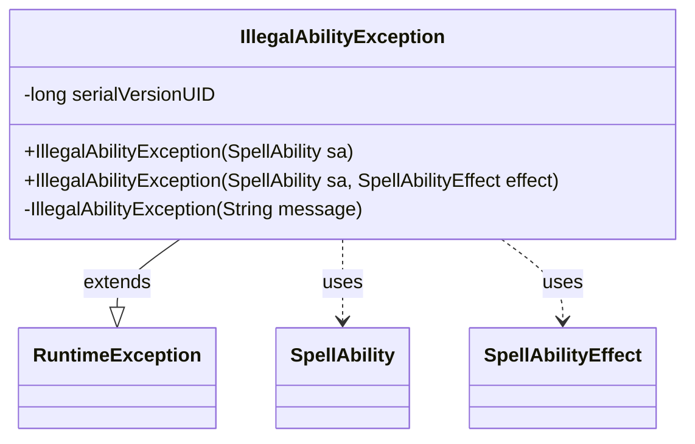

---
aliases:
  - IllegalAbilityException
tags:
  - java/class
  - module/forge-game
  - pkg/forge/game/ability
fqn: forge.game.ability.IllegalAbilityException
package: forge.game.ability
module: forge-game
kind: Class
---

# IllegalAbilityException

**Package:** `forge.game.ability` &nbsp; **Module:** `forge-game` &nbsp; **Kind:** Class



## Relationships
**Uses:**
- [[forge.game.ability.SpellAbilityEffect|SpellAbilityEffect]]
- [[forge.game.spellability.SpellAbility|SpellAbility]]

## Design Description

Within the `forge.game.ability` package, `IllegalAbilityException` is an unchecked exception that signals an illegal or malformed spell ability encountered during game execution. By extending `RuntimeException`, it propagates without forcing callers to declare or catch it, fitting the engine's flow where ability resolution failures are programmer-level faults rather than recoverable conditions.

Its design centers on constructing meaningful diagnostic messages from the offending `SpellAbility`: one constructor derives the message from the ability's string representation, while an overload additionally appends the originating `SpellAbilityEffect`'s class name (via `TextUtil`) for richer context. A private `String`-based constructor funnels both public paths to the superclass, keeping message formatting internal and ensuring every instance is built from domain objects rather than free-form text.

## Source
`forge-game/src/main/java/forge/game/ability/IllegalAbilityException.java`

```java
package forge.game.ability;

import forge.game.spellability.SpellAbility;
import forge.util.TextUtil;

public class IllegalAbilityException extends RuntimeException {
    private static final long serialVersionUID = -8638474348184716635L;

    public IllegalAbilityException(final SpellAbility sa) {
        this(sa.toString());
    }

    public IllegalAbilityException(final SpellAbility sa, final SpellAbilityEffect effect) {
        this(TextUtil.concatWithSpace(sa.toString(), "(effect "+effect.getClass().getName()+")"));
    }

    private IllegalAbilityException(final String message) {
        super(message);
    }

}
```
