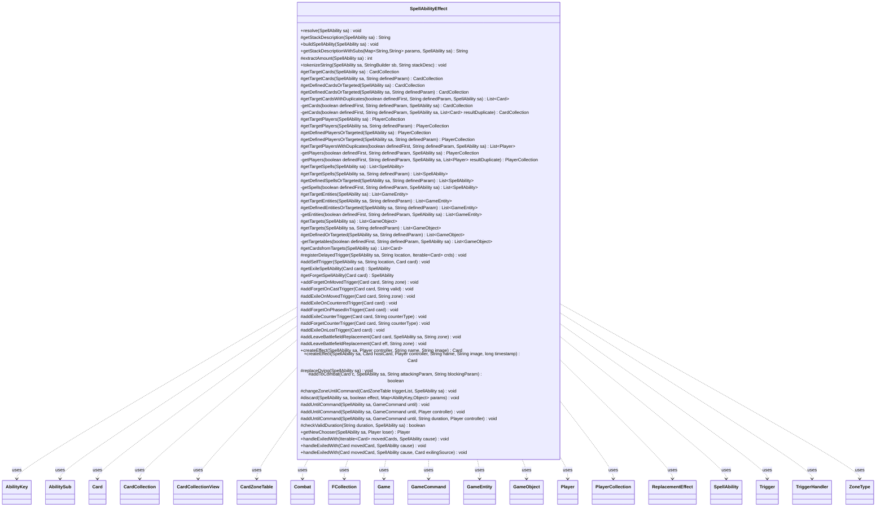

---
aliases:
  - SpellAbilityEffect
tags:
  - java/class
  - module/forge-game
  - pkg/forge/game/ability
fqn: forge.game.ability.SpellAbilityEffect
package: forge.game.ability
module: forge-game
kind: Class
---

# SpellAbilityEffect

**Package:** `forge.game.ability`   **Module:** `forge-game`   **Kind:** Class



## Relationships
**Uses:**
- [[forge.GameCommand|GameCommand]]
- [[forge.game.Game|Game]]
- [[forge.game.GameEntity|GameEntity]]
- [[forge.game.GameObject|GameObject]]
- [[forge.game.ability.AbilityKey|AbilityKey]]
- [[forge.game.card.Card|Card]]
- [[forge.game.card.CardCollection|CardCollection]]
- [[forge.game.card.CardCollectionView|CardCollectionView]]
- [[forge.game.card.CardZoneTable|CardZoneTable]]
- [[forge.game.combat.Combat|Combat]]
- [[forge.game.player.Player|Player]]
- [[forge.game.player.PlayerCollection|PlayerCollection]]
- [[forge.game.replacement.ReplacementEffect|ReplacementEffect]]
- [[forge.game.spellability.AbilitySub|AbilitySub]]
- [[forge.game.spellability.SpellAbility|SpellAbility]]
- [[forge.game.trigger.Trigger|Trigger]]
- [[forge.game.trigger.TriggerHandler|TriggerHandler]]
- [[forge.game.zone.ZoneType|ZoneType]]
- [[forge.util.collect.FCollection|FCollection]]

## Design Description

SpellAbilityEffect is the abstract base class for every concrete spell- and ability-resolution effect in Forge's `forge.game.ability` package. Each subclass implements the single abstract `resolve(SpellAbility)` method, while this class supplies the shared machinery they all depend on: building stack/spell descriptions (`getStackDescriptionWithSubs`, `tokenizeString`), and resolving a SpellAbility's parameters into concrete game objects via the unified `getTarget*`/`getDefined*OrTargeted` family that returns CardCollections, PlayerCollections, spells, GameEntities, or GameObjects depending on whether the ability targets or uses a Defined clause.

Beyond data extraction, it centralizes common rules plumbing so effects need not duplicate it: registering delayed and self-triggers, forget/exile bookkeeping for Command-zone effects, creating effect/emblem Cards (`createEffect`), wiring leave-battlefield and replace-dying replacement effects, adding creatures to Combat, and scheduling cleanup via `addUntilCommand`'s large duration switch. Its heavy static, parameter-driven design reflects Forge's script-driven card model, where behavior is configured through SVar/parameter strings (parsed into Triggers, ReplacementEffects, and sub-abilities) rather than bespoke Java per card.

## Source
`forge-game/src/main/java/forge/game/ability/SpellAbilityEffect.java`

```java
package forge.game.ability;

import com.google.common.collect.Iterables;
import com.google.common.collect.Lists;
import com.google.common.collect.Maps;
import com.google.common.collect.Table;
import forge.GameCommand;
import forge.card.CardRarity;
import forge.card.ColorSet;
import forge.card.GamePieceType;
import forge.game.Game;
import forge.game.GameEntity;
import forge.game.GameObject;
import forge.game.card.*;
import forge.game.combat.Combat;
import forge.game.phase.PhaseType;
import forge.game.player.Player;
import forge.game.player.PlayerCollection;
import forge.game.replacement.ReplacementEffect;
import forge.game.replacement.ReplacementHandler;
import forge.game.replacement.ReplacementLayer;
import forge.game.spellability.AbilitySub;
import forge.game.spellability.SpellAbility;
import forge.game.trigger.Trigger;
import forge.game.trigger.TriggerHandler;
import forge.game.trigger.TriggerType;
import forge.game.zone.ZoneType;
import forge.util.*;
import forge.util.collect.FCollection;
import org.apache.commons.lang3.StringUtils;

import java.util.*;

/**
 * <p>
 * AbilityFactory_AlterLife class.
 * </p>
 *
 * @author Forge
 * @version $Id: AbilityFactoryAlterLife.java 17656 2012-10-22 19:32:56Z Max mtg $
 */

public abstract class SpellAbilityEffect {

    public abstract void resolve(SpellAbility sa);

    protected String getStackDescription(final SpellAbility sa) {
        // Unless overridden, let the spell description also be the stack description
        return sa.getDescription();
    }

    public void buildSpellAbility(final SpellAbility sa) {
        if (sa.hasParam("Forecast")) {
            sa.putParam("ActivationZone", "Hand");
            sa.putParam("ActivationLimit", "1");
            sa.putParam("ActivationPhases", "Upkeep");
            sa.putParam("PlayerTurn", "True");
            sa.putParam("PrecostDesc", "Forecast — ");
        }
        if (sa.isBoast()) {
            sa.putParam("PresentDefined", "Self");
            sa.putParam("IsPresent", "Card.attackedThisTurn");
            sa.putParam("PrecostDesc", "Boast — ");
        }
        if (sa.isExhaust()) {
            sa.putParam("PrecostDesc", "Exhaust — ");
        }
        if (sa.isPowerUp()) {
            sa.putParam("PrecostDesc", "Power-Up — ");
        }

        if (sa.hasParam("Named")) {
            sa.setName(sa.getParam("Named"));
        }
    }

    /**
     * Returns this effect description with needed prelude and epilogue.
     * @param params
     * @param sa
     * @return
     */
    public final String getStackDescriptionWithSubs(final Map<String, String> params, final SpellAbility sa) {
        StringBuilder sb = new StringBuilder();

        if (sa.getApi() != ApiType.PermanentCreature && sa.getApi() != ApiType.PermanentNoncreature) {
            // prelude for when this is root ability
            if (!(sa instanceof AbilitySub)) {
                sb.append(sa.getHostCard()).append(" -");
                if (sa.getHostCard().hasPromisedGift() && sa.hasAdditionalAbility("GiftAbility")) {
                    sb.append(" Gift ").
                    append(sa.getAdditionalAbility("GiftAbility").getParam("GiftDescription")).
                    append(" to ").append(sa.getHostCard().getPromisedGift()).append(". ");
                }
            }
            sb.append(" ");
        }

        // Own description
        String stackDesc = params.get("StackDescription");
        if (stackDesc != null) {
            String[] reps = null;
            if (stackDesc.startsWith("REP")) {
                reps = stackDesc.substring(4).split(" & ");
                stackDesc = "SpellDescription";
            }
            // by typing "SpellDescription" they want to bypass the Effect's string builder
            if ("SpellDescription".equalsIgnoreCase(stackDesc)) {
                if (params.containsKey("SpellDescription")) {
                    String rawSDesc = params.get("SpellDescription");
                    if (rawSDesc.contains(",,,,,,")) rawSDesc = rawSDesc.replace(",,,,,,", " ");
                    if (rawSDesc.contains(",,,")) rawSDesc = rawSDesc.replace(",,,", " ");
                    String spellDesc = CardTranslation.translateSingleDescriptionText(rawSDesc, sa.getHostCard());

                    //trim reminder text from StackDesc
                    int idxL = spellDesc.indexOf(" (");
                    int idxR = spellDesc.indexOf(")");
                    if (idxL > 0 && idxR > idxL) {
                        spellDesc = spellDesc.replace(spellDesc.substring(idxL, idxR + 1), "");
                    }

                    if (reps != null) {
                        for (String s : reps) {
                            String[] rep = s.split("_",2);
                            if (spellDesc.contains(rep[0])) {
                                spellDesc = spellDesc.replaceFirst(rep[0], rep[1]);
                            }
                        }
                        tokenizeString(sa, sb, spellDesc);
                    } else {
                        sb.append(spellDesc);
                    }
                }
                if (sa.getTargets() != null && !sa.getTargets().isEmpty() && reps == null) {
                    sb.append(" (Targeting: ").append(Lang.joinHomogenous(sa.getTargets())).append(")");
                }
            } else if (!"None".equalsIgnoreCase(stackDesc)) { // by typing "none" they want to suppress output
                tokenizeString(sa, sb, stackDesc);
            }
        } else {
            final String condDesc = sa.getParam("ConditionDescription");
            final String afterDesc = sa.getParam("AfterDescription");
            final String baseDesc = CardTranslation.translateSingleDescriptionText(this.getStackDescription(sa), sa.getHostCard());
            if (condDesc != null) {
                sb.append(condDesc).append(" ");
            }
            sb.append(condDesc != null && condDesc.endsWith(",") ? StringUtils.uncapitalize(baseDesc) : baseDesc);
            if (afterDesc != null) {
                sb.append(" ").append(afterDesc);
            }
        }

        // only add to StackDescription if its not a Permanent Spell
        if (sa.getApi() != ApiType.PermanentCreature && sa.getApi() != ApiType.PermanentNoncreature) {
            // This includes all subAbilities
            final AbilitySub abSub = sa.getSubAbility();
            if (abSub != null) {
                sb.append(abSub.getStackDescription());
            }
        }

        if (sa.hasParam("Announce")) {
            String svar = sa.getParam("Announce");
            int amount = AbilityUtils.calculateAmount(sa.getHostCard(), svar, sa);
            sb.append(" ");
            sb.append(TextUtil.enclosedParen(TextUtil.concatNoSpace(svar,"=",String.valueOf(amount))));
        } else if (sa.costHasManaX()) {
            int amount = sa.getXManaCostPaid() == null ? 0 : sa.getXManaCostPaid();
            sb.append(" ");
            sb.append(TextUtil.enclosedParen(TextUtil.concatNoSpace("X","=",String.valueOf(amount))));
        }

        String currentName = sa.getHostCard().getTranslatedName();
        String substitutedDesc = TextUtil.fastReplace(sb.toString(), "CARDNAME", currentName);
        substitutedDesc = TextUtil.fastReplace(substitutedDesc, "NICKNAME", Lang.getInstance().getNickName(currentName));
        return substitutedDesc;
    }

    // Common functions that all SAEffects will probably use
    protected final int extractAmount(SpellAbility sa) {
        return AbilityUtils.calculateAmount(sa.getHostCard(), sa.getParamOrDefault("Amount", "1"), sa);
    }

    /**
     * Append the description of a {@link SpellAbility} to a
     * {@link StringBuilder}.
     *
     * @param sa
     *            a {@link SpellAbility}.
     * @param sb
     *            a {@link StringBuilder}.
     * @param stackDesc
     *            the stack description of sa, formatted so that text appearing
     *            between braces <code>{ }</code> is replaced with defined
     *            {@link Player}, {@link SpellAbility}, and {@link Card}
     *            objects.
     */
    public static void tokenizeString(final SpellAbility sa, final StringBuilder sb, final String stackDesc) {
        final StringTokenizer st = new StringTokenizer(stackDesc, "{}", true);
        boolean isPlainText = true;

        while (st.hasMoreTokens()) {
            final String t = st.nextToken();
            if ("{".equals(t)) { isPlainText = false; continue; }
            if ("}".equals(t)) { isPlainText = true; continue; }

            if (!isPlainText) {
                if (t.length() <= 2) sb.append("{").append(t).append("}"); // string includes mana cost (e.g. {2}{R})
                else if (t.startsWith("n:")) { // {n:<SVar> <noun(opt.)>}
                    String parts[] = t.substring(2).split(" ", 2);
                    int n = AbilityUtils.calculateAmount(sa.getHostCard(), parts[0], sa);
                    sb.append(parts.length == 1 ? Lang.getNumeral(n) : Lang.nounWithNumeral(n, parts[1]));
                } else {
                    final List<? extends GameObject> objs;
                    if (t.startsWith("p:")) {
                        objs = AbilityUtils.getDefinedPlayers(sa.getHostCard(), t.substring(2), sa);
                    } else if (t.startsWith("s:")) {
                        objs = AbilityUtils.getDefinedSpellAbilities(sa.getHostCard(), t.substring(2), sa);
                    } else if (t.startsWith("c:")) {
                        objs = AbilityUtils.getDefinedCards(sa.getHostCard(), t.substring(2), sa);
                    } else {
                        objs = AbilityUtils.getDefinedObjects(sa.getHostCard(), t, sa);
                    }
                    sb.append(Lang.joinHomogenous(objs));
                }
            } else {
                sb.append(t);
            }
        }
    }

    // Target/defined methods
    // Cards
    protected final static CardCollection getTargetCards(final SpellAbility sa) {                                       return getCards(false, "Defined",    sa); }
    protected final static CardCollection getTargetCards(final SpellAbility sa, final String definedParam) {            return getCards(false, definedParam, sa); }
    protected final static CardCollection getDefinedCardsOrTargeted(final SpellAbility sa) {                            return getCards(true,  "Defined",    sa); }
    protected final static CardCollection getDefinedCardsOrTargeted(final SpellAbility sa, final String definedParam) { return getCards(true,  definedParam, sa); }

    protected static List<Card> getTargetCardsWithDuplicates(final boolean definedFirst, final String definedParam, final SpellAbility sa) {
        List<Card> result = Lists.newArrayList();
        getCards(definedFirst, definedParam, sa, result);
        return result;
    }

    // overloaded variant that returns the unique objects instead of filling a result list
    private static CardCollection getCards(final boolean definedFirst, final String definedParam, final SpellAbility sa) {
        return getCards(definedFirst, definedParam, sa, null);
    }
    private static CardCollection getCards(final boolean definedFirst, final String definedParam, final SpellAbility sa, List<Card> resultDuplicate) {
        if (sa.hasParam("ThisDefinedAndTgts")) {
            CardCollection cards = AbilityUtils.getDefinedCards(sa.getHostCard(), sa.getParam("ThisDefinedAndTgts"), sa);
            cards.addAll(sa.getTargets().getTargetCards());
            return cards;
        }

        CardCollection resultUnique = null;
        final boolean useTargets = sa.usesTargeting() && (!definedFirst || !sa.hasParam(definedParam));
        if (useTargets) {
            if (resultDuplicate == null) {
                resultUnique = new CardCollection();
                resultDuplicate = resultUnique;
            }
            sa.getTargets().getTargetCards().forEach(resultDuplicate::add);
        } else {
            String[] def = sa.getParamOrDefault(definedParam, "Self").split(" & ");
            for (String d : def) {
                CardCollection defResult = AbilityUtils.getDefinedCards(sa.getHostCard(), d, sa);
                if (resultDuplicate == null) {
                    resultUnique = defResult;
                    resultDuplicate = resultUnique;
                } else {
                    resultDuplicate.addAll(defResult);
                }
            }
        }
        if (resultUnique == null)
            return null;
        if (sa.hasParam("IncludeAllComponentCards")) {
            CardCollection components = new CardCollection();
            for (Card c : resultUnique) {
                components.addAll(c.getAllComponentCards(false));
            }
            resultUnique.addAll(components);
        }
        return resultUnique;
    }

    // Players
    protected final static PlayerCollection getTargetPlayers(final SpellAbility sa) {                                       return getPlayers(false, "Defined",    sa); }
    protected final static PlayerCollection getTargetPlayers(final SpellAbility sa, final String definedParam) {            return getPlayers(false, definedParam, sa); }
    protected final static PlayerCollection getDefinedPlayersOrTargeted(final SpellAbility sa) {                            return getPlayers(true,  "Defined",    sa); }
    protected final static PlayerCollection getDefinedPlayersOrTargeted(final SpellAbility sa, final String definedParam) { return getPlayers(true,  definedParam, sa); }

    protected static List<Player> getTargetPlayersWithDuplicates(final boolean definedFirst, final String definedParam, final SpellAbility sa) {
        List<Player> result = Lists.newArrayList();
        getPlayers(definedFirst, definedParam, sa, result);
        return result;
    }

    // overloaded variant that returns the unique objects instead of filling a result list
    private static PlayerCollection getPlayers(final boolean definedFirst, final String definedParam, final SpellAbility sa) {
        return getPlayers(definedFirst, definedParam, sa, null);
    }
    private static PlayerCollection getPlayers(final boolean definedFirst, final String definedParam, final SpellAbility sa, List<Player> resultDuplicate) {
        Game game = sa.getHostCard().getGame();
        PlayerCollection resultUnique = null;
        final boolean useTargets = sa.usesTargeting() && (!definedFirst || !sa.hasParam(definedParam));
        if (useTargets) {
            if (resultDuplicate == null) {
                resultUnique = new PlayerCollection();
                resultDuplicate = resultUnique;
            }
            sa.getTargets().getTargetPlayers().forEach(resultDuplicate::add);
        } else {
            String[] def = sa.getParamOrDefault(definedParam, "You").split(" & ");
            for (String d : def) {
                PlayerCollection defResult = AbilityUtils.getDefinedPlayers(sa.getHostCard(), d, sa);
                if (resultDuplicate == null) {
                    resultUnique = defResult;
                    resultDuplicate = resultUnique;
                } else {
                    resultDuplicate.addAll(defResult);
                }
            }
        }

        // try sort in APNAP order
        Player starter = game.getPhaseHandler().getPlayerTurn();
        if (sa.hasParam("StartingWith")) {
            starter = AbilityUtils.getDefinedPlayers(sa.getHostCard(), sa.getParam("StartingWith"), sa).getFirst();
        }
        PlayerCollection ordered = game.getPlayersInTurnOrder(starter);
        resultDuplicate.sort(Comparator.comparingInt(ordered::indexOf));
        return resultUnique;
    }

    // Spells
    protected final static List<SpellAbility> getTargetSpells(final SpellAbility sa) {                                       return getSpells(false, "Defined",    sa); }
    protected final static List<SpellAbility> getTargetSpells(final SpellAbility sa, final String definedParam) {            return getSpells(false, definedParam, sa); }
    protected final static List<SpellAbility> getDefinedSpellsOrTargeted(final SpellAbility sa, final String definedParam) { return getSpells(true,  definedParam, sa); }

    private static List<SpellAbility> getSpells(final boolean definedFirst, final String definedParam, final SpellAbility sa) {
        final boolean useTargets = sa.usesTargeting() && (!definedFirst || !sa.hasParam(definedParam));
        return useTargets ? Lists.newArrayList(sa.getTargets().getTargetSpells())
                : AbilityUtils.getDefinedSpellAbilities(sa.getHostCard(), sa.getParam(definedParam), sa);
    }

    // Targets of card or player type
    protected final static List<GameEntity> getTargetEntities(final SpellAbility sa) {                                 return getEntities(false, "Defined",    sa); }
    protected final static List<GameEntity> getTargetEntities(final SpellAbility sa, final String definedParam) {      return getEntities(false, definedParam, sa); }
    protected final static List<GameEntity> getDefinedEntitiesOrTargeted(SpellAbility sa, final String definedParam) { return getEntities(true,  definedParam, sa); }

    private static List<GameEntity> getEntities(final boolean definedFirst, final String definedParam, final SpellAbility sa) {
        final boolean useTargets = sa.usesTargeting() && (!definedFirst || !sa.hasParam(definedParam));
        String[] def = sa.getParamOrDefault(definedParam, "Self").split(" & ");
        return useTargets ? Lists.newArrayList(sa.getTargets().getTargetEntities())
                : AbilityUtils.getDefinedEntities(sa.getHostCard(), def, sa);
    }

    // Targets of unspecified type
    protected final static List<GameObject> getTargets(final SpellAbility sa) {                                return getTargetables(false, "Defined",    sa); }
    protected final static List<GameObject> getTargets(final SpellAbility sa, final String definedParam) {     return getTargetables(false, definedParam, sa); }
    protected final static List<GameObject> getDefinedOrTargeted(SpellAbility sa, final String definedParam) { return getTargetables(true,  definedParam, sa); }

    private static List<GameObject> getTargetables(final boolean definedFirst, final String definedParam, final SpellAbility sa) {
        final boolean useTargets = sa.usesTargeting() && (!definedFirst || !sa.hasParam(definedParam));
        return useTargets ? Lists.newArrayList(sa.getTargets())
                : AbilityUtils.getDefinedObjects(sa.getHostCard(), sa.getParam(definedParam), sa);
    }

    protected final static List<Card> getCardsfromTargets(final SpellAbility sa) {
        List<Card> cards = getTargetCards(sa);
        // some card effects can also target a spell
        for (SpellAbility s : sa.getTargets().getTargetSpells()) {
            cards.add(s.getHostCard());
        }
        return cards;
    }

    protected static void registerDelayedTrigger(final SpellAbility sa, String location, final Iterable<Card> crds) {
        boolean intrinsic = sa.isIntrinsic();
        boolean your = location.startsWith("Your");
        boolean combat = location.endsWith("Combat");
        boolean upkeep = location.endsWith("Upkeep");

        String desc = sa.getParamOrDefault("AtEOTDesc", "");

        if (your) {
            location = location.substring("Your".length());
        }
        if (combat) {
            location = location.substring(0, location.length() - "Combat".length());
        }
        if (upkeep) {
            location = location.substring(0, location.length() - "Upkeep".length());
        }

        if (desc.isEmpty()) {
            StringBuilder sb = new StringBuilder();
            if (location.equals("Hand")) {
                sb.append("Return ");
            } else if (location.equals("Library")) {
                sb.append("Shuffle ");
            } else if (location.equals("SacrificeCtrl")) {
                sb.append("Its controller sacrifices ");
            } else {
                sb.append(location).append(" ");
            }
            sb.append(Lang.joinHomogenous(crds));
            if (location.equals("Hand")) {
                sb.append(" to your hand");
            } else if (location.equals("Library")) {
                sb.append(" into your library");
            }
            sb.append(" at the ");
            if (combat) {
                sb.append("end of combat.");
            } else {
                sb.append("beginning of ");
                sb.append(your ? "your" : "the");
                if (upkeep) {
                    sb.append(" next upkeep.");
                } else {
                    sb.append(" next end step.");
                }
            }
            desc = sb.toString();
        }

        StringBuilder delTrig = new StringBuilder();
        delTrig.append("Mode$ Phase | Phase$ ");
        delTrig.append(combat ? "EndCombat " : upkeep ? "Upkeep" : "End Of Turn ");

        if (your) {
            delTrig.append("| ValidPlayer$ You ");
        }
        delTrig.append("| TriggerDescription$ ").append(desc);

        final Trigger trig = TriggerHandler.parseTrigger(delTrig.toString(), CardCopyService.getLKICopy(sa.getHostCard()), intrinsic);
        long ts = sa.getHostCard().getGame().getNextTimestamp();
        for (final Card c : crds) {
            trig.addRemembered(c);

            // Svar for AI
            c.addChangedSVars(Collections.singletonMap("EndOfTurnLeavePlay", "AtEOT"), ts, 0);
        }
        String trigSA = "";
        if (location.equals("Hand")) {
            trigSA = "DB$ ChangeZone | Defined$ DelayTriggerRememberedLKI | Origin$ Battlefield | Destination$ Hand";
        } else if (location.equals("Library")) {
            trigSA = "DB$ ChangeZone | Defined$ DelayTriggerRememberedLKI | Origin$ Battlefield | Destination$ Library | Shuffle$ True";
        } else if (location.equals("SacrificeCtrl")) {
            trigSA = "DB$ SacrificeAll | Defined$ DelayTriggerRememberedLKI";
        } else if (location.equals("Sacrifice")) {
            trigSA = "DB$ SacrificeAll | Defined$ DelayTriggerRememberedLKI | Controller$ You";
        } else if (location.equals("Exile")) {
            trigSA = "DB$ ChangeZone | Defined$ DelayTriggerRememberedLKI | Origin$ Battlefield | Destination$ Exile";
        } else if (location.equals("Destroy")) {
            trigSA = "DB$ Destroy | Defined$ DelayTriggerRememberedLKI";
        }
        if (sa.hasParam("AtEOTCondition")) {
            String var = sa.getParam("AtEOTCondition");
            trigSA += "| ConditionCheckSVar$ " + var;
        }
        final SpellAbility newSa = AbilityFactory.getAbility(trigSA, sa.getHostCard());
        newSa.setIntrinsic(intrinsic);
        trig.setOverridingAbility(newSa);
        trig.setSpawningAbility(sa.copy(sa.getHostCard(), true));
        trig.setKeyword(trig.getSpawningAbility().getKeyword());
        sa.getActivatingPlayer().getGame().getTriggerHandler().registerDelayedTrigger(trig);
    }

    protected static void addSelfTrigger(final SpellAbility sa, String location, final Card card) {
    	String player = "";
    	String whose = " the ";
        if (location.contains("_")) {
    	    String[] locSplit = location.split("_");
    	    player = locSplit[0];
    	    location = locSplit[1];
    	    if (player.equals("You")) {
    	        whose = " your next ";
            }
        }

    	String trigStr = "Mode$ Phase | Phase$ End of Turn | TriggerZones$ Battlefield " +
    	     "| TriggerDescription$ At the beginning of" + whose + "end step, " + location.toLowerCase()
                + " CARDNAME.";
        if (!player.isEmpty()) {
            trigStr += " | Player$ " + player;
        }

    	final Trigger trig = TriggerHandler.parseTrigger(trigStr, card, true);
    	
    	String trigSA = "";
        if (location.equals("Sacrifice")) {
            trigSA = "DB$ Sacrifice | SacValid$ Self";
        } else if (location.equals("Exile")) {
            trigSA = "DB$ ChangeZone | Origin$ Battlefield | Destination$ Exile | Defined$ Self";
        }
        trig.setOverridingAbility(AbilityFactory.getAbility(trigSA, card));
        card.addTrigger(trig);

        // Svar for AI
        card.addChangedSVars(Collections.singletonMap("EndOfTurnLeavePlay", "AtEOT"), card.getGame().getNextTimestamp(), 0);
    }

    protected static SpellAbility getExileSpellAbility(final Card card) {
        String effect = "DB$ ChangeZone | Defined$ Self | Origin$ Command | Destination$ Exile";
        return AbilityFactory.getAbility(effect, card);
    }

    protected static SpellAbility getForgetSpellAbility(final Card card) {
        String forgetEffect = "DB$ Pump | ForgetObjects$ TriggeredCard";
        String exileEffect = "DB$ ChangeZone | Defined$ Self | Origin$ Command | Destination$ Exile"
                + " | ConditionDefined$ Remembered | ConditionPresent$ Card | ConditionCompare$ EQ0";

        SpellAbility saForget = AbilityFactory.getAbility(forgetEffect, card);
        AbilitySub saExile = (AbilitySub) AbilityFactory.getAbility(exileEffect, card);
        saForget.setSubAbility(saExile);
        return saForget;
    }

    public static void addForgetOnMovedTrigger(final Card card, final String zone) {
        String trig = "Mode$ ChangesZone | ValidCard$ Card.IsRemembered | Origin$ " + zone + " | ExcludedDestinations$ Stack,Exile | Destination$ Any | TriggerZones$ Command | Static$ True";
        // CR 400.8 Exiled card becomes new object when it's exiled
        String trig2 = "Mode$ Exiled | ValidCard$ Card.IsRemembered | ValidCause$ SpellAbility.!EffectSource | TriggerZones$ Command | Static$ True";

        final Trigger parsedTrigger = TriggerHandler.parseTrigger(trig, card, true);
        final Trigger parsedTrigger2 = TriggerHandler.parseTrigger(trig2, card, true);
        SpellAbility forget = getForgetSpellAbility(card);
        parsedTrigger.setOverridingAbility(forget);
        parsedTrigger2.setOverridingAbility(forget);
        card.addTrigger(parsedTrigger);
        card.addTrigger(parsedTrigger2);
    }

    protected static void addForgetOnCastTrigger(final Card card, String valid) {
        String trig = "Mode$ SpellCast | TriggerZones$ Command | Static$ True | ValidCard$ " + valid;

        final Trigger parsedTrigger = TriggerHandler.parseTrigger(trig, card, true);
        parsedTrigger.setOverridingAbility(getForgetSpellAbility(card));
        card.addTrigger(parsedTrigger);
    }

    protected static void addExileOnMovedTrigger(final Card card, final String zone) {
        String trig = "Mode$ ChangesZone | ValidCard$ Card.IsRemembered | Origin$ " + zone + " | Destination$ Any | TriggerZones$ Command | Static$ True";
        final Trigger parsedTrigger = TriggerHandler.parseTrigger(trig, card, true);
        parsedTrigger.setOverridingAbility(getExileSpellAbility(card));
        card.addTrigger(parsedTrigger);
    }

    protected static void addExileOnCounteredTrigger(final Card card) {
        String trig = "Mode$ Countered | ValidCard$ Card.IsRemembered | TriggerZones$ Command | Static$ True";
        final Trigger parsedTrigger = TriggerHandler.parseTrigger(trig, card, true);
        parsedTrigger.setOverridingAbility(getExileSpellAbility(card));
        card.addTrigger(parsedTrigger);
    }

    protected static void addForgetOnPhasedInTrigger(final Card card) {
        String trig = "Mode$ PhaseIn | ValidCard$ Card.IsRemembered | TriggerZones$ Command | Static$ True";

        final Trigger parsedTrigger = TriggerHandler.parseTrigger(trig, card, true);
        parsedTrigger.setOverridingAbility(getForgetSpellAbility(card));
        card.addTrigger(parsedTrigger);
    }

    protected static void addExileCounterTrigger(final Card card, final String counterType) {
        String trig = "Mode$ CounterRemoved | TriggerZones$ Command | ValidCard$ Card.EffectSource | CounterType$ " + counterType + " | NewCounterAmount$ 0 | Static$ True";
        final Trigger parsedTrigger = TriggerHandler.parseTrigger(trig, card, true);
        parsedTrigger.setOverridingAbility(getExileSpellAbility(card));
        card.addTrigger(parsedTrigger);
    }

    protected static void addForgetCounterTrigger(final Card card, final String counterType) {
        String trig = "Mode$ CounterRemoved | TriggerZones$ Command | ValidCard$ Card.IsRemembered | CounterType$ " + counterType + " | NewCounterAmount$ 0 | Static$ True";
        String trig2 = "Mode$ PhaseOut | TriggerZones$ Command | ValidCard$ Card.phasedOutIsRemembered | Static$ True";

        final SpellAbility forgetSA = getForgetSpellAbility(card);

        final Trigger parsedTrigger = TriggerHandler.parseTrigger(trig, card, true);
        final Trigger parsedTrigger2 = TriggerHandler.parseTrigger(trig2, card, true);
        parsedTrigger.setOverridingAbility(forgetSA);
        parsedTrigger2.setOverridingAbility(forgetSA);
        card.addTrigger(parsedTrigger);
        card.addTrigger(parsedTrigger2);
    }

    protected static void addExileOnLostTrigger(final Card card) {
        String trig = "Mode$ LosesGame | ValidPlayer$ You | TriggerController$ Player | TriggerZones$ Command | Static$ True";
        final Trigger parsedTrigger = TriggerHandler.parseTrigger(trig, card, true);
        parsedTrigger.setOverridingAbility(getExileSpellAbility(card));
        card.addTrigger(parsedTrigger);
    }

    protected static void addLeaveBattlefieldReplacement(final Card card, final SpellAbility sa, final String zone) {
        final Card host = sa.getHostCard();
        final Game game = card.getGame();
        final Card eff = createEffect(sa, sa.getActivatingPlayer(), host + "'s Effect", host.getImageKey());

        addLeaveBattlefieldReplacement(eff, zone);

        eff.addRemembered(card);

        // Add forgot trigger
        addExileOnMovedTrigger(eff, "Battlefield");

        // Copy text changes
        if (sa.isIntrinsic()) {
            eff.copyChangedTextFrom(card);
        }

        game.getAction().moveToCommand(eff, sa);
    }

    protected static void addLeaveBattlefieldReplacement(final Card eff, final String zone) {
        final String repeffstr = "Event$ Moved | ValidCard$ Card.IsRemembered "
                + "| Origin$ Battlefield | ExcludeDestination$ " + zone
                + "| Description$ If Creature would leave the battlefield, "
                + " exile it instead of putting it anywhere else.";
        String effect = "DB$ ChangeZone | Defined$ ReplacedCard | Origin$ Battlefield | Destination$ " + zone;

        ReplacementEffect re = ReplacementHandler.parseReplacement(repeffstr, eff, true);
        re.setLayer(ReplacementLayer.Other);

        re.setOverridingAbility(AbilityFactory.getAbility(effect, eff));
        eff.addReplacementEffect(re);
    }

    // create a basic template for Effect to be used somewhere els
    public static Card createEffect(final SpellAbility sa, final Player controller, final String name, final String image) {
        return createEffect(sa, sa.getHostCard(), controller, name, image, controller.getGame().getNextTimestamp());
    }
    public static Card createEffect(final SpellAbility sa, final Card hostCard, final Player controller, final String name, final String image, final long timestamp) {
        final Game game = controller.getGame();
        final Card eff = new Card(game.nextCardId(), game);

        eff.setGameTimestamp(timestamp);
        eff.setName(name);
        // if name includes emblem then it should be one
        if (name.startsWith("Emblem")) {
            eff.setEmblem(true);
            // Emblem needs to be colorless
            eff.setColor(ColorSet.C);
            eff.setRarity(CardRarity.Common);
        } else {
            eff.setColor(hostCard.getColor());
            eff.setRarity(hostCard.getRarity());
        }

        eff.setOwner(controller);

        eff.setSetCode(hostCard.getSetCode());
        if (image != null) {
            eff.setImageKey(image);
        }

        eff.setGamePieceType(GamePieceType.EFFECT);
        if (sa != null) {
            eff.setEffectSource(sa);
            eff.setSVars(sa.getSVars());
        } else {
            eff.setEffectSource(hostCard);
        }

        return eff;
    }

    protected static void replaceDying(final SpellAbility sa) {
        if (sa.hasParam("ReplaceDyingDefined") || sa.hasParam("ReplaceDyingValid")) {
            if (sa.hasParam("ReplaceDyingCondition")) {
                // currently there is only one with Kicker
                final String condition = sa.getParam("ReplaceDyingCondition");
                if ("Kicked".equals(condition)) {
                    if (!sa.isKicked()) {
                        return;
                    }
                }
            }

            final Card host = sa.getHostCard();
            final Player controller = sa.getActivatingPlayer();
            final Game game = host.getGame();
            String zone = sa.getParamOrDefault("ReplaceDyingZone", "Exile");

            CardCollection cards = null;

            if (sa.hasParam("ReplaceDyingDefined")) {
                cards = AbilityUtils.getDefinedCards(host, sa.getParam("ReplaceDyingDefined"), sa);
                // no cards, no need for Effect
                if (cards.isEmpty()) {
                    return;
                }
            }

            // build an Effect with that information
            String name = host.getDisplayName() + "'s Effect";

            final Card eff = createEffect(sa, controller, name, host.getImageKey());
            if (cards != null) {
                eff.addRemembered(cards);
            }

            String valid = sa.getParamOrDefault("ReplaceDyingValid", "Card.IsRemembered");

            String repeffstr = "Event$ Moved | ValidLKI$ " + valid +
                    "| Origin$ Battlefield | Destination$ Graveyard " +
                    "| Description$ If that permanent would die this turn, exile it instead.";
            String effect = "DB$ ChangeZone | Defined$ ReplacedCard | Origin$ Battlefield | Destination$ " + zone;
            if (sa.hasParam("ReplaceDyingExiledWith")) {
                effect += " | ExiledWithEffectSource$ True";
            }

            ReplacementEffect re = ReplacementHandler.parseReplacement(repeffstr, eff, true);
            re.setLayer(ReplacementLayer.Other);

            re.setOverridingAbility(AbilityFactory.getAbility(effect, eff));
            eff.addReplacementEffect(re);

            if (cards != null) {
                // Add forgot trigger
                addForgetOnMovedTrigger(eff, "Battlefield");
            }

            // Copy text changes
            if (sa.isIntrinsic()) {
                eff.copyChangedTextFrom(host);
            }

            game.getEndOfTurn().addUntil(() -> game.getAction().exileEffect(eff));

            game.getAction().moveToCommand(eff, sa);
        }
    }

    protected static boolean addToCombat(Card c, SpellAbility sa, String attackingParam, String blockingParam) {
        final Card host = sa.getHostCard();
        final Game game = host.getGame();
        if (!c.isCreature() || !game.getPhaseHandler().inCombat()) {
            return false;
        }
        boolean combatChanged = false;
        final Combat combat = game.getCombat();

        // CR 506.3b
        if (sa.hasParam(attackingParam) && combat.getAttackingPlayer().equals(c.getController())) {
            String attacking = sa.getParam(attackingParam);

            GameEntity defender = null;
            FCollection<GameEntity> defs = new FCollection<>();
            // important to update defenders here, maybe some PW got removed
            combat.initConstraints();
            if ("True".equalsIgnoreCase(attacking)) {
                defs.addAll(combat.getDefenders());
            } else {
                defs.addAll(AbilityUtils.getDefinedEntities(sa.hasParam("ForEach") ? c : host, attacking.split(" & "), sa));
            }

            Map<String, Object> params = Maps.newHashMap();
            params.put("Attacker", c);
            defender = sa.getActivatingPlayer().getController().chooseSingleEntityForEffect(defs, sa,
                    Localizer.getInstance().getMessage("lblChooseDefenderToAttackWithCard", c.getTranslatedName()), false, params);

            if (defender != null && !combat.getAttackersOf(defender).contains(c)) {
                // we might be reselecting
                combat.removeFromCombat(c);

                combat.addAttacker(c, defender);
                combat.getBandOfAttacker(c).setBlocked(false);
                combatChanged = true;
            }
        }
        if (sa.hasParam(blockingParam)) {
            final Card attacker = Iterables.getFirst(AbilityUtils.getDefinedCards(host, sa.getParam(blockingParam), sa), null);
            if (attacker != null && combat.getDefenderPlayerByAttacker(attacker).equals(c.getController())) {
                final boolean wasBlocked = combat.isBlocked(attacker);
                combat.addBlocker(attacker, c);
                combat.orderAttackersForDamageAssignment(c);

                {
                    final Map<AbilityKey, Object> runParams = AbilityKey.newMap();
                    runParams.put(AbilityKey.Attacker, attacker);
                    runParams.put(AbilityKey.Blocker, c);
                    game.getTriggerHandler().runTrigger(TriggerType.AttackerBlockedByCreature, runParams, false);
                }
                {
                    final Map<AbilityKey, Object> runParams = AbilityKey.newMap();
                    runParams.put(AbilityKey.Attackers, attacker);
                    game.getTriggerHandler().runTrigger(TriggerType.AttackerBlockedOnce, runParams, false);
                }

                // Run triggers for new blocker and add it to damage assignment order
                if (!wasBlocked) {
                    final CardCollection blockers = combat.getBlockers(attacker);
                    final Map<AbilityKey, Object> runParams = AbilityKey.newMap();
                    runParams.put(AbilityKey.Attacker, attacker);
                    runParams.put(AbilityKey.Blockers, blockers);
                    runParams.put(AbilityKey.Defender, combat.getDefenderByAttacker(attacker));
                    runParams.put(AbilityKey.DefendingPlayer, combat.getDefenderPlayerByAttacker(attacker));
                    game.getTriggerHandler().runTrigger(TriggerType.AttackerBlocked, runParams, false);

                    combat.setBlocked(attacker, true);
                    combat.addBlockerToDamageAssignmentOrder(attacker, c);
                }
                combatChanged = true;
            }
        }
        return combatChanged;
    }

    protected static void changeZoneUntilCommand(final CardZoneTable triggerList, final SpellAbility sa) {
        if (!sa.hasParam("Duration")) {
            return;
        }

        final Card hostCard = sa.getHostCard();
        final Game game = hostCard.getGame();
        hostCard.addUntilLeavesBattlefield(triggerList.allCards());
        final TriggerHandler trigHandler = game.getTriggerHandler();

        final Card lki;
        if (sa.hasParam("ReturnAbility")) {
            lki = CardCopyService.getLKICopy(hostCard);
            lki.clearControllers();
            lki.setOwner(sa.getActivatingPlayer());
        } else {
            lki = null;
        }

        GameCommand gc = new GameCommand() {

            private static final long serialVersionUID = 1L;

            @Override
            public void run() {
                CardCollectionView untilCards = hostCard.getUntilLeavesBattlefield();
                // if the list is empty, then the table doesn't need to be checked anymore
                if (untilCards.isEmpty()) {
                    return;
                }
                Map<AbilityKey, Object> moveParams = AbilityKey.newMap();
                moveParams.put(AbilityKey.LastStateBattlefield, game.copyLastStateBattlefield());
                moveParams.put(AbilityKey.LastStateGraveyard, game.copyLastStateGraveyard());
                for (Table.Cell<ZoneType, ZoneType, CardCollection> cell : triggerList.cellSet()) {
                    for (Card c : cell.getValue()) {
                        // check if card is still in the until host leaves play list
                        if (!untilCards.contains(c)) {
                            continue;
                        }
                        // better check if card didn't changed zones again?
                        Card newCard = game.getCardState(c, null);
                        if (newCard == null || !newCard.equalsWithGameTimestamp(c)) {
                            continue;
                        }
                        if (sa.hasAdditionalAbility("ReturnAbility")) {
                            String valid = sa.getParamOrDefault("ReturnValid", "Card.IsTriggerRemembered");

                            String trigSA = "Mode$ ChangesZone | Origin$ " + cell.getColumnKey() + " | Destination$ " + cell.getRowKey() + " | ValidCard$ " + valid +
                                    " | TriggerDescription$ " + sa.getAdditionalAbility("ReturnAbility").getParam("SpellDescription");

                            Trigger trig = TriggerHandler.parseTrigger(trigSA, hostCard, sa.isIntrinsic(), null);
                            trig.setSpawningAbility(sa.copy(lki, true));
                            trig.setActiveZone(null);
                            trig.addRemembered(newCard);

                            SpellAbility overridingSA = sa.getAdditionalAbility("ReturnAbility").copy(hostCard, sa.getActivatingPlayer(), false);
                            // need to reset the parent, additionalAbility does set it to this
                            if (overridingSA instanceof AbilitySub) {
                                ((AbilitySub)overridingSA).setParent(null);
                            }

                            trig.setOverridingAbility(overridingSA);

                            // Delayed Trigger should only happen once, no need for cleanup?
                            trigHandler.registerThisTurnDelayedTrigger(trig);
                        }
                        // no cause there?
                        Card movedCard = game.getAction().moveTo(cell.getRowKey(), newCard, 0, null, moveParams);
                        game.getUntilHostLeavesPlayTriggerList().put(cell.getColumnKey(), cell.getRowKey(), movedCard);
                    }
                }
            }

        };

        // corner case can lead to host exiling itself during the effect
        if (sa.getParam("Duration").contains("UntilHostLeavesPlay") && !hostCard.isInPlay()) {
            gc.run();
        } else {
            addUntilCommand(sa, gc);
        }
    }

    protected static void discard(SpellAbility sa, final boolean effect, Map<Player, CardCollectionView> discardedMap, Map<AbilityKey, Object> params) {
        Set<Player> discarders = discardedMap.keySet();
        Map<Player, List<Card>> discardedBefore = Maps.newHashMap();
        for (Player p : discarders) {
            discardedBefore.put(p, Lists.newArrayList(p.getDiscardedThisTurn()));
            final CardCollection discardedByPlayer = new CardCollection();
            for (Card card : Lists.newArrayList(discardedMap.get(p))) { // without copying will get concurrent modification exception
                if (card == null) { continue; }
                Card moved = p.discard(card, sa, effect, params);
                if (moved != null) {
                    discardedByPlayer.add(moved);
                }
            }
            discardedMap.put(p, discardedByPlayer);
        }

        for (Player p : discarders) {
            CardCollectionView discardedByPlayer = discardedMap.get(p);
            if (!discardedByPlayer.isEmpty()) {
                final Map<AbilityKey, Object> runParams = AbilityKey.mapFromPlayer(p);
                runParams.put(AbilityKey.Cards, discardedByPlayer);
                runParams.put(AbilityKey.Cause, sa);
                runParams.put(AbilityKey.DiscardedBefore, discardedBefore.get(p));
                p.getGame().getTriggerHandler().runTrigger(TriggerType.DiscardedAll, runParams, false);
            }
        }
    }

    protected static void addUntilCommand(final SpellAbility sa, GameCommand until) {
        addUntilCommand(sa, until, sa.getActivatingPlayer());
    }
    protected static void addUntilCommand(final SpellAbility sa, GameCommand until, Player controller) {
        addUntilCommand(sa, until, sa.getParam("Duration"), controller);
    }
    protected static void addUntilCommand(final SpellAbility sa, final GameCommand until, String duration, Player controller) {
        Card host = sa.getHostCard();
        final Game game = host.getGame();
        // in case host was LKI or still resolving
        if (host.isLKI() || host.getZone() == null || host.getZone().is(ZoneType.Stack)) {
            host = game.getCardState(host);
        }

        if ("UntilEndOfCombat".equals(duration)) {
            game.getEndOfCombat().addUntil(until);
        } else if ("UntilEndOfCombatYourNextTurn".equals(duration)) {
            game.getEndOfCombat().registerUntilEnd(controller, until);
        } else if ("UntilYourNextUpkeep".equals(duration)) {
            game.getUpkeep().addUntil(controller, until);
        } else if ("UntilTheEndOfYourNextUpkeep".equals(duration)) {
            if (game.getPhaseHandler().is(PhaseType.UPKEEP)) {
                game.getUpkeep().registerUntilEnd(controller, until);
            } else {
                game.getUpkeep().addUntilEnd(controller, until);
            }
        } else if ("UntilTheEndOfYourNextUntap".equals(duration)) {
            game.getUntap().addUntilEnd(controller, until);
        } else if ("UntilNextEndStep".equals(duration)) {
            game.getEndOfTurn().addAt(until);
        } else if ("UntilYourNextEndStep".equals(duration)) {
            game.getEndOfTurn().addUntil(controller, until);
        } else if ("UntilYourNextTurn".equals(duration)) {
            game.getCleanup().addUntil(controller, until);
        } else if ("UntilTheEndOfYourNextTurn".equals(duration)) {
            if (game.getPhaseHandler().isPlayerTurn(controller)) {
                game.getEndOfTurn().registerUntilEnd(controller, until);
            } else {
                game.getEndOfTurn().addUntilEnd(controller, until);
            }
        } else if ("UntilTheEndOfTargetedNextTurn".equals(duration)) {
            Player targeted = sa.getTargets().getFirstTargetedPlayer();
            if (game.getPhaseHandler().isPlayerTurn(targeted)) {
                game.getEndOfTurn().registerUntilEnd(targeted, until);
            } else {
                game.getEndOfTurn().addUntilEnd(targeted, until);
            }
        } else if ("ThisTurnAndNextTurn".equals(duration)) {
            game.getEndOfTurn().addUntil(() -> game.getEndOfTurn().addUntil(until));
        } else if ("UntilStateBasedActionChecked".equals(duration)) {
            game.addSBACheckedCommand(until);
        } else if ("UntilHostLeavesPlay".equals(duration)) {
            host.addLeavesPlayCommand(until);
        } else if ("UntilHostLeavesPlayOrEOT".equals(duration)) {
            host.addLeavesPlayCommand(until);
            game.getEndOfTurn().addUntil(until);
        } else if ("UntilHostLeavesPlayOrEndOfCombat".equals(duration)) {
            host.addLeavesPlayCommand(until);
            game.getEndOfCombat().addUntil(until);
        } else if ("UntilLoseControlOfHost".equals(duration)) {
            host.addLeavesPlayCommand(until);
            host.addChangeControllerCommand(until);
        } else if ("AsLongAsControl".equals(duration)) {
            host.addLeavesPlayCommand(until);
            host.addChangeControllerCommand(until);
            host.addPhaseOutCommand(until);
        } else if ("AsLongAsInPlay".equals(duration)) {
            host.addLeavesPlayCommand(until);
            host.addPhaseOutCommand(until);
        } else if ("UntilUntaps".equals(duration)) {
            host.addLeavesPlayCommand(until);
            host.addUntapCommand(until);
            host.addPhaseOutCommand(until);
        } else if ("UntilTargetedUntaps".equals(duration)) {
            Card tgt = sa.getSATargetingCard().getTargetCard();
            tgt.addLeavesPlayCommand(until);
            tgt.addUntapCommand(until);
        } else if ("UntilUnattached".equals(duration)) {
            host.addLeavesPlayCommand(until); //if it leaves play, it's unattached
            host.addUnattachCommand(until);
            host.addPhaseOutCommand(until);
        } else if ("UntilFacedown".equals(duration)) {
            host.addFacedownCommand(until);
        } else {
            game.getEndOfTurn().addUntil(until);
        }
    }

    protected static boolean checkValidDuration(String duration, SpellAbility sa) {
        if (duration == null) {
            return true;
        }
        Card hostCard = sa.getHostCard();

        //if host is not on the battlefield don't apply
        // Suspend should does Affect the Stack
        if ((duration.startsWith("UntilHostLeavesPlay") || "UntilLoseControlOfHost".equals(duration) || "UntilUntaps".equals(duration)
                || "AsLongAsControl".equals(duration) || "AsLongAsInPlay".equals(duration))
                && !(hostCard.isInPlay() || hostCard.isInZone(ZoneType.Stack))) {
            return false;
        }
        if (("AsLongAsControl".equals(duration) || "AsLongAsInPlay".equals(duration)) && hostCard.isPhasedOut()) {
            return false;
        }
        if (("UntilLoseControlOfHost".equals(duration) || "AsLongAsControl".equals(duration)) && hostCard.getController() != sa.getActivatingPlayer()) {
            return false;
        }
        if ("UntilUntaps".equals(duration) && !hostCard.isTapped()) {
            return false;
        }
        if ("UntilTargetedUntaps".equals(sa.getParam("Duration"))) {
            Card tgt = sa.getSATargetingCard().getTargetCard();
            if (!tgt.isTapped() || tgt.isPhasedOut()) {
                return false;
            }
        }
        return true;
    }

    public static Player getNewChooser(final SpellAbility sa, final Player loser) {
        // CR 800.4g
        final Player activator = sa.getActivatingPlayer();
        final PlayerCollection options;
        if (loser.isOpponentOf(activator)) {
            options = activator.getOpponents();
        } else {
            options = activator.getAllOtherPlayers();
        }
        return activator.getController().chooseSingleEntityForEffect(options, sa, Localizer.getInstance().getMessage("lblChoosePlayer"), null);
    }

    public static void handleExiledWith(final Iterable<Card> movedCards, final SpellAbility cause) {
        for (Card c : movedCards) {
            handleExiledWith(c, cause);
        }
    }
    public static void handleExiledWith(final Card movedCard, final SpellAbility cause) {
        handleExiledWith(movedCard, cause, cause.getHostCard());
    }
    public static void handleExiledWith(final Card movedCard, final SpellAbility cause, Card exilingSource) {
        if (movedCard.isToken()) {
            return;
        }

        if (cause.hasParam("ExiledWithEffectSource")) {
            exilingSource = exilingSource.getEffectSource();
        }

        // during replacement LKI might be used
        if (cause.isReplacementAbility() && exilingSource.isLKI()) {
            exilingSource = exilingSource.getGame().getCardState(exilingSource);
        }
        // avoid storing this on "inactive" cards
        if (exilingSource.isImmutable() || exilingSource.isInPlay() || exilingSource.isInZone(ZoneType.Stack) || exilingSource.isInZone(ZoneType.Command)) {
            // make sure it gets updated
            exilingSource.removeExiledCard(movedCard);
            exilingSource.addExiledCard(movedCard);
        }
        // if ability was granted use that source so they can be kept apart later
        if (cause.isCopiedTrait()) {
            exilingSource = cause.getOriginalHost();
        } else if (!cause.isSpell() && cause.getKeyword() != null && cause.getKeyword().getStatic() != null) {
            exilingSource = cause.getKeyword().getStatic().getOriginalHost();
        }
        movedCard.setExiledWith(exilingSource);
        Player exiler = cause.hasParam("DefinedExiler") ?
                getDefinedPlayersOrTargeted(cause, "DefinedExiler").get(0) : cause.getActivatingPlayer();
        movedCard.setExiledBy(exiler);
        movedCard.setExiledSA(cause);
    }
}
```

## Python
`forge/game/ability/SpellAbilityEffect.py`

```python
import re
from abc import ABC, abstractmethod

from forge.GameCommand import GameCommand
from forge.card.CardRarity import CardRarity
from forge.card.ColorSet import ColorSet
from forge.card.GamePieceType import GamePieceType
from forge.game.Game import Game
from forge.game.GameEntity import GameEntity
from forge.game.GameObject import GameObject
from forge.game.ability.AbilityFactory import AbilityFactory
from forge.game.ability.AbilityKey import AbilityKey
from forge.game.ability.AbilityUtils import AbilityUtils
from forge.game.ability.ApiType import ApiType
from forge.game.card.Card import Card
from forge.game.card.CardCollection import CardCollection
from forge.game.card.CardCollectionView import CardCollectionView
from forge.game.card.CardCopyService import CardCopyService
from forge.game.card.CardTranslation import CardTranslation
from forge.game.card.CardZoneTable import CardZoneTable
from forge.game.combat.Combat import Combat
from forge.game.phase.PhaseType import PhaseType
from forge.game.player.Player import Player
from forge.game.player.PlayerCollection import PlayerCollection
from forge.game.replacement.ReplacementEffect import ReplacementEffect
from forge.game.replacement.ReplacementHandler import ReplacementHandler
from forge.game.replacement.ReplacementLayer import ReplacementLayer
from forge.game.spellability.AbilitySub import AbilitySub
from forge.game.spellability.SpellAbility import SpellAbility
from forge.game.trigger.Trigger import Trigger
from forge.game.trigger.TriggerHandler import TriggerHandler
from forge.game.trigger.TriggerType import TriggerType
from forge.game.zone.ZoneType import ZoneType
from forge.util.Lang import Lang
from forge.util.Localizer import Localizer
from forge.util.TextUtil import TextUtil
from forge.util.collect.FCollection import FCollection
from org.apache.commons.lang3.StringUtils import StringUtils

_UNSET = object()


class SpellAbilityEffect(ABC):

    @abstractmethod
    def resolve(self, sa):
        pass

    def getStackDescription(self, sa):
        # Unless overridden, let the spell description also be the stack description
        return sa.getDescription()

    def buildSpellAbility(self, sa):
        if sa.hasParam("Forecast"):
            sa.putParam("ActivationZone", "Hand")
            sa.putParam("ActivationLimit", "1")
            sa.putParam("ActivationPhases", "Upkeep")
            sa.putParam("PlayerTurn", "True")
            sa.putParam("PrecostDesc", "Forecast ???????? ")
        if sa.isBoast():
            sa.putParam("PresentDefined", "Self")
            sa.putParam("IsPresent", "Card.attackedThisTurn")
            sa.putParam("PrecostDesc", "Boast ???????? ")
        if sa.isExhaust():
            sa.putParam("PrecostDesc", "Exhaust ???????? ")
        if sa.isPowerUp():
            sa.putParam("PrecostDesc", "Power-Up ???????? ")

        if sa.hasParam("Named"):
            sa.setName(sa.getParam("Named"))

    def getStackDescriptionWithSubs(self, params, sa):
        sb = []

        if sa.getApi() != ApiType.PermanentCreature and sa.getApi() != ApiType.PermanentNoncreature:
            # prelude for when this is root ability
            if not isinstance(sa, AbilitySub):
                sb.append(sa.getHostCard())
                sb.append(" -")
                if sa.getHostCard().hasPromisedGift() and sa.hasAdditionalAbility("GiftAbility"):
                    sb.append(" Gift ")
                    sb.append(sa.getAdditionalAbility("GiftAbility").getParam("GiftDescription"))
                    sb.append(" to ")
                    sb.append(sa.getHostCard().getPromisedGift())
                    sb.append(". ")
            sb.append(" ")

        # Own description
        stackDesc = params.get("StackDescription")
        if stackDesc is not None:
            reps = None
            if stackDesc.startswith("REP"):
                reps = stackDesc[4:].split(" & ")
                stackDesc = "SpellDescription"
            # by typing "SpellDescription" they want to bypass the Effect's string builder
            if stackDesc.lower() == "spelldescription":
                if "SpellDescription" in params:
                    rawSDesc = params.get("SpellDescription")
                    if ",,,,,," in rawSDesc:
                        rawSDesc = rawSDesc.replace(",,,,,,", " ")
                    if ",,," in rawSDesc:
                        rawSDesc = rawSDesc.replace(",,,", " ")
                    spellDesc = CardTranslation.translateSingleDescriptionText(rawSDesc, sa.getHostCard())

                    # trim reminder text from StackDesc
                    idxL = spellDesc.find(" (")
                    idxR = spellDesc.find(")")
                    if idxL > 0 and idxR > idxL:
                        spellDesc = spellDesc.replace(spellDesc[idxL:idxR + 1], "")

                    if reps is not None:
                        for s in reps:
                            rep = s.split("_", 1)
                            if rep[0] in spellDesc:
                                spellDesc = re.sub(rep[0], rep[1], spellDesc, count=1)
                        SpellAbilityEffect.tokenizeString(sa, sb, spellDesc)
                    else:
                        sb.append(spellDesc)
                if sa.getTargets() is not None and not sa.getTargets().isEmpty() and reps is None:
                    sb.append(" (Targeting: ")
                    sb.append(Lang.joinHomogenous(sa.getTargets()))
                    sb.append(")")
            elif stackDesc.lower() != "none":  # by typing "none" they want to suppress output
                SpellAbilityEffect.tokenizeString(sa, sb, stackDesc)
        else:
            condDesc = sa.getParam("ConditionDescription")
            afterDesc = sa.getParam("AfterDescription")
            baseDesc = CardTranslation.translateSingleDescriptionText(self.getStackDescription(sa), sa.getHostCard())
            if condDesc is not None:
                sb.append(condDesc)
                sb.append(" ")
            if condDesc is not None and condDesc.endswith(","):
                sb.append(StringUtils.uncapitalize(baseDesc))
            else:
                sb.append(baseDesc)
            if afterDesc is not None:
                sb.append(" ")
                sb.append(afterDesc)

        # only add to StackDescription if its not a Permanent Spell
        if sa.getApi() != ApiType.PermanentCreature and sa.getApi() != ApiType.PermanentNoncreature:
            # This includes all subAbilities
            abSub = sa.getSubAbility()
            if abSub is not None:
                sb.append(abSub.getStackDescription())

        if sa.hasParam("Announce"):
            svar = sa.getParam("Announce")
            amount = AbilityUtils.calculateAmount(sa.getHostCard(), svar, sa)
            sb.append(" ")
            sb.append(TextUtil.enclosedParen(TextUtil.concatNoSpace(svar, "=", str(amount))))
        elif sa.costHasManaX():
            amount = 0 if sa.getXManaCostPaid() is None else sa.getXManaCostPaid()
            sb.append(" ")
            sb.append(TextUtil.enclosedParen(TextUtil.concatNoSpace("X", "=", str(amount))))

        currentName = sa.getHostCard().getTranslatedName()
        substitutedDesc = TextUtil.fastReplace("".join(str(x) for x in sb), "CARDNAME", currentName)
        substitutedDesc = TextUtil.fastReplace(substitutedDesc, "NICKNAME", Lang.getInstance().getNickName(currentName))
        return substitutedDesc

    # Common functions that all SAEffects will probably use
    def extractAmount(self, sa):
        return AbilityUtils.calculateAmount(sa.getHostCard(), sa.getParamOrDefault("Amount", "1"), sa)

    @staticmethod
    def tokenizeString(sa, sb, stackDesc):
        tokens = [t for t in re.split(r'([{}])', stackDesc) if t != ""]
        isPlainText = True

        for t in tokens:
            if t == "{":
                isPlainText = False
                continue
            if t == "}":
                isPlainText = True
                continue

            if not isPlainText:
                if len(t) <= 2:
                    sb.append("{")
                    sb.append(t)
                    sb.append("}")  # string includes mana cost (e.g. {2}{R})
                elif t.startswith("n:"):  # {n:<SVar> <noun(opt.)>}
                    parts = t[2:].split(" ", 1)
                    n = AbilityUtils.calculateAmount(sa.getHostCard(), parts[0], sa)
                    sb.append(Lang.getNumeral(n) if len(parts) == 1 else Lang.nounWithNumeral(n, parts[1]))
                else:
                    if t.startswith("p:"):
                        objs = AbilityUtils.getDefinedPlayers(sa.getHostCard(), t[2:], sa)
                    elif t.startswith("s:"):
                        objs = AbilityUtils.getDefinedSpellAbilities(sa.getHostCard(), t[2:], sa)
                    elif t.startswith("c:"):
                        objs = AbilityUtils.getDefinedCards(sa.getHostCard(), t[2:], sa)
                    else:
                        objs = AbilityUtils.getDefinedObjects(sa.getHostCard(), t, sa)
                    sb.append(Lang.joinHomogenous(objs))
            else:
                sb.append(t)

    # Target/defined methods
    # Cards
    @staticmethod
    def getTargetCards(sa, definedParam="Defined"):
        return SpellAbilityEffect.getCards(False, definedParam, sa)

    @staticmethod
    def getDefinedCardsOrTargeted(sa, definedParam="Defined"):
        return SpellAbilityEffect.getCards(True, definedParam, sa)

    @staticmethod
    def getTargetCardsWithDuplicates(definedFirst, definedParam, sa):
        result = []
        SpellAbilityEffect.getCards(definedFirst, definedParam, sa, result)
        return result

    # overloaded variant that returns the unique objects instead of filling a result list
    @staticmethod
    def getCards(definedFirst, definedParam, sa, resultDuplicate=None):
        if sa.hasParam("ThisDefinedAndTgts"):
            cards = AbilityUtils.getDefinedCards(sa.getHostCard(), sa.getParam("ThisDefinedAndTgts"), sa)
            cards.addAll(sa.getTargets().getTargetCards())
            return cards

        resultUnique = None
        useTargets = sa.usesTargeting() and (not definedFirst or not sa.hasParam(definedParam))
        if useTargets:
            if resultDuplicate is None:
                resultUnique = CardCollection()
                resultDuplicate = resultUnique
            for c in sa.getTargets().getTargetCards():
                resultDuplicate.add(c)
        else:
            defs = sa.getParamOrDefault(definedParam, "Self").split(" & ")
            for d in defs:
                defResult = AbilityUtils.getDefinedCards(sa.getHostCard(), d, sa)
                if resultDuplicate is None:
                    resultUnique = defResult
                    resultDuplicate = resultUnique
                else:
                    resultDuplicate.addAll(defResult)
        if resultUnique is None:
            return None
        if sa.hasParam("IncludeAllComponentCards"):
            components = CardCollection()
            for c in resultUnique:
                components.addAll(c.getAllComponentCards(False))
            resultUnique.addAll(components)
        return resultUnique

    # Players
    @staticmethod
    def getTargetPlayers(sa, definedParam="Defined"):
        return SpellAbilityEffect.getPlayers(False, definedParam, sa)

    @staticmethod
    def getDefinedPlayersOrTargeted(sa, definedParam="Defined"):
        return SpellAbilityEffect.getPlayers(True, definedParam, sa)

    @staticmethod
    def getTargetPlayersWithDuplicates(definedFirst, definedParam, sa):
        result = []
        SpellAbilityEffect.getPlayers(definedFirst, definedParam, sa, result)
        return result

    # overloaded variant that returns the unique objects instead of filling a result list
    @staticmethod
    def getPlayers(definedFirst, definedParam, sa, resultDuplicate=None):
        game = sa.getHostCard().getGame()
        resultUnique = None
        useTargets = sa.usesTargeting() and (not definedFirst or not sa.hasParam(definedParam))
        if useTargets:
            if resultDuplicate is None:
                resultUnique = PlayerCollection()
                resultDuplicate = resultUnique
            for p in sa.getTargets().getTargetPlayers():
                resultDuplicate.add(p)
        else:
            defs = sa.getParamOrDefault(definedParam, "You").split(" & ")
            for d in defs:
                defResult = AbilityUtils.getDefinedPlayers(sa.getHostCard(), d, sa)
                if resultDuplicate is None:
                    resultUnique = defResult
                    resultDuplicate = resultUnique
                else:
                    resultDuplicate.addAll(defResult)

        # try sort in APNAP order
        starter = game.getPhaseHandler().getPlayerTurn()
        if sa.hasParam("StartingWith"):
            starter = AbilityUtils.getDefinedPlayers(sa.getHostCard(), sa.getParam("StartingWith"), sa).getFirst()
        ordered = game.getPlayersInTurnOrder(starter)
        resultDuplicate.sort(key=lambda p: ordered.indexOf(p))
        return resultUnique

    # Spells
    @staticmethod
    def getTargetSpells(sa, definedParam="Defined"):
        return SpellAbilityEffect.getSpells(False, definedParam, sa)

    @staticmethod
    def getDefinedSpellsOrTargeted(sa, definedParam):
        return SpellAbilityEffect.getSpells(True, definedParam, sa)

    @staticmethod
    def getSpells(definedFirst, definedParam, sa):
        useTargets = sa.usesTargeting() and (not definedFirst or not sa.hasParam(definedParam))
        return list(sa.getTargets().getTargetSpells()) if useTargets \
            else AbilityUtils.getDefinedSpellAbilities(sa.getHostCard(), sa.getParam(definedParam), sa)

    # Targets of card or player type
    @staticmethod
    def getTargetEntities(sa, definedParam="Defined"):
        return SpellAbilityEffect.getEntities(False, definedParam, sa)

    @staticmethod
    def getDefinedEntitiesOrTargeted(sa, definedParam):
        return SpellAbilityEffect.getEntities(True, definedParam, sa)

    @staticmethod
    def getEntities(definedFirst, definedParam, sa):
        useTargets = sa.usesTargeting() and (not definedFirst or not sa.hasParam(definedParam))
        defs = sa.getParamOrDefault(definedParam, "Self").split(" & ")
        return list(sa.getTargets().getTargetEntities()) if useTargets \
            else AbilityUtils.getDefinedEntities(sa.getHostCard(), defs, sa)

    # Targets of unspecified type
    @staticmethod
    def getTargets(sa, definedParam="Defined"):
        return SpellAbilityEffect.getTargetables(False, definedParam, sa)

    @staticmethod
    def getDefinedOrTargeted(sa, definedParam):
        return SpellAbilityEffect.getTargetables(True, definedParam, sa)

    @staticmethod
    def getTargetables(definedFirst, definedParam, sa):
        useTargets = sa.usesTargeting() and (not definedFirst or not sa.hasParam(definedParam))
        return list(sa.getTargets()) if useTargets \
            else AbilityUtils.getDefinedObjects(sa.getHostCard(), sa.getParam(definedParam), sa)

    @staticmethod
    def getCardsfromTargets(sa):
        cards = SpellAbilityEffect.getTargetCards(sa)
        # some card effects can also target a spell
        for s in sa.getTargets().getTargetSpells():
            cards.add(s.getHostCard())
        return cards

    @staticmethod
    def registerDelayedTrigger(sa, location, crds):
        intrinsic = sa.isIntrinsic()
        your = location.startswith("Your")
        combat = location.endswith("Combat")
        upkeep = location.endswith("Upkeep")

        desc = sa.getParamOrDefault("AtEOTDesc", "")

        if your:
            location = location[len("Your"):]
        if combat:
            location = location[:len(location) - len("Combat")]
        if upkeep:
            location = location[:len(location) - len("Upkeep")]

        if desc == "":
            sb = []
            if location == "Hand":
                sb.append("Return ")
            elif location == "Library":
                sb.append("Shuffle ")
            elif location == "SacrificeCtrl":
                sb.append("Its controller sacrifices ")
            else:
                sb.append(location)
                sb.append(" ")
            sb.append(Lang.joinHomogenous(crds))
            if location == "Hand":
                sb.append(" to your hand")
            elif location == "Library":
                sb.append(" into your library")
            sb.append(" at the ")
            if combat:
                sb.append("end of combat.")
            else:
                sb.append("beginning of ")
                sb.append("your" if your else "the")
                if upkeep:
                    sb.append(" next upkeep.")
                else:
                    sb.append(" next end step.")
            desc = "".join(str(x) for x in sb)

        delTrig = []
        delTrig.append("Mode$ Phase | Phase$ ")
        delTrig.append("EndCombat " if combat else ("Upkeep" if upkeep else "End Of Turn "))

        if your:
            delTrig.append("| ValidPlayer$ You ")
        delTrig.append("| TriggerDescription$ ")
        delTrig.append(desc)

        trig = TriggerHandler.parseTrigger("".join(delTrig), CardCopyService.getLKICopy(sa.getHostCard()), intrinsic)
        ts = sa.getHostCard().getGame().getNextTimestamp()
        for c in crds:
            trig.addRemembered(c)

            # Svar for AI
            c.addChangedSVars({"EndOfTurnLeavePlay": "AtEOT"}, ts, 0)
        trigSA = ""
        if location == "Hand":
            trigSA = "DB$ ChangeZone | Defined$ DelayTriggerRememberedLKI | Origin$ Battlefield | Destination$ Hand"
        elif location == "Library":
            trigSA = "DB$ ChangeZone | Defined$ DelayTriggerRememberedLKI | Origin$ Battlefield | Destination$ Library | Shuffle$ True"
        elif location == "SacrificeCtrl":
            trigSA = "DB$ SacrificeAll | Defined$ DelayTriggerRememberedLKI"
        elif location == "Sacrifice":
            trigSA = "DB$ SacrificeAll | Defined$ DelayTriggerRememberedLKI | Controller$ You"
        elif location == "Exile":
            trigSA = "DB$ ChangeZone | Defined$ DelayTriggerRememberedLKI | Origin$ Battlefield | Destination$ Exile"
        elif location == "Destroy":
            trigSA = "DB$ Destroy | Defined$ DelayTriggerRememberedLKI"
        if sa.hasParam("AtEOTCondition"):
            var = sa.getParam("AtEOTCondition")
            trigSA += "| ConditionCheckSVar$ " + var
        newSa = AbilityFactory.getAbility(trigSA, sa.getHostCard())
        newSa.setIntrinsic(intrinsic)
        trig.setOverridingAbility(newSa)
        trig.setSpawningAbility(sa.copy(sa.getHostCard(), True))
        trig.setKeyword(trig.getSpawningAbility().getKeyword())
        sa.getActivatingPlayer().getGame().getTriggerHandler().registerDelayedTrigger(trig)

    @staticmethod
    def addSelfTrigger(sa, location, card):
        player = ""
        whose = " the "
        if "_" in location:
            locSplit = location.split("_")
            player = locSplit[0]
            location = locSplit[1]
            if player == "You":
                whose = " your next "

        trigStr = "Mode$ Phase | Phase$ End of Turn | TriggerZones$ Battlefield " + \
            "| TriggerDescription$ At the beginning of" + whose + "end step, " + location.lower() \
            + " CARDNAME."
        if player != "":
            trigStr += " | Player$ " + player

        trig = TriggerHandler.parseTrigger(trigStr, card, True)

        trigSA = ""
        if location == "Sacrifice":
            trigSA = "DB$ Sacrifice | SacValid$ Self"
        elif location == "Exile":
            trigSA = "DB$ ChangeZone | Origin$ Battlefield | Destination$ Exile | Defined$ Self"
        trig.setOverridingAbility(AbilityFactory.getAbility(trigSA, card))
        card.addTrigger(trig)

        # Svar for AI
        card.addChangedSVars({"EndOfTurnLeavePlay": "AtEOT"}, card.getGame().getNextTimestamp(), 0)

    @staticmethod
    def getExileSpellAbility(card):
        effect = "DB$ ChangeZone | Defined$ Self | Origin$ Command | Destination$ Exile"
        return AbilityFactory.getAbility(effect, card)

    @staticmethod
    def getForgetSpellAbility(card):
        forgetEffect = "DB$ Pump | ForgetObjects$ TriggeredCard"
        exileEffect = "DB$ ChangeZone | Defined$ Self | Origin$ Command | Destination$ Exile" \
            + " | ConditionDefined$ Remembered | ConditionPresent$ Card | ConditionCompare$ EQ0"

        saForget = AbilityFactory.getAbility(forgetEffect, card)
        saExile = AbilityFactory.getAbility(exileEffect, card)
        saForget.setSubAbility(saExile)
        return saForget

    @staticmethod
    def addForgetOnMovedTrigger(card, zone):
        trig = "Mode$ ChangesZone | ValidCard$ Card.IsRemembered | Origin$ " + zone + " | ExcludedDestinations$ Stack,Exile | Destination$ Any | TriggerZones$ Command | Static$ True"
        # CR 400.8 Exiled card becomes new object when it's exiled
        trig2 = "Mode$ Exiled | ValidCard$ Card.IsRemembered | ValidCause$ SpellAbility.!EffectSource | TriggerZones$ Command | Static$ True"

        parsedTrigger = TriggerHandler.parseTrigger(trig, card, True)
        parsedTrigger2 = TriggerHandler.parseTrigger(trig2, card, True)
        forget = SpellAbilityEffect.getForgetSpellAbility(card)
        parsedTrigger.setOverridingAbility(forget)
        parsedTrigger2.setOverridingAbility(forget)
        card.addTrigger(parsedTrigger)
        card.addTrigger(parsedTrigger2)

    @staticmethod
    def addForgetOnCastTrigger(card, valid):
        trig = "Mode$ SpellCast | TriggerZones$ Command | Static$ True | ValidCard$ " + valid

        parsedTrigger = TriggerHandler.parseTrigger(trig, card, True)
        parsedTrigger.setOverridingAbility(SpellAbilityEffect.getForgetSpellAbility(card))
        card.addTrigger(parsedTrigger)

    @staticmethod
    def addExileOnMovedTrigger(card, zone):
        trig = "Mode$ ChangesZone | ValidCard$ Card.IsRemembered | Origin$ " + zone + " | Destination$ Any | TriggerZones$ Command | Static$ True"
        parsedTrigger = TriggerHandler.parseTrigger(trig, card, True)
        parsedTrigger.setOverridingAbility(SpellAbilityEffect.getExileSpellAbility(card))
        card.addTrigger(parsedTrigger)

    @staticmethod
    def addExileOnCounteredTrigger(card):
        trig = "Mode$ Countered | ValidCard$ Card.IsRemembered | TriggerZones$ Command | Static$ True"
        parsedTrigger = TriggerHandler.parseTrigger(trig, card, True)
        parsedTrigger.setOverridingAbility(SpellAbilityEffect.getExileSpellAbility(card))
        card.addTrigger(parsedTrigger)

    @staticmethod
    def addForgetOnPhasedInTrigger(card):
        trig = "Mode$ PhaseIn | ValidCard$ Card.IsRemembered | TriggerZones$ Command | Static$ True"

        parsedTrigger = TriggerHandler.parseTrigger(trig, card, True)
        parsedTrigger.setOverridingAbility(SpellAbilityEffect.getForgetSpellAbility(card))
        card.addTrigger(parsedTrigger)

    @staticmethod
    def addExileCounterTrigger(card, counterType):
        trig = "Mode$ CounterRemoved | TriggerZones$ Command | ValidCard$ Card.EffectSource | CounterType$ " + counterType + " | NewCounterAmount$ 0 | Static$ True"
        parsedTrigger = TriggerHandler.parseTrigger(trig, card, True)
        parsedTrigger.setOverridingAbility(SpellAbilityEffect.getExileSpellAbility(card))
        card.addTrigger(parsedTrigger)

    @staticmethod
    def addForgetCounterTrigger(card, counterType):
        trig = "Mode$ CounterRemoved | TriggerZones$ Command | ValidCard$ Card.IsRemembered | CounterType$ " + counterType + " | NewCounterAmount$ 0 | Static$ True"
        trig2 = "Mode$ PhaseOut | TriggerZones$ Command | ValidCard$ Card.phasedOutIsRemembered | Static$ True"

        forgetSA = SpellAbilityEffect.getForgetSpellAbility(card)

        parsedTrigger = TriggerHandler.parseTrigger(trig, card, True)
        parsedTrigger2 = TriggerHandler.parseTrigger(trig2, card, True)
        parsedTrigger.setOverridingAbility(forgetSA)
        parsedTrigger2.setOverridingAbility(forgetSA)
        card.addTrigger(parsedTrigger)
        card.addTrigger(parsedTrigger2)

    @staticmethod
    def addExileOnLostTrigger(card):
        trig = "Mode$ LosesGame | ValidPlayer$ You | TriggerController$ Player | TriggerZones$ Command | Static$ True"
        parsedTrigger = TriggerHandler.parseTrigger(trig, card, True)
        parsedTrigger.setOverridingAbility(SpellAbilityEffect.getExileSpellAbility(card))
        card.addTrigger(parsedTrigger)

    @staticmethod
    def addLeaveBattlefieldReplacement(card, sa=None, zone=None):
        # overloaded: (card, sa, zone) and (eff, zone)
        if zone is None:
            eff = card
            zone = sa
            repeffstr = "Event$ Moved | ValidCard$ Card.IsRemembered " \
                + "| Origin$ Battlefield | ExcludeDestination$ " + zone \
                + "| Description$ If Creature would leave the battlefield, " \
                + " exile it instead of putting it anywhere else."
            effect = "DB$ ChangeZone | Defined$ ReplacedCard | Origin$ Battlefield | Destination$ " + zone

            re_ = ReplacementHandler.parseReplacement(repeffstr, eff, True)
            re_.setLayer(ReplacementLayer.Other)

            re_.setOverridingAbility(AbilityFactory.getAbility(effect, eff))
            eff.addReplacementEffect(re_)
            return

        host = sa.getHostCard()
        game = card.getGame()
        eff = SpellAbilityEffect.createEffect(sa, sa.getActivatingPlayer(), str(host) + "'s Effect", host.getImageKey())

        SpellAbilityEffect.addLeaveBattlefieldReplacement(eff, zone)

        eff.addRemembered(card)

        # Add forgot trigger
        SpellAbilityEffect.addExileOnMovedTrigger(eff, "Battlefield")

        # Copy text changes
        if sa.isIntrinsic():
            eff.copyChangedTextFrom(card)

        game.getAction().moveToCommand(eff, sa)

    # create a basic template for Effect to be used somewhere els
    @staticmethod
    def createEffect(sa, *args):
        if len(args) == 3:
            controller, name, image = args
            return SpellAbilityEffect.createEffect(sa, sa.getHostCard(), controller, name, image, controller.getGame().getNextTimestamp())
        hostCard, controller, name, image, timestamp = args
        game = controller.getGame()
        eff = Card(game.nextCardId(), game)

        eff.setGameTimestamp(timestamp)
        eff.setName(name)
        # if name includes emblem then it should be one
        if name.startswith("Emblem"):
            eff.setEmblem(True)
            # Emblem needs to be colorless
            eff.setColor(ColorSet.C)
            eff.setRarity(CardRarity.Common)
        else:
            eff.setColor(hostCard.getColor())
            eff.setRarity(hostCard.getRarity())

        eff.setOwner(controller)

        eff.setSetCode(hostCard.getSetCode())
        if image is not None:
            eff.setImageKey(image)

        eff.setGamePieceType(GamePieceType.EFFECT)
        if sa is not None:
            eff.setEffectSource(sa)
            eff.setSVars(sa.getSVars())
        else:
            eff.setEffectSource(hostCard)

        return eff

    @staticmethod
    def replaceDying(sa):
        if sa.hasParam("ReplaceDyingDefined") or sa.hasParam("ReplaceDyingValid"):
            if sa.hasParam("ReplaceDyingCondition"):
                # currently there is only one with Kicker
                condition = sa.getParam("ReplaceDyingCondition")
                if "Kicked" == condition:
                    if not sa.isKicked():
                        return

            host = sa.getHostCard()
            controller = sa.getActivatingPlayer()
            game = host.getGame()
            zone = sa.getParamOrDefault("ReplaceDyingZone", "Exile")

            cards = None

            if sa.hasParam("ReplaceDyingDefined"):
                cards = AbilityUtils.getDefinedCards(host, sa.getParam("ReplaceDyingDefined"), sa)
                # no cards, no need for Effect
                if cards.isEmpty():
                    return

            # build an Effect with that information
            name = host.getDisplayName() + "'s Effect"

            eff = SpellAbilityEffect.createEffect(sa, controller, name, host.getImageKey())
            if cards is not None:
                eff.addRemembered(cards)

            valid = sa.getParamOrDefault("ReplaceDyingValid", "Card.IsRemembered")

            repeffstr = "Event$ Moved | ValidLKI$ " + valid + \
                "| Origin$ Battlefield | Destination$ Graveyard " + \
                "| Description$ If that permanent would die this turn, exile it instead."
            effect = "DB$ ChangeZone | Defined$ ReplacedCard | Origin$ Battlefield | Destination$ " + zone
            if sa.hasParam("ReplaceDyingExiledWith"):
                effect += " | ExiledWithEffectSource$ True"

            re_ = ReplacementHandler.parseReplacement(repeffstr, eff, True)
            re_.setLayer(ReplacementLayer.Other)

            re_.setOverridingAbility(AbilityFactory.getAbility(effect, eff))
            eff.addReplacementEffect(re_)

            if cards is not None:
                # Add forgot trigger
                SpellAbilityEffect.addForgetOnMovedTrigger(eff, "Battlefield")

            # Copy text changes
            if sa.isIntrinsic():
                eff.copyChangedTextFrom(host)

            game.getEndOfTurn().addUntil(lambda: game.getAction().exileEffect(eff))

            game.getAction().moveToCommand(eff, sa)

    @staticmethod
    def addToCombat(c, sa, attackingParam, blockingParam):
        host = sa.getHostCard()
        game = host.getGame()
        if not c.isCreature() or not game.getPhaseHandler().inCombat():
            return False
        combatChanged = False
        combat = game.getCombat()

        # CR 506.3b
        if sa.hasParam(attackingParam) and combat.getAttackingPlayer().equals(c.getController()):
            attacking = sa.getParam(attackingParam)

            defender = None
            defs = FCollection()
            # important to update defenders here, maybe some PW got removed
            combat.initConstraints()
            if "true" == attacking.lower():
                defs.addAll(combat.getDefenders())
            else:
                defs.addAll(AbilityUtils.getDefinedEntities(c if sa.hasParam("ForEach") else host, attacking.split(" & "), sa))

            params = {}
            params["Attacker"] = c
            defender = sa.getActivatingPlayer().getController().chooseSingleEntityForEffect(defs, sa,
                Localizer.getInstance().getMessage("lblChooseDefenderToAttackWithCard", c.getTranslatedName()), False, params)

            if defender is not None and not combat.getAttackersOf(defender).contains(c):
                # we might be reselecting
                combat.removeFromCombat(c)

                combat.addAttacker(c, defender)
                combat.getBandOfAttacker(c).setBlocked(False)
                combatChanged = True
        if sa.hasParam(blockingParam):
            attacker = next(iter(AbilityUtils.getDefinedCards(host, sa.getParam(blockingParam), sa)), None)
            if attacker is not None and combat.getDefenderPlayerByAttacker(attacker).equals(c.getController()):
                wasBlocked = combat.isBlocked(attacker)
                combat.addBlocker(attacker, c)
                combat.orderAttackersForDamageAssignment(c)

                runParams = AbilityKey.newMap()
                runParams.put(AbilityKey.Attacker, attacker)
                runParams.put(AbilityKey.Blocker, c)
                game.getTriggerHandler().runTrigger(TriggerType.AttackerBlockedByCreature, runParams, False)

                runParams = AbilityKey.newMap()
                runParams.put(AbilityKey.Attackers, attacker)
                game.getTriggerHandler().runTrigger(TriggerType.AttackerBlockedOnce, runParams, False)

                # Run triggers for new blocker and add it to damage assignment order
                if not wasBlocked:
                    blockers = combat.getBlockers(attacker)
                    runParams = AbilityKey.newMap()
                    runParams.put(AbilityKey.Attacker, attacker)
                    runParams.put(AbilityKey.Blockers, blockers)
                    runParams.put(AbilityKey.Defender, combat.getDefenderByAttacker(attacker))
                    runParams.put(AbilityKey.DefendingPlayer, combat.getDefenderPlayerByAttacker(attacker))
                    game.getTriggerHandler().runTrigger(TriggerType.AttackerBlocked, runParams, False)

                    combat.setBlocked(attacker, True)
                    combat.addBlockerToDamageAssignmentOrder(attacker, c)
                combatChanged = True
        return combatChanged

    @staticmethod
    def changeZoneUntilCommand(triggerList, sa):
        if not sa.hasParam("Duration"):
            return

        hostCard = sa.getHostCard()
        game = hostCard.getGame()
        hostCard.addUntilLeavesBattlefield(triggerList.allCards())
        trigHandler = game.getTriggerHandler()

        if sa.hasParam("ReturnAbility"):
            lki = CardCopyService.getLKICopy(hostCard)
            lki.clearControllers()
            lki.setOwner(sa.getActivatingPlayer())
        else:
            lki = None

        class _GC(GameCommand):
            def run(_self):
                untilCards = hostCard.getUntilLeavesBattlefield()
                # if the list is empty, then the table doesn't need to be checked anymore
                if untilCards.isEmpty():
                    return
                moveParams = AbilityKey.newMap()
                moveParams.put(AbilityKey.LastStateBattlefield, game.copyLastStateBattlefield())
                moveParams.put(AbilityKey.LastStateGraveyard, game.copyLastStateGraveyard())
                for cell in triggerList.cellSet():
                    for c in cell.getValue():
                        # check if card is still in the until host leaves play list
                        if not untilCards.contains(c):
                            continue
                        # better check if card didn't changed zones again?
                        newCard = game.getCardState(c, None)
                        if newCard is None or not newCard.equalsWithGameTimestamp(c):
                            continue
                        if sa.hasAdditionalAbility("ReturnAbility"):
                            valid = sa.getParamOrDefault("ReturnValid", "Card.IsTriggerRemembered")

                            trigSA = "Mode$ ChangesZone | Origin$ " + str(cell.getColumnKey()) + " | Destination$ " + str(cell.getRowKey()) + " | ValidCard$ " + valid + \
                                " | TriggerDescription$ " + sa.getAdditionalAbility("ReturnAbility").getParam("SpellDescription")

                            trig = TriggerHandler.parseTrigger(trigSA, hostCard, sa.isIntrinsic(), None)
                            trig.setSpawningAbility(sa.copy(lki, True))
                            trig.setActiveZone(None)
                            trig.addRemembered(newCard)

                            overridingSA = sa.getAdditionalAbility("ReturnAbility").copy(hostCard, sa.getActivatingPlayer(), False)
                            # need to reset the parent, additionalAbility does set it to this
                            if isinstance(overridingSA, AbilitySub):
                                overridingSA.setParent(None)

                            trig.setOverridingAbility(overridingSA)

                            # Delayed Trigger should only happen once, no need for cleanup?
                            trigHandler.registerThisTurnDelayedTrigger(trig)
                        # no cause there?
                        movedCard = game.getAction().moveTo(cell.getRowKey(), newCard, 0, None, moveParams)
                        game.getUntilHostLeavesPlayTriggerList().put(cell.getColumnKey(), cell.getRowKey(), movedCard)

        gc = _GC()

        # corner case can lead to host exiling itself during the effect
        if "UntilHostLeavesPlay" in sa.getParam("Duration") and not hostCard.isInPlay():
            gc.run()
        else:
            SpellAbilityEffect.addUntilCommand(sa, gc)

    @staticmethod
    def discard(sa, effect, discardedMap, params):
        discarders = discardedMap.keySet()
        discardedBefore = {}
        for p in discarders:
            discardedBefore[p] = list(p.getDiscardedThisTurn())
            discardedByPlayer = CardCollection()
            for card in list(discardedMap.get(p)):  # without copying will get concurrent modification exception
                if card is None:
                    continue
                moved = p.discard(card, sa, effect, params)
                if moved is not None:
                    discardedByPlayer.add(moved)
            discardedMap.put(p, discardedByPlayer)

        for p in discarders:
            discardedByPlayer = discardedMap.get(p)
            if not discardedByPlayer.isEmpty():
                runParams = AbilityKey.mapFromPlayer(p)
                runParams.put(AbilityKey.Cards, discardedByPlayer)
                runParams.put(AbilityKey.Cause, sa)
                runParams.put(AbilityKey.DiscardedBefore, discardedBefore.get(p))
                p.getGame().getTriggerHandler().runTrigger(TriggerType.DiscardedAll, runParams, False)

    @staticmethod
    def addUntilCommand(sa, until, duration=_UNSET, controller=_UNSET):
        if duration is _UNSET and controller is _UNSET:
            SpellAbilityEffect.addUntilCommand(sa, until, sa.getParam("Duration"), sa.getActivatingPlayer())
            return
        if controller is _UNSET:
            # called as (sa, until, controller)
            SpellAbilityEffect.addUntilCommand(sa, until, sa.getParam("Duration"), duration)
            return

        host = sa.getHostCard()
        game = host.getGame()
        # in case host was LKI or still resolving
        if host.isLKI() or host.getZone() is None or host.getZone().is_(ZoneType.Stack):
            host = game.getCardState(host)

        if "UntilEndOfCombat" == duration:
            game.getEndOfCombat().addUntil(until)
        elif "UntilEndOfCombatYourNextTurn" == duration:
            game.getEndOfCombat().registerUntilEnd(controller, until)
        elif "UntilYourNextUpkeep" == duration:
            game.getUpkeep().addUntil(controller, until)
        elif "UntilTheEndOfYourNextUpkeep" == duration:
            if game.getPhaseHandler().is_(PhaseType.UPKEEP):
                game.getUpkeep().registerUntilEnd(controller, until)
            else:
                game.getUpkeep().addUntilEnd(controller, until)
        elif "UntilTheEndOfYourNextUntap" == duration:
            game.getUntap().addUntilEnd(controller, until)
        elif "UntilNextEndStep" == duration:
            game.getEndOfTurn().addAt(until)
        elif "UntilYourNextEndStep" == duration:
            game.getEndOfTurn().addUntil(controller, until)
        elif "UntilYourNextTurn" == duration:
            game.getCleanup().addUntil(controller, until)
        elif "UntilTheEndOfYourNextTurn" == duration:
            if game.getPhaseHandler().isPlayerTurn(controller):
                game.getEndOfTurn().registerUntilEnd(controller, until)
            else:
                game.getEndOfTurn().addUntilEnd(controller, until)
        elif "UntilTheEndOfTargetedNextTurn" == duration:
            targeted = sa.getTargets().getFirstTargetedPlayer()
            if game.getPhaseHandler().isPlayerTurn(targeted):
                game.getEndOfTurn().registerUntilEnd(targeted, until)
            else:
                game.getEndOfTurn().addUntilEnd(targeted, until)
        elif "ThisTurnAndNextTurn" == duration:
            game.getEndOfTurn().addUntil(lambda: game.getEndOfTurn().addUntil(until))
        elif "UntilStateBasedActionChecked" == duration:
            game.addSBACheckedCommand(until)
        elif "UntilHostLeavesPlay" == duration:
            host.addLeavesPlayCommand(until)
        elif "UntilHostLeavesPlayOrEOT" == duration:
            host.addLeavesPlayCommand(until)
            game.getEndOfTurn().addUntil(until)
        elif "UntilHostLeavesPlayOrEndOfCombat" == duration:
            host.addLeavesPlayCommand(until)
            game.getEndOfCombat().addUntil(until)
        elif "UntilLoseControlOfHost" == duration:
            host.addLeavesPlayCommand(until)
            host.addChangeControllerCommand(until)
        elif "AsLongAsControl" == duration:
            host.addLeavesPlayCommand(until)
            host.addChangeControllerCommand(until)
            host.addPhaseOutCommand(until)
        elif "AsLongAsInPlay" == duration:
            host.addLeavesPlayCommand(until)
            host.addPhaseOutCommand(until)
        elif "UntilUntaps" == duration:
            host.addLeavesPlayCommand(until)
            host.addUntapCommand(until)
            host.addPhaseOutCommand(until)
        elif "UntilTargetedUntaps" == duration:
            tgt = sa.getSATargetingCard().getTargetCard()
            tgt.addLeavesPlayCommand(until)
            tgt.addUntapCommand(until)
        elif "UntilUnattached" == duration:
            host.addLeavesPlayCommand(until)  # if it leaves play, it's unattached
            host.addUnattachCommand(until)
            host.addPhaseOutCommand(until)
        elif "UntilFacedown" == duration:
            host.addFacedownCommand(until)
        else:
            game.getEndOfTurn().addUntil(until)

    @staticmethod
    def checkValidDuration(duration, sa):
        if duration is None:
            return True
        hostCard = sa.getHostCard()

        # if host is not on the battlefield don't apply
        # Suspend should does Affect the Stack
        if (duration.startswith("UntilHostLeavesPlay") or "UntilLoseControlOfHost" == duration or "UntilUntaps" == duration
                or "AsLongAsControl" == duration or "AsLongAsInPlay" == duration) \
                and not (hostCard.isInPlay() or hostCard.isInZone(ZoneType.Stack)):
            return False
        if ("AsLongAsControl" == duration or "AsLongAsInPlay" == duration) and hostCard.isPhasedOut():
            return False
        if ("UntilLoseControlOfHost" == duration or "AsLongAsControl" == duration) and hostCard.getController() != sa.getActivatingPlayer():
            return False
        if "UntilUntaps" == duration and not hostCard.isTapped():
            return False
        if "UntilTargetedUntaps" == sa.getParam("Duration"):
            tgt = sa.getSATargetingCard().getTargetCard()
            if not tgt.isTapped() or tgt.isPhasedOut():
                return False
        return True

    @staticmethod
    def getNewChooser(sa, loser):
        # CR 800.4g
        activator = sa.getActivatingPlayer()
        if loser.isOpponentOf(activator):
            options = activator.getOpponents()
        else:
            options = activator.getAllOtherPlayers()
        return activator.getController().chooseSingleEntityForEffect(options, sa, Localizer.getInstance().getMessage("lblChoosePlayer"), None)

    @staticmethod
    def handleExiledWith(movedCard, cause, exilingSource=_UNSET):
        if exilingSource is _UNSET:
            # could be (Iterable<Card>, cause) or (Card, cause)
            if hasattr(movedCard, "isToken"):
                SpellAbilityEffect.handleExiledWith(movedCard, cause, cause.getHostCard())
                return
            for c in movedCard:
                SpellAbilityEffect.handleExiledWith(c, cause)
            return

        if movedCard.isToken():
            return

        if cause.hasParam("ExiledWithEffectSource"):
            exilingSource = exilingSource.getEffectSource()

        # during replacement LKI might be used
        if cause.isReplacementAbility() and exilingSource.isLKI():
            exilingSource = exilingSource.getGame().getCardState(exilingSource)
        # avoid storing this on "inactive" cards
        if exilingSource.isImmutable() or exilingSource.isInPlay() or exilingSource.isInZone(ZoneType.Stack) or exilingSource.isInZone(ZoneType.Command):
            # make sure it gets updated
            exilingSource.removeExiledCard(movedCard)
            exilingSource.addExiledCard(movedCard)
        # if ability was granted use that source so they can be kept apart later
        if cause.isCopiedTrait():
            exilingSource = cause.getOriginalHost()
        elif not cause.isSpell() and cause.getKeyword() is not None and cause.getKeyword().getStatic() is not None:
            exilingSource = cause.getKeyword().getStatic().getOriginalHost()
        movedCard.setExiledWith(exilingSource)
        exiler = SpellAbilityEffect.getDefinedPlayersOrTargeted(cause, "DefinedExiler")[0] \
            if cause.hasParam("DefinedExiler") else cause.getActivatingPlayer()
        movedCard.setExiledBy(exiler)
        movedCard.setExiledSA(cause)
```
