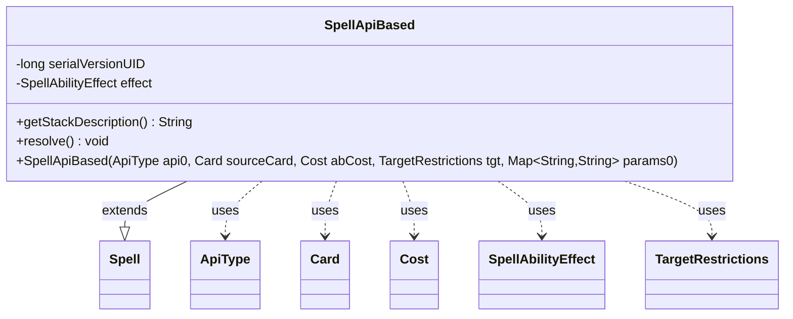

---
aliases:
  - SpellApiBased
tags:
  - java/class
  - module/forge-game
  - pkg/forge/game/ability
fqn: forge.game.ability.SpellApiBased
package: forge.game.ability
module: forge-game
kind: Class
---

# SpellApiBased

**Package:** `forge.game.ability` &nbsp; **Module:** `forge-game` &nbsp; **Kind:** Class



## Relationships
**Extends:**
- [[forge.game.spellability.Spell|Spell]]
**Uses:**
- [[forge.game.ability.ApiType|ApiType]]
- [[forge.game.ability.SpellAbilityEffect|SpellAbilityEffect]]
- [[forge.game.card.Card|Card]]
- [[forge.game.cost.Cost|Cost]]
- [[forge.game.spellability.TargetRestrictions|TargetRestrictions]]

## Design Description

SpellApiBased represents a castable spell whose behavior is driven entirely by Forge's data-driven ability API. Extending `Spell` (and thus the broader `SpellAbility` hierarchy), it is constructed from an `ApiType` that supplies a matching `SpellAbilityEffect`, along with the source `Card`, mana/`Cost`, optional `TargetRestrictions`, and a parameter map parsed from the card script. The constructor wires these together—copying parameters, marking the spell intrinsic, and delegating to `effect.buildSpellAbility` to configure itself—so that a single class can implement any scripted spell rather than requiring a bespoke subclass per card.

At runtime it forwards the core `SpellAbility` contract to its effect: `resolve()` invokes `effect.resolve` and notifies the activating player's achievement tracker, while `getStackDescription()` prefers an explicitly set description and otherwise falls back to the effect's generated text. This delegation-to-effect design keeps spell-casting mechanics generic and centralizes per-API behavior in reusable `SpellAbilityEffect` implementations.

## Source
`forge-game/src/main/java/forge/game/ability/SpellApiBased.java`

```java
package forge.game.ability;

import java.util.Map;

import forge.game.card.Card;
import forge.game.cost.Cost;
import forge.game.spellability.Spell;
import forge.game.spellability.TargetRestrictions;

public class SpellApiBased extends Spell {
    private static final long serialVersionUID = -6741797239508483250L;
    private final SpellAbilityEffect effect;

    public SpellApiBased(ApiType api0, Card sourceCard, Cost abCost, TargetRestrictions tgt, Map<String, String> params0) {
        super(sourceCard, abCost);
        this.setTargetRestrictions(tgt);

        mapParams.putAll(params0);
        api = api0;
        effect = api.getSpellEffect();

        // A spell is always intrinsic
        this.setIntrinsic(true);

        effect.buildSpellAbility(this);
        originalMapParams.putAll(mapParams);
    }

    @Override
    public String getStackDescription() {
        // prefer set stack Description if able 
        final String result = super.getStackDescription();
        if (result.isEmpty()) {
            return effect.getStackDescriptionWithSubs(mapParams, this);
        }
        return result;
    }

    /* (non-Javadoc)
     * @see forge.card.spellability.SpellAbility#resolve()
     */
    @Override
    public void resolve() {
        effect.resolve(this);
        getActivatingPlayer().getAchievementTracker().onSpellResolve(this);
    }
}
```
