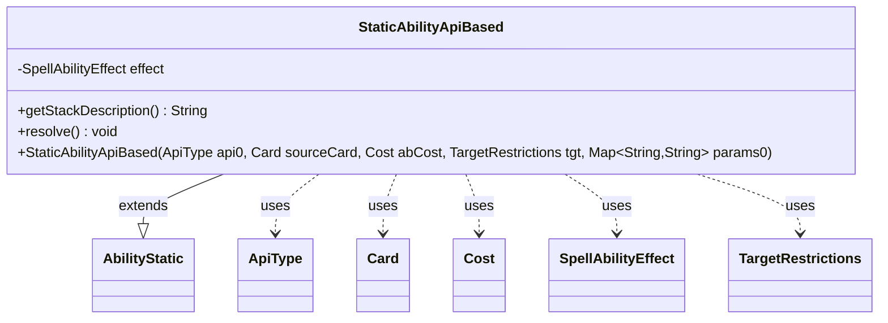

---
aliases:
  - StaticAbilityApiBased
tags:
  - java/class
  - module/forge-game
  - pkg/forge/game/ability
fqn: forge.game.ability.StaticAbilityApiBased
package: forge.game.ability
module: forge-game
kind: Class
---

# StaticAbilityApiBased

**Package:** `forge.game.ability` &nbsp; **Module:** `forge-game` &nbsp; **Kind:** Class



## Relationships
**Extends:**
- [[forge.game.spellability.AbilityStatic|AbilityStatic]]
**Uses:**
- [[forge.game.ability.ApiType|ApiType]]
- [[forge.game.ability.SpellAbilityEffect|SpellAbilityEffect]]
- [[forge.game.card.Card|Card]]
- [[forge.game.cost.Cost|Cost]]
- [[forge.game.spellability.TargetRestrictions|TargetRestrictions]]

## Design Description

`StaticAbilityApiBased` represents a static (non-stack) ability whose behavior is driven by Forge's data-oriented API system rather than bespoke subclasses. Extending `AbilityStatic`, it binds an `ApiType` to its corresponding `SpellAbilityEffect`, then delegates all real work to that effect: the constructor calls `effect.buildSpellAbility(this)` to configure the ability from its script parameters, `getStackDescription()` defers to `getStackDescriptionWithSubs`, and `resolve()` simply invokes `effect.resolve(this)`.

The design favors composition over inheritance: a single generic class collaborates with `Card`, `Cost`, and `TargetRestrictions` (passed to the superclass) and a polymorphic effect object, so new abilities are added by defining `ApiType`/effect pairs rather than new ability classes. Preserving `originalMapParams` alongside the working `mapParams` retains the ability's initial script state, supporting later resets or re-evaluation.

## Source
`forge-game/src/main/java/forge/game/ability/StaticAbilityApiBased.java`

```java
package forge.game.ability;

import java.util.Map;

import forge.game.card.Card;
import forge.game.cost.Cost;
import forge.game.spellability.AbilityStatic;
import forge.game.spellability.TargetRestrictions;

public class StaticAbilityApiBased extends AbilityStatic {

    private final SpellAbilityEffect effect;

    public StaticAbilityApiBased(ApiType api0, Card sourceCard, Cost abCost, TargetRestrictions tgt, Map<String, String> params0) {
        super(sourceCard, abCost, tgt);
        mapParams.putAll(params0);
        api = api0;
        effect = api.getSpellEffect();

        effect.buildSpellAbility(this);
        originalMapParams.putAll(mapParams);
    }

    @Override
    public String getStackDescription() {
        return effect.getStackDescriptionWithSubs(mapParams, this);
    }

    /* (non-Javadoc)
     * @see forge.card.spellability.SpellAbility#resolve()
     */
    @Override
    public void resolve() {
        effect.resolve(this);
    }
}
```

## Python
`forge/game/ability/StaticAbilityApiBased.py`

```python
from typing import Map  # noqa

from forge.game.ability.ApiType import ApiType
from forge.game.ability.SpellAbilityEffect import SpellAbilityEffect
from forge.game.card.Card import Card
from forge.game.cost.Cost import Cost
from forge.game.spellability.AbilityStatic import AbilityStatic
from forge.game.spellability.TargetRestrictions import TargetRestrictions


class StaticAbilityApiBased(AbilityStatic):

    def __init__(self, api0: ApiType, sourceCard: Card, abCost: Cost, tgt: TargetRestrictions, params0: dict[str, str]):
        super().__init__(sourceCard, abCost, tgt)
        self.mapParams.update(params0)
        self.api = api0
        self.effect: SpellAbilityEffect = self.api.getSpellEffect()

        self.effect.buildSpellAbility(self)
        self.originalMapParams.update(self.mapParams)

    def getStackDescription(self) -> str:
        return self.effect.getStackDescriptionWithSubs(self.mapParams, self)

    # (non-Javadoc)
    # @see forge.card.spellability.SpellAbility#resolve()
    def resolve(self) -> None:
        self.effect.resolve(self)
```
