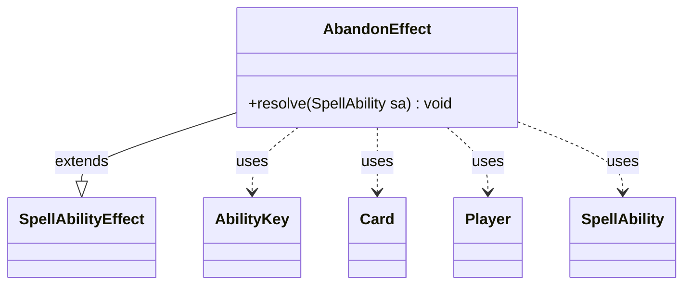

---
aliases:
  - AbandonEffect
tags:
  - java/class
  - module/forge-game
  - pkg/forge/game/ability/effects
fqn: forge.game.ability.effects.AbandonEffect
package: forge.game.ability.effects
module: forge-game
kind: Class
---

# AbandonEffect

**Package:** `forge.game.ability.effects` &nbsp; **Module:** `forge-game` &nbsp; **Kind:** Class



## Relationships
**Extends:**
- [[forge.game.ability.SpellAbilityEffect|SpellAbilityEffect]]
**Uses:**
- [[forge.game.ability.AbilityKey|AbilityKey]]
- [[forge.game.card.Card|Card]]
- [[forge.game.player.Player|Player]]
- [[forge.game.spellability.SpellAbility|SpellAbility]]


## Design Description

AbandonEffect encapsulates the resolution logic for the "Abandon" keyword action used by Archenemy scheme cards. As a concrete subclass of `SpellAbilityEffect`, it overrides only `resolve(SpellAbility)`, conforming to Forge's effect-factory pattern in which each data-defined ability delegates its behavior to a dedicated effect class. During resolution it reads the host `Card` and its controlling `Player` from the incoming `SpellAbility`, then uses parameter flags to drive optional behavior rather than hard-coded rules.

The effect optionally prompts the controller for confirmation (`Optional`) and may flag the card as remembered (`RememberAbandoned`). It then moves the scheme from the controller's Command zone into the Scheme deck and fires an `Abandoned` trigger, assembling the parameter map through `AbilityKey` and keying the scheme so dependent triggers can respond. Localized messaging and parameter-driven branching reflect Forge's configuration-over-code design intent.

## Source
`forge-game/src/main/java/forge/game/ability/effects/AbandonEffect.java`

```java
package forge.game.ability.effects;

import java.util.Map;

import forge.game.ability.AbilityKey;
import forge.game.ability.SpellAbilityEffect;
import forge.game.card.Card;
import forge.game.player.Player;
import forge.game.spellability.SpellAbility;
import forge.game.trigger.TriggerType;
import forge.game.zone.ZoneType;
import forge.util.Localizer;

public class AbandonEffect extends SpellAbilityEffect {


    /* (non-Javadoc)
     * @see forge.card.abilityfactory.SpellEffect#resolve(java.util.Map, forge.card.spellability.SpellAbility)
     */
    @Override
    public void resolve(SpellAbility sa) {
        Card source = sa.getHostCard();
        Player controller = source.getController();

        boolean isOptional = sa.hasParam("Optional");
        if (isOptional && !controller.getController().confirmAction(sa, null, Localizer.getInstance().getMessage("lblWouldYouLikeAbandonSource", source.getTranslatedName()), null)) {
            return;
        }

        if (sa.hasParam("RememberAbandoned")) {
            source.addRemembered(source);
        }

        controller.getZone(ZoneType.Command).remove(source);
        controller.getZone(ZoneType.SchemeDeck).add(source);

        final Map<AbilityKey, Object> runParams = AbilityKey.newMap();
        runParams.put(AbilityKey.Scheme, source);
        controller.getGame().getTriggerHandler().runTrigger(TriggerType.Abandoned, runParams, false);
    }

}
```
