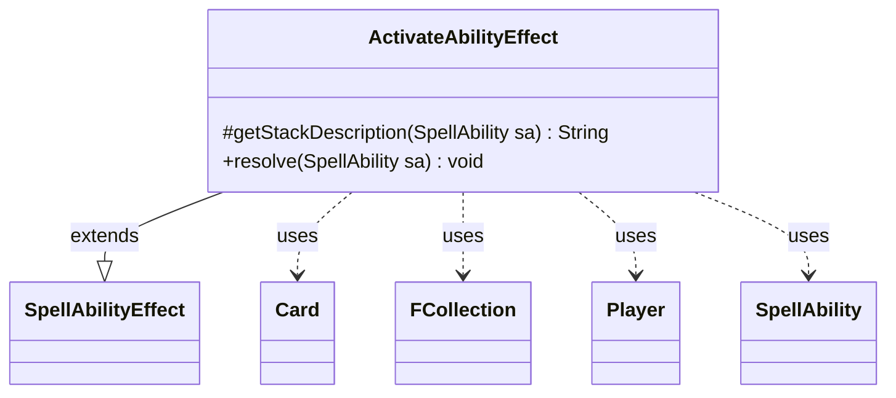

---
aliases:
  - ActivateAbilityEffect
tags:
  - java/class
  - module/forge-game
  - pkg/forge/game/ability/effects
fqn: forge.game.ability.effects.ActivateAbilityEffect
package: forge.game.ability.effects
module: forge-game
kind: Class
---

# ActivateAbilityEffect

**Package:** `forge.game.ability.effects` &nbsp; **Module:** `forge-game` &nbsp; **Kind:** Class



## Relationships
**Extends:**
- [[forge.game.ability.SpellAbilityEffect|SpellAbilityEffect]]
**Uses:**
- [[forge.game.card.Card|Card]]
- [[forge.game.player.Player|Player]]
- [[forge.game.spellability.SpellAbility|SpellAbility]]
- [[forge.util.collect.FCollection|FCollection]]

## Design Description

The description is already written in the note. Here is the Software Design Description prose:

ActivateAbilityEffect is a resolution handler that implements the behavior of an "activate ability" game effect. As a concrete subclass of `SpellAbilityEffect`, it overrides `getStackDescription` to produce a human-readable summary and `resolve` to perform the actual game action: for each targeted, in-game `Player`, it gathers the controlled `Card`s of a configurable `Type` on the battlefield and activates one of each card's available abilities. A `ManaAbility` parameter optionally narrows the candidates by intersecting them against the card's mana abilities (an `FCollection`).

The design follows Forge's data-driven effect pattern, where parameters (`Type`, `ManaAbility`) read from the `SpellAbility` customize behavior without subclassing. Ability selection is delegated to each `Player`'s controller via `chooseSingleSpellForEffect`, keeping AI and human decision-making behind a common interface, while the in-game guard and acknowledged `TODO` reflect defensive handling of resolution edge cases.

## Source
`forge-game/src/main/java/forge/game/ability/effects/ActivateAbilityEffect.java`

```java
package forge.game.ability.effects;

import java.util.List;

import org.apache.commons.lang3.StringUtils;

import com.google.common.collect.ImmutableMap;

import forge.game.ability.SpellAbilityEffect;
import forge.game.card.Card;
import forge.game.card.CardLists;
import forge.game.player.Player;
import forge.game.spellability.SpellAbility;
import forge.game.zone.ZoneType;
import forge.util.Lang;
import forge.util.Localizer;
import forge.util.collect.FCollection;

public class ActivateAbilityEffect extends SpellAbilityEffect {
    @Override
    protected String getStackDescription(SpellAbility sa) {
        final StringBuilder sb = new StringBuilder();

        final List<Player> tgtPlayers = getTargetPlayers(sa);

        sb.append(StringUtils.join(tgtPlayers, ", "));
        sb.append(" activates ");
        sb.append(Lang.nounWithAmount(1, sa.hasParam("ManaAbility") ? "mana ability" : "ability"));
        sb.append(" of each ").append(sa.getParamOrDefault("Type", "Card"));
        sb.append(" they control.");

        return sb.toString();
    }

    @Override
    public void resolve(SpellAbility sa) {
        final boolean isManaAb = sa.hasParam("ManaAbility");
        // TODO: improve ai and fix corner cases

        for (final Player p : getTargetPlayers(sa)) {
            if (!p.isInGame()) {
                continue;
            }

            List<Card> list = CardLists.getType(p.getCardsIn(ZoneType.Battlefield), sa.getParamOrDefault("Type", "Card"));
            for (Card c : list) {
                List<SpellAbility> possibleAb = c.getAllPossibleAbilities(p, true);
                if (isManaAb) {
                    possibleAb.retainAll((FCollection<SpellAbility>)c.getManaAbilities());
                }
                if (possibleAb.isEmpty()) {
                    continue;
                }
                SpellAbility manaAb = p.getController().chooseSingleSpellForEffect(
                        possibleAb, sa, Localizer.getInstance().getMessage("lblChooseManaAbility"), ImmutableMap.of());
                p.getController().playChosenSpellAbility(manaAb);
            }
        }
    }

}
```

## Python
`forge/game/ability/effects/ActivateAbilityEffect.py`

```python
package forge.game.ability.effects -> module path. Let me produce the Python port.

The dependencies and their FQNs:
- SpellAbilityEffect: forge.game.ability.SpellAbilityEffect
- Card: forge.game.card.Card
- CardLists: forge.game.card.CardLists
- Player: forge.game.player.Player
- SpellAbility: forge.game.spellability.SpellAbility
- ZoneType: forge.game.zone.ZoneType
- Lang: forge.util.Lang
- Localizer: forge.util.Localizer
- FCollection: forge.util.collect.FCollection
- StringUtils (commons lang) -> not a forge type; use Python join
- ImmutableMap -> use {} dict

Let me write it.

For StringUtils.join(tgtPlayers, ", ") -> ", ".join(str(p) for p in tgtPlayers)

Lang.nounWithAmount(1, ...) -> Lang.nounWithAmount(1, ...)

Let me output.
```
