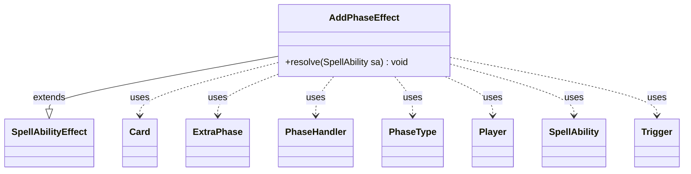

---
aliases:
  - AddPhaseEffect
tags:
  - java/class
  - module/forge-game
  - pkg/forge/game/ability/effects
fqn: forge.game.ability.effects.AddPhaseEffect
package: forge.game.ability.effects
module: forge-game
kind: Class
---

# AddPhaseEffect

**Package:** `forge.game.ability.effects`   **Module:** `forge-game`   **Kind:** Class



## Relationships
**Extends:**
- [[forge.game.ability.SpellAbilityEffect|SpellAbilityEffect]]
**Uses:**
- [[forge.game.card.Card|Card]]
- [[forge.game.phase.ExtraPhase|ExtraPhase]]
- [[forge.game.phase.PhaseHandler|PhaseHandler]]
- [[forge.game.phase.PhaseType|PhaseType]]
- [[forge.game.player.Player|Player]]
- [[forge.game.spellability.SpellAbility|SpellAbility]]
- [[forge.game.trigger.Trigger|Trigger]]


## Design Description

The description is already written and complete in the note. Here it is:

AddPhaseEffect is a resolution handler for the game-defined "add an extra phase" effect, concretely implementing the `resolve(SpellAbility)` contract inherited from its abstract supertype SpellAbilityEffect. Driven entirely by SpellAbility parameters, it reads the activating Player's current PhaseType from the game's PhaseHandler and constructs one or more ExtraPhase insertions—choosing the inserted phase group (Beginning, Combat, or a single named PhaseType) and any FollowedBy phase—then splices them in after a chosen anchor phase, respecting reversed-phase ("Topsy") turn order.

Notably, it can repeat the insertion NumPhases times and optionally attaches a delayed Trigger to each ExtraPhase, parsing the trigger and its overriding ability from the host Card's SVars via TriggerHandler and AbilityFactory. The class holds no state, delegating all phase-sequence bookkeeping to PhaseHandler and acting purely as declarative glue between card-script parameters and the engine's turn structure.

## Source
`forge-game/src/main/java/forge/game/ability/effects/AddPhaseEffect.java`

```java
package forge.game.ability.effects;

import java.util.ArrayList;
import java.util.List;

import forge.game.ability.AbilityFactory;
import forge.game.ability.AbilityUtils;
import forge.game.ability.SpellAbilityEffect;
import forge.game.card.Card;
import forge.game.phase.ExtraPhase;
import forge.game.phase.PhaseHandler;
import forge.game.phase.PhaseType;
import forge.game.player.Player;
import forge.game.spellability.SpellAbility;
import forge.game.trigger.Trigger;
import forge.game.trigger.TriggerHandler;

/**
 * TODO: Write javadoc for this type.
 *
 */
public class AddPhaseEffect extends SpellAbilityEffect {

    @Override
    public void resolve(SpellAbility sa) {
        final Card host = sa.getHostCard();
        final Player activator = sa.getActivatingPlayer();
        boolean isTopsy = activator.isPhasesReversed();
        PhaseHandler phaseHandler = activator.getGame().getPhaseHandler();

        PhaseType currentPhase = phaseHandler.getPhase();

        // Check for World at War - may need to be moved to SpellAbilityCondition later?
        if (sa.hasParam("BeforeFirstPostCombatMainEnd")) {
            if (!phaseHandler.beforeFirstPostCombatMainEnd()) {
                return;
            }
        }

        PhaseType afterPhase;
        if (sa.hasParam("AfterPhase")) {
            afterPhase = PhaseType.smartValueOf(sa.getParam("AfterPhase"));
        } else {
            // If "AfterPhase" param is missing it means the added Phase comes afterPhase this Phase
            afterPhase = currentPhase;
        }

        PhaseType nextPhase = PhaseType.getNext(afterPhase, isTopsy); // The original next phase following afterPhase
        PhaseType followingExtra = PhaseType.smartValueOf(sa.getParam("FollowedBy"));
        final String extra = sa.getParam("ExtraPhase");

        int num = sa.hasParam("NumPhases") ? AbilityUtils.calculateAmount(host, sa.getParam("NumPhases"), sa) : 1;
        for(int n = num; n > 0; n--) {
            List<PhaseType> extraPhaseList = new ArrayList<>();

            // Insert ExtraPhase
            if (extra.equals("Beginning")) {
                extraPhaseList.addAll(PhaseType.PHASE_GROUPS.get(0));
            } else if (extra.equals("Combat")) {
                extraPhaseList.addAll(PhaseType.PHASE_GROUPS.get(2));
            } else { // Currently no effect will add End Phase
                extraPhaseList.add(PhaseType.smartValueOf(extra));
            }

            // Insert FollowedBy (Currently all FollowedBy are Main2 phase, which has no step)
            if (followingExtra != null) extraPhaseList.add(followingExtra);

            ExtraPhase extraPhase = phaseHandler.addExtraPhase(afterPhase, extraPhaseList, nextPhase);

            if (sa.hasParam("ExtraPhaseDelayedTrigger")) {
                final Trigger delTrig = TriggerHandler.parseTrigger(sa.getSVar(sa.getParam("ExtraPhaseDelayedTrigger")), host, true);
                SpellAbility overridingSA = AbilityFactory.getAbility(sa.getSVar(sa.getParam("ExtraPhaseDelayedTriggerExcute")), host);
                overridingSA.setActivatingPlayer(activator);
                delTrig.setOverridingAbility(overridingSA);
                delTrig.setSpawningAbility(sa.copy(host, true));
                extraPhase.addTrigger(delTrig);
            }
        }
    }
}
```

## Python
`forge/game/ability/effects/AddPhaseEffect.py`

```python
from forge.game.ability.AbilityFactory import AbilityFactory
from forge.game.ability.AbilityUtils import AbilityUtils
from forge.game.ability.SpellAbilityEffect import SpellAbilityEffect
from forge.game.card.Card import Card
from forge.game.phase.ExtraPhase import ExtraPhase
from forge.game.phase.PhaseHandler import PhaseHandler
from forge.game.phase.PhaseType import PhaseType
from forge.game.player.Player import Player
from forge.game.spellability.SpellAbility import SpellAbility
from forge.game.trigger.Trigger import Trigger
from forge.game.trigger.TriggerHandler import TriggerHandler


# TODO: Write javadoc for this type.
#
class AddPhaseEffect(SpellAbilityEffect):

    def resolve(self, sa):
        host = sa.getHostCard()
        activator = sa.getActivatingPlayer()
        isTopsy = activator.isPhasesReversed()
        phaseHandler = activator.getGame().getPhaseHandler()

        currentPhase = phaseHandler.getPhase()

        # Check for World at War - may need to be moved to SpellAbilityCondition later?
        if sa.hasParam("BeforeFirstPostCombatMainEnd"):
            if not phaseHandler.beforeFirstPostCombatMainEnd():
                return

        if sa.hasParam("AfterPhase"):
            afterPhase = PhaseType.smartValueOf(sa.getParam("AfterPhase"))
        else:
            # If "AfterPhase" param is missing it means the added Phase comes afterPhase this Phase
            afterPhase = currentPhase

        nextPhase = PhaseType.getNext(afterPhase, isTopsy)  # The original next phase following afterPhase
        followingExtra = PhaseType.smartValueOf(sa.getParam("FollowedBy"))
        extra = sa.getParam("ExtraPhase")

        num = AbilityUtils.calculateAmount(host, sa.getParam("NumPhases"), sa) if sa.hasParam("NumPhases") else 1
        for n in range(num, 0, -1):
            extraPhaseList = []

            # Insert ExtraPhase
            if extra == "Beginning":
                extraPhaseList.extend(PhaseType.PHASE_GROUPS.get(0))
            elif extra == "Combat":
                extraPhaseList.extend(PhaseType.PHASE_GROUPS.get(2))
            else:  # Currently no effect will add End Phase
                extraPhaseList.append(PhaseType.smartValueOf(extra))

            # Insert FollowedBy (Currently all FollowedBy are Main2 phase, which has no step)
            if followingExtra is not None:
                extraPhaseList.append(followingExtra)

            extraPhase = phaseHandler.addExtraPhase(afterPhase, extraPhaseList, nextPhase)

            if sa.hasParam("ExtraPhaseDelayedTrigger"):
                delTrig = TriggerHandler.parseTrigger(sa.getSVar(sa.getParam("ExtraPhaseDelayedTrigger")), host, True)
                overridingSA = AbilityFactory.getAbility(sa.getSVar(sa.getParam("ExtraPhaseDelayedTriggerExcute")), host)
                overridingSA.setActivatingPlayer(activator)
                delTrig.setOverridingAbility(overridingSA)
                delTrig.setSpawningAbility(sa.copy(host, True))
                extraPhase.addTrigger(delTrig)
```
