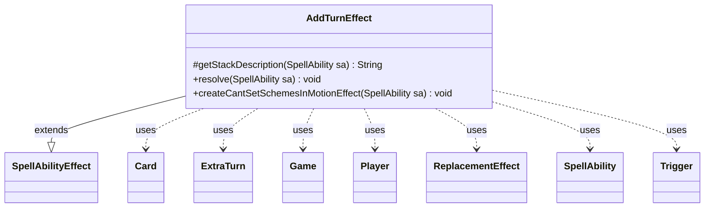

---
aliases:
  - AddTurnEffect
tags:
  - java/class
  - module/forge-game
  - pkg/forge/game/ability/effects
fqn: forge.game.ability.effects.AddTurnEffect
package: forge.game.ability.effects
module: forge-game
kind: Class
---

# AddTurnEffect

**Package:** `forge.game.ability.effects` &nbsp; **Module:** `forge-game` &nbsp; **Kind:** Class



## Relationships
**Extends:**
- [[forge.game.ability.SpellAbilityEffect|SpellAbilityEffect]]
**Uses:**
- [[forge.game.Game|Game]]
- [[forge.game.card.Card|Card]]
- [[forge.game.phase.ExtraTurn|ExtraTurn]]
- [[forge.game.player.Player|Player]]
- [[forge.game.replacement.ReplacementEffect|ReplacementEffect]]
- [[forge.game.spellability.SpellAbility|SpellAbility]]
- [[forge.game.trigger.Trigger|Trigger]]


## Design Description

AddTurnEffect is a concrete resolution handler that grants players additional turns, implementing one of Forge's data-driven card abilities. Extending `SpellAbilityEffect`, it overrides `getStackDescription` to render human-readable stack text and `resolve` to enact the effect: for each targeted, in-game `Player` it registers `NumTurns` `ExtraTurn` entries through the game's phase handler. Optional `SpellAbility` parameters let cards attach a delayed `Trigger`, skip the untap step, suppress scheme activation, or notify players, keeping behavior configurable from card script rather than code.

The static `createCantSetSchemesInMotionEffect` builds a temporary command-zone `Card` carrying a `ReplacementEffect` that forbids setting schemes in motion, exiled at end of turn. Collaborating with `Game`, `Card`, and the replacement and trigger handlers, the class embodies Forge's pattern of small, single-purpose effect classes driven by parameterized spell abilities.

## Source
`forge-game/src/main/java/forge/game/ability/effects/AddTurnEffect.java`

```java
package forge.game.ability.effects;

import forge.game.Game;
import forge.game.ability.AbilityFactory;
import forge.game.ability.AbilityUtils;
import forge.game.ability.SpellAbilityEffect;
import forge.game.card.Card;
import forge.game.phase.ExtraTurn;
import forge.game.player.Player;
import forge.game.replacement.ReplacementEffect;
import forge.game.replacement.ReplacementHandler;
import forge.game.spellability.SpellAbility;
import forge.game.trigger.Trigger;
import forge.game.trigger.TriggerHandler;
import forge.util.Lang;
import forge.util.Localizer;

public class AddTurnEffect extends SpellAbilityEffect {

    @Override
    protected String getStackDescription(SpellAbility sa) {
        final StringBuilder sb = new StringBuilder();
        final int numTurns = AbilityUtils.calculateAmount(sa.getHostCard(), sa.getParam("NumTurns"), sa);

        sb.append(Lang.joinHomogenous(getTargetPlayers(sa)));

        sb.append(" takes ");
        sb.append(numTurns > 1 ? numTurns : "an");
        sb.append(" extra turn");

        if (numTurns > 1) {
            sb.append("s");
        }
        sb.append(" after this one.");
        return sb.toString();
    }

    @Override
    public void resolve(SpellAbility sa) {
        final int numTurns = AbilityUtils.calculateAmount(sa.getHostCard(), sa.getParam("NumTurns"), sa);

        for (final Player p : getTargetPlayers(sa)) {
            if (!p.isInGame()) {
                continue;
            }
            for (int i = 0; i < numTurns; i++) {
                ExtraTurn extra = p.getGame().getPhaseHandler().addExtraTurn(p);
                if (sa.hasParam("ExtraTurnDelayedTrigger")) {
                    final Trigger delTrig = TriggerHandler.parseTrigger(sa.getSVar(sa.getParam("ExtraTurnDelayedTrigger")), sa.getHostCard(), true);
                    SpellAbility overridingSA = AbilityFactory.getAbility(sa.getSVar(sa.getParam("ExtraTurnDelayedTriggerExcute")), sa.getHostCard());
                    overridingSA.setActivatingPlayer(sa.getActivatingPlayer());
                    delTrig.setOverridingAbility(overridingSA);
                    delTrig.setSpawningAbility(sa.copy(sa.getHostCard(), true));
                    extra.addTrigger(delTrig);
                }
                if (sa.hasParam("SkipUntap")) {
                    extra.setSkipUntapSA(sa);
                }
                if (sa.hasParam("NoSchemes")) {
                    extra.setCantSetSchemesInMotionSA(sa);
                }
                if (sa.hasParam("ShowMessage")) {
                    p.getGame().getAction().notifyOfValue(sa, p, Localizer.getInstance().getMessage("lblPlayerTakesExtraTurn", p.toString()), null);
                }
            }
        }
    }

    public static void createCantSetSchemesInMotionEffect(SpellAbility sa) {
        final Card hostCard = sa.getHostCard();
        final Game game = hostCard.getGame();
        final String name = hostCard.getDisplayName() + "'s Effect";
        final String image = hostCard.getImageKey();

        final Card eff = createEffect(sa, sa.getActivatingPlayer(), name, image);

        String strRe = "Event$ SetInMotion | EffectZone$ Command | Layer$ CantHappen | Description$ Schemes can't be set in Motion";
        ReplacementEffect re = ReplacementHandler.parseReplacement(strRe, eff, true);
        eff.addReplacementEffect(re);

        game.getAction().moveToCommand(eff, sa);
        game.getEndOfTurn().addUntil(() -> game.getAction().exileEffect(eff));
    }

}
```

## Python
`forge/game/ability/effects/AddTurnEffect.py`

```python
package: forge.game.ability.effects → module forge/game/ability/effects/AddTurnEffect.py

Let me produce the Python port.

Dependencies from imports and relationships. Java imports include AbilityFactory, AbilityUtils, ReplacementHandler, TriggerHandler, Lang, Localizer which aren't in relationships but are in Java imports. I should import all FQN dependencies.

forge.game.Game
forge.game.ability.AbilityFactory
forge.game.ability.AbilityUtils
forge.game.ability.SpellAbilityEffect
forge.game.card.Card
forge.game.phase.ExtraTurn
forge.game.player.Player
forge.game.replacement.ReplacementEffect
forge.game.replacement.ReplacementHandler
forge.game.spellability.SpellAbility
forge.game.trigger.Trigger
forge.game.trigger.TriggerHandler
forge.util.Lang
forge.util.Localizerfrom forge.game.Game import Game
from forge.game.ability.AbilityFactory import AbilityFactory
from forge.game.ability.AbilityUtils import AbilityUtils
from forge.game.ability.SpellAbilityEffect import SpellAbilityEffect
from forge.game.card.Card import Card
from forge.game.phase.ExtraTurn import ExtraTurn
from forge.game.player.Player import Player
from forge.game.replacement.ReplacementEffect import ReplacementEffect
from forge.game.replacement.ReplacementHandler import ReplacementHandler
from forge.game.spellability.SpellAbility import SpellAbility
from forge.game.trigger.Trigger import Trigger
from forge.game.trigger.TriggerHandler import TriggerHandler
from forge.util.Lang import Lang
from forge.util.Localizer import Localizer


class AddTurnEffect(SpellAbilityEffect):

    def getStackDescription(self, sa: SpellAbility) -> str:
        sb = []
        numTurns = AbilityUtils.calculateAmount(sa.getHostCard(), sa.getParam("NumTurns"), sa)

        sb.append(Lang.joinHomogenous(self.getTargetPlayers(sa)))

        sb.append(" takes ")
        sb.append(str(numTurns if numTurns > 1 else "an"))
        sb.append(" extra turn")

        if numTurns > 1:
            sb.append("s")
        sb.append(" after this one.")
        return "".join(sb)

    def resolve(self, sa: SpellAbility) -> None:
        numTurns = AbilityUtils.calculateAmount(sa.getHostCard(), sa.getParam("NumTurns"), sa)

        for p in self.getTargetPlayers(sa):
            if not p.isInGame():
                continue
            for i in range(numTurns):
                extra = p.getGame().getPhaseHandler().addExtraTurn(p)
                if sa.hasParam("ExtraTurnDelayedTrigger"):
                    delTrig = TriggerHandler.parseTrigger(sa.getSVar(sa.getParam("ExtraTurnDelayedTrigger")), sa.getHostCard(), True)
                    overridingSA = AbilityFactory.getAbility(sa.getSVar(sa.getParam("ExtraTurnDelayedTriggerExcute")), sa.getHostCard())
                    overridingSA.setActivatingPlayer(sa.getActivatingPlayer())
                    delTrig.setOverridingAbility(overridingSA)
                    delTrig.setSpawningAbility(sa.copy(sa.getHostCard(), True))
                    extra.addTrigger(delTrig)
                if sa.hasParam("SkipUntap"):
                    extra.setSkipUntapSA(sa)
                if sa.hasParam("NoSchemes"):
                    extra.setCantSetSchemesInMotionSA(sa)
                if sa.hasParam("ShowMessage"):
                    p.getGame().getAction().notifyOfValue(sa, p, Localizer.getInstance().getMessage("lblPlayerTakesExtraTurn", p.toString()), None)

    @staticmethod
    def createCantSetSchemesInMotionEffect(sa: SpellAbility) -> None:
        hostCard = sa.getHostCard()
        game = hostCard.getGame()
        name = hostCard.getDisplayName() + "'s Effect"
        image = hostCard.getImageKey()

        eff = SpellAbilityEffect.createEffect(sa, sa.getActivatingPlayer(), name, image)

        strRe = "Event$ SetInMotion | EffectZone$ Command | Layer$ CantHappen | Description$ Schemes can't be set in Motion"
        re = ReplacementHandler.parseReplacement(strRe, eff, True)
        eff.addReplacementEffect(re)

        game.getAction().moveToCommand(eff, sa)
        game.getEndOfTurn().addUntil(lambda: game.getAction().exileEffect(eff))
```
