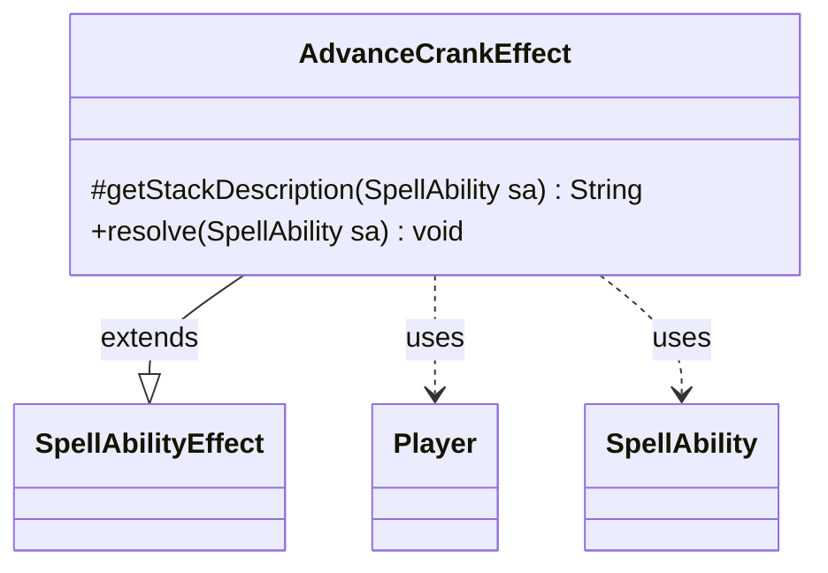

---
aliases:
  - AdvanceCrankEffect
tags:
  - java/class
  - module/forge-game
  - pkg/forge/game/ability/effects
fqn: forge.game.ability.effects.AdvanceCrankEffect
package: forge.game.ability.effects
module: forge-game
kind: Class
---

# AdvanceCrankEffect

**Package:** `forge.game.ability.effects` &nbsp; **Module:** `forge-game` &nbsp; **Kind:** Class



## Relationships
**Extends:**
- [[forge.game.ability.SpellAbilityEffect|SpellAbilityEffect]]
**Uses:**
- [[forge.game.player.Player|Player]]
- [[forge.game.spellability.SpellAbility|SpellAbility]]


## Design Description

AdvanceCrankEffect implements the resolution logic for a spell or ability that advances a player's CRANK! counter, part of Forge's contraption/sprocket mechanic. As a concrete subclass of SpellAbilityEffect, it integrates with the engine's effect-resolution framework by overriding two hooks: `getStackDescription`, which composes the human-readable stack text for the affected players, and `resolve`, which applies the actual game-state change.

The class is intentionally thin. Rather than encoding the crank rules itself, `resolve` delegates to each targeted Player via `advanceCrankCounter`, keeping the mechanic's behavior on the Player domain object and leaving this class as a narrow adapter between SpellAbility data and that operation. It resolves its targets through the inherited `getDefinedPlayersOrTargeted` helper and uses `Lang.joinHomogenous` to format multiple players idiomatically in the description, returning an empty string when no players are involved.

## Source
`forge-game/src/main/java/forge/game/ability/effects/AdvanceCrankEffect.java`

```java
package forge.game.ability.effects;

import forge.game.ability.SpellAbilityEffect;
import forge.game.player.Player;
import forge.game.spellability.SpellAbility;
import forge.util.Lang;

import java.util.List;

public class AdvanceCrankEffect extends SpellAbilityEffect {
    @Override
    protected String getStackDescription(SpellAbility sa) {
        final StringBuilder sb = new StringBuilder();
        final List<Player> tgtPlayers = getDefinedPlayersOrTargeted(sa);

        if(tgtPlayers.isEmpty())
            return "";

        sb.append(Lang.joinHomogenous(tgtPlayers));
        sb.append(" advances their CRANK! counter to the next sprocket and cranks any number of that sprocket's contraptions");
        return sb.toString();
    }

    @Override
    public void resolve(SpellAbility sa) {
        getDefinedPlayersOrTargeted(sa).forEach(Player::advanceCrankCounter);
    }
}
```
