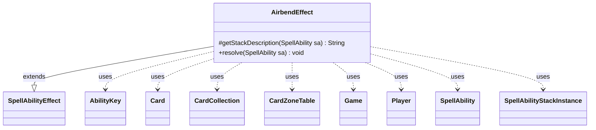

---
aliases:
  - AirbendEffect
tags:
  - java/class
  - module/forge-game
  - pkg/forge/game/ability/effects
fqn: forge.game.ability.effects.AirbendEffect
package: forge.game.ability.effects
module: forge-game
kind: Class
---

# AirbendEffect

**Package:** `forge.game.ability.effects`   **Module:** `forge-game`   **Kind:** Class



## Relationships
**Extends:**
- [[forge.game.ability.SpellAbilityEffect|SpellAbilityEffect]]
**Uses:**
- [[forge.game.Game|Game]]
- [[forge.game.ability.AbilityKey|AbilityKey]]
- [[forge.game.card.Card|Card]]
- [[forge.game.card.CardCollection|CardCollection]]
- [[forge.game.card.CardZoneTable|CardZoneTable]]
- [[forge.game.player.Player|Player]]
- [[forge.game.spellability.SpellAbility|SpellAbility]]
- [[forge.game.spellability.SpellAbilityStackInstance|SpellAbilityStackInstance]]


## Design Description

AirbendEffect is a concrete spell-ability effect that realizes Magic's "Airbend" keyword action: exiling targeted cards and letting their owners recast them for {2}. Extending `SpellAbilityEffect`, it overrides `getStackDescription` to compose a player-facing summary and `resolve` to apply the game-state changes.

On resolution it works through the `Game`'s action and stack APIs, validating each target against its live `Card` state to skip LKI, timestamp mismatches, and phased-out cards before exiling it via a `CardZoneTable`-tracked move and removing any matching `SpellAbilityStackInstance`. Each exiled card gets a command-zone effect bearing a continuous `MayPlay` static ability plus forget-on-move and forget-on-cast triggers, with results gathered in a `CardCollection`. It finally fires zone-change triggers and, per rule 701.65b, notifies the activating `Player` of the elemental-bend trigger.

## Source
`forge-game/src/main/java/forge/game/ability/effects/AirbendEffect.java`

```java
package forge.game.ability.effects;

import java.util.List;
import java.util.Map;

import com.google.common.collect.Iterables;

import forge.game.Game;
import forge.game.ability.AbilityKey;
import forge.game.ability.SpellAbilityEffect;
import forge.game.card.Card;
import forge.game.card.CardCollection;
import forge.game.card.CardZoneTable;
import forge.game.player.Player;
import forge.game.spellability.SpellAbility;
import forge.game.spellability.SpellAbilityStackInstance;
import forge.game.trigger.TriggerType;
import forge.game.zone.ZoneType;
import forge.util.Lang;

public class AirbendEffect extends SpellAbilityEffect {

    @Override
    protected String getStackDescription(SpellAbility sa) {
        final StringBuilder sb = new StringBuilder("Airbend ");

        Iterable<Card> tgts;
        if (sa.usesTargeting()) {
            tgts = getCardsfromTargets(sa);
        } else { // otherwise add self to list and go from there
            tgts = sa.knownDetermineDefined(sa.getParam("Defined"));
        }

        sb.append(sa.getParamOrDefault("DefinedDesc", Lang.joinHomogenous(tgts)));
        sb.append(".");
        if (Iterables.size(tgts) > 1) {
            sb.append(" (Exile them. While each one is exiled, its owner may cast it for {2} rather than its mana cost.)");
        } else {
            sb.append(" (Exile it. While it’s exiled, its owner may cast it for {2} rather than its mana cost.)");
        }

        return sb.toString();
    }

    @Override
    public void resolve(SpellAbility sa) {
        final Card hostCard = sa.getHostCard();
        final Game game = hostCard.getGame();
        final Player pl = sa.getActivatingPlayer();

        Map<AbilityKey, Object> moveParams = AbilityKey.newMap();
        CardZoneTable zoneMovements = AbilityKey.addCardZoneTableParams(moveParams, sa);
        CardCollection moved = new CardCollection();

        for (Card c : getCardsfromTargets(sa)) {
            final Card gameCard = game.getCardState(c, null);
            // gameCard is LKI in that case, the card is not in game anymore
            // or the timestamp did change
            // this should check Self too
            if (gameCard == null || !c.equalsWithGameTimestamp(gameCard) || gameCard.isPhasedOut()) {
                continue;
            }
            handleExiledWith(gameCard, sa);

            SpellAbilityStackInstance si = null;
            if (gameCard.isInZone(ZoneType.Stack)) {
                SpellAbility stackSA = game.getStack().getSpellMatchingHost(gameCard);
                si = game.getStack().getInstanceMatchingSpellAbilityID(stackSA);
            }

            Card movedCard = game.getAction().exile(gameCard, sa, moveParams);
            if (movedCard == null || !movedCard.isInZone(ZoneType.Exile)) {
                continue;
            }

            if (si != null) {
                // GameAction.changeZone should really take care of cleaning up SASI when a card from the stack is removed.
                game.getStack().remove(si);
            }

            CardCollection exiled = zoneMovements.filterCards(null, List.of(ZoneType.Exile), null, null, null);
            exiled.removeIf(Card::isToken);
            exiled.removeAll(moved);
            if (exiled.isEmpty()) {
                continue;
            }
            moved.addAll(exiled);

            // Effect to cast for 2 from exile
            Card eff = createEffect(sa, movedCard.getOwner(), "Airbend " + movedCard, hostCard.getImageKey());
            eff.addRemembered(exiled);

            StringBuilder sbPlay = new StringBuilder();
            sbPlay.append("Mode$ Continuous | MayPlay$ True | MayPlayAltManaCost$ 2 | EffectZone$ Command | Affected$ Card.IsRemembered+nonLand");
            sbPlay.append(" | AffectedZone$ Exile | Description$ You may cast the card.");
            eff.addStaticAbility(sbPlay.toString());

            addForgetOnMovedTrigger(eff, "Exile");
            addForgetOnCastTrigger(eff, "Card.IsRemembered");

            game.getAction().moveToCommand(eff, sa);
        }

        zoneMovements.triggerChangesZoneAll(game, sa);
        handleExiledWith(zoneMovements.allCards(), sa);

        // CR 701.65b
        if (!zoneMovements.isEmpty()) {
            pl.triggerElementalBend(TriggerType.Airbend);
        }
    }

}
```
