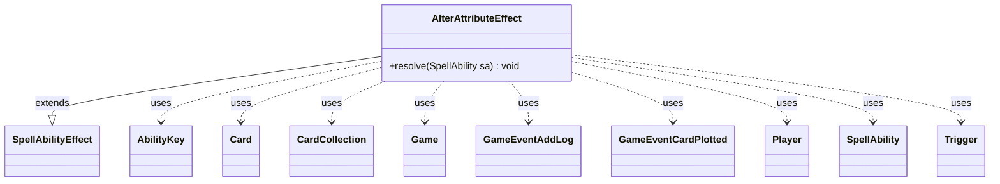

---
aliases:
  - AlterAttributeEffect
tags:
  - java/class
  - module/forge-game
  - pkg/forge/game/ability/effects
fqn: forge.game.ability.effects.AlterAttributeEffect
package: forge.game.ability.effects
module: forge-game
kind: Class
---

# AlterAttributeEffect

**Package:** `forge.game.ability.effects`   **Module:** `forge-game`   **Kind:** Class



## Relationships
**Extends:**
- [[forge.game.ability.SpellAbilityEffect|SpellAbilityEffect]]
**Uses:**
- [[forge.game.Game|Game]]
- [[forge.game.ability.AbilityKey|AbilityKey]]
- [[forge.game.card.Card|Card]]
- [[forge.game.card.CardCollection|CardCollection]]
- [[forge.game.event.GameEventAddLog|GameEventAddLog]]
- [[forge.game.event.GameEventCardPlotted|GameEventCardPlotted]]
- [[forge.game.player.Player|Player]]
- [[forge.game.spellability.SpellAbility|SpellAbility]]
- [[forge.game.trigger.Trigger|Trigger]]


## Design Description

AlterAttributeEffect is a resolution handler that toggles a set of named card attributes—Harnessed, Plotted, Prepared, Solved, Suspected, Saddled, and Commander status—when its spell or ability resolves. As a concrete subclass of `SpellAbilityEffect`, it overrides only `resolve(SpellAbility)`, slotting into Forge's ability-effect framework where each effect type encapsulates one kind of game action driven by script parameters (Activate, Attributes, Optional, RememberAltered).

For each defined or targeted `Card` it resolves live game state through the `Game`, skipping stale LKI or phased-out cards, then applies each requested attribute via a `switch`. Beyond flipping flags, it fires `GameEvent`s for logging and plotting, runs `Trigger`s (CaseSolved, BecomesSaddled), and for "Prepared" builds a full command-zone effect with its own trigger, may-play static, and cleanup command. The design centralizes many small, related card-state mutations behind one data-driven effect rather than scattering them across separate effect classes.

## Source
`forge-game/src/main/java/forge/game/ability/effects/AlterAttributeEffect.java`

```java
package forge.game.ability.effects;

import java.util.Map;

import forge.card.CardStateName;
import forge.game.Game;
import forge.game.GameLogEntryType;
import forge.game.GameType;
import forge.game.ability.AbilityFactory;
import forge.game.ability.AbilityKey;
import forge.game.ability.SpellAbilityEffect;
import forge.game.card.Card;
import forge.game.card.CardCollection;
import forge.game.event.GameEventAddLog;
import forge.game.event.GameEventCardPlotted;
import forge.game.player.Player;
import forge.game.spellability.SpellAbility;
import forge.game.trigger.Trigger;
import forge.game.trigger.TriggerHandler;
import forge.game.trigger.TriggerType;
import forge.game.zone.ZoneType;
import forge.util.Lang;
import forge.util.TextUtil;

public class AlterAttributeEffect extends SpellAbilityEffect {
    @Override
    public void resolve(SpellAbility sa) {
        Player activator = sa.getActivatingPlayer();
        Game game = activator.getGame();
        boolean activate = Boolean.parseBoolean(sa.getParamOrDefault("Activate", "true"));
        String[] attributes = sa.getParam("Attributes").split(",");
        CardCollection defined = getDefinedCardsOrTargeted(sa);

        if (sa.hasParam("Optional")) {
            final String targets = Lang.joinHomogenous(defined);
            final String message = sa.hasParam("OptionQuestion")
                    ? TextUtil.fastReplace(sa.getParam("OptionQuestion"), "TARGETS", targets)
                    : getStackDescription(sa);

            if (!activator.getController().confirmAction(sa, null, message, null)) {
                return;
            }
        }

        for (Card c : defined) {
            final Card gameCard = game.getCardState(c, null);
            // gameCard is LKI in that case, the card is not in game anymore
            // or the timestamp did change
            // this should check Self too
            if (gameCard == null || !c.equalsWithGameTimestamp(gameCard) || gameCard.isPhasedOut()) {
                continue;
            }

            for (String attr : attributes) {
                boolean altered = false;

                switch (attr.trim()) {
                    case "Harnessed":
                        altered = gameCard.setHarnessed(activate);
                        break;
                    case "Plotted":
                        altered = gameCard.setPlotted(activate);
                        game.fireEvent(new GameEventCardPlotted(c, activator));
                        break;
                    case "Prepared":
                        Card eff = null;
                        if (activate) {
                            if (gameCard.isPrepared() || !gameCard.hasState(CardStateName.PreparedSpell)) {
                                continue;
                            }
                            Card prepared = CopyPermanentEffect.getProtoType(sa, gameCard, activator);
                            prepared.setState(CardStateName.PreparedSpell, true);
                            prepared.getOwner().getZone(ZoneType.Exile).add(prepared);
                            eff = createEffect(null, gameCard, activator, gameCard + "'s Prepared Spell", prepared.getImageKey(), game.getNextTimestamp());
                            eff.addRemembered(prepared);
                            eff.setRenderForUI(false);
                            String castTrig = "Mode$ SpellCast | TriggerZones$ Command | Static$ True | ValidSA$ Spell.IsRemembered";
                            String unprepare = "DB$ AlterAttribute | Defined$ EffectSource | Attributes$ Prepared | Activate$ False";
                            final Trigger parsedTrigger = TriggerHandler.parseTrigger(castTrig, eff, true);
                            eff.addTrigger(parsedTrigger);
                            final SpellAbility unprepareSA = AbilityFactory.getAbility(unprepare, eff);
                            parsedTrigger.setOverridingAbility(unprepareSA);
                            String mayPlay = "Mode$ Continuous | MayPlay$ True | MayPlayPlayer$ EffectSourceController | EffectZone$ Command | " +
                                    "AffectedDefined$ Remembered | AffectedZone$ Exile";
                            eff.addStaticAbility(mayPlay);
                            game.getAction().moveToCommand(eff, sa);
                            gameCard.addLeavesPlayCommand(() -> gameCard.setPrepared(null));
                        }
                        gameCard.setPrepared(eff);
                        break;
                    case "Solve":
                    case "Solved":
                        altered = gameCard.setSolved(activate);
                        if (altered) {
                            Map<AbilityKey, Object> runParams = AbilityKey.mapFromCard(gameCard);
                            runParams.put(AbilityKey.Player, sa.getActivatingPlayer());
                            game.getTriggerHandler().runTrigger(TriggerType.CaseSolved, runParams, false);
                        }
                        break;
                    case "Suspect":
                    case "Suspected":
                        altered = gameCard.setSuspected(activate);
                        break;
                    case "Saddle":
                    case "Saddled":
                        // currently clean up in Card manually
                        altered = gameCard.setSaddled(activate);
                        if (altered) {
                            CardCollection saddlers = sa.getPaidList("TappedCards", true);
                            gameCard.addSaddledByThisTurn(saddlers);
                            Map<AbilityKey, Object> runParams = AbilityKey.mapFromCard(gameCard);
                            runParams.put(AbilityKey.Crew, saddlers);
                            game.getTriggerHandler().runTrigger(TriggerType.BecomesSaddled, runParams, false);
                        }
                        break;
                    case "Commander":
                        //This implementation doesn't let a card make someone else's creature your commander. But that's an edge case among edge cases.
                        Player p = gameCard.getOwner();
                        if (gameCard.isCommander() == activate || p.getCommanders().contains(gameCard) == activate)
                            break; //Isn't changing status.
                        if (activate) {
                            if (!game.getRules().hasCommander()) {
                                System.out.println("Commander status applied in non-commander format. Applying Commander variant.");
                                game.getRules().addAppliedVariant(GameType.Commander);
                            }
                            p.addCommander(gameCard);
                            //Seems important enough to mention in the game log.
                            game.fireEvent(new GameEventAddLog(GameLogEntryType.STACK_RESOLVE, String.format("%s is now %s's commander.", gameCard.getPaperCard().getDisplayName(), p)));
                        } else {
                            p.removeCommander(gameCard);
                            game.fireEvent(new GameEventAddLog(GameLogEntryType.STACK_RESOLVE, String.format("%s is no longer %s's commander.", gameCard.getPaperCard().getDisplayName(), p)));
                        }
                        altered = true;
                        break;

                        // Other attributes: renown, monstrous, suspected, etc

                    default:
                        break;
                }

                if (altered && sa.hasParam("RememberAltered")) {
                    sa.getHostCard().addRemembered(gameCard);
                }
            }
            gameCard.updateAbilityTextForView();
        }
    }
}
```

## Python
`forge/game/ability/effects/AlterAttributeEffect.py`

```python
from forge.card.CardStateName import CardStateName
from forge.game.Game import Game
from forge.game.GameLogEntryType import GameLogEntryType
from forge.game.GameType import GameType
from forge.game.ability.AbilityFactory import AbilityFactory
from forge.game.ability.AbilityKey import AbilityKey
from forge.game.ability.SpellAbilityEffect import SpellAbilityEffect
from forge.game.ability.effects.CopyPermanentEffect import CopyPermanentEffect
from forge.game.card.Card import Card
from forge.game.card.CardCollection import CardCollection
from forge.game.event.GameEventAddLog import GameEventAddLog
from forge.game.event.GameEventCardPlotted import GameEventCardPlotted
from forge.game.player.Player import Player
from forge.game.spellability.SpellAbility import SpellAbility
from forge.game.trigger.Trigger import Trigger
from forge.game.trigger.TriggerHandler import TriggerHandler
from forge.game.trigger.TriggerType import TriggerType
from forge.game.zone.ZoneType import ZoneType
from forge.util.Lang import Lang
from forge.util.TextUtil import TextUtil


class AlterAttributeEffect(SpellAbilityEffect):
    def resolve(self, sa: SpellAbility) -> None:
        activator = sa.getActivatingPlayer()
        game = activator.getGame()
        activate = bool(sa.getParamOrDefault("Activate", "true").lower() == "true")
        attributes = sa.getParam("Attributes").split(",")
        defined = self.getDefinedCardsOrTargeted(sa)

        if sa.hasParam("Optional"):
            targets = Lang.joinHomogenous(defined)
            message = (TextUtil.fastReplace(sa.getParam("OptionQuestion"), "TARGETS", targets)
                       if sa.hasParam("OptionQuestion")
                       else self.getStackDescription(sa))

            if not activator.getController().confirmAction(sa, None, message, None):
                return

        for c in defined:
            gameCard = game.getCardState(c, None)
            # gameCard is LKI in that case, the card is not in game anymore
            # or the timestamp did change
            # this should check Self too
            if gameCard is None or not c.equalsWithGameTimestamp(gameCard) or gameCard.isPhasedOut():
                continue

            for attr in attributes:
                altered = False

                a = attr.strip()
                if a == "Harnessed":
                    altered = gameCard.setHarnessed(activate)
                elif a == "Plotted":
                    altered = gameCard.setPlotted(activate)
                    game.fireEvent(GameEventCardPlotted(c, activator))
                elif a == "Prepared":
                    eff = None
                    if activate:
                        if gameCard.isPrepared() or not gameCard.hasState(CardStateName.PreparedSpell):
                            continue
                        prepared = CopyPermanentEffect.getProtoType(sa, gameCard, activator)
                        prepared.setState(CardStateName.PreparedSpell, True)
                        prepared.getOwner().getZone(ZoneType.Exile).add(prepared)
                        eff = self.createEffect(None, gameCard, activator, str(gameCard) + "'s Prepared Spell", prepared.getImageKey(), game.getNextTimestamp())
                        eff.addRemembered(prepared)
                        eff.setRenderForUI(False)
                        castTrig = "Mode$ SpellCast | TriggerZones$ Command | Static$ True | ValidSA$ Spell.IsRemembered"
                        unprepare = "DB$ AlterAttribute | Defined$ EffectSource | Attributes$ Prepared | Activate$ False"
                        parsedTrigger = TriggerHandler.parseTrigger(castTrig, eff, True)
                        eff.addTrigger(parsedTrigger)
                        unprepareSA = AbilityFactory.getAbility(unprepare, eff)
                        parsedTrigger.setOverridingAbility(unprepareSA)
                        mayPlay = ("Mode$ Continuous | MayPlay$ True | MayPlayPlayer$ EffectSourceController | EffectZone$ Command | "
                                   "AffectedDefined$ Remembered | AffectedZone$ Exile")
                        eff.addStaticAbility(mayPlay)
                        game.getAction().moveToCommand(eff, sa)
                        gameCard.addLeavesPlayCommand(lambda: gameCard.setPrepared(None))
                    gameCard.setPrepared(eff)
                elif a == "Solve" or a == "Solved":
                    altered = gameCard.setSolved(activate)
                    if altered:
                        runParams = AbilityKey.mapFromCard(gameCard)
                        runParams[AbilityKey.Player] = sa.getActivatingPlayer()
                        game.getTriggerHandler().runTrigger(TriggerType.CaseSolved, runParams, False)
                elif a == "Suspect" or a == "Suspected":
                    altered = gameCard.setSuspected(activate)
                elif a == "Saddle" or a == "Saddled":
                    # currently clean up in Card manually
                    altered = gameCard.setSaddled(activate)
                    if altered:
                        saddlers = sa.getPaidList("TappedCards", True)
                        gameCard.addSaddledByThisTurn(saddlers)
                        runParams = AbilityKey.mapFromCard(gameCard)
                        runParams[AbilityKey.Crew] = saddlers
                        game.getTriggerHandler().runTrigger(TriggerType.BecomesSaddled, runParams, False)
                elif a == "Commander":
                    # This implementation doesn't let a card make someone else's creature your commander. But that's an edge case among edge cases.
                    p = gameCard.getOwner()
                    if gameCard.isCommander() == activate or (gameCard in p.getCommanders()) == activate:
                        break  # Isn't changing status.
                    if activate:
                        if not game.getRules().hasCommander():
                            print("Commander status applied in non-commander format. Applying Commander variant.")
                            game.getRules().addAppliedVariant(GameType.Commander)
                        p.addCommander(gameCard)
                        # Seems important enough to mention in the game log.
                        game.fireEvent(GameEventAddLog(GameLogEntryType.STACK_RESOLVE, "%s is now %s's commander." % (gameCard.getPaperCard().getDisplayName(), p)))
                    else:
                        p.removeCommander(gameCard)
                        game.fireEvent(GameEventAddLog(GameLogEntryType.STACK_RESOLVE, "%s is no longer %s's commander." % (gameCard.getPaperCard().getDisplayName(), p)))
                    altered = True

                    # Other attributes: renown, monstrous, suspected, etc

                else:
                    pass

                if altered and sa.hasParam("RememberAltered"):
                    sa.getHostCard().addRemembered(gameCard)
            gameCard.updateAbilityTextForView()
```
