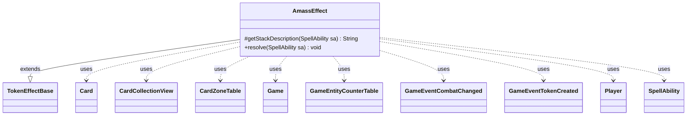

---
aliases:
  - AmassEffect
tags:
  - java/class
  - module/forge-game
  - pkg/forge/game/ability/effects
fqn: forge.game.ability.effects.AmassEffect
package: forge.game.ability.effects
module: forge-game
kind: Class
---

# AmassEffect

**Package:** `forge.game.ability.effects`   **Module:** `forge-game`   **Kind:** Class



## Relationships
**Extends:**
- [[forge.game.ability.effects.TokenEffectBase|TokenEffectBase]]
**Uses:**
- [[forge.game.Game|Game]]
- [[forge.game.GameEntityCounterTable|GameEntityCounterTable]]
- [[forge.game.card.Card|Card]]
- [[forge.game.card.CardCollectionView|CardCollectionView]]
- [[forge.game.card.CardZoneTable|CardZoneTable]]
- [[forge.game.event.GameEventCombatChanged|GameEventCombatChanged]]
- [[forge.game.event.GameEventTokenCreated|GameEventTokenCreated]]
- [[forge.game.player.Player|Player]]
- [[forge.game.spellability.SpellAbility|SpellAbility]]


## Design Description

AmassEffect is a resolvable spell-ability effect implementing Magic: The Gathering's "Amass" keyword action. Extending TokenEffectBase, it inherits token-construction helpers and overrides only `getStackDescription` to render reminder text and `resolve` to apply the effect against game state. On resolution it ensures the activating Player controls an "Army": if none exists, it builds a 0/0 black Army token of the parameterized subtype via the inherited token machinery, batching zone changes through CardZoneTable and firing GameEventTokenCreated/GameEventCombatChanged on the Game. It then lets the controller choose an Army and adds the requested +1/+1 counters through a GameEntityCounterTable.

The design is data-driven, reading `Num`, `Type`, and `RememberAmass` from the SpellAbility. Notably, when the chosen Army lacks the granted creature type, it attaches a continuous command-zone static ability adding the subtype and self-exiling when the Army leaves play—cleanly modeling the type-granting rule through Forge's static-ability system rather than ad-hoc mutation.

## Source
`forge-game/src/main/java/forge/game/ability/effects/AmassEffect.java`

```java
package forge.game.ability.effects;

import java.util.Map;

import org.apache.commons.lang3.mutable.MutableBoolean;

import com.google.common.collect.Lists;
import com.google.common.collect.Maps;

import forge.card.CardType;
import forge.game.Game;
import forge.game.GameEntityCounterTable;
import forge.game.ability.AbilityUtils;
import forge.game.card.Card;
import forge.game.card.CardCollectionView;
import forge.game.card.CardLists;
import forge.game.card.CardPredicates;
import forge.game.card.CardZoneTable;
import forge.game.card.CounterEnumType;
import forge.game.card.token.TokenInfo;
import forge.game.event.GameEventCombatChanged;
import forge.game.event.GameEventTokenCreated;
import forge.game.player.Player;
import forge.game.spellability.SpellAbility;
import forge.game.zone.ZoneType;
import forge.util.Lang;
import forge.util.Localizer;

public class AmassEffect extends TokenEffectBase {

    @Override
    protected String getStackDescription(SpellAbility sa) {
        final StringBuilder sb = new StringBuilder("Amass ");
        final Card card = sa.getHostCard();
        final int amount = AbilityUtils.calculateAmount(card, sa.getParamOrDefault("Num", "1"), sa);
        final String type = sa.getParam("Type");

        sb.append(CardType.getPluralType(type)).append(" ").append(amount).append(" (Put ");

        sb.append(Lang.nounWithNumeral(amount, "+1/+1 counter"));

        // TODO fix reminder after CR
        sb.append("on an Army you control. If you don't control one, create a 0/0 black " + type + " Army creature token first.)");

        return sb.toString();
    }

    @Override
    public void resolve(SpellAbility sa) {
        final Card source = sa.getHostCard();
        final Game game = source.getGame();
        final Player activator = sa.getActivatingPlayer();
        final int amount = AbilityUtils.calculateAmount(source, sa.getParamOrDefault("Num", "1"), sa);
        final String type = sa.getParam("Type");

        // create army token if needed
        if (!activator.getCardsIn(ZoneType.Battlefield).anyMatch(CardPredicates.isType("Army"))) {
            CardZoneTable triggerList = new CardZoneTable();
            MutableBoolean combatChanged = new MutableBoolean(false);

            StringBuilder sb = new StringBuilder("b_0_0_");
            sb.append(sa.getOriginalParam("Type").toLowerCase()).append("_army");

            final Card result = TokenInfo.getProtoType(sb.toString(), sa, activator, false);
            // need to alter the token to add the Type from the Parameter
            result.setCreatureTypes(Lists.newArrayList(type, "Army"));
            result.setName(type + " Army Token");
            result.setTokenSpawningAbility(sa);

            makeTokenTable(makeTokenTableInternal(activator, result, 1), false, triggerList, combatChanged, sa);

            triggerList.triggerChangesZoneAll(game, sa);

            game.fireEvent(new GameEventTokenCreated());

            if (combatChanged.isTrue()) {
                game.updateCombatForView();
                game.fireEvent(new GameEventCombatChanged());
            }
        }

        CardCollectionView tgtCards = CardLists.getType(activator.getCardsIn(ZoneType.Battlefield), "Army");
        if (tgtCards.isEmpty()) {
            return;
        }

        Map<String, Object> params = Maps.newHashMap();
        params.put("CounterType", CounterEnumType.P1P1);
        params.put("Amount", amount);
        Card tgt = activator.getController().chooseSingleEntityForEffect(tgtCards, sa, Localizer.getInstance().getMessage("lblChooseAnArmy"), false, params);

        if (sa.hasParam("RememberAmass")) {
            source.addRemembered(tgt);
        }

        GameEntityCounterTable table = new GameEntityCounterTable();
        tgt.addCounter(CounterEnumType.P1P1, amount, activator, table);
        table.replaceCounterEffect(game, sa);
        // 01.44a If it isn’t a [subtype], it becomes a [subtype] in addition to its other types.
        if (!tgt.getType().hasCreatureType(type)) {
            final Card eff = createEffect(sa, activator, "Amass Effect", source.getImageKey());
            eff.setRenderForUI(false);
            eff.addRemembered(tgt);

            String s = "Mode$ Continuous | Affected$ Card.IsRemembered | EffectZone$ Command | AddType$ " + type;
            eff.addStaticAbility(s);

            tgt.addLeavesPlayCommand(() -> game.getAction().exileEffect(eff));
            game.getAction().moveToCommand(eff, sa);
        }
    }

}
```
