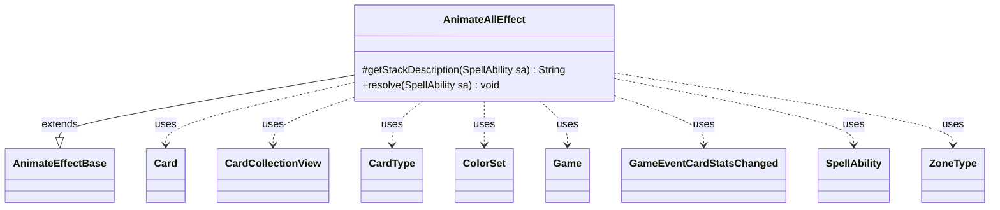

---
aliases:
  - AnimateAllEffect
tags:
  - java/class
  - module/forge-game
  - pkg/forge/game/ability/effects
fqn: forge.game.ability.effects.AnimateAllEffect
package: forge.game.ability.effects
module: forge-game
kind: Class
---

# AnimateAllEffect

**Package:** `forge.game.ability.effects` &nbsp; **Module:** `forge-game` &nbsp; **Kind:** Class



## Relationships
**Extends:**
- [[forge.game.ability.effects.AnimateEffectBase|AnimateEffectBase]]
**Uses:**
- [[forge.card.CardType|CardType]]
- [[forge.card.ColorSet|ColorSet]]
- [[forge.game.Game|Game]]
- [[forge.game.card.Card|Card]]
- [[forge.game.card.CardCollectionView|CardCollectionView]]
- [[forge.game.event.GameEventCardStatsChanged|GameEventCardStatsChanged]]
- [[forge.game.spellability.SpellAbility|SpellAbility]]
- [[forge.game.zone.ZoneType|ZoneType]]


## Design Description

AnimateAllEffect implements the resolution logic for mass-animation effects that transform every qualifying card into a creature at once—mass-animation spells affecting lands or other permanents. As a concrete subclass of AnimateEffectBase, it overrides `getStackDescription` for player-facing text and `resolve` to carry out the effect, delegating each card's transformation to the inherited `doAnimate` helper and reusing the base class's shared animation machinery.

Its `resolve` method parses the SpellAbility's parameters into a complete animation specification: power/toughness via AbilityUtils, added and removed CardTypes (with ChosenType override), keywords (allowing SVar substitution), ColorSet colors, plus abilities, triggers, replacements, static abilities, and sVars. It then collects the target CardCollectionView from the specified ZoneType (defaulting to the battlefield), filters by the ValidCards restriction, and animates each Card under one shared timestamp—ensuring the batch is treated as a single timestamped change—firing a GameEventCardStatsChanged per card so the UI reflects the updated stats.

## Source
`forge-game/src/main/java/forge/game/ability/effects/AnimateAllEffect.java`

```java
package forge.game.ability.effects;

import java.util.Arrays;
import java.util.List;
import java.util.Map;

import com.google.common.collect.Lists;
import com.google.common.collect.Maps;

import forge.card.CardType;
import forge.card.ColorSet;
import forge.game.Game;
import forge.game.ability.AbilityUtils;
import forge.game.card.Card;
import forge.game.card.CardCollectionView;
import forge.game.event.GameEventCardStatsChanged;
import forge.game.spellability.SpellAbility;
import forge.game.zone.ZoneType;

public class AnimateAllEffect extends AnimateEffectBase {

    @Override
    protected String getStackDescription(SpellAbility sa) {
        return sa.getParamOrDefault("SpellDescription", "Animate all valid cards.");
    }

    @Override
    public void resolve(final SpellAbility sa) {
        final Card host = sa.getHostCard();

        Integer power = null;
        if (sa.hasParam("Power")) {
            power = AbilityUtils.calculateAmount(host, sa.getParam("Power"), sa);
        }
        Integer toughness = null;
        if (sa.hasParam("Toughness")) {
            toughness = AbilityUtils.calculateAmount(host, sa.getParam("Toughness"), sa);
        }
        final Game game = host.getGame();

        // Every Animate event needs a unique time stamp
        final long timestamp = game.getNextTimestamp();

        final CardType types = new CardType(true);
        if (sa.hasParam("Types")) {
            types.addAll(Arrays.asList(sa.getParam("Types").split(",")));
        }

        final CardType removeTypes = new CardType(true);
        if (sa.hasParam("RemoveTypes")) {
            removeTypes.addAll(Arrays.asList(sa.getParam("RemoveTypes").split(",")));
        }

        // allow ChosenType - overrides anything else specified
        if (types.hasSubtype("ChosenType")) {
            types.clear();
            types.add(host.getChosenType());
        } else if (types.hasSubtype("ChosenType2")) {
            types.clear();
            types.add(host.getChosenType2());
        }

        final List<String> keywords = Lists.newArrayList();
        if (sa.hasParam("Keywords")) {
            keywords.addAll(Arrays.asList(sa.getParam("Keywords").split(" & ")));
        }

        final List<String> removeKeywords = Lists.newArrayList();
        if (sa.hasParam("RemoveKeywords")) {
            removeKeywords.addAll(Arrays.asList(sa.getParam("RemoveKeywords").split(" & ")));
        }

        final List<String> hiddenKeywords = Lists.newArrayList();
        if (sa.hasParam("HiddenKeywords")) {
            hiddenKeywords.addAll(Arrays.asList(sa.getParam("HiddenKeywords").split(" & ")));
        }
        // allow SVar substitution for keywords
        for (int i = 0; i < keywords.size(); i++) {
            final String k = keywords.get(i);
            if (host.hasSVar(k)) {
                keywords.add(host.getSVar(k));
                keywords.remove(k);
            }
        }

        // colors to be added or changed to
        ColorSet finalColors = null;
        if (sa.hasParam("Colors")) {
            final String colors = sa.getParam("Colors");
            if (colors.equals("ChosenColor")) {
                finalColors = ColorSet.fromNames(host.getChosenColors());
            } else {
                finalColors = ColorSet.fromNames(colors.split(","));
            }
        }

        // abilities to add to the animated being
        final List<String> abilities = Lists.newArrayList();
        if (sa.hasParam("Abilities")) {
            abilities.addAll(Arrays.asList(sa.getParam("Abilities").split(",")));
        }
        // replacement effects to add to the animated being
        final List<String> replacements = Lists.newArrayList();
        if (sa.hasParam("Replacements")) {
            replacements.addAll(Arrays.asList(sa.getParam("Replacements").split(",")));
        }
        // triggers to add to the animated being
        final List<String> triggers = Lists.newArrayList();
        if (sa.hasParam("Triggers")) {
            triggers.addAll(Arrays.asList(sa.getParam("Triggers").split(",")));
        }

        // sVars to add to the animated being
        final List<String> sVars = Lists.newArrayList();
        if (sa.hasParam("sVars")) {
            sVars.addAll(Arrays.asList(sa.getParam("sVars").split(",")));
        }

        // static abilities to add to the animated being
        final List<String> stAbs = Lists.newArrayList();
        if (sa.hasParam("staticAbilities")) {
            stAbs.addAll(Arrays.asList(sa.getParam("staticAbilities").split(",")));
        }

        Map<String, String> sVarsMap = Maps.newHashMap();
        for (final String s : sVars) {
            sVarsMap.put(s, AbilityUtils.getSVar(sa, s));
        }

        final String valid = sa.getParamOrDefault("ValidCards", "");

        CardCollectionView list;

        List<ZoneType> z = sa.hasParam("Zone") ? ZoneType.listValueOf(sa.getParam("Zone")) : 
            ZoneType.listValueOf("Battlefield");

        if (sa.usesTargeting() || sa.hasParam("Defined")) {
            list = getTargetPlayers(sa).getCardsIn(z);
        } else {
            list = game.getCardsIn(z);
        }

        list = AbilityUtils.filterListByType(list, valid, sa);

        for (final Card c : list) {
            doAnimate(c, sa, power, toughness, types, removeTypes, finalColors, keywords, removeKeywords,
                    hiddenKeywords, abilities, triggers, replacements, stAbs, timestamp, sa.getParam("Duration"));

            // give sVars
            if (!sVarsMap.isEmpty() ) {
                c.addChangedSVars(sVarsMap, timestamp, 0);
            }

            game.fireEvent(new GameEventCardStatsChanged(c));
        }
    }

}
```
