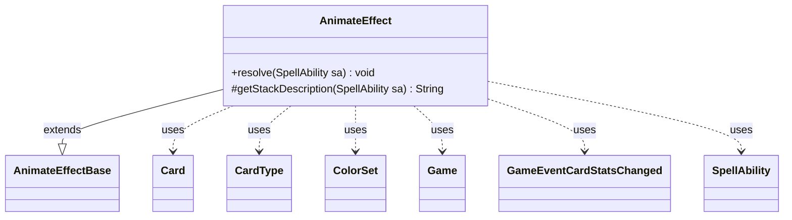

---
aliases:
  - AnimateEffect
tags:
  - java/class
  - module/forge-game
  - pkg/forge/game/ability/effects
fqn: forge.game.ability.effects.AnimateEffect
package: forge.game.ability.effects
module: forge-game
kind: Class
---

# AnimateEffect

**Package:** `forge.game.ability.effects`   **Module:** `forge-game`   **Kind:** Class



## Relationships
**Extends:**
- [[forge.game.ability.effects.AnimateEffectBase|AnimateEffectBase]]
**Uses:**
- [[forge.card.CardType|CardType]]
- [[forge.card.ColorSet|ColorSet]]
- [[forge.game.Game|Game]]
- [[forge.game.card.Card|Card]]
- [[forge.game.event.GameEventCardStatsChanged|GameEventCardStatsChanged]]
- [[forge.game.spellability.SpellAbility|SpellAbility]]


## Design Description

AnimateEffect is a concrete spell-resolution effect implementing Magic's "animate" mechanic—turning permanents into creatures or otherwise overriding their characteristics. Extending `AnimateEffectBase`, its `resolve(SpellAbility)` parses the ability's named script parameters (power/toughness, added/removed types, colors, keywords, granted abilities, triggers, replacements, static abilities, and sVars) and delegates the mutation to the inherited `doAnimate` helper per valid target; it overrides `getStackDescription` to build a human-readable summary of the pending change.

The class is parameter-driven rather than card-specific, so one effect serves many cards. It allocates a unique `Game` timestamp per resolution for correct continuous-effect layering, revalidates each `Card` against current game state to skip phased-out or stale targets (CR 702.26e), and supports optional confirmation, remembered/imprinted objects, crew, and delayed end-of-turn triggers. It collaborates with `CardType`, `ColorSet`, and fires `GameEventCardStatsChanged` to refresh the UI.

## Source
`forge-game/src/main/java/forge/game/ability/effects/AnimateEffect.java`

```java
package forge.game.ability.effects;

import java.util.Arrays;
import java.util.List;
import java.util.Map;

import com.google.common.collect.Maps;
import com.google.common.collect.Lists;

import forge.card.CardType;
import forge.card.ColorSet;
import forge.game.Game;
import forge.game.ability.AbilityUtils;
import forge.game.card.Card;
import forge.game.event.GameEventCardStatsChanged;
import forge.game.spellability.SpellAbility;
import forge.util.Lang;
import forge.util.TextUtil;


public class AnimateEffect extends AnimateEffectBase {

    /* (non-Javadoc)
     * @see forge.card.abilityfactory.SpellEffect#resolve(java.util.Map, forge.card.spellability.SpellAbility)
     */
    @Override
    public void resolve(final SpellAbility sa) {
        final Card source = sa.getHostCard();
        String duration = sa.getParam("Duration");

        String animateRemembered = null;
        String animateImprinted = null;

        if (!checkValidDuration(duration, sa)) {
            return;
        }

        // Remember Objects
        if (sa.hasParam("RememberObjects")) {
            animateRemembered = sa.getParam("RememberObjects");
        }
        // Imprint Cards
        if (sa.hasParam("ImprintCards")) {
            animateImprinted = sa.getParam("ImprintCards");
        }

        // AF specific sa
        Integer power = null;
        if (sa.hasParam("Power")) {
            power = AbilityUtils.calculateAmount(source, sa.getParam("Power"), sa);
        }
        Integer toughness = null;
        if (sa.hasParam("Toughness")) {
            toughness = AbilityUtils.calculateAmount(source, sa.getParam("Toughness"), sa);
        }

        final Game game = sa.getActivatingPlayer().getGame();
        // Every Animate event needs a unique time stamp
        final long timestamp = game.getNextTimestamp();

        final CardType types = new CardType(true);
        if (sa.hasParam("Types")) {
            types.addAll(Arrays.asList(sa.getParam("Types").split(",")));
        }

        final CardType removeTypes = new CardType(true);
        if (sa.hasParam("RemoveTypes")) {
            removeTypes.addAll(Arrays.asList(sa.getParam("RemoveTypes").split(",")));
        }

        // allow ChosenType - overrides anything else specified
        if (types.hasSubtype("ChosenType")) {
            types.clear();
            types.add(source.getChosenType());
        } else if (types.hasSubtype("ChosenType2")) {
            types.clear();
            types.add(source.getChosenType2());
        }

        final List<String> keywords = Lists.newArrayList();
        if (sa.hasParam("Keywords")) {
            keywords.addAll(Arrays.asList(sa.getParam("Keywords").split(" & ")));
        }

        final List<String> removeKeywords = Lists.newArrayList();
        if (sa.hasParam("RemoveKeywords")) {
            removeKeywords.addAll(Arrays.asList(sa.getParam("RemoveKeywords").split(" & ")));
        }

        final List<String> hiddenKeywords = Lists.newArrayList();
        if (sa.hasParam("HiddenKeywords")) {
            hiddenKeywords.addAll(Arrays.asList(sa.getParam("HiddenKeywords").split(" & ")));
        }
        // allow SVar substitution for keywords
        for (int i = 0; i < keywords.size(); i++) {
            final String k = keywords.get(i);
            if (source.hasSVar(k)) {
                keywords.add(source.getSVar(k));
                keywords.remove(k);
            }
        }

        // colors to be added or changed to
        ColorSet finalColors = null;
        if (sa.hasParam("Colors")) {
            final String colors = sa.getParam("Colors");
            if (colors.equals("ChosenColor")) {
                finalColors = ColorSet.fromNames(source.getChosenColors());
            } else if (colors.equals("All")) {
                finalColors = ColorSet.WUBRG;
            } else {
                finalColors = ColorSet.fromNames(colors.split(","));
            }
        }

        // abilities to add to the animated being
        final List<String> abilities = Lists.newArrayList();
        if (sa.hasParam("Abilities")) {
            abilities.addAll(Arrays.asList(sa.getParam("Abilities").split(",")));
        }

        // replacement effects to add to the animated being
        final List<String> replacements = Lists.newArrayList();
        if (sa.hasParam("Replacements")) {
            replacements.addAll(Arrays.asList(sa.getParam("Replacements").split(",")));
        }

        // triggers to add to the animated being
        final List<String> triggers = Lists.newArrayList();
        if (sa.hasParam("Triggers")) {
            triggers.addAll(Arrays.asList(sa.getParam("Triggers").split(",")));
        }

        // static abilities to add to the animated being
        final List<String> stAbs = Lists.newArrayList();
        if (sa.hasParam("staticAbilities")) {
            stAbs.addAll(Arrays.asList(sa.getParam("staticAbilities").split(",")));
        }

        // sVars to add to the animated being
        Map<String, String> sVarsMap = Maps.newHashMap();
        if (sa.hasParam("sVars")) {
            for (final String s : sa.getParam("sVars").split(",")) {
                String actualsVar = AbilityUtils.getSVar(sa, s);
                String name = s;
                if (actualsVar.startsWith("SVar:")) {
                    actualsVar = actualsVar.split("SVar:")[1];
                    name = actualsVar.split(":")[0];
                    actualsVar = actualsVar.split(":")[1];
                }
                sVarsMap.put(name, actualsVar);
            }
        }

        List<Card> tgts = getCardsfromTargets(sa);

        if (sa.hasParam("Optional")) {
            final String targets = Lang.joinHomogenous(tgts);
            final String message = sa.hasParam("OptionQuestion")
                    ? TextUtil.fastReplace(sa.getParam("OptionQuestion"), "TARGETS", targets)
                    : getStackDescription(sa);

            if (!sa.getActivatingPlayer().getController().confirmAction(sa, null, message, null)) {
                return;
            }
        }

        for (final Card tgtC : tgts) {
            // CR 702.26e
            if (tgtC.isPhasedOut()) {
                continue;
            }

            final Card gameCard = game.getCardState(tgtC, null);
            // gameCard is LKI in that case, the card is not in game anymore
            // or the timestamp did change
            // this should check Self too
            if (gameCard == null || !tgtC.equalsWithGameTimestamp(gameCard) || gameCard.isPhasedOut()) {
                continue;
            }

            doAnimate(gameCard, sa, power, toughness, types, removeTypes, finalColors,
                    keywords, removeKeywords, hiddenKeywords,
                    abilities, triggers, replacements, stAbs, timestamp, duration);

            if (sa.hasParam("Name")) {
                gameCard.addChangedName(sa.getParam("Name"), false, timestamp, 0);
            }

            // give sVars
            if (!sVarsMap.isEmpty()) {
                gameCard.addChangedSVars(sVarsMap, timestamp, 0);
            }

            // give Remembered
            if (animateRemembered != null) {
                gameCard.addRemembered(AbilityUtils.getDefinedObjects(source, animateRemembered, sa));
            }

            // give Imprinted
            if (animateImprinted != null) {
                gameCard.addImprintedCards(AbilityUtils.getDefinedCards(source, animateImprinted, sa));
            }

            if (sa.isCrew()) {
                gameCard.becomesCrewed(sa);
            }

            game.fireEvent(new GameEventCardStatsChanged(gameCard));
        }

        if (sa.hasParam("AtEOT") && !tgts.isEmpty()) {
            registerDelayedTrigger(sa, sa.getParam("AtEOT"), tgts);
        }
    }

    /* (non-Javadoc)
     * @see forge.card.abilityfactory.SpellEffect#getStackDescription(java.util.Map, forge.card.spellability.SpellAbility)
     */
    @Override
    protected String getStackDescription(SpellAbility sa) {
        final Card host = sa.getHostCard();
        final StringBuilder sb = new StringBuilder();
        final List<Card> tgts = getDefinedCardsOrTargeted(sa);
        //possible to be building stack desc before Defined is populated... for now, 0 will default to singular
        final boolean justOne = tgts.size() <= 1;

        if (sa.hasParam("IfDesc")) {
            if (sa.getParam("IfDesc").equals("True") && sa.hasParam("SpellDescription")) {
                String ifDesc = sa.getParam("SpellDescription");
                sb.append(ifDesc, 0, ifDesc.indexOf(",") + 1);
            } else {
                tokenizeString(sa, sb, sa.getParam("IfDesc"));
            }
            sb.append(" ");
        }

        sb.append(sa.hasParam("DefinedDesc") ? sa.getParam("DefinedDesc") : Lang.joinHomogenous(tgts));
        sb.append(" ");
        int initial = sb.length();
        boolean becomes = false;

        Integer power = null;
        if (sa.hasParam("Power")) {
            power = AbilityUtils.calculateAmount(host, sa.getParam("Power"), sa);
        }
        Integer toughness = null;
        if (sa.hasParam("Toughness")) {
            toughness = AbilityUtils.calculateAmount(host, sa.getParam("Toughness"), sa);
        }

        final boolean permanent = "Permanent".equals(sa.getParam("Duration"));
        final List<String> types = Lists.newArrayList();
        if (sa.hasParam("Types")) {
            types.addAll(Arrays.asList(sa.getParam("Types").split(",")));
            becomes = true;
        }
        final List<String> keywords = Lists.newArrayList();
        if (sa.hasParam("Keywords")) {
            keywords.addAll(Arrays.asList(sa.getParam("Keywords").split(" & ")));
        }
        // allow SVar substitution for keywords
        for (int i = 0; i < keywords.size(); i++) {
            final String k = keywords.get(i);
            if (sa.hasSVar(k)) {
                keywords.add("\"" + k + "\"");
                keywords.remove(k);
            }
        }
        final List<String> colors =Lists.newArrayList();
        if (sa.hasParam("Colors")) {
            colors.addAll(Arrays.asList(sa.getParam("Colors").split(",")));
            becomes = true;
        }

        // if power is -1, we'll assume it's not just setting toughness
        if (power != null || toughness != null) {
            sb.append(justOne ? "has" : "have" ).append(" base ");
            if (power != null && toughness != null) {
                sb.append("power and toughness ").append(power).append("/").append(toughness).append(" ");
            } else if (power != null) {
                sb.append("power ").append(power).append(" ");
            } else {
                sb.append("toughness ").append(toughness).append(" ");
            }
        }
        if (sb.length() > initial && becomes) sb.append(" and ");
        if (becomes) sb.append(justOne ? "becomes " : "become ");

        if (colors.contains("ChosenColor")) {
            sb.append("color of that player's choice");
        } else {
            for (int i = 0; i < colors.size(); i++) {
                sb.append(colors.get(i).toLowerCase()).append(" ");
                if (i < (colors.size() - 1)) {
                    sb.append("and ");
                }
            }
        }

        if (types.contains("ChosenType")) {
            sb.append("type of player's choice ");
        } else {
            for (int i = 0; i < types.size(); i++) {
                String type = types.get(i);
                if (i == 0 && justOne) {
                    sb.append(Lang.startsWithVowel(type) ? "an " : "a ");
                }
                sb.append(CardType.CoreType.isValidEnum(type) ? type.toLowerCase() : type).append(" ");
            }
        }
        if (keywords.size() > 0) {
            sb.append(sb.length() > initial ? "and " : "").append(" gains ");
            sb.append(Lang.joinHomogenous(keywords).toLowerCase()).append(" ");
        }
        // sb.append(abilities)
        // sb.append(triggers)
        if (!permanent && sb.length() > initial) {
            final String duration = sa.getParam("Duration");
            if ("UntilEndOfCombat".equals(duration)) {
                sb.append("until end of combat");
            } else if ("UntilHostLeavesPlay".equals(duration)) {
                sb.append("until ").append(host).append(" leaves the battlefield");
            } else if ("UntilYourNextUpkeep".equals(duration)) {
                sb.append("until your next upkeep");
            } else if ("UntilYourNextTurn".equals(duration)) {
                sb.append("until your next turn");
            } else {
                sb.append("until end of turn");
            }
        }
        if (sa.hasParam("staticAbilities") && sa.getParam("staticAbilities").contains("MustAttack")) {
            sb.append(sb.length() > initial ? " and " : "");
            sb.append(justOne ? "attacks" : "attack").append(" this turn if able");
        }
        sb.append(".");

        if (sa.hasParam("AtEOT")) {
            sb.append(" ");
            final String eot = sa.getParam("AtEOT");
            final String pronoun = justOne ? "it" : "them";
            if (eot.equals("Hand")) {
                sb.append("Return ").append(pronoun).append(" to your hand");
            } else if (eot.equals("SacrificeCtrl")) {
                sb.append(justOne ? "Its controller sacrifices it" : "Their controllers sacrifice them");
            } else { //Sacrifice,Exile
                sb.append(eot).append(" ").append(pronoun);
            }
            sb.append(" at the beginning of the next end step.");
        }

        return sb.toString();
    }

}
```

## Python
`forge/game/ability/effects/AnimateEffect.py`

```python
from forge.game.ability.effects.AnimateEffectBase import AnimateEffectBase
from forge.card.CardType import CardType
from forge.card.ColorSet import ColorSet
from forge.game.Game import Game
from forge.game.ability.AbilityUtils import AbilityUtils
from forge.game.card.Card import Card
from forge.game.event.GameEventCardStatsChanged import GameEventCardStatsChanged
from forge.game.spellability.SpellAbility import SpellAbility
from forge.util.Lang import Lang
from forge.util.TextUtil import TextUtil


class AnimateEffect(AnimateEffectBase):

    # (non-Javadoc)
    # @see forge.card.abilityfactory.SpellEffect#resolve(java.util.Map, forge.card.spellability.SpellAbility)
    def resolve(self, sa: SpellAbility) -> None:
        source = sa.getHostCard()
        duration = sa.getParam("Duration")

        animateRemembered = None
        animateImprinted = None

        if not self.checkValidDuration(duration, sa):
            return

        # Remember Objects
        if sa.hasParam("RememberObjects"):
            animateRemembered = sa.getParam("RememberObjects")
        # Imprint Cards
        if sa.hasParam("ImprintCards"):
            animateImprinted = sa.getParam("ImprintCards")

        # AF specific sa
        power = None
        if sa.hasParam("Power"):
            power = AbilityUtils.calculateAmount(source, sa.getParam("Power"), sa)
        toughness = None
        if sa.hasParam("Toughness"):
            toughness = AbilityUtils.calculateAmount(source, sa.getParam("Toughness"), sa)

        game = sa.getActivatingPlayer().getGame()
        # Every Animate event needs a unique time stamp
        timestamp = game.getNextTimestamp()

        types = CardType(True)
        if sa.hasParam("Types"):
            types.addAll(sa.getParam("Types").split(","))

        removeTypes = CardType(True)
        if sa.hasParam("RemoveTypes"):
            removeTypes.addAll(sa.getParam("RemoveTypes").split(","))

        # allow ChosenType - overrides anything else specified
        if types.hasSubtype("ChosenType"):
            types.clear()
            types.add(source.getChosenType())
        elif types.hasSubtype("ChosenType2"):
            types.clear()
            types.add(source.getChosenType2())

        keywords = []
        if sa.hasParam("Keywords"):
            keywords.extend(sa.getParam("Keywords").split(" & "))

        removeKeywords = []
        if sa.hasParam("RemoveKeywords"):
            removeKeywords.extend(sa.getParam("RemoveKeywords").split(" & "))

        hiddenKeywords = []
        if sa.hasParam("HiddenKeywords"):
            hiddenKeywords.extend(sa.getParam("HiddenKeywords").split(" & "))
        # allow SVar substitution for keywords
        i = 0
        while i < len(keywords):
            k = keywords[i]
            if source.hasSVar(k):
                keywords.append(source.getSVar(k))
                keywords.remove(k)
            i += 1

        # colors to be added or changed to
        finalColors = None
        if sa.hasParam("Colors"):
            colors = sa.getParam("Colors")
            if colors == "ChosenColor":
                finalColors = ColorSet.fromNames(source.getChosenColors())
            elif colors == "All":
                finalColors = ColorSet.WUBRG
            else:
                finalColors = ColorSet.fromNames(colors.split(","))

        # abilities to add to the animated being
        abilities = []
        if sa.hasParam("Abilities"):
            abilities.extend(sa.getParam("Abilities").split(","))

        # replacement effects to add to the animated being
        replacements = []
        if sa.hasParam("Replacements"):
            replacements.extend(sa.getParam("Replacements").split(","))

        # triggers to add to the animated being
        triggers = []
        if sa.hasParam("Triggers"):
            triggers.extend(sa.getParam("Triggers").split(","))

        # static abilities to add to the animated being
        stAbs = []
        if sa.hasParam("staticAbilities"):
            stAbs.extend(sa.getParam("staticAbilities").split(","))

        # sVars to add to the animated being
        sVarsMap: dict[str, str] = {}
        if sa.hasParam("sVars"):
            for s in sa.getParam("sVars").split(","):
                actualsVar = AbilityUtils.getSVar(sa, s)
                name = s
                if actualsVar.startswith("SVar:"):
                    actualsVar = actualsVar.split("SVar:")[1]
                    name = actualsVar.split(":")[0]
                    actualsVar = actualsVar.split(":")[1]
                sVarsMap[name] = actualsVar

        tgts = self.getCardsfromTargets(sa)

        if sa.hasParam("Optional"):
            targets = Lang.joinHomogenous(tgts)
            message = (TextUtil.fastReplace(sa.getParam("OptionQuestion"), "TARGETS", targets)
                       if sa.hasParam("OptionQuestion")
                       else self.getStackDescription(sa))

            if not sa.getActivatingPlayer().getController().confirmAction(sa, None, message, None):
                return

        for tgtC in tgts:
            # CR 702.26e
            if tgtC.isPhasedOut():
                continue

            gameCard = game.getCardState(tgtC, None)
            # gameCard is LKI in that case, the card is not in game anymore
            # or the timestamp did change
            # this should check Self too
            if gameCard is None or not tgtC.equalsWithGameTimestamp(gameCard) or gameCard.isPhasedOut():
                continue

            self.doAnimate(gameCard, sa, power, toughness, types, removeTypes, finalColors,
                           keywords, removeKeywords, hiddenKeywords,
                           abilities, triggers, replacements, stAbs, timestamp, duration)

            if sa.hasParam("Name"):
                gameCard.addChangedName(sa.getParam("Name"), False, timestamp, 0)

            # give sVars
            if sVarsMap:
                gameCard.addChangedSVars(sVarsMap, timestamp, 0)

            # give Remembered
            if animateRemembered is not None:
                gameCard.addRemembered(AbilityUtils.getDefinedObjects(source, animateRemembered, sa))

            # give Imprinted
            if animateImprinted is not None:
                gameCard.addImprintedCards(AbilityUtils.getDefinedCards(source, animateImprinted, sa))

            if sa.isCrew():
                gameCard.becomesCrewed(sa)

            game.fireEvent(GameEventCardStatsChanged(gameCard))

        if sa.hasParam("AtEOT") and tgts:
            self.registerDelayedTrigger(sa, sa.getParam("AtEOT"), tgts)

    # (non-Javadoc)
    # @see forge.card.abilityfactory.SpellEffect#getStackDescription(java.util.Map, forge.card.spellability.SpellAbility)
    def getStackDescription(self, sa: SpellAbility) -> str:
        host = sa.getHostCard()
        sb = []
        tgts = self.getDefinedCardsOrTargeted(sa)
        # possible to be building stack desc before Defined is populated... for now, 0 will default to singular
        justOne = len(tgts) <= 1

        if sa.hasParam("IfDesc"):
            if sa.getParam("IfDesc") == "True" and sa.hasParam("SpellDescription"):
                ifDesc = sa.getParam("SpellDescription")
                sb.append(ifDesc[0:ifDesc.find(",") + 1])
            else:
                self.tokenizeString(sa, sb, sa.getParam("IfDesc"))
            sb.append(" ")

        sb.append(sa.getParam("DefinedDesc") if sa.hasParam("DefinedDesc") else Lang.joinHomogenous(tgts))
        sb.append(" ")
        initial = len("".join(sb))
        becomes = False

        power = None
        if sa.hasParam("Power"):
            power = AbilityUtils.calculateAmount(host, sa.getParam("Power"), sa)
        toughness = None
        if sa.hasParam("Toughness"):
            toughness = AbilityUtils.calculateAmount(host, sa.getParam("Toughness"), sa)

        permanent = "Permanent" == sa.getParam("Duration")
        types = []
        if sa.hasParam("Types"):
            types.extend(sa.getParam("Types").split(","))
            becomes = True
        keywords = []
        if sa.hasParam("Keywords"):
            keywords.extend(sa.getParam("Keywords").split(" & "))
        # allow SVar substitution for keywords
        i = 0
        while i < len(keywords):
            k = keywords[i]
            if sa.hasSVar(k):
                keywords.append("\"" + k + "\"")
                keywords.remove(k)
            i += 1
        colors = []
        if sa.hasParam("Colors"):
            colors.extend(sa.getParam("Colors").split(","))
            becomes = True

        # if power is -1, we'll assume it's not just setting toughness
        if power is not None or toughness is not None:
            sb.append("has" if justOne else "have")
            sb.append(" base ")
            if power is not None and toughness is not None:
                sb.append("power and toughness ")
                sb.append(str(power))
                sb.append("/")
                sb.append(str(toughness))
                sb.append(" ")
            elif power is not None:
                sb.append("power ")
                sb.append(str(power))
                sb.append(" ")
            else:
                sb.append("toughness ")
                sb.append(str(toughness))
                sb.append(" ")
        if len("".join(sb)) > initial and becomes:
            sb.append(" and ")
        if becomes:
            sb.append("becomes " if justOne else "become ")

        if "ChosenColor" in colors:
            sb.append("color of that player's choice")
        else:
            for i in range(len(colors)):
                sb.append(colors[i].lower())
                sb.append(" ")
                if i < (len(colors) - 1):
                    sb.append("and ")

        if "ChosenType" in types:
            sb.append("type of player's choice ")
        else:
            for i in range(len(types)):
                type = types[i]
                if i == 0 and justOne:
                    sb.append("an " if Lang.startsWithVowel(type) else "a ")
                sb.append(type.lower() if CardType.CoreType.isValidEnum(type) else type)
                sb.append(" ")
        if len(keywords) > 0:
            sb.append("and " if len("".join(sb)) > initial else "")
            sb.append(" gains ")
            sb.append(Lang.joinHomogenous(keywords).lower())
            sb.append(" ")
        # sb.append(abilities)
        # sb.append(triggers)
        if not permanent and len("".join(sb)) > initial:
            duration = sa.getParam("Duration")
            if "UntilEndOfCombat" == duration:
                sb.append("until end of combat")
            elif "UntilHostLeavesPlay" == duration:
                sb.append("until ")
                sb.append(str(host))
                sb.append(" leaves the battlefield")
            elif "UntilYourNextUpkeep" == duration:
                sb.append("until your next upkeep")
            elif "UntilYourNextTurn" == duration:
                sb.append("until your next turn")
            else:
                sb.append("until end of turn")
        if sa.hasParam("staticAbilities") and "MustAttack" in sa.getParam("staticAbilities"):
            sb.append(" and " if len("".join(sb)) > initial else "")
            sb.append("attacks" if justOne else "attack")
            sb.append(" this turn if able")
        sb.append(".")

        if sa.hasParam("AtEOT"):
            sb.append(" ")
            eot = sa.getParam("AtEOT")
            pronoun = "it" if justOne else "them"
            if eot == "Hand":
                sb.append("Return ")
                sb.append(pronoun)
                sb.append(" to your hand")
            elif eot == "SacrificeCtrl":
                sb.append("Its controller sacrifices it" if justOne else "Their controllers sacrifice them")
            else:  # Sacrifice,Exile
                sb.append(eot)
                sb.append(" ")
                sb.append(pronoun)
            sb.append(" at the beginning of the next end step.")

        return "".join(sb)
```
