---
aliases:
  - AnimateEffectBase
tags:
  - java/class
  - module/forge-game
  - pkg/forge/game/ability/effects
fqn: forge.game.ability.effects.AnimateEffectBase
package: forge.game.ability.effects
module: forge-game
kind: Class
---

# AnimateEffectBase

**Package:** `forge.game.ability.effects`   **Module:** `forge-game`   **Kind:** Class



```mermaid
classDiagram
    class AnimateEffectBase {
        +doAnimate(Card c, SpellAbility sa, Integer power, Integer toughness, CardType addType, CardType removeType, ColorSet colors, List~String~ keywords, List~String~ removeKeywords, List~String~ hiddenKeywords, List~String~ abilities, List~String~ triggers, List~String~ replacements, List~String~ stAbs, long timestamp, String duration) void
        ~doUnanimate(Card c, long timestamp) void
    }
    AnimateEffectBase --|> SpellAbilityEffect : extends
    AnimateEffectBase ..> AbilityStatic : uses
    AnimateEffectBase ..> Card : uses
    AnimateEffectBase ..> CardTraitBase : uses
    AnimateEffectBase ..> CardTraitChanges : uses
    AnimateEffectBase ..> CardType : uses
    AnimateEffectBase ..> ColorSet : uses
    AnimateEffectBase ..> Game : uses
    AnimateEffectBase ..> GameCommand : uses
    AnimateEffectBase ..> GameEventCardStatsChanged : uses
    AnimateEffectBase ..> ICardTraitChanges : uses
    AnimateEffectBase ..> ManaCost : uses
    AnimateEffectBase ..> PerpetualAbilities : uses
    AnimateEffectBase ..> PerpetualColors : uses
    AnimateEffectBase ..> PerpetualIncorporate : uses
    AnimateEffectBase ..> PerpetualKeywords : uses
    AnimateEffectBase ..> PerpetualManaCost : uses
    AnimateEffectBase ..> PerpetualNewPT : uses
    AnimateEffectBase ..> PerpetualTypes : uses
    AnimateEffectBase ..> RemoveType : uses
    AnimateEffectBase ..> ReplacementEffect : uses
    AnimateEffectBase ..> SpellAbility : uses
    AnimateEffectBase ..> StaticAbility : uses
    AnimateEffectBase ..> Trigger : uses
```

## Relationships
**Extends:**
- [[forge.game.ability.SpellAbilityEffect|SpellAbilityEffect]]
**Uses:**
- [[forge.GameCommand|GameCommand]]
- [[forge.card.CardType|CardType]]
- [[forge.card.ColorSet|ColorSet]]
- [[forge.card.RemoveType|RemoveType]]
- [[forge.card.mana.ManaCost|ManaCost]]
- [[forge.game.CardTraitBase|CardTraitBase]]
- [[forge.game.Game|Game]]
- [[forge.game.card.Card|Card]]
- [[forge.game.card.CardTraitChanges|CardTraitChanges]]
- [[forge.game.card.ICardTraitChanges|ICardTraitChanges]]
- [[forge.game.card.perpetual.PerpetualAbilities|PerpetualAbilities]]
- [[forge.game.card.perpetual.PerpetualColors|PerpetualColors]]
- [[forge.game.card.perpetual.PerpetualIncorporate|PerpetualIncorporate]]
- [[forge.game.card.perpetual.PerpetualKeywords|PerpetualKeywords]]
- [[forge.game.card.perpetual.PerpetualManaCost|PerpetualManaCost]]
- [[forge.game.card.perpetual.PerpetualNewPT|PerpetualNewPT]]
- [[forge.game.card.perpetual.PerpetualTypes|PerpetualTypes]]
- [[forge.game.event.GameEventCardStatsChanged|GameEventCardStatsChanged]]
- [[forge.game.replacement.ReplacementEffect|ReplacementEffect]]
- [[forge.game.spellability.AbilityStatic|AbilityStatic]]
- [[forge.game.spellability.SpellAbility|SpellAbility]]
- [[forge.game.staticability.StaticAbility|StaticAbility]]
- [[forge.game.trigger.Trigger|Trigger]]


## Design Description

AnimateEffectBase is an abstract `SpellAbilityEffect` subclass that centralizes the shared logic for "animate" effects—those that mutate a `Card`'s defining characteristics such as power/toughness, types, colors, keywords, and granted abilities, triggers, replacement effects, and static abilities. Concrete effects (e.g. animating a land into a creature) inherit this base and drive it entirely through `SpellAbility` parameters plus a timestamp that scopes each change.

Its static `doAnimate` inspects the spell's parameters to decide which characteristic-defining changes to apply, distinguishing ordinary timestamped changes from `"Perpetual"` ones persisted via the `Perpetual*` change objects. It assembles a single `GameCommand` that reverses every modification through `doUnanimate`, then registers that command as an until-, faceup-, or revert-cost-triggered cleanup so the effect's stated duration is honored. This timestamp-keyed apply/revert pairing, alongside optional remembering and `GameEventCardStatsChanged` firing, reflects a deliberate design for layered, cleanly reversible card-state modification.

## Source
`forge-game/src/main/java/forge/game/ability/effects/AnimateEffectBase.java`

```java
/*
 * Forge: Play Magic: the Gathering.
 * Copyright (C) 2011  Forge Team
 *
 * This program is free software: you can redistribute it and/or modify
 * it under the terms of the GNU General Public License as published by
 * the Free Software Foundation, either version 3 of the License, or
 * (at your option) any later version.
 *
 * This program is distributed in the hope that it will be useful,
 * but WITHOUT ANY WARRANTY; without even the implied warranty of
 * MERCHANTABILITY or FITNESS FOR A PARTICULAR PURPOSE.  See the
 * GNU General Public License for more details.
 *
 * You should have received a copy of the GNU General Public License
 * along with this program.  If not, see <http://www.gnu.org/licenses/>.
 */
package forge.game.ability.effects;

import com.google.common.collect.Lists;
import forge.GameCommand;
import forge.card.CardType;
import forge.card.ColorSet;
import forge.card.RemoveType;
import forge.card.mana.ManaCost;
import forge.game.CardTraitBase;
import forge.game.Game;
import forge.game.ability.AbilityFactory;
import forge.game.ability.AbilityUtils;
import forge.game.ability.SpellAbilityEffect;
import forge.game.card.Card;
import forge.game.card.CardTraitChanges;
import forge.game.card.ICardTraitChanges;
import forge.game.card.perpetual.*;
import forge.game.event.GameEventCardStatsChanged;
import forge.game.keyword.Keyword;
import forge.game.replacement.ReplacementEffect;
import forge.game.replacement.ReplacementHandler;
import forge.game.spellability.AbilityStatic;
import forge.game.spellability.SpellAbility;
import forge.game.staticability.StaticAbility;
import forge.game.trigger.Trigger;
import forge.game.trigger.TriggerHandler;

import java.util.EnumSet;
import java.util.List;
import java.util.Set;
import java.util.function.Predicate;

public abstract class AnimateEffectBase extends SpellAbilityEffect {
    public static void doAnimate(final Card c, final SpellAbility sa, final Integer power, final Integer toughness,
            final CardType addType, final CardType removeType, final ColorSet colors,
            final List<String> keywords, final List<String> removeKeywords, final List<String> hiddenKeywords,
            List<String> abilities, final List<String> triggers, final List<String> replacements, final List<String> stAbs,
            final long timestamp, final String duration) {
        final Card source = sa.getHostCard();
        final Game game = source.getGame();
        final boolean perpetual = "Perpetual".equals(duration);

        boolean addAllCreatureTypes = sa.hasParam("AddAllCreatureTypes");

        Set<RemoveType> remove = EnumSet.noneOf(RemoveType.class);
        if (sa.hasParam("RemoveSuperTypes"))
            remove.add(RemoveType.SuperTypes);
        if (sa.hasParam("RemoveCardTypes"))
            remove.add(RemoveType.CardTypes);
        if (sa.hasParam("RemoveSubTypes"))
            remove.add(RemoveType.SubTypes);
        if (sa.hasParam("RemoveLandTypes"))
            remove.add(RemoveType.LandTypes);
        if (sa.hasParam("RemoveCreatureTypes"))
            remove.add(RemoveType.CreatureTypes);
        if (sa.hasParam("RemoveArtifactTypes"))
            remove.add(RemoveType.ArtifactTypes);
        if (sa.hasParam("RemoveEnchantmentTypes"))
            remove.add(RemoveType.EnchantmentTypes);

        Predicate<CardTraitBase> removeAbilities = null;
        boolean removeAllKeywords = false;
        if (sa.hasParam("RemoveAllAbilities")) {
            removeAbilities = e -> true;
            removeAllKeywords = true;
        } else if (sa.hasParam("RemoveNonManaAbilities")) {
            removeAbilities = Predicate.not(CardTraitBase::isManaAbility);
            removeAllKeywords = true;
        } else if (sa.hasParam("RemoveThisAbility")) {
            removeAbilities = e -> sa.getOriginalAbility().equals(e);
        }

        if (sa.hasParam("RememberAnimated")) {
            source.addRemembered(c);
        }

        final boolean wasCreature = c.isCreature();

        // Alchemy "incorporate" cost
        if (sa.hasParam("Incorporate")) {
            final ManaCost incMCost = new ManaCost(sa.getParam("Incorporate"));
            PerpetualIncorporate p = new PerpetualIncorporate(timestamp, incMCost);
            c.addPerpetual(p);
            p.applyEffect(c);
        }
        if (sa.hasParam("ManaCost")) {
            final ManaCost manaCost = new ManaCost(sa.getParam("ManaCost"));
            if (perpetual) {
                PerpetualManaCost p = new PerpetualManaCost(timestamp, manaCost);
                c.addPerpetual(p);
                p.applyEffect(c);
            }
        }
        
        if (!addType.isEmpty() || !removeType.isEmpty() || addAllCreatureTypes || !remove.isEmpty()) {
            if (perpetual) {
                c.addPerpetual(new PerpetualTypes(timestamp, addType, removeType, remove));
            }
            c.addChangedCardTypes(addType, removeType, addAllCreatureTypes, remove, timestamp, 0, true, false);
        }

        if (!keywords.isEmpty() || !removeKeywords.isEmpty() || removeAllKeywords) {
            if (perpetual) {
                c.addPerpetual(new PerpetualKeywords(timestamp, keywords, removeKeywords, removeAllKeywords));
            }
            c.addChangedCardKeywords(keywords, removeKeywords, removeAllKeywords, timestamp, null);
        }

        // do this after changing types in case it wasn't a creature before
        if (power != null || toughness != null) {
            if (perpetual) {
                c.addPerpetual(new PerpetualNewPT(timestamp, power, toughness));
            }
            c.addNewPT(power, toughness, timestamp, 0);
        } else if (!wasCreature && c.isCreature()) {
            c.updatePTforView();
        }

        if (sa.hasParam("CantHaveKeyword")) {
            c.addCantHaveKeyword(timestamp, Keyword.setValueOf(sa.getParam("CantHaveKeyword")));
        }

        if (!hiddenKeywords.isEmpty()) {
            c.addHiddenExtrinsicKeywords(timestamp, 0, hiddenKeywords);
        }

        if (colors != null) {
            final boolean overwrite = sa.hasParam("OverwriteColors");
            if (perpetual) {
                c.addPerpetual(new PerpetualColors(timestamp, colors, overwrite));
            }
            c.addColor(colors, !overwrite, timestamp, null);
        }

        if (sa.hasParam("LeaveBattlefield")) {
            addLeaveBattlefieldReplacement(c, sa, sa.getParam("LeaveBattlefield"));
        }

        // give abilities
        final List<SpellAbility> addedAbilities = Lists.newArrayList();
        for (final String s : abilities) {
            SpellAbility sSA = AbilityFactory.getAbility(c, s, sa);
            addedAbilities.add(sSA);

            if (sa.hasParam("TransferActivator")) {
                sSA.getRestrictions().setActivator("Player.PlayerUID_" + sa.getActivatingPlayer().getId());
            }
        }

        // Grant triggers
        final List<Trigger> addedTriggers = Lists.newArrayList();
        for (final String s : triggers) {
            addedTriggers.add(TriggerHandler.parseTrigger(AbilityUtils.getSVar(sa, s), c, false, sa));
        }

        // give replacement effects
        final List<ReplacementEffect> addedReplacements = Lists.newArrayList();
        for (final String s : replacements) {
            addedReplacements.add(ReplacementHandler.parseReplacement(AbilityUtils.getSVar(sa, s), c, false, sa));
        }

        // give static abilities (should only be used by cards to give
        // itself a static ability)
        final List<StaticAbility> addedStaticAbilities = Lists.newArrayList();
        for (final String s : stAbs) {
            addedStaticAbilities.add(StaticAbility.create(AbilityUtils.getSVar(sa, s), c, sa.getCardState(), false));
        }

        final GameCommand unanimate = new GameCommand() {
            private static final long serialVersionUID = -5861759814760561373L;

            @Override
            public void run() {
                doUnanimate(c, timestamp);

                c.removeChangedSVars(timestamp, 0);
                c.removeChangedName(timestamp, 0);
                c.updateStateForView();
                c.updatePTforView();

                game.fireEvent(new GameEventCardStatsChanged(c));
            }
        };

        if (sa.hasParam("RevertCost")) {
            final ManaCost cost = new ManaCost(sa.getParam("RevertCost"));
            final String desc = sa.getStackDescription();
            final SpellAbility revertSA = new AbilityStatic(c, cost) {
                @Override
                public void resolve() {
                    unanimate.run();
                }
                @Override
                public String getDescription() {
                    return cost + ": End Effect: " + desc;
                }
            };
            addedAbilities.add(revertSA);
        }

        // after unanimate to add RevertCost
        if (removeAbilities != null
                || !addedAbilities.isEmpty() || !addedTriggers.isEmpty()
                || !addedReplacements.isEmpty() || !addedStaticAbilities.isEmpty()) {
            ICardTraitChanges changes = c.addChangedCardTraits(addedAbilities, addedTriggers, addedReplacements,
                addedStaticAbilities, removeAbilities, timestamp, 0);
            if (perpetual) {
                c.addPerpetual(new PerpetualAbilities(timestamp, changes));
                if (changes instanceof CardTraitChanges ctc && ctc.containsCostChange()) {
                    c.calculatePerpetualAdjustedManaCost();
                }
            }
        }

        if (!"Permanent".equals(duration) && !perpetual) {
            if ("UntilAnimatedFaceup".equals(duration)) {
                c.addFaceupCommand(unanimate);
            } else {
                addUntilCommand(sa, unanimate);
            }
        }
    }

    /**
     * <p>
     * doUnanimate.
     * </p>
     *
     * @param c
     *            a {@link forge.game.card.Card} object.
     *            a {@link java.util.ArrayList} object.
     * @param colorDesc
     *            a {@link java.lang.String} object.
     * @param addedAbilities
     *            a {@link java.util.ArrayList} object.
     * @param addedTriggers
     *            a {@link java.util.ArrayList} object.
     * @param timestamp
     *            a long.
     */
    static void doUnanimate(final Card c, final long timestamp) {
        c.removeNewPT(timestamp, 0);

        c.removeChangedCardKeywords(timestamp, 0);

        c.removeChangedCardTypes(timestamp, 0);
        c.removeColor(timestamp, 0);

        c.removeChangedCardTraits(timestamp, 0);

        c.removeCantHaveKeyword(timestamp);

        c.removeHiddenExtrinsicKeywords(timestamp, 0);
    }
}
```

## Python
`forge/game/ability/effects/AnimateEffectBase.py`

```python
from forge.GameCommand import GameCommand
from forge.card.CardType import CardType
from forge.card.ColorSet import ColorSet
from forge.card.RemoveType import RemoveType
from forge.card.mana.ManaCost import ManaCost
from forge.game.CardTraitBase import CardTraitBase
from forge.game.Game import Game
from forge.game.ability.AbilityFactory import AbilityFactory
from forge.game.ability.AbilityUtils import AbilityUtils
from forge.game.ability.SpellAbilityEffect import SpellAbilityEffect
from forge.game.card.Card import Card
from forge.game.card.CardTraitChanges import CardTraitChanges
from forge.game.card.ICardTraitChanges import ICardTraitChanges
from forge.game.card.perpetual.PerpetualAbilities import PerpetualAbilities
from forge.game.card.perpetual.PerpetualColors import PerpetualColors
from forge.game.card.perpetual.PerpetualIncorporate import PerpetualIncorporate
from forge.game.card.perpetual.PerpetualKeywords import PerpetualKeywords
from forge.game.card.perpetual.PerpetualManaCost import PerpetualManaCost
from forge.game.card.perpetual.PerpetualNewPT import PerpetualNewPT
from forge.game.card.perpetual.PerpetualTypes import PerpetualTypes
from forge.game.event.GameEventCardStatsChanged import GameEventCardStatsChanged
from forge.game.keyword.Keyword import Keyword
from forge.game.replacement.ReplacementEffect import ReplacementEffect
from forge.game.replacement.ReplacementHandler import ReplacementHandler
from forge.game.spellability.AbilityStatic import AbilityStatic
from forge.game.spellability.SpellAbility import SpellAbility
from forge.game.staticability.StaticAbility import StaticAbility
from forge.game.trigger.Trigger import Trigger
from forge.game.trigger.TriggerHandler import TriggerHandler


class AnimateEffectBase(SpellAbilityEffect):
    @staticmethod
    def doAnimate(c: Card, sa: SpellAbility, power, toughness,
            addType: CardType, removeType: CardType, colors: ColorSet,
            keywords: list[str], removeKeywords: list[str], hiddenKeywords: list[str],
            abilities: list[str], triggers: list[str], replacements: list[str], stAbs: list[str],
            timestamp: int, duration: str) -> None:
        source = sa.getHostCard()
        game = source.getGame()
        perpetual = "Perpetual" == duration

        addAllCreatureTypes = sa.hasParam("AddAllCreatureTypes")

        remove = set()
        if sa.hasParam("RemoveSuperTypes"):
            remove.add(RemoveType.SuperTypes)
        if sa.hasParam("RemoveCardTypes"):
            remove.add(RemoveType.CardTypes)
        if sa.hasParam("RemoveSubTypes"):
            remove.add(RemoveType.SubTypes)
        if sa.hasParam("RemoveLandTypes"):
            remove.add(RemoveType.LandTypes)
        if sa.hasParam("RemoveCreatureTypes"):
            remove.add(RemoveType.CreatureTypes)
        if sa.hasParam("RemoveArtifactTypes"):
            remove.add(RemoveType.ArtifactTypes)
        if sa.hasParam("RemoveEnchantmentTypes"):
            remove.add(RemoveType.EnchantmentTypes)

        removeAbilities = None
        removeAllKeywords = False
        if sa.hasParam("RemoveAllAbilities"):
            removeAbilities = lambda e: True
            removeAllKeywords = True
        elif sa.hasParam("RemoveNonManaAbilities"):
            removeAbilities = lambda e: not e.isManaAbility()
            removeAllKeywords = True
        elif sa.hasParam("RemoveThisAbility"):
            removeAbilities = lambda e: sa.getOriginalAbility().equals(e)

        if sa.hasParam("RememberAnimated"):
            source.addRemembered(c)

        wasCreature = c.isCreature()

        # Alchemy "incorporate" cost
        if sa.hasParam("Incorporate"):
            incMCost = ManaCost(sa.getParam("Incorporate"))
            p = PerpetualIncorporate(timestamp, incMCost)
            c.addPerpetual(p)
            p.applyEffect(c)
        if sa.hasParam("ManaCost"):
            manaCost = ManaCost(sa.getParam("ManaCost"))
            if perpetual:
                p = PerpetualManaCost(timestamp, manaCost)
                c.addPerpetual(p)
                p.applyEffect(c)

        if not addType.isEmpty() or not removeType.isEmpty() or addAllCreatureTypes or len(remove) != 0:
            if perpetual:
                c.addPerpetual(PerpetualTypes(timestamp, addType, removeType, remove))
            c.addChangedCardTypes(addType, removeType, addAllCreatureTypes, remove, timestamp, 0, True, False)

        if len(keywords) != 0 or len(removeKeywords) != 0 or removeAllKeywords:
            if perpetual:
                c.addPerpetual(PerpetualKeywords(timestamp, keywords, removeKeywords, removeAllKeywords))
            c.addChangedCardKeywords(keywords, removeKeywords, removeAllKeywords, timestamp, None)

        # do this after changing types in case it wasn't a creature before
        if power is not None or toughness is not None:
            if perpetual:
                c.addPerpetual(PerpetualNewPT(timestamp, power, toughness))
            c.addNewPT(power, toughness, timestamp, 0)
        elif not wasCreature and c.isCreature():
            c.updatePTforView()

        if sa.hasParam("CantHaveKeyword"):
            c.addCantHaveKeyword(timestamp, Keyword.setValueOf(sa.getParam("CantHaveKeyword")))

        if len(hiddenKeywords) != 0:
            c.addHiddenExtrinsicKeywords(timestamp, 0, hiddenKeywords)

        if colors is not None:
            overwrite = sa.hasParam("OverwriteColors")
            if perpetual:
                c.addPerpetual(PerpetualColors(timestamp, colors, overwrite))
            c.addColor(colors, not overwrite, timestamp, None)

        if sa.hasParam("LeaveBattlefield"):
            AnimateEffectBase.addLeaveBattlefieldReplacement(c, sa, sa.getParam("LeaveBattlefield"))

        # give abilities
        addedAbilities = []
        for s in abilities:
            sSA = AbilityFactory.getAbility(c, s, sa)
            addedAbilities.append(sSA)

            if sa.hasParam("TransferActivator"):
                sSA.getRestrictions().setActivator("Player.PlayerUID_" + sa.getActivatingPlayer().getId())

        # Grant triggers
        addedTriggers = []
        for s in triggers:
            addedTriggers.append(TriggerHandler.parseTrigger(AbilityUtils.getSVar(sa, s), c, False, sa))

        # give replacement effects
        addedReplacements = []
        for s in replacements:
            addedReplacements.append(ReplacementHandler.parseReplacement(AbilityUtils.getSVar(sa, s), c, False, sa))

        # give static abilities (should only be used by cards to give
        # itself a static ability)
        addedStaticAbilities = []
        for s in stAbs:
            addedStaticAbilities.append(StaticAbility.create(AbilityUtils.getSVar(sa, s), c, sa.getCardState(), False))

        class _Unanimate(GameCommand):
            serialVersionUID = -5861759814760561373

            def run(self):
                AnimateEffectBase.doUnanimate(c, timestamp)

                c.removeChangedSVars(timestamp, 0)
                c.removeChangedName(timestamp, 0)
                c.updateStateForView()
                c.updatePTforView()

                game.fireEvent(GameEventCardStatsChanged(c))

        unanimate = _Unanimate()

        if sa.hasParam("RevertCost"):
            cost = ManaCost(sa.getParam("RevertCost"))
            desc = sa.getStackDescription()

            class _RevertSA(AbilityStatic):
                def resolve(self):
                    unanimate.run()

                def getDescription(self):
                    return str(cost) + ": End Effect: " + desc

            revertSA = _RevertSA(c, cost)
            addedAbilities.append(revertSA)

        # after unanimate to add RevertCost
        if (removeAbilities is not None
                or len(addedAbilities) != 0 or len(addedTriggers) != 0
                or len(addedReplacements) != 0 or len(addedStaticAbilities) != 0):
            changes = c.addChangedCardTraits(addedAbilities, addedTriggers, addedReplacements,
                addedStaticAbilities, removeAbilities, timestamp, 0)
            if perpetual:
                c.addPerpetual(PerpetualAbilities(timestamp, changes))
                if isinstance(changes, CardTraitChanges) and changes.containsCostChange():
                    c.calculatePerpetualAdjustedManaCost()

        if "Permanent" != duration and not perpetual:
            if "UntilAnimatedFaceup" == duration:
                c.addFaceupCommand(unanimate)
            else:
                AnimateEffectBase.addUntilCommand(sa, unanimate)

    @staticmethod
    def doUnanimate(c: Card, timestamp: int) -> None:
        c.removeNewPT(timestamp, 0)

        c.removeChangedCardKeywords(timestamp, 0)

        c.removeChangedCardTypes(timestamp, 0)
        c.removeColor(timestamp, 0)

        c.removeChangedCardTraits(timestamp, 0)

        c.removeCantHaveKeyword(timestamp)

        c.removeHiddenExtrinsicKeywords(timestamp, 0)
```
