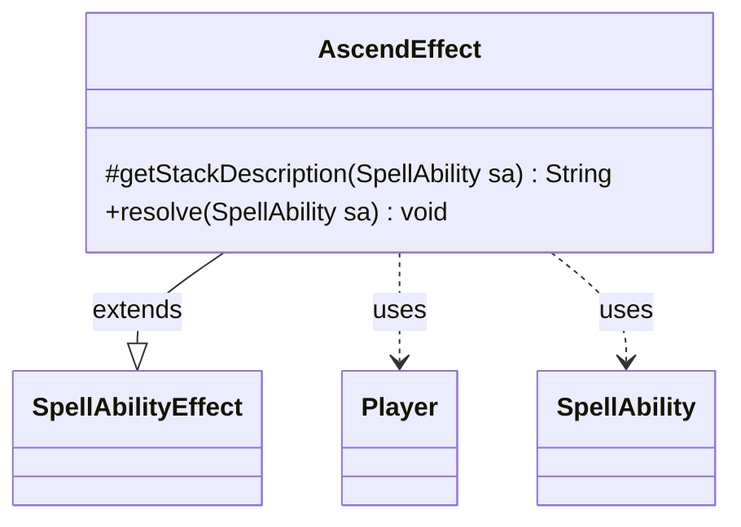

---
aliases:
  - AscendEffect
tags:
  - java/class
  - module/forge-game
  - pkg/forge/game/ability/effects
fqn: forge.game.ability.effects.AscendEffect
package: forge.game.ability.effects
module: forge-game
kind: Class
---

# AscendEffect

**Package:** `forge.game.ability.effects` &nbsp; **Module:** `forge-game` &nbsp; **Kind:** Class



## Relationships
**Extends:**
- [[forge.game.ability.SpellAbilityEffect|SpellAbilityEffect]]
**Uses:**
- [[forge.game.player.Player|Player]]
- [[forge.game.spellability.SpellAbility|SpellAbility]]


## Design Description

AscendEffect implements the resolution logic for Magic's "Ascend" keyword as it applies to instant and sorcery spells. As a concrete subclass of `SpellAbilityEffect`, it fulfills two inherited contract hooks: `getStackDescription`, which composes a readable stack line listing the affected players via `Lang.joinHomogenous` and pluralizing "ascend"/"ascends" by count, and `resolve`, which carries out the game effect. It derives its target `Player` list from the `SpellAbility` passed to each hook and queries each `Player` for battlefield state.

The core design intent appears in `resolve`: it iterates the target players, skips any no longer in the game, and grants the city's blessing through `setBlessing` only when a player controls ten or more battlefield permanents, tagging the blessing with the originating host card's set code. By delegating description and target resolution to inherited helpers, the class stays a focused, single-responsibility effect within the ability-effects framework.

## Source
`forge-game/src/main/java/forge/game/ability/effects/AscendEffect.java`

```java
package forge.game.ability.effects;

import java.util.List;

import forge.game.ability.SpellAbilityEffect;
import forge.game.player.Player;
import forge.game.spellability.SpellAbility;
import forge.game.zone.ZoneType;
import forge.util.Lang;

public class AscendEffect extends SpellAbilityEffect {

    /* (non-Javadoc)
     * @see forge.game.ability.SpellAbilityEffect#getStackDescription(forge.game.spellability.SpellAbility)
     */
    @Override
    protected String getStackDescription(SpellAbility sa) {
        final StringBuilder sb = new StringBuilder();

        List<Player> tgt = getTargetPlayers(sa);

        sb.append(Lang.joinHomogenous(tgt));
        sb.append(" ");
        sb.append(tgt.size() > 1 ? "ascend" : "ascends");
        sb.append(". ");

        return sb.toString();
    }

    /*
     * (non-Javadoc)
     * @see forge.game.ability.SpellAbilityEffect#resolve(forge.game.spellability.SpellAbility)
     */
    @Override
    public void resolve(SpellAbility sa) {
        for (Player p : getTargetPlayers(sa)) {
            if (!p.isInGame()) {
                continue;
            }
            // Player need 10+ permanents on the battlefield
            if (p.getZone(ZoneType.Battlefield).size() >= 10) {
                p.setBlessing(true, sa.getOriginalHost().getSetCode());
            }
        }
    }
}
```

## Python
`forge/game/ability/effects/AscendEffect.py`

```python
from typing import List

from forge.game.ability.SpellAbilityEffect import SpellAbilityEffect
from forge.game.player.Player import Player
from forge.game.spellability.SpellAbility import SpellAbility
from forge.game.zone.ZoneType import ZoneType
from forge.util.Lang import Lang


class AscendEffect(SpellAbilityEffect):

    # (non-Javadoc)
    # @see forge.game.ability.SpellAbilityEffect#getStackDescription(forge.game.spellability.SpellAbility)
    def getStackDescription(self, sa: SpellAbility) -> str:
        sb = []

        tgt: List[Player] = self.getTargetPlayers(sa)

        sb.append(Lang.joinHomogenous(tgt))
        sb.append(" ")
        sb.append("ascend" if len(tgt) > 1 else "ascends")
        sb.append(". ")

        return "".join(sb)

    # (non-Javadoc)
    # @see forge.game.ability.SpellAbilityEffect#resolve(forge.game.spellability.SpellAbility)
    def resolve(self, sa: SpellAbility) -> None:
        for p in self.getTargetPlayers(sa):
            if not p.isInGame():
                continue
            # Player need 10+ permanents on the battlefield
            if p.getZone(ZoneType.Battlefield).size() >= 10:
                p.setBlessing(True, sa.getOriginalHost().getSetCode())
```
