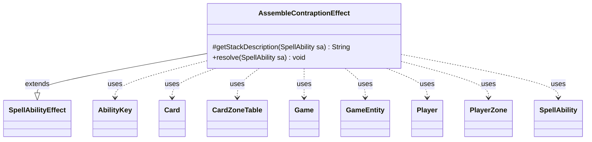

---
aliases:
  - AssembleContraptionEffect
tags:
  - java/class
  - module/forge-game
  - pkg/forge/game/ability/effects
fqn: forge.game.ability.effects.AssembleContraptionEffect
package: forge.game.ability.effects
module: forge-game
kind: Class
---

# AssembleContraptionEffect

**Package:** `forge.game.ability.effects`   **Module:** `forge-game`   **Kind:** Class



## Relationships
**Extends:**
- [[forge.game.ability.SpellAbilityEffect|SpellAbilityEffect]]
**Uses:**
- [[forge.game.Game|Game]]
- [[forge.game.GameEntity|GameEntity]]
- [[forge.game.ability.AbilityKey|AbilityKey]]
- [[forge.game.card.Card|Card]]
- [[forge.game.card.CardZoneTable|CardZoneTable]]
- [[forge.game.player.Player|Player]]
- [[forge.game.spellability.SpellAbility|SpellAbility]]
- [[forge.game.zone.PlayerZone|PlayerZone]]

## Design Description

AssembleContraptionEffect is a concrete `SpellAbilityEffect` subclass that implements Magic's "assemble a Contraption" mechanic within Forge's data-driven ability framework, where each effect keyword maps to one handler. It overrides `getStackDescription` to build human-readable stack text and `resolve` to mutate game state. Its responsibility is moving Contraption cards onto the battlefield and assigning each a sprocket. It resolves assemblers from the `DefinedAssembler` parameter (defaulting to "Self" for creatures, else "You") via `AbilityUtils`, coercing each `GameEntity` to a controlling `Player`. Two paths exist: a `DefinedContraption` mode that (re)assembles named cards—respecting `Reassemble` by forcing a different sprocket—and the default mode that pulls from each player's `ContraptionDeck` zone, honoring `AssembleContraption` replacement effects and an optional `Amount`. Zone moves are batched through a `CardZoneTable`, so one `triggerChangesZoneAll` call fires the appropriate triggers, reflecting Forge's centralized zone-change accounting.

## Source
`forge-game/src/main/java/forge/game/ability/effects/AssembleContraptionEffect.java`

```java
package forge.game.ability.effects;

import com.google.common.collect.Lists;
import forge.game.Game;
import forge.game.GameEntity;
import forge.game.ability.AbilityKey;
import forge.game.ability.AbilityUtils;
import forge.game.ability.SpellAbilityEffect;
import forge.game.card.Card;
import forge.game.card.CardZoneTable;
import forge.game.player.Player;
import forge.game.replacement.ReplacementResult;
import forge.game.replacement.ReplacementType;
import forge.game.spellability.SpellAbility;
import forge.game.zone.PlayerZone;
import forge.game.zone.ZoneType;
import forge.util.Lang;

import java.util.List;
import java.util.Map;

public class AssembleContraptionEffect extends SpellAbilityEffect {

    @Override
    protected String getStackDescription(SpellAbility sa) {
        final StringBuilder sb = new StringBuilder();
        Card host = sa.getHostCard();

        String defaultAssembler = host.isCreature() ? "Self" : "You";
        String definedAssembler = sa.getParamOrDefault("DefinedAssembler", defaultAssembler);
        List<GameEntity> assemblers = AbilityUtils.getDefinedEntities(host, definedAssembler, sa);

        if(assemblers.isEmpty())
            return "";

        sb.append(Lang.joinHomogenous(assemblers));

        String definedContraption = sa.getParam("DefinedContraption");

        List<Card> tgtCards = definedContraption == null ? null : AbilityUtils.getDefinedCards(host, definedContraption, sa);
        if(tgtCards != null) {
            sb.append(Lang.joinVerb(tgtCards, sa.hasParam("Reassemble") ? " reassemble" : " assemble")).append(" ");
            sb.append(Lang.joinHomogenous(tgtCards)).append(".");
            return sb.toString();
        }

        int amount;
        if (sa.hasParam("Amount")) {
            String amountText = sa.getParam("Amount");
            if(amountText.equals("Result")) {
                //Used for Hard-Hat Area; Shouldn't actually display, usually overridden by a parent ability's trigger
                //description, but gets evaluated regardless and calculateAmount complains since Result isn't defined.
                sb.append(" assembles a number of Contraptions equal to the result.");
                return sb.toString();
            }
            amount = AbilityUtils.calculateAmount(sa.getHostCard(), amountText, sa);
        }
        else
            amount = 1;

        if (assemblers.size() > 1) {
            sb.append(" each");
        }
        sb.append(Lang.joinVerb(assemblers, " assemble")).append(" ");
        sb.append(amount == 1 ? "a Contraption." : (Lang.getNumeral(amount) + " Contraptions."));
        return sb.toString();
    }

    @Override
    public void resolve(SpellAbility sa) {
        final Card source = sa.getHostCard();
        final Card host = sa.getHostCard();
        final Game game = host.getGame();

        String defaultAssembler = host.isCreature() ? "Self" : "You";
        String definedAssembler = sa.getParamOrDefault("DefinedAssembler", defaultAssembler);
        List<GameEntity> assemblers = AbilityUtils.getDefinedEntities(host, definedAssembler, sa);

        if(assemblers.isEmpty())
            return;

        Map<AbilityKey, Object> moveParams = AbilityKey.newMap();
        final CardZoneTable triggerList = AbilityKey.addCardZoneTableParams(moveParams, sa);

        String definedContraption = sa.getParam("DefinedContraption");
        if(definedContraption != null) {
            List<Card> tgtCards = AbilityUtils.getDefinedCards(host, definedContraption, sa);
            //Defined contraptions; (re)assemble them specifically.
            //This could be its own keyword, but it only shows up on two cards and works similarly.
            if (tgtCards.isEmpty())
                return;
            GameEntity assembler = assemblers.get(0);
            Player p = assembler instanceof Player ? (Player) assembler
                    : assembler instanceof Card ? ((Card) assembler).getController()
                    : null;
            if (p == null || !p.isInGame()) return;

            for (Card card : tgtCards) {
                boolean changedControllers = card.getController() != p;
                card.setController(p, game.getNextTimestamp());
                if (card.getZone().getZoneType() != ZoneType.Battlefield)
                    card.getGame().getAction().moveToPlay(card, sa, moveParams);

                if (sa.hasParam("Remember")) {
                    source.addRemembered(card);
                }

                if(changedControllers)
                    game.getAction().controllerChangeZoneCorrection(card);

                //Assign a sprocket. If reassembling, it needs to be a different sprocket than the current one.
                List<Integer> sprockets = Lists.newArrayList(1, 2, 3);
                if(sa.hasParam("Reassemble"))
                    sprockets.remove(Integer.valueOf(card.getSprocket()));
                int sprocket = card.getController().getController().chooseSprocket(card, sprockets);
                card.setSprocket(sprocket);
            }
            triggerList.triggerChangesZoneAll(sa.getHostCard().getGame(), sa);
            return;
        }

        int amount = sa.hasParam("Amount") ? AbilityUtils.calculateAmount(sa.getHostCard(), sa.getParam("Amount"), sa) : 1;

        for (GameEntity assembler : assemblers) {
            Player p = assembler instanceof Player ? (Player) assembler
                    : assembler instanceof Card ? ((Card) assembler).getController()
                    : null;
            if (p == null || !p.isInGame()) continue;
            // Replacement effects
            Map<AbilityKey, Object> replaceMap = AbilityKey.mapFromAffected(p);
            replaceMap.put(AbilityKey.Player, p);
            replaceMap.put(AbilityKey.Cause, assembler);
            final PlayerZone contraptionDeck = p.getZone(ZoneType.ContraptionDeck);
            for (int i = 0; i < amount; i++) {
                if (game.getReplacementHandler().run(ReplacementType.AssembleContraption, replaceMap) != ReplacementResult.NotReplaced) {
                    continue;
                }
                if(contraptionDeck.isEmpty())
                    continue;
                Card contraption = contraptionDeck.get(0);
                contraption = p.getGame().getAction().moveToPlay(contraption, sa, moveParams);
                int sprocket = contraption.getController().getController().chooseSprocket(contraption);
                contraption.setSprocket(sprocket);
                if (sa.hasParam("Remember")) {
                    source.addRemembered(contraption);
                }
            }
        }
        triggerList.triggerChangesZoneAll(sa.getHostCard().getGame(), sa);
    }
}
```

## Python
`forge/game/ability/effects/AssembleContraptionEffect.py`

```python
from forge.game.Game import Game
from forge.game.GameEntity import GameEntity
from forge.game.ability.AbilityKey import AbilityKey
from forge.game.ability.AbilityUtils import AbilityUtils
from forge.game.ability.SpellAbilityEffect import SpellAbilityEffect
from forge.game.card.Card import Card
from forge.game.card.CardZoneTable import CardZoneTable
from forge.game.player.Player import Player
from forge.game.replacement.ReplacementResult import ReplacementResult
from forge.game.replacement.ReplacementType import ReplacementType
from forge.game.spellability.SpellAbility import SpellAbility
from forge.game.zone.PlayerZone import PlayerZone
from forge.game.zone.ZoneType import ZoneType
from forge.util.Lang import Lang


class AssembleContraptionEffect(SpellAbilityEffect):

    def getStackDescription(self, sa: SpellAbility) -> str:
        sb = []
        host = sa.getHostCard()

        defaultAssembler = "Self" if host.isCreature() else "You"
        definedAssembler = sa.getParamOrDefault("DefinedAssembler", defaultAssembler)
        assemblers = AbilityUtils.getDefinedEntities(host, definedAssembler, sa)

        if not assemblers:
            return ""

        sb.append(Lang.joinHomogenous(assemblers))

        definedContraption = sa.getParam("DefinedContraption")

        tgtCards = None if definedContraption is None else AbilityUtils.getDefinedCards(host, definedContraption, sa)
        if tgtCards is not None:
            sb.append(Lang.joinVerb(tgtCards, " reassemble" if sa.hasParam("Reassemble") else " assemble"))
            sb.append(" ")
            sb.append(Lang.joinHomogenous(tgtCards))
            sb.append(".")
            return "".join(sb)

        if sa.hasParam("Amount"):
            amountText = sa.getParam("Amount")
            if amountText == "Result":
                # Used for Hard-Hat Area; Shouldn't actually display, usually overridden by a parent ability's trigger
                # description, but gets evaluated regardless and calculateAmount complains since Result isn't defined.
                sb.append(" assembles a number of Contraptions equal to the result.")
                return "".join(sb)
            amount = AbilityUtils.calculateAmount(sa.getHostCard(), amountText, sa)
        else:
            amount = 1

        if len(assemblers) > 1:
            sb.append(" each")
        sb.append(Lang.joinVerb(assemblers, " assemble"))
        sb.append(" ")
        sb.append("a Contraption." if amount == 1 else (Lang.getNumeral(amount) + " Contraptions."))
        return "".join(sb)

    def resolve(self, sa: SpellAbility) -> None:
        source = sa.getHostCard()
        host = sa.getHostCard()
        game = host.getGame()

        defaultAssembler = "Self" if host.isCreature() else "You"
        definedAssembler = sa.getParamOrDefault("DefinedAssembler", defaultAssembler)
        assemblers = AbilityUtils.getDefinedEntities(host, definedAssembler, sa)

        if not assemblers:
            return

        moveParams = AbilityKey.newMap()
        triggerList = AbilityKey.addCardZoneTableParams(moveParams, sa)

        definedContraption = sa.getParam("DefinedContraption")
        if definedContraption is not None:
            tgtCards = AbilityUtils.getDefinedCards(host, definedContraption, sa)
            # Defined contraptions; (re)assemble them specifically.
            # This could be its own keyword, but it only shows up on two cards and works similarly.
            if not tgtCards:
                return
            assembler = assemblers[0]
            p = assembler if isinstance(assembler, Player) \
                else assembler.getController() if isinstance(assembler, Card) \
                else None
            if p is None or not p.isInGame():
                return

            for card in tgtCards:
                changedControllers = card.getController() != p
                card.setController(p, game.getNextTimestamp())
                if card.getZone().getZoneType() != ZoneType.Battlefield:
                    card.getGame().getAction().moveToPlay(card, sa, moveParams)

                if sa.hasParam("Remember"):
                    source.addRemembered(card)

                if changedControllers:
                    game.getAction().controllerChangeZoneCorrection(card)

                # Assign a sprocket. If reassembling, it needs to be a different sprocket than the current one.
                sprockets = [1, 2, 3]
                if sa.hasParam("Reassemble"):
                    sprockets.remove(card.getSprocket())
                sprocket = card.getController().getController().chooseSprocket(card, sprockets)
                card.setSprocket(sprocket)
            triggerList.triggerChangesZoneAll(sa.getHostCard().getGame(), sa)
            return

        amount = AbilityUtils.calculateAmount(sa.getHostCard(), sa.getParam("Amount"), sa) if sa.hasParam("Amount") else 1

        for assembler in assemblers:
            p = assembler if isinstance(assembler, Player) \
                else assembler.getController() if isinstance(assembler, Card) \
                else None
            if p is None or not p.isInGame():
                continue
            # Replacement effects
            replaceMap = AbilityKey.mapFromAffected(p)
            replaceMap[AbilityKey.Player] = p
            replaceMap[AbilityKey.Cause] = assembler
            contraptionDeck = p.getZone(ZoneType.ContraptionDeck)
            for i in range(amount):
                if game.getReplacementHandler().run(ReplacementType.AssembleContraption, replaceMap) != ReplacementResult.NotReplaced:
                    continue
                if contraptionDeck.isEmpty():
                    continue
                contraption = contraptionDeck.get(0)
                contraption = p.getGame().getAction().moveToPlay(contraption, sa, moveParams)
                sprocket = contraption.getController().getController().chooseSprocket(contraption)
                contraption.setSprocket(sprocket)
                if sa.hasParam("Remember"):
                    source.addRemembered(contraption)
        triggerList.triggerChangesZoneAll(sa.getHostCard().getGame(), sa)
```
