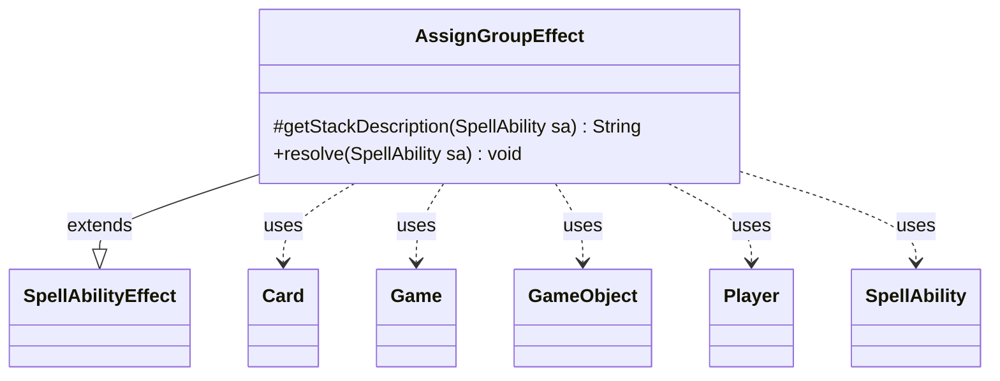

---
aliases:
  - AssignGroupEffect
tags:
  - java/class
  - module/forge-game
  - pkg/forge/game/ability/effects
fqn: forge.game.ability.effects.AssignGroupEffect
package: forge.game.ability.effects
module: forge-game
kind: Class
---

# AssignGroupEffect

**Package:** `forge.game.ability.effects` &nbsp; **Module:** `forge-game` &nbsp; **Kind:** Class



## Relationships
**Extends:**
- [[forge.game.ability.SpellAbilityEffect|SpellAbilityEffect]]
**Uses:**
- [[forge.game.Game|Game]]
- [[forge.game.GameObject|GameObject]]
- [[forge.game.card.Card|Card]]
- [[forge.game.player.Player|Player]]
- [[forge.game.spellability.SpellAbility|SpellAbility]]


## Design Description

The Design Description section is already present in the note. Here is the prose:

AssignGroupEffect implements the resolution logic for a "choose an ability per object" spell effect within Forge's ability framework. As a concrete `SpellAbilityEffect` subclass, it overrides `getStackDescription` to surface the spell's own description and `resolve` to perform the work: it gathers the defined or targeted `GameObject`s and the list of candidate `SpellAbility` choices, determines the chooser (the activating player, or a `Chooser`-specified `Player`), and for each object prompts that player to pick one ability, accumulating the assignments in a `Multimap`.

It then executes each chosen ability once, in choice-list order, temporarily marking the assigned objects as remembered on the host `Card` so the sub-ability can resolve against them via `AbilityUtils.resolve`. After every resolution it refreshes game state through the `Game`—rechecking static abilities and resetting triggers—so that continuous effects stay consistent as objects are grouped and processed.

## Source
`forge-game/src/main/java/forge/game/ability/effects/AssignGroupEffect.java`

```java
package forge.game.ability.effects;

import java.util.Collection;
import java.util.List;
import java.util.Map;

import com.google.common.collect.ArrayListMultimap;
import com.google.common.collect.Lists;
import com.google.common.collect.Maps;
import com.google.common.collect.Multimap;

import forge.game.Game;
import forge.game.GameObject;
import forge.game.ability.AbilityUtils;
import forge.game.ability.SpellAbilityEffect;
import forge.game.card.Card;
import forge.game.player.Player;
import forge.game.spellability.SpellAbility;
import forge.util.Localizer;

public class AssignGroupEffect extends SpellAbilityEffect {

    /* (non-Javadoc)
     * @see forge.game.ability.SpellAbilityEffect#getStackDescription(forge.game.spellability.SpellAbility)
     */
    @Override
    protected String getStackDescription(SpellAbility sa) {
        return sa.getDescription();
    }

    /*
     * (non-Javadoc)
     * @see forge.game.ability.SpellAbilityEffect#resolve(forge.game.spellability.SpellAbility)
     */
    @Override
    public void resolve(SpellAbility sa) {
        final Card host = sa.getHostCard();
        final Game game = host.getGame();

        List<GameObject> defined = getDefinedOrTargeted(sa, "Defined");

        final List<SpellAbility> abilities = Lists.newArrayList(sa.getAdditionalAbilityList("Choices"));

        Player chooser = sa.getActivatingPlayer();
        if (sa.hasParam("Chooser")) {
            final String choose = sa.getParam("Chooser");
            chooser = AbilityUtils.getDefinedPlayers(host, choose, sa).get(0);
        }

        Multimap<SpellAbility, GameObject> result = ArrayListMultimap.create();

        for (GameObject g : defined) {
            final String title = Localizer.getInstance().getMessage("lblChooseAbilityForObject", g.toString());
            Map<String, Object> params = Maps.newHashMap();
            params.put("Affected", g);

            result.put(chooser.getController().chooseSingleSpellForEffect(abilities, sa, title, params), g);
        }

        // in order of choice list
        for (SpellAbility s : abilities) {
            // is that in Player order?
            Collection<GameObject> l = result.get(s);

            // no player assigned for this choice
            if (l.isEmpty()) continue;

            host.addRemembered(l);
            AbilityUtils.resolve(s);
            host.removeRemembered(l);

            // this will refresh continuous abilities for players and permanents.
            game.getAction().checkStaticAbilities();
            game.getTriggerHandler().resetActiveTriggers();
        }
    }

}
```
