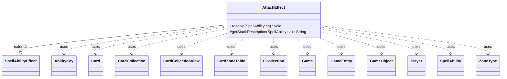

---
aliases:
  - AttachEffect
tags:
  - java/class
  - module/forge-game
  - pkg/forge/game/ability/effects
fqn: forge.game.ability.effects.AttachEffect
package: forge.game.ability.effects
module: forge-game
kind: Class
---

# AttachEffect

**Package:** `forge.game.ability.effects` &nbsp; **Module:** `forge-game` &nbsp; **Kind:** Class



## Relationships
**Extends:**
- [[forge.game.ability.SpellAbilityEffect|SpellAbilityEffect]]
**Uses:**
- [[forge.game.Game|Game]]
- [[forge.game.GameEntity|GameEntity]]
- [[forge.game.GameObject|GameObject]]
- [[forge.game.ability.AbilityKey|AbilityKey]]
- [[forge.game.card.Card|Card]]
- [[forge.game.card.CardCollection|CardCollection]]
- [[forge.game.card.CardCollectionView|CardCollectionView]]
- [[forge.game.card.CardZoneTable|CardZoneTable]]
- [[forge.game.player.Player|Player]]
- [[forge.game.spellability.SpellAbility|SpellAbility]]
- [[forge.game.zone.ZoneType|ZoneType]]
- [[forge.util.collect.FCollection|FCollection]]


## Design Description

AttachEffect implements the resolution logic for Forge's "attach" ability, the mechanic behind moving Auras and Equipment onto a host entity. As a concrete `SpellAbilityEffect` subclass, it overrides `resolve` to carry out the effect and `getStackDescription` to render a human-readable stack entry. From a `SpellAbility`'s parameters it determines the attachments (an explicit `Object`, a player-driven `Choices` selection, or the source itself) and the target `GameEntity`, validating attachability via `CardPredicates.canBeAttached` before calling `attachToEntity`.

The class collaborates broadly with the game model—`Card`, `CardCollection`, `Player`, `Game`, and `ZoneType`—and delegates choices to each player's controller, keeping decision-making UI-agnostic. Notable design intent includes LKI/timestamp checks to skip attachments no longer in their expected state, optional confirmation prompts, and special handling that moves an Aura cast as a spell onto the battlefield (tracking zone changes through a `CardZoneTable`) before attaching.

## Source
`forge-game/src/main/java/forge/game/ability/effects/AttachEffect.java`

```java
package forge.game.ability.effects;

import java.util.List;
import java.util.Map;

import com.google.common.collect.Iterables;
import forge.game.Game;
import forge.game.GameActionUtil;
import forge.game.GameEntity;
import forge.game.GameObject;
import forge.game.ability.AbilityKey;
import forge.game.ability.AbilityUtils;
import forge.game.ability.SpellAbilityEffect;
import forge.game.card.Card;
import forge.game.card.CardCollection;
import forge.game.card.CardCollectionView;
import forge.game.card.CardLists;
import forge.game.card.CardZoneTable;
import forge.game.card.CardPredicates;
import forge.game.player.Player;
import forge.game.spellability.SpellAbility;
import forge.game.zone.ZoneType;
import forge.util.Lang;
import forge.util.Localizer;
import forge.util.collect.FCollection;

import com.google.common.collect.Maps;

public class AttachEffect extends SpellAbilityEffect {
    @Override
    public void resolve(SpellAbility sa) {
        final Player activator = sa.getActivatingPlayer();
        final Card source = sa.getHostCard();
        final Game game = source.getGame();

        CardCollectionView attachments;

        Player chooser = activator;
        if (sa.hasParam("Chooser")) {
            chooser = Iterables.getFirst(AbilityUtils.getDefinedPlayers(source, sa.getParam("Chooser"), sa), null);
        }

        if (sa.hasParam("Object")) {
            attachments = AbilityUtils.getDefinedCards(source, sa.getParam("Object"), sa);
        } else if (sa.hasParam("Choices")) {
            ZoneType choiceZone = ZoneType.Battlefield;
            if (sa.hasParam("ChoiceZone")) {
                choiceZone = ZoneType.smartValueOf(sa.getParam("ChoiceZone"));
            }
            String title = sa.hasParam("ChoiceTitle") ? sa.getParam("ChoiceTitle") : Localizer.getInstance().getMessage("lblChoose") + " ";

            CardCollection choices = CardLists.getValidCards(game.getCardsIn(choiceZone), sa.getParam("Choices"), activator, source, sa);

            Map<String, Object> params = Maps.newHashMap();
            params.put("Target", Iterables.getFirst(getDefinedEntitiesOrTargeted(sa, "Defined"), null));

            Card c = chooser.getController().chooseSingleEntityForEffect(choices, sa, title, params);
            if (c == null) {
                return;
            }
            attachments = new CardCollection(c);
        } else {
            attachments = new CardCollection(source);
        }

        if (attachments.isEmpty()) {
            return;
        }

        GameEntity attachTo;

        if (sa.hasParam("Object") && (sa.hasParam("Choices") || sa.hasParam("PlayerChoices"))) {
            ZoneType choiceZone = ZoneType.Battlefield;
            if (sa.hasParam("ChoiceZone")) {
                choiceZone = ZoneType.smartValueOf(sa.getParam("ChoiceZone"));
            }
            String title = sa.hasParam("ChoiceTitle") ? sa.getParam("ChoiceTitle") :
                    Localizer.getInstance().getMessage("lblChoose") + " ";

            FCollection<GameEntity> choices = new FCollection<>();
            if (sa.hasParam("PlayerChoices")) {
                choices = AbilityUtils.getDefinedEntities(source, sa.getParam("PlayerChoices"), sa);
                for (final Card attachment : attachments) {
                    for (GameEntity g : choices) {
                        if (!g.canBeAttached(attachment, sa)) {
                            choices.remove(g);
                        }
                    }
                }
            } else {
                CardCollection cardChoices = CardLists.getValidCards(game.getCardsIn(choiceZone),
                        sa.getParam("Choices"), activator, source, sa);
                // Object + Choices means Attach Aura/Equipment onto new another card it can attach
                // if multiple attachments, all of them need to be able to attach to new card
                for (final Card attachment : attachments) {
                    if (sa.hasParam("Move")) {
                        Card e = attachment.getAttachedTo();
                        if (e != null)
                            cardChoices.remove(e);
                    }
                    cardChoices = CardLists.filter(cardChoices, CardPredicates.canBeAttached(attachment, sa));
                }
                choices.addAll(cardChoices);
            }

            Map<String, Object> params = Maps.newHashMap();
            params.put("Attachments", attachments);

            attachTo = chooser.getController().chooseSingleEntityForEffect(choices, sa, title, params);
        } else {
            FCollection<GameEntity> targets = new FCollection<>(getDefinedEntitiesOrTargeted(sa, "Defined"));
            if (targets.isEmpty()) {
                return;
            }
            String title = Localizer.getInstance().getMessage("lblChoose");
            Map<String, Object> params = Maps.newHashMap();
            params.put("Attachments", attachments);
            attachTo = chooser.getController().chooseSingleEntityForEffect(targets, sa, title, params);
        }

        if (attachTo == null) {
            return;
        }
        String attachToName;
        if (attachTo instanceof Card c) {
            attachToName = c.getTranslatedName();
        } else {
            attachToName = attachTo.toString();
        }

        attachments = GameActionUtil.orderCardsByTheirOwners(game, attachments, ZoneType.Battlefield, sa);

        // If Cast Targets will be checked on the Stack
        for (final Card attachment : attachments) {
            final Card gameCard = attachment.getGame().getCardState(attachment, null);
            // gameCard is LKI in that case, the card is not in game anymore
            // or the timestamp did change
            // this should check Self too
            if (gameCard == null || !attachment.equalsWithGameTimestamp(gameCard)) {
                continue;
            }

            String message = Localizer.getInstance().getMessage("lblDoYouWantAttachSourceToTarget", attachment.getTranslatedName(), attachToName);
            if (sa.hasParam("Optional") && !chooser.getController().confirmAction(sa, null, message, null))
            // TODO add params for message
                continue;

            attachment.attachToEntity(attachTo, sa);
            if (sa.hasParam("RememberAttached") && attachment.isAttachedToEntity(attachTo)) {
                source.addRemembered(attachment);
            }
        }

        if (source.isAura() && sa.isSpell()) {
            CardZoneTable table = new CardZoneTable();
            source.setController(activator, 0);

            ZoneType previousZone = source.getZone().getZoneType();

            Map<AbilityKey, Object> moveParams = AbilityKey.newMap();
            moveParams.put(AbilityKey.LastStateBattlefield, game.copyLastStateBattlefield());
            moveParams.put(AbilityKey.LastStateGraveyard, game.copyLastStateGraveyard());

            // The Spell_Permanent (Auras) version of this AF needs to
            // move the card into play before Attaching
            final Card c = game.getAction().moveToPlay(source, source.getController(), sa, moveParams);

            ZoneType newZone = c.getZone().getZoneType();
            if (newZone != previousZone) {
                table.put(previousZone, newZone, c);
            }
            table.triggerChangesZoneAll(game, sa);
        }
    }

    @Override
    protected String getStackDescription(SpellAbility sa) {
        final StringBuilder sb = new StringBuilder();

        sb.append(" ").append(Localizer.getInstance().getMessage("lblAttachTo")).append(" ");

        final List<GameObject> targets = getTargets(sa);
        // Should never allow more than one Attachment per card

        sb.append(Lang.joinHomogenous(targets));
        return sb.toString();
    }
}
```
