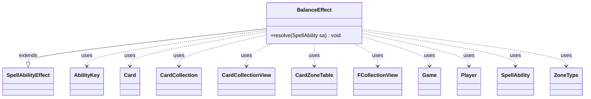

---
aliases:
  - BalanceEffect
tags:
  - java/class
  - module/forge-game
  - pkg/forge/game/ability/effects
fqn: forge.game.ability.effects.BalanceEffect
package: forge.game.ability.effects
module: forge-game
kind: Class
---

# BalanceEffect

**Package:** `forge.game.ability.effects` &nbsp; **Module:** `forge-game` &nbsp; **Kind:** Class



## Relationships
**Extends:**
- [[forge.game.ability.SpellAbilityEffect|SpellAbilityEffect]]
**Uses:**
- [[forge.game.Game|Game]]
- [[forge.game.ability.AbilityKey|AbilityKey]]
- [[forge.game.card.Card|Card]]
- [[forge.game.card.CardCollection|CardCollection]]
- [[forge.game.card.CardCollectionView|CardCollectionView]]
- [[forge.game.card.CardZoneTable|CardZoneTable]]
- [[forge.game.player.Player|Player]]
- [[forge.game.spellability.SpellAbility|SpellAbility]]
- [[forge.game.zone.ZoneType|ZoneType]]
- [[forge.util.collect.FCollectionView|FCollectionView]]

## Design Description

BalanceEffect is a concrete spell-ability resolution handler implementing Magic's "Balance" mechanic, which reduces every player to the lowest count of qualifying cards held by any single player. It extends `SpellAbilityEffect` and overrides `resolve(SpellAbility)` as its only responsibility, drawing all configuration from the ability's `Valid` and `Zone` parameters rather than holding fixed state, so the same handler serves any card that balances hands or permanents.

On resolution it walks players in turn order, filters each one's cards in the target zone via `CardLists`, and computes the minimum count; players above that minimum then shed the surplus, discarding from hand by controller choice or sacrificing permanents through `Game.getAction()`. Notably, all selection is delegated to each `Player`'s controller, hand discards are batched through a `discardedMap`, and every zone change is aggregated in a `CardZoneTable` whose single `triggerChangesZoneAll` fires the resulting triggers atomically.

## Source
`forge-game/src/main/java/forge/game/ability/effects/BalanceEffect.java`

```java
package forge.game.ability.effects;

import java.util.ArrayList;
import java.util.List;
import java.util.Map;

import com.google.common.collect.Maps;

import forge.game.Game;
import forge.game.ability.AbilityKey;
import forge.game.ability.SpellAbilityEffect;
import forge.game.card.Card;
import forge.game.card.CardCollection;
import forge.game.card.CardCollectionView;
import forge.game.card.CardLists;
import forge.game.card.CardZoneTable;
import forge.game.player.Player;
import forge.game.spellability.SpellAbility;
import forge.game.zone.ZoneType;
import forge.util.collect.FCollectionView;

/**
 * TODO: Write javadoc for this type.
 *
 */
public class BalanceEffect extends SpellAbilityEffect {

    /* (non-Javadoc)
     * @see forge.card.ability.SpellAbilityEffect#resolve(forge.card.spellability.SpellAbility)
     */
    @Override
    public void resolve(SpellAbility sa) {
        Player activator = sa.getActivatingPlayer();
        Card source = sa.getHostCard();
        Game game = activator.getGame();
        String valid = sa.getParamOrDefault("Valid", "Card");
        ZoneType zone = sa.hasParam("Zone") ? ZoneType.smartValueOf(sa.getParam("Zone")) : ZoneType.Battlefield;

        int min = Integer.MAX_VALUE;

        final FCollectionView<Player> players = game.getPlayersInTurnOrder();
        final List<CardCollection> validCards = new ArrayList<>(players.size());
        Map<Player, CardCollectionView> discardedMap = Maps.newHashMap();

        for (int i = 0; i < players.size(); i++) {
            // Find the minimum of each Valid per player
            validCards.add(CardLists.getValidCards(players.get(i).getCardsIn(zone), valid, activator, source, sa));
            min = Math.min(min, validCards.get(i).size());
        }

        Map<AbilityKey, Object> params = AbilityKey.newMap();
        CardZoneTable table = AbilityKey.addCardZoneTableParams(params, sa);

        for (int i = 0; i < players.size(); i++) {
            Player p = players.get(i);
            int numToBalance = validCards.get(i).size() - min;
            if (numToBalance == 0) {
                continue;
            }
            if (zone.equals(ZoneType.Hand)) {
                discardedMap.put(p, p.getController().chooseCardsToDiscardFrom(p, sa, validCards.get(i), numToBalance, numToBalance));
            } else { // Battlefield
                CardCollectionView list = p.getController().choosePermanentsToSacrifice(sa, numToBalance, numToBalance, validCards.get(i), valid);
                game.getAction().sacrifice(list, sa, true, params);
            }
        }

        if (zone.equals(ZoneType.Hand)) {
            discard(sa, true, discardedMap, params);
        }

        table.triggerChangesZoneAll(game, sa);
    }
}
```

## Python
`forge/game/ability/effects/BalanceEffect.py`

```python
from typing import List, Dict

from forge.game.Game import Game
from forge.game.ability.AbilityKey import AbilityKey
from forge.game.ability.SpellAbilityEffect import SpellAbilityEffect
from forge.game.card.Card import Card
from forge.game.card.CardCollection import CardCollection
from forge.game.card.CardCollectionView import CardCollectionView
from forge.game.card.CardLists import CardLists
from forge.game.card.CardZoneTable import CardZoneTable
from forge.game.player.Player import Player
from forge.game.spellability.SpellAbility import SpellAbility
from forge.game.zone.ZoneType import ZoneType
from forge.util.collect.FCollectionView import FCollectionView


# TODO: Write javadoc for this type.
#
class BalanceEffect(SpellAbilityEffect):

    # (non-Javadoc)
    # @see forge.card.ability.SpellAbilityEffect#resolve(forge.card.spellability.SpellAbility)
    def resolve(self, sa: SpellAbility) -> None:
        activator = sa.getActivatingPlayer()
        source = sa.getHostCard()
        game = activator.getGame()
        valid = sa.getParamOrDefault("Valid", "Card")
        zone = ZoneType.smartValueOf(sa.getParam("Zone")) if sa.hasParam("Zone") else ZoneType.Battlefield

        min = 2147483647  # Integer.MAX_VALUE

        players: FCollectionView[Player] = game.getPlayersInTurnOrder()
        validCards: List[CardCollection] = []
        discardedMap: Dict[Player, CardCollectionView] = {}

        for i in range(players.size()):
            # Find the minimum of each Valid per player
            validCards.append(CardLists.getValidCards(players.get(i).getCardsIn(zone), valid, activator, source, sa))
            min = min if min < validCards[i].size() else validCards[i].size()

        params: Dict[AbilityKey, object] = AbilityKey.newMap()
        table = AbilityKey.addCardZoneTableParams(params, sa)

        for i in range(players.size()):
            p = players.get(i)
            numToBalance = validCards[i].size() - min
            if numToBalance == 0:
                continue
            if zone == ZoneType.Hand:
                discardedMap[p] = p.getController().chooseCardsToDiscardFrom(p, sa, validCards[i], numToBalance, numToBalance)
            else:  # Battlefield
                list = p.getController().choosePermanentsToSacrifice(sa, numToBalance, numToBalance, validCards[i], valid)
                game.getAction().sacrifice(list, sa, True, params)

        if zone == ZoneType.Hand:
            self.discard(sa, True, discardedMap, params)

        table.triggerChangesZoneAll(game, sa)
```
