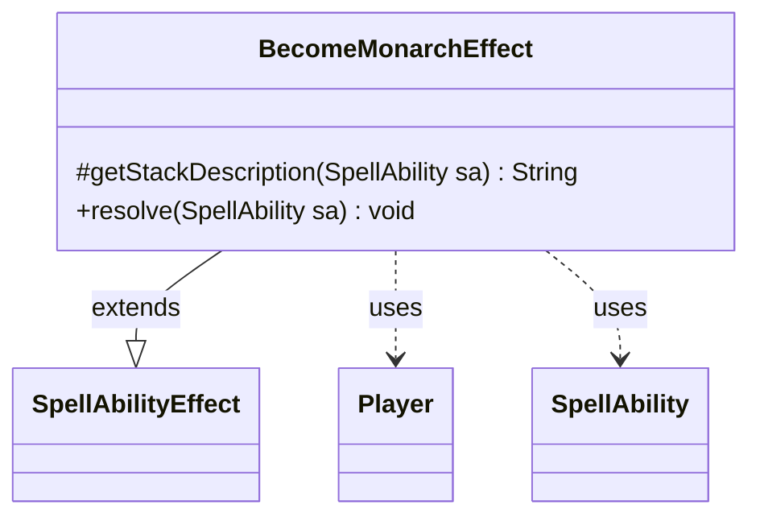

---
aliases:
  - BecomeMonarchEffect
tags:
  - java/class
  - module/forge-game
  - pkg/forge/game/ability/effects
fqn: forge.game.ability.effects.BecomeMonarchEffect
package: forge.game.ability.effects
module: forge-game
kind: Class
---

# BecomeMonarchEffect

**Package:** `forge.game.ability.effects`   **Module:** `forge-game`   **Kind:** Class



## Relationships
**Extends:**
- [[forge.game.ability.SpellAbilityEffect|SpellAbilityEffect]]
**Uses:**
- [[forge.game.player.Player|Player]]
- [[forge.game.spellability.SpellAbility|SpellAbility]]


## Design Description

BecomeMonarchEffect is a concrete `SpellAbilityEffect` that implements the resolution logic for spells and abilities which make one or more players the monarch. It overrides the two extension points its supertype exposes: `getStackDescription`, which produces a human-readable summary—using `Lang.joinHomogenous` and pluralizing "becomes"/"become" by target count—and `resolve`, which applies the state change. Resolution reads the originating card's set code, then iterates the ability's target `Player` list, skipping any player no longer in the game and honoring each player's `canBecomeMonarch` guard before delegating to `Game.getAction().becomeMonarch`.

The class holds no state of its own, collaborating transiently with `SpellAbility` for its targets and host and with `Player` as the affected subjects—consistent with the stateless, per-resolution effect pattern shared across the effects package. An inline TODO marks AI handling and corner cases as still unfinished.

## Source
`forge-game/src/main/java/forge/game/ability/effects/BecomeMonarchEffect.java`

```java
package forge.game.ability.effects;

import java.util.List;

import forge.game.ability.SpellAbilityEffect;
import forge.game.player.Player;
import forge.game.spellability.SpellAbility;
import forge.util.Lang;

public class BecomeMonarchEffect extends SpellAbilityEffect {

    @Override
    protected String getStackDescription(SpellAbility sa) {
        final StringBuilder sb = new StringBuilder();

        final List<Player> tgtPlayers = getTargetPlayers(sa);

        sb.append(Lang.joinHomogenous(tgtPlayers)).append(tgtPlayers.size() == 1 ? " becomes" : " become");
        sb.append(" the monarch.");

        return sb.toString();
    }

    @Override
    public void resolve(SpellAbility sa) {
        // TODO: improve ai and fix corner cases
        final String set = sa.getOriginalHost().getSetCode();

        for (final Player p : getTargetPlayers(sa)) {
            if (!p.isInGame()) {
                continue;
            }
            if (p.canBecomeMonarch()) {
                p.getGame().getAction().becomeMonarch(p, set);
            }
        }
    }

}
```

## Python
`forge/game/ability/effects/BecomeMonarchEffect.py`

```python
from forge.game.ability.SpellAbilityEffect import SpellAbilityEffect
from forge.game.player.Player import Player
from forge.game.spellability.SpellAbility import SpellAbility
from forge.util.Lang import Lang


class BecomeMonarchEffect(SpellAbilityEffect):

    def getStackDescription(self, sa: SpellAbility) -> str:
        sb = []

        tgtPlayers = self.getTargetPlayers(sa)

        sb.append(Lang.joinHomogenous(tgtPlayers))
        sb.append(" becomes" if len(tgtPlayers) == 1 else " become")
        sb.append(" the monarch.")

        return "".join(sb)

    def resolve(self, sa: SpellAbility) -> None:
        # TODO: improve ai and fix corner cases
        set = sa.getOriginalHost().getSetCode()

        for p in self.getTargetPlayers(sa):
            if not p.isInGame():
                continue
            if p.canBecomeMonarch():
                p.getGame().getAction().becomeMonarch(p, set)
```
