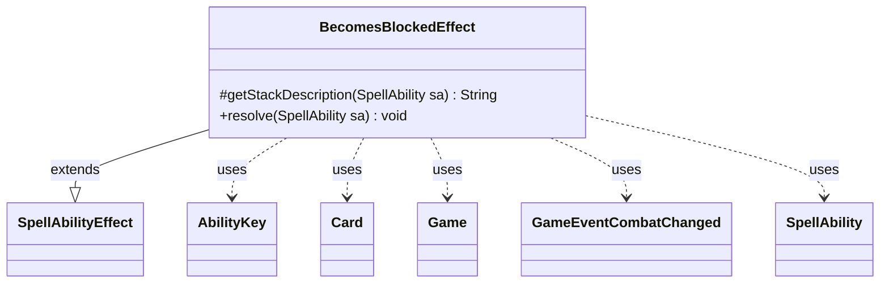

---
aliases:
  - BecomesBlockedEffect
tags:
  - java/class
  - module/forge-game
  - pkg/forge/game/ability/effects
fqn: forge.game.ability.effects.BecomesBlockedEffect
package: forge.game.ability.effects
module: forge-game
kind: Class
---

# BecomesBlockedEffect

**Package:** `forge.game.ability.effects`   **Module:** `forge-game`   **Kind:** Class



## Relationships
**Extends:**
- [[forge.game.ability.SpellAbilityEffect|SpellAbilityEffect]]
**Uses:**
- [[forge.game.Game|Game]]
- [[forge.game.ability.AbilityKey|AbilityKey]]
- [[forge.game.card.Card|Card]]
- [[forge.game.event.GameEventCombatChanged|GameEventCombatChanged]]
- [[forge.game.spellability.SpellAbility|SpellAbility]]


## Design Description

BecomesBlockedEffect is a one-shot resolver in Forge's ability-effect layer that marks targeted attacking creatures as blocked outside the normal block-declaration step — the mechanism behind cards and abilities that force a creature to "become blocked." As a concrete subclass of SpellAbilityEffect, it overrides `getStackDescription` to render a readable stack entry and `resolve` to mutate game state.

In `resolve` it fetches the active Game's Combat, bailing out early if no combat exists. For each target Card it calls `setBlocked`, and — guarding against duplicate firings via the card's damage history — fires an AttackerBlocked trigger whose AbilityKey parameter map carries the attacker, defender, defending player, and an intentionally empty Blockers collection (no real blocker is assigned). Once any creatures are newly blocked, it raises a single AttackerBlockedOnce trigger for the batch and publishes a GameEventCombatChanged so observers refresh.

## Source
`forge-game/src/main/java/forge/game/ability/effects/BecomesBlockedEffect.java`

```java
package forge.game.ability.effects;

import java.util.List;
import java.util.Map;

import com.google.common.collect.Lists;

import forge.game.Game;
import forge.game.ability.AbilityKey;
import forge.game.ability.SpellAbilityEffect;
import forge.game.card.Card;
import forge.game.card.CardCollection;
import forge.game.event.GameEventCombatChanged;
import forge.game.spellability.SpellAbility;
import forge.game.trigger.TriggerType;
import forge.util.Lang;

public class BecomesBlockedEffect extends SpellAbilityEffect {

    @Override
    protected String getStackDescription(SpellAbility sa) {
        final StringBuilder sb = new StringBuilder();

        sb.append(Lang.joinHomogenous(getTargetCards(sa)));
        sb.append(" becomes blocked.");

        return sb.toString();
    }

    @Override
    public void resolve(SpellAbility sa) {
        final Game game = sa.getActivatingPlayer().getGame();
        if (game.getCombat() == null) {
            return;
        }
        List<Card> blocked = Lists.newArrayList();
        for (final Card c : getTargetCards(sa)) {
            game.getCombat().setBlocked(c, true);
            if (!c.getDamageHistory().getCreatureGotBlockedThisCombat()) {
                blocked.add(c);
                final Map<AbilityKey, Object> runParams = AbilityKey.newMap();
                runParams.put(AbilityKey.Attacker, c);
                runParams.put(AbilityKey.Blockers, CardCollection.EMPTY);
                runParams.put(AbilityKey.Defender, game.getCombat().getDefenderByAttacker(c));
                runParams.put(AbilityKey.DefendingPlayer, game.getCombat().getDefenderPlayerByAttacker(c));
                game.getTriggerHandler().runTrigger(TriggerType.AttackerBlocked, runParams, false);
            }
        }

        if (!blocked.isEmpty()) {
            final Map<AbilityKey, Object> runParams = AbilityKey.newMap();
            runParams.put(AbilityKey.Attackers, blocked);
            game.getTriggerHandler().runTrigger(TriggerType.AttackerBlockedOnce, runParams, false);
            game.fireEvent(new GameEventCombatChanged());
        }
    }
}
```

## Python
`forge/game/ability/effects/BecomesBlockedEffect.py`

```python
package forge.game.ability.effects;

from typing import List, Map

from forge.game.Game import Game
from forge.game.ability.AbilityKey import AbilityKey
from forge.game.ability.SpellAbilityEffect import SpellAbilityEffect
from forge.game.card.Card import Card
from forge.game.card.CardCollection import CardCollection
from forge.game.event.GameEventCombatChanged import GameEventCombatChanged
from forge.game.spellability.SpellAbility import SpellAbility
from forge.game.trigger.TriggerType import TriggerType
from forge.util.Lang import Lang
```
