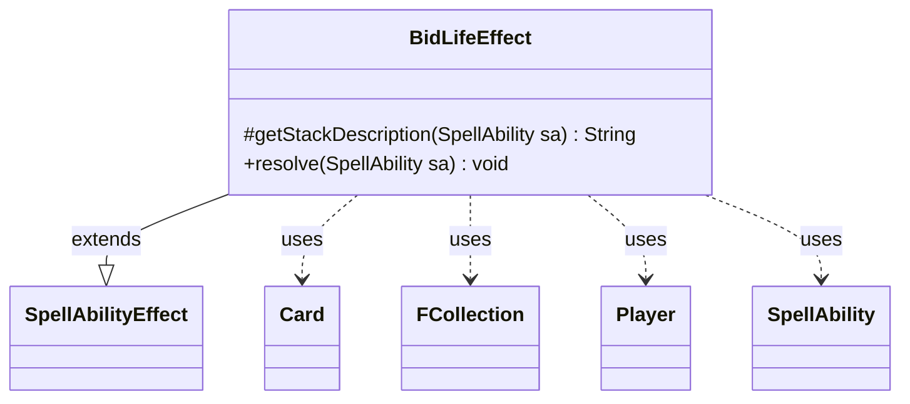

---
aliases:
  - BidLifeEffect
tags:
  - java/class
  - module/forge-game
  - pkg/forge/game/ability/effects
fqn: forge.game.ability.effects.BidLifeEffect
package: forge.game.ability.effects
module: forge-game
kind: Class
---

# BidLifeEffect

**Package:** `forge.game.ability.effects`   **Module:** `forge-game`   **Kind:** Class



## Relationships
**Extends:**
- [[forge.game.ability.SpellAbilityEffect|SpellAbilityEffect]]
**Uses:**
- [[forge.game.card.Card|Card]]
- [[forge.game.player.Player|Player]]
- [[forge.game.spellability.SpellAbility|SpellAbility]]
- [[forge.util.collect.FCollection|FCollection]]


## Design Description

BidLifeEffect implements the resolution of "bid life" abilities, in which players take successive turns offering ever-higher bids—payable later in life—to win a contested effect. As a concrete subclass of SpellAbilityEffect, it satisfies the engine's command-style contract by overriding `getStackDescription` to label the action and `resolve` to execute it, keeping bidding logic encapsulated in one effect handler rather than the card-scripting layer.

During resolution it reads parameters from the SpellAbility (`StartBidding`, `OtherBidder`, the `BidSubAbility`) and the host Card, assembles participants into an FCollection of Player rotated to begin with the activator, then loops through bidders—prompting each one's controller—until a full round passes with no raise. The final bid and winner are stashed on the host card via `setChosenNumber` and `addRemembered` so a chained sub-ability can consume them, after which remembered state is cleared to avoid leaking into later resolutions.

## Source
`forge-game/src/main/java/forge/game/ability/effects/BidLifeEffect.java`

```java
package forge.game.ability.effects;

import com.google.common.collect.Iterables;
import forge.game.ability.AbilityUtils;
import forge.game.ability.SpellAbilityEffect;
import forge.game.card.Card;
import forge.game.player.Player;
import forge.game.player.PlayerActionConfirmMode;
import forge.game.spellability.SpellAbility;
import forge.util.Localizer;
import forge.util.collect.FCollection;

public class BidLifeEffect extends SpellAbilityEffect {
    @Override
    protected String getStackDescription(SpellAbility sa) {
        return "Bid Life";
    }

    @Override
    public void resolve(SpellAbility sa) {
        final Card host = sa.getHostCard();
        final Player activator = sa.getActivatingPlayer();
        final FCollection<Player> bidPlayers = new FCollection<>();
        final int startBidding;
        if (sa.hasParam("StartBidding")) {
            String start = sa.getParam("StartBidding");
            if ("Any".equals(start)) {
                startBidding = activator.getController().announceRequirements(sa, 0, Integer.MAX_VALUE, Localizer.getInstance().getMessage("lblChooseStartingBid"));
            } else {
                startBidding = AbilityUtils.calculateAmount(host, start, sa);
            }
        } else {
            startBidding = 0;
        }

        if (sa.hasParam("OtherBidder")) {
            bidPlayers.add(activator);
            bidPlayers.addAll(AbilityUtils.getDefinedPlayers(host, sa.getParam("OtherBidder"), sa));
        } else {
            bidPlayers.addAll(activator.getGame().getPlayersInTurnOrder());
            int pSize = bidPlayers.size();
            // start with the activator
            while (bidPlayers.contains(activator) && !activator.equals(Iterables.getFirst(bidPlayers, null))) {
                bidPlayers.add(pSize - 1, bidPlayers.remove(0));
            }
        }

        boolean willBid = true;
        Player winner = activator;
        int bid = startBidding;
        while (willBid) {
            willBid = false;
            for (final Player p : bidPlayers) {
                final boolean result = p.getController().confirmBidAction(sa, PlayerActionConfirmMode.BidLife,
                        Localizer.getInstance().getMessage("lblDoYouWantTopBid") + bid, bid, winner);
                willBid |= result;
                if (result) { // a different choose number
                    bid += p.getController().chooseNumber(sa, Localizer.getInstance().getMessage("lblBidLife") + ":", 1, 9);
                    winner = p;
                    host.getGame().getAction().notifyOfValue(sa, p,  Localizer.getInstance().getMessage("lblTopBidWithValueLife", bid), p);
                }
            }
        }

        host.setChosenNumber(bid);
        host.addRemembered(winner);
        final SpellAbility action = sa.getAdditionalAbility("BidSubAbility");
        if (action != null) {
            AbilityUtils.resolve(action);
        }
        host.clearRemembered();
    }
}
```

## Python
`forge/game/ability/effects/BidLifeEffect.py`

```python
package forge.game.ability.effects -> module path forge/game/ability/effects/BidLifeEffect.py

Let me write the port.

Dependencies imports:
- com.google.common.collect.Iterables -> need an equivalent. Iterables.getFirst(bidPlayers, null). I'll use a helper or just index. I'll keep faithful but Python. Iterables.getFirst returns first or null. I'll do `bidPlayers[0] if bidPlayers else None`. But FCollection... keep it. Actually rule says import dependencies by FQN. com.google.common is not a forge package so not listed in relationships. I'll just implement inline.

- forge.game.ability.AbilityUtils -> from forge.game.ability.AbilityUtils import AbilityUtils
- forge.game.ability.SpellAbilityEffect -> import
- forge.game.card.Card -> import
- forge.game.player.Player -> import
- forge.game.player.PlayerActionConfirmMode -> import
- forge.game.spellability.SpellAbility -> import
- forge.util.Localizer -> import
- forge.util.collect.FCollection -> import

Let me write.from forge.game.ability.AbilityUtils import AbilityUtils
from forge.game.ability.SpellAbilityEffect import SpellAbilityEffect
from forge.game.card.Card import Card
from forge.game.player.Player import Player
from forge.game.player.PlayerActionConfirmMode import PlayerActionConfirmMode
from forge.game.spellability.SpellAbility import SpellAbility
from forge.util.Localizer import Localizer
from forge.util.collect.FCollection import FCollection


class BidLifeEffect(SpellAbilityEffect):
    def getStackDescription(self, sa: SpellAbility) -> str:
        return "Bid Life"

    def resolve(self, sa: SpellAbility) -> None:
        host = sa.getHostCard()
        activator = sa.getActivatingPlayer()
        bidPlayers = FCollection()
        if sa.hasParam("StartBidding"):
            start = sa.getParam("StartBidding")
            if "Any" == start:
                startBidding = activator.getController().announceRequirements(sa, 0, 2147483647, Localizer.getInstance().getMessage("lblChooseStartingBid"))
            else:
                startBidding = AbilityUtils.calculateAmount(host, start, sa)
        else:
            startBidding = 0

        if sa.hasParam("OtherBidder"):
            bidPlayers.add(activator)
            bidPlayers.addAll(AbilityUtils.getDefinedPlayers(host, sa.getParam("OtherBidder"), sa))
        else:
            bidPlayers.addAll(activator.getGame().getPlayersInTurnOrder())
            pSize = bidPlayers.size()
            # start with the activator
            while bidPlayers.contains(activator) and not activator == (bidPlayers[0] if len(bidPlayers) > 0 else None):
                bidPlayers.add(pSize - 1, bidPlayers.remove(0))

        willBid = True
        winner = activator
        bid = startBidding
        while willBid:
            willBid = False
            for p in bidPlayers:
                result = p.getController().confirmBidAction(sa, PlayerActionConfirmMode.BidLife,
                        Localizer.getInstance().getMessage("lblDoYouWantTopBid") + str(bid), bid, winner)
                willBid |= result
                if result:  # a different choose number
                    bid += p.getController().chooseNumber(sa, Localizer.getInstance().getMessage("lblBidLife") + ":", 1, 9)
                    winner = p
                    host.getGame().getAction().notifyOfValue(sa, p, Localizer.getInstance().getMessage("lblTopBidWithValueLife", bid), p)

        host.setChosenNumber(bid)
        host.addRemembered(winner)
        action = sa.getAdditionalAbility("BidSubAbility")
        if action is not None:
            AbilityUtils.resolve(action)
        host.clearRemembered()
```
