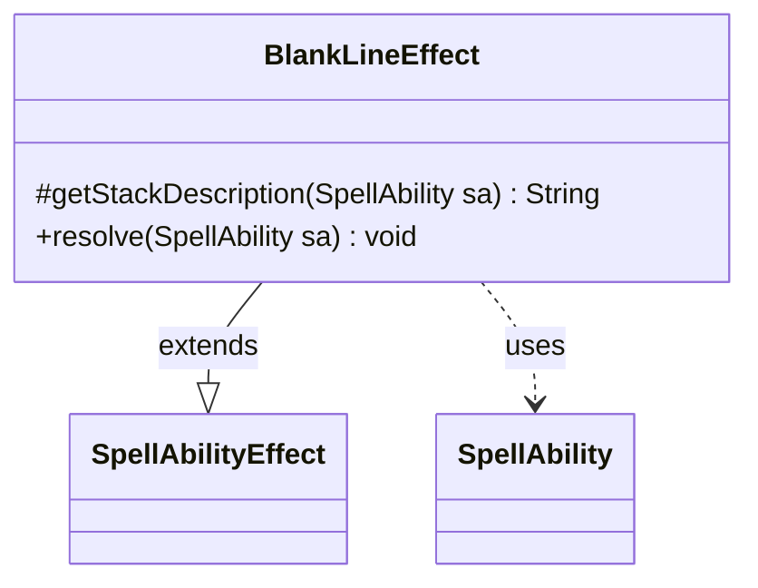

---
aliases:
  - BlankLineEffect
tags:
  - java/class
  - module/forge-game
  - pkg/forge/game/ability/effects
fqn: forge.game.ability.effects.BlankLineEffect
package: forge.game.ability.effects
module: forge-game
kind: Class
---

# BlankLineEffect

**Package:** `forge.game.ability.effects` &nbsp; **Module:** `forge-game` &nbsp; **Kind:** Class



## Relationships
**Extends:**
- [[forge.game.ability.SpellAbilityEffect|SpellAbilityEffect]]
**Uses:**
- [[forge.game.spellability.SpellAbility|SpellAbility]]


## Design Description

BlankLineEffect is a minimal, presentation-only spell ability effect whose sole job is to improve the formatting of certain card displays. Extending `SpellAbilityEffect`, it overrides `getStackDescription` to return a bare carriage-return/line-feed and leaves `resolve` empty, since the effect produces no game-state change. It depends on `SpellAbility` only to satisfy the inherited method signatures.

The design intent is to express a purely cosmetic spacing adjustment as an ordinary effect within the engine's uniform effect-resolution contract, rather than special-casing display formatting elsewhere. By conforming to the standard `SpellAbilityEffect` interface while doing nothing functional, it lets card definitions insert visual line breaks consistently through the same mechanism used for real effects, keeping the card-scripting model simple and homogeneous.

## Source
`forge-game/src/main/java/forge/game/ability/effects/BlankLineEffect.java`

```java
package forge.game.ability.effects;

import forge.game.ability.SpellAbilityEffect;
import forge.game.spellability.SpellAbility;

public class BlankLineEffect extends SpellAbilityEffect {
    @Override
    protected String getStackDescription(SpellAbility sa) {
        return "\r\n";
    }

    @Override
    public void resolve(SpellAbility sa) {
        // this "effect" just allows spacing to look better for certain card displays
    }
}
```
