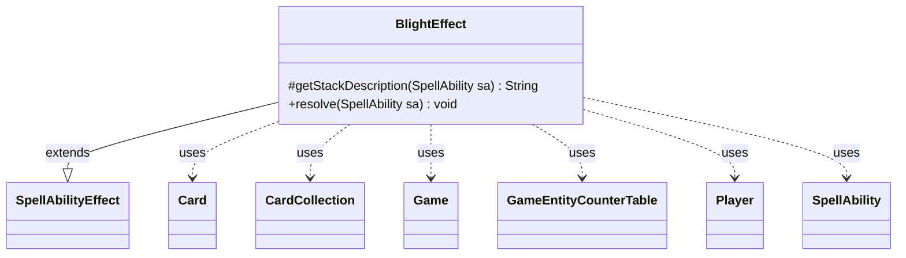

---
aliases:
  - BlightEffect
tags:
  - java/class
  - module/forge-game
  - pkg/forge/game/ability/effects
fqn: forge.game.ability.effects.BlightEffect
package: forge.game.ability.effects
module: forge-game
kind: Class
---

# BlightEffect

**Package:** `forge.game.ability.effects` &nbsp; **Module:** `forge-game` &nbsp; **Kind:** Class



## Relationships
**Extends:**
- [[forge.game.ability.SpellAbilityEffect|SpellAbilityEffect]]
**Uses:**
- [[forge.game.Game|Game]]
- [[forge.game.GameEntityCounterTable|GameEntityCounterTable]]
- [[forge.game.card.Card|Card]]
- [[forge.game.card.CardCollection|CardCollection]]
- [[forge.game.player.Player|Player]]
- [[forge.game.spellability.SpellAbility|SpellAbility]]

## Design Description

BlightEffect realizes the resolution logic for a "blight" ability, placing −1/−1 (M1M1) counters on creatures controlled by the targeted players. As a concrete subclass of SpellAbilityEffect, it slots into Forge's data-driven ability framework: it overrides `getStackDescription` to compose a readable stack entry and `resolve` to carry out the game mutation, keeping each effect type a small, self-contained, reusable unit.

In `resolve`, it derives the counter amount from the ability's "Num" parameter via AbilityUtils, then for each target Player filters their in-play creatures to those that can receive M1M1 counters (CardCollection plus CardPredicates) and asks that player's controller to choose one. Rather than mutating counters immediately, additions are accumulated in a shared GameEntityCounterTable and committed once through `replaceCounterEffect`, so replacement effects resolve atomically against the Game. It collaborates with Card and SpellAbility for the host and parameters, staying loosely coupled to the spell-ability system.

## Source
`forge-game/src/main/java/forge/game/ability/effects/BlightEffect.java`

```java
package forge.game.ability.effects;

import com.google.common.collect.Maps;

import forge.game.Game;
import forge.game.GameEntityCounterTable;
import forge.game.ability.AbilityUtils;
import forge.game.ability.SpellAbilityEffect;
import forge.game.card.Card;
import forge.game.card.CardCollection;
import forge.game.card.CardPredicates;
import forge.game.card.CounterEnumType;
import forge.game.player.Player;
import forge.game.spellability.SpellAbility;
import forge.util.Lang;
import forge.util.Localizer;

import java.util.List;

public class BlightEffect extends SpellAbilityEffect {
    @Override
    protected String getStackDescription(SpellAbility sa) {
        final Card card = sa.getHostCard();
        final StringBuilder sb = new StringBuilder();

        List<Player> tgt = getTargetPlayers(sa);
        final int amount = AbilityUtils.calculateAmount(card, sa.getParamOrDefault("Num", "1"), sa);

        sb.append(Lang.joinHomogenous(tgt));
        sb.append(" ");
        sb.append(tgt.size() > 1 ? "blights" : "blight");
        sb.append(" ").append(amount).append(". ");

        return sb.toString();
    }

    @Override
    public void resolve(SpellAbility sa) {
        final Card host = sa.getHostCard();
        final Game game = host.getGame();
        GameEntityCounterTable table = new GameEntityCounterTable();

        final int amount = AbilityUtils.calculateAmount(host, sa.getParamOrDefault("Num", "1"), sa);

        for (final Player p : getTargetPlayers(sa)) {
            CardCollection options = p.getCreaturesInPlay()
                    .filter(CardPredicates.canReceiveCounters(CounterEnumType.M1M1));
            Card tgt = p.getController().chooseSingleEntityForEffect(options, sa,
                    Localizer.getInstance().getMessage("lblChooseaCard"), false, Maps.newHashMap());
            if (tgt == null) {
                continue;
            }

            tgt.addCounter(CounterEnumType.M1M1, amount, p, table);
        }

        table.replaceCounterEffect(game, sa);
    }
}
```
