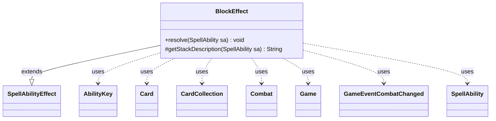

---
aliases:
  - BlockEffect
tags:
  - java/class
  - module/forge-game
  - pkg/forge/game/ability/effects
fqn: forge.game.ability.effects.BlockEffect
package: forge.game.ability.effects
module: forge-game
kind: Class
---

# BlockEffect

**Package:** `forge.game.ability.effects` &nbsp; **Module:** `forge-game` &nbsp; **Kind:** Class



## Relationships
**Extends:**
- [[forge.game.ability.SpellAbilityEffect|SpellAbilityEffect]]
**Uses:**
- [[forge.game.Game|Game]]
- [[forge.game.ability.AbilityKey|AbilityKey]]
- [[forge.game.card.Card|Card]]
- [[forge.game.card.CardCollection|CardCollection]]
- [[forge.game.combat.Combat|Combat]]
- [[forge.game.event.GameEventCombatChanged|GameEventCombatChanged]]
- [[forge.game.spellability.SpellAbility|SpellAbility]]

## Design Description

BlockEffect implements the resolution of an effect that forces specified creatures to block specified attackers, serving as the executable behavior behind a card's "block" ability. As a concrete subclass of SpellAbilityEffect, it overrides resolve to mutate combat state and getStackDescription to produce the human-readable stack text.

During resolution it reads the active Combat from the Game's phase handler, resolves the DefinedAttacker and DefinedBlocker parameters into Card lists, and registers each valid blocker against each attacker. It records blocked-this-turn history via CardCopyService LKI copies, fires the appropriate combat triggers (AttackerBlockedByCreature, Blocks, AttackerBlocked, AttackerBlockedOnce) through AbilityKey parameter maps, and orders blockers for damage assignment. Finally it refreshes the combat view and broadcasts a GameEventCombatChanged so the UI reflects the new block assignments.

## Source
`forge-game/src/main/java/forge/game/ability/effects/BlockEffect.java`

```java
package forge.game.ability.effects;

import java.util.ArrayList;
import java.util.List;
import java.util.Map;

import com.google.common.collect.Lists;

import forge.game.Game;
import forge.game.ability.AbilityKey;
import forge.game.ability.AbilityUtils;
import forge.game.ability.SpellAbilityEffect;
import forge.game.card.Card;
import forge.game.card.CardCollection;
import forge.game.card.CardCopyService;
import forge.game.combat.Combat;
import forge.game.event.GameEventCombatChanged;
import forge.game.spellability.SpellAbility;
import forge.game.trigger.TriggerType;
import forge.util.Lang;

public class BlockEffect extends SpellAbilityEffect {

    @Override
    public void resolve(SpellAbility sa) {
        final Card host = sa.getHostCard();
        final Game game = host.getGame();
        final Combat combat = game.getPhaseHandler().getCombat();

        List<Card> attackers = new ArrayList<>();
        if (sa.hasParam("DefinedAttacker")) {
            for (final Card attacker : AbilityUtils.getDefinedCards(host, sa.getParam("DefinedAttacker"), sa)) {
                if (combat.isAttacking(attacker))
                    attackers.add(attacker);
            }
        }

        List<Card> blockers = new ArrayList<>();
        if (sa.hasParam("DefinedBlocker")) {
            for (final Card blocker : AbilityUtils.getDefinedCards(host, sa.getParam("DefinedBlocker"), sa)) {
                if (blocker.isCreature() && blocker.isInPlay())
                    blockers.add(blocker);
            }
        }

        if (attackers.size() == 0 || blockers.size() == 0) return;

        List<Card> blocked = Lists.newArrayList();

        for (final Card attacker : attackers) {
            final boolean wasBlocked = combat.isBlocked(attacker);

            for (final Card blocker : blockers) {
                if (combat.isBlocking(blocker, attacker)) continue;

                // If the attacker was blocked, this covers adding the blocker to the damage assignment
                combat.addBlocker(attacker, blocker);
                combat.orderAttackersForDamageAssignment(blocker);

                blocker.addBlockedThisTurn(CardCopyService.getLKICopy(attacker));
                attacker.addBlockedByThisTurn(CardCopyService.getLKICopy(blocker));

                {
                    final Map<AbilityKey, Object> runParams = AbilityKey.newMap();
                    runParams.put(AbilityKey.Attacker, attacker);
                    runParams.put(AbilityKey.Blocker, blocker);
                    game.getTriggerHandler().runTrigger(TriggerType.AttackerBlockedByCreature, runParams, false);
                }

                final Map<AbilityKey, Object> runParams = AbilityKey.newMap();
                runParams.put(AbilityKey.Blocker, blocker);
                runParams.put(AbilityKey.Attackers, attacker);
                game.getTriggerHandler().runTrigger(TriggerType.Blocks, runParams, false);
            }

            attacker.getDamageHistory().setCreatureGotBlockedThisCombat(true);
            if (!wasBlocked) {
                blocked.add(attacker);
                final Map<AbilityKey, Object> runParams = AbilityKey.newMap();
                runParams.put(AbilityKey.Attacker, attacker);
                runParams.put(AbilityKey.Blockers, blockers);
                runParams.put(AbilityKey.Defender, combat.getDefenderByAttacker(attacker));
                runParams.put(AbilityKey.DefendingPlayer, combat.getDefenderPlayerByAttacker(attacker));
                game.getTriggerHandler().runTrigger(TriggerType.AttackerBlocked, runParams, false);

                combat.orderBlockersForDamageAssignment(attacker, new CardCollection(blockers));
            }
        }

        if (!blocked.isEmpty()) {
            final Map<AbilityKey, Object> runParams = AbilityKey.newMap();
            runParams.put(AbilityKey.Attackers, blocked);
            game.getTriggerHandler().runTrigger(TriggerType.AttackerBlockedOnce, runParams, false);
        }

        game.updateCombatForView();
        game.fireEvent(new GameEventCombatChanged());
    }

    @Override
    protected String getStackDescription(SpellAbility sa) {
        final StringBuilder sb = new StringBuilder();

        // end standard pre-

        List<String> attackers = new ArrayList<>();
        if (sa.hasParam("DefinedAttacker")) {
            for (final Card attacker : AbilityUtils.getDefinedCards(sa.getHostCard(), sa.getParam("DefinedAttacker"), sa)) {
                attackers.add(attacker.toString());
            }
        }

        List<String> blockers = new ArrayList<>();
        if (sa.hasParam("DefinedBlocker")) {
            for (final Card blocker : AbilityUtils.getDefinedCards(sa.getHostCard(), sa.getParam("DefinedBlocker"), sa)) {
                blockers.add(blocker.toString());
            }
        }

        sb.append(Lang.joinHomogenous(blockers)).append(" block ").append(Lang.joinHomogenous(attackers));

        return sb.toString();
    }

}
```
