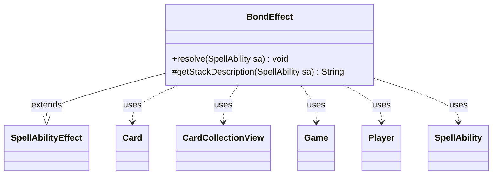

---
aliases:
  - BondEffect
tags:
  - java/class
  - module/forge-game
  - pkg/forge/game/ability/effects
fqn: forge.game.ability.effects.BondEffect
package: forge.game.ability.effects
module: forge-game
kind: Class
---

# BondEffect

**Package:** `forge.game.ability.effects`   **Module:** `forge-game`   **Kind:** Class



## Relationships
**Extends:**
- [[forge.game.ability.SpellAbilityEffect|SpellAbilityEffect]]
**Uses:**
- [[forge.game.Game|Game]]
- [[forge.game.card.Card|Card]]
- [[forge.game.card.CardCollectionView|CardCollectionView]]
- [[forge.game.player.Player|Player]]
- [[forge.game.spellability.SpellAbility|SpellAbility]]


## Design Description

BondEffect implements the resolution logic for Magic's "Soulbond" pairing mechanic. As a concrete subclass of SpellAbilityEffect, it plugs into Forge's data-driven ability framework—where each effect type is a discrete handler—overriding `resolve` to pair targeted creatures and `getStackDescription` to render a human-readable stack message. For each valid target controlled by the activating Player, it gathers eligible unpaired creatures via the `ValidCards` parameter, prompts the controller to choose a partner, and mutually links the two cards with `setPairedWith`.

Notably, it resolves each target through `Game.getCardState` and skips last-known-information or stale-timestamp cards, re-validating that each remains an in-play, unpaired creature under the correct controller before pairing. It also threads a `Partner` hint through the choice parameters to guide AI decisions, collaborating with Card, CardCollectionView, Game, Player, and SpellAbility.

## Source
`forge-game/src/main/java/forge/game/ability/effects/BondEffect.java`

```java
package forge.game.ability.effects;

import java.util.Map;

import com.google.common.collect.Maps;

import forge.game.Game;
import forge.game.ability.SpellAbilityEffect;
import forge.game.card.Card;
import forge.game.card.CardCollectionView;
import forge.game.card.CardLists;
import forge.game.player.Player;
import forge.game.spellability.SpellAbility;
import forge.util.Lang;
import forge.util.Localizer;

public class BondEffect extends SpellAbilityEffect {
    @Override
    public void resolve(SpellAbility sa) {
        Card source = sa.getHostCard();
        Player p = sa.getActivatingPlayer();
        Game game = source.getGame();
        for (Card tgtC : getTargetCards(sa)) {
            Card gameCard = game.getCardState(tgtC, null);
            // gameCard is LKI in that case, the card is not in game anymore
            // or the timestamp did change
            // this should check Self too
            if (gameCard == null || !tgtC.equalsWithGameTimestamp(gameCard)) {
                continue;
            }
            if (gameCard.isPaired() || !gameCard.isCreature() || !gameCard.isInPlay() || gameCard.getController() != p) {
                continue;
            }

            // find list of valid cards to pair with
            CardCollectionView cards = CardLists.getValidCards(p.getCreaturesInPlay(), sa.getParam("ValidCards"), p, source, sa);
            if (cards.isEmpty()) {
                continue;
            }

            Map<String, Object> params = Maps.newHashMap();
            params.put("Partner", gameCard); // info for AI to bond them

            Card partner = p.getController().chooseSingleEntityForEffect(cards, sa, Localizer.getInstance().getMessage("lblSelectACardPair"), true, params);

            if (partner != null) {
                // pair choices together
                gameCard.setPairedWith(partner);
                partner.setPairedWith(gameCard);
            }
        }
    }

    @Override
    protected String getStackDescription(SpellAbility sa) {
        final StringBuilder sb = new StringBuilder();

        sb.append(Lang.joinHomogenous(getTargetCards(sa)));

        sb.append(" pairs with another unpaired creature you control.");
        return sb.toString();
    }

}
```

## Python
`forge/game/ability/effects/BondEffect.py`

```python
from typing import Any

from forge.game.Game import Game
from forge.game.ability.SpellAbilityEffect import SpellAbilityEffect
from forge.game.card.Card import Card
from forge.game.card.CardCollectionView import CardCollectionView
from forge.game.card.CardLists import CardLists
from forge.game.player.Player import Player
from forge.game.spellability.SpellAbility import SpellAbility
from forge.util.Lang import Lang
from forge.util.Localizer import Localizer


class BondEffect(SpellAbilityEffect):
    def resolve(self, sa: SpellAbility) -> None:
        source = sa.getHostCard()
        p = sa.getActivatingPlayer()
        game = source.getGame()
        for tgtC in self.getTargetCards(sa):
            gameCard = game.getCardState(tgtC, None)
            # gameCard is LKI in that case, the card is not in game anymore
            # or the timestamp did change
            # this should check Self too
            if gameCard is None or not tgtC.equalsWithGameTimestamp(gameCard):
                continue
            if gameCard.isPaired() or not gameCard.isCreature() or not gameCard.isInPlay() or gameCard.getController() != p:
                continue

            # find list of valid cards to pair with
            cards = CardLists.getValidCards(p.getCreaturesInPlay(), sa.getParam("ValidCards"), p, source, sa)
            if cards.isEmpty():
                continue

            params: dict[str, Any] = {}
            params["Partner"] = gameCard  # info for AI to bond them

            partner = p.getController().chooseSingleEntityForEffect(cards, sa, Localizer.getInstance().getMessage("lblSelectACardPair"), True, params)

            if partner is not None:
                # pair choices together
                gameCard.setPairedWith(partner)
                partner.setPairedWith(gameCard)

    def getStackDescription(self, sa: SpellAbility) -> str:
        sb = []

        sb.append(Lang.joinHomogenous(self.getTargetCards(sa)))

        sb.append(" pairs with another unpaired creature you control.")
        return "".join(sb)
```
