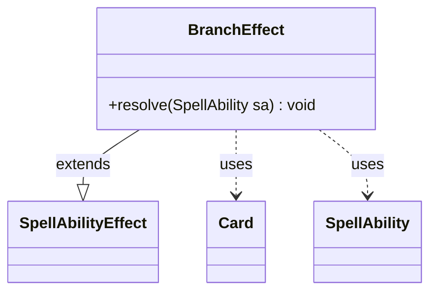

---
aliases:
  - BranchEffect
tags:
  - java/class
  - module/forge-game
  - pkg/forge/game/ability/effects
fqn: forge.game.ability.effects.BranchEffect
package: forge.game.ability.effects
module: forge-game
kind: Class
---

# BranchEffect

**Package:** `forge.game.ability.effects` &nbsp; **Module:** `forge-game` &nbsp; **Kind:** Class



## Relationships
**Extends:**
- [[forge.game.ability.SpellAbilityEffect|SpellAbilityEffect]]
**Uses:**
- [[forge.game.card.Card|Card]]
- [[forge.game.spellability.SpellAbility|SpellAbility]]


## Design Description

BranchEffect is a concrete resolution handler in Forge's effects framework that implements declarative conditional branching for spell and ability resolution. Extending SpellAbilityEffect, it overrides `resolve` to evaluate a data-driven predicate: it reads the `BranchConditionSVar` and `BranchConditionSVarCompare` parameters off the SpellAbility, computes both operands via `AbilityUtils.calculateAmount` against the host Card, and compares them with `Expressions.compare`. Depending on the result, it selects and resolves either the `TrueSubAbility` or `FalseSubAbility`, letting card scripts express if/then/else logic without bespoke code.

The design favors parameterization over hardcoding: the comparison operator and operand are packed into a single string (e.g. `GE1`) and the actual behavior is delegated to nested sub-abilities. A null-guard tolerates a missing branch, and an inline TODO notes that this comparison logic duplicates the existing SpellAbilityCondition mechanism, flagging intended future consolidation.

## Source
`forge-game/src/main/java/forge/game/ability/effects/BranchEffect.java`

```java
package forge.game.ability.effects;

import forge.game.ability.AbilityUtils;
import forge.game.ability.SpellAbilityEffect;
import forge.game.card.Card;
import forge.game.spellability.SpellAbility;
import forge.util.Expressions;

public class BranchEffect extends SpellAbilityEffect {
    @Override
    public void resolve(SpellAbility sa) {
        final Card host = sa.getHostCard();

        // TODO Reuse SpellAbilityCondition and areMet() here instead of repeating each

        String branchSVar = sa.getParam("BranchConditionSVar");
        String branchCompare = sa.getParamOrDefault("BranchConditionSVarCompare", "GE1");

        String operator = branchCompare.substring(0, 2);
        String operand = branchCompare.substring(2);

        final int svarValue = AbilityUtils.calculateAmount(host, branchSVar, sa);
        final int operandValue = AbilityUtils.calculateAmount(host, operand, sa);

        SpellAbility sub = null;
        if (Expressions.compare(svarValue, operator, operandValue)) {
            sub = sa.getAdditionalAbility("TrueSubAbility");
        } else {
            sub = sa.getAdditionalAbility("FalseSubAbility");
        }
        if (sub != null) {
            AbilityUtils.resolve(sub);
        }
    }
}
```

## Python
`forge/game/ability/effects/BranchEffect.py`

```python
from forge.game.ability.AbilityUtils import AbilityUtils
from forge.game.ability.SpellAbilityEffect import SpellAbilityEffect
from forge.game.card.Card import Card
from forge.game.spellability.SpellAbility import SpellAbility
from forge.util.Expressions import Expressions


class BranchEffect(SpellAbilityEffect):
    def resolve(self, sa: SpellAbility) -> None:
        host: Card = sa.getHostCard()

        # TODO Reuse SpellAbilityCondition and areMet() here instead of repeating each

        branchSVar = sa.getParam("BranchConditionSVar")
        branchCompare = sa.getParamOrDefault("BranchConditionSVarCompare", "GE1")

        operator = branchCompare[0:2]
        operand = branchCompare[2:]

        svarValue: int = AbilityUtils.calculateAmount(host, branchSVar, sa)
        operandValue: int = AbilityUtils.calculateAmount(host, operand, sa)

        sub: SpellAbility = None
        if Expressions.compare(svarValue, operator, operandValue):
            sub = sa.getAdditionalAbility("TrueSubAbility")
        else:
            sub = sa.getAdditionalAbility("FalseSubAbility")
        if sub is not None:
            AbilityUtils.resolve(sub)
```
