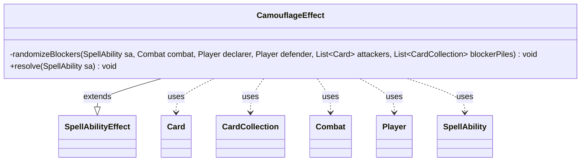

---
aliases:
  - CamouflageEffect
tags:
  - java/class
  - module/forge-game
  - pkg/forge/game/ability/effects
fqn: forge.game.ability.effects.CamouflageEffect
package: forge.game.ability.effects
module: forge-game
kind: Class
---

# CamouflageEffect

**Package:** `forge.game.ability.effects`   **Module:** `forge-game`   **Kind:** Class



## Relationships
**Extends:**
- [[forge.game.ability.SpellAbilityEffect|SpellAbilityEffect]]
**Uses:**
- [[forge.game.card.Card|Card]]
- [[forge.game.card.CardCollection|CardCollection]]
- [[forge.game.combat.Combat|Combat]]
- [[forge.game.player.Player|Player]]
- [[forge.game.spellability.SpellAbility|SpellAbility]]

## Design Description

CamouflageEffect is a concrete `SpellAbilityEffect` that resolves the Camouflage combat mechanic, in which a defender's creatures are committed as randomized, hidden blocker piles. Its overridden `resolve` builds one blocker pile per attacker, branching on the declarer: an AI declarer simply declares blockers normally and has them pulled back into piles, while a human declarer is prompted to partition the defender's legal creatures into numbered piles, tracking how many attackers each creature may block. The private `randomizeBlockers` helper then shuffles the attackers and commits piles into the live `Combat`.

It collaborates with `Card` and `CardCollection` to represent creatures and piles, `Player` for the declarer and defender roles, and `SpellAbility` for parameters and controller prompts. A deliberate design choice is that legality is re-checked after shuffling—`CombatUtil` strips illegal blockers, enforces minimum-blocker counts, and forces a single choice when restrictions cap blocking—so the random reassignment can never yield an illegal block.

## Source
`forge-game/src/main/java/forge/game/ability/effects/CamouflageEffect.java`

```java
package forge.game.ability.effects;

import java.util.ArrayList;
import java.util.Collections;
import java.util.List;

import forge.game.ability.AbilityUtils;
import forge.game.ability.SpellAbilityEffect;
import forge.game.card.Card;
import forge.game.card.CardCollection;
import forge.game.card.CardLists;
import forge.game.combat.Combat;
import forge.game.combat.CombatUtil;
import forge.game.player.Player;
import forge.game.spellability.SpellAbility;
import forge.game.staticability.StaticAbilityCantAttackBlock;
import forge.util.Localizer;

public class CamouflageEffect extends SpellAbilityEffect {

    private void randomizeBlockers(SpellAbility sa, Combat combat, Player declarer, Player defender, List<Card> attackers, List<CardCollection> blockerPiles) {
        CardLists.shuffle(attackers);
        for (int i = 0; i < attackers.size(); i++) {
            final Card attacker = attackers.get(i);
            CardCollection blockers = blockerPiles.get(i);

            // Remove all illegal blockers first
            for (int j = blockers.size() - 1; j >= 0; j--) {
                final Card blocker = blockers.get(j);
                if (!CombatUtil.canBlock(attacker, blocker, combat)) {
                    blockers.remove(j);
                }
            }

            if (blockers.size() < CombatUtil.getMinNumBlockersForAttacker(attacker, defender)) {
                // If not enough remaining creatures to block, don't add them as blocker
                continue;
            }

            if (StaticAbilityCantAttackBlock.getMinMaxBlocker(attacker, defender).getRight() < blockers.size()) {
                // If no more than one creature can block, order the player to choose one to block
                Card chosen = declarer.getController().chooseCardsForEffect(blockers, sa,
                    Localizer.getInstance().getMessage("lblChooseBlockerForAttacker", attacker.toString()), 1, 1, false, null).get(0);
                combat.addBlocker(attacker, chosen);
                continue;
            }

            // Add all remaning blockers normally
            for (final Card blocker : blockers) {
                combat.addBlocker(attacker, blocker);
            }
        }
    }

    @Override
    public void resolve(SpellAbility sa) {
        Card hostCard = sa.getHostCard();
        Player declarer = getDefinedPlayersOrTargeted(sa).get(0);
        Player defender = AbilityUtils.getDefinedPlayers(hostCard, sa.getParam("Defender"), sa).get(0);
        Combat combat = hostCard.getGame().getCombat();
        List<Card> attackers = combat.getAttackers();
        List<CardCollection> blockerPiles = new ArrayList<>();

        if (declarer.isAI()) {
            // For AI player, just let it declare blockers normally, then randomize it later.
            declarer.getController().declareBlockers(defender, combat);
            // Remove all blockers first
            for (final Card attacker : attackers) {
                CardCollection blockers = combat.getBlockers(attacker);
                blockerPiles.add(blockers);
                for (final Card blocker : blockers) {
                    combat.removeFromCombat(blocker);
                }
            }
        } else { // Human player
            CardCollection pool = new CardCollection(defender.getCreaturesInPlay());
            // remove all blockers that can't block
            for (final Card blocker : pool) {
                if (!CombatUtil.canBlock(blocker)) {
                    pool.remove(blocker);
                }
            }
            List<Integer> blockedSoFar = new ArrayList<>(Collections.nCopies(pool.size(), 0));

            for (int i = 0; i < attackers.size(); i++) {
                int size = pool.size();
                CardCollection blockers = new CardCollection(declarer.getController().chooseCardsForEffect(
                    pool, sa, Localizer.getInstance().getMessage("lblChooseBlockersForPile", String.valueOf(i + 1)), 0, size, false, null));
                blockerPiles.add(blockers);
                // Remove chosen creatures, unless it can block additional attackers
                for (final Card blocker : blockers) {
                    int index = pool.indexOf(blocker);
                    int blockedCount = blockedSoFar.get(index) + 1;
                    if (!blocker.canBlockAny() && blocker.canBlockAdditional() < blockedCount) {
                        pool.remove(index);
                        blockedSoFar.remove(index);
                    } else {
                        blockedSoFar.set(index, blockedCount);
                    }
                }
            }
        }

        randomizeBlockers(sa, combat, declarer, defender, attackers, blockerPiles);
    }

}
```

## Python
`forge/game/ability/effects/CamouflageEffect.py`

```python
from typing import List

from forge.game.ability.AbilityUtils import AbilityUtils
from forge.game.ability.SpellAbilityEffect import SpellAbilityEffect
from forge.game.card.Card import Card
from forge.game.card.CardCollection import CardCollection
from forge.game.card.CardLists import CardLists
from forge.game.combat.Combat import Combat
from forge.game.combat.CombatUtil import CombatUtil
from forge.game.player.Player import Player
from forge.game.spellability.SpellAbility import SpellAbility
from forge.game.staticability.StaticAbilityCantAttackBlock import StaticAbilityCantAttackBlock
from forge.util.Localizer import Localizer


class CamouflageEffect(SpellAbilityEffect):

    def randomizeBlockers(self, sa: SpellAbility, combat: Combat, declarer: Player, defender: Player, attackers: List[Card], blockerPiles: List[CardCollection]) -> None:
        CardLists.shuffle(attackers)
        for i in range(len(attackers)):
            attacker = attackers[i]
            blockers = blockerPiles[i]

            # Remove all illegal blockers first
            for j in range(blockers.size() - 1, -1, -1):
                blocker = blockers.get(j)
                if not CombatUtil.canBlock(attacker, blocker, combat):
                    blockers.remove(j)

            if blockers.size() < CombatUtil.getMinNumBlockersForAttacker(attacker, defender):
                # If not enough remaining creatures to block, don't add them as blocker
                continue

            if StaticAbilityCantAttackBlock.getMinMaxBlocker(attacker, defender).getRight() < blockers.size():
                # If no more than one creature can block, order the player to choose one to block
                chosen = declarer.getController().chooseCardsForEffect(blockers, sa,
                    Localizer.getInstance().getMessage("lblChooseBlockerForAttacker", attacker.toString()), 1, 1, False, None).get(0)
                combat.addBlocker(attacker, chosen)
                continue

            # Add all remaning blockers normally
            for blocker in blockers:
                combat.addBlocker(attacker, blocker)

    def resolve(self, sa: SpellAbility) -> None:
        hostCard = sa.getHostCard()
        declarer = self.getDefinedPlayersOrTargeted(sa).get(0)
        defender = AbilityUtils.getDefinedPlayers(hostCard, sa.getParam("Defender"), sa).get(0)
        combat = hostCard.getGame().getCombat()
        attackers = combat.getAttackers()
        blockerPiles: List[CardCollection] = []

        if declarer.isAI():
            # For AI player, just let it declare blockers normally, then randomize it later.
            declarer.getController().declareBlockers(defender, combat)
            # Remove all blockers first
            for attacker in attackers:
                blockers = combat.getBlockers(attacker)
                blockerPiles.append(blockers)
                for blocker in blockers:
                    combat.removeFromCombat(blocker)
        else:  # Human player
            pool = CardCollection(defender.getCreaturesInPlay())
            # remove all blockers that can't block
            for blocker in pool:
                if not CombatUtil.canBlock(blocker):
                    pool.remove(blocker)
            blockedSoFar = [0] * pool.size()

            for i in range(len(attackers)):
                size = pool.size()
                blockers = CardCollection(declarer.getController().chooseCardsForEffect(
                    pool, sa, Localizer.getInstance().getMessage("lblChooseBlockersForPile", str(i + 1)), 0, size, False, None))
                blockerPiles.append(blockers)
                # Remove chosen creatures, unless it can block additional attackers
                for blocker in blockers:
                    index = pool.indexOf(blocker)
                    blockedCount = blockedSoFar[index] + 1
                    if not blocker.canBlockAny() and blocker.canBlockAdditional() < blockedCount:
                        pool.remove(index)
                        del blockedSoFar[index]
                    else:
                        blockedSoFar[index] = blockedCount

        self.randomizeBlockers(sa, combat, declarer, defender, attackers, blockerPiles)
```
